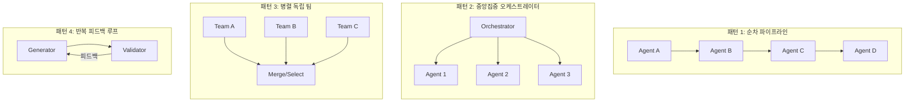
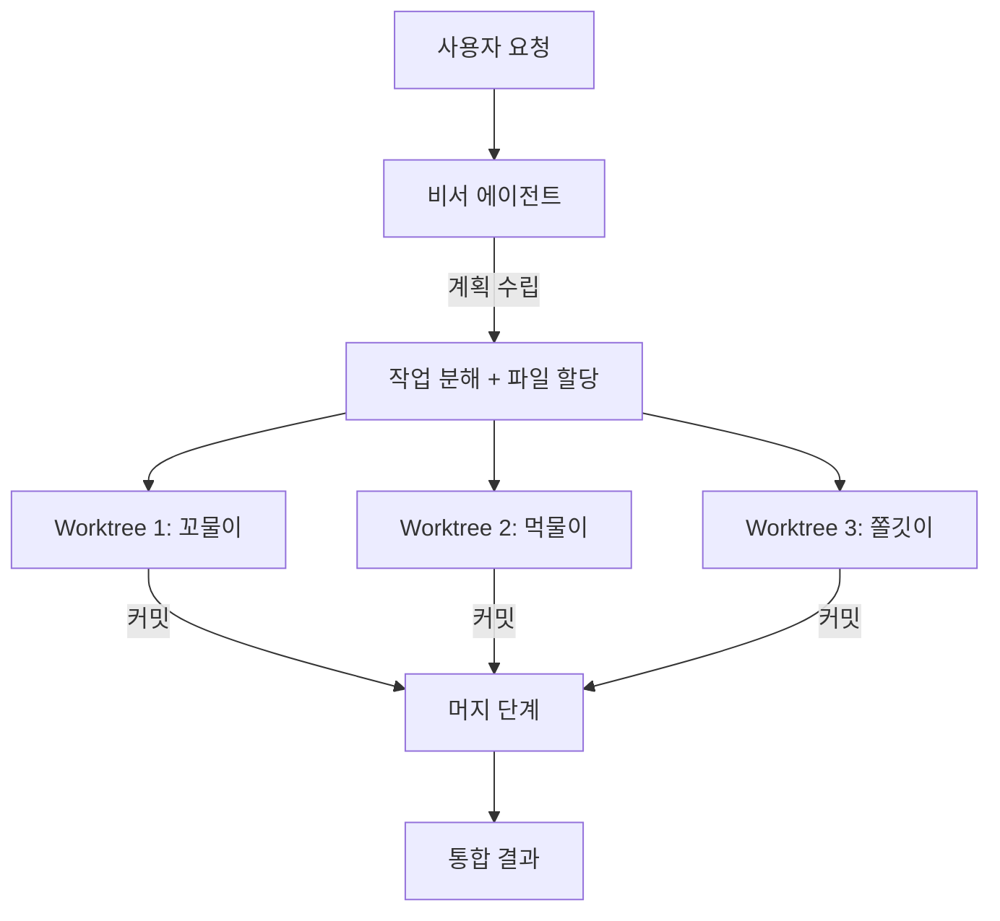
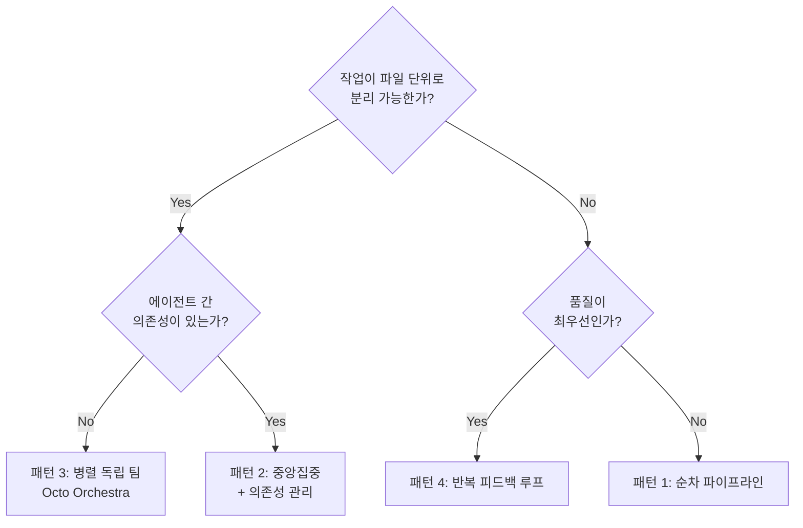
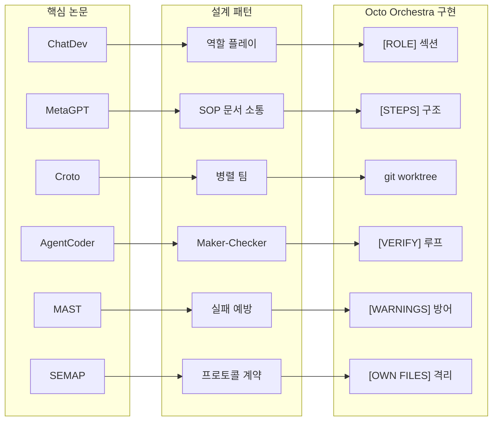
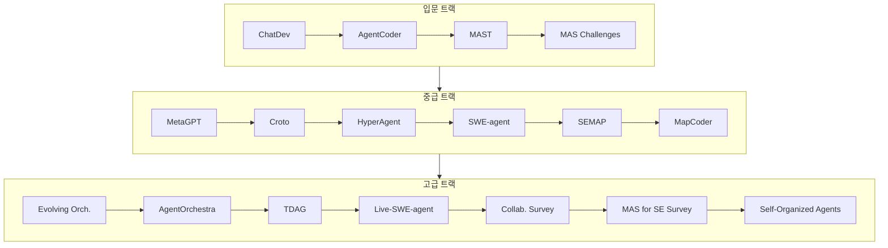

# 멀티에이전트 오케스트레이션 논문 가이드

> 2023~2026년 멀티에이전트 소프트웨어 개발 관련 핵심 논문 분석 및 실전 적용 가이드
> 2026-02-23 대폭 확장.

---

## 목차

1. [문서 개요](#1-문서-개요)
2. [핵심 논문 분류](#2-핵심-논문-분류)
   - [2-1. 역할 기반 에이전트 시스템](#2-1-역할-기반-에이전트-시스템)
   - [2-2. 오케스트레이션 아키텍처](#2-2-오케스트레이션-아키텍처)
   - [2-3. 코드 생성 특화 멀티에이전트](#2-3-코드-생성-특화-멀티에이전트)
   - [2-4. 실전 소프트웨어 엔지니어링 에이전트](#2-4-실전-소프트웨어-엔지니어링-에이전트)
   - [2-5. 실패 분석 & 프로토콜](#2-5-실패-분석--프로토콜)
3. [아키텍처 패턴 비교](#3-아키텍처-패턴-비교)
4. [도구/프레임워크별 논문 매핑](#4-도구프레임워크별-논문-매핑)
5. [실전 적용 체크리스트](#5-실전-적용-체크리스트)
6. [Octo Orchestra 적용 로드맵](#6-octo-orchestra-적용-로드맵)
7. [추천 읽기 순서](#7-추천-읽기-순서)
8. [참고 문헌](#8-참고-문헌)

---

## 1. 문서 개요

이 문서는 Octo Orchestra 및 바이브코딩 환경에서 멀티에이전트 시스템을 설계할 때 참고할 수 있는 주요 연구 논문들을 **실전 가이드** 형태로 정리한 것입니다.

**상세 논문 분석 원본**: [멀티에이전트 & 오케스트레이션 논문 종합 조사](../vibe-coding/papers/multi-agent-orchestration-papers.md)

### 이 가이드의 목적

1. **카테고리별 심층 분석**: 각 논문 카테고리의 핵심 아이디어와 차이점을 깊이 있게 비교
2. **아키텍처 패턴 비교**: Mermaid 다이어그램으로 주요 패턴을 시각적으로 비교
3. **실전 체크리스트**: 프로젝트에 MAS를 도입할 때의 구체적 확인사항
4. **도구-논문 매핑**: 어떤 도구/프레임워크가 어떤 논문의 아이디어를 구현하는지 매핑
5. **추천 읽기 순서**: 입문/중급/고급 트랙별 논문 읽기 순서

### 대상 독자

- MAS를 프로젝트에 도입하려는 개발자/아키텍트
- Octo Orchestra를 사용하거나 확장하려는 팀
- 바이브코딩에서 멀티에이전트 오케스트레이션을 활용하려는 사용자
- 멀티에이전트 시스템 연구를 시작하려는 학생/연구자

---

## 2. 핵심 논문 분류

### 2-1. 역할 기반 에이전트 시스템

역할 기반 시스템은 소프트웨어 개발 조직을 에이전트로 시뮬레이션하는 접근이다. 각 에이전트에 CEO, CTO, 프로그래머, 테스터 등 구체적 역할을 부여하여 전문성을 활성화한다.

#### ChatDev (ACL 2024)

- **핵심 아이디어**: 대화 기반 가상 소프트웨어 회사 시뮬레이션
- **메커니즘**: Chat Chain — 전체 프로세스를 원자적 채팅 세션으로 분해, 각 세션에서 두 역할이 대화로 하위 작업 해결
- **장점**: 유연한 협업, 자연어가 통합 브릿지 역할
- **한계**: 대화 기반이라 정보 전달 효율이 낮을 수 있음, 대화가 길어지면 컨텍스트 드리프트 발생
- **적용 포인트**: 에이전트별 명확한 역할 시스템 프롬프트 설계
- **논문 링크**: [arxiv.org/abs/2307.07924](https://arxiv.org/abs/2307.07924)

#### MetaGPT (ICLR 2024)

- **핵심 아이디어**: SOP(표준 운영 절차) 기반 문서 소통
- **ChatDev와의 핵심 차이**: 대화 대신 **구조화된 문서**(PRD, 시스템 설계서, 태스크 목록)로 소통
- **장점**: 정보 누락/무관한 내용 방지, 복잡한 작업에서 일관성 높음
- **한계**: 정형화된 SOP가 필요하므로 새로운 유형의 작업에 적응이 느림
- **적용 포인트**: PRD → System Design → Task List 계층 구조
- **논문 링크**: [arxiv.org/abs/2308.00352](https://arxiv.org/abs/2308.00352)

#### HyperAgent (2024)

- **4역할 시스템**: Planner → Navigator → Code Editor → Executor
- **장점**: SE 작업의 전체 라이프사이클을 4단계로 명확히 분리
- **한계**: 역할 간 전환 비용 존재, 단순 작업에는 과도
- **적용 포인트**: 계획 → 탐색 → 편집 → 검증의 명확한 4단계
- **논문 링크**: [openreview.net/forum?id=PZf4RsPMBG](https://openreview.net/forum?id=PZf4RsPMBG)

#### 카테고리 종합 비교

| 특성 | ChatDev | MetaGPT | HyperAgent |
|------|---------|---------|------------|
| 소통 방식 | 대화 | 구조화된 문서 | 파이프라인 전달 |
| 에이전트 수 | 6+ | 5 | 4 |
| 조직 모델 | 소프트웨어 회사 | 조립 라인 | 워크플로우 |
| 환각 방지 | 대화 중 상호 검증 | SOP + 중간 검증 | 단계별 게이트 |
| 복잡도 | 중간 | 높음 | 중간 |
| 적합한 작업 | 프로토타이핑 | 대규모 프로젝트 | SE 작업 전반 |

**핵심 교훈**: 역할을 명시적으로 부여하면 에이전트의 전문성이 활성화된다. 소통 방식(대화 vs 문서)은 작업 복잡도에 따라 선택해야 한다.

---

### 2-2. 오케스트레이션 아키텍처

오케스트레이션 아키텍처는 여러 에이전트를 조율하는 방법에 초점을 맞춘다. 정적 구조부터 RL 기반 동적 구조까지 다양한 접근이 존재한다.

#### Evolving Orchestration (NeurIPS 2025)

- **Puppeteer 패러다임**: RL 기반 중앙 오케스트레이터가 에이전트 순서/우선순위를 동적으로 학습
- **핵심 혁신**: 정적 구조 → 동적 구조로 진화, 성능 향상 + 비용 감소 동시 달성
- **적용 포인트**: 에이전트 완료 순서에 따른 동적 작업 조정
- **논문 링크**: [arxiv.org/abs/2505.19591](https://arxiv.org/abs/2505.19591)

#### Cross-Team Orchestration — Croto (2024)

- **패턴**: 독립 팀 병렬 → 교차 협업 → 최적 솔루션 통합
- **핵심 가치**: 다양한 솔루션 경로를 동시에 탐색하여 해결 경로 다양성 확보
- **적용 포인트**: git worktree 기반 병렬 에이전트 패턴 (Octo Orchestra의 핵심 패턴)
- **논문 링크**: [arxiv.org/abs/2406.08979](https://arxiv.org/abs/2406.08979)

#### AgentOrchestra — TEA Protocol (2025)

- **TEA**: Tool, Environment, Agent를 일급 자원(first-class resource)으로 모델링
- **성과**: GAIA 벤치마크 89.04% (SOTA)
- **핵심 혁신**: 라이프사이클 관리 + 버전 관리 + 자기 진화
- **적용 포인트**: 워크트리 라이프사이클(preflight → running → merging → cleanup)
- **논문 링크**: [arxiv.org/abs/2506.12508](https://arxiv.org/abs/2506.12508)

#### TDAG (Neural Networks 2024)

- **동적 작업 분해**: 작업 진행 중 점진적으로 하위 작업 발견 + 맞춤형 에이전트 자동 생성
- **핵심 가치**: 예측 불가능한 실세계 작업에 적응
- **적용 포인트**: 비서 에이전트가 진행 상황 모니터링 → 추가 에이전트 동적 생성
- **논문 링크**: [arxiv.org/abs/2402.10178](https://arxiv.org/abs/2402.10178)

#### 카테고리 종합 비교

| 특성 | Evolving Orch. | Croto | AgentOrchestra | TDAG |
|------|---------------|-------|----------------|------|
| 구조 | 중앙집중 동적 | 분산 병렬 | 계층적 | 동적 트리 |
| 조율 방식 | RL 학습 | 교차 인사이트 | TEA 프로토콜 | 점진적 분해 |
| 에이전트 생성 | 사전 정의 | 사전 정의 | 동적 인스턴스 | 동적 생성 |
| 확장성 | 중간 | 높음 | 높음 | 매우 높음 |
| Octo 유사도 | 중간 | **매우 높음** | 높음 | 중간 |

**핵심 교훈**: Croto의 병렬 독립 팀 패턴이 Octo Orchestra의 git worktree 패턴과 가장 유사하다. TDAG의 동적 에이전트 생성은 향후 비서 에이전트 진화의 방향성을 제시한다.

---

### 2-3. 코드 생성 특화 멀티에이전트

코드 생성에 특화된 멀티에이전트 시스템은 인간 개발자의 워크플로우를 모방한다.

#### MapCoder (ACL 2024)

- **4단계 파이프라인**: Retrieval Agent → Planning Agent → Coding Agent → Debugging Agent
- **성과**: HumanEval 93.9%, MBPP 83.1%, CodeContests 28.5%
- **핵심 가치**: 유사 예제 검색(Retrieval) 단계가 코드 품질을 크게 향상
- **적용 포인트**: 계획 수립 시 코드베이스 탐색을 필수 1단계로 포함
- **논문 링크**: [arxiv.org/abs/2405.11403](https://arxiv.org/abs/2405.11403)

#### AgentCoder (2023)

- **3역할 반복 루프**: Programmer ↔ Test Designer ↔ Test Executor
- **성과**: HumanEval 96.3% (SOTA), 토큰 사용량 59% 절감
- **핵심 발견**: 전문 에이전트의 반복 피드백이 단일 에이전트 + 복잡한 프롬프트보다 정확도 높고 비용 낮음
- **적용 포인트**: Maker-Checker 패턴의 실증적 유효성 입증
- **논문 링크**: [arxiv.org/abs/2312.13010](https://arxiv.org/abs/2312.13010)

#### Self-Organized Agents — SoA (2024)

- **핵심 혁신**: 중앙 오케스트레이터 없이 에이전트가 자율적으로 역할/작업 결정
- **대규모 대응**: 수천 줄 이상의 복잡한 프로젝트 코드 생성 가능
- **적용 포인트**: 장기적으로 에이전트 자율성을 높이는 방향
- **논문 링크**: [arxiv.org/abs/2404.02183](https://arxiv.org/abs/2404.02183)

#### 카테고리 종합 비교

| 특성 | MapCoder | AgentCoder | SoA |
|------|----------|------------|-----|
| 접근 | 순차 파이프라인 | 반복 루프 | 자기 조직화 |
| 에이전트 수 | 4 | 3 | 동적 |
| HumanEval | 93.9% | **96.3%** | ~92% |
| 토큰 효율 | 보통 | **매우 높음** | 낮음 |
| 강점 | 검색 + 계획 | 테스트 피드백 | 대규모 코드 |

**핵심 교훈**: AgentCoder의 반복 피드백 루프가 가장 효율적이다. 검색(Retrieval) 단계를 추가하면 품질이 향상된다.

---

### 2-4. 실전 소프트웨어 엔지니어링 에이전트

실제 소프트웨어 엔지니어링 문제(GitHub 이슈 수정, 코드 리팩토링 등)를 해결하는 에이전트들이다.

#### SWE-agent (2024)

- **핵심 통찰**: LLM 에이전트는 **전용 인터페이스**(ACI)가 필요한 새로운 종류의 사용자
- **성과**: SWE-bench 12.5% pass@1 (당시 SOTA)
- **적용 포인트**: 도구/인터페이스 품질이 에이전트 성능에 직결
- **논문 링크**: [arxiv.org/abs/2405.15793](https://arxiv.org/abs/2405.15793)

#### Live-SWE-agent (2025)

- **핵심 혁신**: bash 도구만으로 시작 → 런타임에 자기 스캐폴드를 자율 진화
- **성과**: SWE-bench Verified **77.4%** (전체 최고, 독점 포함)
- **적용 포인트**: 장기적으로 오케스트라 비서가 사용 경험에서 학습
- **논문 링크**: [arxiv.org/abs/2511.13646](https://arxiv.org/abs/2511.13646)

#### Agentless (2024)

- **접근**: 에이전트 없이 3단계(Localization → Repair → Patch Validation)로 문제 해결
- **시사점**: 모든 작업에 복잡한 MAS가 필요하지는 않음, 적절한 복잡도 선택이 중요
- **적용 포인트**: 단순 버그 수정은 단일 에이전트가 더 효율적

**핵심 교훈**: 인터페이스 설계가 중요하며, 작업 복잡도에 맞는 에이전트 수를 선택해야 한다.

---

### 2-5. 실패 분석 & 프로토콜

멀티에이전트 시스템이 왜 실패하는지, 어떻게 방지할 수 있는지에 대한 연구이다.

#### MAST (2025) — 멀티에이전트 시스템 실패 분류

- **데이터**: 7개 프레임워크, 1,600+ 트레이스, 14가지 실패 모드 분류
- **3대 실패 카테고리**:
  1. 시스템 설계 문제 (작업 분배, 역할 중복, 오케스트레이션 결함)
  2. 에이전트 간 불일치 (소통 실패, 컨텍스트 손실, 상충 행동)
  3. 작업 검증 문제 (검증 부재, 완료 조건 모호, 부분 완료)
- **높은 일치도**: inter-annotator agreement κ = 0.88
- **논문 링크**: [arxiv.org/abs/2503.13657](https://arxiv.org/abs/2503.13657)

#### SEMAP (2025) — 프로토콜 기반 MAS 실패 방지

- **핵심 문제**: Under-specification, Coordination Misalignment, Inappropriate Verification
- **해법**: SE 설계 원칙을 프로토콜 레이어로 구현 (행동 계약 + 구조화된 메시지 + 라이프사이클 검증)
- **성과**: 총 실패 **69.6% 감소** (함수 레벨), **56.7% 감소** (배포 레벨)
- **논문 링크**: [arxiv.org/abs/2510.12120](https://arxiv.org/abs/2510.12120)

#### Multi-Agent Collaboration Mechanisms Survey (2025)

- **분류 프레임워크**: 5차원 (Actors, Types, Structures, Strategies, Protocols)
- **가치**: MAS 설계 시 각 차원에서 의식적으로 선택할 수 있는 체계적 프레임워크 제공
- **논문 링크**: [arxiv.org/abs/2501.06322](https://arxiv.org/abs/2501.06322)

#### MAS Challenges (2024, 2026 개정)

- **4대 도전 과제**: 작업 할당 최적화, 추론 강화, 컨텍스트 관리, 메모리 시스템
- **논문 링크**: [arxiv.org/abs/2402.03578](https://arxiv.org/abs/2402.03578)

**핵심 교훈**: SEMAP이 입증하듯 구조화된 프롬프트와 명시적 계약만으로도 실패를 70% 가까이 줄일 수 있다. Octo Orchestra의 `[GOAL]`, `[STEPS]`, `[VERIFY]`, `[WARNINGS]` 시스템이 이 원칙과 일치한다.

---

## 3. 아키텍처 패턴 비교

### 3-1. 주요 패턴 분류

멀티에이전트 시스템의 아키텍처 패턴을 크게 4가지로 분류할 수 있다.

### 3-2. 패턴별 논문 매핑

| 패턴 | 대표 논문 | 적합한 작업 | 장점 | 단점 |
|------|----------|------------|------|------|
| **순차 파이프라인** | MapCoder, MetaGPT, HyperAgent | 잘 정의된 순차 작업 | 구현 단순, 디버깅 용이 | 유연성 부족, 병목 발생 가능 |
| **중앙집중 오케스트레이터** | Evolving Orch., AgentOrchestra | 복잡한 조율이 필요한 작업 | 전역 최적화 가능, 동적 조정 | 오케스트레이터 병목, 단일 장애점 |
| **병렬 독립 팀** | Croto, **Octo Orchestra** | 파일 레벨 분할 가능한 작업 | 속도, 확장성, 격리 | 머지 비용, 중복 작업 가능 |
| **반복 피드백 루프** | AgentCoder, ChatDev | 품질이 중요한 코드 생성 | 높은 정확도, 토큰 효율 | 수렴 보장 없음, 무한 루프 위험 |

### 3-3. Octo Orchestra의 아키텍처 분석

**Octo Orchestra는 패턴 3(병렬 독립 팀) + 패턴 1(순차 파이프라인)의 하이브리드**:
- 병렬 단계: 각 에이전트가 독립 워크트리에서 동시 작업
- 순차 단계: 비서 계획 → 에이전트 실행 → 머지/검증

### 3-4. 패턴 선택 가이드

---

## 4. 도구/프레임워크별 논문 매핑

### 4-1. 역할 기반 접근

| 도구/프레임워크 | 기반 논문 | 핵심 패턴 | 구현 방식 |
|----------------|----------|----------|----------|
| **ChatDev** (GitHub) | ChatDev | Chat Chain + 역할 플레이 | Python, OpenAI API |
| **MetaGPT** (GitHub) | MetaGPT | SOP 기반 문서 소통 | Python, 다양한 LLM |
| **Octo Orchestra** | Croto + MAST + MetaGPT | 병렬 워크트리 + 파일 격리 | Shell/TS, Claude Code |

### 4-2. 오케스트레이션 접근

| 도구/프레임워크 | 기반 논문 | 핵심 패턴 | 구현 방식 |
|----------------|----------|----------|----------|
| **OpenHands** | SWE-agent, Agentless | ACI + 다중 도구 | Python, 다양한 LLM |
| **SWE-agent** | SWE-agent | Agent-Computer Interface | Python, CLI |
| **Claude Code Teams** | Croto, AgentOrchestra | 팀 기반 병렬 작업 | Claude API |

### 4-3. 프로토콜 기반 접근

| 프로토콜 | 기반 논문 | 목적 | 구현 상태 |
|---------|----------|------|----------|
| **A2A** (Google) | SEMAP | 에이전트 간 HTTP 기반 통신 | 프로덕션 |
| **MCP** (Anthropic) | SWE-agent (ACI 확장) | 모델-도구 연결 표준 | 프로덕션 |
| **ACP** (IBM) | Multi-Agent Collab. Survey | 비동기 에이전트 통신 | 개발 중 |
| **ANP** | Multi-Agent Collab. Survey | 에이전트 네트워크 프로토콜 | 초기 |

### 4-4. 논문 → 도구 연결 다이어그램

---

## 5. 실전 적용 체크리스트

### 5-1. MAS 도입 전 확인사항

프로젝트에 멀티에이전트 시스템을 도입하기 전에 다음을 확인한다.

#### 필요성 평가

- [ ] **작업 규모**: 단일 에이전트로 처리하기 어려운 규모인가? (파일 10개 이상 수정, 여러 모듈 동시 변경)
- [ ] **분할 가능성**: 작업을 독립적인 하위 작업으로 분할할 수 있는가?
- [ ] **시간 압박**: 병렬 처리로 시간을 절약할 필요가 있는가?
- [ ] **비용 대비 효과**: MAS의 추가 토큰 비용이 시간 절약으로 상쇄되는가?

> **판단 기준**: 4개 중 3개 이상 Yes이면 MAS 도입 권장, 2개 이하면 단일 에이전트 권장

#### 아키텍처 선택

- [ ] **패턴 결정**: 위 [패턴 선택 가이드](#3-4-패턴-선택-가이드) 차트에 따라 패턴 선택
- [ ] **에이전트 수**: 최소 필요 에이전트 수 결정 (보통 2~5개, Microsoft의 "가장 낮은 복잡도" 원칙)
- [ ] **역할 정의**: 각 에이전트의 역할, 담당 파일, 목표를 명확히 정의
- [ ] **의존성 그래프**: 에이전트 간 의존성 파악 (순서가 중요한 작업 식별)

#### 실패 방지 설계

- [ ] **파일 격리**: 에이전트별 파일 소유권 배타적 할당 (`[OWN FILES]` + `[DO NOT TOUCH]`)
- [ ] **검증 게이트**: 각 에이전트에 `[VERIFY]` 단계 포함 (컴파일, 테스트, 린트)
- [ ] **수정 횟수 제한**: 무한 루프 방지를 위한 최대 시도 횟수 설정 (max 3)
- [ ] **방어적 프롬프트**: `[WARNINGS]` 섹션으로 흔한 실패 패턴 방어
- [ ] **완료 조건**: 객관적 완료 판단 기준 설정 (테스트 통과, 커밋 존재)

### 5-2. 에이전트 프롬프트 설계 체크리스트

각 에이전트의 프롬프트에 다음이 포함되어야 한다:

- [ ] **`[ROLE]`**: 역할 정체성 선언 (전문 분야, 성향, 작업 스타일)
- [ ] **`[GOAL]`**: 명확하고 측정 가능한 목표 1줄
- [ ] **`[OWN FILES]`**: 수정 가능한 파일 목록 (명시적)
- [ ] **`[DO NOT TOUCH]`**: 절대 수정하면 안 되는 파일 목록
- [ ] **`[STEPS]`**: 순서가 있는 구체적 실행 단계 (5~10개)
- [ ] **`[VERIFY]`**: 스택별 구체적 테스트/검증 절차
- [ ] **`[WARNINGS]`**: 흔한 실패 패턴에 대한 방어 지시
- [ ] **`[SPECS]`**: 코딩 스타일, 언어, 형식 요구사항

### 5-3. 실행 중 모니터링 체크리스트

- [ ] **진행 상황 추적**: 에이전트별 커밋 수, 마지막 활동 시간 확인
- [ ] **막힘 감지**: 5분 이상 커밋 없는 에이전트 확인
- [ ] **파일 충돌 예방**: git diff로 에이전트가 할당 외 파일 수정했는지 확인
- [ ] **토큰 소비 모니터링**: 예상 대비 과도한 토큰 사용 감지

### 5-4. 머지 & 완료 체크리스트

- [ ] **커밋 확인**: 모든 에이전트가 최소 1개 커밋을 생성했는지 확인
- [ ] **파일 충돌 분석**: 머지 전 에이전트 간 파일 겹침 여부 분석
- [ ] **머지 순서**: 의존성 그래프에 따른 순서대로 머지
- [ ] **통합 테스트**: 머지 후 전체 테스트 스위트 실행
- [ ] **결과 보고**: 성공/실패/부분 완료 기록 → 다음 세션에 참고

---

## 6. Octo Orchestra 적용 로드맵

### 6-1. 즉시 적용 가능 (Short-term)

| 아이디어 | 출처 논문 | 적용 방법 | 예상 효과 |
|----------|----------|-----------|----------|
| 역할 시스템 강화 | ChatDev, MetaGPT | 프롬프트 시작에 `[ROLE]` 섹션 추가 | 전문성 활성화, 역할 일탈 방지 |
| 구조화된 계획 산출물 | MetaGPT | PRD → Design → Task List 계층 | 계획 품질 향상, 누락 방지 |
| 테스트 루프 강화 | AgentCoder | `[VERIFY]`에 스택별 구체적 테스트 절차 | 코드 품질 향상, 실패 감소 |
| 방어적 프롬프트 | MAST, SEMAP | `[WARNINGS]` 섹션으로 실패 방어 | 실패 69.6% 감소 (SEMAP 실증) |
| 결과 보고서 | MetaGPT | 완료 시 `/tmp/octo-report-{nickname}.md` 생성 | 머지 순서 최적화, 상태 파악 |
| 코드 수정 규칙 강화 | MAST (F6, F13) | `=== CODE MODIFICATION RULES ===` 섹션 | 기존 코드 삭제 방지 |

### 6-2. 중기 로드맵 (Medium-term)

| 아이디어 | 출처 논문 | 설명 | 복잡도 |
|----------|----------|------|--------|
| 교차 검증 | Croto | 에이전트 작업 완료 후 다른 에이전트가 리뷰 | 중간 |
| 동적 재할당 | TDAG, Evolving Orch. | 비서가 진행 상황 모니터링 + 동적 조정 | 높음 |
| Maker-Checker 분리 | AgentCoder | 개발 에이전트와 QA 에이전트 분리 | 중간 |
| 의존성 기반 순서 실행 | AgentOrchestra | A 완료 → B 시작 패턴 지원 | 중간 |

### 6-3. 장기 비전 (Long-term)

| 아이디어 | 출처 논문 | 설명 | 복잡도 |
|----------|----------|------|--------|
| 자기 진화 비서 | Live-SWE-agent | 결과 로그 기반 계획/할당 전략 학습 | 매우 높음 |
| 모델별 역할 할당 | AgentOrchestra | 작업 복잡도 → 적절한 모델 자동 선택 | 높음 |
| 에이전트 자기 조직화 | SoA | 비서 없이 에이전트들이 자율 조율 | 매우 높음 |

---

## 7. 추천 읽기 순서

### 7-1. 입문 트랙 (MAS 처음 접하는 경우)

**목표**: MAS의 기본 개념과 주요 패턴을 이해한다.

| 순서 | 논문 | 읽는 이유 | 예상 시간 |
|------|------|----------|----------|
| 1 | **ChatDev** | 가장 직관적인 MAS 구조. 소프트웨어 회사를 에이전트로 시뮬레이션하는 개념이 이해하기 쉬움 | 1시간 |
| 2 | **AgentCoder** | 단순하고 효과적인 3역할 패턴. MAS의 핵심 가치(전문화 + 피드백)를 가장 명확히 보여줌 | 45분 |
| 3 | **MAST** | MAS가 왜 실패하는지 이해. 이것을 먼저 알아야 좋은 설계를 할 수 있음 | 1시간 |
| 4 | **MAS Challenges** | 4대 도전 과제를 통해 MAS 설계 시 고려사항 전체 조감 | 30분 |

**입문 트랙 완료 후 이해해야 할 것**:
- 역할 기반 에이전트 시스템의 기본 구조
- Maker-Checker 패턴의 가치
- MAS의 주요 실패 모드와 도전 과제

---

### 7-2. 중급 트랙 (실전 적용을 준비하는 경우)

**목표**: 다양한 아키텍처 패턴을 비교하고, 자신의 프로젝트에 적합한 접근을 선택할 수 있다.

| 순서 | 논문 | 읽는 이유 | 예상 시간 |
|------|------|----------|----------|
| 1 | **MetaGPT** | ChatDev의 한계를 극복한 SOP 기반 접근. 구조화된 문서 소통의 가치 이해 | 1시간 |
| 2 | **Croto** | 병렬 팀 패턴. Octo Orchestra의 이론적 기반 | 45분 |
| 3 | **HyperAgent** | 4역할 모델로 SE 작업의 라이프사이클 이해 | 45분 |
| 4 | **SWE-agent** | ACI 개념으로 에이전트-도구 인터페이스의 중요성 이해 | 1시간 |
| 5 | **SEMAP** | 프로토콜 기반 실패 방지. 실전에서 가장 즉시 적용 가능 | 1시간 |
| 6 | **MapCoder** | 4단계 파이프라인 + 벤치마크 성과 분석 | 45분 |

**중급 트랙 완료 후 할 수 있는 것**:
- 프로젝트에 적합한 MAS 패턴 선택
- 에이전트 프롬프트를 SEMAP 원칙에 맞게 설계
- 실패 방지 체크리스트 적용

---

### 7-3. 고급 트랙 (MAS 아키텍처를 설계/확장하는 경우)

**목표**: 최첨단 MAS 아키텍처를 이해하고, 자체 시스템을 설계할 수 있다.

| 순서 | 논문 | 읽는 이유 | 예상 시간 |
|------|------|----------|----------|
| 1 | **Evolving Orchestration** | RL 기반 동적 오케스트레이션의 최전선 | 1.5시간 |
| 2 | **AgentOrchestra (TEA)** | 라이프사이클 + 버전 관리 + 자기 진화의 완전한 프레임워크 | 1.5시간 |
| 3 | **TDAG** | 동적 작업 분해 + 에이전트 자동 생성의 이론적 기반 | 1시간 |
| 4 | **Live-SWE-agent** | 자기 진화의 실전 구현과 벤치마크 증명 | 1시간 |
| 5 | **Multi-Agent Collaboration Mechanisms Survey** | 5차원 분류 체계로 MAS 전체 설계 공간 이해 | 2시간 |
| 6 | **MAS for SE Survey (ACM TOSEM)** | SDLC 전 단계에서의 MAS 종합 분석 | 2시간 |
| 7 | **Self-Organized Agents** | 중앙 오케스트레이터 없는 자기 조직화 패턴 | 1시간 |

**고급 트랙 완료 후 할 수 있는 것**:
- MAS 아키텍처를 자체 설계
- 동적 에이전트 생성/진화 시스템 구현
- 논문의 아이디어를 실전 시스템에 통합

---

### 7-4. 읽기 순서 다이어그램

---

## 8. 참고 문헌

### 역할 기반 시스템
- [ChatDev: Communicative Agents for Software Development](https://arxiv.org/abs/2307.07924) — ACL 2024
- [MetaGPT: Meta Programming for A Multi-Agent Collaborative Framework](https://arxiv.org/abs/2308.00352) — ICLR 2024
- [HyperAgent: Generalist Software Engineering Agents](https://openreview.net/forum?id=PZf4RsPMBG) — 2024

### 오케스트레이션 아키텍처
- [Multi-Agent Collaboration via Evolving Orchestration](https://arxiv.org/abs/2505.19591) — NeurIPS 2025
- [Multi-Agent Collaboration via Cross-Team Orchestration](https://arxiv.org/abs/2406.08979) — 2024
- [AgentOrchestra: TEA Protocol](https://arxiv.org/abs/2506.12508) — 2025
- [TDAG: Dynamic Task Decomposition and Agent Generation](https://arxiv.org/abs/2402.10178) — Neural Networks 2024

### 코드 생성
- [MapCoder: Multi-Agent Code Generation](https://arxiv.org/abs/2405.11403) — ACL 2024
- [AgentCoder: Multi-Agent Code Generation with Iterative Testing](https://arxiv.org/abs/2312.13010) — 2023
- [Self-Organized Agents: Ultra Large-Scale Code Generation](https://arxiv.org/abs/2404.02183) — 2024

### 소프트웨어 엔지니어링 에이전트
- [SWE-agent: Agent-Computer Interfaces](https://arxiv.org/abs/2405.15793) — 2024
- [Live-SWE-agent: Self-Evolve on the Fly](https://arxiv.org/abs/2511.13646) — 2025

### 프로토콜 & 협업 메커니즘
- [Towards Engineering Multi-Agent LLMs: A Protocol-Driven Approach (SEMAP)](https://arxiv.org/abs/2510.12120) — 2025
- [Multi-Agent Collaboration Mechanisms: A Survey of LLMs](https://arxiv.org/abs/2501.06322) — 2025

### 벤치마크
- [SWE-bench Pro: Long-Horizon Software Engineering Tasks](https://arxiv.org/abs/2509.16941) — 2025
- [SWE-EVO: Benchmarking Coding Agents in Long-Horizon Software Evolution](https://arxiv.org/abs/2512.18470) — 2025/2026

### 서베이 & 분석
- [LLM-Based Multi-Agent Systems for SE: Literature Review](https://arxiv.org/abs/2404.04834) — ACM TOSEM
- [Why Do Multi-Agent LLM Systems Fail?](https://arxiv.org/abs/2503.13657) — 2025
- [LLM Multi-Agent Systems: Challenges and Open Problems](https://arxiv.org/abs/2402.03578) — 2024
- [Large Language Model based Multi-Agents: A Survey](https://arxiv.org/abs/2402.01680) — 2024
- [The Orchestration of Multi-Agent Systems](https://arxiv.org/abs/2601.13671) — 2025
- [AI Agent Orchestration Patterns — Microsoft Azure](https://learn.microsoft.com/en-us/azure/architecture/ai-ml/guide/ai-agent-design-patterns) — 2026
