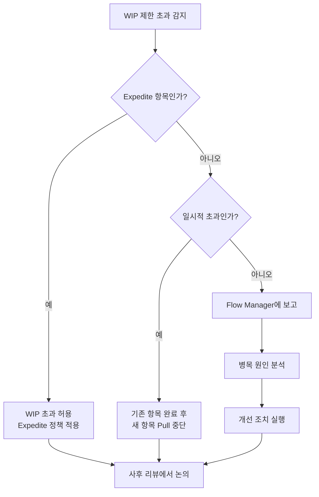
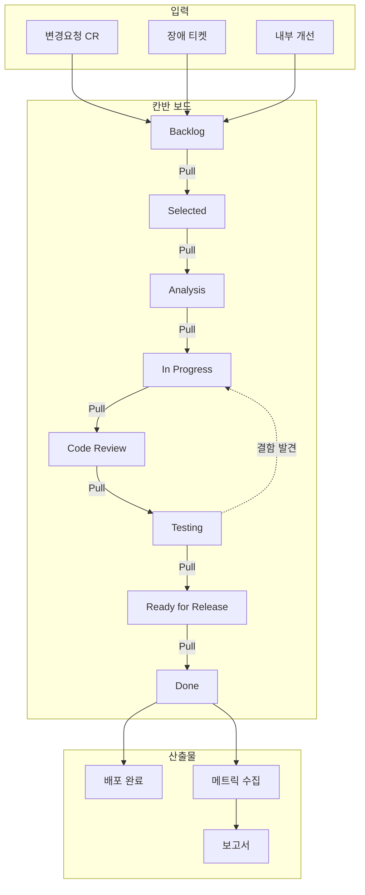

# 칸반 보드 설계서 (Kanban Board Design)

| 항목 | 내용 |
|------|------|
| **프로젝트명** | [프로젝트명] |
| **문서 버전** | [v1.0] |
| **작성일** | [YYYY-MM-DD] |
| **작성자** | [작성자명 / 소속] |
| **승인자** | [승인자명 / 직책] |

---

## 변경 이력

| 버전 | 일자 | 작성자 | 변경 내용 |
|------|------|--------|-----------|
| v1.0 | [YYYY-MM-DD] | [작성자] | 초안 작성 |
| v1.1 | [YYYY-MM-DD] | [작성자] | [변경 사항 기술] |
| v1.2 | [YYYY-MM-DD] | [작성자] | [변경 사항 기술] |

---

## 1. 보드 개요

### 1.1 보드 목적

본 칸반 보드는 **[프로젝트명]** 시스템의 유지보수 및 운영 작업을 시각화하고, 작업 흐름을 관리하며, 병목을 조기에 식별하여 지속적 개선을 달성하기 위한 목적으로 설계한다.

### 1.2 대상 팀

| 항목 | 내용 |
|------|------|
| 운영 주체 | [운영팀명] |
| 참여 인원 | [N]명 |
| 역할 구성 | 개발자 [N]명, QA [N]명, 운영 [N]명, PM [N]명 |
| 이해관계자 | [고객사명], [내부 부서명] |

### 1.3 관리 주체

| 역할 | 담당자 | 책임 |
|------|--------|------|
| 보드 관리자 (Board Owner) | [담당자명] | 보드 구조 변경, 정책 수립 |
| Flow Manager | [담당자명] | 일일 흐름 관리, 병목 해소 |
| Service Delivery Manager | [담당자명] | SLE 모니터링, 고객 커뮤니케이션 |

### 1.4 사용 도구

| 도구 | 용도 | URL |
|------|------|-----|
| [Jira / Azure DevOps / Trello 등] | 칸반 보드 운영 | [URL] |
| [Confluence / Notion 등] | 문서 관리 | [URL] |
| [Slack / Teams 등] | 커뮤니케이션 | [URL] |

---

## 2. 열(Column) 구조

### 2.1 보드 열 정의

```mermaid
flowchart LR
    A[Backlog] --> B[Selected]
    B --> C[Analysis]
    C --> D[In Progress]
    D --> E[Code Review]
    E --> F[Testing]
    F --> G[Ready for Release]
    G --> H[Done]

    style A fill:#f0f0f0,stroke:#999
    style B fill:#e8f4fd,stroke:#4a90d9
    style C fill:#fff3cd,stroke:#ffc107
    style D fill:#d4edda,stroke:#28a745
    style E fill:#e2d5f1,stroke:#6f42c1
    style F fill:#fce4ec,stroke:#e91e63
    style G fill:#e0f2f1,stroke:#009688
    style H fill:#c8e6c9,stroke:#4caf50
```



### 2.2 열별 상세 정의

| 열 이름 | 정의 | 진입 기준 | 완료 기준 | WIP 제한 |
|---------|------|----------|----------|---------|
| **Backlog** | 식별된 모든 작업 항목의 대기열 | CR 접수 또는 내부 식별 | 우선순위 부여 완료 | 제한 없음 |
| **Selected** | 다음 작업 대상으로 선정된 항목 | 우선순위에 따른 선정 | 담당자 지정, 분석 준비 완료 | [N] |
| **Analysis** | 요구사항 분석 및 영향도 분석 진행 | 담당자 지정 완료 | 영향 분석 완료, 작업 산정 완료 | [N] |
| **In Progress** | 개발/수정 작업 진행 중 | 분석 완료, 작업 계획 수립 | 코드 작성 완료, 단위 테스트 통과 | [N] |
| **Code Review** | 코드 리뷰 진행 중 | PR 생성, 단위 테스트 통과 | 리뷰어 승인, 리뷰 지적 사항 반영 | [N] |
| **Testing** | QA 테스트 진행 중 | 코드 리뷰 완료, 테스트 환경 배포 | 테스트 케이스 통과, QA 승인 | [N] |
| **Ready for Release** | 배포 대기 상태 | QA 승인 완료 | 배포 실행 | [N] |
| **Done** | 배포 완료 및 검증 완료 | 운영 환경 배포 완료 | 운영 검증 완료, 고객 확인 | 제한 없음 |

### 2.3 열별 상세 정책

#### Backlog

- **관리 방법**: 주 1회 Backlog Refinement 미팅에서 항목 정리
- **정렬 기준**: Class of Service > 비즈니스 가치 > 요청일 순서
- **항목 유효 기간**: [N]일 이상 미처리 항목은 Stale로 표시, [N]일 초과 시 폐기 검토
- **입력 소스**: 변경요청(CR), 장애 티켓, 내부 개선 제안, 기술 부채 목록

#### Selected

- **선정 주기**: Pull 발생 시 (작업 여유 발생 시 즉시)
- **선정 기준**: Class of Service 우선순위 정책에 따름
- **선정 주체**: Flow Manager 또는 팀원 자율 Pull
- **최대 대기 시간**: Selected에서 [N]영업일 이내 Analysis 진입 필수

#### Analysis

- **분석 항목**: 요구사항 명확화, 기술 영향도, 소요 시간 산정, 위험 식별
- **산출물**: 영향 분석서 (소규모 항목은 카드 내 코멘트로 대체 가능)
- **분석 시간 제한**: [N]영업일 이내 완료 (초과 시 에스컬레이션)

#### In Progress

- **작업 규칙**: 1인 1작업 원칙 (동시 진행 최소화)
- **일일 업데이트**: 매일 Stand-up에서 진행 상황 공유
- **차단(Blocked) 처리**: 차단 발생 시 즉시 Blocked 플래그 설정, Flow Manager에 보고

#### Code Review

- **리뷰 SLE**: Pull Request 생성 후 [N]시간 이내 리뷰 시작
- **리뷰어 지정**: 최소 [N]명 리뷰어 승인 필요
- **리뷰 기준**: 코드 품질, 보안, 성능, 테스트 커버리지

#### Testing

- **테스트 범위**: 단위 테스트, 통합 테스트, 회귀 테스트
- **테스트 환경**: [Staging / QA 환경명]
- **결함 발견 시**: In Progress 열로 되돌림 (Pull-back)

#### Ready for Release

- **배포 주기**: [매일 / 주 N회 / 격주]
- **배포 승인**: [승인 권한자]의 배포 승인 필요
- **배포 창(Window)**: [요일] [시간대]

#### Done

- **완료 기준**: 운영 환경 배포 + [N]시간 모니터링 후 이상 없음
- **아카이브**: Done 항목은 [N]일 후 아카이브 처리
- **메트릭 수집**: 리드타임, 사이클타임 자동 기록

---

## 3. WIP(Work In Progress) 제한

### 3.1 리틀의 법칙 (Little's Law)

칸반 시스템의 WIP 제한은 리틀의 법칙에 기반하여 설정한다.

```
평균 리드타임 = 평균 WIP / 평균 처리량(Throughput)
```

- **WIP 감소 → 리드타임 단축**: WIP를 줄이면 개별 항목의 리드타임이 줄어든다
- **WIP 과다 → 컨텍스트 스위칭 증가**: WIP가 많을수록 개인별 작업 전환 비용이 증가한다
- **최적 WIP**: 팀 유휴 시간과 대기 시간의 균형점에서 결정한다

### 3.2 열별 WIP 제한

| 열 | WIP 제한 | 설정 근거 |
|----|---------|----------|
| Backlog | 제한 없음 | 입력 버퍼 역할 |
| Selected | [N] | 다음 작업 대기열 (팀원 수의 1.5배) |
| Analysis | [N] | 분석 담당자 수 기준 |
| In Progress | [N] | 개발자 수 x 1 (1인 1작업 원칙) |
| Code Review | [N] | 동시 리뷰 가능 건수 |
| Testing | [N] | QA 인원 x 2 |
| Ready for Release | [N] | 배포 배치 사이즈 제한 |
| Done | 제한 없음 | 완료 기록 보관 |
| **전체 시스템 WIP** | **[N]** | **팀 전체 동시 진행 상한** |

### 3.3 WIP 초과 시 대응 정책



**WIP 초과 시 행동 규칙**:

1. **즉시 조치**: 새로운 항목의 Pull을 중단한다
2. **현재 작업 완료 집중**: 진행 중인 항목을 빠르게 완료하여 WIP를 낮춘다
3. **Swarming (떼 지어 해결)**: 병목 열에 팀원이 집중하여 해소한다
4. **에스컬레이션**: [N]시간 이상 WIP 초과 지속 시 Flow Manager가 원인 분석

### 3.4 WIP 조정 기준

| 조정 주기 | 평가 항목 | 조정 기준 |
|----------|----------|----------|
| 월 1회 | 열별 평균 대기 시간 | 대기 시간 > 사이클타임의 50%이면 WIP 감소 검토 |
| 월 1회 | 팀원 유휴율 | 유휴율 > 20%이면 WIP 증가 검토 |
| 분기 1회 | 전체 Throughput 추이 | Throughput 정체 시 WIP 실험적 조정 |
| 수시 | 팀 구성 변경 시 | 인원 변동에 따른 비례 조정 |

---

## 4. Swimlane 설계

### 4.1 유지보수 유형별 Swimlane

| Swimlane | 유형 | 정의 | 예시 |
|----------|------|------|------|
| **Corrective (수정)** | 결함 수정 | 운영 중 발견된 결함을 수정하는 작업 | 버그 수정, 오류 패치, 장애 복구 |
| **Adaptive (적응)** | 환경 적응 | 외부 환경 변화에 대응하는 작업 | OS 업그레이드, 라이브러리 업데이트, 규정 변경 대응 |
| **Perfective (완전)** | 기능 개선 | 기존 기능을 향상시키는 작업 | 성능 개선, UI 개선, 새 기능 추가 |
| **Preventive (예방)** | 예방 활동 | 미래 문제를 사전에 방지하는 작업 | 기술 부채 해소, 리팩토링, 모니터링 강화 |

### 4.2 Swimlane별 WIP 할당

| Swimlane | WIP 할당 비율 | WIP 제한 | 근거 |
|----------|-------------|---------|------|
| Corrective | [N]% | [N] | 결함 수정 최우선 처리 |
| Adaptive | [N]% | [N] | 외부 환경 변경 대응 |
| Perfective | [N]% | [N] | 서비스 품질 향상 |
| Preventive | [N]% | [N] | 장기적 안정성 확보 (최소 [N]% 보장) |

> **참고**: Preventive Swimlane에 최소 비율을 보장하지 않으면 기술 부채가 누적되어 장기적으로 Corrective 작업이 증가하는 악순환에 빠진다.

### 4.3 Swimlane 시각적 배치

```
┌─────────────────────────────────────────────────────────────────────────┐
│ Swimlane       │ Backlog │ Selected │ Analysis │ In Prog │ Review │ ... │
├─────────────────────────────────────────────────────────────────────────┤
│ Corrective     │         │          │          │         │        │     │
│ (수정)          │  [항목]  │  [항목]   │          │ [항목]  │        │     │
├─────────────────────────────────────────────────────────────────────────┤
│ Adaptive       │         │          │          │         │        │     │
│ (적응)          │  [항목]  │          │  [항목]   │         │        │     │
├─────────────────────────────────────────────────────────────────────────┤
│ Perfective     │         │          │          │         │        │     │
│ (완전)          │  [항목]  │  [항목]   │          │ [항목]  │ [항목] │     │
├─────────────────────────────────────────────────────────────────────────┤
│ Preventive     │         │          │          │         │        │     │
│ (예방)          │  [항목]  │          │          │ [항목]  │        │     │
└─────────────────────────────────────────────────────────────────────────┘
```

---

## 5. Class of Service (서비스 등급)

### 5.1 서비스 등급 정의

| 등급 | 정의 | 비율 목표 | 시각 표시 |
|------|------|----------|----------|
| **Expedite (긴급)** | 즉시 처리해야 하는 긴급 항목. 서비스 중단, 보안 취약점 등 | 전체의 [N]% 이내 | 빨간색 카드 |
| **Fixed Date (고정 일자)** | 법적/계약적 데드라인이 있는 항목 | 전체의 [N]% 이내 | 주황색 카드 |
| **Standard (표준)** | 일반적인 유지보수 작업 항목 | 전체의 [N]% | 파란색 카드 |
| **Intangible (무형)** | 기술 부채 해소, 장기 개선 등 긴급하지 않은 항목 | 전체의 [N]% | 회색 카드 |

### 5.2 등급별 정책

| 정책 항목 | Expedite | Fixed Date | Standard | Intangible |
|----------|----------|------------|----------|------------|
| **WIP 할당** | 전용 1 슬롯 (초과 허용) | 고정 [N] 슬롯 | 공유 WIP 풀 | 공유 WIP 풀 |
| **대기 시간 목표** | 0 (즉시 시작) | 데드라인 역산 | [N]영업일 이내 | 제한 없음 |
| **리드타임 SLE** | [N]시간 이내 | 데드라인 준수 | [N]영업일 (85th percentile) | [N]영업일 |
| **에스컬레이션** | 즉시 보고 | 데드라인 [N]일 전 경고 | SLE 초과 시 | 분기 리뷰 |
| **Pull 우선순위** | 최우선 (기존 작업 중단 가능) | 데드라인 기반 | FIFO + 비즈니스 가치 | 여유 시 Pull |
| **승인 절차** | 사후 승인 가능 | 사전 승인 필수 | 표준 승인 | 표준 승인 |

### 5.3 Expedite 항목 운영 규칙

1. **시스템 전체 Expedite 동시 허용 수**: 최대 [N]건
2. **Expedite 선언 권한**: [역할/직책]
3. **Expedite 진입 시**: 기존 진행 중인 Standard 항목 일시 중단 가능
4. **Expedite 완료 후**: 사후 리뷰를 통해 Expedite 선언의 적정성 평가
5. **Expedite 남용 방지**: 월간 Expedite 비율이 [N]%를 초과하면 근본 원인 분석 실시

---

## 6. Pull 정책

### 6.1 Pull 시스템 원칙

칸반의 Pull 시스템은 **다음 열에 여유가 있을 때만 작업을 당겨오는** 방식이다.

- **Push 금지**: 이전 열에서 다음 열로 작업을 밀어넣지 않는다
- **WIP 존중**: 다음 열의 WIP 제한에 여유가 없으면 Pull하지 않는다
- **자율 Pull**: 팀원이 작업 완료 후 스스로 다음 작업을 Pull한다
- **Pull 신호**: 열의 WIP가 제한 미만일 때 Pull 가능 신호가 발생한다

### 6.2 열별 Pull 규칙

| Pull 대상 열 | Pull 주체 | Pull 조건 | Pull 소스 열 |
|-------------|----------|----------|-------------|
| Selected | Flow Manager / 팀원 | Selected WIP < 제한 | Backlog |
| Analysis | 분석 담당자 | Analysis WIP < 제한 | Selected |
| In Progress | 개발자 | In Progress WIP < 제한 | Analysis |
| Code Review | 리뷰어 | Code Review WIP < 제한 | In Progress |
| Testing | QA | Testing WIP < 제한 | Code Review |
| Ready for Release | Release Manager | Ready for Release WIP < 제한 | Testing |
| Done | Release Manager | 배포 완료 | Ready for Release |

### 6.3 Priority Pull 정책

동일 열에 여러 항목이 대기 중일 때 Pull 우선순위:

```
1순위: Expedite 항목 (Class of Service)
2순위: Fixed Date 항목 (데드라인 임박 순)
3순위: Blocked 해제된 항목 (대기 시간 보상)
4순위: Standard 항목 (대기 시간 긴 순서, FIFO)
5순위: Intangible 항목 (비즈니스 가치 순)
```

### 6.4 Pull 미팅 (Replenishment Meeting)

| 항목 | 내용 |
|------|------|
| 주기 | 주 [N]회 |
| 참석자 | Flow Manager, 팀 리드, 이해관계자 |
| 목적 | Backlog → Selected 항목 선정, 우선순위 조정 |
| 소요 시간 | [N]분 이내 |
| 산출물 | Selected 열에 추가할 항목 목록 |

---

## 7. Work Item 유형

### 7.1 유형별 정의

| 유형 | 코드 | 정의 | 예시 | 기본 서비스 등급 |
|------|------|------|------|----------------|
| **버그 수정** | BUG | 운영 중 발견된 소프트웨어 결함 수정 | 기능 오작동, 데이터 오류 | Standard / Expedite |
| **기능 개선** | ENH | 기존 기능의 향상 또는 새 기능 추가 | UI 개선, 신규 기능 | Standard |
| **환경 변경** | ENV | 인프라, 라이브러리, 플랫폼 변경 | OS 패치, 미들웨어 업그레이드 | Fixed Date / Standard |
| **기술 부채** | DEBT | 코드 품질 개선, 아키텍처 리팩토링 | 레거시 코드 정리, 의존성 업데이트 | Intangible |
| **보안 패치** | SEC | 보안 취약점 대응 패치 | CVE 대응, 인증 강화 | Expedite / Fixed Date |
| **장애 대응** | INC | 서비스 장애 발생 시 긴급 대응 | 서버 다운, 데이터 유실 | Expedite |

### 7.2 Work Item 카드 템플릿

```
┌──────────────────────────────────────┐
│ [서비스 등급 색상 바]                   │
│                                      │
│ ID: [WI-YYYYMMDD-NNN]               │
│ 유형: [BUG / ENH / ENV / ...]        │
│ 제목: [작업 항목 제목]                  │
│                                      │
│ 담당자: [이름]                         │
│ 요청일: [YYYY-MM-DD]                  │
│ SLE 기한: [YYYY-MM-DD]               │
│                                      │
│ Class of Service: [Expedite/Fixed    │
│   Date/Standard/Intangible]          │
│ Swimlane: [Corrective/Adaptive/     │
│   Perfective/Preventive]             │
│                                      │
│ 차단 여부: [정상 / Blocked]            │
│ 관련 CR: [CR-ID]                     │
│                                      │
│ 크기: [S / M / L / XL]               │
└──────────────────────────────────────┘
```

### 7.3 Work Item ID 체계

```
형식: [프로젝트코드]-[유형코드]-[YYYYMMDD]-[일련번호]
예시: PRJ-BUG-20260224-001
      PRJ-ENH-20260224-015
      PRJ-SEC-20260224-003
```

---

## 8. 보드 시각화 예시

### 8.1 보드 레이아웃

| Swimlane | Backlog | Selected | Analysis | In Progress | Code Review | Testing | Ready for Release | Done |
|----------|---------|----------|----------|-------------|-------------|---------|-------------------|------|
| **Corrective** | BUG-001 | BUG-003 | | BUG-005 | | BUG-002 | | BUG-010 |
| | BUG-007 | | | | | | | BUG-011 |
| **Adaptive** | ENV-002 | | ENV-004 | | | | | ENV-001 |
| **Perfective** | ENH-003 | ENH-005 | | ENH-001 | ENH-002 | | ENH-006 | ENH-004 |
| | ENH-008 | ENH-009 | | | | | | |
| **Preventive** | DEBT-001 | | | DEBT-003 | | | | DEBT-002 |
| | DEBT-004 | | | | | | | |

### 8.2 카드 표기 컨벤션

| 표기 | 의미 | 시각 표현 |
|------|------|----------|
| 빨간색 상단 바 | Expedite 등급 | 빨간색 카드 |
| 주황색 상단 바 | Fixed Date 등급 | 주황색 카드 |
| 파란색 상단 바 | Standard 등급 | 파란색 카드 |
| 회색 상단 바 | Intangible 등급 | 회색 카드 |
| Blocked 아이콘 | 차단된 항목 | 카드에 빨간 깃발 표시 |
| 날짜 경고 | SLE 임박 (잔여 [N]일 이내) | 카드 테두리 주황색 점멸 |
| 날짜 위반 | SLE 초과 | 카드 테두리 빨간색 |
| 아바타 | 담당자 표시 | 카드 하단 담당자 사진 |

### 8.3 보드 흐름 다이어그램



---

## 부록 A: 칸반 보드 체크리스트

### 보드 설정 체크리스트

- [ ] 열 구조가 팀의 실제 워크플로우를 반영하는가?
- [ ] 각 열의 진입/완료 기준이 명확한가?
- [ ] WIP 제한이 팀 규모와 역량에 적합한가?
- [ ] Swimlane이 작업 유형을 적절히 분류하는가?
- [ ] Class of Service 정의가 이해관계자와 합의되었는가?
- [ ] Pull 정책이 팀원 전체에 공유되었는가?
- [ ] 카드 표기 컨벤션이 일관되는가?
- [ ] 메트릭 수집 도구가 설정되었는가?

### 정기 검토 체크리스트

- [ ] WIP 제한이 현재 팀 상황에 적합한가? (월 1회)
- [ ] Swimlane별 WIP 할당 비율이 적정한가? (월 1회)
- [ ] Class of Service 비율이 목표 범위 내인가? (월 1회)
- [ ] 병목 열이 식별되었고 해소 방안이 있는가? (주 1회)
- [ ] Blocked 항목이 신속하게 처리되고 있는가? (일 1회)

---

## 부록 B: 용어 정의

| 용어 | 정의 |
|------|------|
| WIP (Work In Progress) | 시작되었지만 완료되지 않은 작업 항목 수 |
| Lead Time (리드타임) | 작업 요청 시점부터 완료 시점까지의 총 소요 시간 |
| Cycle Time (사이클타임) | 작업 시작 시점부터 완료 시점까지의 소요 시간 |
| Throughput (처리량) | 단위 시간당 완료된 작업 항목 수 |
| Pull System | 다음 단계에 여유가 있을 때 작업을 당겨오는 방식 |
| Swimlane | 작업 유형별로 보드를 수평 분할하는 구분선 |
| Class of Service | 작업 항목의 우선순위 및 처리 정책 등급 |
| SLE (Service Level Expectation) | 과거 데이터 기반 작업 완료 시간 기대치 |
| Swarming | 병목 해소를 위해 팀원이 집중하여 해결하는 방식 |
| Blocked | 외부 의존 등으로 진행이 차단된 상태 |
| CFD (Cumulative Flow Diagram) | 시간에 따른 열별 작업 항목 수 누적 그래프 |
