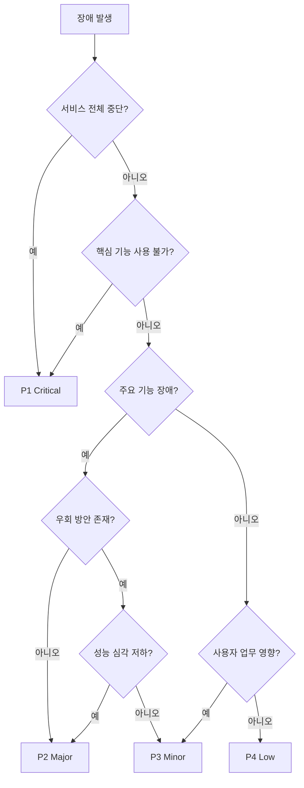
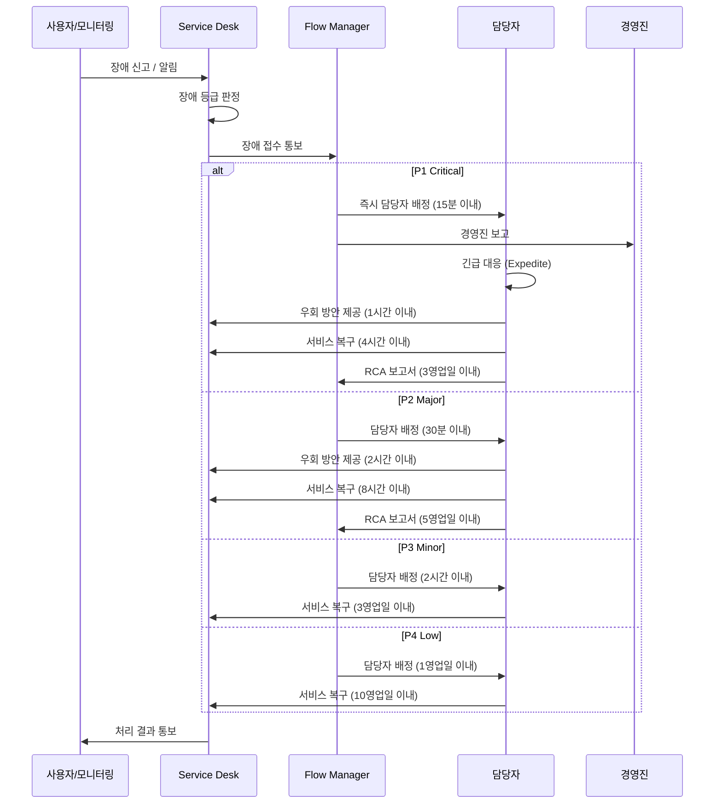
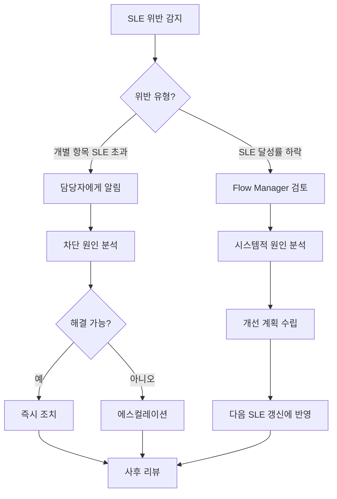
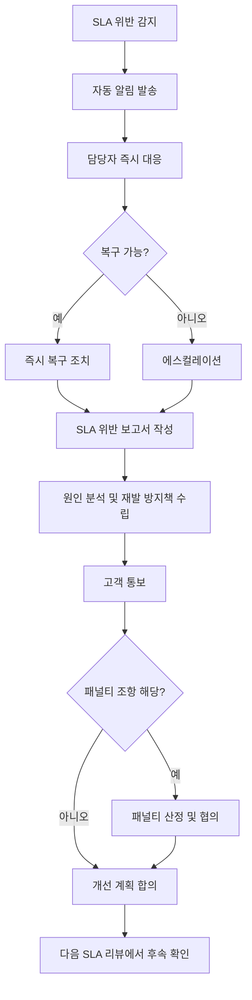
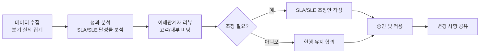

# 서비스 수준 협약 (SLA/SLE)

| 항목 | 내용 |
|------|------|
| **프로젝트명** | [프로젝트명] |
| **문서 버전** | [v1.0] |
| **작성일** | [YYYY-MM-DD] |
| **작성자** | [작성자명 / 소속] |
| **승인자** | [승인자명 / 직책] |

---

## 변경 이력

| 버전 | 일자 | 작성자 | 변경 내용 |
|------|------|--------|-----------|
| v1.0 | [YYYY-MM-DD] | [작성자] | 초안 작성 |
| v1.1 | [YYYY-MM-DD] | [작성자] | [변경 사항 기술] |
| v1.2 | [YYYY-MM-DD] | [작성자] | [변경 사항 기술] |

---

## 1. 서비스 수준 개요

### 1.1 문서 목적

본 문서는 **[프로젝트명]** 시스템의 유지보수 및 운영 단계에서 서비스 수준을 정의하고, 이를 측정/관리하기 위한 기준을 수립한다. 전통적인 SLA(Service Level Agreement)와 함께 칸반 시스템 고유의 SLE(Service Level Expectation)를 정의하여 예측 가능한 서비스 제공을 목표로 한다.

### 1.2 SLA vs SLE

| 구분 | SLA (Service Level Agreement) | SLE (Service Level Expectation) |
|------|------|------|
| **정의** | 서비스 제공자와 고객 간 합의된 서비스 수준 계약 | 과거 데이터 기반으로 산출한 작업 완료 시간 기대치 |
| **성격** | 계약적 의무 (위반 시 패널티 가능) | 확률적 예측 (지속적 갱신) |
| **기준** | 고정 목표 (예: 가용성 99.9%) | 백분위 기반 (예: 85th percentile 리드타임) |
| **측정 대상** | 장애 대응 시간, 가용성, 복구 시간 | 리드타임, 사이클타임, 처리량 |
| **갱신 주기** | 연간 또는 계약 갱신 시 | 분기별 또는 데이터 충분 시 |
| **활용** | 고객과의 계약 이행 관리 | 팀 내부 흐름 예측 및 개선 |

### 1.3 적용 범위

| 항목 | 내용 |
|------|------|
| 대상 시스템 | [시스템명 / 서비스명] |
| 서비스 시간 | [24x7 / 평일 09:00-18:00 / 기타] |
| 서비스 제공자 | [운영팀명 / 조직명] |
| 서비스 수혜자 | [고객사명 / 내부 사용자] |
| 계약 기간 | [YYYY-MM-DD] ~ [YYYY-MM-DD] |
| 관련 문서 | 칸반 보드 설계서, 변경요청 관리 프로세스 |

### 1.4 서비스 범위

| 서비스 영역 | 포함 | 제외 |
|------------|------|------|
| 애플리케이션 운영 | 장애 대응, 버그 수정, 기능 개선 | 신규 시스템 개발 |
| 인프라 운영 | 서버 관리, DB 관리, 네트워크 관리 | 물리 인프라 설치 |
| 보안 관리 | 보안 패치, 취약점 대응, 접근 관리 | 보안 컨설팅 |
| 사용자 지원 | 문의 대응, 교육, 매뉴얼 제공 | [제외 항목] |

---

## 2. 장애 등급 정의

### 2.1 장애 등급 체계

| 등급 | 명칭 | 정의 | 영향 범위 | 예시 |
|------|------|------|----------|------|
| **P1** | Critical | 전체 서비스 중단 또는 핵심 기능 사용 불가 | 전체 사용자 영향 | 서버 전면 장애, 데이터 유실, 결제 시스템 중단 |
| **P2** | Major | 주요 기능 장애 또는 심각한 성능 저하 | 다수 사용자 영향 | 특정 모듈 장애, 응답 시간 5배 이상 증가, 배치 실패 |
| **P3** | Minor | 부가 기능 장애 또는 경미한 성능 저하 | 일부 사용자 영향 | UI 오류, 부가 기능 오작동, 간헐적 오류 |
| **P4** | Low | 서비스 이용에 영향이 없는 경미한 문제 | 영향 미미 | 오탈자, 디자인 깨짐, 개선 요청 |

### 2.2 장애 등급 판단 기준



### 2.3 장애 등급 변경

- 장애 등급은 초기 판단 후 상황 변화에 따라 상향 또는 하향 조정할 수 있다
- **상향 조정 권한**: [역할/직책]
- **하향 조정 권한**: [역할/직책]
- 등급 변경 시 변경 사유를 기록하고 관련 이해관계자에게 통보한다

---

## 3. 장애 등급별 대응 시간 목표

### 3.1 대응 시간 목표 매트릭스

| 장애 등급 | 대응 시간 | 우회 방안 제공 | 복구 시간 (RTO) | 근본 원인 분석 (RCA) |
|----------|----------|-------------|---------------|-------------------|
| **P1 Critical** | 15분 이내 | 1시간 이내 | 4시간 이내 | 3영업일 이내 |
| **P2 Major** | 30분 이내 | 2시간 이내 | 8시간 이내 | 5영업일 이내 |
| **P3 Minor** | 2시간 이내 | 4시간 이내 | 3영업일 이내 | 10영업일 이내 |
| **P4 Low** | 1영업일 이내 | 필요시 제공 | 10영업일 이내 | 필요시 수행 |

### 3.2 시간 기준 정의

| 항목 | 정의 |
|------|------|
| **대응 시간** | 장애 접수 시점부터 담당자가 장애를 인지하고 초기 대응을 시작한 시점까지의 시간 |
| **우회 방안 제공** | 근본 해결 전 서비스 이용 가능한 임시 방안을 고객에게 제공한 시점까지의 시간 |
| **복구 시간 (RTO)** | 장애 접수 시점부터 서비스가 정상 수준으로 복구된 시점까지의 시간 |
| **근본 원인 분석 (RCA)** | 장애 복구 후 근본 원인 분석 보고서를 제출한 시점까지의 시간 |

### 3.3 측정 기준

- **서비스 시간 내 측정**: [24x7 / 영업시간 내]에 해당하는 시간만 산정
- **영업시간 정의**: 평일 [09:00] ~ [18:00] (공휴일 제외)
- **P1/P2 장애**: 24x7 기준으로 측정 (서비스 시간 무관)
- **P3/P4 장애**: 영업시간 기준으로 측정

### 3.4 대응 프로세스



---

## 4. SLE (서비스 수준 기대치)

### 4.1 개요

SLE(Service Level Expectation)는 칸반 시스템에서 과거 작업 완료 데이터를 기반으로 산출하는 확률적 예측치이다. 고객에게 "이 유형의 작업은 N일 이내에 완료될 확률이 85%입니다"라는 형태로 제공한다.

### 4.2 Work Item 유형별 SLE

| Work Item 유형 | 리드타임 SLE (85th percentile) | 사이클타임 SLE (85th percentile) | 측정 기간 |
|---------------|-------------------------------|--------------------------------|----------|
| **버그 수정 (BUG)** | 3영업일 | 2영업일 | 최근 [N]개월 |
| **기능 개선 (ENH)** | 10영업일 | 7영업일 | 최근 [N]개월 |
| **환경 변경 (ENV)** | 5영업일 | 3영업일 | 최근 [N]개월 |
| **기술 부채 (DEBT)** | 15영업일 | 10영업일 | 최근 [N]개월 |
| **보안 패치 (SEC)** | 2영업일 | 1영업일 | 최근 [N]개월 |
| **장애 대응 (INC)** | 1영업일 | 4시간 | 최근 [N]개월 |

### 4.3 SLE 산출 방법

#### 4.3.1 데이터 수집

- **리드타임**: 작업 요청(Backlog 진입) ~ 완료(Done) 시점
- **사이클타임**: 작업 시작(In Progress 진입) ~ 완료(Done) 시점
- **최소 데이터 수**: 유형별 최소 [N]건 이상의 완료 데이터 필요
- **이상치 처리**: 상위 5%의 극단값은 별도 분석 후 포함/제외 판단

#### 4.3.2 백분위 산출

```
SLE 산출 절차:
1. 해당 유형의 최근 [N]개월 완료 데이터 수집
2. 리드타임/사이클타임 기준으로 오름차순 정렬
3. 85th percentile 값 산출
4. 해당 값을 SLE로 설정

예시) 버그 수정 20건의 리드타임 (영업일):
  1, 1, 1, 2, 2, 2, 2, 2, 3, 3, 3, 3, 3, 3, 4, 4, 5, 5, 7, 10
  85th percentile (17번째 값) = 5영업일
  → SLE: "버그 수정의 85%는 5영업일 이내에 완료됩니다"
```

#### 4.3.3 백분위 선택 기준

| 백분위 | 용도 | 특성 |
|--------|------|------|
| 50th percentile | 내부 목표 설정 | 절반의 항목이 충족하는 기준 |
| 70th percentile | 일반 안내 | 대부분의 항목이 충족하는 기준 |
| **85th percentile** | **SLE 기본 기준** | **높은 신뢰도의 예측치** |
| 95th percentile | 최악 시나리오 대비 | 거의 모든 항목이 충족하는 기준 |

### 4.4 SLE 모니터링

#### 4.4.1 모니터링 지표

| 지표 | 측정 방법 | 목표 | 조치 기준 |
|------|----------|------|----------|
| SLE 달성률 | (SLE 이내 완료 건수 / 전체 완료 건수) x 100 | 85% 이상 | 80% 미만 시 원인 분석 |
| 리드타임 추이 | 주간 평균 리드타임 변화 | 안정적 유지 | 2주 연속 증가 시 경고 |
| 사이클타임 추이 | 주간 평균 사이클타임 변화 | 안정적 유지 | 2주 연속 증가 시 경고 |
| Aging WIP | SLE 초과 진행 중 항목 수 | 0건 | 1건 이상 시 즉시 검토 |

#### 4.4.2 SLE 위반 대응



### 4.5 SLE 갱신 주기

| 항목 | 주기 | 담당 |
|------|------|------|
| SLE 데이터 갱신 | 월 1회 (자동 수집) | 도구 자동화 |
| SLE 값 검토 | 분기 1회 | Flow Manager |
| SLE 공식 갱신 | 분기 1회 또는 유의미한 변동 시 | Service Delivery Manager |
| 고객 SLE 안내 갱신 | SLE 공식 갱신 시 | Service Delivery Manager |

### 4.6 SLE 갱신 기준

- 완료 데이터가 [N]건 이상 새로 축적된 경우
- 팀 구성이 변경된 경우 (인원 추가/감소)
- 프로세스가 변경된 경우 (새 열 추가, WIP 조정 등)
- SLE 달성률이 2개월 연속 목표 미달인 경우
- 고객 요구사항이 변경된 경우

---

## 5. 가용성 목표

### 5.1 서비스 가용성 목표

| 서비스 구분 | 가용성 목표 | 허용 다운타임 (월간) | 측정 구간 |
|------------|-----------|-------------------|----------|
| **전체 서비스** | [99.9]% | 약 43분 | 24x7 |
| **핵심 기능** | [99.95]% | 약 22분 | 24x7 |
| **API 서비스** | [99.9]% | 약 43분 | 24x7 |
| **배치 처리** | [99.5]% | 약 3.6시간 | 영업시간 |
| **관리자 포털** | [99.0]% | 약 7.3시간 | 영업시간 |

### 5.2 가용성 산정 기준

```
가용성(%) = (총 서비스 시간 - 다운타임) / 총 서비스 시간 x 100
```

| 항목 | 포함 | 제외 |
|------|------|------|
| **총 서비스 시간** | 측정 구간 내 전체 시간 | 사전 합의된 정기 점검 시간 |
| **다운타임** | 비계획 장애로 인한 서비스 중단 시간 | 계획된 배포 윈도우 내 다운타임 |

### 5.3 가용성 측정 방법

| 측정 항목 | 측정 방법 | 도구 |
|----------|----------|------|
| 서비스 가용성 | Synthetic Monitoring (Health Check) | [모니터링 도구명] |
| API 가용성 | API Endpoint 상태 코드 모니터링 | [모니터링 도구명] |
| 응답 시간 | APM (Application Performance Monitoring) | [APM 도구명] |
| 에러율 | 로그 기반 에러 발생률 추적 | [로그 도구명] |

### 5.4 성능 목표

| 지표 | 목표 | 측정 기준 |
|------|------|----------|
| 평균 응답 시간 | [N]ms 이내 | 주요 API 95th percentile |
| 최대 응답 시간 | [N]ms 이내 | 주요 API 99th percentile |
| 에러율 | [N]% 이하 | HTTP 5xx 응답 비율 |
| 동시 접속자 | [N]명 지원 | 정상 응답 시간 유지 기준 |

### 5.5 계획된 유지보수 정책

| 항목 | 정책 |
|------|------|
| 정기 점검 | 매월 [N]째 [요일] [시간대] |
| 사전 통보 | 정기 점검 [N]영업일 전 통보 |
| 긴급 점검 | [N]시간 전 통보 (P1 장애 시 즉시 가능) |
| 최대 점검 시간 | [N]시간 이내 |

---

## 6. 에스컬레이션 매트릭스

### 6.1 시간 경과별 에스컬레이션

| 장애 등급 | 1차 에스컬레이션 | 2차 에스컬레이션 | 3차 에스컬레이션 |
|----------|----------------|----------------|----------------|
| **P1 Critical** | 15분: 팀 리드 | 1시간: [직책] | 2시간: [경영진] |
| **P2 Major** | 1시간: 팀 리드 | 4시간: [직책] | 8시간: [경영진] |
| **P3 Minor** | 4시간: 팀 리드 | 1영업일: [직책] | 3영업일: [경영진] |
| **P4 Low** | 3영업일: 팀 리드 | 5영업일: [직책] | 10영업일: [경영진] |

### 6.2 에스컬레이션 연락처

| 단계 | 역할 | 담당자 | 연락처 | 대체 담당자 |
|------|------|--------|--------|------------|
| 1차 | 팀 리드 | [이름] | [전화/이메일] | [이름] |
| 2차 | [직책] | [이름] | [전화/이메일] | [이름] |
| 3차 | [경영진] | [이름] | [전화/이메일] | [이름] |

### 6.3 SLA 위반 시 대응 절차



### 6.4 SLA 위반 패널티 (해당 시)

| 위반 유형 | 패널티 기준 | 산정 방법 |
|----------|-----------|----------|
| 가용성 목표 미달 | [N]% 미만 시 | [패널티 산정 공식] |
| P1 대응 시간 초과 | 월 [N]건 초과 시 | [패널티 산정 공식] |
| P2 복구 시간 초과 | 월 [N]건 초과 시 | [패널티 산정 공식] |

---

## 7. SLA 보고서 템플릿

### 7.1 월간 SLA 달성 현황

#### 보고 기간: [YYYY년 MM월]

**가용성 현황**

| 서비스 구분 | 목표 | 실적 | 달성 여부 | 비고 |
|------------|------|------|----------|------|
| 전체 서비스 | [N]% | [N]% | [O/X] | [비고] |
| 핵심 기능 | [N]% | [N]% | [O/X] | [비고] |
| API 서비스 | [N]% | [N]% | [O/X] | [비고] |

**장애 대응 현황**

| 장애 등급 | 발생 건수 | 대응 시간 준수 | 복구 시간 준수 | SLA 달성률 |
|----------|----------|-------------|-------------|----------|
| P1 | [N]건 | [N]/[N]건 | [N]/[N]건 | [N]% |
| P2 | [N]건 | [N]/[N]건 | [N]/[N]건 | [N]% |
| P3 | [N]건 | [N]/[N]건 | [N]/[N]건 | [N]% |
| P4 | [N]건 | [N]/[N]건 | [N]/[N]건 | [N]% |

### 7.2 SLE 달성률 추이

#### Work Item 유형별 SLE 달성 현황

| Work Item 유형 | 완료 건수 | SLE 이내 완료 | SLE 달성률 | SLE 목표 | 달성 여부 |
|---------------|----------|-------------|----------|---------|----------|
| 버그 수정 | [N]건 | [N]건 | [N]% | 85% | [O/X] |
| 기능 개선 | [N]건 | [N]건 | [N]% | 85% | [O/X] |
| 환경 변경 | [N]건 | [N]건 | [N]% | 85% | [O/X] |
| 기술 부채 | [N]건 | [N]건 | [N]% | 85% | [O/X] |
| 보안 패치 | [N]건 | [N]건 | [N]% | 85% | [O/X] |
| 장애 대응 | [N]건 | [N]건 | [N]% | 85% | [O/X] |

#### 리드타임 추이 (최근 [N]개월)

| 월 | 평균 리드타임 | 85th percentile | 전월 대비 | 추세 |
|----|------------|-----------------|----------|------|
| [M-5]월 | [N]일 | [N]일 | - | - |
| [M-4]월 | [N]일 | [N]일 | [+/-N]일 | [개선/악화/유지] |
| [M-3]월 | [N]일 | [N]일 | [+/-N]일 | [개선/악화/유지] |
| [M-2]월 | [N]일 | [N]일 | [+/-N]일 | [개선/악화/유지] |
| [M-1]월 | [N]일 | [N]일 | [+/-N]일 | [개선/악화/유지] |
| [M]월 | [N]일 | [N]일 | [+/-N]일 | [개선/악화/유지] |

### 7.3 위반 건수 및 원인 분석

#### SLA 위반 목록

| No. | 위반 일시 | 장애 등급 | 위반 항목 | 초과 시간 | 원인 | 재발 방지책 |
|-----|----------|----------|----------|----------|------|-----------|
| 1 | [YYYY-MM-DD HH:MM] | [P1-P4] | [대응시간/복구시간] | [N분/시간] | [원인 기술] | [방지책 기술] |
| 2 | [YYYY-MM-DD HH:MM] | [P1-P4] | [대응시간/복구시간] | [N분/시간] | [원인 기술] | [방지책 기술] |

#### SLE 위반 분석

| Work Item ID | 유형 | 리드타임 | SLE 기준 | 초과일 | 주요 원인 |
|-------------|------|---------|---------|--------|----------|
| [WI-ID] | [유형] | [N]일 | [N]일 | [N]일 | [원인 기술] |
| [WI-ID] | [유형] | [N]일 | [N]일 | [N]일 | [원인 기술] |

#### 위반 원인 분류

| 원인 분류 | 건수 | 비율 | 개선 방안 |
|----------|------|------|----------|
| 인력 부족 | [N]건 | [N]% | [개선 방안] |
| 기술적 복잡도 | [N]건 | [N]% | [개선 방안] |
| 외부 의존성 | [N]건 | [N]% | [개선 방안] |
| 프로세스 미흡 | [N]건 | [N]% | [개선 방안] |
| 기타 | [N]건 | [N]% | [개선 방안] |

---

## 8. SLA 리뷰 및 갱신

### 8.1 분기별 SLA 리뷰 프로세스



### 8.2 SLA 리뷰 체크리스트

| 점검 항목 | 확인 사항 | 결과 |
|----------|----------|------|
| SLA 달성률 | 모든 SLA 항목이 목표를 충족하는가? | [O/X] |
| SLE 정확도 | SLE 값이 실제 성과를 정확히 예측하는가? | [O/X] |
| 가용성 목표 | 가용성 목표가 비즈니스 요구에 적합한가? | [O/X] |
| 에스컬레이션 | 에스컬레이션 매트릭스가 효과적으로 작동하는가? | [O/X] |
| 보고 체계 | 보고서가 적시에 제공되고 있는가? | [O/X] |
| 고객 만족도 | 고객이 서비스 수준에 만족하는가? | [O/X] |

### 8.3 SLE 갱신 기준

| 갱신 트리거 | 설명 | 갱신 방법 |
|-----------|------|----------|
| 데이터 축적 | [N]건 이상 새 데이터 축적 | 자동 재산출 |
| 팀 변경 | 팀원 [N]명 이상 변경 | 새 데이터 기반 재산출 (기존 데이터 가중치 감소) |
| 프로세스 변경 | WIP, 열 구조 등 변경 | 변경 후 [N]개월 데이터로 재산출 |
| 달성률 이탈 | 2개월 연속 달성률 80% 미만 | 원인 분석 후 SLE 재설정 |
| 정기 갱신 | 분기 1회 | 최근 [N]개월 데이터 기반 재산출 |

### 8.4 SLA 갱신 절차

| 단계 | 활동 | 담당 | 소요 기간 |
|------|------|------|----------|
| 1 | SLA 변경 필요성 식별 | Service Delivery Manager | - |
| 2 | 변경안 초안 작성 | Service Delivery Manager | [N]영업일 |
| 3 | 내부 검토 | Flow Manager, 팀 리드 | [N]영업일 |
| 4 | 고객 협의 | Service Delivery Manager | [N]영업일 |
| 5 | 최종 승인 | [승인자] | [N]영업일 |
| 6 | 문서 갱신 및 배포 | [담당자] | [N]영업일 |
| 7 | 팀 공유 및 교육 | Flow Manager | [N]영업일 |

---

## 부록 A: SLA/SLE 용어 정의

| 용어 | 정의 |
|------|------|
| SLA (Service Level Agreement) | 서비스 제공자와 고객 간 합의된 서비스 수준 계약 |
| SLE (Service Level Expectation) | 과거 데이터 기반 작업 완료 시간 기대치 (칸반 고유 개념) |
| RTO (Recovery Time Objective) | 장애 발생 시 서비스 복구까지의 목표 시간 |
| RPO (Recovery Point Objective) | 장애 발생 시 허용 가능한 데이터 손실 시간 |
| RCA (Root Cause Analysis) | 장애의 근본 원인을 분석하는 활동 |
| MTTR (Mean Time To Recovery) | 평균 복구 시간 |
| MTBF (Mean Time Between Failures) | 평균 장애 간격 |
| Lead Time | 작업 요청 시점부터 완료 시점까지의 총 소요 시간 |
| Cycle Time | 작업 시작 시점부터 완료 시점까지의 소요 시간 |
| Throughput | 단위 시간당 완료된 작업 항목 수 |
| Percentile | 데이터를 크기순으로 정렬했을 때 특정 비율에 해당하는 값 |
| Aging | 작업이 특정 단계에 머무르고 있는 경과 시간 |

---

## 부록 B: 참고 공식

### 가용성 계산

```
월간 가용성(%) = (총 서비스 시간 - 비계획 다운타임) / 총 서비스 시간 x 100

예시) 24x7 서비스, 월 30일 기준
  총 서비스 시간 = 30 x 24 x 60 = 43,200분
  비계획 다운타임 = 43분
  가용성 = (43,200 - 43) / 43,200 x 100 = 99.9%
```

### SLE 달성률 계산

```
SLE 달성률(%) = SLE 이내 완료 건수 / 전체 완료 건수 x 100

예시) 버그 수정 20건 완료, SLE(3영업일) 이내 완료 17건
  SLE 달성률 = 17 / 20 x 100 = 85%
```

### 리드타임/사이클타임 관계

```
리드타임 = 대기 시간 + 사이클타임
대기 시간 = Backlog + Selected 에서 소요된 시간
사이클타임 = Analysis + In Progress + Code Review + Testing + Ready for Release 에서 소요된 시간
```
