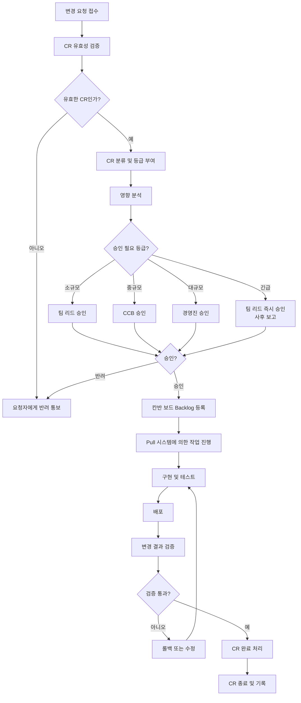
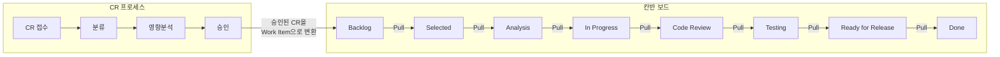
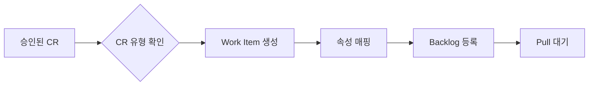
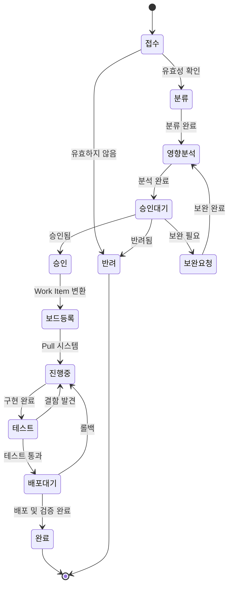

# 변경요청 관리 프로세스 (Change Request Management)

| 항목 | 내용 |
|------|------|
| **프로젝트명** | [프로젝트명] |
| **문서 버전** | [v1.0] |
| **작성일** | [YYYY-MM-DD] |
| **작성자** | [작성자명 / 소속] |
| **승인자** | [승인자명 / 직책] |

---

## 변경 이력

| 버전 | 일자 | 작성자 | 변경 내용 |
|------|------|--------|-----------|
| v1.0 | [YYYY-MM-DD] | [작성자] | 초안 작성 |
| v1.1 | [YYYY-MM-DD] | [작성자] | [변경 사항 기술] |
| v1.2 | [YYYY-MM-DD] | [작성자] | [변경 사항 기술] |

---

## 1. 변경 관리 개요

### 1.1 목적

본 문서는 **[프로젝트명]** 시스템의 운영 및 유지보수 단계에서 발생하는 모든 변경요청(CR, Change Request)을 체계적으로 관리하기 위한 프로세스를 정의한다. 칸반 Pull 시스템과 통합하여 변경 요청의 접수부터 완료까지 투명하게 추적하고, 변경으로 인한 위험을 최소화한다.

### 1.2 적용 범위

| 항목 | 내용 |
|------|------|
| 대상 시스템 | [시스템명 / 서비스명] |
| 적용 대상 | 소프트웨어 변경, 설정 변경, 데이터 변경, 인프라 변경 |
| 제외 대상 | 표준 변경(Standard Change)으로 분류된 정기 패치, 자동화된 배포 |
| 관련 문서 | 칸반 보드 설계서, 서비스 수준 협약(SLA/SLE) |

### 1.3 관련 프로세스

| 프로세스 | 연관 관계 |
|----------|----------|
| 칸반 보드 관리 | 승인된 CR이 Work Item으로 변환되어 보드에 등록 |
| SLA/SLE 관리 | CR 유형별 SLE 적용, 처리 시간 추적 |
| 장애 관리 | 장애 대응에서 파생된 CR 연결 |
| 릴리즈 관리 | 완료된 CR의 배포 일정 관리 |
| 형상 관리 | CR에 따른 산출물 변경 이력 추적 |

### 1.4 역할과 책임

| 역할 | 책임 |
|------|------|
| **요청자** | CR 작성 및 제출, 변경 사유 설명, 결과 검증 |
| **접수 담당자 (Service Desk)** | CR 접수, 유효성 검증, 초기 분류 |
| **Flow Manager** | CR 우선순위 조정, 칸반 보드 등록, 흐름 관리 |
| **분석 담당자** | 영향 분석 수행, 리소스 산정, 위험 평가 |
| **CCB (Change Control Board)** | 중규모 이상 CR 승인/반려 결정 |
| **구현 담당자** | 변경 작업 수행, 단위 테스트 |
| **QA 담당자** | 변경 사항 검증, 회귀 테스트 |
| **Release Manager** | 배포 계획 수립, 배포 실행 |

---

## 2. CR 프로세스 흐름도

### 2.1 전체 프로세스



### 2.2 Pull 시스템과의 통합



승인된 CR은 Work Item으로 변환되어 칸반 보드의 Backlog에 등록된다. 이후 Pull 시스템에 의해 자연스럽게 작업이 진행된다.

---

## 3. CR 양식 템플릿

### 3.1 변경요청서

#### 기본 정보

| 항목 | 내용 |
|------|------|
| **CR-ID** | CR-[YYYYMMDD]-[NNN] |
| **요청일** | [YYYY-MM-DD] |
| **요청자** | [요청자명 / 소속 / 연락처] |
| **CR 유형** | [ ] 버그 수정 [ ] 기능 개선 [ ] 환경 변경 [ ] 보안 패치 [ ] 기타 |
| **우선순위** | [ ] 긴급(Expedite) [ ] 높음(High) [ ] 보통(Medium) [ ] 낮음(Low) |
| **희망 완료일** | [YYYY-MM-DD] |
| **관련 시스템** | [대상 시스템/모듈명] |
| **관련 장애 티켓** | [INC-ID] (해당 시) |

#### 현재 상황

```
[현재 시스템의 상태, 문제점, 또는 변경이 필요한 배경을 상세히 기술한다.]

1. 현상 설명:
   [구체적인 현상을 기술]

2. 재현 조건 (버그의 경우):
   [재현 단계를 기술]

3. 영향 범위:
   [현재 문제가 미치는 영향 범위를 기술]
```

#### 변경 요청 내용

```
[요청하는 변경의 내용을 구체적으로 기술한다.]

1. 변경 목표:
   [달성하고자 하는 목표를 기술]

2. 변경 상세 내용:
   [구체적인 변경 사항을 기술]

3. 기대 효과:
   [변경 완료 시 기대되는 효과를 기술]
```

#### 변경 사유

```
[변경을 요청하는 사유를 기술한다.]

[ ] 운영 장애 대응
[ ] 법/규정 변경 대응
[ ] 고객 요구사항
[ ] 성능 개선
[ ] 보안 강화
[ ] 기술 부채 해소
[ ] 기타: [기타 사유 기술]
```

#### 비즈니스 영향

| 항목 | 내용 |
|------|------|
| 영향받는 사용자 수 | [N]명 / 전체 |
| 비즈니스 영향도 | [ ] 높음 [ ] 중간 [ ] 낮음 |
| 미조치 시 영향 | [변경을 하지 않을 경우의 비즈니스 영향] |
| 매출 영향 | [예상 매출 영향 금액 또는 비율] |

---

## 4. 영향 분석 템플릿

### 4.1 기술적 영향 분석

#### 분석 기본 정보

| 항목 | 내용 |
|------|------|
| CR-ID | [CR-ID] |
| 분석 담당자 | [담당자명] |
| 분석 일자 | [YYYY-MM-DD] |
| 분석 소요 시간 | [N]시간 |

#### 소스코드 영향

| 분석 항목 | 영향 여부 | 상세 내용 |
|----------|---------|----------|
| 변경 대상 모듈 | [O/X] | [모듈명 나열] |
| 변경 파일 수 | - | 예상 [N]개 파일 |
| 신규 파일 | [O/X] | [신규 파일 목록] |
| 삭제 파일 | [O/X] | [삭제 파일 목록] |
| 공통 모듈 영향 | [O/X] | [영향받는 공통 모듈 기술] |
| 의존 모듈 영향 | [O/X] | [영향받는 의존 모듈 기술] |

#### 데이터베이스 영향

| 분석 항목 | 영향 여부 | 상세 내용 |
|----------|---------|----------|
| 테이블 구조 변경 (DDL) | [O/X] | [변경 대상 테이블 및 내용] |
| 데이터 변경 (DML) | [O/X] | [변경 대상 데이터 및 내용] |
| 인덱스 변경 | [O/X] | [변경 내용] |
| 저장 프로시저 변경 | [O/X] | [변경 대상 목록] |
| 데이터 마이그레이션 필요 | [O/X] | [마이그레이션 계획] |
| 데이터 백업 필요 | [O/X] | [백업 대상 및 방법] |

#### API 영향

| 분석 항목 | 영향 여부 | 상세 내용 |
|----------|---------|----------|
| API 인터페이스 변경 | [O/X] | [변경 대상 API 목록] |
| 하위 호환성 유지 | [O/X] | [호환성 확보 방안] |
| API 버전 변경 필요 | [O/X] | [버전 변경 계획] |
| API 문서 갱신 | [O/X] | [갱신 대상] |

#### UI 영향

| 분석 항목 | 영향 여부 | 상세 내용 |
|----------|---------|----------|
| 화면 변경 | [O/X] | [변경 대상 화면 목록] |
| 신규 화면 추가 | [O/X] | [신규 화면 목록] |
| 화면 삭제 | [O/X] | [삭제 대상 화면] |
| 디자인 변경 필요 | [O/X] | [디자인 변경 범위] |

#### 외부 연동 영향

| 분석 항목 | 영향 여부 | 상세 내용 |
|----------|---------|----------|
| 외부 시스템 연동 변경 | [O/X] | [연동 대상 시스템 목록] |
| 외부 시스템 협의 필요 | [O/X] | [협의 대상 및 내용] |
| 연동 테스트 필요 | [O/X] | [테스트 계획] |

#### 성능 영향

| 분석 항목 | 영향 여부 | 상세 내용 |
|----------|---------|----------|
| 응답 시간 영향 | [O/X] | [예상 영향 기술] |
| 처리량 영향 | [O/X] | [예상 영향 기술] |
| 리소스 사용량 변화 | [O/X] | [CPU / 메모리 / 디스크 영향] |
| 성능 테스트 필요 | [O/X] | [테스트 범위 및 기준] |

#### 보안 영향

| 분석 항목 | 영향 여부 | 상세 내용 |
|----------|---------|----------|
| 인증/인가 변경 | [O/X] | [변경 내용] |
| 개인정보 처리 변경 | [O/X] | [변경 내용] |
| 보안 취약점 위험 | [O/X] | [위험 요소 기술] |
| 보안 검토 필요 | [O/X] | [검토 범위] |

### 4.2 리소스 산정

| 항목 | 산정 | 비고 |
|------|------|------|
| 개발 공수 | [N] man-day | [산정 근거] |
| QA 공수 | [N] man-day | [산정 근거] |
| 인프라 작업 | [N] man-day | [산정 근거] |
| 외부 협의 | [N] man-day | [대상 기관/업체] |
| **총 소요 공수** | **[N] man-day** | |
| 예상 소요 기간 | [N]영업일 | 병렬 작업 고려 |
| 투입 인원 | [N]명 | [역할별 인원] |

### 4.3 위험 분석

| No. | 위험 요소 | 발생 확률 | 영향도 | 위험 등급 | 대응 방안 |
|-----|----------|----------|--------|---------|----------|
| 1 | [위험 요소 기술] | [상/중/하] | [상/중/하] | [상/중/하] | [대응 방안] |
| 2 | [위험 요소 기술] | [상/중/하] | [상/중/하] | [상/중/하] | [대응 방안] |
| 3 | [위험 요소 기술] | [상/중/하] | [상/중/하] | [상/중/하] | [대응 방안] |

#### 위험 등급 산정 기준

| | 영향도 상 | 영향도 중 | 영향도 하 |
|---|---------|---------|---------|
| **발생 확률 상** | 위험 등급: 상 | 위험 등급: 상 | 위험 등급: 중 |
| **발생 확률 중** | 위험 등급: 상 | 위험 등급: 중 | 위험 등급: 하 |
| **발생 확률 하** | 위험 등급: 중 | 위험 등급: 하 | 위험 등급: 하 |

### 4.4 롤백 계획

| 항목 | 내용 |
|------|------|
| 롤백 가능 여부 | [가능 / 조건부 가능 / 불가능] |
| 롤백 조건 | [롤백 판단 기준 기술] |
| 롤백 절차 | [롤백 단계별 절차] |
| 롤백 소요 시간 | [N]분 / [N]시간 |
| 롤백 시 데이터 영향 | [데이터 영향 기술] |
| 롤백 검증 방법 | [검증 절차 기술] |

### 4.5 영향 분석 결론

| 항목 | 내용 |
|------|------|
| 변경 규모 | [ ] 소규모 (3 man-day 이하) [ ] 중규모 (3-10 man-day) [ ] 대규모 (10+ man-day) |
| 전체 위험 수준 | [ ] 상 [ ] 중 [ ] 하 |
| 구현 권고 여부 | [ ] 권고 [ ] 조건부 권고 [ ] 비권고 |
| 조건/주의사항 | [조건이나 주의사항 기술] |
| 분석자 의견 | [종합 의견 기술] |

---

## 5. 승인 체계

### 5.1 변경 규모별 승인 권한

| 변경 규모 | 판단 기준 | 승인 권한 | 승인 소요 시간 | 비고 |
|----------|----------|----------|-------------|------|
| **소규모** | 3 man-day 이하, 위험 등급 하 | 팀 리드 | 1영업일 이내 | 영향 분석 간소화 가능 |
| **중규모** | 3-10 man-day, 또는 위험 등급 중 | CCB (변경통제위원회) | 3영업일 이내 | 정식 영향 분석 필수 |
| **대규모** | 10 man-day 초과, 또는 위험 등급 상 | 경영진 + CCB | 5영업일 이내 | 상세 영향 분석 + 롤백 계획 필수 |
| **긴급** | P1/P2 장애 대응 CR | 팀 리드 (사후 보고) | 즉시 | 사후 CCB 보고 필수 |

### 5.2 CCB (Change Control Board) 구성

| 역할 | 담당자 | 참여 형태 |
|------|--------|----------|
| CCB 위원장 | [직책/이름] | 필수 |
| 기술 검토 | [직책/이름] | 필수 |
| QA 검토 | [직책/이름] | 필수 |
| 보안 검토 | [직책/이름] | 필요시 |
| 인프라 검토 | [직책/이름] | 필요시 |
| 비즈니스 대표 | [직책/이름] | 필요시 |

### 5.3 CCB 운영 규칙

| 항목 | 내용 |
|------|------|
| 정기 회의 | 주 [N]회, [요일] [시간] |
| 임시 회의 | 긴급 CR 발생 시 수시 소집 |
| 의결 정족수 | 필수 참석자 전원 + 과반수 |
| 의결 방식 | 만장일치 원칙, 이견 시 CCB 위원장 최종 결정 |
| 회의록 | 매 회의 작성 및 공유 |

### 5.4 승인/반려 기준

#### 승인 기준

- [ ] 변경 사유가 타당하고 비즈니스 가치가 명확한가?
- [ ] 영향 분석이 충분히 수행되었는가?
- [ ] 위험이 수용 가능한 수준인가?
- [ ] 리소스가 확보 가능한가?
- [ ] 롤백 계획이 수립되어 있는가? (중규모 이상)
- [ ] 테스트 계획이 적절한가?

#### 반려 사유

| 반려 사유 | 조치 방안 |
|----------|----------|
| 변경 사유 불명확 | 요청자에게 보완 요청 |
| 영향 분석 부족 | 추가 분석 후 재신청 |
| 위험 수준 과다 | 위험 완화 방안 마련 후 재신청 |
| 리소스 부족 | 일정 조정 또는 우선순위 재조정 후 재신청 |
| 중복 요청 | 기존 CR과 병합 처리 |

---

## 6. 칸반 보드 연동

### 6.1 CR에서 Work Item으로의 변환



#### 변환 규칙

| CR 속성 | Work Item 속성 | 매핑 규칙 |
|---------|-------------|----------|
| CR-ID | 관련 CR | 그대로 연결 |
| CR 유형 | Work Item 유형 | 하단 매핑 테이블 참조 |
| 우선순위 | Class of Service | 하단 매핑 테이블 참조 |
| 희망 완료일 | SLE 기한 | 희망 완료일 또는 SLE 중 이른 날짜 |
| 요청자 | 이해관계자 | 그대로 연결 |
| 영향 분석 결과 | 크기 (S/M/L/XL) | 공수 기반 산정 |

#### CR 유형 → Work Item 유형 매핑

| CR 유형 | Work Item 유형 | 코드 |
|---------|-------------|------|
| 버그 수정 | 버그 수정 | BUG |
| 기능 개선 | 기능 개선 | ENH |
| 환경 변경 | 환경 변경 | ENV |
| 보안 패치 | 보안 패치 | SEC |
| 장애 대응 | 장애 대응 | INC |
| 기타 | 기능 개선 또는 기술 부채 | ENH / DEBT |

### 6.2 Class of Service 자동 매핑

| CR 조건 | Class of Service | 매핑 규칙 |
|---------|----------------|----------|
| P1/P2 장애 대응 CR | **Expedite** | 즉시 처리, WIP 초과 허용 |
| 우선순위 "긴급" | **Expedite** | 즉시 처리, WIP 초과 허용 |
| 희망 완료일이 있는 CR | **Fixed Date** | 데드라인 역산 관리 |
| 법/규정 변경 대응 CR | **Fixed Date** | 규정 시행일 기준 |
| 일반 우선순위 CR | **Standard** | FIFO + 비즈니스 가치 순서 |
| 기술 부채 관련 CR | **Intangible** | 여유 시 Pull |

### 6.3 크기 산정 기준

| 크기 | 공수 기준 | 설명 |
|------|----------|------|
| **S (Small)** | 0.5 man-day 이하 | 단순 수정, 설정 변경 |
| **M (Medium)** | 0.5 - 3 man-day | 모듈 단위 수정 |
| **L (Large)** | 3 - 10 man-day | 복수 모듈 수정, 연동 변경 |
| **XL (Extra Large)** | 10 man-day 초과 | 대규모 변경, 아키텍처 변경 |

### 6.4 보드에서의 CR 추적

#### 추적 방법

| 추적 요소 | 방법 |
|----------|------|
| CR 상태 | Work Item의 열(Column) 위치로 확인 |
| CR 담당자 | Work Item 카드의 담당자 필드 |
| CR 진행률 | 칸반 보드의 시각적 위치 |
| CR SLE 준수 | 카드 색상 변화 (SLE 임박 시 경고색) |
| CR 차단 | Blocked 플래그로 표시 |
| 관련 CR 연결 | 카드 내 링크로 원본 CR 참조 |

#### CR 상태와 보드 열의 매핑

| CR 상태 | 칸반 보드 열 | 설명 |
|---------|-----------|------|
| 접수 완료 | - (보드 등록 전) | CR 프로세스에서 관리 |
| 분류/분석 중 | - (보드 등록 전) | CR 프로세스에서 관리 |
| 승인 대기 | - (보드 등록 전) | CR 프로세스에서 관리 |
| **승인 → 보드 등록** | **Backlog** | **CR에서 Work Item으로 전환** |
| 작업 선정 | Selected | Pull에 의한 선정 |
| 상세 분석 | Analysis | 기술 분석 진행 |
| 구현 중 | In Progress | 개발 작업 진행 |
| 리뷰 중 | Code Review | 코드 리뷰 진행 |
| 테스트 중 | Testing | QA 검증 진행 |
| 배포 대기 | Ready for Release | 배포 대기 |
| **완료** | **Done** | **CR 완료 처리** |
| 반려 | - | CR 프로세스에서 관리 |

---

## 7. 변경 관리 지표

### 7.1 핵심 지표 (KPI)

| 지표 | 정의 | 산정 공식 | 목표 | 측정 주기 |
|------|------|----------|------|----------|
| CR 접수 건수 | 기간 내 접수된 CR 수 | Count(CR 접수) | 모니터링 | 주간/월간 |
| CR 완료 건수 | 기간 내 완료된 CR 수 | Count(CR 완료) | 모니터링 | 주간/월간 |
| CR 잔여 건수 | 미완료 상태의 CR 수 | 접수 - 완료 - 반려 | 감소 추세 | 주간 |
| 평균 CR 처리 시간 | CR 접수부터 완료까지 평균 시간 | Sum(처리시간) / Count(완료) | [N]영업일 이내 | 월간 |
| CR SLE 달성률 | SLE 이내 완료된 CR 비율 | (SLE 이내 완료 / 전체 완료) x 100 | 85% 이상 | 월간 |
| CR 반려율 | 접수 대비 반려된 CR 비율 | (반려 / 접수) x 100 | [N]% 이하 | 월간 |
| 긴급 CR 비율 | 전체 CR 대비 Expedite 비율 | (Expedite / 전체) x 100 | [N]% 이하 | 월간 |

### 7.2 CR 처리 현황 대시보드

#### CR 상태별 현황

| 상태 | 건수 | 비율 |
|------|------|------|
| 접수/분류 중 | [N]건 | [N]% |
| 영향 분석 중 | [N]건 | [N]% |
| 승인 대기 | [N]건 | [N]% |
| 진행 중 (보드 내) | [N]건 | [N]% |
| 완료 | [N]건 | [N]% |
| 반려 | [N]건 | [N]% |
| **합계** | **[N]건** | **100%** |

#### CR 유형별 분포

| CR 유형 | 접수 | 진행 중 | 완료 | 반려 | 평균 처리 시간 |
|---------|------|---------|------|------|-------------|
| 버그 수정 | [N]건 | [N]건 | [N]건 | [N]건 | [N]영업일 |
| 기능 개선 | [N]건 | [N]건 | [N]건 | [N]건 | [N]영업일 |
| 환경 변경 | [N]건 | [N]건 | [N]건 | [N]건 | [N]영업일 |
| 보안 패치 | [N]건 | [N]건 | [N]건 | [N]건 | [N]영업일 |
| 장애 대응 | [N]건 | [N]건 | [N]건 | [N]건 | [N]영업일 |
| 기타 | [N]건 | [N]건 | [N]건 | [N]건 | [N]영업일 |

#### CR 규모별 분포

| 변경 규모 | 접수 건수 | 완료 건수 | 평균 처리 시간 | 승인 소요 시간 |
|----------|----------|----------|-------------|-------------|
| 소규모 | [N]건 | [N]건 | [N]영업일 | [N]영업일 |
| 중규모 | [N]건 | [N]건 | [N]영업일 | [N]영업일 |
| 대규모 | [N]건 | [N]건 | [N]영업일 | [N]영업일 |
| 긴급 | [N]건 | [N]건 | [N]영업일 | 즉시 |

### 7.3 추이 분석

#### 월별 CR 접수/완료 추이

| 월 | 접수 | 완료 | 반려 | 잔여 | 완료율 | SLE 달성률 |
|----|------|------|------|------|--------|----------|
| [M-5]월 | [N] | [N] | [N] | [N] | [N]% | [N]% |
| [M-4]월 | [N] | [N] | [N] | [N] | [N]% | [N]% |
| [M-3]월 | [N] | [N] | [N] | [N] | [N]% | [N]% |
| [M-2]월 | [N] | [N] | [N] | [N] | [N]% | [N]% |
| [M-1]월 | [N] | [N] | [N] | [N] | [N]% | [N]% |
| [M]월 | [N] | [N] | [N] | [N] | [N]% | [N]% |

---

## 8. 변경 관리 보고서 템플릿

### 8.1 월간 변경 관리 현황 보고서

#### 보고 기간: [YYYY년 MM월]

**요약**

| 항목 | 금월 | 전월 | 증감 |
|------|------|------|------|
| CR 접수 | [N]건 | [N]건 | [+/-N]건 |
| CR 완료 | [N]건 | [N]건 | [+/-N]건 |
| CR 반려 | [N]건 | [N]건 | [+/-N]건 |
| 미처리 잔여 | [N]건 | [N]건 | [+/-N]건 |
| 평균 처리 시간 | [N]일 | [N]일 | [+/-N]일 |
| SLE 달성률 | [N]% | [N]% | [+/-N]% |
| Expedite 비율 | [N]% | [N]% | [+/-N]% |

**주요 변경 사항**

| No. | CR-ID | 제목 | 유형 | 규모 | 상태 | 비고 |
|-----|-------|------|------|------|------|------|
| 1 | [CR-ID] | [제목] | [유형] | [규모] | [상태] | [비고] |
| 2 | [CR-ID] | [제목] | [유형] | [규모] | [상태] | [비고] |
| 3 | [CR-ID] | [제목] | [유형] | [규모] | [상태] | [비고] |

**SLE 위반 건**

| No. | CR-ID | 유형 | SLE 기준 | 실제 소요 | 초과일 | 원인 |
|-----|-------|------|---------|----------|--------|------|
| 1 | [CR-ID] | [유형] | [N]일 | [N]일 | [N]일 | [원인] |
| 2 | [CR-ID] | [유형] | [N]일 | [N]일 | [N]일 | [원인] |

**개선 사항 및 계획**

| No. | 개선 영역 | 현상 | 개선 방안 | 담당 | 목표 일정 |
|-----|----------|------|----------|------|----------|
| 1 | [영역] | [현상] | [방안] | [담당자] | [YYYY-MM-DD] |
| 2 | [영역] | [현상] | [방안] | [담당자] | [YYYY-MM-DD] |

### 8.2 CR 처리 SLE 달성률 보고

#### Work Item 유형별 SLE 달성 현황

| Work Item 유형 | SLE 기준 (리드타임) | 완료 건수 | SLE 이내 완료 | 달성률 | 목표 | 달성 여부 |
|---------------|-------------------|----------|-------------|--------|------|----------|
| 버그 수정 | 3영업일 | [N]건 | [N]건 | [N]% | 85% | [O/X] |
| 기능 개선 | 10영업일 | [N]건 | [N]건 | [N]% | 85% | [O/X] |
| 환경 변경 | 5영업일 | [N]건 | [N]건 | [N]% | 85% | [O/X] |
| 기술 부채 | 15영업일 | [N]건 | [N]건 | [N]% | 85% | [O/X] |
| 보안 패치 | 2영업일 | [N]건 | [N]건 | [N]% | 85% | [O/X] |
| 장애 대응 | 1영업일 | [N]건 | [N]건 | [N]% | 85% | [O/X] |

---

## 부록 A: CR 상태 전이도



---

## 부록 B: 표준 변경 (Standard Change) 목록

표준 변경은 사전 승인된 반복적인 변경으로, 별도의 CR 프로세스 없이 진행 가능하다.

| No. | 표준 변경 항목 | 사전 승인 조건 | 실행 절차 | 승인자 |
|-----|-------------|-------------|----------|--------|
| 1 | 정기 보안 패치 적용 | 벤더 공식 패치, 테스트 환경 검증 완료 | 패치 적용 → 모니터링 | [승인자] |
| 2 | SSL 인증서 갱신 | 만료 [N]일 전, 동일 인증 기관 | 인증서 교체 → 확인 | [승인자] |
| 3 | 로그 레벨 변경 | 운영 환경 한정, 성능 영향 없음 | 설정 변경 → 확인 | [승인자] |
| 4 | 배치 스케줄 변경 | 영업시간 외, 영향도 없음 | 스케줄 변경 → 모니터링 | [승인자] |
| 5 | 디스크 용량 확장 | 사전 승인된 임계치 초과 시 | 자동/수동 확장 → 확인 | [승인자] |
| [N] | [표준 변경 항목] | [사전 승인 조건] | [실행 절차] | [승인자] |

---

## 부록 C: 변경 관리 체크리스트

### CR 접수 시 체크리스트

- [ ] CR 양식이 빠짐없이 작성되었는가?
- [ ] 변경 사유가 명확하게 기술되었는가?
- [ ] 비즈니스 영향이 기술되었는가?
- [ ] 희망 완료일이 현실적인가?
- [ ] 중복 CR이 존재하지 않는가?

### 영향 분석 시 체크리스트

- [ ] 모든 영향 분석 항목이 검토되었는가?
- [ ] 리소스 산정이 합리적인가?
- [ ] 위험이 식별되고 대응 방안이 있는가?
- [ ] 롤백 계획이 수립되었는가? (중규모 이상)
- [ ] 테스트 계획이 포함되었는가?

### 승인 시 체크리스트

- [ ] 변경 규모에 맞는 승인 권한자가 승인하였는가?
- [ ] 영향 분석 결과를 검토하였는가?
- [ ] 리스크가 수용 가능한 수준인가?
- [ ] 리소스 가용성이 확인되었는가?
- [ ] 일정이 현실적인가?

### 배포 시 체크리스트

- [ ] 모든 테스트가 통과하였는가?
- [ ] 배포 승인이 완료되었는가?
- [ ] 롤백 준비가 되어 있는가?
- [ ] 관련 이해관계자에게 배포 공지가 되었는가?
- [ ] 모니터링 대시보드가 준비되었는가?

### 완료 시 체크리스트

- [ ] 운영 환경에서 정상 동작이 확인되었는가?
- [ ] 요청자의 검증이 완료되었는가?
- [ ] 관련 문서가 갱신되었는가? (운영 매뉴얼, API 문서 등)
- [ ] 메트릭이 정상적으로 수집되었는가?
- [ ] CR이 완료 상태로 갱신되었는가?

---

## 부록 D: 용어 정의

| 용어 | 정의 |
|------|------|
| CR (Change Request) | 시스템의 기능, 설정, 구조 등을 변경하기 위한 공식 요청 |
| CCB (Change Control Board) | 변경 요청의 승인/반려를 결정하는 변경통제위원회 |
| Standard Change | 위험이 낮고 반복적인, 사전 승인된 변경 |
| Emergency Change | 긴급 장애 등으로 즉시 처리가 필요한 변경 |
| Pull System | 다음 단계에 여유가 있을 때 작업을 당겨오는 칸반 방식 |
| Class of Service | 작업 항목의 우선순위 및 처리 정책 등급 |
| SLE | 과거 데이터 기반 작업 완료 시간 기대치 |
| Work Item | 칸반 보드에서 관리되는 개별 작업 항목 |
| Rollback | 변경 적용 후 문제 발생 시 이전 상태로 복원하는 작업 |
| Impact Analysis | 변경이 시스템에 미치는 영향을 분석하는 활동 |
