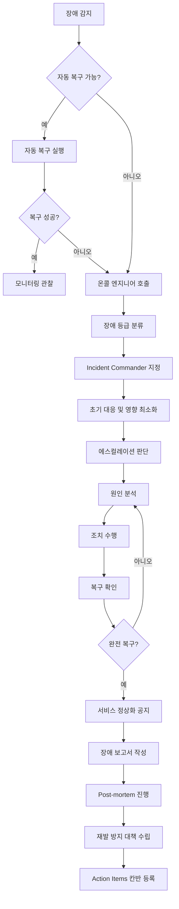

# 장애 대응 절차서 (Incident Response Procedure)

| 항목 | 내용 |
|------|------|
| **프로젝트명** | [프로젝트명] |
| **문서 버전** | [v1.0] |
| **작성일** | [YYYY-MM-DD] |
| **작성자** | [작성자명 / 역할] |
| **승인자** | [승인자명 / 역할] |

---

## 변경 이력

| 버전 | 날짜 | 작성자 | 변경 내용 |
|------|------|--------|-----------|
| 0.1 | [YYYY-MM-DD] | [이름] | 초안 작성 |
| 0.2 | [YYYY-MM-DD] | [이름] | 리뷰 반영 |
| 1.0 | [YYYY-MM-DD] | [이름] | 최초 승인 |

---

## 1. 장애 대응 개요

### 1.1 목적

본 문서는 [프로젝트명] 서비스 운영 중 발생하는 장애에 대해 신속하고 체계적으로 대응하기 위한 절차를 정의한다. 장애 감지부터 복구, 사후 분석(Post-mortem)까지의 전체 생명주기를 다루며, 칸반 보드를 통해 장애 대응 진행 상황을 실시간으로 추적한다.

### 1.2 적용 범위

- **대상 시스템:** [프로젝트명]의 모든 프로덕션 및 스테이징 환경
- **대상 인프라:** 애플리케이션 서버, 데이터베이스, 캐시, 메시지 큐, CDN, 외부 연동 서비스
- **적용 대상:** 운영팀, 개발팀, 인프라팀, SRE팀, 보안팀

### 1.3 관련 문서

| 문서명 | 문서 ID | 설명 |
|--------|---------|------|
| 운영 가이드 | OPG-[프로젝트코드]-v[버전] | 시스템 운영 매뉴얼, 모니터링 설정 |
| 배포 계획서 | DPP-[프로젝트코드]-v[버전] | 롤백 절차 포함 |
| 유지보수 계획서 | MTP-[프로젝트코드]-v[버전] | SLA 정의, 변경 관리 프로세스 |
| 보안 가이드 | [문서 ID] | 보안 사고 대응 절차 |

---

## 2. 장애 분류 체계

### 2.1 장애 등급 정의

| 등급 | 명칭 | 정의 | 영향 범위 | 대응 시간 | 복구 목표(RTO) | 예시 |
|------|------|------|-----------|-----------|----------------|------|
| **P1** | Critical | 전체 서비스 중단 또는 핵심 기능 완전 마비 | 전체 사용자 | 15분 이내 | 1시간 이내 | 전체 서버 다운, DB 장애, 결제 불가 |
| **P2** | Major | 주요 기능 장애 또는 심각한 성능 저하 | 다수 사용자 (50% 이상) | 30분 이내 | 4시간 이내 | 특정 API 장애, 로그인 불가, 심각한 응답 지연 |
| **P3** | Minor | 부분적 기능 장애 또는 일부 사용자 영향 | 일부 사용자 (50% 미만) | 2시간 이내 | 다음 영업일 | 특정 브라우저 오류, 일부 기능 오작동, 알림 지연 |
| **P4** | Low | 경미한 이슈, 서비스 품질에 미미한 영향 | 극소수 사용자 | 다음 영업일 | 차기 릴리스 | UI 깨짐, 오타, 로그 누락 |

### 2.2 장애 등급 판단 기준

장애 등급은 아래 매트릭스를 기반으로 판단한다.

| | 사용자 영향: 극소수 | 사용자 영향: 일부 | 사용자 영향: 다수 | 사용자 영향: 전체 |
|---|---|---|---|---|
| **비즈니스 영향: 매출 직접 영향** | P3 | P2 | P1 | P1 |
| **비즈니스 영향: 업무 지장** | P4 | P3 | P2 | P1 |
| **비즈니스 영향: 불편 수준** | P4 | P4 | P3 | P2 |

---

## 3. 장애 대응 프로세스

### 3.1 장애 대응 흐름도



### 3.2 단계별 상세 절차

#### 3.2.1 감지 (Detection)

| 감지 방법 | 도구 | 설명 |
|-----------|------|------|
| 인프라 모니터링 | [Prometheus / CloudWatch / Datadog] | CPU, 메모리, 디스크, 네트워크 임계값 초과 |
| 애플리케이션 모니터링 | [Grafana / New Relic / APM] | 에러율, 응답 시간, 처리량 이상 |
| 로그 기반 알림 | [ELK / CloudWatch Logs / Loki] | 에러 로그 패턴 감지 |
| 합성 모니터링 | [Uptime Robot / Pingdom] | 외부에서 주기적 헬스 체크 |
| 사용자 신고 | [고객 지원 채널 / CS 시스템] | 사용자가 직접 장애 보고 |

#### 3.2.2 분류 (Classification)

1. 장애 현상 파악 (어떤 증상이 발생했는가?)
2. 영향 범위 확인 (몇 명의 사용자가 영향을 받는가?)
3. 비즈니스 영향 평가 (매출/업무에 어떤 영향인가?)
4. 장애 등급 결정 (2.1 기준 참조)
5. Incident 티켓 생성 및 칸반 보드 등록

#### 3.2.3 초기 대응 (Initial Response)

- 서비스 상태 공지 (내부/외부)
- 영향 최소화 조치 (트래픽 분산, 기능 비활성화, 장애 페이지 전환)
- 관련 로그 및 메트릭 수집 시작
- War Room(장애 대응 채널) 개설

#### 3.2.4 원인 분석 및 조치 (Analysis & Remediation)

- 로그, 메트릭, 트레이스 분석
- 최근 변경 사항 확인 (배포, 설정 변경, 인프라 변경)
- 원인 특정 후 조치 수행 (롤백, 설정 변경, 리소스 증설, 재시작)
- 조치 후 서비스 정상화 확인

#### 3.2.5 복구 확인 및 공지 (Recovery & Communication)

- 핵심 기능 정상 동작 확인
- 모니터링 지표 정상 범위 확인 (최소 30분 관찰)
- 데이터 정합성 확인 (필요 시)
- 서비스 정상화 공지 발송

---

## 4. 장애 대응 조직

### 4.1 역할 정의

| 역할 | 영문 | 책임 | 담당자 |
|------|------|------|--------|
| **장애 총괄** | Incident Commander (IC) | 장애 대응 전체 지휘, 의사결정, 에스컬레이션 판단 | [이름 / 직책] |
| **커뮤니케이션 담당** | Communication Lead | 내부/외부 공지, 이해관계자 커뮤니케이션, 타임라인 기록 | [이름 / 직책] |
| **기술 리드** | Tech Lead | 원인 분석 지휘, 기술적 의사결정, 조치 수행 감독 | [이름 / 직책] |
| **온콜 엔지니어** | On-call Engineer | 최초 대응, 초기 분석, 긴급 조치 수행 | [로테이션] |
| **운영 엔지니어** | Ops Engineer | 인프라 관련 조치, 모니터링, 로그 수집 | [이름 / 직책] |
| **DBA** | Database Administrator | DB 관련 장애 분석 및 조치 | [이름 / 직책] |

### 4.2 온콜 로테이션 스케줄

| 주차 | 기간 | 1차 온콜 | 2차 온콜 (백업) | 비고 |
|------|------|----------|-----------------|------|
| W[N] | [MM-DD] ~ [MM-DD] | [이름] | [이름] | |
| W[N+1] | [MM-DD] ~ [MM-DD] | [이름] | [이름] | |
| W[N+2] | [MM-DD] ~ [MM-DD] | [이름] | [이름] | |
| W[N+3] | [MM-DD] ~ [MM-DD] | [이름] | [이름] | |

**온콜 규칙:**
- 온콜 시간: 평일 18:00 ~ 익일 09:00 / 주말 및 공휴일 전일
- 알림 수신 후 15분 이내 1차 응답 필수
- 1차 온콜이 30분 내 응답하지 않으면 2차 온콜에게 자동 에스컬레이션
- 온콜 교대 시 인수인계 체크리스트 작성

### 4.3 War Room 운영 규칙

- 장애 등급 P1/P2 발생 시 즉시 War Room 개설
- 채널: [Slack #incident-YYYYMMDD / Zoom / Teams]
- 참여 필수: IC, Tech Lead, On-call Engineer
- 5분 간격 상황 업데이트 (P1) / 15분 간격 (P2)
- 모든 의사결정 및 조치 사항을 타임라인에 기록

---

## 5. Runbook (주요 장애 시나리오)

### 5.1 시나리오 1: 서버 다운 (애플리케이션 응답 없음)

**증상:**
- 헬스 체크 엔드포인트 응답 없음 (HTTP timeout)
- 모니터링 대시보드에서 인스턴스 비활성 표시
- 사용자 접속 불가 또는 502/503 에러 다수 발생

**장애 등급:** P1 (전체 서버 다운 시) / P2 (일부 인스턴스 다운 시)

| 순서 | 조치 | 명령어 / 방법 | 담당 |
|------|------|---------------|------|
| 1 | 서버 프로세스 상태 확인 | `systemctl status [서비스명]` 또는 `docker ps` | 온콜 엔지니어 |
| 2 | 서버 리소스 확인 (CPU, 메모리, 디스크) | `top`, `free -h`, `df -h` | 온콜 엔지니어 |
| 3 | 애플리케이션 로그 확인 | `tail -f /var/log/[앱]/error.log` 또는 `kubectl logs [pod]` | 온콜 엔지니어 |
| 4 | OOM Killer 발생 여부 확인 | `dmesg \| grep -i "out of memory"` | 온콜 엔지니어 |
| 5 | 프로세스 재시작 시도 | `systemctl restart [서비스명]` 또는 `kubectl rollout restart deployment/[이름]` | 온콜 엔지니어 |
| 6 | 로드밸런서에서 해당 인스턴스 제외 | [LB 관리 콘솔에서 타겟 제거] | 운영 엔지니어 |
| 7 | 새 인스턴스 기동 (Auto Scaling 미작동 시) | [인스턴스 시작 명령 또는 콘솔 작업] | 운영 엔지니어 |
| 8 | 최근 배포 이력 확인, 필요 시 롤백 | `[배포 도구 롤백 명령]` | Tech Lead |
| 9 | 정상화 확인 | 헬스 체크, 핵심 기능 수동 테스트 | 온콜 엔지니어 |

### 5.2 시나리오 2: DB 커넥션 풀 소진

**증상:**
- `Connection pool exhausted` 또는 `Cannot acquire connection` 에러 로그
- API 응답 시간 급격히 증가 (타임아웃 발생)
- DB 모니터링에서 Active Connection 수가 최대치 도달

**장애 등급:** P1 (전체 API 영향) / P2 (일부 기능 영향)

| 순서 | 조치 | 명령어 / 방법 | 담당 |
|------|------|---------------|------|
| 1 | DB 커넥션 수 확인 | `SELECT count(*) FROM pg_stat_activity;` (PostgreSQL) | DBA |
| 2 | 장시간 유지 커넥션(Idle) 확인 | `SELECT * FROM pg_stat_activity WHERE state = 'idle' AND query_start < now() - interval '5 minutes';` | DBA |
| 3 | 슬로우 쿼리 확인 | `SELECT * FROM pg_stat_activity WHERE state = 'active' ORDER BY query_start ASC LIMIT 20;` | DBA |
| 4 | Idle 커넥션 강제 종료 | `SELECT pg_terminate_backend(pid) FROM pg_stat_activity WHERE state = 'idle' AND query_start < now() - interval '10 minutes';` | DBA |
| 5 | 애플리케이션 커넥션 풀 설정 확인 | `[설정 파일 확인: maxPoolSize, minIdle, maxLifetime]` | Tech Lead |
| 6 | 필요 시 커넥션 풀 크기 임시 증가 | `[환경변수 또는 설정 변경 후 재시작]` | Tech Lead |
| 7 | 원인이 된 슬로우 쿼리 킬 | `SELECT pg_cancel_backend(pid);` | DBA |
| 8 | 애플리케이션 순차 재시작 (Rolling) | `[Rolling restart 명령]` | 온콜 엔지니어 |
| 9 | 정상화 확인 | DB 커넥션 수, API 응답 시간 모니터링 | 온콜 엔지니어 |

### 5.3 시나리오 3: 디스크 풀 (No space left on device)

**증상:**
- `No space left on device` 에러 로그
- 파일 쓰기 실패 (로그, 업로드, 임시 파일)
- 데이터베이스 쓰기 실패

**장애 등급:** P1 (DB 디스크 풀) / P2 (애플리케이션 서버 디스크 풀)

| 순서 | 조치 | 명령어 / 방법 | 담당 |
|------|------|---------------|------|
| 1 | 디스크 사용량 확인 | `df -h` | 온콜 엔지니어 |
| 2 | 대용량 디렉토리 식별 | `du -sh /* \| sort -rh \| head -20` | 온콜 엔지니어 |
| 3 | 오래된 로그 파일 정리 | `find /var/log -name "*.log.*" -mtime +7 -delete` | 온콜 엔지니어 |
| 4 | 임시 파일 정리 | `rm -rf /tmp/[앱명]-*` | 온콜 엔지니어 |
| 5 | Docker 미사용 이미지/볼륨 정리 | `docker system prune -a --volumes` | 운영 엔지니어 |
| 6 | 코어 덤프 파일 확인 및 삭제 | `find / -name "core.*" -delete` | 온콜 엔지니어 |
| 7 | 디스크 사용량 재확인 | `df -h` | 온콜 엔지니어 |
| 8 | 근본 원인 확인 (로그 로테이션 미설정 등) | [logrotate 설정 확인] | 운영 엔지니어 |
| 9 | 필요 시 디스크 증설 (EBS 확장 등) | [클라우드 콘솔 또는 CLI] | 운영 엔지니어 |

### 5.4 시나리오 4: 메모리 누수

**증상:**
- 시간이 경과함에 따라 메모리 사용률이 지속적으로 증가
- OOM(Out of Memory) Killer에 의한 프로세스 종료
- GC(Garbage Collection) 시간 증가, Full GC 빈번 발생

**장애 등급:** P2 (서비스 성능 저하) / P1 (OOM으로 인한 서비스 중단)

| 순서 | 조치 | 명령어 / 방법 | 담당 |
|------|------|---------------|------|
| 1 | 메모리 사용량 확인 | `free -h`, `top -o %MEM` | 온콜 엔지니어 |
| 2 | 프로세스별 메모리 사용량 확인 | `ps aux --sort=-%mem \| head -20` | 온콜 엔지니어 |
| 3 | GC 로그 확인 (JVM 기반) | `[GC 로그 파일 또는 JMX 모니터링]` | Tech Lead |
| 4 | 힙 덤프 수집 (재시작 전) | `jmap -dump:format=b,file=heap.hprof [PID]` (Java) | Tech Lead |
| 5 | 문제 인스턴스 Rolling Restart | `[Rolling restart 명령]` | 온콜 엔지니어 |
| 6 | 트래픽 분산 (문제 인스턴스 제외) | [LB 타겟 제거] | 운영 엔지니어 |
| 7 | 힙 덤프 분석 (사후) | [Eclipse MAT / VisualVM 분석] | Tech Lead |
| 8 | 메모리 모니터링 강화 | [메모리 사용률 알림 임계값 하향] | 운영 엔지니어 |
| 9 | 정상화 확인 | 메모리 사용률 추이 관찰 (최소 1시간) | 온콜 엔지니어 |

### 5.5 시나리오 5: SSL 인증서 만료

**증상:**
- 브라우저에서 `ERR_CERT_DATE_INVALID` / `NET::ERR_CERT_AUTHORITY_INVALID` 표시
- HTTPS 연결 실패
- 외부 시스템 연동 TLS Handshake 실패

**장애 등급:** P1 (전체 HTTPS 접속 불가) / P3 (일부 서브도메인 영향)

| 순서 | 조치 | 명령어 / 방법 | 담당 |
|------|------|---------------|------|
| 1 | 인증서 만료일 확인 | `echo \| openssl s_client -servername [도메인] -connect [도메인]:443 2>/dev/null \| openssl x509 -noout -dates` | 온콜 엔지니어 |
| 2 | 인증서 발급 상태 확인 | [인증서 관리 도구: Let's Encrypt / ACM / DigiCert] | 운영 엔지니어 |
| 3 | 인증서 갱신 실행 | `certbot renew` 또는 [인증서 관리 콘솔 갱신] | 운영 엔지니어 |
| 4 | 새 인증서 적용 | `nginx -s reload` 또는 [LB 인증서 교체] | 운영 엔지니어 |
| 5 | SSL 정상 동작 확인 | `curl -v https://[도메인]` | 온콜 엔지니어 |
| 6 | 인증서 자동 갱신 설정 확인/적용 | [cron job 또는 자동 갱신 서비스 설정] | 운영 엔지니어 |
| 7 | 인증서 만료 모니터링 알림 설정 | [만료 30일/7일 전 알림] | 운영 엔지니어 |

### 5.6 시나리오 6: 외부 서비스 장애 (API Timeout)

**증상:**
- 외부 API 호출 타임아웃 다수 발생
- Circuit Breaker Open 상태
- 관련 기능 사용 불가 또는 지연

**장애 등급:** P2 (핵심 외부 서비스 장애) / P3 (부가 기능 관련 외부 서비스)

| 순서 | 조치 | 명령어 / 방법 | 담당 |
|------|------|---------------|------|
| 1 | 외부 서비스 상태 확인 | [외부 서비스 Status Page 확인], `curl -w "%{time_total}" -o /dev/null -s [외부 API URL]` | 온콜 엔지니어 |
| 2 | 네트워크 연결 확인 | `telnet [외부 호스트] [포트]`, `traceroute [외부 호스트]` | 온콜 엔지니어 |
| 3 | Circuit Breaker 상태 확인 | [애플리케이션 메트릭 / Actuator 엔드포인트] | Tech Lead |
| 4 | Fallback 메커니즘 활성화 | [기능 플래그(Feature Flag)로 대체 로직 활성화] | Tech Lead |
| 5 | 타임아웃 설정 조정 (임시) | [타임아웃 / 재시도 설정 변경] | Tech Lead |
| 6 | 외부 서비스 제공자에 장애 보고 | [담당자에게 연락 / 지원 티켓 생성] | Communication Lead |
| 7 | 사용자 안내 (해당 기능 일시 불가 공지) | [상태 페이지 업데이트 / 인앱 안내] | Communication Lead |
| 8 | 외부 서비스 복구 확인 | [Health Check / 수동 테스트] | 온콜 엔지니어 |
| 9 | Circuit Breaker Reset 및 정상화 확인 | [CB 수동 Reset 또는 자동 복구 대기] | Tech Lead |

### 5.7 시나리오 7: DDoS / 비정상 트래픽

**증상:**
- 갑작스러운 트래픽 급증 (정상 대비 10배 이상)
- 특정 IP/지역에서 대량 요청
- 서버 CPU/네트워크 포화, 정상 사용자 접속 불가

**장애 등급:** P1 (서비스 접속 불가) / P2 (성능 심각 저하)

| 순서 | 조치 | 명령어 / 방법 | 담당 |
|------|------|---------------|------|
| 1 | 트래픽 패턴 분석 | [WAF / CDN 로그 분석], [액세스 로그에서 IP별 요청 수 확인] | 운영 엔지니어 |
| 2 | 비정상 IP 식별 | `awk '{print $1}' access.log \| sort \| uniq -c \| sort -rn \| head -20` | 운영 엔지니어 |
| 3 | WAF 규칙 적용 (Rate Limiting 강화) | [WAF 콘솔에서 Rate Limit 규칙 추가] | 운영 엔지니어 |
| 4 | 의심 IP/IP 대역 차단 | [WAF / 방화벽에서 IP 블록 리스트 등록] | 운영 엔지니어 |
| 5 | CDN 캐시 활용 극대화 | [CDN 캐시 TTL 연장, 오리진 보호 설정] | 운영 엔지니어 |
| 6 | Auto Scaling 확인/강화 | [Auto Scaling 정책 확인, 최대 인스턴스 수 상향] | 운영 엔지니어 |
| 7 | DDoS 방어 서비스 활성화 | [AWS Shield Advanced / CloudFlare Under Attack Mode] | 운영 엔지니어 |
| 8 | ISP/클라우드 사업자에 DDoS 보고 | [지원 티켓 / 긴급 연락] | Communication Lead |
| 9 | 정상화 확인 | 트래픽 패턴, 응답 시간, 에러율 모니터링 | 온콜 엔지니어 |

---

## 6. Post-mortem 템플릿

> Post-mortem은 비난 없는 문화(Blameless Culture) 하에서 진행한다. 목적은 개인이 아닌 시스템과 프로세스의 개선이다.

### 6.1 기본 정보

| 항목 | 내용 |
|------|------|
| **장애 ID** | INC-[YYYYMMDD]-[순번] |
| **장애 제목** | [장애를 한 줄로 요약] |
| **발생 일시** | [YYYY-MM-DD HH:MM:SS] |
| **감지 일시** | [YYYY-MM-DD HH:MM:SS] |
| **복구 일시** | [YYYY-MM-DD HH:MM:SS] |
| **총 장애 시간** | [N시간 N분] |
| **장애 등급** | P[1/2/3/4] |
| **영향 범위** | [영향 받은 사용자 수, 기능, 매출 등] |
| **Incident Commander** | [이름] |
| **작성자** | [이름] |
| **작성일** | [YYYY-MM-DD] |

### 6.2 장애 요약

[장애 현상과 영향을 2~3문장으로 요약]

### 6.3 타임라인

| 시간 (KST) | 이벤트 | 비고 |
|-------------|--------|------|
| [HH:MM] | [이벤트 발생] | 장애 시작 |
| [HH:MM] | 모니터링 알림 발생 (알림명: [알림명]) | 자동 감지 |
| [HH:MM] | 온콜 엔지니어 [이름] 확인 시작 | |
| [HH:MM] | 장애 등급 P[N]으로 분류 | |
| [HH:MM] | War Room 개설, IC [이름] 지정 | |
| [HH:MM] | [초기 분석 결과: ...]  | |
| [HH:MM] | [조치 내용: 예) 롤백 실행] | |
| [HH:MM] | 서비스 복구 확인 | |
| [HH:MM] | 서비스 정상화 공지 발송 | 장애 종료 |

### 6.4 근본 원인 분석 (5 Whys)

| 질문 | 답변 |
|------|------|
| **1. 왜 장애가 발생했는가?** | [직접 원인] |
| **2. 왜 [직접 원인]이 발생했는가?** | [원인의 원인] |
| **3. 왜 [원인의 원인]이 발생했는가?** | [더 깊은 원인] |
| **4. 왜 [더 깊은 원인]이 발생했는가?** | [근본 원인에 가까운 답변] |
| **5. 왜 [근본 원인에 가까운 답변]인가?** | [근본 원인 (Root Cause)] |

**근본 원인 요약:** [근본 원인을 한 문장으로 정리]

### 6.5 재발 방지 대책

#### 단기 (1주 이내)

| 항목 | 설명 | 담당자 | 기한 | 상태 |
|------|------|--------|------|------|
| [대책 1] | [설명] | [이름] | [YYYY-MM-DD] | To Do / In Progress / Done |
| [대책 2] | [설명] | [이름] | [YYYY-MM-DD] | To Do / In Progress / Done |

#### 중기 (1개월 이내)

| 항목 | 설명 | 담당자 | 기한 | 상태 |
|------|------|--------|------|------|
| [대책 1] | [설명] | [이름] | [YYYY-MM-DD] | To Do / In Progress / Done |
| [대책 2] | [설명] | [이름] | [YYYY-MM-DD] | To Do / In Progress / Done |

#### 장기 (분기 이내)

| 항목 | 설명 | 담당자 | 기한 | 상태 |
|------|------|--------|------|------|
| [대책 1] | [설명] | [이름] | [YYYY-MM-DD] | To Do / In Progress / Done |
| [대책 2] | [설명] | [이름] | [YYYY-MM-DD] | To Do / In Progress / Done |

### 6.6 Action Items

> 모든 Action Items는 칸반 보드에 등록하여 진행 상황을 추적한다.

| ID | Action Item | 담당자 | 기한 | 우선순위 | 칸반 상태 |
|----|-------------|--------|------|----------|-----------|
| AI-001 | [Action Item 설명] | [이름] | [YYYY-MM-DD] | 상/중/하 | Backlog / In Progress / Done |
| AI-002 | [Action Item 설명] | [이름] | [YYYY-MM-DD] | 상/중/하 | Backlog / In Progress / Done |
| AI-003 | [Action Item 설명] | [이름] | [YYYY-MM-DD] | 상/중/하 | Backlog / In Progress / Done |

### 6.7 교훈 (Lessons Learned)

**잘 된 점 (What went well):**
- [잘 된 점 1: 예) 모니터링 알림이 즉시 작동하여 빠르게 감지]
- [잘 된 점 2: 예) 팀 간 커뮤니케이션이 원활]
- [잘 된 점 3]

**개선이 필요한 점 (What didn't go well):**
- [개선점 1: 예) 롤백 절차가 문서화되어 있지 않아 지연]
- [개선점 2: 예) 에스컬레이션 대상이 불명확]
- [개선점 3]

**행운이었던 점 (Where we got lucky):**
- [행운 1: 예) 트래픽이 낮은 시간대에 발생하여 사용자 영향 제한적]
- [행운 2]

---

## 7. 에스컬레이션 매트릭스

### 7.1 시간 경과별 에스컬레이션

| 등급 | 0~15분 | 15~30분 | 30분~1시간 | 1~2시간 | 2시간 이상 |
|------|--------|---------|------------|---------|------------|
| **P1** | 온콜 엔지니어 + Tech Lead | IC + 팀 리드 전원 | CTO / VP of Engineering | 경영진 보고 | 외부 전문 지원 검토 |
| **P2** | 온콜 엔지니어 | Tech Lead | IC + 팀 리드 | CTO 보고 | 경영진 보고 |
| **P3** | 온콜 엔지니어 | - | Tech Lead | 팀 리드 | IC 지정 검토 |
| **P4** | 백로그 등록 | - | - | - | - |

### 7.2 알림 방법

| 우선순위 | 채널 | 설명 |
|----------|------|------|
| 1차 | [PagerDuty / OpsGenie] | 자동 알림, 승인(Ack) 기능 포함 |
| 2차 | [Slack #incident 채널] | 장애 현황 공유 및 협업 |
| 3차 | 전화 (직접 통화) | 미응답 시 또는 P1 에스컬레이션 |
| 4차 | 이메일 | 장애 보고서 및 공식 커뮤니케이션 |
| 5차 | SMS | PagerDuty 미응답 시 백업 |

### 7.3 외부 에스컬레이션 연락처

| 대상 | 담당자 | 연락처 | 이메일 | 비고 |
|------|--------|--------|--------|------|
| 클라우드 서비스 지원 | [벤더명] | [지원 전화] | [지원 이메일] | [SLA 등급 / 지원 플랜] |
| DB 관리형 서비스 지원 | [벤더명] | [지원 전화] | [지원 이메일] | |
| CDN/WAF 서비스 지원 | [벤더명] | [지원 전화] | [지원 이메일] | |
| 외부 연동 시스템 A | [회사명] | [담당자 전화] | [담당자 이메일] | |
| 외부 연동 시스템 B | [회사명] | [담당자 전화] | [담당자 이메일] | |

---

## 8. 장애 대응 훈련

### 8.1 정기 장애 대응 훈련 계획

| 훈련 유형 | 주기 | 목적 | 참여 대상 |
|-----------|------|------|-----------|
| 테이블탑 훈련 (Tabletop Exercise) | 분기 1회 | 장애 시나리오에 대한 대응 절차 리허설 | 전체 운영/개발팀 |
| 장애 대응 시뮬레이션 | 반기 1회 | 실제 환경에서 장애 대응 역량 검증 | 온콜 엔지니어, IC, Tech Lead |
| Game Day | 분기 1회 | 실제 장애를 유발하여 시스템 내구성 검증 | SRE팀, 개발팀 |
| Chaos Engineering | 상시 | 시스템 약점을 사전에 발견하고 개선 | SRE팀 |

### 8.2 Game Day / Chaos Engineering 가이드

#### Game Day 실행 절차

1. **계획:** 장애 시나리오 선정, 영향 범위 예측, 안전 장치(킬 스위치) 준비
2. **공지:** 참여 팀에 Game Day 일정 및 범위 공지 (고객 영향 없는 범위)
3. **실행:** 사전 정의된 장애를 주입하고 대응 과정 진행
4. **관찰:** 시스템 반응, 대응 시간, 의사결정 과정 기록
5. **종료:** 킬 스위치로 장애 종료, 시스템 정상 확인
6. **회고:** 참여자 전원 회고 미팅, 개선 사항 도출

#### Chaos Engineering 도구

| 도구 | 용도 | 비고 |
|------|------|------|
| [Chaos Monkey / Litmus] | 랜덤 인스턴스 종료 | Netflix OSS |
| [Gremlin] | 다양한 장애 유형 주입 (CPU, 메모리, 네트워크, 디스크) | SaaS |
| [Chaos Mesh] | Kubernetes 환경 Chaos Engineering | CNCF |
| [AWS Fault Injection Simulator] | AWS 환경 장애 주입 | AWS 관리형 |

#### Chaos Engineering 실험 템플릿

| 항목 | 내용 |
|------|------|
| **실험명** | [실험 제목] |
| **가설** | [예: 인스턴스 1대를 종료해도 서비스는 정상 유지된다] |
| **대상** | [대상 시스템/서비스] |
| **장애 유형** | [인스턴스 종료 / CPU 부하 / 네트워크 지연 / 디스크 풀 / ...] |
| **안전 장치** | [킬 스위치 방법, 최대 실행 시간] |
| **성공 기준** | [서비스 가용성 99.9% 유지, 응답 시간 2배 이내] |

### 8.3 훈련 결과 기록 템플릿

| 항목 | 내용 |
|------|------|
| **훈련 일시** | [YYYY-MM-DD HH:MM] |
| **훈련 유형** | [테이블탑 / 시뮬레이션 / Game Day / Chaos Engineering] |
| **시나리오** | [훈련 시나리오 설명] |
| **참여자** | [참여자 목록] |

**훈련 결과:**

| 평가 항목 | 목표 | 실제 | 충족 | 비고 |
|-----------|------|------|------|------|
| 장애 감지 시간 | [N]분 이내 | [N]분 | Y/N | |
| 에스컬레이션 시간 | [N]분 이내 | [N]분 | Y/N | |
| 복구 시간 (RTO) | [N]분 이내 | [N]분 | Y/N | |
| 커뮤니케이션 적절성 | 적절 | [적절/미흡] | Y/N | |
| 문서(Runbook) 정확성 | 정확 | [정확/부분 오류] | Y/N | |

**발견된 개선 사항:**

| ID | 개선 사항 | 담당자 | 기한 | 상태 |
|----|-----------|--------|------|------|
| TI-001 | [개선 사항 설명] | [이름] | [YYYY-MM-DD] | To Do / Done |
| TI-002 | [개선 사항 설명] | [이름] | [YYYY-MM-DD] | To Do / Done |

**종합 평가:**
[훈련에 대한 전반적인 평가와 다음 훈련에서 중점적으로 다룰 사항]

---

## 부록

### A. 장애 대응 체크리스트 (Quick Reference)

**P1 장애 발생 시:**
- [ ] 장애 확인 및 등급 분류
- [ ] War Room 개설 (Slack #incident-YYYYMMDD)
- [ ] IC 지정
- [ ] 초기 영향 최소화 조치
- [ ] 내부 공지 (경영진 포함)
- [ ] 외부 공지 (사용자 대상, 필요 시)
- [ ] 원인 분석 및 조치
- [ ] 복구 확인 (기능, 성능, 데이터 정합성)
- [ ] 서비스 정상화 공지
- [ ] 장애 보고서 초안 작성 (24시간 이내)
- [ ] Post-mortem 미팅 (3영업일 이내)
- [ ] Action Items 칸반 등록

### B. 장애 보고 양식 (간략)

```
[장애 보고]
- 장애 ID: INC-[YYYYMMDD]-[순번]
- 등급: P[1/2/3/4]
- 발생 시각: [HH:MM]
- 복구 시각: [HH:MM]
- 영향: [영향 요약]
- 원인: [원인 요약]
- 조치: [조치 요약]
- 상태: [진행중 / 복구완료 / Post-mortem 완료]
```

### C. 칸반 보드 연동

장애 관련 Work Item은 칸반 보드에서 다음과 같이 관리한다:

| 칸반 레인 | 용도 | 포함 항목 |
|-----------|------|-----------|
| **Incident** (긴급) | 현재 진행 중인 장애 대응 | 활성 장애 티켓 |
| **Post-mortem** | 사후 분석 진행 중 | Post-mortem 작성 및 리뷰 |
| **Incident Action Items** | 장애 후속 조치 | 재발 방지 대책, 모니터링 개선 등 |

**Class of Service:**
- **Expedite:** P1/P2 장애 대응 (WIP Limit 무시, 즉시 처리)
- **Fixed Date:** 훈련 일정, 인증서 갱신 등 기한이 정해진 항목
- **Standard:** 일반 후속 조치, 개선 작업
