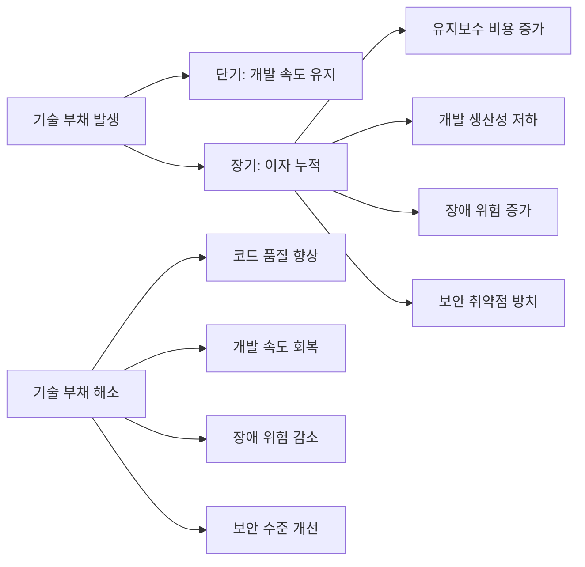
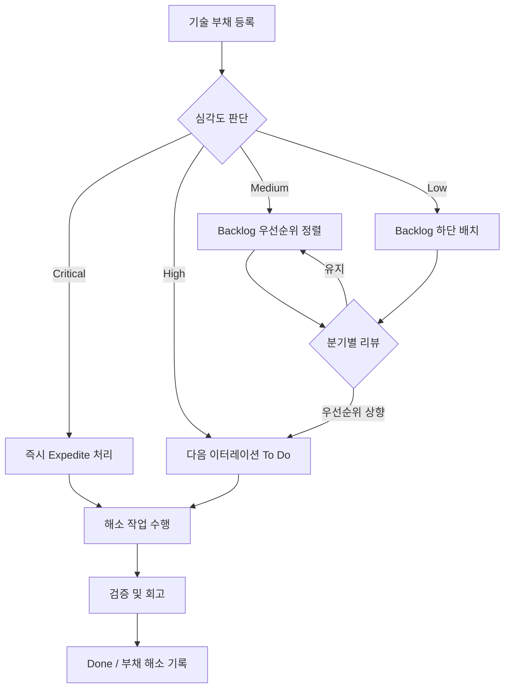

# 기술부채 관리대장 (Technical Debt Registry)

| 항목 | 내용 |
|------|------|
| **프로젝트명** | [프로젝트명] |
| **문서 버전** | [v1.0] |
| **작성일** | [YYYY-MM-DD] |
| **작성자** | [작성자명 / 역할] |
| **승인자** | [승인자명 / 역할] |

---

## 변경 이력

| 버전 | 날짜 | 작성자 | 변경 내용 |
|------|------|--------|-----------|
| 0.1 | [YYYY-MM-DD] | [이름] | 초안 작성 |
| 0.2 | [YYYY-MM-DD] | [이름] | 보안 부채 분류 추가 |
| 1.0 | [YYYY-MM-DD] | [이름] | 최초 승인 |

---

## 1. 기술 부채 관리 개요

### 1.1 목적

본 문서는 [프로젝트명]의 기술 부채를 체계적으로 식별, 등록, 추적, 해소하기 위한 관리대장이다. 기술 부채를 가시화하여 의사결정에 활용하고, 칸반 보드와 연동하여 지속적으로 해소함으로써 시스템의 품질과 개발 생산성을 유지한다.

### 1.2 기술 부채 정의

기술 부채(Technical Debt)란 빠른 개발이나 단기적 편의를 위해 차선의 기술적 결정을 내림으로써 발생하는, 향후 추가 작업이 필요한 잠재적 비용을 말한다. 금융 부채와 유사하게, 기술 부채도 방치할수록 이자가 누적되어 유지보수 비용이 증가하고 개발 속도가 저하된다.



### 1.3 관리 원칙

1. **가시화 (Visibility):** 모든 기술 부채를 등록하고 칸반 보드에서 추적한다.
2. **정량화 (Quantification):** 부채의 심각도, 해소 비용, 비즈니스 영향을 정량적으로 평가한다.
3. **지속적 해소 (Continuous Payoff):** 전체 개발 역량의 일정 비율(20% 권장)을 부채 해소에 할당한다.
4. **예방 우선 (Prevention First):** 새로운 부채 발생을 최소화하는 프로세스를 운영한다.
5. **비난 없는 문화 (Blameless):** 기술 부채 등록은 개인 비난이 아닌 시스템 개선을 위한 활동이다.

---

## 2. 기술 부채 분류

### 2.1 분류 체계

| 분류 | 설명 | 예시 | 영향 |
|------|------|------|------|
| **코드 부채** | 코드 품질 저하, 복잡도 증가, 중복 코드 | 복잡한 조건문 중첩, 매직 넘버, God Class, Copy-Paste 코드, 미사용 코드 방치 | 가독성 저하, 버그 발생 확률 증가, 온보딩 시간 증가 |
| **아키텍처 부채** | 부적절한 설계, 확장성 제한, 모듈 간 강결합 | 모놀리식에서 분리 필요한 모듈, 순환 의존성, 레이어 위반, 부적절한 데이터 모델 | 확장성 제한, 변경 비용 증가, 배포 복잡도 증가 |
| **테스트 부채** | 테스트 부족, 테스트 품질 저하 | 낮은 테스트 커버리지, 깨진 테스트 방치, 통합 테스트 부재, Flaky 테스트 | 회귀 버그 위험, 리팩토링 어려움, 릴리스 자신감 부족 |
| **문서 부채** | 문서 부재, 오래된 문서, 실제와 불일치 | API 문서 미작성, 아키텍처 문서 미갱신, 주석과 코드 불일치, README 부재 | 온보딩 비용 증가, 잘못된 의사결정, 지식 손실 |
| **인프라 부채** | IaC 미적용, 수동 운영, 낡은 인프라 | 수동 서버 설정, 인프라 코드화 미적용, 오래된 OS/런타임, 비효율적 리소스 할당 | 운영 비용 증가, 재현 불가능한 환경, 장애 대응 지연 |
| **보안 부채** | 보안 취약점 방치, 미적용된 보안 패치, 취약한 의존성 | 알려진 CVE가 있는 라이브러리 사용, 하드코딩된 시크릿, 미적용된 보안 헤더, 오래된 TLS 버전, 부적절한 접근 제어 | 보안 사고 위험, 컴플라이언스 위반, 데이터 유출 가능성 |

### 2.2 보안 부채 세부 분류

> 보안 부채는 다른 부채와 달리 외부 공격에 의한 즉각적인 피해로 이어질 수 있어 별도로 세부 관리한다.

| 세부 분류 | 설명 | 예시 | 위험 수준 |
|-----------|------|------|-----------|
| 취약한 의존성 | 알려진 CVE가 있는 라이브러리/패키지 | npm audit / OWASP Dependency Check에서 발견된 취약점 | 상 |
| 미적용 보안 패치 | 출시된 보안 패치가 적용되지 않은 상태 | OS 패치, 런타임 보안 업데이트, DB 보안 패치 | 상 |
| 하드코딩된 시크릿 | 소스 코드에 포함된 비밀번호, API Key, 토큰 | 소스 코드 내 DB 비밀번호, .env 파일 미사용 | 상 |
| 부적절한 인증/인가 | 취약한 인증 메커니즘, 불충분한 접근 제어 | 약한 비밀번호 정책, RBAC 미적용, JWT 검증 누락 | 상 |
| 암호화 미흡 | 부적절한 암호화 또는 암호화 미적용 | 평문 데이터 전송, 약한 해시 알고리즘 사용, TLS 1.0/1.1 사용 | 중 |
| 로깅/감사 부재 | 보안 이벤트 로깅 또는 감사 추적 부재 | 로그인 시도 미기록, 권한 변경 미추적, 감사 로그 미보존 | 중 |

---

## 3. 기술 부채 등록 템플릿

### 3.1 개별 등록 양식

| 항목 | 내용 |
|------|------|
| **TD-ID** | TD-[YYYYMM]-[순번] (예: TD-202602-001) |
| **등록일** | [YYYY-MM-DD] |
| **등록자** | [이름] |
| **분류** | 코드 / 아키텍처 / 테스트 / 문서 / 인프라 / 보안 |
| **제목** | [기술 부채를 한 줄로 설명] |
| **위치** | [파일 경로 / 모듈명 / 서비스명 / 인프라 구성 요소] |
| **현재 상태** | [현재의 기술적 상태를 구체적으로 설명] |
| **발생 원인** | [이 부채가 발생한 원인 - 일정 압박, 의사결정 오류, 기술 발전에 따른 노후화 등] |
| **영향 범위** | [이 부채가 영향을 미치는 범위 - 성능, 보안, 개발 생산성 등] |
| **개선 방안** | [이상적인 목표 상태와 해소 방법] |
| **예상 공수** | [N]인일 / [N]인시간 |
| **심각도** | Critical / High / Medium / Low |
| **우선순위** | P1 / P2 / P3 / P4 (우선순위 판단 매트릭스 기반) |
| **칸반 상태** | Backlog / To Do / In Progress / Done |

### 3.2 우선순위 판단 매트릭스

각 항목을 1~5점으로 평가하여 총점을 기반으로 우선순위를 결정한다.

| 평가 항목 | 1점 (낮음) | 3점 (보통) | 5점 (높음) | 가중치 |
|-----------|-----------|-----------|-----------|--------|
| **비즈니스 영향** | 사용자 경험에 영향 없음 | 일부 사용자 불편 | 매출/핵심 기능에 직접 영향 | x3 |
| **기술적 위험** | 장애 가능성 극히 낮음 | 특정 조건에서 장애 가능 | 언제든 장애 발생 가능 | x3 |
| **개발 생산성** | 개발 속도에 영향 없음 | 관련 작업 시 약간의 지연 | 모든 관련 작업이 현저히 지연 | x2 |
| **보안 위험** | 보안 영향 없음 | 잠재적 보안 위험 존재 | 즉각적 보안 사고 가능 | x4 |
| **해소 비용** | 5인일 이상 | 2~5인일 | 1인일 이하 | x1 |

**총점 계산:** (비즈니스 영향 x 3) + (기술적 위험 x 3) + (개발 생산성 x 2) + (보안 위험 x 4) + (해소 비용 x 1)

| 총점 범위 | 우선순위 | 해소 기한 |
|-----------|----------|-----------|
| 50점 이상 | P1 (긴급) | 즉시 (현재 스프린트/이터레이션 내) |
| 35~49점 | P2 (높음) | 다음 분기 내 |
| 20~34점 | P3 (보통) | 6개월 내 |
| 20점 미만 | P4 (낮음) | 기회 발생 시 해소 |

---

## 4. 기술 부채 현황 대시보드

### 4.1 분류별 부채 현황

| 분류 | 등록 건수 | Critical | High | Medium | Low | 해소 완료 | 잔여 |
|------|-----------|----------|------|--------|-----|-----------|------|
| 코드 부채 | [N] | [N] | [N] | [N] | [N] | [N] | [N] |
| 아키텍처 부채 | [N] | [N] | [N] | [N] | [N] | [N] | [N] |
| 테스트 부채 | [N] | [N] | [N] | [N] | [N] | [N] | [N] |
| 문서 부채 | [N] | [N] | [N] | [N] | [N] | [N] | [N] |
| 인프라 부채 | [N] | [N] | [N] | [N] | [N] | [N] | [N] |
| 보안 부채 | [N] | [N] | [N] | [N] | [N] | [N] | [N] |
| **합계** | **[N]** | **[N]** | **[N]** | **[N]** | **[N]** | **[N]** | **[N]** |

### 4.2 심각도별 분포

| 심각도 | 건수 | 비율 | 비고 |
|--------|------|------|------|
| Critical | [N] | [N%] | 즉시 해소 대상 |
| High | [N] | [N%] | 분기 내 해소 대상 |
| Medium | [N] | [N%] | 계획적 해소 |
| Low | [N] | [N%] | 기회 발생 시 해소 |
| **합계** | **[N]** | **100%** | |

### 4.3 트렌드 추이 (등록 vs 해소)

| 기간 | 신규 등록 | 해소 완료 | 순증감 | 누적 잔여 |
|------|-----------|-----------|--------|-----------|
| [YYYY-MM] | [N] | [N] | [+/-N] | [N] |
| [YYYY-MM] | [N] | [N] | [+/-N] | [N] |
| [YYYY-MM] | [N] | [N] | [+/-N] | [N] |
| [YYYY-MM] | [N] | [N] | [+/-N] | [N] |
| [YYYY-MM] | [N] | [N] | [+/-N] | [N] |
| [YYYY-MM] | [N] | [N] | [+/-N] | [N] |

> **목표:** 매월 순증감이 음수(-)가 되어야 하며, 기술 부채 총량이 지속적으로 감소하는 추세를 유지한다.

### 4.4 기술 부채 등록부 (레지스트리)

| TD-ID | 분류 | 제목 | 심각도 | 우선순위 | 예상 공수 | 등록일 | 담당자 | 상태 |
|-------|------|------|--------|----------|-----------|--------|--------|------|
| TD-[YYYYMM]-001 | [분류] | [제목] | [심각도] | P[N] | [N]인일 | [YYYY-MM-DD] | [이름] | Backlog |
| TD-[YYYYMM]-002 | [분류] | [제목] | [심각도] | P[N] | [N]인일 | [YYYY-MM-DD] | [이름] | In Progress |
| TD-[YYYYMM]-003 | [분류] | [제목] | [심각도] | P[N] | [N]인일 | [YYYY-MM-DD] | [이름] | Done |

---

## 5. 해소 전략

### 5.1 칸반 보드 연동

기술 부채를 칸반 보드에서 관리하는 두 가지 방법 중 프로젝트에 적합한 방식을 선택한다.

#### 방법 A: 기술부채 전용 Swimlane

```
┌─────────────────────────────────────────────────────────────┐
│                        칸반 보드                              │
├─────────────┬──────────────┬──────────────┬────────────────┤
│   Backlog   │   To Do      │  In Progress │     Done       │
├─────────────┼──────────────┼──────────────┼────────────────┤
│ [기능 작업] │ [기능 작업]  │ [기능 작업]  │ [기능 작업]    │  ← Standard
│             │              │              │                │
├─────────────┼──────────────┼──────────────┼────────────────┤
│ [TD-001]    │ [TD-003]     │ [TD-005]     │ [TD-002]       │  ← Tech Debt
│ [TD-004]    │              │              │ [TD-006]       │     (Swimlane)
├─────────────┼──────────────┼──────────────┼────────────────┤
│ [긴급 항목] │              │ [긴급 항목]  │                │  ← Expedite
└─────────────┴──────────────┴──────────────┴────────────────┘
```

- **장점:** 기술 부채의 가시성이 높고, 전용 WIP Limit 설정 가능
- **적합:** 기술 부채가 많고 별도 관리가 필요한 경우

#### 방법 B: Intangible Class of Service

```
┌────────────────────────────────────────────────────────────────┐
│                        칸반 보드                                 │
├─────────────┬──────────────┬──────────────┬──────────────────┤
│   Backlog   │   To Do      │  In Progress │     Done         │
├─────────────┼──────────────┼──────────────┼──────────────────┤
│ [기능 작업] │ [기능 작업]  │ [기능 작업]  │ [기능 작업]      │
│ [TD-001]◆   │ [TD-003]◆    │ [기능 작업]  │ [TD-002]◆        │
│ [기능 작업] │ [기능 작업]  │ [TD-005]◆    │ [기능 작업]      │
│ [TD-004]◆   │              │              │ [TD-006]◆        │
└─────────────┴──────────────┴──────────────┴──────────────────┘
  ◆ = Intangible (기술 부채) Class of Service 마킹
```

- **장점:** 기존 보드 구조를 변경하지 않고 적용 가능
- **적합:** 기술 부채가 적거나 일반 작업과 혼합 관리가 효율적인 경우

### 5.2 WIP 할당 가이드라인

| 항목 | 가이드라인 | 비고 |
|------|-----------|------|
| **기술 부채 할당 비율** | 전체 WIP의 20% | 최소 15%, 최대 30% |
| **In Progress WIP Limit** | 전체 WIP Limit의 20%를 기술 부채에 할당 | 예: WIP 10이면 기술 부채 2 |
| **Critical 보안 부채** | WIP Limit과 별도로 Expedite 처리 | 즉시 해소 |
| **보이스카우트 규칙** | 코드를 접할 때 한 가지 이상 개선 | WIP 미차감 (소규모 개선) |

### 5.3 우선순위 기반 해소 계획



---

## 6. 기술 부채 해소 계획 템플릿

### 6.1 분기별 해소 대상

#### [YYYY]년 [N]분기 해소 계획

| TD-ID | 분류 | 제목 | 심각도 | 예상 공수 | 담당자 | 목표 완료일 | 상태 |
|-------|------|------|--------|-----------|--------|------------|------|
| TD-[YYYYMM]-[NNN] | [분류] | [제목] | [심각도] | [N]인일 | [이름] | [YYYY-MM-DD] | To Do / In Progress / Done |
| TD-[YYYYMM]-[NNN] | [분류] | [제목] | [심각도] | [N]인일 | [이름] | [YYYY-MM-DD] | To Do / In Progress / Done |
| TD-[YYYYMM]-[NNN] | [분류] | [제목] | [심각도] | [N]인일 | [이름] | [YYYY-MM-DD] | To Do / In Progress / Done |
| TD-[YYYYMM]-[NNN] | [분류] | [제목] | [심각도] | [N]인일 | [이름] | [YYYY-MM-DD] | To Do / In Progress / Done |
| | | | | **합계: [N]인일** | | | |

**분기 해소 목표:**
- 해소 대상 건수: [N]건
- 예상 총 공수: [N]인일
- Critical/High 해소율 목표: 100% / [N%]

### 6.2 해소 실적 보고 양식

#### [YYYY]년 [N]분기 해소 실적 보고

**요약:**

| 항목 | 계획 | 실적 | 달성률 |
|------|------|------|--------|
| 해소 대상 건수 | [N]건 | [N]건 | [N%] |
| 해소 총 공수 | [N]인일 | [N]인일 | [N%] |
| 신규 등록 건수 | - | [N]건 | - |
| 순증감 | - | [+/-N]건 | - |

**완료 항목:**

| TD-ID | 분류 | 제목 | 해소 공수 | 완료일 | 비고 |
|-------|------|------|-----------|--------|------|
| TD-[YYYYMM]-[NNN] | [분류] | [제목] | [N]인일 | [YYYY-MM-DD] | |
| TD-[YYYYMM]-[NNN] | [분류] | [제목] | [N]인일 | [YYYY-MM-DD] | |

**미완료 항목 및 사유:**

| TD-ID | 제목 | 미완료 사유 | 이월 계획 |
|-------|------|------------|-----------|
| TD-[YYYYMM]-[NNN] | [제목] | [사유] | 다음 분기 우선 해소 |

**정성 평가:**
[분기 동안의 기술 부채 관리에 대한 정성적 평가와 다음 분기 개선 방향]

---

## 7. 기술 부채 메트릭

### 7.1 핵심 메트릭 정의

| 메트릭 | 계산 방법 | 목표값 | 측정 주기 |
|--------|-----------|--------|-----------|
| **기술 부채 비율** | (잔여 부채 Work Items / 전체 Work Items) x 100 | 15% 이하 | 월간 |
| **해소율** | (해소된 부채 / 등록된 부채 누적) x 100 | 매월 증가 추세 | 월간 |
| **평균 해소 시간** | 총 해소 시간 / 해소된 부채 건수 | 감소 추세 | 월간 |
| **신규 등록 추이** | 월별 신규 등록 건수 | 감소 추세 | 월간 |
| **Critical/High 잔여율** | (Critical + High 잔여 건수 / 전체 잔여) x 100 | 10% 이하 | 주간 |
| **보안 부채 잔여 건수** | 보안 분류 잔여 부채 건수 | 0건 (Critical), 3건 이하 (High) | 주간 |
| **부채 밀도** | 잔여 부채 건수 / 코드 라인 수 (KLOC) | 감소 추세 | 분기 |

### 7.2 메트릭 추적 테이블

| 기간 | 부채 비율 | 해소율 | 평균 해소 시간 | 신규 등록 | 해소 완료 | Critical/High 잔여 | 보안 부채 잔여 |
|------|-----------|--------|----------------|-----------|-----------|---------------------|----------------|
| [YYYY-MM] | [N%] | [N%] | [N]일 | [N]건 | [N]건 | [N]건 | [N]건 |
| [YYYY-MM] | [N%] | [N%] | [N]일 | [N]건 | [N]건 | [N]건 | [N]건 |
| [YYYY-MM] | [N%] | [N%] | [N]일 | [N]건 | [N]건 | [N]건 | [N]건 |
| [YYYY-MM] | [N%] | [N%] | [N]일 | [N]건 | [N]건 | [N]건 | [N]건 |
| [YYYY-MM] | [N%] | [N%] | [N]일 | [N]건 | [N]건 | [N]건 | [N]건 |
| [YYYY-MM] | [N%] | [N%] | [N]일 | [N]건 | [N]건 | [N]건 | [N]건 |

### 7.3 메트릭 시각화 가이드

대시보드에 아래 차트를 구성하여 기술 부채 현황을 시각화한다:

1. **등록/해소 추이 차트:** 월별 신규 등록과 해소 완료 건수의 Bar Chart (순증감 라인 오버레이)
2. **분류별 파이 차트:** 잔여 부채의 분류별 비율
3. **심각도별 스택 차트:** 월별 심각도별 잔여 부채 건수
4. **부채 비율 트렌드:** 월별 기술 부채 비율의 Line Chart
5. **보안 부채 히트맵:** 보안 부채 세부 분류별 잔여 현황

---

## 8. 관리 원칙 및 정책

### 8.1 신규 개발 시 부채 최소화 원칙

| 원칙 | 설명 | 시행 방법 |
|------|------|-----------|
| **보이스카우트 규칙** | 코드를 접할 때 한 가지 이상 개선하고 떠난다 | 코드 리뷰 시 확인, 소규모 개선은 PR에 포함 |
| **의도적 부채 기록** | 일정 등의 이유로 의도적 부채를 만들 경우 반드시 등록 | PR 코멘트에 `// TODO(tech-debt):` 태그 작성, 레지스트리 등록 |
| **Definition of Done** | 기술 부채를 유발하는 PR은 DoD 미충족 | 정적 분석 통과, 테스트 커버리지 기준 충족, 문서 갱신 |
| **새 코드 부채 금지** | 새로 작성하는 코드에서는 부채를 만들지 않는다 | 린팅, 정적 분석, 코드 리뷰 Gate 적용 |

### 8.2 코드 리뷰 / 정적 분석 연계

| 도구 | 용도 | 검출 대상 | 적용 시점 |
|------|------|-----------|-----------|
| [SonarQube / SonarCloud] | 코드 품질 및 보안 분석 | 코드 냄새, 복잡도, 중복, 취약점 | PR 생성 시 (CI) |
| [ESLint / Checkstyle / ktlint] | 코딩 표준 준수 검사 | 코드 스타일, 패턴 위반 | 커밋 시 (Pre-commit hook) |
| [Snyk / Dependabot / npm audit] | 의존성 취약점 스캔 | CVE가 있는 라이브러리 | PR 생성 시 (CI), 주간 정기 스캔 |
| [Trivy / Grype] | 컨테이너 이미지 취약점 | Docker 이미지 내 취약점 | 이미지 빌드 시 (CI) |
| [OWASP ZAP] | 동적 보안 테스트 (DAST) | 런타임 보안 취약점 | 릴리스 전 (Staging) |

**자동화 규칙:**
- 정적 분석에서 새로운 Critical/High 이슈가 발견되면 PR 차단
- 의존성 스캔에서 Critical CVE 발견 시 자동으로 보안 부채 등록 및 알림
- 코드 복잡도(Cyclomatic Complexity)가 [15] 이상인 메서드 발견 시 코드 부채 자동 등록 권고

### 8.3 분기별 부채 리뷰 프로세스


**리뷰 미팅 아젠다:**

1. 전 분기 해소 실적 리뷰 (15분)
2. 현재 기술 부채 현황 공유 (10분)
3. 신규 등록 부채 리뷰 및 우선순위 검토 (20분)
4. 다음 분기 해소 대상 선정 (20분)
5. 정책/프로세스 개선 논의 (10분)
6. Action Items 확인 (5분)

### 8.4 Critical 부채 즉시 해소 정책

> Critical 심각도의 기술 부채, 특히 보안 부채는 일반 프로세스와 별도로 즉시 해소한다.

| 조건 | 정책 | 시행 방법 |
|------|------|-----------|
| Critical 보안 취약점 (CVE) | 등록 후 48시간 이내 해소 | Expedite Class of Service로 처리, WIP Limit 무시 |
| Critical 코드/아키텍처 부채 | 등록 후 1주 이내 해소 시작 | 현재 이터레이션 To Do에 추가 |
| 의존성 보안 패치 (Critical) | 패치 발표 후 72시간 이내 적용 | 자동 PR 생성 (Dependabot), 긴급 리뷰 |
| 하드코딩된 시크릿 발견 | 즉시 제거 및 로테이션 | 시크릿 스캔 자동 차단, 즉시 대응 |

---

## 부록

### A. 기술 부채 등록 예시

#### 예시 1: 코드 부채

| 항목 | 내용 |
|------|------|
| **TD-ID** | TD-202602-001 |
| **분류** | 코드 부채 |
| **제목** | OrderService의 createOrder() 메서드 복잡도 과다 (Cyclomatic Complexity: 28) |
| **위치** | `src/service/OrderService.java`, L120~L280 |
| **현재 상태** | 160줄의 단일 메서드에 8개의 중첩 조건문, 6개의 외부 서비스 호출이 포함 |
| **발생 원인** | 초기 개발 시 단순했으나 기능 추가에 따라 점진적으로 복잡도 증가 |
| **영향 범위** | 주문 생성 관련 버그 수정 시 평균 2배의 시간 소요, 신규 개발자 이해 어려움 |
| **개선 방안** | Strategy 패턴 적용, 결제/재고/알림 로직을 별도 서비스로 분리, 단위 테스트 추가 |
| **예상 공수** | 3인일 |
| **심각도** | High |

#### 예시 2: 보안 부채

| 항목 | 내용 |
|------|------|
| **TD-ID** | TD-202602-002 |
| **분류** | 보안 부채 |
| **제목** | lodash 4.17.20에 Prototype Pollution 취약점 (CVE-2021-23337) |
| **위치** | `package.json`, `node_modules/lodash` |
| **현재 상태** | lodash 4.17.20 사용 중, CVE-2021-23337 (CVSS 7.2) 해당 |
| **발생 원인** | 의존성 업데이트 미수행 |
| **영향 범위** | 원격 코드 실행 가능성, OWASP A06:2021 해당 |
| **개선 방안** | lodash 4.17.21 이상으로 업데이트, 또는 lodash-es로 마이그레이션 |
| **예상 공수** | 0.5인일 |
| **심각도** | Critical |

### B. 기술 부채 자동 발견 도구 설정 가이드

| 부채 유형 | 자동 발견 방법 | 도구 | 연동 |
|-----------|---------------|------|------|
| 코드 복잡도 | CI에서 복잡도 리포트 생성 | SonarQube Quality Gate | Slack 알림, 자동 이슈 생성 |
| 코드 중복 | CI에서 중복 분석 | SonarQube / jscpd | 리포트 대시보드 |
| 취약한 의존성 | 정기 스캔 및 PR 체크 | Snyk / Dependabot | 자동 PR 생성, Slack 알림 |
| 컨테이너 취약점 | 이미지 빌드 시 스캔 | Trivy / Grype | CI 파이프라인 Gate |
| 오래된 TODO | 소스 코드에서 TODO 주석 스캔 | Custom Script / TodoBot | 주간 리포트 |
| 테스트 커버리지 | CI에서 커버리지 측정 | JaCoCo / Istanbul / Coverage.py | 커버리지 하락 시 알림 |

### C. 용어 정의

| 용어 | 정의 |
|------|------|
| CVE | Common Vulnerabilities and Exposures: 공개된 보안 취약점 식별자 |
| CVSS | Common Vulnerability Scoring System: 보안 취약점 심각도 점수 체계 |
| KLOC | Kilo Lines of Code: 코드 천 줄 단위 |
| WIP | Work In Progress: 진행 중인 작업 |
| Class of Service | 칸반에서 작업 항목의 서비스 분류 (Expedite, Fixed Date, Standard, Intangible) |
| DoD | Definition of Done: 작업 완료 기준 정의 |
