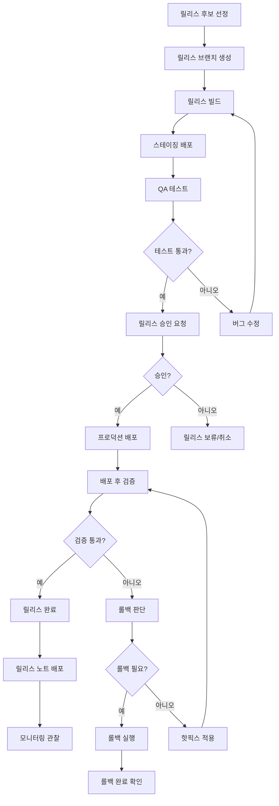
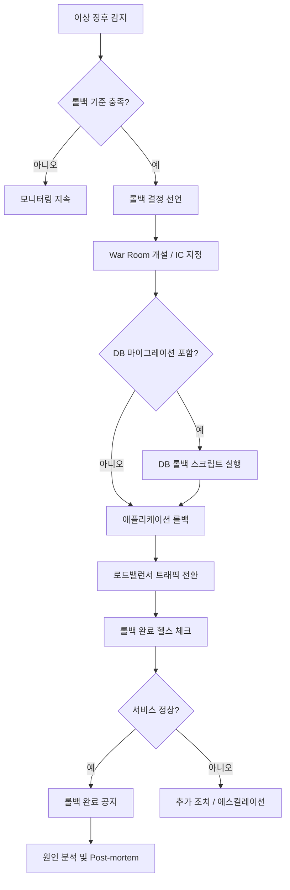
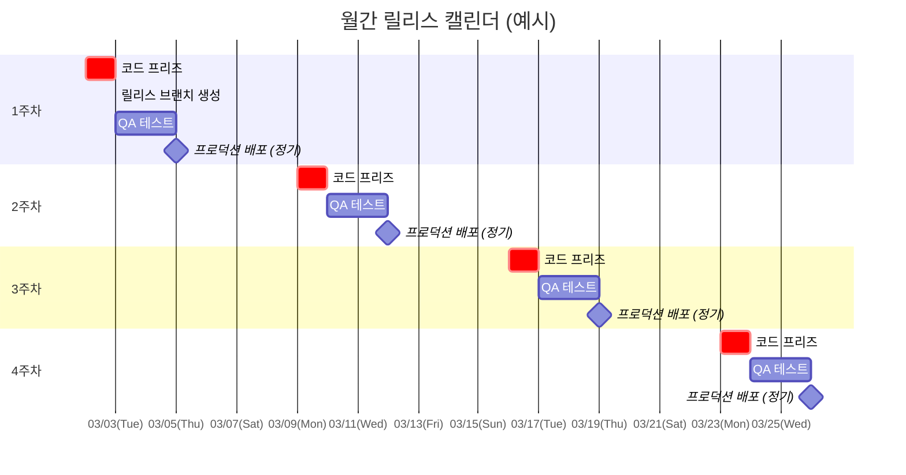

# 릴리스 관리 절차서 (Release Management Procedure)

| 항목 | 내용 |
|------|------|
| **프로젝트명** | [프로젝트명] |
| **문서 버전** | [v1.0] |
| **작성일** | [YYYY-MM-DD] |
| **작성자** | [작성자명 / 역할] |
| **승인자** | [승인자명 / 역할] |

---

## 변경 이력

| 버전 | 날짜 | 작성자 | 변경 내용 |
|------|------|--------|-----------|
| 0.1 | [YYYY-MM-DD] | [이름] | 초안 작성 |
| 0.2 | [YYYY-MM-DD] | [이름] | 리뷰 반영, 롤백 절차 상세화 |
| 1.0 | [YYYY-MM-DD] | [이름] | 최초 승인 |

---

## 1. 릴리스 관리 개요

### 1.1 목적

본 문서는 [프로젝트명]의 소프트웨어 릴리스를 체계적이고 안전하게 관리하기 위한 절차를 정의한다. 칸반 기반의 지속적 흐름(Continuous Flow) 환경에서 릴리스의 품질과 안정성을 보장하면서도 빠른 배포 주기를 유지하는 것을 목표로 한다.

### 1.2 적용 범위

- **대상 시스템:** [프로젝트명]의 모든 서비스 컴포넌트
- **대상 환경:** Development, Staging, Production
- **적용 대상:** 개발팀, QA팀, DevOps/SRE팀, PM

### 1.3 관련 프로세스

| 프로세스 | 문서 | 연관 |
|----------|------|------|
| 장애 대응 절차 | IRP-[프로젝트코드]-v[버전] | 릴리스 후 장애 발생 시 장애 대응 프로세스로 전환 |
| 기술부채 관리 | TDR-[프로젝트코드]-v[버전] | 기술부채 해소 작업의 릴리스 포함 |
| 변경 관리 프로세스 | [문서 ID] | 변경 요청(CR)의 릴리스 반영 |
| CI/CD 파이프라인 | [문서 ID] | 자동화된 빌드/배포 파이프라인 |

---

## 2. 릴리스 전략

### 2.1 릴리스 유형 정의

| 유형 | 설명 | 주기 | 승인 | 코드 프리즈 | 비고 |
|------|------|------|------|-------------|------|
| **정기 릴리스** | 계획된 주기에 따른 정기 배포 | [주간 / 격주] | Release Manager 승인 | 배포 [N]일 전 | 기능 추가, 개선, 일반 버그 수정 포함 |
| **긴급 릴리스** | 심각한 버그 수정, 보안 패치 | 필요 시 | Tech Lead + PM 승인 | 없음 (즉시) | P1/P2 버그, Critical 보안 패치 |
| **핫픽스** | 프로덕션 긴급 수정 | 필요 시 (즉시) | IC(Incident Commander) 승인 | 없음 | 장애 대응 중 긴급 수정 |
| **기능 릴리스** | 특정 대규모 기능 단위 배포 | 비정기 | PM + 이해관계자 승인 | 배포 [N]일 전 | Feature Flag 활용 가능 |

### 2.2 전략별 프로세스 차이

| 프로세스 단계 | 정기 릴리스 | 긴급 릴리스 | 핫픽스 | 기능 릴리스 |
|---------------|------------|------------|--------|------------|
| 릴리스 후보 선정 | 코드 프리즈 시점 develop 기준 | 특정 PR/커밋 지정 | 특정 수정 커밋 | Feature Branch 기준 |
| 브랜치 전략 | `release/vX.Y.Z` | `release/hotfix-vX.Y.Z+1` | `hotfix/INC-YYYYMMDD` | `release/feature-[이름]` |
| QA 범위 | 전체 회귀 테스트 | 해당 수정 영역 + 영향 범위 테스트 | Smoke Test + 해당 기능 | 해당 기능 + 영향 범위 + 회귀 |
| 스테이징 배포 | 필수 (최소 [N]시간) | 필수 (최소 30분) | 선택 (긴급도에 따라) | 필수 (최소 [N]일) |
| 승인 절차 | 릴리스 체크리스트 전체 | 간소화된 체크리스트 | IC 구두 승인 | 전체 체크리스트 + 이해관계자 |
| 배포 방식 | Blue-Green / Canary | Rolling / Blue-Green | Rolling (빠른 적용) | Canary (점진적) |
| 배포 시간 | 릴리스 윈도우 내 | 업무 시간 내 (가능한 한) | 24시간 아무 때나 | 릴리스 윈도우 내 |
| 모니터링 기간 | 배포 후 [N]시간 | 배포 후 2시간 | 배포 후 1시간 | 배포 후 [N]시간 |

### 2.3 배포 전략

| 전략 | 설명 | 장점 | 단점 | 적용 상황 |
|------|------|------|------|-----------|
| **Blue-Green** | 두 환경을 준비하고 트래픽을 전환 | 즉시 롤백 가능, 무중단 | 인프라 비용 2배 | 정기 릴리스, 대규모 변경 |
| **Canary** | 소수 사용자에게 먼저 배포 후 점진 확대 | 위험 최소화, 실제 트래픽 검증 | 배포 시간 김, 모니터링 필요 | 기능 릴리스, 불확실성 높은 변경 |
| **Rolling** | 인스턴스를 순차적으로 교체 | 인프라 효율적, 무중단 | 두 버전 공존 구간 발생 | 일반적인 배포, 핫픽스 |
| **Feature Flag** | 배포 후 기능 활성화를 별도 제어 | 배포와 릴리스 분리 | Flag 관리 복잡성 | 대규모 기능, A/B 테스트 |

---

## 3. 릴리스 프로세스

### 3.1 릴리스 프로세스 흐름도



### 3.2 단계별 상세

#### 3.2.1 릴리스 후보 선정

- 코드 프리즈 시점의 develop 브랜치 상태를 릴리스 후보로 지정
- 포함되는 변경 사항 목록을 정리하여 릴리스 범위 확정
- 칸반 보드에서 "Done" 상태인 항목 중 릴리스 대상 확인
- 릴리스에서 제외할 항목은 Feature Flag로 비활성화

#### 3.2.2 릴리스 브랜치 생성

```
# 정기 릴리스
git checkout develop
git checkout -b release/v[MAJOR.MINOR.PATCH]

# 핫픽스
git checkout main
git checkout -b hotfix/INC-[YYYYMMDD]-[순번]
```

#### 3.2.3 스테이징 배포 및 QA

- 릴리스 빌드를 스테이징 환경에 배포
- QA 팀이 릴리스 범위에 대한 테스트 수행
- 정기 릴리스: 전체 회귀 테스트 + 신규 기능 테스트
- 긴급 릴리스: 해당 수정 영역 + 영향 범위 테스트
- 버그 발견 시 릴리스 브랜치에서 수정 후 재테스트

#### 3.2.4 릴리스 승인

- 릴리스 체크리스트 전체 항목 확인 (6절 참조)
- Release Manager가 최종 승인
- 승인 기록을 문서화 (승인자, 일시, 조건부 승인 사항)

#### 3.2.5 프로덕션 배포

- 릴리스 윈도우 내 배포 실행
- 선택된 배포 전략(Blue-Green / Canary / Rolling)에 따라 진행
- 배포 과정에서 모니터링 대시보드 실시간 확인

#### 3.2.6 배포 후 검증

- Smoke Test (핵심 기능 정상 동작 확인)
- 에러율, 응답 시간, CPU/메모리 등 핵심 지표 모니터링
- 데이터 정합성 확인 (DB 마이그레이션 포함 시)
- 외부 연동 시스템 정상 동작 확인

---

## 4. 롤백 절차

### 4.1 롤백 판단 기준

| 기준 | 임계값 | 판단 |
|------|--------|------|
| API 에러율 (5xx) | 배포 전 대비 [5]배 이상 증가, 또는 [5%] 초과 | 롤백 |
| 응답 시간 (P95) | 배포 전 대비 [3]배 이상 증가, 또는 [3]초 초과 | 롤백 |
| 핵심 기능 장애 | 로그인, 결제, 주문 등 핵심 기능 불가 | 즉시 롤백 |
| 데이터 정합성 | 데이터 손상 또는 불일치 발견 | 즉시 롤백 |
| 보안 취약점 | 릴리스로 인한 새로운 보안 취약점 발견 | 즉시 롤백 |
| Canary 실패 | Canary 대상 사용자에서 에러율 [2%] 초과 | 롤백 (확대 중단) |

### 4.2 롤백 프로세스



### 4.3 롤백 체크리스트

**롤백 실행 전:**
- [ ] 롤백 결정 선언 및 관련자 알림
- [ ] 현재 프로덕션 상태 스냅샷 (로그, 메트릭)
- [ ] 롤백 대상 버전 확인 (이전 정상 버전 태그)
- [ ] DB 롤백 스크립트 존재 여부 확인 (해당 시)
- [ ] 외부 연동 영향 확인

**롤백 실행 중:**
- [ ] DB 롤백 실행 (해당 시) 및 데이터 검증
- [ ] 애플리케이션 이전 버전으로 배포
- [ ] 캐시 무효화 (필요 시)
- [ ] 헬스 체크 통과 확인
- [ ] 핵심 기능 수동 검증

**롤백 실행 후:**
- [ ] 에러율 / 응답 시간 정상 확인 (최소 30분 모니터링)
- [ ] 외부 연동 시스템 정상 확인
- [ ] 롤백 완료 공지 발송
- [ ] 롤백 원인 분석 시작

### 4.4 DB 마이그레이션 롤백 가이드

| 원칙 | 설명 |
|------|------|
| **항상 롤백 스크립트 작성** | Forward 마이그레이션과 함께 반드시 Backward 마이그레이션 준비 |
| **비파괴적 마이그레이션** | 컬럼 삭제 대신 Deprecation, 테이블 삭제 대신 Rename 후 별도 삭제 |
| **Expand & Contract 패턴** | 1단계: 새 스키마 추가 (Expand) → 2단계: 코드 마이그레이션 → 3단계: 이전 스키마 제거 (Contract) |
| **데이터 백업** | 마이그레이션 전 반드시 해당 테이블 백업 |
| **스테이징 선검증** | 실제 데이터 규모와 유사한 환경에서 마이그레이션 및 롤백 테스트 |

**DB 롤백이 불가능한 경우 대응:**

1. 애플리케이션 레벨에서 이전/이후 스키마 모두 지원하도록 구현 (Backward Compatible)
2. Forward-only 마이그레이션 적용 (새 마이그레이션으로 문제 해결)
3. 데이터 복구: 백업에서 영향 받은 데이터만 선택적 복원

---

## 5. 릴리스 캘린더

### 5.1 릴리스 일정 (Mermaid Gantt)



### 5.2 코드 프리즈 / 릴리스 윈도우 정의

| 항목 | 정의 | 비고 |
|------|------|------|
| **코드 프리즈 시점** | 매주 [요일] [HH:MM] | 이후 릴리스 브랜치에 새 기능 커밋 금지 |
| **코드 프리즈 해제** | 프로덕션 배포 완료 후 | develop 브랜치에 대한 병합 재개 |
| **릴리스 윈도우** | 매주 [요일] [HH:MM] ~ [HH:MM] | 프로덕션 배포 허용 시간대 |
| **배포 금지 시간** | 금요일 15:00 ~ 월요일 09:00 | 주말 온콜 부담 최소화 (긴급 릴리스 예외) |
| **배포 금지 기간** | [연말연시 / 대규모 프로모션 기간] | 사전 공지, PM 승인 없이 배포 불가 |

### 5.3 릴리스 일정 템플릿

| 주차 | 코드 프리즈 | QA 시작 | QA 종료 | 배포 예정일 | 릴리스 버전 | 비고 |
|------|------------|---------|---------|------------|------------|------|
| W[N] | [MM-DD (요일)] | [MM-DD] | [MM-DD] | [MM-DD (요일)] | v[X.Y.Z] | |
| W[N+1] | [MM-DD (요일)] | [MM-DD] | [MM-DD] | [MM-DD (요일)] | v[X.Y.Z] | |
| W[N+2] | [MM-DD (요일)] | [MM-DD] | [MM-DD] | [MM-DD (요일)] | v[X.Y.Z] | |
| W[N+3] | [MM-DD (요일)] | [MM-DD] | [MM-DD] | [MM-DD (요일)] | v[X.Y.Z] | |

---

## 6. 릴리스 체크리스트 템플릿

### 6.1 Pre-release 체크리스트

> 릴리스 브랜치 생성 ~ 프로덕션 배포 승인 전

**코드 품질:**
- [ ] 모든 PR이 코드 리뷰 완료 상태인가?
- [ ] CI 파이프라인이 전체 통과하는가? (Lint, Build, Test, Security Scan)
- [ ] 정적 분석(SonarQube)에서 새로운 Critical/High 이슈가 없는가?
- [ ] 코드 커버리지가 기준([N%]) 이상인가?
- [ ] 의존성 보안 스캔에서 Critical CVE가 없는가?

**기능 검증:**
- [ ] 스테이징 환경에 릴리스 후보가 배포되었는가?
- [ ] QA 테스트가 완료되었는가? (테스트 결과 보고서 확인)
- [ ] 모든 Critical/High 버그가 해결되었는가?
- [ ] 릴리스 범위에 포함된 모든 기능이 정상 동작하는가?
- [ ] 릴리스에서 제외할 기능이 Feature Flag로 비활성화되었는가?

**DB 및 인프라:**
- [ ] DB 마이그레이션 스크립트가 스테이징에서 검증되었는가?
- [ ] DB 롤백 스크립트가 준비되었는가?
- [ ] 인프라 변경 사항이 적용되었는가? (IaC 반영)
- [ ] 환경변수 / 설정 변경 사항이 반영되었는가?

**문서 및 커뮤니케이션:**
- [ ] 릴리스 노트가 작성되었는가?
- [ ] API 변경 사항이 문서에 반영되었는가?
- [ ] 관련 부서(CS, 마케팅 등)에 변경 사항이 공유되었는가?
- [ ] 배포 일정이 관련자에게 공지되었는가?

### 6.2 Release 체크리스트

> 프로덕션 배포 실행 시

**배포 실행:**
- [ ] 프로덕션 DB 백업이 완료되었는가?
- [ ] 모니터링 대시보드가 준비되었는가? (에러율, 응답 시간, 리소스)
- [ ] 롤백 계획이 준비되었는가? (이전 버전 태그 확인)
- [ ] 배포 담당자와 온콜 엔지니어가 대기 중인가?
- [ ] 배포 시작 알림을 발송했는가?

**배포 진행:**
- [ ] DB 마이그레이션이 정상 실행되었는가?
- [ ] 애플리케이션 배포가 정상 완료되었는가?
- [ ] 모든 인스턴스가 헬스 체크를 통과하는가?
- [ ] 배포 중 에러율/응답 시간에 이상이 없는가?

### 6.3 Post-release 체크리스트

> 프로덕션 배포 완료 후

**검증:**
- [ ] Smoke Test가 통과하였는가? (핵심 기능 수동 확인)
- [ ] 에러율이 정상 범위인가? (배포 전 대비)
- [ ] 응답 시간이 정상 범위인가? (배포 전 대비)
- [ ] CPU / 메모리 사용률이 정상 범위인가?
- [ ] 외부 연동 시스템이 정상 동작하는가?
- [ ] 데이터 정합성에 문제가 없는가?

**완료 처리:**
- [ ] 릴리스 태그가 생성되었는가? (`git tag v[X.Y.Z]`)
- [ ] 릴리스 브랜치가 main과 develop에 병합되었는가?
- [ ] 릴리스 노트가 배포되었는가?
- [ ] 배포 완료 알림이 발송되었는가?
- [ ] 칸반 보드의 릴리스 항목이 "Done"으로 업데이트되었는가?
- [ ] 모니터링 관찰 기간이 시작되었는가? (최소 [N]시간)

---

## 7. 버전 관리

### 7.1 Semantic Versioning 규칙

`MAJOR.MINOR.PATCH` (예: v2.3.1)

| 구분 | 증가 시점 | 예시 |
|------|-----------|------|
| **MAJOR** | 하위 호환성이 깨지는 변경 (Breaking Change) | API 엔드포인트 제거, 응답 구조 변경, 인증 방식 변경 |
| **MINOR** | 하위 호환성을 유지하면서 새 기능 추가 | 새 API 추가, 기존 기능 개선, 새 파라미터 추가 (선택적) |
| **PATCH** | 하위 호환성을 유지하면서 버그 수정 | 버그 수정, 보안 패치, 성능 개선 (기능 변경 없음) |

**Pre-release 버전:** `v1.2.0-rc.1` (Release Candidate), `v1.2.0-beta.1` (Beta)

**Build Metadata:** `v1.2.0+build.123` (빌드 번호 추가, 비교 시 무시)

### 7.2 릴리스 태그 / 브랜치 전략

#### Git Flow (권장: 정기 릴리스 주기가 있는 프로젝트)

```
main ──────────────●───────────────●───────────────●──────
                   │ v1.0.0        │ v1.1.0        │ v1.1.1 (hotfix)
                   │               │               │
develop ───●───●───●───●───●───●───●───●───●───●───●───●──
           │       │       │       │       │
           │  release/v1.0 │  release/v1.1 │
           │               │               │
feature/A ─●───●───●       │               │
                   feature/B ●───●          │
                                   hotfix/fix-001 ●
```

| 브랜치 | 네이밍 | 생성 기반 | 병합 대상 | 삭제 시점 |
|--------|--------|-----------|-----------|-----------|
| `main` | `main` | - | - | 삭제 안 함 |
| `develop` | `develop` | `main` | - | 삭제 안 함 |
| `release/*` | `release/v[X.Y.Z]` | `develop` | `main` + `develop` | 병합 후 |
| `hotfix/*` | `hotfix/[설명]` | `main` | `main` + `develop` | 병합 후 |
| `feature/*` | `feature/[기능명]` | `develop` | `develop` | 병합 후 |

#### Trunk-Based Development (권장: 고빈도 배포, CI/CD 성숙 조직)

```
main ──●──●──●──●──●──●──●──●──●──●──●──●──●──
       │     │     │     │     │     │     │
       v1.0  v1.1  v1.2  v1.3  v1.4  v1.5  v1.6

short-lived branches: feature/A (1~2일), feature/B (1~2일)
```

| 브랜치 | 네이밍 | 생성 기반 | 병합 대상 | 수명 |
|--------|--------|-----------|-----------|------|
| `main` | `main` | - | - | 영구 |
| `feature/*` | `feature/[기능명]` | `main` | `main` | 1~2일 이내 |

- 모든 커밋이 배포 가능한 상태 유지
- Feature Flag로 미완성 기능 비활성화
- 릴리스 태그로 버전 관리 (`git tag v[X.Y.Z]`)

### 7.3 프로젝트 적용 전략

| 항목 | 선택 |
|------|------|
| **브랜치 전략** | [Git Flow / Trunk-Based] |
| **선택 근거** | [선택 근거 기술] |

---

## 8. 릴리스 노트 템플릿

```markdown
# 릴리스 노트 - v[X.Y.Z]

| 항목 | 내용 |
|------|------|
| **버전** | v[X.Y.Z] |
| **릴리스 유형** | 정기 / 긴급 / 핫픽스 / 기능 |
| **릴리스일** | [YYYY-MM-DD] |
| **이전 버전** | v[X.Y.Z] |

---

## 새로운 기능 (Features)

- **[기능명]:** [기능 설명] (#[이슈번호])
- **[기능명]:** [기능 설명] (#[이슈번호])

## 개선 사항 (Improvements)

- **[개선 항목]:** [개선 내용] (#[이슈번호])
- **[개선 항목]:** [개선 내용] (#[이슈번호])

## 버그 수정 (Bug Fixes)

- **[BUG-NNN]:** [버그 수정 설명] (#[이슈번호])
- **[BUG-NNN]:** [버그 수정 설명] (#[이슈번호])

## 보안 (Security)

- **[보안 항목]:** [보안 패치/개선 내용] (#[이슈번호])

## Breaking Changes

- [하위 호환성이 깨지는 변경 사항. 해당 없으면 "없음"]
- [마이그레이션 가이드 또는 대응 방법 포함]

## Deprecated

- [향후 제거 예정 기능. 해당 없으면 "없음"]
- [대체 기능 안내 포함]

## 알려진 이슈 (Known Issues)

| 이슈 ID | 설명 | 영향 | 워크어라운드 | 수정 예정 버전 |
|---------|------|------|-------------|----------------|
| [ID] | [설명] | [영향 범위] | [임시 해결책] | v[X.Y.Z] |

## 환경 변경 사항

- **추가된 환경변수:** [변수명] = [설명] (기본값: [값])
- **변경된 환경변수:** [변수명] - [변경 내용]
- **DB 마이그레이션:** [마이그레이션 내용 요약]

## 업그레이드 가이드

1. [업그레이드 절차 1]
2. [업그레이드 절차 2]
3. [업그레이드 절차 3]
```

---

## 9. 릴리스 메트릭

### 9.1 핵심 메트릭 정의

| 메트릭 | 계산 방법 | 목표값 | 측정 주기 |
|--------|-----------|--------|-----------|
| **릴리스 빈도** (Deployment Frequency) | 프로덕션 배포 횟수 / 기간 | [주 N회 이상] | 주간 / 월간 |
| **릴리스 실패율** (Change Failure Rate) | (실패한 릴리스 / 전체 릴리스) x 100 | [15%] 이하 | 월간 |
| **평균 롤백 시간** (MTTR) | 롤백 결정 ~ 서비스 정상화 평균 시간 | [30분] 이내 | 릴리스 별 |
| **변경 실패율** | (롤백 또는 핫픽스가 필요했던 릴리스 / 전체) x 100 | [10%] 이하 | 월간 |
| **배포 리드 타임** (Lead Time for Changes) | 코드 커밋 ~ 프로덕션 배포 평균 시간 | [N]일 이내 | 월간 |
| **릴리스 준비 시간** | 코드 프리즈 ~ 프로덕션 배포 평균 시간 | [N]일 이내 | 릴리스 별 |

> **참고:** 릴리스 빈도, 리드 타임, 변경 실패율, MTTR은 DORA(DevOps Research and Assessment) 4대 핵심 메트릭이다.

### 9.2 메트릭 추적 테이블

| 기간 | 릴리스 횟수 | 성공 | 실패 | 롤백 | 실패율 | 평균 MTTR | 리드 타임 |
|------|------------|------|------|------|--------|-----------|-----------|
| [YYYY-MM] | [N] | [N] | [N] | [N] | [N%] | [N]분 | [N]일 |
| [YYYY-MM] | [N] | [N] | [N] | [N] | [N%] | [N]분 | [N]일 |
| [YYYY-MM] | [N] | [N] | [N] | [N] | [N%] | [N]분 | [N]일 |
| [YYYY-MM] | [N] | [N] | [N] | [N] | [N%] | [N]분 | [N]일 |
| [YYYY-MM] | [N] | [N] | [N] | [N] | [N%] | [N]분 | [N]일 |
| [YYYY-MM] | [N] | [N] | [N] | [N] | [N%] | [N]분 | [N]일 |

### 9.3 DORA 수준 평가

| 메트릭 | Elite | High | Medium | Low | 현재 수준 |
|--------|-------|------|--------|-----|-----------|
| 릴리스 빈도 | 일 수회 | 주 1회~월 1회 | 월 1회~6개월 1회 | 6개월 초과 | [수준] |
| 리드 타임 | 1시간 미만 | 1일~1주 | 1주~1개월 | 1개월 초과 | [수준] |
| 변경 실패율 | 0~15% | 16~30% | 16~30% | 46~60% | [수준] |
| MTTR | 1시간 미만 | 1일 미만 | 1일~1주 | 1주 초과 | [수준] |

---

## 부록

### A. 릴리스 관련 용어 정의

| 용어 | 정의 |
|------|------|
| 코드 프리즈 (Code Freeze) | 릴리스 브랜치에 새로운 기능 커밋을 금지하는 기간. 버그 수정만 허용 |
| 릴리스 윈도우 (Release Window) | 프로덕션 배포가 허용되는 시간대 |
| 릴리스 후보 (Release Candidate) | 프로덕션 배포 대상으로 선정된 빌드 |
| Smoke Test | 배포 후 핵심 기능이 정상 동작하는지 확인하는 기본 테스트 |
| Canary Release | 소수의 사용자/인스턴스에 먼저 배포하여 검증하는 방식 |
| Blue-Green Deployment | 두 동일한 환경을 운영하면서 트래픽을 전환하는 배포 방식 |
| Feature Flag | 코드 배포와 기능 활성화를 분리하여 제어하는 기법 |
| DORA Metrics | DevOps Research and Assessment에서 정의한 4대 핵심 메트릭 |
| Forward-only Migration | 롤백 마이그레이션 없이 새로운 마이그레이션으로만 변경을 수행하는 방식 |
| Expand & Contract | DB 스키마 변경을 안전하게 수행하기 위한 2단계 마이그레이션 패턴 |

### B. 릴리스 승인 양식

```
[릴리스 승인 요청]
- 릴리스 버전: v[X.Y.Z]
- 릴리스 유형: [정기 / 긴급 / 핫픽스 / 기능]
- 배포 예정일시: [YYYY-MM-DD HH:MM]
- 포함 변경 사항: [N]건 (기능: [N], 개선: [N], 버그 수정: [N], 보안: [N])
- QA 테스트 결과: [통과 / 조건부 통과]
- DB 마이그레이션: [있음 / 없음]
- Breaking Changes: [있음 / 없음]
- 릴리스 노트: [링크]

승인자: [이름] / 승인일: [YYYY-MM-DD] / 승인 여부: [승인 / 조건부 승인 / 거부]
조건/의견: [조건부 승인 시 조건 또는 의견]
```

### C. 칸반 보드 연동

릴리스 관련 Work Item은 칸반 보드에서 다음과 같이 관리한다:

| 칸반 분류 | 용도 | 포함 항목 |
|-----------|------|-----------|
| **릴리스 준비** | 릴리스 프로세스 진행 중 | 코드 프리즈, QA 테스트, 배포 승인 대기 |
| **배포 완료** | 프로덕션 배포 완료 항목 | 릴리스 검증 완료된 Work Items |

**릴리스 보드 뷰 (선택적):**

별도의 릴리스 보드를 운영하여 릴리스 단위의 진행 상황을 추적할 수 있다:

```
┌──────────────┬──────────────┬───────────────┬──────────────┬──────────┐
│  Candidate   │  QA Testing  │  Approved     │  Deploying   │  Done    │
├──────────────┼──────────────┼───────────────┼──────────────┼──────────┤
│ v1.5.0       │              │               │              │ v1.4.0   │
│ (12 items)   │              │               │              │ v1.3.0   │
│              │              │               │              │ v1.3.1   │
└──────────────┴──────────────┴───────────────┴──────────────┴──────────┘
```
