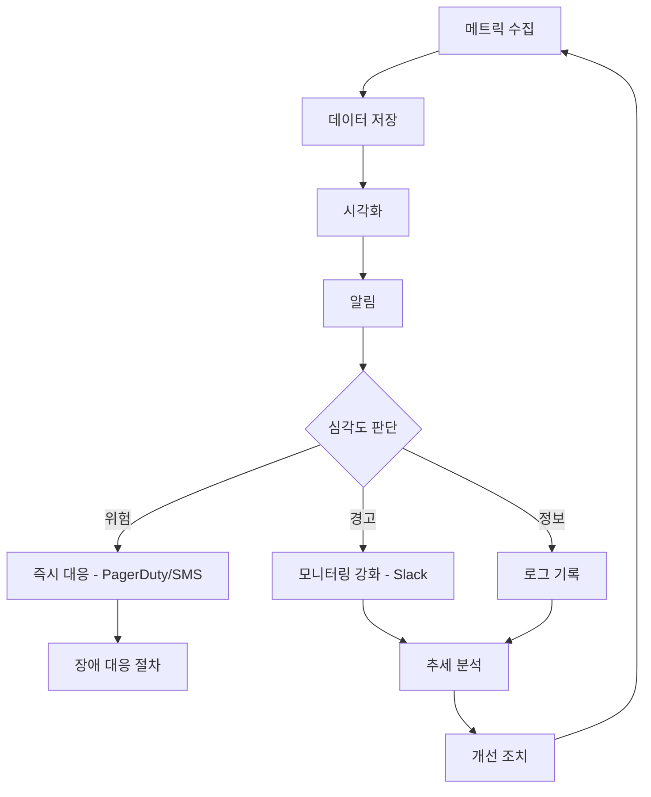
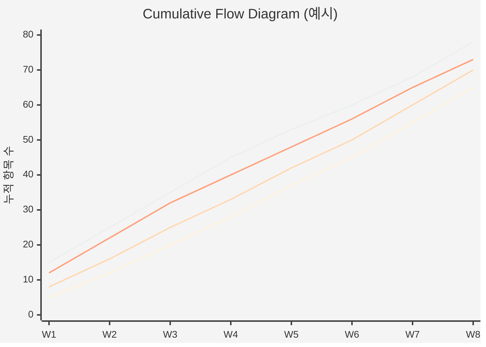
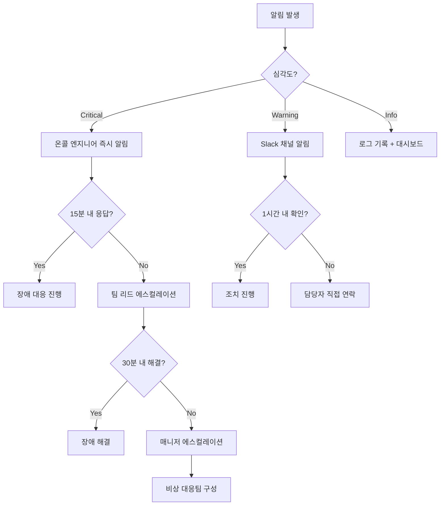

# 운영 모니터링 대시보드 설계서 (Monitoring Dashboard Design)

| 항목 | 내용 |
|------|------|
| **프로젝트명** | [프로젝트명] |
| **문서 버전** | [v1.0] |
| **작성일** | [YYYY-MM-DD] |
| **작성자** | [작성자명] |
| **승인자** | [승인자명] |

## 변경 이력

| 버전 | 변경일 | 변경 내용 | 작성자 |
|------|--------|-----------|--------|
| v1.0 | [YYYY-MM-DD] | 최초 작성 | [작성자명] |
| v1.1 | [YYYY-MM-DD] | [변경 내용] | [작성자명] |

---

## 1. 모니터링 개요

### 1.1 목적

본 문서는 [프로젝트명] 운영 환경의 모니터링 대시보드 설계를 정의한다. 시스템 안정성 확보, 장애 조기 감지, 성능 추세 분석 및 칸반 기반 운영 흐름의 가시화를 목표로 한다.

### 1.2 적용 범위

| 구분 | 대상 |
|------|------|
| 인프라 | [서버, 네트워크, 스토리지, CDN] |
| 애플리케이션 | [API 서버, 웹 서버, 배치 서비스] |
| 데이터베이스 | [RDBMS, NoSQL, Cache] |
| 비즈니스 | [주요 KPI, 사용자 행동 지표] |
| 칸반 흐름 | [작업 흐름 메트릭, WIP, Lead/Cycle Time] |

### 1.3 모니터링 전략



#### 모니터링 계층 구조

| 계층 | 모니터링 대상 | 수집 주기 | 보존 기간 |
|------|-------------|----------|----------|
| L1 - 인프라 | CPU, Memory, Disk, Network | [10초 / 30초 / 1분] | [15일 / 30일 / 90일] |
| L2 - 플랫폼 | Container, Kubernetes, 미들웨어 | [30초 / 1분] | [15일 / 30일 / 90일] |
| L3 - 애플리케이션 | API 응답, 에러율, 비즈니스 로직 | [1분 / 5분] | [30일 / 90일 / 1년] |
| L4 - 비즈니스 | KPI, 전환율, 사용자 행동 | [5분 / 1시간] | [1년 / 영구] |
| L5 - 칸반 흐름 | Lead Time, WIP, Throughput | [실시간 / 1일] | [1년 / 영구] |

### 1.4 도구 구성

| 역할 | 도구 | 비고 |
|------|------|------|
| 메트릭 수집 | [Prometheus / CloudWatch / Datadog / 기타] | [N]개 서버 대상 |
| 시각화 | [Grafana / CloudWatch Dashboard / Datadog Dashboard / 기타] | |
| 알림 | [Alertmanager / PagerDuty / Opsgenie / 기타] | |
| 로그 수집 | [ELK Stack / Loki / CloudWatch Logs / 기타] | |
| APM | [Elastic APM / Datadog APM / New Relic / 기타] | |
| 칸반 도구 | [Jira / Azure DevOps / Kanbanize / 기타] | 흐름 메트릭 소스 |

---

## 2. 시스템 메트릭 대시보드

### 2.1 서버 리소스 메트릭

#### CPU 메트릭

| 메트릭 | 설명 | 수집 주기 | 단위 |
|--------|------|----------|------|
| `cpu_usage_percent` | CPU 사용률 | [30초] | % |
| `cpu_load_avg_1m` | 1분 평균 부하 | [30초] | - |
| `cpu_load_avg_5m` | 5분 평균 부하 | [30초] | - |
| `cpu_iowait_percent` | I/O 대기 비율 | [30초] | % |
| `cpu_steal_percent` | Steal Time 비율 (가상화 환경) | [30초] | % |

#### Memory 메트릭

| 메트릭 | 설명 | 수집 주기 | 단위 |
|--------|------|----------|------|
| `memory_usage_percent` | 메모리 사용률 | [30초] | % |
| `memory_available_bytes` | 사용 가능 메모리 | [30초] | bytes |
| `swap_usage_percent` | Swap 사용률 | [30초] | % |
| `memory_cache_bytes` | 캐시 메모리 | [30초] | bytes |

#### Disk 메트릭

| 메트릭 | 설명 | 수집 주기 | 단위 |
|--------|------|----------|------|
| `disk_usage_percent` | 디스크 사용률 | [1분] | % |
| `disk_io_read_bytes` | 디스크 읽기 속도 | [30초] | bytes/s |
| `disk_io_write_bytes` | 디스크 쓰기 속도 | [30초] | bytes/s |
| `disk_iops` | 디스크 IOPS | [30초] | ops/s |
| `inode_usage_percent` | inode 사용률 | [5분] | % |

#### Network 메트릭

| 메트릭 | 설명 | 수집 주기 | 단위 |
|--------|------|----------|------|
| `network_in_bytes` | 인바운드 트래픽 | [30초] | bytes/s |
| `network_out_bytes` | 아웃바운드 트래픽 | [30초] | bytes/s |
| `network_tcp_connections` | TCP 연결 수 | [30초] | count |
| `network_errors` | 네트워크 에러 수 | [30초] | count |
| `network_packet_loss_percent` | 패킷 손실률 | [1분] | % |

### 2.2 임계값 정의

| 메트릭 | 정상 (Normal) | 경고 (Warning) | 위험 (Critical) |
|--------|:------------:|:--------------:|:---------------:|
| CPU 사용률 | < [70]% | [70]% ~ [90]% | ≥ [90]% |
| Memory 사용률 | < [75]% | [75]% ~ [90]% | ≥ [90]% |
| Disk 사용률 | < [70]% | [70]% ~ [85]% | ≥ [85]% |
| Swap 사용률 | < [10]% | [10]% ~ [30]% | ≥ [30]% |
| inode 사용률 | < [70]% | [70]% ~ [85]% | ≥ [85]% |
| CPU Load (1m) | < [N] (코어 수) | [N] ~ [N×1.5] | ≥ [N×1.5] |
| 네트워크 에러 | 0 | [1] ~ [10]/min | ≥ [10]/min |
| 패킷 손실률 | 0% | > [0.1]% | > [1]% |

### 2.3 시스템 대시보드 패널 구성

| 패널 | 시각화 유형 | 표시 메트릭 | 갱신 주기 |
|------|-----------|-----------|----------|
| 서버 개요 | Stat / Gauge | CPU, Memory, Disk 사용률 | [30초] |
| CPU 추이 | Time Series | cpu_usage_percent (서버별) | [30초] |
| Memory 추이 | Time Series | memory_usage_percent (서버별) | [30초] |
| Disk I/O | Time Series | disk_io_read, disk_io_write | [30초] |
| Network 트래픽 | Time Series | network_in, network_out | [30초] |
| TCP 연결 | Time Series | network_tcp_connections | [30초] |
| 알림 현황 | Alert List | 활성 알림 목록 | 실시간 |

---

## 3. 애플리케이션 메트릭 대시보드

### 3.1 핵심 애플리케이션 메트릭

#### API 응답 시간

| 메트릭 | 설명 | 수집 방법 | 단위 |
|--------|------|----------|------|
| `http_request_duration_avg` | 평균 응답 시간 | [APM / 미들웨어 로그] | ms |
| `http_request_duration_p50` | 중앙값 응답 시간 | [APM / 미들웨어 로그] | ms |
| `http_request_duration_p95` | 95th 백분위 응답 시간 | [APM / 미들웨어 로그] | ms |
| `http_request_duration_p99` | 99th 백분위 응답 시간 | [APM / 미들웨어 로그] | ms |
| `http_request_duration_max` | 최대 응답 시간 | [APM / 미들웨어 로그] | ms |

#### 에러율

| 메트릭 | 설명 | 계산 방식 | 단위 |
|--------|------|----------|------|
| `http_error_rate_4xx` | 4xx 에러율 | 4xx 응답 수 / 전체 요청 수 × 100 | % |
| `http_error_rate_5xx` | 5xx 에러율 | 5xx 응답 수 / 전체 요청 수 × 100 | % |
| `http_error_count_total` | 총 에러 건수 | 4xx + 5xx 응답 수 | count |
| `unhandled_exception_count` | 미처리 예외 수 | 애플리케이션 로그 기반 | count |

#### 트래픽 및 커넥션

| 메트릭 | 설명 | 수집 주기 | 단위 |
|--------|------|----------|------|
| `http_requests_per_second` | 초당 요청 수 (RPS) | [10초] | req/s |
| `http_active_connections` | 활성 커넥션 수 | [10초] | count |
| `http_request_queue_length` | 요청 큐 길이 | [10초] | count |
| `thread_pool_active` | 활성 스레드 수 | [30초] | count |
| `thread_pool_queue` | 스레드풀 큐 대기 수 | [30초] | count |

### 3.2 애플리케이션 임계값 정의

| 메트릭 | 정상 (Normal) | 경고 (Warning) | 위험 (Critical) |
|--------|:------------:|:--------------:|:---------------:|
| 평균 응답 시간 | < [200]ms | [200]ms ~ [500]ms | ≥ [500]ms |
| P95 응답 시간 | < [500]ms | [500]ms ~ [1000]ms | ≥ [1000]ms |
| P99 응답 시간 | < [1000]ms | [1000]ms ~ [3000]ms | ≥ [3000]ms |
| 5xx 에러율 | < [0.1]% | [0.1]% ~ [1]% | ≥ [1]% |
| 4xx 에러율 | < [5]% | [5]% ~ [10]% | ≥ [10]% |
| RPS | [N] ~ [M] | > [M×1.5] 또는 < [N×0.5] | > [M×2] 또는 < [N×0.2] |
| 활성 커넥션 | < [N] | [N] ~ [N×1.5] | ≥ [N×1.5] |

### 3.3 주요 API 엔드포인트별 모니터링

| 엔드포인트 | 설명 | SLO 응답 시간 | SLO 성공률 |
|-----------|------|:------------:|:---------:|
| `[GET /api/v1/health]` | 헬스 체크 | < [50]ms | [99.99]% |
| `[POST /api/v1/auth/login]` | 로그인 | < [300]ms | [99.9]% |
| `[GET /api/v1/users]` | 사용자 조회 | < [200]ms | [99.9]% |
| `[POST /api/v1/orders]` | 주문 생성 | < [500]ms | [99.95]% |
| `[GET /api/v1/products]` | 상품 조회 | < [150]ms | [99.9]% |

### 3.4 애플리케이션 대시보드 패널 구성

| 패널 | 시각화 유형 | 표시 메트릭 | 갱신 주기 |
|------|-----------|-----------|----------|
| 요청 개요 | Stat | 총 RPS, 에러율, 평균 응답 시간 | [10초] |
| 응답 시간 분포 | Time Series | Avg, P50, P95, P99 | [10초] |
| 에러율 추이 | Time Series | 4xx율, 5xx율 | [10초] |
| RPS 추이 | Time Series | http_requests_per_second | [10초] |
| 상위 느린 엔드포인트 | Table | 엔드포인트별 P95 정렬 | [1분] |
| 상위 에러 엔드포인트 | Table | 엔드포인트별 에러 수 정렬 | [1분] |
| HTTP 상태 코드 분포 | Pie Chart | 상태 코드별 비율 | [1분] |

---

## 4. 데이터베이스 메트릭 대시보드

### 4.1 데이터베이스 메트릭

| 메트릭 | 설명 | 수집 주기 | 단위 |
|--------|------|----------|------|
| `db_connection_usage_percent` | 커넥션 사용률 | [30초] | % |
| `db_active_connections` | 활성 커넥션 수 | [30초] | count |
| `db_idle_connections` | 유휴 커넥션 수 | [30초] | count |
| `db_waiting_connections` | 대기 커넥션 수 | [30초] | count |
| `db_slow_query_count` | 슬로우 쿼리 수 | [1분] | count/min |
| `db_query_duration_avg` | 평균 쿼리 실행 시간 | [1분] | ms |
| `db_replication_lag` | Replication Lag | [30초] | seconds |
| `db_disk_usage_percent` | DB 디스크 사용률 | [5분] | % |
| `db_disk_usage_bytes` | DB 디스크 사용량 | [5분] | bytes |
| `db_cache_hit_ratio` | 캐시 히트율 | [1분] | % |
| `db_deadlock_count` | 데드락 발생 수 | [1분] | count |
| `db_transactions_per_second` | 초당 트랜잭션 수 (TPS) | [30초] | tps |

### 4.2 데이터베이스 임계값 정의

| 메트릭 | 정상 (Normal) | 경고 (Warning) | 위험 (Critical) |
|--------|:------------:|:--------------:|:---------------:|
| 커넥션 사용률 | < [60]% | [60]% ~ [80]% | ≥ [80]% |
| 슬로우 쿼리 수 | < [5]/min | [5] ~ [20]/min | ≥ [20]/min |
| Replication Lag | < [1]s | [1]s ~ [5]s | ≥ [5]s |
| DB 디스크 사용률 | < [70]% | [70]% ~ [85]% | ≥ [85]% |
| 캐시 히트율 | > [95]% | [90]% ~ [95]% | < [90]% |
| 데드락 수 | 0 | [1] ~ [3]/hour | ≥ [3]/hour |

### 4.3 Cache 메트릭 (Redis / Memcached)

| 메트릭 | 설명 | 수집 주기 | 단위 |
|--------|------|----------|------|
| `cache_hit_ratio` | 캐시 히트율 | [30초] | % |
| `cache_memory_usage` | 캐시 메모리 사용량 | [30초] | bytes |
| `cache_eviction_count` | Eviction 발생 수 | [1분] | count |
| `cache_connected_clients` | 연결된 클라이언트 수 | [30초] | count |
| `cache_ops_per_second` | 초당 연산 수 | [30초] | ops/s |

### 4.4 데이터베이스 대시보드 패널 구성

| 패널 | 시각화 유형 | 표시 메트릭 | 갱신 주기 |
|------|-----------|-----------|----------|
| DB 개요 | Stat | 커넥션율, TPS, 캐시 히트율 | [30초] |
| 커넥션 추이 | Time Series | active, idle, waiting | [30초] |
| 쿼리 성능 | Time Series | 평균 쿼리 시간, 슬로우 쿼리 수 | [1분] |
| Replication Lag | Time Series | replication_lag (Replica별) | [30초] |
| 디스크 사용 추이 | Time Series | db_disk_usage_percent | [5분] |
| 슬로우 쿼리 목록 | Table | 최근 슬로우 쿼리 Top 10 | [5분] |

---

## 5. 비즈니스 메트릭 대시보드

### 5.1 사용자 활동 메트릭

| 메트릭 | 설명 | 수집 주기 | 단위 |
|--------|------|----------|------|
| `dau` | 일간 활성 사용자 수 (Daily Active Users) | [1일] | count |
| `mau` | 월간 활성 사용자 수 (Monthly Active Users) | [1일] | count |
| `dau_mau_ratio` | DAU/MAU 비율 (Stickiness) | [1일] | % |
| `new_user_signups` | 신규 가입자 수 | [1시간] | count |
| `user_retention_d1` | D1 리텐션율 | [1일] | % |
| `user_retention_d7` | D7 리텐션율 | [1일] | % |
| `user_retention_d30` | D30 리텐션율 | [1일] | % |

### 5.2 전환율 메트릭

| 메트릭 | 설명 | 수집 주기 | 단위 |
|--------|------|----------|------|
| `conversion_rate_signup` | 가입 전환율 | [1시간] | % |
| `conversion_rate_purchase` | 구매 전환율 | [1시간] | % |
| `funnel_step_completion` | 퍼널 단계별 완료율 | [1시간] | % |
| `cart_abandonment_rate` | 장바구니 이탈율 | [1시간] | % |

### 5.3 주요 기능 사용량

| 기능 | 메트릭 | 수집 주기 | 비고 |
|------|--------|----------|------|
| [기능 A] | `feature_a_usage_count` | [1시간] | [기능 설명] |
| [기능 B] | `feature_b_usage_count` | [1시간] | [기능 설명] |
| [기능 C] | `feature_c_usage_count` | [1시간] | [기능 설명] |
| [검색] | `search_query_count` | [1시간] | 검색 요청 수 |
| [검색] | `search_null_result_rate` | [1시간] | 검색 결과 없음 비율 |

### 5.4 비즈니스 KPI 테이블

| KPI | 목표값 | 현재값 | 달성률 | 측정 주기 |
|-----|--------|--------|--------|----------|
| [KPI 1: DAU] | [N]명 | [측정값] | [N]% | 일간 |
| [KPI 2: 전환율] | [N]% | [측정값] | [N]% | 주간 |
| [KPI 3: 매출] | [N]원 | [측정값] | [N]% | 월간 |
| [KPI 4: NPS] | [N]점 | [측정값] | [N]% | 분기 |
| [KPI 5: 고객 만족도] | [N]점 | [측정값] | [N]% | 분기 |

### 5.5 비즈니스 대시보드 패널 구성

| 패널 | 시각화 유형 | 표시 메트릭 | 갱신 주기 |
|------|-----------|-----------|----------|
| 핵심 KPI 요약 | Stat | DAU, 전환율, 매출 | [1시간] |
| DAU/MAU 추이 | Time Series | dau, mau | [1일] |
| 전환 퍼널 | Funnel / Bar | 단계별 전환율 | [1시간] |
| 리텐션 코호트 | Heatmap | D1, D7, D30 리텐션 | [1일] |
| 기능 사용량 랭킹 | Bar Chart | 기능별 사용 횟수 | [1시간] |

---

## 6. 칸반 흐름 메트릭 대시보드

> 칸반 기반 운영에서 흐름의 건강도를 측정하고 예측 가능성을 높이기 위한 핵심 메트릭 대시보드

### 6.1 Lead Time 분포

**정의**: 작업 항목이 시스템에 진입(커밋 포인트)한 시점부터 고객에게 전달(완료)되기까지의 총 경과 시간

| 메트릭 | 설명 | 수집 주기 | 단위 |
|--------|------|----------|------|
| `lead_time_avg` | 평균 Lead Time | [1일] | 일(day) |
| `lead_time_p50` | 중앙값 Lead Time | [1일] | 일(day) |
| `lead_time_p85` | 85th 백분위 Lead Time | [1일] | 일(day) |
| `lead_time_p95` | 95th 백분위 Lead Time | [1일] | 일(day) |

#### Lead Time 히스토그램 설계

```
빈도
  │
  │  ██
  │  ██ ██
  │  ██ ██ ██
  │  ██ ██ ██ ██
  │  ██ ██ ██ ██ ██
  │  ██ ██ ██ ██ ██ ██
  │  ██ ██ ██ ██ ██ ██ ██ ██
  └──────────────────────────────── Lead Time (일)
     1  2  3  5  8  13 21 34

     ├── P50 ──┤   ├── P85 ──┤├ P95 ┤
```

- X축: Lead Time 구간 (일 단위)
- Y축: 해당 구간에 완료된 작업 항목 수
- 참조선: P50, P85, P95 표시
- **SLE (Service Level Expectation)**: "[P85 이내]일 이내 완료율 [85]%"

### 6.2 Cycle Time 분포

**정의**: 작업 항목의 실제 작업이 시작된 시점부터 완료되기까지의 경과 시간

| 메트릭 | 설명 | 수집 주기 | 단위 |
|--------|------|----------|------|
| `cycle_time_avg` | 평균 Cycle Time | [1일] | 일(day) |
| `cycle_time_p50` | 중앙값 Cycle Time | [1일] | 일(day) |
| `cycle_time_p85` | 85th 백분위 Cycle Time | [1일] | 일(day) |
| `cycle_time_p95` | 95th 백분위 Cycle Time | [1일] | 일(day) |

#### Cycle Time 산점도 (Scatterplot) 설계

| 표시 요소 | 설명 |
|----------|------|
| X축 | 완료일 |
| Y축 | Cycle Time (일) |
| 점(Dot) | 개별 완료 항목 |
| 색상 구분 | Class of Service 또는 작업 유형별 |
| 참조선 | P50 (파랑), P85 (주황), P95 (빨강) |
| 추세선 | 이동 평균선 (최근 [30]일) |

### 6.3 WIP 현황

**정의**: 현재 진행 중인 작업 항목의 수

| 관점 | 메트릭 | WIP 제한 | 현재 WIP | 상태 |
|------|--------|:--------:|:--------:|:----:|
| 전체 보드 | `wip_total` | [N] | [측정값] | [정상/경고/초과] |
| [개발] 열 | `wip_dev` | [N] | [측정값] | [정상/경고/초과] |
| [리뷰] 열 | `wip_review` | [N] | [측정값] | [정상/경고/초과] |
| [테스트] 열 | `wip_test` | [N] | [측정값] | [정상/경고/초과] |
| [배포 대기] 열 | `wip_deploy` | [N] | [측정값] | [정상/경고/초과] |

#### Swimlane별 WIP 현황

| Swimlane | WIP 제한 | 현재 WIP | 비고 |
|----------|:--------:|:--------:|------|
| [긴급 (Expedite)] | [1] | [측정값] | 긴급 항목 전용 |
| [일반 (Standard)] | [N] | [측정값] | 기본 작업 흐름 |
| [고정 납기 (Fixed Date)] | [N] | [측정값] | 기한이 정해진 작업 |
| [무형 (Intangible)] | [N] | [측정값] | 기술 부채, 개선 작업 |

### 6.4 처리량 (Throughput) 추이

**정의**: 단위 기간당 완료된 작업 항목 수

| 메트릭 | 설명 | 수집 주기 | 단위 |
|--------|------|----------|------|
| `throughput_daily` | 일간 처리량 | [1일] | items/day |
| `throughput_weekly` | 주간 처리량 | [1주] | items/week |
| `throughput_monthly` | 월간 처리량 | [1월] | items/month |

#### Throughput Run Chart 설계

- X축: 시간 (주 단위)
- Y축: 완료 항목 수
- 표시: 주간 처리량 막대 + 이동 평균선 (최근 [4]주)
- 참조선: 평균 처리량, 상한/하한 (표준편차 기반)

### 6.5 CFD (Cumulative Flow Diagram)

**정의**: 각 단계에 누적된 작업 항목 수를 시간에 따라 영역 그래프로 표시



#### CFD 해석 가이드

| 관찰 패턴 | 의미 | 조치 |
|----------|------|------|
| 밴드 폭 일정 | 안정적 WIP | 유지 |
| 밴드 폭 증가 | WIP 증가, 흐름 정체 | WIP 제한 검토, 병목 분석 |
| 밴드 폭 감소 | WIP 감소, 처리 속도 향상 | 긍정적 추세, 유지 |
| 특정 밴드만 확대 | 해당 단계가 병목 | 병목 단계 WIP 조정, 리소스 재배치 |
| 계단 모양 | 대규모 배치 처리 | 배치 크기 축소 검토 |

### 6.6 Flow Efficiency

**정의**: 작업 항목의 총 Lead Time 중 실제 작업이 진행된 시간의 비율

```
Flow Efficiency = (작업 시간 / 총 Lead Time) × 100%
```

| 메트릭 | 설명 | 목표 | 현재 |
|--------|------|:----:|:----:|
| `flow_efficiency_avg` | 평균 Flow Efficiency | > [40]% | [측정값]% |
| `active_time_avg` | 평균 작업 시간 | - | [N]일 |
| `wait_time_avg` | 평균 대기 시간 | - | [N]일 |
| `blocked_time_avg` | 평균 차단 시간 | - | [N]일 |

> **참고**: 일반적으로 Flow Efficiency는 15~25%가 보통이며, 40% 이상이면 우수한 수준

### 6.7 WIP Age

**정의**: 현재 진행 중인(미완료) 작업 항목이 커밋 포인트에 진입한 이후 경과된 시간

| 항목 ID | 제목 | 현재 단계 | WIP Age (일) | P85 SLE (일) | 상태 |
|---------|------|----------|:----------:|:-----------:|:----:|
| [ITEM-001] | [항목 설명] | [개발] | [N] | [SLE값] | [정상/주의/위험] |
| [ITEM-002] | [항목 설명] | [리뷰] | [N] | [SLE값] | [정상/주의/위험] |
| [ITEM-003] | [항목 설명] | [테스트] | [N] | [SLE값] | [정상/주의/위험] |

#### WIP Age 판단 기준

| 상태 | 조건 | 색상 |
|------|------|:----:|
| 정상 | WIP Age < P50 Lead Time | 녹색 |
| 주의 | P50 ≤ WIP Age < P85 Lead Time | 주황 |
| 위험 | WIP Age ≥ P85 Lead Time | 빨강 |

### 6.8 Blocker 현황

**정의**: 현재 차단(Blocked) 상태인 작업 항목의 수와 차단 지속 시간

| 메트릭 | 설명 | 수집 주기 | 단위 |
|--------|------|----------|------|
| `blocked_items_count` | 차단된 항목 수 | 실시간 | count |
| `blocked_time_avg` | 평균 차단 시간 | [1일] | 시간(hours) |
| `blocked_rate` | 차단 비율 (차단 항목 / 전체 WIP) | 실시간 | % |
| `blocker_resolution_time_avg` | 평균 차단 해결 시간 | [1일] | 시간(hours) |

#### 활성 Blocker 목록

| 항목 ID | 차단 사유 | 차단 시작일 | 차단 시간 | 담당자 | 해결 예상일 |
|---------|----------|-----------|:--------:|--------|-----------|
| [ITEM-001] | [외부 API 연동 대기] | [YYYY-MM-DD] | [N]시간 | [담당자] | [YYYY-MM-DD] |
| [ITEM-002] | [의사결정 대기] | [YYYY-MM-DD] | [N]시간 | [담당자] | [YYYY-MM-DD] |

### 6.9 칸반 흐름 대시보드 패널 구성

| 패널 | 시각화 유형 | 표시 메트릭 | 갱신 주기 |
|------|-----------|-----------|----------|
| 흐름 메트릭 요약 | Stat | 평균 LT, CT, 처리량, FE | [1일] |
| Lead Time 히스토그램 | Histogram | Lead Time 분포, P50/P85/P95 | [1일] |
| Cycle Time 산점도 | Scatterplot | 항목별 CT, 추세선, 백분위선 | [1일] |
| CFD | Stacked Area | 단계별 누적 항목 수 | [1일] |
| WIP 현황 | Bar / Gauge | 열별 WIP vs WIP 제한 | 실시간 |
| Throughput 추이 | Bar + Line | 주간 처리량, 이동 평균 | [1주] |
| WIP Age | Table | 진행 중 항목, Age, SLE 대비 상태 | 실시간 |
| Blocker 현황 | Table + Stat | 차단 항목 수, 평균 차단 시간 | 실시간 |

---

## 7. 알림 설정 가이드

### 7.1 알림 채널 구성

| 채널 | 용도 | 심각도 | 대상 |
|------|------|--------|------|
| [PagerDuty / Opsgenie] | 즉시 대응 필요 | Critical | 온콜 엔지니어 |
| SMS | 긴급 알림 | Critical | 온콜 엔지니어, 팀 리드 |
| [Slack #ops-alerts] | 운영 알림 | Warning, Critical | 운영팀 전체 |
| [Slack #dev-alerts] | 개발 관련 알림 | Warning | 개발팀 |
| Email | 일간/주간 리포트 | Info | 팀 전체, 관리자 |
| [Slack #kanban-flow] | 칸반 흐름 알림 | Info, Warning | 팀 전체 |

### 7.2 알림 규칙 테이블

#### 시스템/애플리케이션 알림

| 알림 이름 | 조건 | 심각도 | 채널 | 수신 대상 | 에스컬레이션 |
|----------|------|:------:|------|----------|------------|
| CPU 위험 | CPU > [90]% for [5]min | Critical | PagerDuty, SMS | 온콜 | [15]분 후 팀 리드 |
| CPU 경고 | CPU > [70]% for [15]min | Warning | Slack | 운영팀 | - |
| Memory 위험 | Memory > [90]% for [5]min | Critical | PagerDuty, SMS | 온콜 | [15]분 후 팀 리드 |
| Disk 위험 | Disk > [85]% | Critical | PagerDuty, Slack | 온콜, 운영팀 | [30]분 후 팀 리드 |
| 5xx 에러 급증 | 5xx rate > [1]% for [5]min | Critical | PagerDuty, Slack | 온콜, 개발팀 | [10]분 후 팀 리드 |
| 응답 시간 지연 | P95 > [1000]ms for [10]min | Warning | Slack | 개발팀 | - |
| DB 커넥션 위험 | 커넥션 > [80]% for [5]min | Critical | PagerDuty, Slack | 온콜, DBA | [15]분 후 팀 리드 |
| Replication Lag | Lag > [5]s for [3]min | Critical | PagerDuty, Slack | 온콜, DBA | [10]분 후 팀 리드 |
| 헬스 체크 실패 | 연속 [3]회 실패 | Critical | PagerDuty, SMS | 온콜 | 즉시 팀 리드 |

#### 칸반 흐름 알림

| 알림 이름 | 조건 | 심각도 | 채널 | 수신 대상 |
|----------|------|:------:|------|----------|
| WIP 초과 | 특정 열 WIP > WIP 제한 | Warning | Slack #kanban-flow | 팀 전체 |
| WIP Age 위험 | 항목 WIP Age > P85 SLE | Warning | Slack #kanban-flow | 담당자, 팀 리드 |
| Blocker 장기화 | 차단 시간 > [24]시간 | Warning | Slack #kanban-flow | 담당자, PM |
| 처리량 급감 | 주간 Throughput < 평균의 [50]% | Info | Slack #kanban-flow | PM, 팀 리드 |
| SLE 미달 위험 | SLE 달성률 < [80]% | Warning | Slack #kanban-flow | PM, 팀 리드 |

### 7.3 알림 피로(Alert Fatigue) 방지 전략

| 전략 | 설명 | 적용 방법 |
|------|------|----------|
| 임계값 튜닝 | 불필요한 알림 발생 최소화 | 월 1회 알림 이력 검토 후 임계값 조정 |
| 알림 그룹핑 | 동일 원인의 알림을 하나로 묶기 | Alertmanager의 `group_by` 설정 |
| 억제(Inhibition) | 상위 알림 발생 시 하위 알림 억제 | 서버 다운 시 해당 서버의 개별 메트릭 알림 억제 |
| 알림 시간 제한 | 비업무 시간 알림 필터링 (Critical 제외) | Warning 이하 알림의 업무 시간 한정 발송 |
| 무음(Silence) | 계획된 작업 시 알림 비활성화 | 배포/점검 시 관련 알림 일시 중단 |
| 정기 리뷰 | 알림 규칙 주기적 점검 | [월간] 알림 발생 현황 및 대응 이력 분석 |

### 7.4 에스컬레이션 정책



---

## 8. 로깅 전략

### 8.1 로그 레벨 정의

| 레벨 | 설명 | 사용 시점 | 예시 |
|------|------|----------|------|
| `FATAL` | 시스템 중단 수준의 치명적 오류 | 프로세스 종료 불가피 | DB 연결 완전 불가, OOM |
| `ERROR` | 기능 실패, 즉시 대응 필요 | 요청 처리 실패, 예외 발생 | API 호출 실패, 트랜잭션 오류 |
| `WARN` | 잠재적 문제, 모니터링 필요 | 예상 범위 밖이나 처리 가능 | 재시도 발생, 응답 지연, 임계값 근접 |
| `INFO` | 주요 비즈니스 이벤트 | 정상 흐름의 주요 지점 | 사용자 로그인, 주문 생성, 배포 완료 |
| `DEBUG` | 개발/디버깅 상세 정보 | 문제 분석 시 | 함수 호출 파라미터, SQL 쿼리, 캐시 히트/미스 |

### 8.2 구조화 로깅 표준

#### 필수 필드

| 필드 | 설명 | 예시 |
|------|------|------|
| `timestamp` | ISO 8601 형식 타임스탬프 | `2026-02-24T10:30:00.123Z` |
| `level` | 로그 레벨 | `ERROR` |
| `service` | 서비스명 | `[서비스명]` |
| `traceId` | 분산 추적 ID | `abc123def456` |
| `spanId` | Span ID | `span789` |
| `message` | 로그 메시지 | `주문 생성 실패` |

#### 선택 필드

| 필드 | 설명 | 예시 |
|------|------|------|
| `userId` | 사용자 ID (개인정보 주의) | `user_12345` |
| `requestId` | 요청 고유 ID | `req_abc123` |
| `method` | HTTP Method | `POST` |
| `path` | 요청 경로 | `/api/v1/orders` |
| `statusCode` | HTTP 상태 코드 | `500` |
| `duration` | 처리 시간 (ms) | `1523` |
| `errorCode` | 에러 코드 | `ORDER_CREATE_FAILED` |
| `stackTrace` | 스택 트레이스 (ERROR 이상) | `...` |

#### 구조화 로그 예시 (JSON)

```json
{
  "timestamp": "2026-02-24T10:30:00.123Z",
  "level": "ERROR",
  "service": "[서비스명]",
  "traceId": "abc123def456",
  "spanId": "span789",
  "message": "주문 생성 실패",
  "userId": "user_12345",
  "requestId": "req_abc123",
  "method": "POST",
  "path": "/api/v1/orders",
  "statusCode": 500,
  "duration": 1523,
  "errorCode": "ORDER_CREATE_FAILED",
  "error": {
    "type": "DatabaseException",
    "message": "Connection pool exhausted",
    "stackTrace": "..."
  }
}
```

### 8.3 로그 수집/분석 도구

| 구성 요소 | 도구 | 역할 |
|----------|------|------|
| 로그 수집 | [Filebeat / Fluentd / CloudWatch Agent / 기타] | 로그 파일 수집 및 전송 |
| 로그 전송 | [Logstash / Fluentd / Kinesis / 기타] | 로그 변환 및 라우팅 |
| 로그 저장 | [Elasticsearch / Loki / CloudWatch Logs / 기타] | 인덱싱 및 저장 |
| 로그 시각화 | [Kibana / Grafana / CloudWatch Insights / 기타] | 검색 및 시각화 |


### 8.4 로그 보존 정책

| 로그 유형 | Hot (실시간 검색) | Warm (저빈도 검색) | Cold (아카이브) | 삭제 |
|----------|:---------------:|:-----------------:|:-------------:|:----:|
| 애플리케이션 로그 | [7]일 | [30]일 | [90]일 | [1]년 후 |
| 접근 로그 (Access Log) | [7]일 | [30]일 | [90]일 | [1]년 후 |
| 에러 로그 | [30]일 | [90]일 | [1]년 | [3]년 후 |
| 감사 로그 (Audit Log) | [30]일 | [90]일 | [3]년 | [5]년 후 |
| 보안 로그 | [30]일 | [90]일 | [3]년 | [5]년 후 |
| 디버그 로그 | [3]일 | [7]일 | - | [7]일 후 |

### 8.5 민감 정보 마스킹 규칙

| 대상 | 마스킹 방법 | 예시 |
|------|-----------|------|
| 비밀번호 | 전체 마스킹 | `password: ****` |
| 이메일 | 부분 마스킹 | `u***@example.com` |
| 전화번호 | 부분 마스킹 | `010-****-5678` |
| 카드번호 | 뒤 4자리 제외 마스킹 | `****-****-****-1234` |
| 주민등록번호 | 전체 마스킹 | `******-*******` |
| API Key | 전체 마스킹 | `****` |

---

## 9. 대시보드 레이아웃 설계

### 9.1 대시보드 구성

| 대시보드 | URL | 주요 내용 | 갱신 주기 | 대상 |
|---------|-----|----------|----------|------|
| 시스템 개요 | [URL] | 서버 리소스 전체 현황 | [30초] | 운영팀 |
| 애플리케이션 성능 | [URL] | API 응답, 에러율, RPS | [10초] | 개발팀, 운영팀 |
| 데이터베이스 | [URL] | DB 성능, 커넥션, 슬로우 쿼리 | [30초] | DBA, 운영팀 |
| 비즈니스 KPI | [URL] | DAU, 전환율, 매출 | [1시간] | PM, 경영진 |
| 칸반 흐름 | [URL] | LT, CT, WIP, Throughput, CFD | [1일] | 팀 전체, PM |
| 알림 현황 | [URL] | 활성 알림, 알림 이력 | 실시간 | 운영팀, 온콜 |
| 온콜 대시보드 | [URL] | 현재 온콜자, 미해결 알림, 장애 이력 | 실시간 | 온콜 엔지니어 |

### 9.2 대시보드 레이아웃 예시 (운영 종합 대시보드)

```
┌──────────────────────────────────────────────────────────────┐
│                    [프로젝트명] 운영 대시보드                      │
├──────────┬──────────┬──────────┬──────────┬──────────────────┤
│ 서버 CPU  │ Memory   │ Disk     │ Network  │  활성 알림: [N]건  │
│  [N]%    │  [N]%    │  [N]%    │ [N]Mbps  │  ⚠ Warning: [N] │
│  Gauge   │  Gauge   │  Gauge   │  Gauge   │  🔴 Critical: [N]│
├──────────┴──────────┼──────────┴──────────┼──────────────────┤
│  API 응답 시간 추이   │   에러율 추이         │   RPS 추이        │
│  (Time Series)      │  (Time Series)      │  (Time Series)   │
│                     │                     │                  │
├─────────────────────┼─────────────────────┼──────────────────┤
│  DB 커넥션 현황       │   슬로우 쿼리 추이     │  Replication Lag │
│  (Gauge + Series)   │  (Time Series)      │  (Time Series)   │
│                     │                     │                  │
├─────────────────────┴─────────────────────┴──────────────────┤
│                    칸반 흐름 메트릭 요약                         │
├──────────┬──────────┬──────────┬──────────┬──────────────────┤
│ Avg LT   │ Avg CT   │ WIP      │Throughput│ Flow Efficiency  │
│ [N]일    │ [N]일    │ [N]건    │ [N]건/주  │     [N]%        │
├──────────┴──────────┴──────────┴──────────┴──────────────────┤
│                 최근 알림 목록 (Alert List)                     │
└──────────────────────────────────────────────────────────────┘
```

### 9.3 대시보드 접근 권한

| 대시보드 | 공개 범위 | 편집 권한 | 비고 |
|---------|----------|----------|------|
| 시스템 개요 | 운영팀, 개발팀 | 운영팀 리드 | |
| 애플리케이션 성능 | 개발팀, 운영팀 | 개발팀 리드 | |
| 데이터베이스 | DBA, 운영팀 | DBA | |
| 비즈니스 KPI | 전체 | PM | 민감 지표 접근 제한 |
| 칸반 흐름 | 전체 | PM, 팀 리드 | |
| 알림 현황 | 운영팀, 개발팀 | 운영팀 리드 | |
| 온콜 대시보드 | 온콜 로테이션 멤버 | 운영팀 리드 | |

### 9.4 대시보드 유지보수 정책

| 항목 | 주기 | 담당 | 내용 |
|------|------|------|------|
| 임계값 검토 | [월간] | 운영팀 리드 | 알림 발생 이력 기반 임계값 조정 |
| 대시보드 리뷰 | [분기] | 팀 전체 | 불필요 패널 제거, 신규 메트릭 추가 |
| 접근 권한 감사 | [분기] | 보안팀 | 권한 적정성 검토 |
| 도구 업데이트 | [필요 시] | 운영팀 | 모니터링 도구 버전 업데이트 |
| SLO 재정의 | [반기] | PM, 팀 리드 | 비즈니스 목표 반영 SLO 갱신 |

---

## 부록

### A. 용어 정의

| 용어 | 정의 |
|------|------|
| SLO (Service Level Objective) | 서비스 수준 목표. 내부적으로 설정하는 품질 목표 |
| SLE (Service Level Expectation) | 서비스 수준 기대치. 칸반에서 고객에게 제시하는 전달 기대 수준 |
| SLA (Service Level Agreement) | 서비스 수준 협약. 계약상 보장하는 서비스 품질 |
| Lead Time | 작업이 시스템에 커밋된 시점부터 완료까지의 시간 |
| Cycle Time | 작업의 실제 작업 시작부터 완료까지의 시간 |
| WIP (Work In Progress) | 현재 진행 중인 작업 수 |
| Throughput | 단위 기간당 완료된 작업 수 |
| CFD (Cumulative Flow Diagram) | 누적 흐름 다이어그램 |
| Flow Efficiency | 총 시간 중 실제 작업 시간의 비율 |
| RPS (Requests Per Second) | 초당 요청 수 |
| P95/P99 | 95th/99th 백분위수 |
| APM (Application Performance Monitoring) | 애플리케이션 성능 모니터링 |

### B. 참고 문서

| 문서 | 위치 | 관련 내용 |
|------|------|----------|
| 배포 계획서 | `templates/waterfall/06-배포/배포계획서.md` | 배포 절차 및 롤백 기준 |
| 운영 가이드 | `templates/waterfall/06-배포/운영가이드.md` | 운영 절차 전반 |
| 보안 가이드 | `templates/security/보안-가이드.md` | 보안 모니터링 및 로깅 |
| 칸반 보드 운영 가이드 | `templates/kanban/` | 칸반 보드 정책 및 메트릭 |
