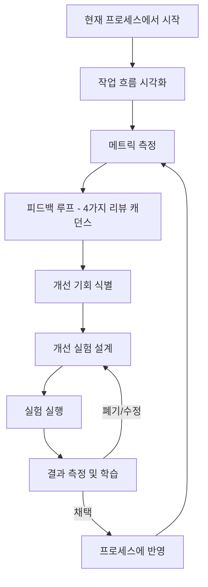
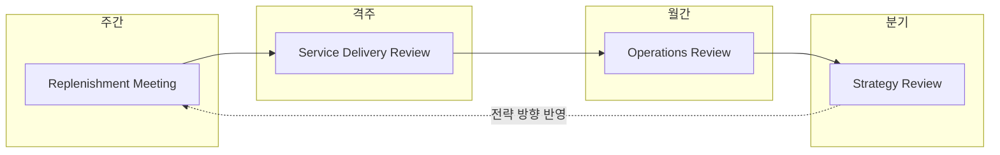
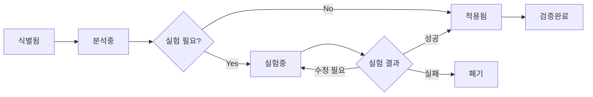
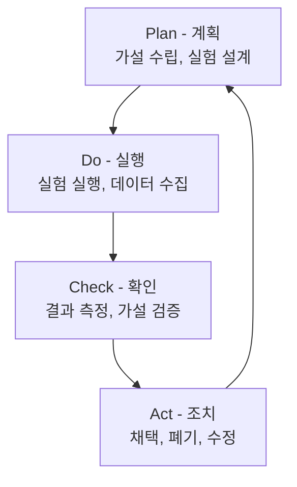
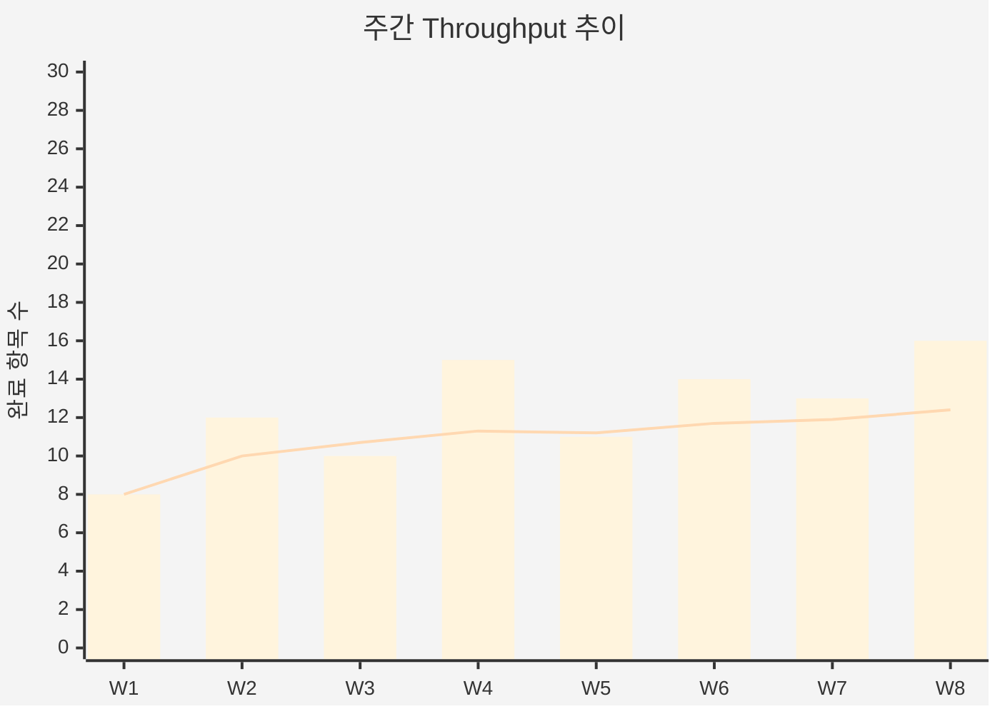

# 회고 및 개선 보고서 (Retrospective & Improvement Report)

| 항목 | 내용 |
|------|------|
| **프로젝트명** | [프로젝트명] |
| **문서 버전** | [v1.0] |
| **작성일** | [YYYY-MM-DD] |
| **작성자** | [작성자명] |
| **승인자** | [승인자명] |

## 변경 이력

| 버전 | 변경일 | 변경 내용 | 작성자 |
|------|--------|-----------|--------|
| v1.0 | [YYYY-MM-DD] | 최초 작성 | [작성자명] |
| v1.1 | [YYYY-MM-DD] | [변경 내용] | [작성자명] |

---

## 1. 회고 및 개선 개요

### 1.1 목적

본 문서는 [프로젝트명]의 칸반 기반 운영에서 지속적 개선(Continuous Improvement)을 체계적으로 수행하기 위한 회고 및 개선 프레임워크를 정의한다. 칸반의 핵심 원칙인 "피드백 루프를 구현하라"와 "실험적으로 개선하라"를 실천하기 위한 구체적인 리뷰 캐던스, 회고 기법, 개선 추적 체계를 포함한다.

### 1.2 칸반에서의 지속적 개선 원칙

#### 지속적 개선의 핵심 가치

| 원칙 | 설명 |
|------|------|
| 데이터 기반 의사결정 | 감(feeling)이 아닌 메트릭에 기반하여 개선 기회 식별 |
| 점진적 변화 | 급진적 변혁이 아닌 작고 안전한 실험을 통한 점진적 개선 |
| 시스템적 사고 | 개인이 아닌 시스템(프로세스, 정책, 환경)에 초점 |
| 실험적 접근 | 가설 → 실험 → 측정 → 학습의 과학적 방법론 적용 |
| 투명성 | 모든 메트릭과 개선 활동을 팀 전체에 공개 |

### 1.3 리뷰 캐던스 체계 개요

| 캐던스 | 주기 | 주요 초점 | 시간 |
|--------|------|----------|------|
| Strategy Review | 분기 | 전략 방향, 투자 우선순위 | [2]시간 |
| Operations Review | 월간 | 운영 효율, 팀 간 조율 | [1.5]시간 |
| Service Delivery Review | 격주 | 서비스 수준 점검, 흐름 분석 | [1]시간 |
| Replenishment Meeting | 주간 | Backlog 보충, 우선순위 조정 | [30]분 |

---

## 2. 칸반 4가지 리뷰 캐던스

### 2.1 Strategy Review (전략 리뷰)

#### 개요

| 항목 | 내용 |
|------|------|
| **주기** | 분기별 ([3]개월) |
| **목적** | 서비스 방향, 투자 우선순위 결정, 포트폴리오 수준의 의사결정 |
| **참석자** | 경영진, PM, 기술 리드, [추가 참석자] |
| **소요 시간** | [2]시간 |
| **장소/방법** | [오프라인 회의실 / 화상 회의] |

#### 의제 템플릿

| 순서 | 의제 | 시간 | 담당 |
|:----:|------|:----:|------|
| 1 | 이전 분기 전략 목표 달성 현황 리뷰 | [20]분 | PM |
| 2 | 비즈니스 환경 변화 분석 (시장, 경쟁, 고객 피드백) | [20]분 | 경영진 |
| 3 | 포트폴리오 Throughput 및 Lead Time 분석 | [15]분 | 기술 리드 |
| 4 | 서비스별 Fitness Criteria 달성률 검토 | [15]분 | PM |
| 5 | 다음 분기 전략 방향 논의 | [30]분 | 전체 |
| 6 | 투자 우선순위 매트릭스 업데이트 | [15]분 | 전체 |
| 7 | 액션 아이템 정리 및 마무리 | [5]분 | PM |

#### 산출물

**전략 방향 문서**

| 항목 | 내용 |
|------|------|
| 보고 기간 | [YYYY] Q[N] |
| 전략 목표 1 | [전략 목표 설명] |
| 전략 목표 2 | [전략 목표 설명] |
| 전략 목표 3 | [전략 목표 설명] |
| 핵심 이니셔티브 | [이니셔티브 목록] |
| 성공 기준 | [KPI 및 목표 수치] |

**투자 우선순위 매트릭스**

| 이니셔티브 | 비즈니스 가치 (1-5) | 긴급도 (1-5) | 리스크 (1-5) | 투자 규모 | 우선순위 |
|-----------|:------------------:|:-----------:|:-----------:|:--------:|:-------:|
| [이니셔티브 A] | [N] | [N] | [N] | [S/M/L] | [1] |
| [이니셔티브 B] | [N] | [N] | [N] | [S/M/L] | [2] |
| [이니셔티브 C] | [N] | [N] | [N] | [S/M/L] | [3] |

---

### 2.2 Operations Review (운영 리뷰)

#### 개요

| 항목 | 내용 |
|------|------|
| **주기** | 월간 |
| **목적** | 운영 효율 점검, 팀 간 조율, 리소스 최적화 |
| **참석자** | PM, 팀 리드, 운영팀, [추가 참석자] |
| **소요 시간** | [1.5]시간 |
| **장소/방법** | [오프라인 회의실 / 화상 회의] |

#### 의제 템플릿

| 순서 | 의제 | 시간 | 담당 |
|:----:|------|:----:|------|
| 1 | 이전 월 운영 메트릭 요약 (Throughput, Lead Time, WIP) | [15]분 | 팀 리드 |
| 2 | 팀 간 의존성 및 블로커 현황 | [15]분 | 각 팀 리드 |
| 3 | 리소스 활용 현황 및 조정 필요 사항 | [15]분 | PM |
| 4 | 운영 이슈 및 장애 리뷰 (지난달 장애 회고) | [15]분 | 운영팀 |
| 5 | 이전 월 개선 항목 진행 상황 점검 | [10]분 | PM |
| 6 | 신규 개선 항목 논의 및 우선순위 설정 | [15]분 | 전체 |
| 7 | 액션 아이템 정리 | [5]분 | PM |

#### 산출물

**운영 메트릭 요약**

| 메트릭 | 이전 월 | 금월 | 변화 | 추세 |
|--------|--------|------|:----:|:----:|
| 평균 Lead Time | [N]일 | [N]일 | [+/-N]일 | [상승/하락/유지] |
| 평균 Cycle Time | [N]일 | [N]일 | [+/-N]일 | [상승/하락/유지] |
| 주간 Throughput | [N]건 | [N]건 | [+/-N]건 | [상승/하락/유지] |
| SLE 달성률 | [N]% | [N]% | [+/-N]% | [상승/하락/유지] |
| Flow Efficiency | [N]% | [N]% | [+/-N]% | [상승/하락/유지] |
| 장애 건수 | [N]건 | [N]건 | [+/-N]건 | [상승/하락/유지] |
| 블로커 평균 해결 시간 | [N]시간 | [N]시간 | [+/-N]시간 | [상승/하락/유지] |

**운영 개선 항목**

| ID | 개선 항목 | 담당자 | 기한 | 우선순위 | 상태 |
|----|----------|--------|------|:-------:|:----:|
| OPS-[N] | [개선 항목 설명] | [담당자] | [YYYY-MM-DD] | [높음/중간/낮음] | [신규/진행/완료] |

**리소스 조정 계획**

| 조정 대상 | 현재 상태 | 조정 내용 | 사유 | 적용일 |
|----------|----------|----------|------|--------|
| [팀/역할] | [현재 배치] | [조정 내용] | [사유] | [YYYY-MM-DD] |

---

### 2.3 Service Delivery Review (서비스 전달 리뷰)

#### 개요

| 항목 | 내용 |
|------|------|
| **주기** | 격주 |
| **목적** | 서비스 수준 점검, SLE 달성률 확인, 흐름 병목 분석 |
| **참석자** | 팀 리드, 개발자, QA, [추가 참석자] |
| **소요 시간** | [1]시간 |
| **장소/방법** | [오프라인 회의실 / 화상 회의] |

#### 의제 템플릿

| 순서 | 의제 | 시간 | 담당 |
|:----:|------|:----:|------|
| 1 | Lead Time 분포 분석 (히스토그램 리뷰) | [10]분 | 팀 리드 |
| 2 | Cycle Time 산점도 분석 (아웃라이어 확인) | [10]분 | 팀 리드 |
| 3 | SLE 달성률 확인 및 분석 | [10]분 | 팀 리드 |
| 4 | 블로커 분석 (발생 빈도, 원인, 해결 시간) | [10]분 | 개발자 |
| 5 | WIP 현황 점검 (WIP 제한 적절성 논의) | [5]분 | 전체 |
| 6 | CFD 분석 (밴드 폭 변화, 병목 식별) | [5]분 | 팀 리드 |
| 7 | 흐름 개선 항목 논의 | [5]분 | 전체 |
| 8 | WIP 정책 조정 결정 | [5]분 | 팀 리드 |

#### 산출물

**흐름 메트릭 상세 분석**

| 메트릭 | 이전 기간 | 금 기간 | SLE 목표 | 달성 여부 |
|--------|----------|--------|:--------:|:--------:|
| Lead Time P50 | [N]일 | [N]일 | - | - |
| Lead Time P85 | [N]일 | [N]일 | [N]일 이내 | [달성/미달] |
| Lead Time P95 | [N]일 | [N]일 | - | - |
| Cycle Time P50 | [N]일 | [N]일 | - | - |
| Cycle Time P85 | [N]일 | [N]일 | [N]일 이내 | [달성/미달] |
| Throughput (2주) | [N]건 | [N]건 | - | - |
| 블로커 발생 건수 | [N]건 | [N]건 | - | - |
| 블로커 평균 해결 시간 | [N]시간 | [N]시간 | < [N]시간 | [달성/미달] |
| Flow Efficiency | [N]% | [N]% | > [N]% | [달성/미달] |

**SLE 달성률 요약**

| Class of Service | SLE 정의 | 대상 건수 | 달성 건수 | 달성률 | 목표 |
|-----------------|----------|:--------:|:--------:|:-----:|:----:|
| Expedite (긴급) | [N]일 이내 완료 | [N] | [N] | [N]% | [95]% |
| Fixed Date (고정 납기) | 기한 내 완료 | [N] | [N] | [N]% | [98]% |
| Standard (일반) | [N]일 이내 완료 (P85) | [N] | [N] | [N]% | [85]% |
| Intangible (무형) | [N]일 이내 완료 (P85) | [N] | [N] | [N]% | [80]% |

**흐름 개선 항목**

| ID | 개선 항목 | 기대 효과 | 담당자 | 상태 |
|----|----------|----------|--------|:----:|
| FL-[N] | [개선 항목 설명] | [기대 효과] | [담당자] | [신규/진행/완료] |

**WIP 조정 결정**

| 대상 (열/Swimlane) | 현재 WIP 제한 | 조정 후 WIP 제한 | 조정 사유 | 적용일 |
|-------------------|:-----------:|:-------------:|----------|--------|
| [개발] | [N] | [N] | [사유] | [YYYY-MM-DD] |
| [리뷰] | [N] | [N] | [사유] | [YYYY-MM-DD] |

---

### 2.4 Replenishment Meeting (보충 미팅)

#### 개요

| 항목 | 내용 |
|------|------|
| **주기** | 주간 ([요일] [시간]) |
| **목적** | Backlog 보충, 우선순위 조정, 커밋 포인트로의 항목 투입 결정 |
| **참석자** | PM, 팀 리드, [추가 참석자] |
| **소요 시간** | [30]분 |
| **장소/방법** | [오프라인 회의실 / 화상 회의] |

#### 의제 템플릿

| 순서 | 의제 | 시간 | 담당 |
|:----:|------|:----:|------|
| 1 | 현재 WIP 및 여유 용량 확인 | [5]분 | 팀 리드 |
| 2 | 완료 예상 항목 확인 (금주 Throughput 예측) | [5]분 | 팀 리드 |
| 3 | Backlog 상위 항목 리뷰 | [10]분 | PM |
| 4 | 투입 항목 선정 및 우선순위 결정 | [5]분 | PM, 팀 리드 |
| 5 | 외부 의존성/리스크 사항 공유 | [3]분 | 전체 |
| 6 | 마무리 및 다음 주 예고 | [2]분 | PM |

#### 산출물

**보충된 Backlog**

| 우선순위 | 항목 ID | 제목 | Class of Service | 예상 크기 | 의존성 | 비고 |
|:-------:|---------|------|:---------------:|:--------:|--------|------|
| 1 | [ITEM-001] | [항목 제목] | [Standard] | [S/M/L] | [없음] | |
| 2 | [ITEM-002] | [항목 제목] | [Fixed Date] | [S/M/L] | [ITEM-003] | 기한: [YYYY-MM-DD] |
| 3 | [ITEM-003] | [항목 제목] | [Standard] | [S/M/L] | [없음] | |

**투입 결정**

| 항목 ID | 제목 | 투입 결정 | 사유 |
|---------|------|:--------:|------|
| [ITEM-001] | [항목 제목] | 투입 | [WIP 여유, 높은 우선순위] |
| [ITEM-004] | [항목 제목] | 보류 | [WIP 초과 우려, 의존성 미해결] |

---

## 3. KPT (Keep, Problem, Try) 회고 템플릿

> KPT 회고는 Service Delivery Review 또는 별도 회고 세션에서 활용한다.

### 3.1 회고 세션 정보

| 항목 | 내용 |
|------|------|
| **회고 일자** | [YYYY-MM-DD] |
| **대상 기간** | [YYYY-MM-DD] ~ [YYYY-MM-DD] |
| **참석자** | [참석자 목록] |
| **퍼실리테이터** | [퍼실리테이터명] |

### 3.2 Keep (유지 사항)

> 잘 하고 있어서 계속 유지해야 할 사항

| ID | Keep 항목 | 설명 | 관련 메트릭 영향 |
|----|----------|------|----------------|
| K-[N] | [유지 사항 제목] | [구체적 설명] | [관련 메트릭 개선 내용] |
| K-[N] | [유지 사항 제목] | [구체적 설명] | [관련 메트릭 개선 내용] |
| K-[N] | [유지 사항 제목] | [구체적 설명] | [관련 메트릭 개선 내용] |

### 3.3 Problem (문제점)

> 문제가 되고 있어서 개선이 필요한 사항

| ID | Problem 항목 | 설명 | 영향도 | 관련 메트릭 |
|----|-------------|------|:------:|-----------|
| P-[N] | [문제 제목] | [구체적 설명 - 현상, 원인 분석] | [높음/중간/낮음] | [영향받는 메트릭] |
| P-[N] | [문제 제목] | [구체적 설명 - 현상, 원인 분석] | [높음/중간/낮음] | [영향받는 메트릭] |
| P-[N] | [문제 제목] | [구체적 설명 - 현상, 원인 분석] | [높음/중간/낮음] | [영향받는 메트릭] |

### 3.4 Try (시도 사항)

> 다음 기간에 시도해볼 개선 사항

| ID | Try 항목 | 관련 Problem | 구체적 방법 | 예상 효과 |
|----|---------|:----------:|-----------|----------|
| T-[N] | [시도 사항 제목] | P-[N] | [구체적 실행 방법] | [기대 효과] |
| T-[N] | [시도 사항 제목] | P-[N] | [구체적 실행 방법] | [기대 효과] |
| T-[N] | [시도 사항 제목] | P-[N] | [구체적 실행 방법] | [기대 효과] |

### 3.5 액션 아이템

| ID | 액션 아이템 | 관련 Try | 담당자 | 기한 | 상태 |
|----|-----------|:-------:|--------|------|:----:|
| A-[N] | [액션 아이템 설명] | T-[N] | [담당자] | [YYYY-MM-DD] | [대기/진행/완료] |
| A-[N] | [액션 아이템 설명] | T-[N] | [담당자] | [YYYY-MM-DD] | [대기/진행/완료] |
| A-[N] | [액션 아이템 설명] | T-[N] | [담당자] | [YYYY-MM-DD] | [대기/진행/완료] |

---

## 4. 개선 항목 추적 템플릿

### 4.1 개선 항목 레지스터

> 모든 리뷰 캐던스에서 식별된 개선 항목을 통합 추적

| 개선 ID | 등록일 | 발견 경로 | 설명 | 현재 상태 | 기대 효과 | 담당자 | 기한 | 결과 및 검증 |
|---------|--------|----------|------|:--------:|----------|--------|------|------------|
| IMP-[001] | [YYYY-MM-DD] | [Strategy Review / Operations Review / Service Delivery Review / Replenishment Meeting / 기타] | [개선 항목 상세 설명] | [식별됨/분석중/실험중/적용됨/검증완료/폐기] | [구체적 기대 효과 - 메트릭 기반] | [담당자] | [YYYY-MM-DD] | [실험 결과 및 검증 내용] |
| IMP-[002] | [YYYY-MM-DD] | [발견 경로] | [개선 항목 상세 설명] | [상태] | [기대 효과] | [담당자] | [YYYY-MM-DD] | [결과] |
| IMP-[003] | [YYYY-MM-DD] | [발견 경로] | [개선 항목 상세 설명] | [상태] | [기대 효과] | [담당자] | [YYYY-MM-DD] | [결과] |

### 4.2 개선 항목 상태 흐름

### 4.3 개선 항목 우선순위 매트릭스

| | **영향도 높음** | **영향도 중간** | **영향도 낮음** |
|---|:---:|:---:|:---:|
| **노력 적음** | 즉시 실행 | 빠른 적용 | 시간 있을 때 |
| **노력 중간** | 계획 후 실행 | 검토 후 결정 | 보류 |
| **노력 많음** | 전략적 판단 | 보류 | 대기 |

### 4.4 개선 항목 분류

| 분류 | 설명 | 예시 |
|------|------|------|
| 프로세스 | 작업 흐름, 정책, 절차 관련 | WIP 제한 조정, 리뷰 프로세스 변경 |
| 도구 | 도구, 자동화, 인프라 관련 | CI/CD 개선, 모니터링 도구 추가 |
| 팀 역량 | 교육, 역량 강화 관련 | 코드 리뷰 교육, 신기술 학습 |
| 커뮤니케이션 | 소통, 협업 방식 관련 | 회의 방식 개선, 문서화 강화 |
| 기술 부채 | 코드 품질, 아키텍처 개선 | 레거시 코드 리팩토링, 테스트 보강 |

---

## 5. 개선 실험 프레임워크

### 5.1 PDCA 사이클

| 단계 | 활동 | 산출물 |
|------|------|--------|
| **Plan** | 문제 분석, 가설 수립, 실험 설계, 측정 방법 결정 | 실험 카드 |
| **Do** | 제한된 범위에서 실험 실행, 데이터 수집 | 실험 데이터 |
| **Check** | 데이터 분석, 가설 검증, 부작용 확인 | 실험 결과 보고 |
| **Act** | 결과에 따라 채택/폐기/수정 결정 | 프로세스 업데이트 또는 폐기 기록 |

### 5.2 실험 카드 템플릿

---

#### 실험 카드 #[N]

| 항목 | 내용 |
|------|------|
| **실험 ID** | EXP-[N] |
| **관련 개선 ID** | IMP-[N] |
| **실험 제목** | [실험 제목] |
| **등록일** | [YYYY-MM-DD] |
| **담당자** | [담당자명] |

**가설**
> "[X를 하면 Y가 개선될 것이다]"
>
> 예시: "코드 리뷰 WIP 제한을 3에서 2로 줄이면, 리뷰 단계의 평균 Cycle Time이 1.5일에서 1일 이내로 단축될 것이다."

**현재 상태 (Baseline)**
| 메트릭 | 현재 값 | 측정 기간 |
|--------|--------|----------|
| [측정 대상 메트릭 1] | [현재 값] | [YYYY-MM-DD ~ YYYY-MM-DD] |
| [측정 대상 메트릭 2] | [현재 값] | [YYYY-MM-DD ~ YYYY-MM-DD] |

**실험 방법**
> [구체적 실험 방법 기술]
>
> - 변경 사항: [무엇을 어떻게 변경하는가]
> - 적용 범위: [전체 / 특정 팀 / 특정 프로젝트]
> - 예외 사항: [실험에서 제외되는 경우]

**측정 지표**
| 지표 | 목표 값 | 측정 방법 | 측정 주기 |
|------|--------|----------|----------|
| [메트릭 1] | [목표 값] | [측정 방법] | [일간/주간] |
| [메트릭 2] | [목표 값] | [측정 방법] | [일간/주간] |

**부작용 모니터링**
| 잠재적 부작용 | 모니터링 지표 | 허용 범위 | 롤백 기준 |
|-------------|------------|----------|----------|
| [부작용 1] | [지표] | [범위] | [이 값 초과 시 롤백] |
| [부작용 2] | [지표] | [범위] | [이 값 초과 시 롤백] |

**기간**
| 항목 | 일정 |
|------|------|
| 실험 시작일 | [YYYY-MM-DD] |
| 중간 점검일 | [YYYY-MM-DD] |
| 실험 종료일 | [YYYY-MM-DD] |
| 결과 검토일 | [YYYY-MM-DD] |

**결과**
| 메트릭 | Baseline | 실험 결과 | 변화 | 목표 달성 |
|--------|----------|----------|:----:|:--------:|
| [메트릭 1] | [기존 값] | [결과 값] | [+/-N] | [달성/미달] |
| [메트릭 2] | [기존 값] | [결과 값] | [+/-N] | [달성/미달] |

**부작용 발생 여부**
> [부작용 발생 여부 및 내용 기록]

**결론**
> [채택 / 폐기 / 수정 후 재실험]
>
> - 결론 사유: [결론에 대한 근거]
> - 후속 조치: [채택 시 전파 계획 / 수정 시 변경 내용 / 폐기 시 학습 사항]

---

### 5.3 실험 현황 추적

| 실험 ID | 제목 | 가설 요약 | 상태 | 시작일 | 종료일 | 결론 |
|---------|------|----------|:----:|--------|--------|:----:|
| EXP-[001] | [제목] | [가설 한 줄 요약] | [계획/실행중/완료] | [YYYY-MM-DD] | [YYYY-MM-DD] | [채택/폐기/수정/미정] |
| EXP-[002] | [제목] | [가설 한 줄 요약] | [상태] | [YYYY-MM-DD] | [YYYY-MM-DD] | [결론] |
| EXP-[003] | [제목] | [가설 한 줄 요약] | [상태] | [YYYY-MM-DD] | [YYYY-MM-DD] | [결론] |

### 5.4 실험에서 배운 교훈 (Learning Log)

| 실험 ID | 학습 내용 | 카테고리 | 적용 가능 영역 | 기록일 |
|---------|----------|----------|-------------|--------|
| EXP-[N] | [학습 내용 요약] | [프로세스/도구/팀/기술] | [적용 가능 영역] | [YYYY-MM-DD] |
| EXP-[N] | [학습 내용 요약] | [카테고리] | [적용 가능 영역] | [YYYY-MM-DD] |

---

## 6. 회고 보고서 종합 템플릿

### 6.1 보고서 기본 정보

| 항목 | 내용 |
|------|------|
| **보고 기간** | [YYYY-MM-DD] ~ [YYYY-MM-DD] |
| **보고서 유형** | [월간 / 분기 / 기타] |
| **작성자** | [작성자명] |
| **작성일** | [YYYY-MM-DD] |
| **참석자** | [참석자 목록] |

### 6.2 핵심 메트릭 요약

#### 메트릭 종합 현황

| 메트릭 | 이전 기간 | 금 기간 | 변화 | 목표 | 달성 여부 |
|--------|----------|--------|:----:|------|:--------:|
| 평균 Lead Time | [N]일 | [N]일 | [+/-N]일 | < [N]일 | [달성/미달] |
| Lead Time P85 | [N]일 | [N]일 | [+/-N]일 | < [N]일 | [달성/미달] |
| 평균 Cycle Time | [N]일 | [N]일 | [+/-N]일 | < [N]일 | [달성/미달] |
| Cycle Time P85 | [N]일 | [N]일 | [+/-N]일 | < [N]일 | [달성/미달] |
| 주간 Throughput (평균) | [N]건 | [N]건 | [+/-N]건 | ≥ [N]건 | [달성/미달] |
| SLE 달성률 (Standard) | [N]% | [N]% | [+/-N]% | ≥ [85]% | [달성/미달] |
| SLE 달성률 (Expedite) | [N]% | [N]% | [+/-N]% | ≥ [95]% | [달성/미달] |
| Flow Efficiency | [N]% | [N]% | [+/-N]% | ≥ [40]% | [달성/미달] |
| 평균 WIP | [N]건 | [N]건 | [+/-N]건 | ≤ [N]건 | [달성/미달] |
| Blocker 평균 해결 시간 | [N]시간 | [N]시간 | [+/-N]시간 | < [N]시간 | [달성/미달] |

#### 추세 분석

| 메트릭 | 추세 | 분석 |
|--------|:----:|------|
| Lead Time | [개선/악화/유지] | [추세 원인 분석] |
| Throughput | [개선/악화/유지] | [추세 원인 분석] |
| SLE 달성률 | [개선/악화/유지] | [추세 원인 분석] |
| Flow Efficiency | [개선/악화/유지] | [추세 원인 분석] |

### 6.3 KPT 요약

#### Keep (유지)
1. [유지 사항 1 - 한 줄 요약]
2. [유지 사항 2 - 한 줄 요약]
3. [유지 사항 3 - 한 줄 요약]

#### Problem (문제)
1. [문제 1 - 한 줄 요약] / 영향도: [높음/중간/낮음]
2. [문제 2 - 한 줄 요약] / 영향도: [높음/중간/낮음]
3. [문제 3 - 한 줄 요약] / 영향도: [높음/중간/낮음]

#### Try (시도)
1. [시도 사항 1 - 한 줄 요약] / 관련: P-[N]
2. [시도 사항 2 - 한 줄 요약] / 관련: P-[N]
3. [시도 사항 3 - 한 줄 요약] / 관련: P-[N]

### 6.4 이전 개선 항목 진행 상황

| 개선 ID | 설명 | 담당자 | 상태 | 진척률 | 비고 |
|---------|------|--------|:----:|:-----:|------|
| IMP-[N] | [개선 항목 설명] | [담당자] | [진행/완료/보류/폐기] | [N]% | [비고] |
| IMP-[N] | [개선 항목 설명] | [담당자] | [상태] | [N]% | [비고] |
| IMP-[N] | [개선 항목 설명] | [담당자] | [상태] | [N]% | [비고] |

#### 완료된 개선 항목 효과 검증

| 개선 ID | 개선 내용 | 적용 전 | 적용 후 | 효과 | 검증 결과 |
|---------|----------|--------|--------|------|:--------:|
| IMP-[N] | [개선 내용] | [메트릭 이전 값] | [메트릭 이후 값] | [변화량] | [효과 있음/미미/없음] |

### 6.5 신규 개선 항목

| 개선 ID | 설명 | 발견 경로 | 분류 | 우선순위 | 담당자 | 기한 |
|---------|------|----------|------|:-------:|--------|------|
| IMP-[N] | [개선 항목 설명] | [리뷰 유형] | [프로세스/도구/팀/기술] | [높음/중간/낮음] | [담당자] | [YYYY-MM-DD] |
| IMP-[N] | [개선 항목 설명] | [리뷰 유형] | [분류] | [우선순위] | [담당자] | [YYYY-MM-DD] |

### 6.6 다음 기간 목표

| 목표 | 메트릭 | 현재 값 | 목표 값 | 담당 | 주요 활동 |
|------|--------|--------|--------|------|----------|
| [목표 1] | [메트릭명] | [N] | [N] | [담당자] | [주요 활동 설명] |
| [목표 2] | [메트릭명] | [N] | [N] | [담당자] | [주요 활동 설명] |
| [목표 3] | [메트릭명] | [N] | [N] | [담당자] | [주요 활동 설명] |

### 6.7 리스크 및 주의사항

| 리스크 | 발생 가능성 | 영향도 | 대응 방안 | 담당자 |
|--------|:---------:|:-----:|----------|--------|
| [리스크 1] | [높음/중간/낮음] | [높음/중간/낮음] | [대응 방안] | [담당자] |
| [리스크 2] | [높음/중간/낮음] | [높음/중간/낮음] | [대응 방안] | [담당자] |

---

## 부록

### A. 용어 정의

| 용어 | 정의 |
|------|------|
| KPT | Keep, Problem, Try의 약자. 회고 기법 중 하나 |
| PDCA | Plan, Do, Check, Act의 약자. 지속적 개선 사이클 |
| SLE (Service Level Expectation) | 고객에게 제시하는 서비스 전달 기대치 (예: "85%의 작업을 7일 이내 완료") |
| Class of Service | 작업의 긴급도와 특성에 따른 분류 (Expedite, Fixed Date, Standard, Intangible) |
| Fitness Criteria | 서비스가 목적에 적합한지 평가하는 기준 |
| Lead Time | 작업이 커밋 포인트에 진입한 시점부터 완료까지의 경과 시간 |
| Cycle Time | 작업의 실제 작업 시작부터 완료까지의 경과 시간 |
| Throughput | 단위 기간당 완료된 작업 수 |
| WIP (Work In Progress) | 현재 진행 중인 작업 수 |
| Flow Efficiency | 총 Lead Time 중 실제 작업 시간의 비율 |
| CFD (Cumulative Flow Diagram) | 누적 흐름 다이어그램 |
| Blocker | 작업 진행을 차단하는 장애물 |

### B. 회고 기법 대안

| 기법 | 설명 | 적합한 상황 |
|------|------|-----------|
| KPT | Keep, Problem, Try 분류 | 일반적 정기 회고 |
| 4Ls | Liked, Learned, Lacked, Longed For | 팀 감정/경험 중심 회고 |
| Start-Stop-Continue | 시작/중단/계속 분류 | 행동 중심 회고 |
| Timeline | 기간 내 주요 이벤트 시계열 분석 | 긴 기간 회고, 장애 후 회고 |
| Fishbone (Ishikawa) | 원인-결과 분석 | 특정 문제의 근본 원인 분석 |
| 5 Whys | "왜?"를 5번 반복하여 근본 원인 도출 | 반복 발생 문제 분석 |

### C. 참고 문서

| 문서 | 위치 | 관련 내용 |
|------|------|----------|
| 운영 모니터링 대시보드 설계서 | `templates/kanban/07-운영-모니터링-대시보드-설계서.md` | 흐름 메트릭 대시보드 |
| 인수인계 문서 | `templates/kanban/09-인수인계-문서.md` | 칸반 운영 컨텍스트 인수인계 |
| 유지보수 계획서 | `templates/waterfall/07-유지보수/유지보수계획서.md` | 유지보수 절차 참조 |
