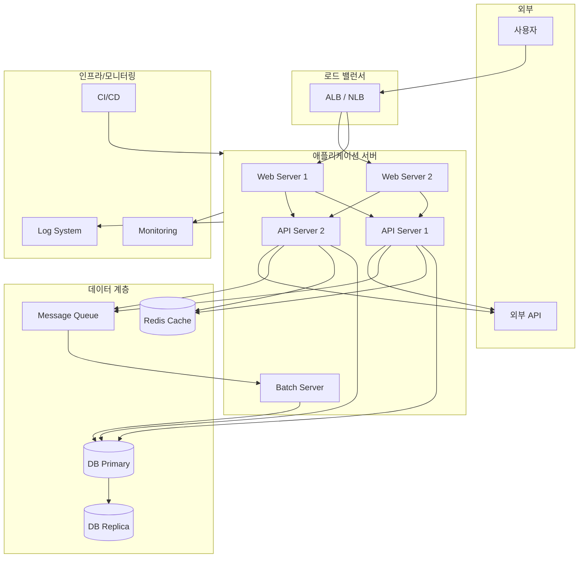
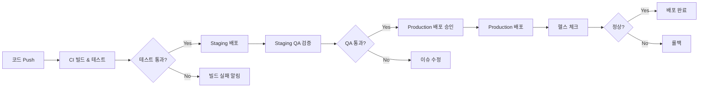
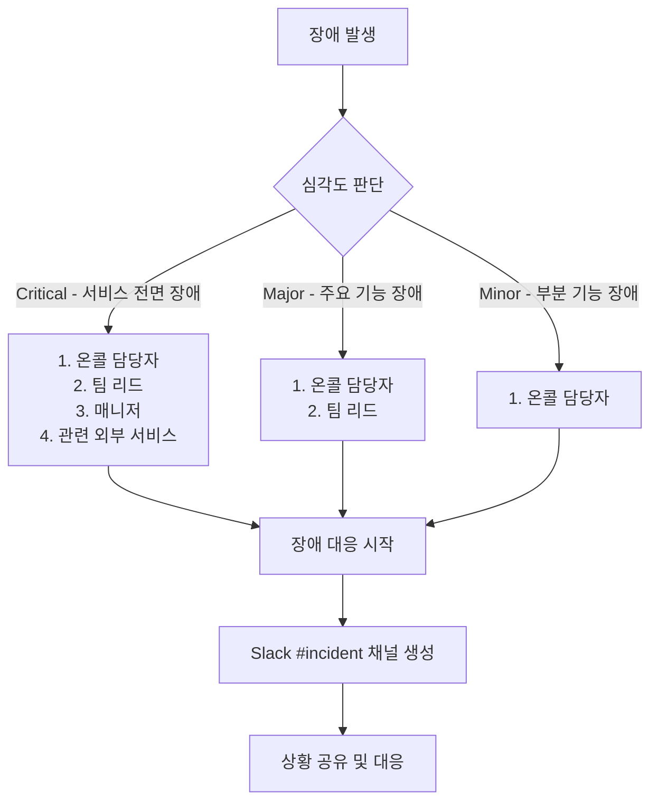

# 인수인계 문서 (Handover Document)

| 항목 | 내용 |
|------|------|
| **프로젝트명** | [프로젝트명] |
| **문서 버전** | [v1.0] |
| **작성일** | [YYYY-MM-DD] |
| **작성자** | [작성자명] |
| **승인자** | [승인자명] |

## 변경 이력

| 버전 | 변경일 | 변경 내용 | 작성자 |
|------|--------|-----------|--------|
| v1.0 | [YYYY-MM-DD] | 최초 작성 | [작성자명] |
| v1.1 | [YYYY-MM-DD] | [변경 내용] | [작성자명] |

---

## 1. 인수인계 개요

### 1.1 목적

본 문서는 [프로젝트명] 시스템의 운영 및 유지보수 업무를 인계하기 위한 종합 인수인계 문서이다. 시스템 구성, 운영 절차, 칸반 기반 운영 컨텍스트, 주요 이슈 및 지식 이전(Knowledge Transfer) 계획을 포함한다.

### 1.2 인수인계 사유

| 항목 | 내용 |
|------|------|
| **인수인계 사유** | [담당자 변경 / 조직 개편 / 운영 이관 / 프로젝트 종료 후 운영 전환 / 기타] |
| **인수인계 유형** | [전체 이관 / 부분 이관 / 공동 운영 전환] |

### 1.3 인수인계 기간

| 항목 | 일정 |
|------|------|
| 인수인계 시작일 | [YYYY-MM-DD] |
| 인수인계 완료일 | [YYYY-MM-DD] |
| 병행 운영 기간 | [YYYY-MM-DD] ~ [YYYY-MM-DD] |
| 완전 전환일 | [YYYY-MM-DD] |

### 1.4 관계자

| 역할 | 이름 | 소속 | 연락처 | 비고 |
|------|------|------|--------|------|
| 인계자 (현 담당자) | [이름] | [소속팀] | [이메일/전화] | [담당 기간: YYYY-MM ~ YYYY-MM] |
| 인수자 (신규 담당자) | [이름] | [소속팀] | [이메일/전화] | |
| 인계 책임자 | [이름] | [소속팀] | [이메일/전화] | 인수인계 전체 관리 |
| PM | [이름] | [소속팀] | [이메일/전화] | |
| 기술 리드 | [이름] | [소속팀] | [이메일/전화] | |

---

## 2. 시스템 구성 정보

### 2.1 시스템 구성도



> **참고**: 위 구성도는 예시이며, 실제 시스템 구성에 맞게 수정 필요

### 2.2 주요 컴포넌트

| 컴포넌트 | 설명 | 기술 스택 | 인스턴스 수 | 비고 |
|----------|------|----------|:----------:|------|
| [Web Server] | [웹 프론트엔드 서빙] | [Nginx / Apache / 기타] | [N] | |
| [API Server] | [REST API 서비스] | [Spring Boot / Node.js / 기타] | [N] | |
| [Batch Server] | [배치 처리 서비스] | [Spring Batch / Airflow / 기타] | [N] | |
| [Worker] | [비동기 작업 처리] | [Celery / Sidekiq / 기타] | [N] | |
| [Scheduler] | [스케줄 작업 관리] | [Cron / Quartz / 기타] | [N] | |

### 2.3 기술 스택

| 구분 | 기술 | 버전 | 비고 |
|------|------|------|------|
| **Language** | [Java / Python / TypeScript / 기타] | [버전] | |
| **Framework** | [Spring Boot / Django / Next.js / 기타] | [버전] | |
| **Database** | [PostgreSQL / MySQL / MongoDB / 기타] | [버전] | [Primary/Replica 구성] |
| **Cache** | [Redis / Memcached / 기타] | [버전] | |
| **Message Queue** | [RabbitMQ / Kafka / SQS / 기타] | [버전] | |
| **Search Engine** | [Elasticsearch / OpenSearch / 기타] | [버전] | |
| **Container** | [Docker / Podman / 기타] | [버전] | |
| **Orchestration** | [Kubernetes / ECS / Docker Compose / 기타] | [버전] | |
| **CI/CD** | [Jenkins / GitHub Actions / GitLab CI / 기타] | - | |
| **IaC** | [Terraform / CloudFormation / Ansible / 기타] | [버전] | |
| **Monitoring** | [Prometheus + Grafana / Datadog / CloudWatch / 기타] | - | |
| **Logging** | [ELK Stack / Loki / CloudWatch Logs / 기타] | - | |
| **APM** | [Elastic APM / Datadog APM / New Relic / 기타] | - | |

### 2.4 인프라 구성

#### 클라우드/온프레미스 환경

| 항목 | 내용 |
|------|------|
| 클라우드 프로바이더 | [AWS / GCP / Azure / 온프레미스 / 하이브리드] |
| 리전 | [ap-northeast-2 (서울) / 기타] |
| 가용 영역(AZ) | [N]개 AZ 사용: [az-a, az-b, ...] |
| VPC/네트워크 | [VPC CIDR: 10.0.0.0/16 / 기타] |
| 계정/프로젝트 | [AWS Account ID / GCP Project ID / 기타] |

#### 네트워크 구성

| 서브넷 | 용도 | CIDR | AZ | 비고 |
|--------|------|------|----|------|
| [Public Subnet A] | 로드 밸런서, NAT Gateway | [10.0.1.0/24] | [az-a] | |
| [Public Subnet B] | 로드 밸런서, NAT Gateway | [10.0.2.0/24] | [az-b] | |
| [Private Subnet A] | 애플리케이션 서버 | [10.0.11.0/24] | [az-a] | |
| [Private Subnet B] | 애플리케이션 서버 | [10.0.12.0/24] | [az-b] | |
| [Data Subnet A] | 데이터베이스 | [10.0.21.0/24] | [az-a] | |
| [Data Subnet B] | 데이터베이스 | [10.0.22.0/24] | [az-b] | |

#### 서버 스펙

| 서버 유형 | 인스턴스 타입 | vCPU | Memory | Storage | 수량 | 비고 |
|----------|-------------|:----:|:------:|:-------:|:----:|------|
| [Web Server] | [t3.medium / 기타] | [2] | [4]GB | [50]GB | [N] | |
| [API Server] | [m5.large / 기타] | [2] | [8]GB | [100]GB | [N] | |
| [DB Primary] | [r5.xlarge / 기타] | [4] | [32]GB | [500]GB | [1] | |
| [DB Replica] | [r5.xlarge / 기타] | [4] | [32]GB | [500]GB | [N] | |
| [Cache] | [r6g.large / 기타] | [2] | [16]GB | - | [N] | |
| [Batch Server] | [c5.xlarge / 기타] | [4] | [8]GB | [200]GB | [N] | |

---

## 3. 접속 정보

> **주의**: 실제 비밀번호, API Key, Token 등은 본 문서에 기재하지 않으며, 시크릿 매니저를 통해 관리한다.

### 3.1 서버 목록

| 환경 | 서버 역할 | 호스트명 | IP / Endpoint | 접속 포트 | 접속 방법 | 비고 |
|------|----------|---------|-------------|:--------:|----------|------|
| Production | [Web Server 1] | [hostname] | [IP/도메인] | [22/443] | [SSH / SSM / Bastion] | |
| Production | [API Server 1] | [hostname] | [IP/도메인] | [22/8080] | [SSH / SSM / Bastion] | |
| Production | [DB Primary] | [hostname] | [endpoint] | [5432/3306] | [DB Client] | |
| Staging | [Web Server] | [hostname] | [IP/도메인] | [22/443] | [SSH / SSM / Bastion] | |
| Staging | [API Server] | [hostname] | [IP/도메인] | [22/8080] | [SSH / SSM / Bastion] | |
| Development | [개발 서버] | [hostname] | [IP/도메인] | [22] | [SSH] | |

### 3.2 데이터베이스 접속 정보

| 환경 | DB 유형 | Endpoint | Port | Database명 | 계정 관리 위치 |
|------|---------|----------|:----:|-----------|-------------|
| Production | [PostgreSQL] | [endpoint] | [5432] | [DB명] | [AWS Secrets Manager / Vault / 기타] |
| Production (Replica) | [PostgreSQL] | [endpoint] | [5432] | [DB명] | [시크릿 매니저] |
| Staging | [PostgreSQL] | [endpoint] | [5432] | [DB명] | [시크릿 매니저] |
| Development | [PostgreSQL] | [endpoint] | [5432] | [DB명] | [시크릿 매니저] |

### 3.3 관리 콘솔 목록

| 콘솔 | URL | 용도 | 계정 관리 | 비고 |
|------|-----|------|----------|------|
| [AWS Console] | [https://console.aws.amazon.com/] | 클라우드 인프라 관리 | [SSO / IAM] | |
| [CI/CD Dashboard] | [URL] | 빌드/배포 관리 | [LDAP / SSO] | |
| [Grafana] | [URL] | 모니터링 대시보드 | [LDAP / OAuth] | |
| [Kibana / Log Dashboard] | [URL] | 로그 검색/분석 | [LDAP / OAuth] | |
| [APM Dashboard] | [URL] | 애플리케이션 성능 모니터링 | [LDAP / OAuth] | |
| [칸반 보드] | [URL] | 작업 관리 (Jira / Azure DevOps / 기타) | [SSO] | |
| [Git Repository] | [URL] | 소스 코드 관리 | [SSO / SSH Key] | |
| [Wiki / Confluence] | [URL] | 기술 문서 | [SSO] | |

### 3.4 시크릿 관리

| 시크릿 유형 | 관리 도구 | 위치/경로 | 접근 권한 | 갱신 주기 |
|-----------|----------|----------|----------|----------|
| DB 비밀번호 | [AWS Secrets Manager / Vault / 기타] | [시크릿 경로/ARN] | [IAM Role / Policy] | [N]일 자동 갱신 |
| API Key | [시크릿 매니저] | [시크릿 경로] | [IAM Role / Policy] | [필요 시 수동] |
| SSL 인증서 | [ACM / Let's Encrypt / 기타] | [인증서 ARN/경로] | - | [자동 갱신 / N개월] |
| SSH Key | [시크릿 매니저] | [시크릿 경로] | [IAM Role / Policy] | [N]개월 |
| OAuth Secret | [시크릿 매니저] | [시크릿 경로] | [IAM Role / Policy] | [필요 시 수동] |

---

## 4. 운영 정보

### 4.1 계정 및 권한 정보

| 시스템 | 역할 | 권한 수준 | 발급 방법 | 담당자 |
|--------|------|----------|----------|--------|
| [AWS Console] | [Admin / Developer / ReadOnly] | [IAM Policy 기반] | [IT 지원팀 요청] | [담당자] |
| [CI/CD] | [Admin / Deploy / View] | [역할 기반] | [팀 리드 승인] | [담당자] |
| [Monitoring] | [Admin / Editor / Viewer] | [역할 기반] | [운영팀 요청] | [담당자] |
| [DB] | [DBA / ReadWrite / ReadOnly] | [DB 계정 기반] | [DBA 요청] | [담당자] |
| [칸반 보드] | [Admin / Member] | [프로젝트 기반] | [PM 요청] | [담당자] |
| [Git Repository] | [Admin / Maintainer / Developer] | [역할 기반] | [팀 리드 승인] | [담당자] |

### 4.2 배포 절차 요약



| 항목 | 내용 |
|------|------|
| 배포 도구 | [Jenkins / GitHub Actions / ArgoCD / 기타] |
| 배포 전략 | [Rolling Update / Blue-Green / Canary / 기타] |
| 배포 브랜치 | [main / release / 기타] |
| 배포 승인 | [자동 / 수동 승인 필요 - 승인권자: 팀 리드] |
| 배포 시간 | [업무 시간 내 / 비업무 시간 / 제한 없음] |
| 롤백 절차 | [이전 버전 재배포 / DB 마이그레이션 롤백 포함 여부] |
| 배포 가이드 위치 | [문서 경로/URL] |

### 4.3 백업/복구 절차 요약

| 대상 | 백업 방법 | 백업 주기 | 보존 기간 | 복구 절차 위치 | RTO | RPO |
|------|----------|----------|----------|-------------|-----|-----|
| [Database] | [자동 스냅샷 / pg_dump / mysqldump] | [일간 / 시간별] | [30]일 | [문서 경로] | [N]시간 | [N]시간 |
| [파일 스토리지] | [S3 버저닝 / rsync / 기타] | [실시간 / 일간] | [90]일 | [문서 경로] | [N]시간 | [N]시간 |
| [설정 파일] | [Git / S3 / 기타] | [변경 시] | 영구 | [문서 경로] | [N]분 | 0 |
| [로그] | [S3 아카이브 / 기타] | [일간] | [1]년 | [문서 경로] | - | - |

### 4.4 모니터링/알림 설정 요약

| 대시보드 | URL | 용도 | 주요 알림 채널 |
|---------|-----|------|-------------|
| [시스템 대시보드] | [URL] | CPU, Memory, Disk 모니터링 | [Slack #ops-alerts] |
| [애플리케이션 대시보드] | [URL] | API 응답, 에러율, RPS | [Slack #dev-alerts] |
| [DB 대시보드] | [URL] | 커넥션, 쿼리 성능, Replication | [Slack #ops-alerts] |
| [비즈니스 대시보드] | [URL] | KPI, 사용자 지표 | [Email] |
| [칸반 흐름 대시보드] | [URL] | Lead Time, WIP, Throughput | [Slack #kanban-flow] |

> **상세 알림 설정**: `templates/kanban/07-운영-모니터링-대시보드-설계서.md` 참조

### 4.5 정기 작업 목록

| 작업명 | 유형 | 실행 주기 | 실행 시간 | 서버/시스템 | 설명 | 모니터링 |
|--------|------|----------|----------|-----------|------|---------|
| [DB 백업] | 배치 | 일간 | [03:00] | [DB Server] | [데이터베이스 전체 백업] | [알림 채널] |
| [로그 로테이션] | 스케줄러 | 일간 | [00:00] | [All Servers] | [로그 파일 아카이빙 및 정리] | [알림 채널] |
| [인증서 갱신] | 수동/자동 | [N]개월 | - | [Web Server] | [SSL 인증서 갱신] | [만료 30일 전 알림] |
| [캐시 정리] | 배치 | [주간] | [02:00 일요일] | [Cache Server] | [만료 캐시 정리] | [알림 채널] |
| [데이터 정리] | 배치 | [월간] | [04:00 1일] | [Batch Server] | [임시 데이터, 오래된 세션 정리] | [알림 채널] |
| [보안 패치 점검] | 수동 | [월간] | - | [All] | [OS 및 라이브러리 보안 업데이트] | - |
| [성능 리포트 생성] | 배치 | [주간] | [06:00 월요일] | [Batch Server] | [주간 성능 리포트 자동 생성] | [Email] |

---

## 5. 칸반 운영 컨텍스트

> 칸반 기반 운영에서 인수인계 시 반드시 전달해야 하는 운영 컨텍스트

### 5.1 현재 칸반 보드 상태

#### 보드 구성

| 열(Column) | WIP 제한 | 현재 WIP | 설명 |
|-----------|:--------:|:--------:|------|
| Backlog | 제한 없음 | [N] | 우선순위 정렬된 대기 항목 |
| 커밋 (Selected) | [N] | [N] | 작업 시작 대기 (커밋 포인트) |
| 개발 (In Progress) | [N] | [N] | 활발히 개발 중 |
| 리뷰 (Review) | [N] | [N] | 코드 리뷰 진행 중 |
| 테스트 (Testing) | [N] | [N] | QA 검증 중 |
| 배포 대기 (Ready to Deploy) | [N] | [N] | 배포 승인 대기 |
| 완료 (Done) | - | - | 배포 완료 |

#### 보드 도구 정보

| 항목 | 내용 |
|------|------|
| 칸반 도구 | [Jira / Azure DevOps / Kanbanize / 기타] |
| 보드 URL | [URL] |
| 프로젝트/팀 키 | [프로젝트 키] |
| 관리자 | [관리자명] |

### 5.2 WIP 정책 요약

| 정책 항목 | 현재 설정 | 근거 | 최근 조정 이력 |
|----------|----------|------|-------------|
| 전체 보드 WIP 제한 | [N] | [팀 인원 × 1.5 등 산정 근거] | [YYYY-MM-DD: N → N 조정] |
| 개발 열 WIP 제한 | [N] | [산정 근거] | [조정 이력] |
| 리뷰 열 WIP 제한 | [N] | [산정 근거] | [조정 이력] |
| 테스트 열 WIP 제한 | [N] | [산정 근거] | [조정 이력] |
| Expedite Swimlane WIP 제한 | [1] | 긴급 항목 동시 1건만 허용 | - |
| WIP 초과 시 정책 | [신규 작업 시작 금지 / 팀 리드 승인 필요 / 기타] | | |

### 5.3 Class of Service 정책 요약

| Class of Service | 설명 | Swimlane | WIP 제한 | SLE | 비율 목표 |
|-----------------|------|----------|:--------:|-----|:--------:|
| **Expedite** (긴급) | 즉시 처리 필요, 다른 작업보다 우선 | 전용 Swimlane | [1] | [N]일 이내 | < [5]% |
| **Fixed Date** (고정 납기) | 외부 기한이 정해진 작업 | 일반 또는 전용 | [N] | 기한 내 완료 | [N]% |
| **Standard** (일반) | 일반적인 우선순위 기반 작업 | 일반 | [N] | [N]일 이내 (P85) | [N]% |
| **Intangible** (무형) | 기술 부채, 내부 개선, 리팩토링 | 일반 | [N] | [N]일 이내 (P85) | ≥ [20]% |

### 5.4 주요 흐름 메트릭 현황

> 최근 [N]주/개월 기준 메트릭 현황

| 메트릭 | 값 | 추세 | 비고 |
|--------|----|:----:|------|
| 평균 Lead Time | [N]일 | [안정/개선/악화] | 최근 [N]주 평균 |
| Lead Time P85 | [N]일 | [안정/개선/악화] | SLE 기준 |
| 평균 Cycle Time | [N]일 | [안정/개선/악화] | 최근 [N]주 평균 |
| Cycle Time P85 | [N]일 | [안정/개선/악화] | |
| 주간 Throughput (평균) | [N]건/주 | [안정/개선/악화] | 최근 [N]주 이동 평균 |
| SLE 달성률 (Standard) | [N]% | [안정/개선/악화] | 목표: [85]% |
| Flow Efficiency | [N]% | [안정/개선/악화] | 목표: > [40]% |
| 평균 블로커 해결 시간 | [N]시간 | [안정/개선/악화] | |

### 5.5 현재 진행 중인 Work Items 현황

| 항목 ID | 제목 | Class of Service | 현재 단계 | 담당자 | WIP Age | SLE 기한 | 상태 | 비고 |
|---------|------|:---------------:|----------|--------|:-------:|---------|:----:|------|
| [ITEM-001] | [항목 제목] | [Standard] | [개발] | [담당자] | [N]일 | [YYYY-MM-DD] | [정상] | |
| [ITEM-002] | [항목 제목] | [Fixed Date] | [리뷰] | [담당자] | [N]일 | [YYYY-MM-DD] | [주의] | 기한 임박 |
| [ITEM-003] | [항목 제목] | [Expedite] | [테스트] | [담당자] | [N]일 | [YYYY-MM-DD] | [정상] | 긴급 건 |
| [ITEM-004] | [항목 제목] | [Standard] | [개발] | [담당자] | [N]일 | [YYYY-MM-DD] | [차단됨] | Blocker: [사유] |
| [ITEM-005] | [항목 제목] | [Intangible] | [개발] | [담당자] | [N]일 | - | [정상] | 기술 부채 해소 |

### 5.6 기술 부채 현황 요약

| ID | 기술 부채 항목 | 심각도 | 영향 범위 | 등록일 | 상태 | 비고 |
|----|-------------|:------:|----------|--------|:----:|------|
| TD-[001] | [기술 부채 설명] | [높음/중간/낮음] | [영향 범위] | [YYYY-MM-DD] | [미착수/진행중/완료] | |
| TD-[002] | [기술 부채 설명] | [심각도] | [영향 범위] | [YYYY-MM-DD] | [상태] | |
| TD-[003] | [기술 부채 설명] | [심각도] | [영향 범위] | [YYYY-MM-DD] | [상태] | |

#### 기술 부채 관리 정책

| 항목 | 내용 |
|------|------|
| 기술 부채 투자 비율 | 전체 작업의 [20]% 이상을 Intangible(기술 부채) 작업에 할당 |
| 기술 부채 식별 방법 | [코드 리뷰, 회고, 장애 분석에서 식별] |
| 기술 부채 우선순위 결정 | [Operations Review에서 월간 우선순위 조정] |

### 5.7 릴리스 일정 및 전략

| 항목 | 내용 |
|------|------|
| 릴리스 전략 | [Continuous Delivery / 주간 릴리스 / 격주 릴리스 / 기타] |
| 릴리스 요일/시간 | [화/목 오전 10시 / 수시 / 기타] |
| 릴리스 결정 기준 | [완료된 항목이 있을 때 즉시 / 일정 항목 수 이상 / 기타] |
| 다음 예정 릴리스 | [YYYY-MM-DD] |
| 릴리스 노트 관리 | [위치/도구] |

#### 향후 주요 릴리스 일정

| 릴리스 | 예정일 | 주요 포함 항목 | 상태 | 비고 |
|--------|--------|-------------|:----:|------|
| [v2.5.0] | [YYYY-MM-DD] | [ITEM-010, ITEM-011, ITEM-012] | [준비중/진행중] | |
| [v2.6.0] | [YYYY-MM-DD] | [ITEM-015, ITEM-016] | [계획됨] | |
| [v3.0.0] | [YYYY-MM-DD] | [대규모 아키텍처 변경] | [계획됨] | 마이그레이션 필요 |

---

## 6. 주요 이슈 및 리스크

### 6.1 현재 알려진 이슈 목록

| ID | 이슈 제목 | 심각도 | 영향 범위 | 발견일 | 현재 상태 | 우회 방법 | 담당자 |
|----|----------|:------:|----------|--------|:--------:|----------|--------|
| ISS-[001] | [이슈 설명] | [Critical/Major/Minor] | [영향 범위] | [YYYY-MM-DD] | [조사중/대응중/모니터링] | [우회 방법 있으면 기재] | [담당자] |
| ISS-[002] | [이슈 설명] | [심각도] | [영향 범위] | [YYYY-MM-DD] | [상태] | [우회 방법] | [담당자] |
| ISS-[003] | [이슈 설명] | [심각도] | [영향 범위] | [YYYY-MM-DD] | [상태] | [우회 방법] | [담당자] |

### 6.2 잠재적 리스크 및 대응 방안

| ID | 리스크 | 발생 가능성 | 영향도 | 리스크 점수 | 대응 전략 | 대응 방안 | 담당자 |
|----|--------|:---------:|:-----:|:---------:|----------|----------|--------|
| RSK-[001] | [리스크 설명] | [높음/중간/낮음] | [높음/중간/낮음] | [H/M/L] | [회피/완화/전가/수용] | [구체적 대응 방안] | [담당자] |
| RSK-[002] | [리스크 설명] | [가능성] | [영향도] | [점수] | [전략] | [대응 방안] | [담당자] |
| RSK-[003] | [리스크 설명] | [가능성] | [영향도] | [점수] | [전략] | [대응 방안] | [담당자] |

### 6.3 기술 부채 상위 항목

| 순위 | 항목 | 심각도 | 예상 영향 | 해결 난이도 | 예상 공수 | 비고 |
|:----:|------|:------:|----------|:---------:|:--------:|------|
| 1 | [기술 부채 항목] | [높음] | [성능 저하, 유지보수 비용 증가 등] | [높음/중간/낮음] | [N]일 | |
| 2 | [기술 부채 항목] | [높음] | [예상 영향] | [난이도] | [N]일 | |
| 3 | [기술 부채 항목] | [중간] | [예상 영향] | [난이도] | [N]일 | |
| 4 | [기술 부채 항목] | [중간] | [예상 영향] | [난이도] | [N]일 | |
| 5 | [기술 부채 항목] | [낮음] | [예상 영향] | [난이도] | [N]일 | |

---

## 7. KT (Knowledge Transfer) 계획

### 7.1 KT 일정

```mermaid
gantt
    title Knowledge Transfer 일정
    dateFormat  YYYY-MM-DD
    axisFormat  %m/%d

    section 시스템 이해
    시스템 아키텍처 개요       :[KT-001], [YYYY-MM-DD], 1d
    기술 스택 및 개발 환경     :[KT-002], after KT-001, 1d
    코드베이스 구조 설명       :[KT-003], after KT-002, 2d

    section 운영 절차
    배포 절차 실습             :[KT-004], after KT-003, 1d
    모니터링 및 알림 체계      :[KT-005], after KT-004, 1d
    장애 대응 절차             :[KT-006], after KT-005, 1d

    section 칸반 운영
    칸반 보드 운영 방법        :[KT-007], after KT-006, 1d
    리뷰 캐던스 참관           :[KT-008], after KT-007, 5d

    section 실습 및 병행
    온콜 병행 운영             :[KT-009], after KT-008, 5d
    독립 운영 + 지원           :[KT-010], after KT-009, 5d
```

### 7.2 KT 세션 목록

| 세션 ID | 주제 | 설명 | 담당(인계자) | 일정 | 소요 시간 | 참석자 | 상태 |
|---------|------|------|-----------|------|:--------:|--------|:----:|
| KT-001 | 시스템 아키텍처 | 전체 시스템 구성, 데이터 흐름, 주요 의사결정 배경 | [인계자] | [YYYY-MM-DD] | [2]시간 | [인수자, 팀 리드] | [예정/완료] |
| KT-002 | 기술 스택 및 개발 환경 | 개발 환경 구성, 빌드 절차, 의존성 관리 | [인계자] | [YYYY-MM-DD] | [2]시간 | [인수자] | [예정/완료] |
| KT-003 | 코드베이스 구조 | 주요 모듈, 디렉토리 구조, 핵심 비즈니스 로직 | [인계자] | [YYYY-MM-DD] | [4]시간 | [인수자] | [예정/완료] |
| KT-004 | 배포 절차 | CI/CD 파이프라인, 배포 실습, 롤백 실습 | [인계자] | [YYYY-MM-DD] | [2]시간 | [인수자] | [예정/완료] |
| KT-005 | 모니터링/알림 | 대시보드 설명, 알림 체계, 알림 대응 방법 | [인계자] | [YYYY-MM-DD] | [2]시간 | [인수자] | [예정/완료] |
| KT-006 | 장애 대응 | 장애 등급, 대응 절차, 과거 장애 사례 리뷰 | [인계자] | [YYYY-MM-DD] | [2]시간 | [인수자] | [예정/완료] |
| KT-007 | 칸반 보드 운영 | 보드 구성, WIP 정책, CoS 정책, 흐름 메트릭 | [인계자] | [YYYY-MM-DD] | [2]시간 | [인수자, PM] | [예정/완료] |
| KT-008 | 리뷰 캐던스 참관 | Service Delivery Review, Replenishment Meeting 참관 | [인계자] | [YYYY-MM-DD ~ YYYY-MM-DD] | 참관 | [인수자] | [예정/완료] |
| KT-009 | 온콜 병행 운영 | 온콜 업무 공동 수행, 실시간 가이드 | [인계자] | [YYYY-MM-DD ~ YYYY-MM-DD] | 병행 | [인수자] | [예정/완료] |
| KT-010 | 독립 운영 + 지원 | 인수자 독립 운영, 인계자 백업 지원 | [인계자] | [YYYY-MM-DD ~ YYYY-MM-DD] | 지원 | [인수자] | [예정/완료] |

### 7.3 KT 자료 목록

| 자료 ID | 자료명 | 유형 | 위치 | 비고 |
|---------|--------|------|------|------|
| DOC-001 | 시스템 아키텍처 설계서 | 문서 | [문서 경로/URL] | |
| DOC-002 | API 설계서 | 문서 | [문서 경로/URL] | |
| DOC-003 | 데이터베이스 설계서 | 문서 | [문서 경로/URL] | |
| DOC-004 | 배포 가이드 | 문서 | [문서 경로/URL] | |
| DOC-005 | 운영 가이드 | 문서 | [문서 경로/URL] | |
| DOC-006 | 모니터링 대시보드 설계서 | 문서 | [문서 경로/URL] | |
| DOC-007 | 장애 대응 매뉴얼 | 문서 | [문서 경로/URL] | |
| DOC-008 | 칸반 보드 운영 가이드 | 문서 | [문서 경로/URL] | |
| DOC-009 | 회고 및 개선 보고서 | 문서 | [문서 경로/URL] | |
| DOC-010 | 과거 장애 보고서 | 문서 | [문서 경로/URL] | |
| DOC-011 | 코드 리포지토리 README | 코드 | [Git URL] | |
| DOC-012 | KT 세션 녹화 영상 | 영상 | [영상 저장소 URL] | 녹화 시 |

---

## 8. 인수인계 체크리스트

### 8.1 시스템 접근 권한 이전

| 항목 | 상태 | 완료일 | 확인자 | 비고 |
|------|:----:|--------|--------|------|
| AWS / 클라우드 콘솔 접근 권한 발급 | [ ] | | | |
| CI/CD 시스템 접근 권한 발급 | [ ] | | | |
| Git Repository 접근 권한 발급 | [ ] | | | |
| 모니터링 도구 접근 권한 발급 | [ ] | | | |
| 로그 시스템 접근 권한 발급 | [ ] | | | |
| 데이터베이스 접근 계정 발급 | [ ] | | | |
| 칸반 보드 접근 권한 발급 | [ ] | | | |
| Wiki / 문서 시스템 접근 권한 발급 | [ ] | | | |
| Bastion / VPN 접근 설정 | [ ] | | | |
| 시크릿 매니저 접근 권한 | [ ] | | | |

### 8.2 문서 전달 확인

| 항목 | 상태 | 완료일 | 확인자 | 비고 |
|------|:----:|--------|--------|------|
| 시스템 아키텍처 설계서 전달 | [ ] | | | |
| API 설계서 전달 | [ ] | | | |
| 데이터베이스 설계서 전달 | [ ] | | | |
| 배포 가이드 전달 | [ ] | | | |
| 운영 가이드 전달 | [ ] | | | |
| 장애 대응 매뉴얼 전달 | [ ] | | | |
| 모니터링 대시보드 설계서 전달 | [ ] | | | |
| 칸반 보드 운영 가이드 전달 | [ ] | | | |
| 최신 회고/개선 보고서 전달 | [ ] | | | |
| 과거 장애 보고서 전달 | [ ] | | | |

### 8.3 KT 완료 확인

| 항목 | 상태 | 완료일 | 확인자 | 비고 |
|------|:----:|--------|--------|------|
| KT-001: 시스템 아키텍처 세션 완료 | [ ] | | | |
| KT-002: 기술 스택 및 개발 환경 세션 완료 | [ ] | | | |
| KT-003: 코드베이스 구조 세션 완료 | [ ] | | | |
| KT-004: 배포 절차 실습 완료 | [ ] | | | |
| KT-005: 모니터링 및 알림 세션 완료 | [ ] | | | |
| KT-006: 장애 대응 세션 완료 | [ ] | | | |
| KT-007: 칸반 보드 운영 세션 완료 | [ ] | | | |
| KT-008: 리뷰 캐던스 참관 완료 | [ ] | | | |
| KT-009: 온콜 병행 운영 완료 | [ ] | | | |
| KT-010: 독립 운영 기간 완료 | [ ] | | | |

### 8.4 모니터링/알림 수신자 변경

| 항목 | 상태 | 완료일 | 확인자 | 비고 |
|------|:----:|--------|--------|------|
| PagerDuty / Opsgenie 온콜 스케줄 변경 | [ ] | | | |
| Slack 알림 채널 수신자 추가 | [ ] | | | |
| Email 알림 수신자 변경 | [ ] | | | |
| SMS 알림 수신자 변경 | [ ] | | | |
| 칸반 흐름 알림 수신자 변경 | [ ] | | | |
| 에스컬레이션 정책 담당자 변경 | [ ] | | | |

### 8.5 온콜 로테이션 인수

| 항목 | 상태 | 완료일 | 확인자 | 비고 |
|------|:----:|--------|--------|------|
| 온콜 로테이션 스케줄에 인수자 추가 | [ ] | | | |
| 온콜 도구 (PagerDuty 등) 계정 설정 | [ ] | | | |
| 온콜 매뉴얼 숙지 확인 | [ ] | | | |
| 온콜 병행 운영 완료 | [ ] | | | |
| 인계자 온콜 스케줄에서 제거 | [ ] | | | |

### 8.6 비상 연락처 업데이트

| 항목 | 상태 | 완료일 | 확인자 | 비고 |
|------|:----:|--------|--------|------|
| 내부 비상 연락처 목록 업데이트 | [ ] | | | |
| 외부 비상 연락처 인수자 등록 | [ ] | | | |
| 장애 대응 에스컬레이션 연락처 변경 | [ ] | | | |

### 8.7 외부 서비스 계정 이관

| 항목 | 상태 | 완료일 | 확인자 | 비고 |
|------|:----:|--------|--------|------|
| [외부 API 서비스 A] 관리자 계정 이관 | [ ] | | | |
| [외부 API 서비스 B] 관리자 계정 이관 | [ ] | | | |
| [CDN 서비스] 관리자 계정 이관 | [ ] | | | |
| [도메인 관리] 관리자 계정 이관 | [ ] | | | |
| [이메일 서비스] 관리자 계정 이관 | [ ] | | | |
| [결제 서비스] 관리자 계정 이관 | [ ] | | | |

### 8.8 인수인계 완료 서명

| 역할 | 이름 | 서명일 | 서명 |
|------|------|--------|------|
| 인계자 | [이름] | [YYYY-MM-DD] | _____________ |
| 인수자 | [이름] | [YYYY-MM-DD] | _____________ |
| 인계 책임자 | [이름] | [YYYY-MM-DD] | _____________ |
| PM | [이름] | [YYYY-MM-DD] | _____________ |

---

## 9. 비상 연락처

### 9.1 내부 연락처

| 역할 | 이름 | 소속 | 이메일 | 전화번호 | 비고 |
|------|------|------|--------|---------|------|
| 시스템 운영 담당 | [이름] | [소속] | [이메일] | [전화번호] | 1차 연락 |
| 개발팀 리드 | [이름] | [소속] | [이메일] | [전화번호] | 기술 이슈 에스컬레이션 |
| DBA | [이름] | [소속] | [이메일] | [전화번호] | DB 관련 이슈 |
| 인프라 담당 | [이름] | [소속] | [이메일] | [전화번호] | 인프라 장애 |
| 보안 담당 | [이름] | [소속] | [이메일] | [전화번호] | 보안 인시던트 |
| PM | [이름] | [소속] | [이메일] | [전화번호] | 비즈니스 의사결정 |
| 매니저 | [이름] | [소속] | [이메일] | [전화번호] | 최종 에스컬레이션 |

### 9.2 외부 연락처

| 서비스 | 회사명 | 담당자 | 연락처 | 지원 시간 | 계약 유형 | 비고 |
|--------|--------|--------|--------|----------|----------|------|
| [클라우드 서비스 (AWS/GCP/Azure)] | [회사명] | [담당자/Support Portal] | [연락처/URL] | [24/7 / 업무시간] | [Enterprise / Business / 기타] | |
| [CDN 서비스] | [회사명] | [담당자] | [연락처] | [지원 시간] | [계약 유형] | |
| [외부 API 서비스 A] | [회사명] | [담당자] | [연락처] | [지원 시간] | [계약 유형] | |
| [외부 API 서비스 B] | [회사명] | [담당자] | [연락처] | [지원 시간] | [계약 유형] | |
| [결제 서비스 (PG)] | [회사명] | [담당자] | [연락처] | [지원 시간] | [계약 유형] | |
| [이메일 서비스] | [회사명] | [담당자] | [연락처] | [지원 시간] | [계약 유형] | |
| [도메인/DNS] | [회사명] | [담당자] | [연락처] | [지원 시간] | [계약 유형] | |
| [보안 서비스 (WAF/DDoS)] | [회사명] | [담당자] | [연락처] | [24/7] | [계약 유형] | |

### 9.3 장애 시 연락 우선순위



---

## 부록

### A. 용어 정의

| 용어 | 정의 |
|------|------|
| 인수인계 | 업무, 시스템, 지식을 현 담당자로부터 신규 담당자에게 이전하는 과정 |
| KT (Knowledge Transfer) | 지식 이전. 인수인계 과정에서의 교육 및 지식 공유 세션 |
| 온콜 (On-Call) | 장애 발생 시 즉시 대응할 수 있도록 대기하는 역할 |
| 병행 운영 | 인계자와 인수자가 함께 운영하는 전환 기간 |
| WIP (Work In Progress) | 현재 진행 중인 작업 수 |
| Class of Service (CoS) | 작업의 긴급도와 특성에 따른 분류 |
| SLE (Service Level Expectation) | 고객에게 제시하는 서비스 전달 기대치 |
| Lead Time | 작업이 커밋 포인트에 진입한 시점부터 완료까지의 경과 시간 |
| Cycle Time | 작업의 실제 작업 시작부터 완료까지의 경과 시간 |
| Throughput | 단위 기간당 완료된 작업 수 |
| Flow Efficiency | 총 Lead Time 중 실제 작업 시간의 비율 |
| RTO (Recovery Time Objective) | 복구 목표 시간 |
| RPO (Recovery Point Objective) | 복구 목표 시점 |
| Bastion | 외부에서 내부 서버에 접근하기 위한 중계 서버 |

### B. 참고 문서

| 문서 | 위치 | 관련 내용 |
|------|------|----------|
| 운영 모니터링 대시보드 설계서 | `templates/kanban/07-운영-모니터링-대시보드-설계서.md` | 모니터링 대시보드 상세 |
| 회고 및 개선 보고서 | `templates/kanban/08-회고-및-개선-보고서.md` | 회고 프레임워크, 개선 추적 |
| 배포 계획서 | `templates/waterfall/06-배포/배포계획서.md` | 배포 절차 상세 |
| 운영 가이드 | `templates/waterfall/06-배포/운영가이드.md` | 운영 절차 상세 |
| 유지보수 계획서 | `templates/waterfall/07-유지보수/유지보수계획서.md` | 유지보수 절차 |
| 보안 가이드 | `templates/security/보안-가이드.md` | 보안 정책 및 절차 |

### C. 인수인계 후 지원 정책

| 항목 | 내용 |
|------|------|
| 지원 기간 | 인수인계 완료 후 [N]개월 |
| 지원 방법 | [Slack DM / 이메일 / 정기 미팅] |
| 지원 범위 | [긴급 기술 문의, 장애 자문, 아키텍처 의사결정 자문] |
| 지원 담당자 | [인계자 이름, 연락처] |
| 비고 | [지원 종료 후 연락 가능 여부 등] |
