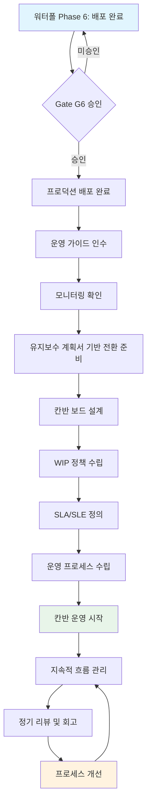
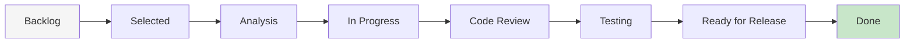
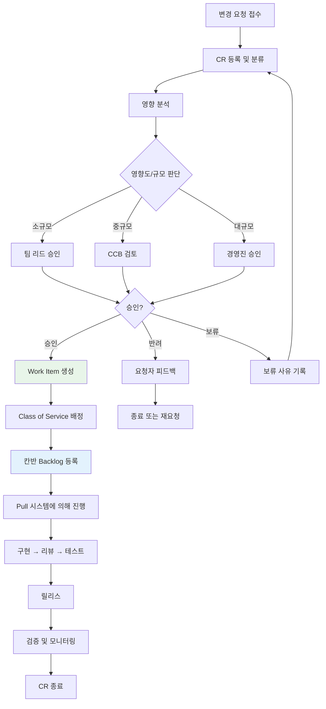
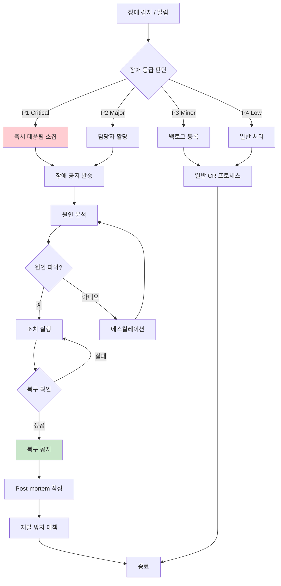
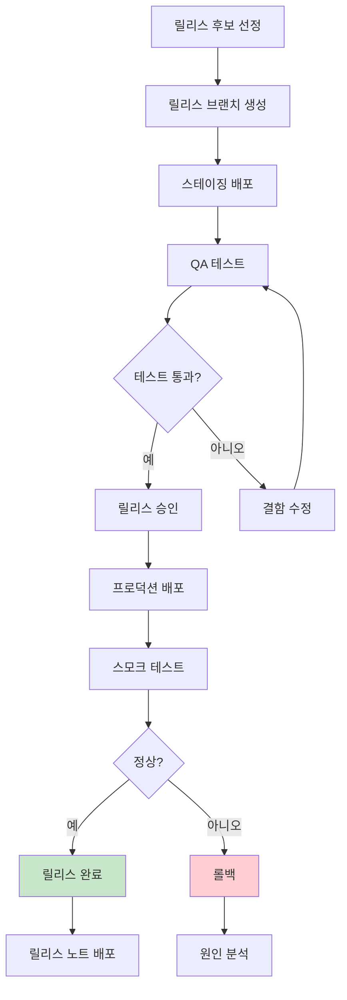
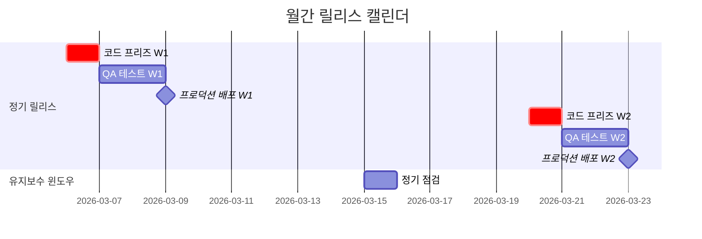
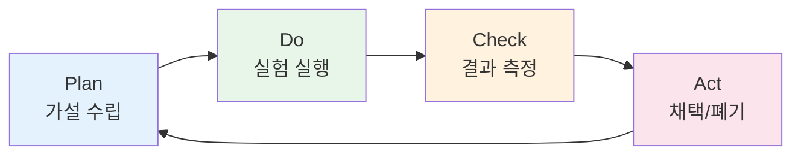
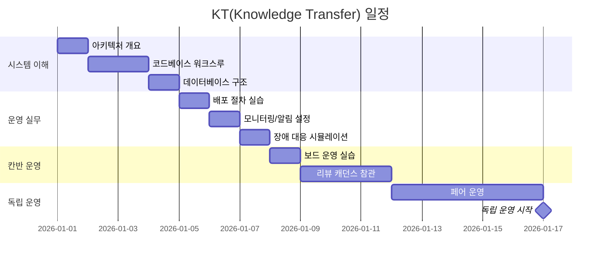

# Kanban Methodology - Claude Code 산출물 생성 가이드

> 이 문서는 Claude Code가 칸반(Kanban) 방법론에 따라 유지보수/운영 단계의 각 산출물을 자동으로 생성하기 위한 종합 가이드입니다.
> 사용자가 "칸반 보드 설계해줘", "SLA 작성해줘" 등의 요청을 하면, 이 문서의 해당 템플릿을 기반으로 산출물을 생성하세요.

**적용 시점**: 워터폴 Phase 6(배포) 완료 후 Gate G6 승인 → 칸반 전환

---

## 1. 칸반 방법론 개요

### 1.1 칸반의 정의

칸반(Kanban)은 작업 흐름을 시각화하고, 진행 중인 작업(WIP)을 제한하며, 흐름을 관리하여 지속적으로 프로세스를 개선하는 린(Lean) 기반의 작업 관리 방법론이다. 소프트웨어 유지보수/운영 단계에서 변경 요청, 장애 대응, 기술 부채 해소 등을 효율적으로 관리하는 데 적합하다.

**적합한 운영 상황:**
- 초기 개발이 완료되어 안정화된 시스템의 유지보수
- 다양한 유형의 작업이 비정기적으로 발생하는 운영 환경
- 지속적인 서비스 개선과 장애 대응이 필요한 환경
- 릴리스 주기가 유연한(또는 지속적 배포) 환경
- 운영팀과 개발팀이 협업하는 DevOps 환경

### 1.2 칸반 6가지 실천법

| 실천법 | 설명 | 적용 방법 |
|--------|------|-----------|
| **Visualize** (시각화) | 작업 흐름과 정책을 보드에 시각화 | 칸반 보드 구축, 열/Swimlane/카드 설계 |
| **Limit WIP** (WIP 제한) | 진행 중 작업 수를 제한하여 흐름 최적화 | 열별 WIP 한도 설정 및 준수 |
| **Manage Flow** (흐름 관리) | 작업이 원활하게 흐르도록 병목 식별 및 해소 | 흐름 메트릭 모니터링, 병목 분석 |
| **Make Policies Explicit** (정책 명시화) | 작업 규칙과 기준을 명문화 | 진입/완료 기준, Pull 정책, 에스컬레이션 규칙 |
| **Implement Feedback Loops** (피드백 루프) | 정기적 리뷰와 회고를 통한 피드백 수집 | 4가지 리뷰 캐던스 운영 |
| **Improve Collaboratively** (협력적 개선) | 실험과 데이터 기반의 지속적 개선 | PDCA 사이클, 개선 실험 |

### 1.3 워터폴→칸반 전환 흐름도



### 1.4 워터폴→칸반 산출물 매핑표

| 워터폴 산출물 | 칸반 대응 산출물 | 관계 | 비고 |
|---|---|---|---|
| 유지보수 유형 정의 | 칸반 보드 Swimlane | 수정/적응/완전/예방 → Work Item Type | 보드 설계서 |
| CR 프로세스 | 변경요청 관리 프로세스 | Pull 시스템과 통합 확장 | 승인 체계 계승 |
| SLA 정의 | 서비스 수준 협약 (SLA/SLE) | SLE 개념 추가, 메트릭 기반 확장 | 백분위 기반 |
| 기술 부채 관리 | 기술부채 관리대장 | 보안 부채 추가, 칸반 보드 연동 | 6유형 분류 |
| 인수인계 문서 | 인수인계 문서 | 칸반 운영 컨텍스트 추가 | WIP/메트릭 포함 |
| 모니터링 | 모니터링 대시보드 설계서 | 칸반 흐름 메트릭 추가 | CFD/리드타임 |
| 장애 Runbook | 장애 대응 절차서 | Post-mortem 추가 | 5 Whys 기법 |
| (신규) | 릴리스 관리 절차서 | 지속적 릴리스 전략 | 정기/긴급/핫픽스 |
| (신규) | 회고 및 개선 보고서 | 칸반 4가지 리뷰 캐던스 | KPT/PDCA |

### 1.5 워터폴 vs 칸반 비교

| 기준 | 워터폴 | 칸반 |
|------|--------|------|
| 적용 단계 | 초기 개발 (Phase 0~6) | 유지보수/운영 (Phase 7+) |
| 작업 흐름 | 순차적, 선형적 | 연속적, 흐름 기반 |
| 계획 방식 | 사전 확정 (빅뱅) | 지속적 보충 (Just-in-Time) |
| 변경 대응 | 공식 변경 관리 프로세스 | Pull 시스템으로 유연 대응 |
| 릴리스 주기 | 단일 릴리스 (빅뱅) | 지속적 릴리스 (연속 흐름) |
| 진행 측정 | 단계별 산출물 완료율 | 흐름 메트릭 (리드타임, 처리량) |
| 팀 구조 | 역할 기반 분리 | 교차 기능 팀 |
| 개선 방법 | Lessons Learned (프로젝트 종료 시) | 지속적 개선 (4가지 리뷰 캐던스) |
| 산출물 관리 | 단계별 공식 문서 | Living Document (지속 갱신) |
| 위험 관리 | 초기 식별, 단계별 검토 | 흐름 메트릭 기반 실시간 감지 |

### 1.6 칸반 보드 기본 흐름도



---

## 2. 칸반 보드 설계

### 2.1 기본 열 구조

| 열 이름 | 정의 | 진입 기준 | 완료 기준 | WIP 제한 |
|---------|------|-----------|-----------|----------|
| **Backlog** | 승인된 모든 Work Item 대기열 | CR 승인 완료, Work Item 등록 | 우선순위 부여 | 제한 없음 |
| **Selected** | 다음 작업 대상으로 선택됨 | Replenishment Meeting에서 선택 | 분석 준비 완료 | [3] |
| **Analysis** | 요구사항 분석 및 설계 중 | 담당자 할당, 요구사항 명확 | 구현 방안 확정, 공수 산정 완료 | [3] |
| **In Progress** | 구현(개발) 진행 중 | 분석 완료, 구현 시작 | 코드 작성 완료, 자체 테스트 통과 | [4] |
| **Code Review** | 코드 리뷰 진행 중 | PR 생성, 리뷰어 지정 | 리뷰 승인, 피드백 반영 완료 | [3] |
| **Testing** | QA 테스트 진행 중 | 코드 리뷰 통과, 테스트 환경 배포 | 테스트 통과, 결함 해결 | [3] |
| **Ready for Release** | 릴리스 대기 중 | 테스트 통과, 릴리스 승인 | 프로덕션 배포 완료 | [5] |
| **Done** | 완료 | 프로덕션 배포 및 검증 완료 | - | 제한 없음 |

### 2.2 WIP(Work In Progress) 제한

**리틀의 법칙 (Little's Law):**

```
평균 리드타임 = 평균 WIP / 평균 처리량
```

- WIP를 줄이면 리드타임이 줄어든다
- WIP 제한은 팀 규모와 역량을 기반으로 설정 (일반적으로 팀원 수 × 1.5)
- 초기 설정 후 데이터 기반으로 조정

**WIP 초과 시 대응 정책:**
1. 새로운 작업을 시작하지 않고 진행 중인 작업 완료에 집중
2. 병목이 발생한 열의 작업을 팀원이 협력하여 해소
3. 예외: Expedite(긴급) 등급은 WIP 초과 허용 (단, 1개로 제한)

### 2.3 Swimlane 설계

| Swimlane | 유지보수 유형 | WIP 할당 | 설명 |
|----------|-------------|----------|------|
| **Corrective** (수정) | 결함 수정 | 전체 WIP의 [25]% | 운영 중 발견된 버그 수정 |
| **Adaptive** (적응) | 환경 변화 대응 | 전체 WIP의 [20]% | OS/라이브러리/규정 변경 대응 |
| **Perfective** (완전) | 기능 개선 | 전체 WIP의 [35]% | 기능 추가/개선, UX 향상 |
| **Preventive** (예방) | 예방 활동 | 전체 WIP의 [20]% | 리팩토링, 기술 부채 해소, 보안 강화 |

### 2.4 Class of Service (서비스 등급)

| 등급 | 정의 | WIP 정책 | 리드타임 목표 | 에스컬레이션 |
|------|------|----------|-------------|-------------|
| **Expedite** (긴급) | P1/P2 장애, 보안 취약점 | WIP 초과 허용 (최대 1개) | [1]영업일 이내 | 즉시 |
| **Fixed Date** (고정 일자) | 규제 대응, 계약 기한 | 일반 WIP 내 우선 처리 | 기한 -[3]영업일 전 완료 | 기한 50% 경과 시 |
| **Standard** (표준) | 일반 CR, 기능 개선 | 일반 WIP 적용 | SLE 기반 (85th percentile) | SLE 초과 시 |
| **Intangible** (무형) | 기술 부채, 장기 개선 | 전용 WIP 할당 (전체 [20]%) | 별도 SLE | 분기 리뷰 시 |

### 2.5 Pull 정책

**기본 원칙:**
- 작업자는 자신의 현재 열에서 작업이 완료되면, 이전 열에서 다음 작업을 **당겨온다(Pull)**
- Push(밀어넣기) 금지 — 다음 열의 WIP가 가득 차면 작업을 넘기지 않는다
- 우선순위: Expedite > Fixed Date > Standard (FIFO) > Intangible

---

## 3. 서비스 수준 관리

### 3.1 SLA vs SLE

| 구분 | SLA (Service Level Agreement) | SLE (Service Level Expectation) |
|------|------|------|
| 정의 | 고객과 합의한 서비스 수준 계약 | 내부 팀의 작업 처리 기대치 |
| 대상 | 장애 대응, 가용성 | Work Item 리드타임, 사이클타임 |
| 근거 | 계약/협의 | 과거 데이터 (85th percentile) |
| 위반 시 | 에스컬레이션, 보상 검토 | 흐름 분석, 프로세스 개선 |
| 갱신 주기 | 연간/반기 | 분기별 (데이터 기반) |

### 3.2 장애 등급별 대응 시간 목표

| 장애 등급 | 정의 | 대응 시간 | 우회 방안 | 복구 시간 | 근본 원인 분석 |
|-----------|------|-----------|-----------|-----------|---------------|
| **Critical (P1)** | 전체 서비스 중단, 핵심 기능 불가, 데이터 유실 | [15]분 | [1]시간 | [4]시간 | [3]영업일 |
| **Major (P2)** | 주요 기능 장애, 심각한 성능 저하 | [30]분 | [2]시간 | [8]시간 | [5]영업일 |
| **Minor (P3)** | 부가 기능 장애, 경미한 성능 저하 | [2]시간 | [4]시간 | [3]영업일 | [10]영업일 |
| **Low (P4)** | 사용에 영향 없는 경미한 문제 | [1]영업일 | 필요 시 | [10]영업일 | 필요 시 |

### 3.3 SLE (서비스 수준 기대치)

| Work Item 유형 | 리드타임 SLE (85th) | 사이클타임 SLE (85th) | 비고 |
|---|---|---|---|
| 버그 수정 (Corrective) | [3]영업일 | [2]영업일 | 심각도에 따라 Expedite 전환 가능 |
| 기능 개선 (Perfective) | [10]영업일 | [7]영업일 | 규모에 따라 분할 |
| 환경 변경 (Adaptive) | [5]영업일 | [3]영업일 | 기한 있는 경우 Fixed Date |
| 기술 부채 (Preventive) | [15]영업일 | [10]영업일 | Intangible Class of Service |
| 보안 패치 | [2]영업일 | [1]영업일 | 긴급 시 Expedite |

**SLE 산출 방법:**
- 최근 [90]일간 완료된 Work Item의 리드타임/사이클타임 데이터 수집
- 유형별로 85th percentile 값을 SLE로 설정
- 분기별 리뷰에서 데이터 기반 갱신

### 3.4 가용성 목표

| 항목 | 목표 | 허용 다운타임 | 비고 |
|------|------|-------------|------|
| **서비스 가용성** | [99.9]% | 월 [43.8]분 / 연 [8.77]시간 | 계획된 점검 제외 |
| **핵심 기능 가용성** | [99.95]% | 월 [21.9]분 / 연 [4.38]시간 | 로그인, 핵심 비즈니스 |
| **API 가용성** | [99.9]% | 월 [43.8]분 / 연 [8.77]시간 | 외부 연동 포함 |

### 3.5 에스컬레이션 매트릭스

| 경과 시간 | 에스컬레이션 대상 | 알림 방법 |
|-----------|-------------------|-----------|
| 즉시 | 온콜 담당자 | PagerDuty / 전화 |
| [15]분 | 팀 리드 | Slack + 전화 |
| [30]분 | PM / Engineering Manager | Slack + 전화 |
| [1]시간 | CTO / VP of Engineering | 전화 |
| [2]시간+ | 경영진 | 전화 + 이메일 보고 |

---

## 4. 변경 요청 관리

### 4.1 CR 프로세스 흐름도



### 4.2 CR 양식 템플릿

```markdown
#### 변경 요청서 (Change Request)

| 항목 | 내용 |
|------|------|
| **CR-ID** | CR-[YYYY]-[NNNN] |
| **요청일** | [YYYY-MM-DD] |
| **요청자** | [요청자명 / 부서] |
| **유형** | [ ] 수정 / [ ] 적응 / [ ] 완전 / [ ] 예방 |
| **우선순위** | [ ] 긴급 / [ ] 높음 / [ ] 보통 / [ ] 낮음 |
| **희망 완료일** | [YYYY-MM-DD] |

**변경 설명:**

| 항목 | 내용 |
|------|------|
| 현재 상황 | [현재 시스템 동작/상태 기술] |
| 변경 요청 내용 | [원하는 변경 사항 상세 기술] |
| 변경 사유 | [왜 이 변경이 필요한지 기술] |
| 비즈니스 영향 | [이 변경이 비즈니스에 미치는 영향] |
```

### 4.3 승인 기준

| 변경 규모 | 판단 기준 | 승인 권한 | 소요 시간 |
|-----------|-----------|-----------|-----------|
| **소규모** | 공수 [3] man-day 이하, 단일 모듈 | 팀 리드 | [1]영업일 |
| **중규모** | 공수 [3-10] man-day, 복수 모듈 | CCB | [3]영업일 |
| **대규모** | 공수 [10]+ man-day, 아키텍처 변경 | 경영진 | [5]영업일 |
| **긴급** | Critical 결함, 보안 패치 | 팀 리드 (사후 보고) | 즉시 |

### 4.4 CR → Work Item 변환 규칙

| CR 우선순위 | Class of Service | Swimlane |
|-------------|-----------------|----------|
| 긴급 (P1/P2 장애) | Expedite | Corrective |
| 높음 (기한 있음) | Fixed Date | 유형에 따라 |
| 보통 | Standard | 유형에 따라 |
| 낮음 (기술 부채) | Intangible | Preventive |

---

## 5. 장애 대응 절차

### 5.1 장애 등급 정의

| 등급 | 정의 | 영향 범위 | 대응 시간 | 복구 시간 | 예시 |
|------|------|-----------|-----------|-----------|------|
| **P1** | 전체 서비스 중단 또는 핵심 기능 불가 | 전체 사용자 | [15]분 | [4]시간 | 서버 전체 다운, DB 장애, 인증 불가 |
| **P2** | 주요 기능 장애 또는 심각한 성능 저하 | 다수 사용자 | [30]분 | [8]시간 | 특정 기능 오류, 응답 지연 심각 |
| **P3** | 부가 기능 장애 또는 경미한 성능 저하 | 일부 사용자 | [2]시간 | [3]영업일 | UI 깨짐, 알림 지연 |
| **P4** | 사용에 영향 없는 경미한 문제 | 극소수 | [1]영업일 | [10]영업일 | 로그 오류, 사소한 표시 문제 |

### 5.2 장애 대응 프로세스



### 5.3 장애 대응 역할

| 역할 | 책임 | 담당자 |
|------|------|--------|
| **Incident Commander (IC)** | 장애 대응 총괄, 의사결정 | [팀 리드 / 시니어 엔지니어] |
| **Communication Lead** | 내외부 커뮤니케이션 | [PM / 운영 매니저] |
| **Tech Lead** | 기술적 원인 분석 및 해결 | [기술 리드] |
| **On-call Engineer** | 최초 대응 및 초기 분석 | [로테이션 담당자] |

### 5.4 Post-mortem 템플릿

```markdown
#### Post-mortem 보고서

| 항목 | 내용 |
|------|------|
| **장애 ID** | INC-[YYYY]-[NNNN] |
| **장애 등급** | [P1/P2/P3/P4] |
| **발생 일시** | [YYYY-MM-DD HH:MM] |
| **복구 일시** | [YYYY-MM-DD HH:MM] |
| **영향 범위** | [영향 받은 사용자/기능 기술] |
| **Incident Commander** | [담당자명] |

**타임라인:**

| 시간 | 이벤트 |
|------|--------|
| [HH:MM] | [장애 감지 - 모니터링 알림 수신] |
| [HH:MM] | [초기 대응 - 담당자 할당] |
| [HH:MM] | [원인 파악 - 근본 원인 식별] |
| [HH:MM] | [조치 실행 - 수정 배포] |
| [HH:MM] | [복구 확인 - 서비스 정상화] |

**근본 원인 분석 (5 Whys):**

| 단계 | 질문 | 답변 |
|------|------|------|
| Why 1 | 왜 장애가 발생했는가? | [직접 원인] |
| Why 2 | 왜 그 원인이 발생했는가? | [중간 원인] |
| Why 3 | 왜 그 상황이 가능했는가? | [근본 원인에 접근] |
| Why 4 | 왜 사전에 방지하지 못했는가? | [프로세스/시스템 원인] |
| Why 5 | 왜 그 프로세스/시스템이 부족했는가? | [근본 원인] |

**재발 방지 대책:**

| 기간 | 대책 | 담당자 | 기한 | 상태 |
|------|------|--------|------|------|
| 단기 | [즉시 적용 가능한 조치] | [담당자] | [YYYY-MM-DD] | [ ] 예정 / [ ] 완료 |
| 중기 | [1-2주 내 적용할 조치] | [담당자] | [YYYY-MM-DD] | [ ] 예정 / [ ] 완료 |
| 장기 | [근본적 개선 사항] | [담당자] | [YYYY-MM-DD] | [ ] 예정 / [ ] 완료 |
```

---

## 6. 기술 부채 관리

### 6.1 기술 부채 분류 (6유형)

| 분류 | 설명 | 예시 | 영향 |
|------|------|------|------|
| **코드 부채** | 코드 품질 저하, 복잡도 증가 | 하드코딩, 매직 넘버, 중복 코드 | 유지보수 비용 증가 |
| **아키텍처 부채** | 부적절한 설계, 확장성 제한 | 모놀리식 한계, 높은 결합도 | 확장 어려움, 성능 병목 |
| **테스트 부채** | 테스트 부족, 품질 저하 | 낮은 커버리지, E2E 부재 | 회귀 버그, 리팩토링 불가 |
| **문서 부채** | 문서 부재/오래됨 | API 문서 미갱신, 운영 매뉴얼 부재 | 온보딩 어려움 |
| **인프라 부채** | IaC 미적용, 수동 운영 | 수동 배포, 모니터링 부족 | 운영 실수, 복구 지연 |
| **보안 부채** *(신규)* | 보안 취약점 방치 | 미적용 보안 패치, 취약한 의존성, 하드코딩된 시크릿 | 보안 사고 위험 |

### 6.2 기술 부채 등록 템플릿

```markdown
#### 기술 부채 등록서

| 항목 | 내용 |
|------|------|
| **TD-ID** | TD-[NNNN] |
| **등록일** | [YYYY-MM-DD] |
| **등록자** | [등록자명] |
| **분류** | [ ] 코드 / [ ] 아키텍처 / [ ] 테스트 / [ ] 문서 / [ ] 인프라 / [ ] 보안 |
| **위치** | [파일/모듈/시스템 위치] |
| **심각도** | [ ] Critical / [ ] High / [ ] Medium / [ ] Low |

**부채 내용:**

| 항목 | 내용 |
|------|------|
| 현재 상태 | [문제점 기술] |
| 발생 원인 | [발생 배경/원인] |
| 영향 범위 | [영향 받는 범위] |
| 개선 방안 | [개선 방법] |
| 예상 공수 | [N] man-day |

**우선순위 판단:**

| 기준 | 점수 (1-5) | 가중치 | 가중 점수 |
|------|-----------|--------|-----------|
| 비즈니스 영향 | [N] | ×3 | [N] |
| 기술적 위험 | [N] | ×3 | [N] |
| 개발 생산성 영향 | [N] | ×2 | [N] |
| 보안 위험 | [N] | ×4 | [N] |
| 해소 비용 (역산정) | [N] | ×1 | [N] |
| **종합 점수** | | | [N]/65 |
```

### 6.3 칸반 보드 연동

- **방법 1**: 기술부채 전용 Swimlane (Preventive) 활용
- **방법 2**: Intangible Class of Service로 관리
- **WIP 할당**: 전체 WIP의 [20]%를 기술 부채 해소에 할당
- **관리 원칙**: 매 분기 기술 부채 현황 검토, Critical 부채는 발견 즉시 해소

---

## 7. 릴리스 관리

### 7.1 릴리스 전략

| 전략 | 주기 | 적용 상황 | 승인 권한 |
|------|------|-----------|-----------|
| **정기 릴리스** | [격주] | 일반 기능 개선, 버그 수정 | 팀 리드 |
| **긴급 릴리스** | 수시 | Critical 버그 수정, 보안 패치 | 팀 리드 (사후 보고) |
| **핫픽스** | 수시 | 프로덕션 즉시 반영 필요 | IC + 팀 리드 |
| **기능 릴리스** | 비정기 | 대규모 기능 배포 | CCB |

### 7.2 릴리스 프로세스



### 7.3 롤백 절차

**롤백 판단 기준:**
- P1/P2 장애 발생 시 즉시 롤백 판단
- 에러율 [1]% 초과 지속 시
- 핵심 기능 비정상 동작 확인 시
- 성능 지표 [50]% 이상 저하 시

**롤백 체크리스트:**
- [ ] 현재 버전 상태 기록
- [ ] 이전 버전 아티팩트 확인
- [ ] DB 마이그레이션 롤백 필요 여부 확인
- [ ] 롤백 실행
- [ ] 스모크 테스트 실행
- [ ] 모니터링 정상 확인
- [ ] 장애 공지 발송

### 7.4 버전 관리 (Semantic Versioning)

```
MAJOR.MINOR.PATCH[-pre-release]

MAJOR: 하위 호환성을 깨는 변경
MINOR: 하위 호환성을 유지하는 기능 추가
PATCH: 하위 호환성을 유지하는 버그 수정
```

### 7.5 릴리스 캘린더 예시



### 7.6 릴리스 노트 템플릿

```markdown
# 릴리스 노트 v[MAJOR.MINOR.PATCH]

| 항목 | 내용 |
|------|------|
| **릴리스 버전** | v[MAJOR.MINOR.PATCH] |
| **릴리스일** | [YYYY-MM-DD] |
| **릴리스 유형** | [정기/긴급/핫픽스/기능] |

## 변경 사항

### 기능 추가 (Features)
- [CR-YYYY-NNNN] [기능 설명]

### 개선 (Improvements)
- [CR-YYYY-NNNN] [개선 설명]

### 버그 수정 (Bug Fixes)
- [CR-YYYY-NNNN] [수정 설명]

### 보안 (Security)
- [CR-YYYY-NNNN] [보안 패치 설명]

## 알려진 이슈
- [이슈 설명 및 우회 방법]
```

---

## 8. 운영 모니터링

### 8.1 대시보드 구성

| 대시보드 | 주요 메트릭 | 갱신 주기 | 대상 |
|----------|------------|-----------|------|
| **시스템 메트릭** | CPU, Memory, Disk, Network | [10]초 | 인프라팀/운영팀 |
| **애플리케이션 메트릭** | 응답 시간, 에러율, RPS | [10]초 | 개발팀/운영팀 |
| **비즈니스 메트릭** | DAU, 전환율, 기능 사용량 | [1]분 | PM/경영진 |
| **칸반 흐름 메트릭** | 리드타임, 사이클타임, WIP, 처리량 | 일일 | 팀 전체 |

### 8.2 시스템 메트릭 임계값

| 메트릭 | 정상 | 경고 | 위험 |
|--------|------|------|------|
| CPU 사용률 | 0~60% | 70% | 85% |
| Memory 사용률 | 0~70% | 80% | 90% |
| Disk 사용률 | 0~70% | 80% | 90% |
| API 평균 응답 시간 | 0~200ms | 500ms | 1000ms |
| API P99 응답 시간 | 0~500ms | 1000ms | 3000ms |
| API 에러율 (5xx) | 0~0.1% | 0.5% | 1% |
| DB 커넥션 사용률 | 0~60% | 80% | 90% |
| Replication Lag | 0~100ms | 500ms | 1000ms |

### 8.3 알림 설정

| 알림명 | 조건 | 심각도 | 채널 | 수신 대상 |
|--------|------|--------|------|-----------|
| CPU 위험 | CPU > 85% (3분) | Critical | [Slack + PagerDuty] | 운영팀 + 온콜 |
| Memory 위험 | Memory > 90% | Critical | [Slack + PagerDuty] | 운영팀 + 온콜 |
| API 에러율 | 5xx > 1% (3분) | Critical | [Slack + PagerDuty] | 운영팀 + 개발팀 |
| 응답시간 | Avg > 1000ms (3분) | Critical | [Slack + PagerDuty] | 운영팀 + 개발팀 |
| DB 커넥션 | 사용률 > 90% | Critical | [Slack + PagerDuty] | 운영팀 + DBA |
| 헬스체크 실패 | 3회 연속 실패 | Critical | [Slack + PagerDuty] | 운영팀 + 온콜 |
| SLE 초과 경고 | Work Item SLE 80% 경과 | Warning | [Slack] | 팀 리드 |
| WIP 초과 | 열 WIP 한도 초과 | Warning | [Slack] | 팀 전체 |

---

## 9. 흐름 메트릭

### 9.1 핵심 메트릭 정의

| 메트릭 | 정의 | 산출 방법 | 목적 |
|--------|------|-----------|------|
| **Lead Time** (리드타임) | 요청 접수 ~ 완료 | Done 일시 - Backlog 등록 일시 | 고객 관점 서비스 속도 |
| **Cycle Time** (사이클타임) | 작업 시작 ~ 완료 | Done 일시 - In Progress 시작 일시 | 팀 실행 효율 |
| **Throughput** (처리량) | 단위 기간당 완료 항목 수 | 주간/월간 Done 항목 수 | 팀 생산성 |
| **WIP** | 현재 진행 중인 항목 수 | Selected~Ready for Release 항목 합계 | 흐름 건전성 |
| **WIP Age** | 진행 중 항목의 경과 시간 | 현재 일시 - 진행 시작 일시 | 정체 항목 식별 |
| **Flow Efficiency** | 실제 작업 시간 / 총 경과 시간 | (활성 작업 시간 / 리드타임) × 100% | 대기 낭비 식별 |

### 9.2 CFD (Cumulative Flow Diagram)

CFD는 시간에 따른 각 열의 누적 Work Item 수를 표시하는 차트다.

**읽는 법:**
- **수평 거리** = 리드타임 (넓을수록 느림)
- **수직 거리** = WIP (높을수록 많음)
- **밴드 너비** = 해당 열의 평균 체류 시간
- **밴드 기울기** = 처리량 (가파를수록 빠름)

**이상 징후:**
| 패턴 | 의미 | 대응 |
|------|------|------|
| 특정 밴드가 점점 넓어짐 | 해당 열에서 병목 발생 | 병목 열 WIP 검토, 리소스 재배치 |
| 전체 밴드가 수평으로 평평해짐 | 처리량 감소 (일감 부족 또는 블로커) | 블로커 확인, Backlog 보충 |
| In Progress 밴드만 계속 증가 | WIP 제한 미준수 | WIP 정책 재확인 및 강제 |

### 9.3 메트릭 수집 주기

| 메트릭 | 수집 주기 | 분석 주기 | 보고 주기 |
|--------|-----------|-----------|-----------|
| Lead Time | 항목 완료 시 자동 | 주간 | Service Delivery Review (격주) |
| Cycle Time | 항목 완료 시 자동 | 주간 | Service Delivery Review (격주) |
| Throughput | 일일 집계 | 주간 | Operations Review (월간) |
| WIP | 실시간 | 일일 | Daily Standup |
| WIP Age | 실시간 | 일일 | SLE 초과 시 알림 |
| Flow Efficiency | 항목 완료 시 | 월간 | Operations Review (월간) |
| CFD | 일일 스냅샷 | 주간 | Service Delivery Review (격주) |

---

## 10. 회고 및 지속 개선

### 10.1 칸반 4가지 리뷰 캐던스

| 리뷰 | 주기 | 목적 | 참석자 |
|------|------|------|--------|
| **Strategy Review** | 분기 | 서비스 방향, 투자 우선순위 | 경영진, PM, 기술 리드 |
| **Operations Review** | 월간 | 운영 효율, 팀 간 조율 | PM, 팀 리드, 운영팀 |
| **Service Delivery Review** | 격주 | 서비스 수준 점검, SLE 달성률 | 팀 리드, 개발자, QA |
| **Replenishment Meeting** | 주간 | Backlog 보충, 우선순위 조정 | PM, 팀 리드 |

### 10.2 리뷰 의제 템플릿

#### Strategy Review (분기)
1. 지난 분기 성과 요약 (처리량, SLA 달성률, 주요 릴리스)
2. 고객 피드백 및 비즈니스 환경 변화
3. 서비스 방향 및 투자 우선순위 조정
4. 팀 역량 및 리소스 계획
5. 다음 분기 목표 설정

#### Operations Review (월간)
1. 흐름 메트릭 요약 (리드타임, 사이클타임, 처리량 추이)
2. SLA/SLE 달성 현황
3. 장애 발생 및 대응 현황
4. 기술 부채 현황
5. 프로세스 개선 진행 상황
6. 리소스 조정 필요 사항

#### Service Delivery Review (격주)
1. 리드타임/사이클타임 분포 분석
2. SLE 달성률 (Work Item 유형별)
3. 블로커 분석 (차단된 항목, 원인, 해소 방안)
4. WIP 정책 준수 현황
5. 흐름 개선 항목 도출

#### Replenishment Meeting (주간)
1. 현재 Backlog 현황 (잔여 항목, 우선순위)
2. 신규 CR 검토 및 Backlog 추가
3. 우선순위 조정
4. 이번 주 처리 목표 확인

### 10.3 KPT 회고 템플릿

```markdown
### KPT 회고

**기간**: [YYYY-MM-DD] ~ [YYYY-MM-DD]
**참석자**: [참석자 목록]

#### Keep (유지할 사항)
- [K-1] [잘 하고 있어 계속 유지할 사항]
- [K-2] [잘 하고 있어 계속 유지할 사항]

#### Problem (개선할 사항)
- [P-1] [문제점, 개선이 필요한 사항]
- [P-2] [문제점, 개선이 필요한 사항]

#### Try (시도할 사항)
- [T-1] [다음 기간에 시도할 개선 사항] → 담당: [담당자], 기한: [YYYY-MM-DD]
- [T-2] [다음 기간에 시도할 개선 사항] → 담당: [담당자], 기한: [YYYY-MM-DD]
```

### 10.4 개선 실험 프레임워크 (PDCA)



**실험 카드 템플릿:**

| 항목 | 내용 |
|------|------|
| **실험 ID** | EXP-[NNNN] |
| **가설** | [X를 하면 Y가 개선될 것이다] |
| **현재 기준선** | [현재 메트릭 값] |
| **목표** | [목표 메트릭 값] |
| **실험 방법** | [구체적 실험 방법] |
| **측정 지표** | [어떤 메트릭으로 측정할 것인가] |
| **실험 기간** | [시작일] ~ [종료일] |
| **결과** | [실험 결과 기록] |
| **결론** | [ ] 채택 / [ ] 폐기 / [ ] 수정 후 재실험 |

---

## 11. 인수인계

### 11.1 인수인계 필수 정보

| 카테고리 | 항목 | 상세 |
|----------|------|------|
| **시스템 구성** | 인프라 구성도 | 클라우드/온프레미스, 네트워크, 서버 |
| | 기술 스택 | 언어, 프레임워크, 데이터베이스, 캐시 |
| | 외부 연동 | API 연동 목록, 인증 방식 |
| **접근 정보** | 서버 접속 | 호스트, IP, 포트, 접속 방법 |
| | 관리 콘솔 | URL, 용도, 접근 권한 |
| | 시크릿 관리 | 시크릿 매니저 위치, 접근 방법 |
| **운영 정보** | 배포 절차 | CI/CD 파이프라인, 수동 배포 절차 |
| | 백업/복구 | 백업 주기, 복구 절차, RTO/RPO |
| | 모니터링 | 대시보드 URL, 알림 설정, 온콜 로테이션 |
| | 정기 작업 | 배치 스케줄, 인증서 갱신, 점검 일정 |
| **칸반 운영** | 보드 현황 | 현재 WIP, 진행 중 항목 |
| | 정책 | WIP 제한, Class of Service, Pull 정책 |
| | 메트릭 | 평균 리드타임, 사이클타임, 처리량 |
| | 기술 부채 | 상위 부채 항목, 해소 계획 |
| | 릴리스 | 릴리스 주기, 다음 릴리스 일정 |

### 11.2 인수인계 체크리스트

- [ ] 시스템 접근 권한 이전 (서버, DB, 관리 콘솔)
- [ ] 문서 전달 확인 (모든 산출물, 운영 가이드)
- [ ] KT(Knowledge Transfer) 세션 완료
- [ ] 모니터링/알림 수신자 변경
- [ ] 온콜 로테이션 인수
- [ ] 비상 연락처 업데이트
- [ ] 외부 서비스 계정 이관
- [ ] 칸반 보드 관리 권한 이전
- [ ] 시크릿/인증서 관리 권한 이전
- [ ] 인수인계 완료 서명

### 11.3 KT 계획 템플릿



---

## 부록: Claude Code 산출물 생성 요청 방법

### A.1 산출물 전체 목록

| 산출물 | 파일명 규칙 | 필수 여부 | 참조 템플릿 |
|--------|-------------|-----------|-------------|
| 칸반 보드 설계서 | `KBD-[프로젝트코드]-v[버전].md` | 필수 | `01-칸반-보드-설계서.md` |
| 서비스 수준 협약 | `SLA-[프로젝트코드]-v[버전].md` | 필수 | `02-서비스-수준-협약-SLA.md` |
| 변경요청 관리 프로세스 | `CRM-[프로젝트코드]-v[버전].md` | 필수 | `03-변경요청-관리-프로세스.md` |
| 장애 대응 절차서 | `IRP-[프로젝트코드]-v[버전].md` | 필수 | `04-장애-대응-절차서.md` |
| 기술부채 관리대장 | `TDR-[프로젝트코드]-v[버전].md` | 권장 | `05-기술부채-관리대장.md` |
| 릴리스 관리 절차서 | `RMP-[프로젝트코드]-v[버전].md` | 필수 | `06-릴리스-관리-절차서.md` |
| 운영 모니터링 대시보드 설계서 | `MOD-[프로젝트코드]-v[버전].md` | 권장 | `07-운영-모니터링-대시보드-설계서.md` |
| 회고 및 개선 보고서 | `RIR-[프로젝트코드]-v[버전].md` | 권장 | `08-회고-및-개선-보고서.md` |
| 인수인계 문서 | `HDO-[프로젝트코드]-v[버전].md` | 필수 | `09-인수인계-문서.md` |

### A.2 사용 예시

사용자가 아래와 같이 요청하면, 해당 템플릿의 `[placeholder]`를 프로젝트 맥락에 맞게 채워서 산출물을 생성하세요:

| 사용자 요청 예시 | 생성할 산출물 | 참조 |
|---|---|---|
| "칸반 보드 설계해줘" | 칸반 보드 설계서 | 섹션 2 + `01-칸반-보드-설계서.md` |
| "SLA 작성해줘" | 서비스 수준 협약 | 섹션 3 + `02-서비스-수준-협약-SLA.md` |
| "CR 프로세스 만들어줘" | 변경요청 관리 프로세스 | 섹션 4 + `03-변경요청-관리-프로세스.md` |
| "장애 대응 절차서 작성해줘" | 장애 대응 절차서 | 섹션 5 + `04-장애-대응-절차서.md` |
| "기술 부채 관리대장 만들어줘" | 기술부채 관리대장 | 섹션 6 + `05-기술부채-관리대장.md` |
| "릴리스 관리 절차서 작성해줘" | 릴리스 관리 절차서 | 섹션 7 + `06-릴리스-관리-절차서.md` |
| "모니터링 대시보드 설계해줘" | 대시보드 설계서 | 섹션 8 + `07-운영-모니터링-대시보드-설계서.md` |
| "회고 보고서 작성해줘" | 회고 및 개선 보고서 | 섹션 10 + `08-회고-및-개선-보고서.md` |
| "인수인계 문서 만들어줘" | 인수인계 문서 | 섹션 11 + `09-인수인계-문서.md` |

### A.3 산출물 작성 규칙

1. **파일명**: `[약어]-[프로젝트코드]-v[버전].md` 형식 준수
2. **문서 헤더**: 프로젝트명, 문서 버전, 작성일, 작성자, 승인자 테이블 필수
3. **변경 이력**: 초안 작성 내역 포함
4. **placeholder**: 프로젝트 맥락에 맞게 `[대괄호]` 내용을 실제 값으로 대체
5. **다이어그램**: Mermaid 형식으로 시각화 포함
6. **상호 참조**: 관련 산출물 간 참조 링크 포함

---

> **참고**: 이 문서는 Living Document로서 칸반 운영 경험이 축적됨에 따라 지속적으로 갱신합니다.
> 분기별 Strategy Review에서 문서 갱신 필요 여부를 검토하세요.
