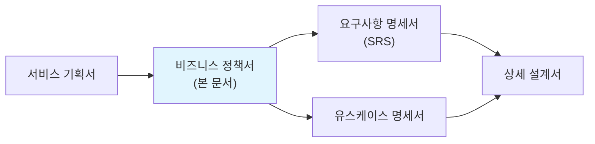
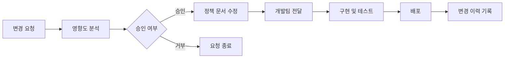

# 비즈니스 정책서 (Business Policy Document)

> 이 문서는 서비스의 비즈니스 동작 규칙을 독립적으로 정의하는 문서이다.
> "이런 상황에서 시스템은 어떻게 동작해야 하는가"를 **목적 / 규칙 / 예시** 구조로 명확히 기술하여, AI(Claude Code 등)가 바이브코딩 시 비즈니스 규칙을 정확히 구현하도록 한다.
> SRS의 기능 요구사항(FR)에 비즈니스 규칙이 흩어져 있으면 누락되기 쉬우므로, 이 문서에서 한곳에 모아 관리한다.

| 항목 | 내용 |
|------|------|
| **프로젝트명** | [placeholder: 프로젝트명] |
| **문서 버전** | [placeholder: v1.0] |
| **작성일** | [placeholder: YYYY-MM-DD] |
| **작성자** | [placeholder: 작성자명 / 역할] |
| **승인자** | [placeholder: 승인자명 / 역할] |
| **문서 상태** | [placeholder: 초안 / 검토중 / 승인됨] |

---

## 변경 이력

| 버전 | 날짜 | 작성자 | 변경 내용 |
|------|------|--------|-----------|
| v0.1 | [placeholder: YYYY-MM-DD] | [placeholder] | 초안 작성 |
| v0.2 | [placeholder: YYYY-MM-DD] | [placeholder] | [placeholder: 변경 내용 요약] |
| v1.0 | [placeholder: YYYY-MM-DD] | [placeholder] | 최종 승인 |

---

## 목차

1. [문서 개요](#1-문서-개요)
2. [정책 목록 및 요약](#2-정책-목록-및-요약)
3. [인증/권한 정책](#3-인증권한-정책)
4. [과금/결제 정책](#4-과금결제-정책)
5. [콘텐츠 접근/해금 정책](#5-콘텐츠-접근해금-정책)
6. [알림/푸시 정책](#6-알림푸시-정책)
7. [데이터 리셋/날짜 변경 정책](#7-데이터-리셋날짜-변경-정책)
8. [오프라인/에러 처리 정책](#8-오프라인에러-처리-정책)
9. [통계/카운팅 정책](#9-통계카운팅-정책)
10. [광고 정책](#10-광고-정책)
11. [추가 정책 템플릿](#11-추가-정책-템플릿)
12. [MVP 정책 적용 범위](#12-mvp-정책-적용-범위)
13. [정책 변경 관리](#13-정책-변경-관리)

---

## 1. 문서 개요

### 1.1 목적

이 문서는 **[placeholder: 프로젝트명]** 서비스의 비즈니스 동작 규칙을 한곳에 모아 정의한다.

**이 문서가 필요한 이유:**

- SRS에 비즈니스 규칙이 기능별로 흩어져 있으면, AI 코딩 도구가 규칙을 누락하거나 잘못 해석하기 쉽다
- 비즈니스 규칙을 독립 문서로 관리하면 기획/개발/QA 모두 동일한 규칙을 참조할 수 있다
- "목적 / 규칙 / 예시" 구조는 AI가 가장 명확하게 이해하고 구현할 수 있는 형식이다

**이 문서의 대상 독자:**

| 독자 | 활용 방법 |
|------|-----------|
| AI 코딩 도구 (Claude Code 등) | 구현 시 비즈니스 규칙 참조. 예시의 "상황 -> 결과"를 테스트 케이스로 활용 |
| 개발팀 | 비즈니스 로직 구현의 기준 문서 |
| QA팀 | 테스트 케이스 도출의 기반. 예시를 경계값 테스트에 활용 |
| 기획팀 | 비즈니스 규칙 변경 관리의 단일 소스 |

### 1.2 정책 작성 가이드

> **모든 정책은 반드시 아래 4가지 요소를 포함해야 한다.**

| 요소 | 설명 | 작성 팁 |
|------|------|---------|
| **목적** | 이 정책이 존재하는 이유 | "왜 이 규칙이 필요한가"를 1~2문장으로 |
| **규칙** | 구체적인 동작 규칙 | 조건절 + 결과를 명확히. 모호한 표현("적절히", "필요 시") 금지 |
| **예시** | "상황 -> 결과" 형태의 구체적 시나리오 | 정상 케이스 + 경계 케이스 + 에러 케이스를 포함 |
| **변경이력** | 이 정책의 변경 기록 | 13장 통합 테이블에 기록. 정책별로도 주요 변경 기록 |

**좋은 규칙 vs 나쁜 규칙:**

| 구분 | 나쁜 예 | 좋은 예 |
|------|---------|---------|
| 모호한 표현 | "적절한 시간 후에 세션을 만료한다" | "마지막 활동으로부터 30분 경과 시 세션을 만료한다" |
| 조건 누락 | "결제를 환불한다" | "결제 후 7일 이내이고 서비스를 사용하지 않은 경우에만 전액 환불한다" |
| 경계값 누락 | "무료 사용자는 제한된 기능을 사용한다" | "무료 사용자는 일일 API 호출 100회, 저장 용량 500MB로 제한한다" |

**예시 작성 형식:**

```
상황: [구체적 상황 설명]
결과: [시스템의 동작]
```

### 1.3 관련 문서

| 문서명 | 관계 |
|--------|------|
| 서비스 기획서 | 본 문서의 상위 문서. 서비스 컨셉, MVP 스코프 정의 |
| 요구사항 명세서 (SRS) | 본 문서의 정책이 SRS의 기능 요구사항(FR)에서 참조됨 (BR-xxx) |
| 유스케이스 명세서 | 각 유스케이스의 "비즈니스 규칙" 항목이 본 문서를 참조 |



---

## 2. 정책 목록 및 요약

> 전체 정책의 인덱스 테이블이다. 각 정책의 상세 내용은 해당 섹션을 참조한다.
> 프로젝트에 해당하지 않는 정책 카테고리는 행을 삭제한다.

| 정책 ID | 정책 카테고리 | 핵심 규칙 요약 | MVP 적용 | 섹션 |
|---------|-------------|---------------|----------|------|
| BP-AUTH | 인증/권한 정책 | [placeholder: 핵심 규칙 1줄 요약] | Y | [3장](#3-인증권한-정책) |
| BP-PAY | 과금/결제 정책 | [placeholder: 핵심 규칙 1줄 요약] | [Y/N] | [4장](#4-과금결제-정책) |
| BP-CONTENT | 콘텐츠 접근/해금 정책 | [placeholder: 핵심 규칙 1줄 요약] | [Y/N] | [5장](#5-콘텐츠-접근해금-정책) |
| BP-NOTI | 알림/푸시 정책 | [placeholder: 핵심 규칙 1줄 요약] | [Y/N] | [6장](#6-알림푸시-정책) |
| BP-RESET | 데이터 리셋/날짜 변경 정책 | [placeholder: 핵심 규칙 1줄 요약] | [Y/N] | [7장](#7-데이터-리셋날짜-변경-정책) |
| BP-ERROR | 오프라인/에러 처리 정책 | [placeholder: 핵심 규칙 1줄 요약] | [Y/N] | [8장](#8-오프라인에러-처리-정책) |
| BP-STAT | 통계/카운팅 정책 | [placeholder: 핵심 규칙 1줄 요약] | [Y/N] | [9장](#9-통계카운팅-정책) |
| BP-AD | 광고 정책 | [placeholder: 핵심 규칙 1줄 요약] | [Y/N] | [10장](#10-광고-정책) |

> **프로젝트에 해당하지 않는 정책은 해당 행과 섹션을 삭제한다.** 모든 정책이 모든 서비스에 필요한 것은 아니다.

---

## 3. 인증/권한 정책

> 사용자 인증, 세션 관리, 역할별 접근 권한에 관한 정책이다.
> 해당하지 않으면 이 섹션을 삭제한다.

### 3.1 목적

사용자의 신원을 확인하고, 역할에 따라 적절한 기능과 데이터에만 접근할 수 있도록 한다. 보안 위협으로부터 사용자 계정과 데이터를 보호한다.

### 3.2 규칙

#### BP-AUTH-001: 회원 가입

| 규칙 ID | 규칙 | 비고 |
|---------|------|------|
| AUTH-001-1 | 이메일은 고유해야 한다. 이미 등록된 이메일로 가입 시도 시 "이미 등록된 이메일입니다" 메시지를 표시한다 | |
| AUTH-001-2 | 비밀번호는 최소 [placeholder: 8]자 이상이며, [placeholder: 영문 대소문자 + 숫자 + 특수문자] 조합을 요구한다 | |
| AUTH-001-3 | [placeholder: 이메일 인증이 완료되어야 서비스 이용이 가능하다 / 이메일 인증 없이 바로 이용 가능하다] | MVP 결정 필요 |
| AUTH-001-4 | [placeholder: 소셜 로그인(Google, Apple, Kakao 등) 지원 여부와 범위] | |

#### BP-AUTH-002: 로그인 / 세션 관리

| 규칙 ID | 규칙 | 비고 |
|---------|------|------|
| AUTH-002-1 | 로그인 연속 실패 [placeholder: 5]회 시 계정을 [placeholder: 30]분간 잠금한다 | |
| AUTH-002-2 | Access Token 유효 기간은 [placeholder: 15]분, Refresh Token 유효 기간은 [placeholder: 7]일이다 | |
| AUTH-002-3 | 마지막 활동으로부터 [placeholder: 30]분 경과 시 세션을 만료한다 | |
| AUTH-002-4 | 동시 로그인은 [placeholder: 허용 / 최대 N개 기기 / 불허(기존 세션 만료)] | |
| AUTH-002-5 | 비밀번호 재설정 링크의 유효 기간은 [placeholder: 24]시간이다 | |

#### BP-AUTH-003: 역할 및 권한

| 역할 | 설명 | 주요 권한 | 비고 |
|------|------|-----------|------|
| [placeholder: 일반 사용자 (USER)] | [설명] | [placeholder: 자신의 데이터 CRUD, 서비스 기본 기능 사용] | 기본 역할 |
| [placeholder: 관리자 (ADMIN)] | [설명] | [placeholder: 전체 사용자/데이터 관리, 시스템 설정] | |
| [placeholder: 추가 역할] | [설명] | [placeholder: 권한 범위] | 해당 시 추가 |

### 3.3 예시

**정상 케이스:**

```
상황: 사용자가 올바른 이메일과 비밀번호로 로그인한다
결과: Access Token(15분)과 Refresh Token(7일)이 발급되고, 대시보드로 이동한다
```

```
상황: Access Token이 만료된 상태에서 API를 호출한다
결과: 401 응답을 받고, 클라이언트가 자동으로 Refresh Token으로 새 Access Token을 발급받아 재요청한다
```

**경계 케이스:**

```
상황: 사용자가 4회 로그인에 실패한 후 5번째 시도에서 올바른 비밀번호를 입력한다
결과: 로그인 성공. 실패 카운트가 초기화된다
```

```
상황: 사용자가 5회 연속 로그인에 실패한다
결과: 계정이 30분간 잠금된다. 잠금 기간 중에는 올바른 비밀번호를 입력해도 로그인할 수 없다.
      "계정이 잠겼습니다. 30분 후에 다시 시도하거나 비밀번호를 재설정해주세요." 메시지를 표시한다
```

**에러 케이스:**

```
상황: Refresh Token도 만료된 상태에서 API를 호출한다
결과: 401 응답과 함께 로그인 페이지로 리다이렉트한다. 사용자에게 "세션이 만료되었습니다. 다시 로그인해주세요." 메시지를 표시한다
```

### 3.4 변경이력

| 날짜 | 규칙 ID | 변경 내용 | 변경 사유 |
|------|---------|-----------|-----------|
| [placeholder] | AUTH-002-1 | [placeholder: 변경 전 -> 변경 후] | [placeholder: 사유] |

---

## 4. 과금/결제 정책

> 무료/유료 경계, 결제 처리, 환불, 구독 관리에 관한 정책이다.
> 해당하지 않으면 이 섹션을 삭제한다.

### 4.1 목적

서비스의 유료 기능 사용에 대한 과금 규칙을 정의하고, 결제/환불 프로세스를 명확히 하여 사용자 불만과 분쟁을 예방한다.

### 4.2 규칙

#### BP-PAY-001: 무료/유료 경계

| 규칙 ID | 규칙 | 비고 |
|---------|------|------|
| PAY-001-1 | 무료 사용자에게 제공되는 기능: [placeholder: 무료 기능 목록 또는 제한 사항] | |
| PAY-001-2 | 유료 전용 기능: [placeholder: 유료 기능 목록] | |
| PAY-001-3 | 무료 사용량 제한: [placeholder: 일일 N회 / 월 N건 / 용량 NMB 등] | |
| PAY-001-4 | 무료 한도 초과 시 동작: [placeholder: 기능 차단 / 경고 후 차단 / 자동 과금 등] | |

#### BP-PAY-002: 결제 처리

| 규칙 ID | 규칙 | 비고 |
|---------|------|------|
| PAY-002-1 | 지원 결제 수단: [placeholder: 신용카드 / 계좌이체 / 간편결제(카카오페이, 네이버페이) 등] | |
| PAY-002-2 | 결제 실패 시 재시도: [placeholder: 자동 재시도 N회 / 수동 재결제 안내] | |
| PAY-002-3 | 결제 확인 대기 시간: [placeholder: N초간 결제 완료 응답을 대기. 초과 시 "결제 확인 중" 상태로 전환] | |
| PAY-002-4 | 이중 결제 방지: [placeholder: 동일 주문에 대해 N초 이내 중복 결제 요청 차단] | |

#### BP-PAY-003: 환불 정책

| 규칙 ID | 규칙 | 비고 |
|---------|------|------|
| PAY-003-1 | 환불 가능 기간: 결제 후 [placeholder: 7]일 이내 | |
| PAY-003-2 | 환불 가능 조건: [placeholder: 서비스를 사용하지 않은 경우에만 전액 환불 / 사용 비율에 따른 부분 환불 등] | |
| PAY-003-3 | 환불 처리 기간: 환불 승인 후 [placeholder: 3~5]영업일 이내 원 결제 수단으로 환불 | |
| PAY-003-4 | 환불 불가 사유: [placeholder: 환불 불가 조건 나열] | |

#### BP-PAY-004: 구독 관리 (구독 모델인 경우)

| 규칙 ID | 규칙 | 비고 |
|---------|------|------|
| PAY-004-1 | 구독 갱신: [placeholder: 만료일 N일 전 자동 갱신 / 수동 갱신] | |
| PAY-004-2 | 갱신 실패 시: [placeholder: N일간 유예 기간(Grace Period) 제공 후 무료 등급으로 전환] | |
| PAY-004-3 | 구독 해지: [placeholder: 즉시 해지 / 잔여 기간까지 사용 가능] | |
| PAY-004-4 | 등급 변경: [placeholder: 업그레이드 즉시 적용, 차액 결제 / 다운그레이드 다음 결제 주기부터 적용] | |

### 4.3 예시

**정상 케이스:**

```
상황: 무료 사용자가 유료 구독(월간)을 결제한다
결과: 결제 완료 즉시 유료 기능이 활성화된다. 다음 결제일은 30일 후로 설정된다
```

```
상황: 월간 구독 사용자가 연간 구독으로 업그레이드한다
결과: 월간 구독의 잔여 기간을 일할 계산하여 연간 구독 가격에서 차감한 금액을 결제한다.
      유료 기능은 중단 없이 유지된다
```

**경계 케이스:**

```
상황: 구독 자동 갱신일에 결제가 실패한다
결과: 3일간의 유예 기간을 제공한다. 유예 기간 중 매일 1회 자동 재시도한다.
      유예 기간 중에는 유료 기능을 계속 사용할 수 있다.
      3일 후에도 결제 실패 시 무료 등급으로 전환하고, 이메일로 안내한다
```

```
상황: 사용자가 결제 후 6일차에 환불을 요청한다. 유료 기능을 3회 사용했다
결과: [placeholder: 전액 환불 / 사용 횟수에 따른 부분 환불 / 환불 불가 - 프로젝트 정책에 따라 결정]
```

**에러 케이스:**

```
상황: 결제 요청 후 PG사 응답이 30초간 없다
결과: "결제 확인 중" 상태로 전환한다. 사용자에게 "결제 처리 중입니다. 잠시 후 확인해주세요." 메시지를 표시한다.
      백그라운드에서 PG사에 결제 상태를 조회하여 최종 결과를 반영한다.
      결제 버튼을 비활성화하여 이중 결제를 방지한다
```

### 4.4 변경이력

| 날짜 | 규칙 ID | 변경 내용 | 변경 사유 |
|------|---------|-----------|-----------|
| [placeholder] | [placeholder] | [placeholder] | [placeholder] |

---

## 5. 콘텐츠 접근/해금 정책

> 콘텐츠의 접근 권한, 해금 조건, 공개 범위에 관한 정책이다.
> 콘텐츠 기반 서비스에 해당한다. 해당하지 않으면 이 섹션을 삭제한다.

### 5.1 목적

사용자 등급, 과금 상태, 진행 상황에 따라 콘텐츠 접근 권한을 관리하고, 해금 조건을 명확히 정의한다.

### 5.2 규칙

#### BP-CONTENT-001: 콘텐츠 접근 등급

| 규칙 ID | 규칙 | 비고 |
|---------|------|------|
| CONTENT-001-1 | 콘텐츠 접근 등급: [placeholder: 무료 공개 / 회원 전용 / 유료 전용 / 해금 필요] | |
| CONTENT-001-2 | 무료 공개 콘텐츠 범위: [placeholder: 전체의 N% / 특정 카테고리 / 미리보기 N건] | |
| CONTENT-001-3 | 잠금 콘텐츠 표시 방식: [placeholder: 잠금 아이콘 + 해금 조건 안내 / 목록에서 숨김 / 흐린 표시] | |

#### BP-CONTENT-002: 해금 조건 (해당 시)

| 규칙 ID | 규칙 | 비고 |
|---------|------|------|
| CONTENT-002-1 | 해금 방식: [placeholder: 레벨 달성 / 과금 / 미션 완료 / 시간 경과 등] | |
| CONTENT-002-2 | 해금된 콘텐츠 영구 보존 여부: [placeholder: 한번 해금하면 영구 접근 / 기간 제한] | |
| CONTENT-002-3 | 해금 순서: [placeholder: 순차적 해금만 가능 / 자유 선택 가능] | |

### 5.3 예시

```
상황: 무료 사용자가 유료 전용 콘텐츠에 접근한다
결과: 콘텐츠 미리보기(제목, 첫 2줄)를 표시하고, "이 콘텐츠는 유료 회원 전용입니다. 구독하기" 안내를 표시한다
```

```
상황: 유료 구독을 해지한 사용자가 이전에 해금한 콘텐츠에 접근한다
결과: [placeholder: 계속 접근 가능 / 접근 차단 - 프로젝트 정책에 따라 결정]
```

### 5.4 변경이력

| 날짜 | 규칙 ID | 변경 내용 | 변경 사유 |
|------|---------|-----------|-----------|
| [placeholder] | [placeholder] | [placeholder] | [placeholder] |

---

## 6. 알림/푸시 정책

> 시스템 알림, 이메일 알림, 푸시 알림의 발송 조건과 빈도에 관한 정책이다.
> 해당하지 않으면 이 섹션을 삭제한다.

### 6.1 목적

사용자에게 필요한 정보를 적시에 전달하되, 과도한 알림으로 인한 피로와 이탈을 방지한다.

### 6.2 규칙

#### BP-NOTI-001: 알림 채널 및 유형

| 알림 유형 | 채널 | 발송 조건 | 사용자 설정 가능 |
|-----------|------|-----------|-----------------|
| [placeholder: 가입 환영] | [이메일] | [회원 가입 완료 시] | N (필수) |
| [placeholder: 비밀번호 재설정] | [이메일] | [재설정 요청 시] | N (필수) |
| [placeholder: 결제 확인] | [이메일 + 인앱] | [결제 완료 시] | N (필수) |
| [placeholder: 새 콘텐츠] | [푸시 + 인앱] | [새 콘텐츠 등록 시] | Y |
| [placeholder: 리마인더] | [푸시] | [N일간 미방문 시] | Y |
| [placeholder: 마케팅] | [이메일 + 푸시] | [마케팅 캠페인] | Y |

#### BP-NOTI-002: 알림 빈도 제한

| 규칙 ID | 규칙 | 비고 |
|---------|------|------|
| NOTI-002-1 | 푸시 알림: 1일 최대 [placeholder: 3]건 | 사용자 피로 방지 |
| NOTI-002-2 | 이메일 알림: 1주 최대 [placeholder: 5]건 (거래 알림 제외) | |
| NOTI-002-3 | 야간 시간대 ([placeholder: 22:00 ~ 08:00]) 푸시 알림 발송 금지 | 법적 요구사항 확인 필요 |
| NOTI-002-4 | 사용자가 알림을 끈 경우 마케팅/선택적 알림을 발송하지 않는다. 필수 알림(결제, 보안)은 예외 | |

#### BP-NOTI-003: 리텐션 알림 (해당 시)

| 규칙 ID | 규칙 | 비고 |
|---------|------|------|
| NOTI-003-1 | [placeholder: N]일간 미방문 시 리마인더 푸시 발송 | |
| NOTI-003-2 | 리마인더 발송 후 [placeholder: N]일간 추가 미방문 시 이메일 발송 | |
| NOTI-003-3 | 리마인더를 [placeholder: N]회 발송한 후에도 미방문이면 발송 중단 | 스팸 방지 |

### 6.3 예시

```
상황: 사용자가 3일간 서비스를 방문하지 않았다
결과: 4일차 오전 10시에 "돌아오세요!" 리마인더 푸시를 발송한다.
      단, 사용자가 알림 설정에서 리마인더를 끈 경우 발송하지 않는다
```

```
상황: 하루 동안 사용자에게 이미 3건의 푸시 알림이 발송된 상태에서 새 콘텐츠가 등록된다
결과: 당일 추가 푸시를 발송하지 않는다. 인앱 알림으로만 표시한다.
      익일에 일일 한도가 리셋되면 발송 대기열에서 처리한다
```

### 6.4 변경이력

| 날짜 | 규칙 ID | 변경 내용 | 변경 사유 |
|------|---------|-----------|-----------|
| [placeholder] | [placeholder] | [placeholder] | [placeholder] |

---

## 7. 데이터 리셋/날짜 변경 정책

> 일일/주간/월간 리셋, 시간대 처리, 데이터 초기화에 관한 정책이다.
> 해당하지 않으면 이 섹션을 삭제한다.

### 7.1 목적

데이터 리셋 시점과 시간대 처리 기준을 명확히 정의하여, 사용자별/지역별 데이터 정합성을 보장한다.

### 7.2 규칙

#### BP-RESET-001: 리셋 기준

| 규칙 ID | 규칙 | 비고 |
|---------|------|------|
| RESET-001-1 | 서비스 기준 시간대: [placeholder: KST (UTC+9) / UTC] | |
| RESET-001-2 | 일일 리셋 시점: [placeholder: 매일 00:00 KST / 서버 시간 기준] | |
| RESET-001-3 | 주간 리셋 시점: [placeholder: 매주 월요일 00:00 KST] | |
| RESET-001-4 | 월간 리셋 시점: [placeholder: 매월 1일 00:00 KST] | |

#### BP-RESET-002: 리셋 대상 데이터

| 대상 데이터 | 리셋 주기 | 리셋 내용 | 비고 |
|------------|-----------|-----------|------|
| [placeholder: 일일 사용량 카운터] | 일일 | 0으로 초기화 | |
| [placeholder: 주간 랭킹] | 주간 | 순위 초기화, 이전 주 아카이브 | |
| [placeholder: 월간 무료 이용 횟수] | 월간 | 0으로 초기화 | |

### 7.3 예시

```
상황: 일일 무료 이용 횟수가 5회인 사용자가 23:59 KST에 3회를 사용한 상태이다
결과: 00:00 KST에 사용 횟수가 0으로 리셋된다. 0시 이후 다시 5회 사용 가능하다
```

```
상황: 해외 사용자가 UTC 기준 15:00에 접속한다 (KST 00:00)
결과: 서비스 기준 시간대(KST)에 따라 일일 리셋이 적용된다. 사용자의 로컬 시간과 무관하게 KST 00:00에 리셋된다
```

### 7.4 변경이력

| 날짜 | 규칙 ID | 변경 내용 | 변경 사유 |
|------|---------|-----------|-----------|
| [placeholder] | [placeholder] | [placeholder] | [placeholder] |

---

## 8. 오프라인/에러 처리 정책

> 네트워크 오류, 서버 장애, 오프라인 상태에서의 서비스 동작에 관한 정책이다.
> 해당하지 않으면 이 섹션을 삭제한다.

### 8.1 목적

네트워크 불안정, 서버 장애 등 비정상 상황에서의 사용자 경험을 보장하고, 데이터 유실을 방지한다.

### 8.2 규칙

#### BP-ERROR-001: 네트워크 오류 처리

| 규칙 ID | 규칙 | 비고 |
|---------|------|------|
| ERROR-001-1 | API 호출 실패 시 자동 재시도: [placeholder: 최대 3회, 1초/2초/4초 간격 (지수 백오프)] | |
| ERROR-001-2 | 재시도 모두 실패 시: [placeholder: 사용자에게 "네트워크 연결을 확인해주세요" 메시지와 수동 재시도 버튼 표시] | |
| ERROR-001-3 | 오프라인 상태 감지 시: [placeholder: 오프라인 배너 표시 / 캐시된 데이터로 읽기 전용 모드 / 기능 전체 차단] | |

#### BP-ERROR-002: 데이터 보존

| 규칙 ID | 규칙 | 비고 |
|---------|------|------|
| ERROR-002-1 | 사용자 입력 도중 네트워크 오류 발생 시: [placeholder: 로컬에 임시 저장 후 연결 복구 시 자동 전송 / 입력 유실 안내] | |
| ERROR-002-2 | 결제 중 네트워크 오류 발생 시: [placeholder: 결제 상태를 "확인 중"으로 표시. 서버에서 결제 결과를 비동기 확인하여 반영] | |

#### BP-ERROR-003: 서버 오류 표시

| HTTP 상태 | 사용자 메시지 | 기술적 동작 |
|-----------|-------------|------------|
| 400 | [placeholder: "입력 정보를 확인해주세요"] | 요청 파라미터 검증 실패. 실패 필드와 사유를 응답에 포함 |
| 401 | [placeholder: "로그인이 필요합니다"] | 로그인 페이지로 리다이렉트 |
| 403 | [placeholder: "접근 권한이 없습니다"] | 현재 페이지에서 안내 메시지 표시 |
| 404 | [placeholder: "요청하신 페이지를 찾을 수 없습니다"] | 404 페이지 표시 + 홈으로 이동 링크 |
| 429 | [placeholder: "요청이 너무 많습니다. 잠시 후 다시 시도해주세요"] | Rate Limit 초과. 재시도 가능 시점 안내 |
| 500 | [placeholder: "일시적인 오류가 발생했습니다"] | 에러 로그 기록 + 모니터링 알림 |
| 503 | [placeholder: "서비스 점검 중입니다"] | 점검 예상 종료 시간 표시 |

### 8.3 예시

```
상황: 사용자가 긴 글을 작성 중에 네트워크가 끊긴다
결과: 작성 중인 내용을 로컬 스토리지에 자동 저장한다. "네트워크 연결이 끊겼습니다. 작성 중인 내용은 자동 저장됩니다." 메시지를 표시한다.
      네트워크가 복구되면 "네트워크가 복구되었습니다. 저장하시겠습니까?" 안내를 표시한다
```

```
상황: 서버에서 500 에러가 연속 3회 발생한다
결과: 사용자에게 "일시적인 오류가 발생했습니다. 잠시 후 다시 시도해주세요." 메시지를 표시한다.
      내부적으로 에러 로그를 기록하고 모니터링 시스템에 알림을 발송한다.
      자동 재시도는 수행하지 않는다 (사용자가 수동으로 재시도)
```

### 8.4 변경이력

| 날짜 | 규칙 ID | 변경 내용 | 변경 사유 |
|------|---------|-----------|-----------|
| [placeholder] | [placeholder] | [placeholder] | [placeholder] |

---

## 9. 통계/카운팅 정책

> 수치 집계, 통계 산출, 카운팅 기준에 관한 정책이다.
> 해당하지 않으면 이 섹션을 삭제한다.

### 9.1 목적

서비스 내 각종 수치(조회수, 참여수, 매출 등)의 집계 기준을 명확히 정의하여 데이터의 일관성과 신뢰성을 보장한다.

### 9.2 규칙

#### BP-STAT-001: 카운팅 기준

| 대상 | 카운팅 기준 | 중복 처리 | 갱신 주기 |
|------|------------|-----------|-----------|
| [placeholder: 조회수] | [placeholder: 페이지 로드 시 1 증가] | [placeholder: 동일 사용자 동일 콘텐츠 24시간 내 중복 미카운트] | 실시간 |
| [placeholder: 좋아요 수] | [placeholder: 좋아요 버튼 클릭 시] | [placeholder: 동일 사용자 중복 불가 (토글)] | 실시간 |
| [placeholder: 활성 사용자 (DAU)] | [placeholder: 1일 내 1회 이상 서비스 접속한 고유 사용자] | [placeholder: 고유 사용자 ID 기준 중복 제거] | 일일 배치 |
| [placeholder: 매출] | [placeholder: 결제 완료 금액 합계] | [placeholder: 환불 건은 차감] | 일일 배치 |

#### BP-STAT-002: 통계 표시 규칙

| 규칙 ID | 규칙 | 비고 |
|---------|------|------|
| STAT-002-1 | 1,000 이상 수치는 약식 표시: [placeholder: 1.2K, 3.5M 형식] | |
| STAT-002-2 | 통계 데이터 지연 허용 범위: [placeholder: 실시간 / 최대 N분 / 최대 N시간] | |
| STAT-002-3 | 0건인 경우 표시: [placeholder: "0" 표시 / "-" 표시 / 해당 요소 숨김] | |

### 9.3 예시

```
상황: 사용자 A가 게시글 X를 오전 10시에 조회하고, 오전 11시에 다시 조회한다
결과: 조회수는 1만 증가한다 (24시간 내 동일 사용자 중복 미카운트)
```

```
상황: 게시글의 조회수가 1,523이다
결과: 목록 화면에서 "1.5K"로 표시한다. 상세 화면에서는 "1,523"으로 정확히 표시한다
```

### 9.4 변경이력

| 날짜 | 규칙 ID | 변경 내용 | 변경 사유 |
|------|---------|-----------|-----------|
| [placeholder] | [placeholder] | [placeholder] | [placeholder] |

---

## 10. 광고 정책

> 광고 표시 위치, 빈도, 유형에 관한 정책이다.
> 광고 수익 모델이 아닌 서비스는 이 섹션을 삭제한다.

### 10.1 목적

광고 수익을 확보하되, 사용자 경험을 과도하게 해치지 않는 균형점을 정의한다.

### 10.2 규칙

#### BP-AD-001: 광고 표시 원칙

| 규칙 ID | 규칙 | 비고 |
|---------|------|------|
| AD-001-1 | 핵심 기능 사용 중에는 광고를 표시하지 않는다: [placeholder: 핵심 기능 목록] | |
| AD-001-2 | 광고 표시 위치: [placeholder: 목록 피드 사이(매 N번째) / 화면 하단 배너 / 전면 광고 등] | |
| AD-001-3 | 전면 광고(인터스티셜) 빈도: [placeholder: 세션 당 최대 N회 / N분 간격] | |
| AD-001-4 | 유료 사용자 광고 정책: [placeholder: 광고 완전 제거 / 일부 제거 / 동일 적용] | |

#### BP-AD-002: 광고 제한

| 규칙 ID | 규칙 | 비고 |
|---------|------|------|
| AD-002-1 | 결제/주문 프로세스 중 광고 표시 금지 | 전환율 보호 |
| AD-002-2 | 에러/장애 페이지에 광고 표시 금지 | 사용자 경험 |
| AD-002-3 | 온보딩/첫 사용 경험 중 광고 표시 금지 | 이탈 방지 |
| AD-002-4 | [placeholder: 추가 광고 금지 영역] | |

### 10.3 예시

```
상황: 사용자가 콘텐츠 목록을 스크롤한다
결과: 5번째, 15번째, 25번째 항목 위치에 네이티브 광고를 표시한다.
      광고에는 "광고" 라벨을 명시한다
```

```
상황: 유료 구독 사용자가 서비스를 사용한다
결과: 모든 광고가 제거된다. 광고 영역은 빈 공간 없이 레이아웃이 조정된다
```

### 10.4 변경이력

| 날짜 | 규칙 ID | 변경 내용 | 변경 사유 |
|------|---------|-----------|-----------|
| [placeholder] | [placeholder] | [placeholder] | [placeholder] |

---

## 11. 추가 정책 템플릿

> 위 카테고리에 포함되지 않는 프로젝트 고유 정책이 필요한 경우, 아래 템플릿을 복사하여 사용한다.

### [N]. [placeholder: 정책명] 정책

#### [N].1 목적

[placeholder: 이 정책이 존재하는 이유를 1~2문장으로 기술한다]

#### [N].2 규칙

| 규칙 ID | 규칙 | 비고 |
|---------|------|------|
| [BP-XXX-001] | [placeholder: 구체적인 규칙. 조건절 + 결과를 명확히] | |
| [BP-XXX-002] | [placeholder: 규칙] | |
| [BP-XXX-003] | [placeholder: 규칙] | |

#### [N].3 예시

**정상 케이스:**

```
상황: [placeholder: 구체적 상황]
결과: [placeholder: 시스템 동작]
```

**경계 케이스:**

```
상황: [placeholder: 경계 상황]
결과: [placeholder: 시스템 동작]
```

**에러 케이스:**

```
상황: [placeholder: 에러 상황]
결과: [placeholder: 시스템 동작]
```

#### [N].4 변경이력

| 날짜 | 규칙 ID | 변경 내용 | 변경 사유 |
|------|---------|-----------|-----------|
| [placeholder] | [placeholder] | [placeholder] | [placeholder] |

---

## 12. MVP 정책 적용 범위

> 서비스 기획서의 MVP 스코프와 연동하여, 각 정책의 MVP 적용 범위를 정의한다.

### 12.1 MVP에서 적용하는 정책

| 정책 ID | 정책명 | MVP 적용 범위 | 간소화 사항 |
|---------|--------|-------------|------------|
| BP-AUTH | 인증/권한 | [placeholder: 전체 적용 / 부분 적용] | [placeholder: 간소화 사항. 예) 소셜 로그인은 v2에서 추가] |
| BP-PAY | 과금/결제 | [placeholder: 적용 범위] | [placeholder: 간소화 사항] |
| BP-ERROR | 오프라인/에러 | [placeholder: 적용 범위] | [placeholder: 간소화 사항] |

### 12.2 MVP에서 제외하는 정책

| 정책 ID | 정책명 | 제외 근거 | 도입 시점 |
|---------|--------|-----------|-----------|
| [placeholder] | [placeholder] | [placeholder: 왜 MVP에서 이 정책을 적용하지 않는가] | [placeholder: v2 / MAU N 달성 시 등] |

### 12.3 MVP 정책 간소화 가이드

> MVP 단계에서는 정책을 완전히 구현하기보다, 핵심 규칙만 적용하고 예외 처리는 간소화할 수 있다.

| 간소화 유형 | 설명 | 예시 |
|------------|------|------|
| 수동 처리로 대체 | 자동화 대신 관리자가 수동으로 처리 | "환불 요청은 관리자에게 이메일로 접수" |
| 단순 규칙 적용 | 복잡한 조건 분기 대신 단일 규칙 적용 | "전액 환불만 지원 (부분 환불은 v2)" |
| 기능 제한 안내 | 미구현 기능에 대한 안내 메시지 표시 | "이 기능은 준비 중입니다" |

---

## 13. 정책 변경 관리

### 13.1 정책 변경 프로세스



### 13.2 정책 변경 시 확인 사항

- [ ] 변경되는 정책의 영향 범위(관련 기능, 화면, API)를 파악했는가
- [ ] 기존 사용자 데이터에 미치는 영향을 분석했는가
- [ ] SRS의 관련 기능 요구사항(BR-xxx)을 함께 업데이트했는가
- [ ] 변경 내용을 개발팀과 QA팀에 전달했는가
- [ ] 변경 이력 테이블에 기록했는가

### 13.3 통합 변경 이력

> 모든 정책의 변경 이력을 시간순으로 관리하는 통합 테이블이다.

| 날짜 | 정책 ID | 규칙 ID | 변경 전 | 변경 후 | 변경 사유 | 승인자 |
|------|---------|---------|---------|---------|-----------|--------|
| [placeholder] | [placeholder] | [placeholder] | [placeholder] | [placeholder] | [placeholder] | [placeholder] |

---

## 부록

### A. 정책 ID 체계

| 접두사 | 의미 | 예시 |
|--------|------|------|
| BP-AUTH | 인증/권한 정책 | BP-AUTH-001 |
| BP-PAY | 과금/결제 정책 | BP-PAY-001 |
| BP-CONTENT | 콘텐츠 접근/해금 정책 | BP-CONTENT-001 |
| BP-NOTI | 알림/푸시 정책 | BP-NOTI-001 |
| BP-RESET | 데이터 리셋/날짜 변경 정책 | BP-RESET-001 |
| BP-ERROR | 오프라인/에러 처리 정책 | BP-ERROR-001 |
| BP-STAT | 통계/카운팅 정책 | BP-STAT-001 |
| BP-AD | 광고 정책 | BP-AD-001 |

### B. 용어 정의

| 용어 | 정의 |
|------|------|
| 비즈니스 정책 | 서비스의 동작 규칙을 정의하는 비즈니스 수준의 규칙 |
| BR (Business Rule) | SRS에서 참조하는 비즈니스 규칙 코드. 본 문서의 규칙 ID와 매핑 |
| Grace Period | 결제 실패 후 서비스를 유지하는 유예 기간 |
| Rate Limit | 단위 시간당 허용되는 최대 요청 횟수 |
| 지수 백오프 | 재시도 간격을 지수적으로 증가시키는 방식 (1초, 2초, 4초, ...) |
| [placeholder] | [placeholder: 프로젝트 고유 용어 추가] |

### C. 승인

| 역할 | 이름 | 서명 | 날짜 |
|------|------|------|------|
| 기획 책임자 | [placeholder] | | [placeholder] |
| 개발 리드 | [placeholder] | | [placeholder] |
| QA 리드 | [placeholder] | | [placeholder] |
