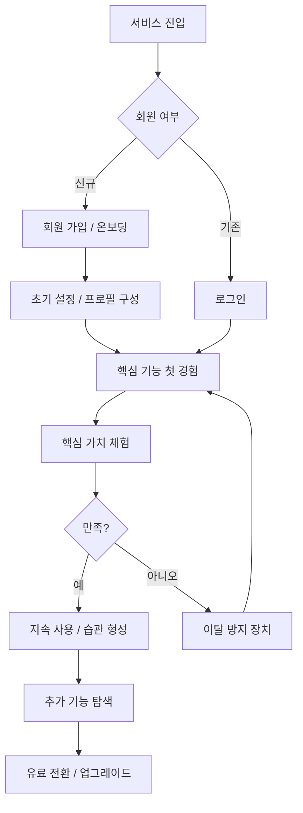
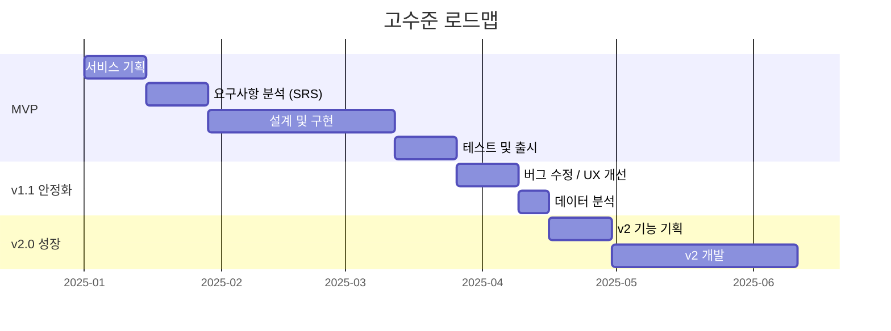
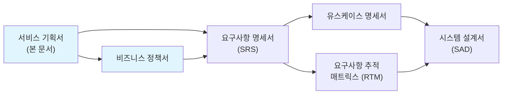

# 서비스 기획서 (Service Planning Document)

> 이 문서는 SRS(요구사항 명세서) 작성 이전에 "왜 이 서비스를 만드는가", "핵심 가치는 무엇인가", "MVP에 무엇을 포함/제외하는가"를 정의하는 선행 기획 문서이다.
> SRS가 "무엇을 만들 것인가(What)"에 집중한다면, 이 문서는 "왜 만드는가(Why)"와 "어디까지 만드는가(Scope)"에 집중한다.

| 항목 | 내용 |
|------|------|
| **프로젝트명** | [placeholder: 프로젝트명] |
| **문서 버전** | [placeholder: v1.0] |
| **작성일** | [placeholder: YYYY-MM-DD] |
| **작성자** | [placeholder: 작성자명 / 역할] |
| **승인자** | [placeholder: 승인자명 / 역할] |
| **문서 상태** | [placeholder: 초안 / 검토중 / 승인됨] |

---

## 변경 이력

| 버전 | 날짜 | 작성자 | 변경 내용 |
|------|------|--------|-----------|
| v0.1 | [placeholder: YYYY-MM-DD] | [placeholder] | 초안 작성 |
| v0.2 | [placeholder: YYYY-MM-DD] | [placeholder] | [placeholder: 변경 내용 요약] |
| v1.0 | [placeholder: YYYY-MM-DD] | [placeholder] | 최종 승인 |

---

## 목차

1. [서비스 개요](#1-서비스-개요)
2. [핵심 메커니즘](#2-핵심-메커니즘)
3. [콘텐츠/기능 전략](#3-콘텐츠기능-전략)
4. [수익화 전략](#4-수익화-전략)
5. [MVP 스코프 정의](#5-mvp-스코프-정의)
6. [KPI 가설 검증 프레임워크](#6-kpi-가설-검증-프레임워크)
7. [다음 단계](#7-다음-단계)
8. [관련 문서](#8-관련-문서)

---

## 1. 서비스 개요

### 1.1 서비스명 및 컨셉

| 항목 | 내용 |
|------|------|
| 서비스명 | [placeholder: 서비스명] |
| 한 줄 설명 | [placeholder: 이 서비스가 무엇인지 한 문장으로 설명] |
| 서비스 유형 | [placeholder: 웹 서비스 / 모바일 앱 / SaaS / 플랫폼 / API 서비스 등] |
| 대상 플랫폼 | [placeholder: Web / iOS / Android / Cross-platform] |

**서비스 컨셉 설명:**

[placeholder: 이 서비스가 해결하려는 문제와 접근 방식을 3~5문장으로 설명한다. "어떤 사용자가 어떤 상황에서 어떤 불편을 겪고 있으며, 이 서비스가 어떤 방식으로 해결하는가"를 명확히 기술한다.]

**배경 및 동기:**

[placeholder: 이 서비스를 기획하게 된 배경을 설명한다. 시장 트렌드, 사용자 조사 결과, 기존 솔루션의 한계, 기술적 기회 등을 포함한다.]

- [placeholder: 배경 1 - 예) 기존 시장에서 X 문제가 해결되지 않고 있다]
- [placeholder: 배경 2 - 예) 사용자 인터뷰 결과 Y에 대한 수요가 확인되었다]
- [placeholder: 배경 3 - 예) 최근 Z 기술의 발전으로 새로운 접근이 가능해졌다]

### 1.2 핵심 가치 제안 (Value Proposition)

> 이 서비스가 사용자에게 제공하는 고유한 가치를 정의한다.

| 항목 | 내용 |
|------|------|
| 핵심 가치 | [placeholder: 사용자가 이 서비스를 통해 얻는 가장 중요한 가치 1문장] |
| 차별점 | [placeholder: 경쟁 서비스 대비 이 서비스만의 차별화 포인트] |
| 대안 대비 우위 | [placeholder: 사용자가 현재 사용하는 대안(엑셀, 수작업, 경쟁 서비스) 대비 어떤 점이 나은가] |

**가치 제안 캔버스:**

| 구분 | 내용 |
|------|------|
| 사용자의 할 일 (Jobs) | [placeholder: 사용자가 달성하려는 목표] |
| 사용자의 고통 (Pains) | [placeholder: 현재 방식에서 겪는 불편/비효율] |
| 사용자의 이득 (Gains) | [placeholder: 이 서비스로 얻게 되는 이점] |
| 고통 해결제 (Pain Relievers) | [placeholder: 고통을 해소하는 구체적 기능/방식] |
| 이득 생성제 (Gain Creators) | [placeholder: 새로운 가치를 만드는 구체적 기능/방식] |

### 1.3 타겟 사용자 정의

#### 1.3.1 주요 사용자 페르소나

**페르소나 1: [placeholder: 페르소나명]**

| 항목 | 내용 |
|------|------|
| 이름 | [placeholder: 가상의 이름] |
| 연령/직업 | [placeholder: 30대 / 직장인] |
| 기술 수준 | [placeholder: 초급 / 중급 / 고급] |
| 핵심 목표 | [placeholder: 이 서비스를 통해 달성하려는 것] |
| 핵심 불편 | [placeholder: 현재 겪고 있는 주요 불편/문제] |
| 사용 시나리오 | [placeholder: 어떤 상황에서 이 서비스를 사용하는가] |
| 성공 기준 | [placeholder: 이 사용자가 "이 서비스가 좋다"고 느끼는 순간] |

**페르소나 2: [placeholder: 페르소나명]**

| 항목 | 내용 |
|------|------|
| 이름 | [placeholder: 가상의 이름] |
| 연령/직업 | [placeholder] |
| 기술 수준 | [placeholder] |
| 핵심 목표 | [placeholder] |
| 핵심 불편 | [placeholder] |
| 사용 시나리오 | [placeholder] |
| 성공 기준 | [placeholder] |

> 필요에 따라 페르소나를 추가한다. 일반적으로 2~4개의 핵심 페르소나를 정의한다.

#### 1.3.2 사용자 세그먼트

| 세그먼트 | 설명 | 규모 추정 | 우선순위 | MVP 포함 |
|----------|------|-----------|----------|----------|
| [placeholder: 세그먼트 A] | [설명] | [placeholder: 규모] | P0 | Y |
| [placeholder: 세그먼트 B] | [설명] | [placeholder: 규모] | P1 | Y |
| [placeholder: 세그먼트 C] | [설명] | [placeholder: 규모] | P2 | N |

#### 1.3.3 비사용자 (Anti-Persona)

> 이 서비스의 타겟이 **아닌** 사용자를 명확히 정의한다. AI가 구현 시 범위를 초과하지 않도록 하는 데 중요하다.

| 비사용자 | 이유 | 대안 |
|----------|------|------|
| [placeholder: 비사용자 유형 1] | [이 서비스가 적합하지 않은 이유] | [대신 사용할 수 있는 서비스/방법] |
| [placeholder: 비사용자 유형 2] | [이유] | [대안] |

---

## 2. 핵심 메커니즘

### 2.1 서비스 작동 원리

> 이 서비스의 핵심 메커니즘을 설명한다. "사용자가 X를 하면 시스템이 Y를 처리하여 Z 결과를 제공한다"는 흐름을 명확히 한다.

**핵심 루프 (Core Loop):**

[placeholder: 사용자가 반복적으로 수행하는 핵심 행동 흐름을 설명한다. 서비스의 가장 기본적인 사용 패턴이다.]

1. [placeholder: 사용자 행동 1 - 예) 사용자가 데이터를 입력한다]
2. [placeholder: 시스템 처리 - 예) 시스템이 데이터를 분석/처리한다]
3. [placeholder: 결과 제공 - 예) 사용자에게 결과/피드백을 제공한다]
4. [placeholder: 반복 동기 - 예) 사용자가 결과를 확인하고 다음 행동을 결정한다]

**이론적 근거 (해당 시):**

[placeholder: 서비스 메커니즘의 이론적 배경이 있다면 기술한다. 예) 행동경제학 원리, 게이미피케이션 이론, 특정 도메인의 전문 지식 등. 해당하지 않으면 이 섹션을 삭제한다.]

### 2.2 전체 서비스 플로우

> 사용자가 서비스를 처음 접하는 순간부터 핵심 가치를 경험하기까지의 전체 흐름을 시각화한다.

> 위 다이어그램은 범용 예시이다. 프로젝트의 실제 흐름에 맞게 수정한다.

### 2.3 핵심 사용자 여정 (Key User Journey)

> 가장 중요한 사용자 여정 1~3개를 정의한다.

#### 여정 1: [placeholder: 여정명 - 예) 첫 사용 경험]

| 단계 | 사용자 행동 | 시스템 반응 | 감정 목표 | 핵심 지표 |
|------|------------|------------|-----------|-----------|
| 1. 진입 | [placeholder: 서비스 접속] | [placeholder: 랜딩 페이지 표시] | 호기심 | 방문율 |
| 2. 탐색 | [placeholder: 주요 기능 탐색] | [placeholder: 가이드/튜토리얼 제공] | 이해 | 온보딩 완료율 |
| 3. 행동 | [placeholder: 핵심 기능 최초 사용] | [placeholder: 결과/피드백 제공] | 성취감 | 핵심 기능 사용율 |
| 4. 가치 인식 | [placeholder: 결과 확인] | [placeholder: 가치 요약 표시] | 만족 | 재방문율 |
| 5. 재방문 | [placeholder: 다음 날 재접속] | [placeholder: 변화/업데이트 표시] | 기대감 | D1 Retention |

#### 여정 2: [placeholder: 여정명 - 예) 핵심 기능 반복 사용]

| 단계 | 사용자 행동 | 시스템 반응 | 감정 목표 | 핵심 지표 |
|------|------------|------------|-----------|-----------|
| 1 | [placeholder] | [placeholder] | [placeholder] | [placeholder] |
| 2 | [placeholder] | [placeholder] | [placeholder] | [placeholder] |
| 3 | [placeholder] | [placeholder] | [placeholder] | [placeholder] |

---

## 3. 콘텐츠/기능 전략

> 이 섹션은 서비스의 성격에 따라 선택적으로 작성한다. 콘텐츠 중심 서비스, 게이미피케이션 요소가 있는 서비스, 또는 특정 기능 전략이 필요한 경우에 작성한다. 해당하지 않으면 이 섹션을 삭제한다.

### 3.1 핵심 기능 방향

> 서비스의 주요 기능 영역과 각 영역의 전략적 방향을 정의한다.

| 기능 영역 | 전략 방향 | 우선순위 | MVP 포함 | 비고 |
|-----------|-----------|----------|----------|------|
| [placeholder: 기능 영역 1] | [전략 방향 설명] | P0 | Y | [비고] |
| [placeholder: 기능 영역 2] | [전략 방향 설명] | P0 | Y | [비고] |
| [placeholder: 기능 영역 3] | [전략 방향 설명] | P1 | Y | [비고] |
| [placeholder: 기능 영역 4] | [전략 방향 설명] | P2 | N | v2에서 추가 |

**기능 방향 의사결정 기록:**

> 주요 기능에 대해 A/B안 비교가 필요한 경우 아래 형식으로 기록한다.

| 항목 | A안 | B안 | 선택 | 근거 |
|------|-----|-----|------|------|
| [placeholder: 의사결정 항목] | [A안 설명] | [B안 설명] | [A/B] | [선택 근거] |

### 3.2 보상/게이미피케이션 체계 (해당 시)

> 게이미피케이션 요소가 있는 서비스인 경우 작성한다. 해당하지 않으면 이 하위 섹션을 삭제한다.

#### 3.2.1 진행 시스템

| 요소 | 설명 | 목적 | MVP 포함 |
|------|------|------|----------|
| [placeholder: 레벨/등급] | [설명] | [목적: 지속 사용 동기] | [Y/N] |
| [placeholder: 경험치/포인트] | [설명] | [목적: 행동 보상] | [Y/N] |
| [placeholder: 배지/업적] | [설명] | [목적: 성취감] | [Y/N] |

#### 3.2.2 보상 구조

| 보상 유형 | 획득 조건 | 보상 내용 | 빈도 |
|-----------|-----------|-----------|------|
| [placeholder: 일일 보상] | [조건] | [보상] | 매일 |
| [placeholder: 마일스톤 보상] | [조건] | [보상] | 달성 시 |
| [placeholder: 이벤트 보상] | [조건] | [보상] | 비정기 |

### 3.3 콘텐츠 전략 (해당 시)

> 콘텐츠 중심 서비스인 경우 작성한다. 해당하지 않으면 이 하위 섹션을 삭제한다.

| 항목 | 내용 |
|------|------|
| 콘텐츠 유형 | [placeholder: 텍스트 / 이미지 / 영상 / 오디오 / 혼합] |
| 콘텐츠 생산 방식 | [placeholder: 사용자 생성(UGC) / 전문가 생산 / AI 생성 / 혼합] |
| 콘텐츠 큐레이션 | [placeholder: 추천 알고리즘 / 수동 큐레이션 / 카테고리 기반] |
| 콘텐츠 갱신 주기 | [placeholder: 실시간 / 일일 / 주간 / 비정기] |
| 품질 관리 | [placeholder: 리뷰 프로세스 / 자동 필터링 / 신고 시스템] |

### 3.4 브랜드/톤앤매너 (해당 시)

> 서비스가 특정 브랜드 아이덴티티나 캐릭터를 활용하는 경우 작성한다. 해당하지 않으면 이 하위 섹션을 삭제한다.

| 항목 | 내용 |
|------|------|
| 브랜드 톤 | [placeholder: 친근한 / 전문적 / 유머러스 / 격식체 등] |
| 커뮤니케이션 스타일 | [placeholder: 반말 / 존댓말 / 이모지 사용 여부 등] |
| 시각적 아이덴티티 | [placeholder: 주요 컬러, 분위기, 디자인 방향] |
| 캐릭터/마스코트 | [placeholder: 사용 여부 및 역할. 해당 없으면 "없음"] |

---

## 4. 수익화 전략

### 4.1 수익 모델 선택

| 항목 | 내용 |
|------|------|
| 주요 수익 모델 | [placeholder: 광고 / 구독(SaaS) / 프리미엄(Freemium) / 거래 수수료 / 라이선스 / 일회성 구매] |
| 보조 수익 모델 | [placeholder: 보조 수익원이 있는 경우. 없으면 "없음"] |
| 무료/유료 경계 | [placeholder: 무료 사용자에게 제공되는 것과 유료 사용자에게 제공되는 것의 경계를 명확히 기술] |
| 가격 전략 | [placeholder: 가격대, 과금 단위(월/연/건), 할인 정책] |

#### 수익 모델 비교 (의사결정이 필요한 경우)

| 기준 | 모델 A: [placeholder] | 모델 B: [placeholder] | 모델 C: [placeholder] |
|------|----------------------|----------------------|----------------------|
| 사용자 경험 영향 | [설명] | [설명] | [설명] |
| 예상 수익 | [추정] | [추정] | [추정] |
| 구현 복잡도 | [높음/중간/낮음] | [높음/중간/낮음] | [높음/중간/낮음] |
| MVP 적합성 | [Y/N] | [Y/N] | [Y/N] |
| **선택** | | **[선택됨]** | |

**선택 근거:** [placeholder: 선택한 수익 모델의 근거를 기술]

### 4.2 단계별 수익화 계획

> 수익화는 일반적으로 PMF(Product-Market Fit) 달성 이후에 본격화한다. 단계별 수익화 전략을 정의한다.

| 단계 | 시점 / 조건 | 수익화 방식 | 목표 |
|------|------------|------------|------|
| Phase 0: PMF 검증 | [placeholder: 조건 - 예) MAU 1,000 달성 전] | 없음 (완전 무료) | 사용자 확보 및 핵심 가치 검증 |
| Phase 1: 초기 수익화 | [placeholder: 조건 - 예) MAU 1,000+ & D7 Retention 40%+] | [placeholder: 초기 수익 모델] | [placeholder: 초기 목표] |
| Phase 2: 수익 최적화 | [placeholder: 조건 - 예) 월 수익 N원 달성 후] | [placeholder: 확장된 수익 모델] | [placeholder: 최적화 목표] |
| Phase 3: 수익 다각화 | [placeholder: 조건] | [placeholder: 추가 수익원] | [placeholder: 다각화 목표] |

### 4.3 과금 정책 요약

> 상세한 과금 규칙은 **비즈니스정책서**에서 정의한다. 여기서는 방향만 기술한다.

| 항목 | 정책 방향 |
|------|-----------|
| 무료 체험 | [placeholder: 제공 여부, 기간, 제한 사항] |
| 환불 정책 | [placeholder: 기본 환불 정책 방향] |
| 구독 갱신 | [placeholder: 자동 갱신 여부, 해지 정책 방향] |
| 결제 수단 | [placeholder: 지원 예정 결제 수단] |

---

## 5. MVP 스코프 정의

> **이 섹션은 본 문서의 핵심이다.**
> AI(Claude Code 등)가 바이브코딩으로 구현할 때 "어디까지 만들 것인가"를 명확히 하는 것이 가장 중요하다.
> "만들 것"보다 **"안 만들 것 + 왜 안 만드는가"**를 명확히 정의하는 것이 범위 초과를 방지하는 핵심이다.

### 5.1 MVP 정의 기준

| 항목 | 내용 |
|------|------|
| MVP 목표 | [placeholder: MVP로 검증하려는 핵심 가설 1문장] |
| MVP 기간 | [placeholder: 개발 기간 목표] |
| MVP 성공 기준 | [placeholder: MVP가 성공했다고 판단하는 정량적 기준] |
| MVP 실패 시 대응 | [placeholder: MVP 결과가 기대에 미치지 못할 때의 대응 방향] |

### 5.2 포함 항목 (In-Scope)

> 우선순위 정의:
> - **P0 (Must Have):** MVP에 반드시 포함. 이것 없이는 서비스가 성립하지 않음
> - **P1 (Should Have):** MVP에 포함 권장. 핵심 경험을 위해 필요하지만 최소 기능은 아님
> - **P2 (Nice to Have):** MVP에서 시간이 허용되면 포함. 없어도 핵심 가치 검증 가능

| ID | 기능/항목 | 설명 | 우선순위 | 예상 공수 | 비고 |
|----|-----------|------|----------|-----------|------|
| MVP-001 | [placeholder: 기능명] | [placeholder: 기능 설명] | P0 | [placeholder: N일] | 핵심 기능 |
| MVP-002 | [placeholder: 기능명] | [placeholder: 기능 설명] | P0 | [placeholder: N일] | 핵심 기능 |
| MVP-003 | [placeholder: 기능명] | [placeholder: 기능 설명] | P0 | [placeholder: N일] | |
| MVP-004 | [placeholder: 기능명] | [placeholder: 기능 설명] | P1 | [placeholder: N일] | |
| MVP-005 | [placeholder: 기능명] | [placeholder: 기능 설명] | P1 | [placeholder: N일] | |
| MVP-006 | [placeholder: 기능명] | [placeholder: 기능 설명] | P2 | [placeholder: N일] | 시간 허용 시 |
| MVP-007 | [placeholder: 기능명] | [placeholder: 기능 설명] | P2 | [placeholder: N일] | 시간 허용 시 |

### 5.3 제외 항목 (Out-of-Scope) + 제외 근거

> **이 테이블이 본 문서에서 가장 중요한 부분이다.**
> "안 만드는 것"과 "왜 안 만드는가"를 명확히 기록해야 AI가 범위를 초과하지 않는다.
> 또한 "언제 다시 만들 수 있는가(v2 진입 조건)"를 정의하여 로드맵과 연결한다.

| ID | 제외 항목 | 제외 근거 | 대안 (MVP에서는 대신 무엇을 하는가) | v2 진입 조건 |
|----|-----------|-----------|--------------------------------------|-------------|
| EX-001 | [placeholder: 제외 기능 1] | [placeholder: 왜 MVP에서 제외하는가] | [placeholder: MVP에서 이 기능 대신 사용하는 방법] | [placeholder: 이 기능을 도입하는 조건] |
| EX-002 | [placeholder: 제외 기능 2] | [placeholder: 제외 근거] | [placeholder: 대안] | [placeholder: 진입 조건] |
| EX-003 | [placeholder: 제외 기능 3] | [placeholder: 제외 근거] | [placeholder: 대안] | [placeholder: 진입 조건] |
| EX-004 | [placeholder: 제외 기능 4] | [placeholder: 제외 근거] | [placeholder: 대안] | [placeholder: 진입 조건] |
| EX-005 | [placeholder: 제외 기능 5] | [placeholder: 제외 근거] | [placeholder: 대안] | [placeholder: 진입 조건] |

**제외 항목 작성 가이드:**

| 구분 | 설명 | 예시 |
|------|------|------|
| 제외 근거 | 왜 지금 만들지 않는가 | "PMF 미검증 상태에서 과도한 투자", "핵심 가설 검증에 불필요", "기술적 복잡도 대비 가치 불확실" |
| 대안 | MVP에서 이 기능 없이 어떻게 대체하는가 | "관리자가 수동으로 처리", "단순화된 버전으로 제공", "외부 도구로 대체" |
| v2 진입 조건 | 이 기능을 다시 만들기 시작하는 트리거 | "MAU 5,000 달성 시", "사용자 요청 50건 이상 시", "수동 처리 비용이 월 X원 초과 시" |

### 5.4 MVP 기능 범위 다이어그램

```mermaid
flowchart LR
    subgraph MVP["MVP (v1.0)"]
        direction TB
        F1["[placeholder: P0 기능 1]"]
        F2["[placeholder: P0 기능 2]"]
        F3["[placeholder: P0 기능 3]"]
        F4["[placeholder: P1 기능 1]"]
        F5["[placeholder: P1 기능 2]"]
    end

    subgraph V2["v2.0 (조건 충족 시)"]
        direction TB
        F6["[placeholder: v2 기능 1]"]
        F7["[placeholder: v2 기능 2]"]
        F8["[placeholder: v2 기능 3]"]
    end

    subgraph FUTURE["장기 로드맵"]
        direction TB
        F9["[placeholder: 장기 기능 1]"]
        F10["[placeholder: 장기 기능 2]"]
    end

    MVP --> V2
    V2 --> FUTURE
```

### 5.5 기술적 MVP 결정사항 (해당 시)

> 기술적 선택도 MVP 범위에 영향을 미친다. 주요 기술 결정을 기록한다.

| 결정 항목 | MVP 선택 | 근거 | v2에서 전환 가능 |
|-----------|----------|------|------------------|
| [placeholder: 인프라] | [placeholder: 선택한 기술] | [placeholder: 근거] | [Y/N] |
| [placeholder: 프론트엔드] | [placeholder: 선택한 기술] | [placeholder: 근거] | [Y/N] |
| [placeholder: 백엔드] | [placeholder: 선택한 기술] | [placeholder: 근거] | [Y/N] |
| [placeholder: 데이터베이스] | [placeholder: 선택한 기술] | [placeholder: 근거] | [Y/N] |

---

## 6. KPI 가설 검증 프레임워크

> 서비스 기획의 핵심은 "가설"이다. 가설을 세우고, 검증하고, 결과에 따라 방향을 결정하는 프레임워크를 정의한다.

### 6.1 검증할 가설 목록

> 각 가설은 "만약 X하면 Y가 발생할 것이다"의 형태로 기술한다.

| ID | 가설 | 검증 방법 | 성공 기준 | 실패 시 대응 | 우선순위 |
|----|------|-----------|-----------|-------------|----------|
| H-001 | [placeholder: "만약 [조건]이면 [결과]일 것이다"] | [placeholder: 검증 방법] | [placeholder: 정량적 성공 기준] | [placeholder: 실패 시 대응] | P0 |
| H-002 | [placeholder: 가설] | [placeholder: 검증 방법] | [placeholder: 성공 기준] | [placeholder: 실패 시 대응] | P0 |
| H-003 | [placeholder: 가설] | [placeholder: 검증 방법] | [placeholder: 성공 기준] | [placeholder: 실패 시 대응] | P1 |
| H-004 | [placeholder: 가설] | [placeholder: 검증 방법] | [placeholder: 성공 기준] | [placeholder: 실패 시 대응] | P1 |

**가설 작성 가이드:**

| 좋은 가설 | 나쁜 가설 |
|-----------|-----------|
| "첫 사용에서 핵심 기능을 경험한 사용자의 D7 Retention이 40% 이상일 것이다" | "사용자들이 우리 서비스를 좋아할 것이다" |
| "무료 사용자 중 5%가 유료 전환할 것이다" | "수익이 발생할 것이다" |
| "온보딩 단계를 3단계로 줄이면 완료율이 80% 이상일 것이다" | "온보딩을 개선하면 좋아질 것이다" |

### 6.2 핵심 지표 (Key Metrics)

> North Star Metric과 이를 구성하는 하위 지표를 정의한다.

| 구분 | 지표명 | 정의 | 목표값 | 측정 방법 | 측정 주기 |
|------|--------|------|--------|-----------|-----------|
| **North Star** | [placeholder: 핵심 지표] | [placeholder: 정의] | [placeholder: 목표] | [placeholder: 방법] | [placeholder: 주기] |
| 획득 (Acquisition) | [placeholder: 신규 가입자 수] | [정의] | [목표] | [방법] | [주기] |
| 활성화 (Activation) | [placeholder: 온보딩 완료율] | [정의] | [목표] | [방법] | [주기] |
| 유지 (Retention) | [placeholder: D1/D7/D30 Retention] | [정의] | [목표] | [방법] | [주기] |
| 수익 (Revenue) | [placeholder: ARPU / MRR] | [정의] | [목표] | [방법] | [주기] |
| 추천 (Referral) | [placeholder: 바이럴 계수] | [정의] | [목표] | [방법] | [주기] |

### 6.3 가설 검증 매트릭스

> 가설 검증 결과에 따른 의사결정 기준을 사전에 정의한다. "결과를 보고 나서 해석을 바꾸는" 실수를 방지한다.

| 가설 ID | 결과 시나리오 | 판단 | 다음 액션 |
|---------|--------------|------|-----------|
| H-001 | 목표 달성 (성공 기준 충족) | 가설 검증 완료 | [placeholder: 다음 단계 진행] |
| H-001 | 목표 미달 but 개선 추세 | 추가 관찰 필요 | [placeholder: N주 추가 관찰 후 재판단] |
| H-001 | 목표 크게 미달 | 가설 기각 | [placeholder: 피벗 / 대안 기능 / 기능 제거] |
| H-002 | 목표 달성 | 가설 검증 완료 | [placeholder: 다음 단계] |
| H-002 | 목표 미달 | 가설 기각 | [placeholder: 대응 방안] |

### 6.4 데이터 수집 계획

> MVP 단계에서 최소한으로 수집해야 하는 데이터를 정의한다.

| 데이터 항목 | 수집 이벤트 | 수집 도구 | 용도 | MVP 필수 |
|------------|------------|-----------|------|----------|
| [placeholder: 페이지 방문] | 페이지 로드 시 | [placeholder: GA4 / Mixpanel / 자체] | 사용 패턴 분석 | Y |
| [placeholder: 핵심 기능 사용] | 기능 실행 시 | [placeholder: 도구] | 가설 H-001 검증 | Y |
| [placeholder: 전환 이벤트] | 유료 전환 시 | [placeholder: 도구] | 가설 H-002 검증 | Y |
| [placeholder: 이탈 이벤트] | 세션 종료 시 | [placeholder: 도구] | 이탈 원인 분석 | N (v2) |

---

## 7. 다음 단계

### 7.1 기획 완료 체크리스트

> 이 문서 작성 후 SRS 단계로 넘어가기 전에 확인해야 할 항목이다.

- [ ] 서비스 컨셉이 한 문장으로 명확히 정의되었는가
- [ ] 타겟 사용자가 구체적으로 정의되었는가 (비사용자 포함)
- [ ] 핵심 가치 제안이 경쟁 대비 차별화되었는가
- [ ] 핵심 메커니즘(Core Loop)이 명확한가
- [ ] 수익 모델이 선택되고 근거가 있는가
- [ ] MVP 포함/제외 항목이 모두 정의되었는가
- [ ] **제외 항목에 "왜 제외하는가"와 "대안"이 모두 기록되었는가**
- [ ] 검증할 가설이 정량적 성공 기준과 함께 정의되었는가
- [ ] 가설 실패 시 대응 방안이 사전에 정의되었는가
- [ ] 비즈니스 동작 규칙이 비즈니스정책서에 독립적으로 정의되었는가
- [ ] 이해관계자 리뷰가 완료되었는가

### 7.2 v2+ 로드맵

> MVP 이후의 기능 확장 로드맵을 고수준으로 정의한다.

| 버전 | 진입 조건 | 주요 기능 | 목표 |
|------|-----------|-----------|------|
| v1.0 (MVP) | - | 5.2절 참조 | 핵심 가설 검증 |
| v1.1 | [placeholder: 조건 - 예) MVP 출시 후 2주 내 버그/피드백 반영] | [placeholder: 버그 수정, UX 개선] | 안정화 |
| v2.0 | [placeholder: 조건 - 예) D7 Retention 40% 달성] | [placeholder: 제외 항목 중 EX-001, EX-002 도입] | 성장 |
| v3.0 | [placeholder: 조건 - 예) MAU 10,000 달성] | [placeholder: 확장 기능] | 수익 최적화 |

> 위 간트 차트는 범용 예시이다. 프로젝트의 실제 일정에 맞게 수정한다.

---

## 8. 관련 문서

> 이 문서는 워터폴 방법론의 Phase 0(기획) 단계에 해당한다. 아래 문서들과 함께 참조한다.

### 8.1 문서 간 관계

### 8.2 SRS와의 역할 분담

> 서비스 기획서와 SRS는 일부 내용이 겹칠 수 있으나, 추상화 수준이 다르다. 이중 작업을 방지하기 위해 역할을 명확히 구분한다.

| 항목 | 서비스 기획서 (본 문서) | SRS |
|------|----------------------|-----|
| 관점 | 비즈니스/사용자 관점 | 시스템/구현 관점 |
| 범위 정의 | "왜 이것을 만드는가" + "왜 이것을 안 만드는가" | "무엇을 만드는가" (기능/비기능 요구사항) |
| 비즈니스 목표 | 상세 기술 (배경, 동기, 가설) | SRS 1.2절에서 요약 참조 |
| 사용자 정의 | 페르소나 + 비사용자 + 감정 목표 | 사용자 특성 테이블 (기술 수준, 사용 빈도) |
| 우선순위 | P0/P1/P2 + 제외 근거 + v2 진입 조건 | P1~P4 (SRS 1.5절) |
| 수익화 | 전략 방향 + 단계별 계획 | 해당 없음 (SRS 범위 아님) |
| KPI/가설 | 검증 프레임워크 전체 | 해당 없음 (SRS 범위 아님) |
| 비즈니스 규칙 | "비즈니스정책서 참조" 안내 | FR별 비즈니스 규칙 요약 (BR-xxx) |

> **작성 순서:** 서비스 기획서 -> 비즈니스정책서 -> SRS
> SRS 작성 시 본 문서의 1.1절(서비스 컨셉)과 5.2절(MVP 포함 항목)을 기반으로 기능 요구사항을 도출한다.

### 8.3 참조 문서 목록

| 문서명 | 위치 | 관계 |
|--------|------|------|
| 비즈니스 정책서 | `00-기획/비즈니스정책서.md` | 본 문서의 비즈니스 규칙을 상세 정의 |
| 요구사항 명세서 (SRS) | `01-요구사항분석/요구사항명세서-SRS.md` | 본 문서의 MVP 스코프를 시스템 요구사항으로 구체화 |
| 유스케이스 명세서 | `01-요구사항분석/유스케이스명세서.md` | 핵심 사용자 여정을 유스케이스로 상세화 |
| 요구사항 추적 매트릭스 | `01-요구사항분석/요구사항추적매트릭스-RTM.md` | 요구사항 추적 |

---

## 부록

### A. 경쟁 분석 (해당 시)

> 주요 경쟁 서비스를 분석하여 차별화 전략을 수립한다. 해당하지 않으면 이 섹션을 삭제한다.

| 항목 | 경쟁사 A | 경쟁사 B | 우리 서비스 |
|------|----------|----------|------------|
| 서비스명 | [placeholder] | [placeholder] | [placeholder] |
| 주요 기능 | [placeholder] | [placeholder] | [placeholder] |
| 가격 | [placeholder] | [placeholder] | [placeholder] |
| 강점 | [placeholder] | [placeholder] | [placeholder] |
| 약점 | [placeholder] | [placeholder] | [placeholder] |
| 타겟 사용자 | [placeholder] | [placeholder] | [placeholder] |
| **차별화 포인트** | | | [placeholder: 경쟁사 대비 우리만의 차별점] |

### B. 용어 정의

| 용어 | 정의 |
|------|------|
| MVP | Minimum Viable Product. 핵심 가설을 검증할 수 있는 최소 기능 제품 |
| PMF | Product-Market Fit. 제품이 시장의 수요를 충족하는 상태 |
| North Star Metric | 서비스의 핵심 가치를 대표하는 단일 지표 |
| Core Loop | 사용자가 반복적으로 수행하는 핵심 행동 흐름 |
| Retention | 사용자가 서비스를 재방문하는 비율 (D1/D7/D30) |
| ARPU | Average Revenue Per User. 사용자당 평균 수익 |
| MRR | Monthly Recurring Revenue. 월간 반복 수익 |
| UGC | User Generated Content. 사용자 생성 콘텐츠 |
| [placeholder] | [placeholder: 프로젝트 고유 용어 추가] |

### C. 승인

| 역할 | 이름 | 서명 | 날짜 |
|------|------|------|------|
| 기획 책임자 | [placeholder] | | [placeholder] |
| 프로젝트 스폰서 | [placeholder] | | [placeholder] |
| 기술 책임자 | [placeholder] | | [placeholder] |
