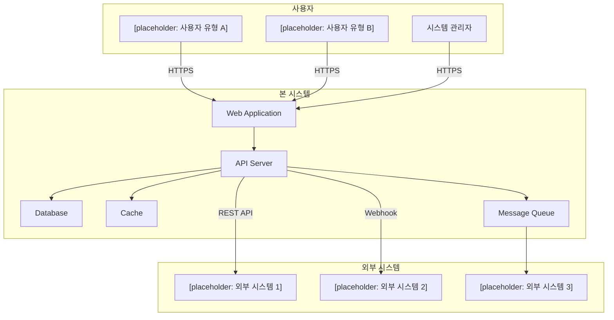
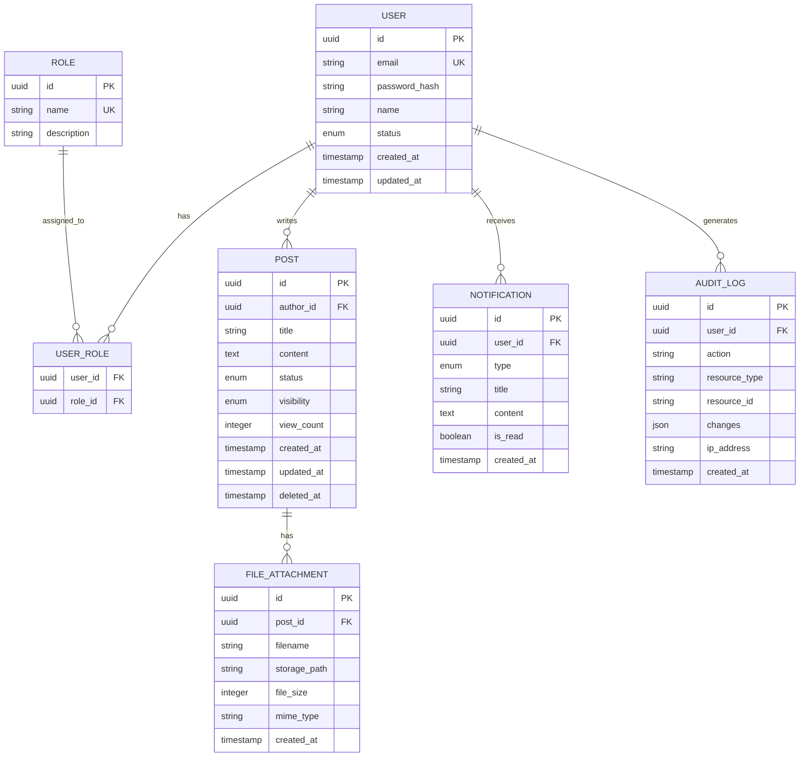

# 소프트웨어 요구사항 명세서 (SRS)

> Software Requirements Specification

---

## 문서 정보

| 항목 | 내용 |
|------|------|
| 프로젝트명 | [placeholder: 프로젝트명] |
| 문서 번호 | SRS-[placeholder: 문서번호] |
| 버전 | [placeholder: 버전 (예: 1.0.0)] |
| 작성일 | [placeholder: YYYY-MM-DD] |
| 작성자 | [placeholder: 작성자명 / 소속] |
| 보안 등급 | [placeholder: 공개 / 대외비 / 기밀] |

---

## 변경 이력

| 버전 | 날짜 | 변경 내용 | 작성자 | 승인자 |
|------|------|-----------|--------|--------|
| 0.1 | [placeholder] | 초안 작성 | [placeholder] | - |
| 0.2 | [placeholder] | [placeholder: 변경 내용 요약] | [placeholder] | - |
| 1.0 | [placeholder] | 최종 승인 | [placeholder] | [placeholder] |

---

## 목차

1. [문서 개요](#1-문서-개요)
2. [전체 시스템 설명](#2-전체-시스템-설명)
3. [기능 요구사항](#3-기능-요구사항)
4. [비기능 요구사항](#4-비기능-요구사항)
5. [외부 인터페이스 요구사항](#5-외부-인터페이스-요구사항)
6. [데이터 요구사항](#6-데이터-요구사항)
7. [제약 조건](#7-제약-조건)
8. [승인 내역](#8-승인-내역)

---

## 1. 문서 개요

### 1.1 목적

본 문서는 **[placeholder: 프로젝트명]** 시스템의 소프트웨어 요구사항을 정의한다. 개발팀, 기획팀, QA팀, 운영팀 등 프로젝트 이해관계자가 시스템에 대한 동일한 이해를 가지도록 하는 것을 목적으로 한다.

본 문서는 다음 용도로 활용된다:

- 개발 범위 및 기능의 명확한 정의
- 설계, 구현, 테스트의 기준 문서
- 요구사항 추적(RTM)의 기반 문서
- 이해관계자 간 합의 및 승인의 근거

### 1.2 범위

본 문서에서 다루는 시스템의 범위는 다음과 같다:

- **포함 범위**: [placeholder: 시스템이 제공하는 주요 기능 및 서비스 나열]
- **제외 범위**: [placeholder: 본 프로젝트에서 다루지 않는 기능이나 영역 나열]

시스템의 주요 목표:

1. [placeholder: 비즈니스 목표 1]
2. [placeholder: 비즈니스 목표 2]
3. [placeholder: 비즈니스 목표 3]

### 1.3 용어 정의

| 용어 | 정의 |
|------|------|
| SRS | Software Requirements Specification. 소프트웨어 요구사항 명세서 |
| RTM | Requirements Traceability Matrix. 요구사항 추적 매트릭스 |
| FR | Functional Requirement. 기능 요구사항 |
| NFR | Non-Functional Requirement. 비기능 요구사항 |
| UC | Use Case. 유스케이스 |
| API | Application Programming Interface |
| SLA | Service Level Agreement. 서비스 수준 협약 |
| RBAC | Role-Based Access Control. 역할 기반 접근 제어 |
| JWT | JSON Web Token |
| OAuth | Open Authorization |
| CRUD | Create, Read, Update, Delete |
| CI/CD | Continuous Integration / Continuous Deployment |
| [placeholder] | [placeholder: 프로젝트 고유 용어 추가] |

### 1.4 참고 문서

| 문서명 | 버전 | 비고 |
|--------|------|------|
| 프로젝트 기획서 | [placeholder] | 프로젝트 배경 및 목표 |
| 유스케이스 명세서 | [placeholder] | UC 상세 시나리오 |
| 요구사항 추적 매트릭스 (RTM) | [placeholder] | 요구사항 추적 |
| 화면 설계서 (Wireframe) | [placeholder] | UI/UX 참조 |
| [placeholder: 추가 참고 문서] | [placeholder] | [placeholder] |

### 1.5 우선순위 정의

본 문서에서 사용하는 요구사항 우선순위 기준은 다음과 같다:

| 등급 | 라벨 | 정의 |
|------|------|------|
| P1 | 필수 (Must) | 반드시 구현해야 하는 핵심 기능. 미구현 시 시스템 출시 불가 |
| P2 | 권장 (Should) | 구현이 강력히 권장되는 기능. 일정에 따라 조정 가능 |
| P3 | 선택 (Could) | 구현하면 좋으나 필수는 아닌 기능. 후속 릴리스로 이관 가능 |
| P4 | 제외 (Won't) | 현재 범위에서 명시적으로 제외하는 기능 |

---

## 2. 전체 시스템 설명

### 2.1 시스템 관점도

[placeholder: 시스템의 전체적인 구조와 외부 시스템과의 관계를 도식화한다.]



### 2.2 사용자 유형 및 특성

| Actor ID | 사용자 유형 | 설명 | 권한 수준 | 사용 빈도 | 기술 숙련도 |
|----------|-------------|------|-----------|-----------|-------------|
| ACT-01 | 일반 사용자 | [placeholder: 일반 사용자 설명] | 기본 | 매일 | 초~중급 |
| ACT-02 | 관리자 | [placeholder: 관리자 설명] | 관리 | 매일 | 중~고급 |
| ACT-03 | 시스템 관리자 | [placeholder: 시스템 관리자 설명] | 최고 | 필요 시 | 고급 |
| ACT-04 | [placeholder] | [placeholder: 추가 사용자 유형] | [placeholder] | [placeholder] | [placeholder] |
| ACT-05 | 외부 시스템 | [placeholder: API를 통해 연동하는 외부 시스템] | API 전용 | 상시 | - |

### 2.3 운영 환경

#### 2.3.1 하드웨어 환경

| 구분 | 사양 | 비고 |
|------|------|------|
| Application Server | [placeholder: CPU, Memory, Storage] | [placeholder] |
| Database Server | [placeholder: CPU, Memory, Storage] | [placeholder] |
| Cache Server | [placeholder: CPU, Memory] | [placeholder] |
| CDN | [placeholder: CDN 서비스] | [placeholder] |

#### 2.3.2 소프트웨어 환경

| 구분 | 기술 스택 | 버전 | 비고 |
|------|-----------|------|------|
| OS | [placeholder: e.g., Ubuntu Linux] | [placeholder] | |
| Runtime | [placeholder: e.g., Node.js, JDK] | [placeholder] | |
| Framework | [placeholder: e.g., Next.js, Spring Boot] | [placeholder] | |
| Database | [placeholder: e.g., PostgreSQL, MySQL] | [placeholder] | |
| Cache | [placeholder: e.g., Redis] | [placeholder] | |
| Message Queue | [placeholder: e.g., RabbitMQ, Kafka] | [placeholder] | |
| Container | [placeholder: e.g., Docker, Kubernetes] | [placeholder] | |
| CI/CD | [placeholder: e.g., GitHub Actions, Jenkins] | [placeholder] | |

#### 2.3.3 클라이언트 환경

| 구분 | 지원 범위 | 비고 |
|------|-----------|------|
| 데스크톱 브라우저 | [placeholder: Chrome 최신 2버전, Firefox, Safari, Edge] | |
| 모바일 브라우저 | [placeholder: iOS Safari, Android Chrome] | |
| 최소 해상도 | [placeholder: e.g., 1280x720] | 반응형 웹 |
| 모바일 앱 | [placeholder: iOS/Android 지원 여부] | |

### 2.4 제약사항

1. [placeholder: 기술적 제약사항 — 예: 기존 레거시 시스템과의 호환성 유지 필요]
2. [placeholder: 조직적 제약사항 — 예: 사내 표준 기술 스택 사용 의무]
3. [placeholder: 법적 제약사항 — 예: 개인정보보호법 준수 필수]
4. [placeholder: 일정 제약사항 — 예: 202X년 Q3 내 출시 필요]

### 2.5 가정 및 전제 조건

1. [placeholder: 가정 1 — 예: 사용자는 안정적인 인터넷 환경에서 시스템을 사용한다]
2. [placeholder: 가정 2 — 예: 외부 인증 서비스(OAuth Provider)는 SLA 99.9%를 보장한다]
3. [placeholder: 가정 3 — 예: 초기 사용자 수는 1,000명 이하로 예상한다]
4. [placeholder: 가정 4 — 예: 프로젝트 기간 중 요구사항의 대규모 변경은 없다]

---

## 3. 기능 요구사항

### 3.1 기능 요구사항 요약 목록

| FR-ID | 기능명 | 설명 | 우선순위 | 관련 UC | 상태 |
|-------|--------|------|----------|---------|------|
| FR-001 | 회원가입 | 이메일 기반 회원가입 및 인증 | P1 필수 | UC-001 | 초안 |
| FR-002 | 로그인/로그아웃 | 자체 로그인 및 소셜 로그인 지원 | P1 필수 | UC-002 | 초안 |
| FR-003 | 사용자 프로필 관리 | 사용자 정보 조회 및 수정 | P2 권장 | UC-003 | 초안 |
| FR-004 | 역할/권한 관리 | RBAC 기반 접근 제어 | P1 필수 | UC-004 | 초안 |
| FR-005 | 게시글 관리 (CRUD) | 게시글 작성, 조회, 수정, 삭제 | P1 필수 | UC-005 | 초안 |
| FR-006 | 검색 | 통합 검색 및 필터링 | P2 권장 | UC-006 | 초안 |
| FR-007 | 알림 | 실시간 알림 및 이메일 알림 | P2 권장 | UC-007 | 초안 |
| [placeholder] | [placeholder] | [placeholder] | [placeholder] | [placeholder] | [placeholder] |

---

### 3.2 FR-001: 회원가입

| 항목 | 내용 |
|------|------|
| **FR-ID** | FR-001 |
| **기능명** | 회원가입 |
| **설명** | 사용자가 이메일 주소를 사용하여 시스템에 회원으로 등록할 수 있다. 이메일 인증을 통해 본인 확인을 수행한다. |
| **우선순위** | P1 필수 |
| **연관 기능** | FR-002 (로그인), FR-003 (프로필 관리) |
| **관련 UC** | UC-001 |

#### 입력

| 필드명 | 타입 | 필수 여부 | 유효성 검증 규칙 |
|--------|------|-----------|------------------|
| 이메일 | String (email) | 필수 | RFC 5322 이메일 형식, 중복 검사 |
| 비밀번호 | String | 필수 | 최소 8자, 대/소문자, 숫자, 특수문자 포함 |
| 비밀번호 확인 | String | 필수 | 비밀번호 필드와 일치 |
| 이름 | String | 필수 | 2~50자, 특수문자 제한 |
| 서비스 이용약관 동의 | Boolean | 필수 | true |
| 개인정보 처리방침 동의 | Boolean | 필수 | true |
| 마케팅 수신 동의 | Boolean | 선택 | - |

#### 처리 로직

1. 입력 데이터 유효성 검증
2. 이메일 중복 확인 (기존 회원 존재 여부)
3. 비밀번호 해시 처리 (bcrypt, cost factor 12 이상)
4. 사용자 레코드 생성 (상태: `PENDING_VERIFICATION`)
5. 이메일 인증 토큰 생성 (유효기간: 24시간)
6. 인증 이메일 발송
7. 사용자가 이메일 내 링크 클릭 시 상태를 `ACTIVE`로 변경

#### 출력

| 상황 | 응답 | HTTP Status |
|------|------|-------------|
| 성공 | 회원가입 완료 메시지, 인증 이메일 발송 안내 | 201 Created |
| 이메일 중복 | 이미 등록된 이메일 안내 | 409 Conflict |
| 유효성 검증 실패 | 필드별 오류 메시지 | 400 Bad Request |
| 서버 오류 | 일반 오류 메시지 (상세 정보 미노출) | 500 Internal Server Error |

#### 비고

- 이메일 인증 미완료 시 로그인 차단
- 인증 이메일 재발송 기능 제공 (재발송 간격: 최소 60초)
- 탈퇴 후 재가입 시 이전 데이터 복구 불가 (별도 안내)

---

### 3.3 FR-002: 로그인/로그아웃

| 항목 | 내용 |
|------|------|
| **FR-ID** | FR-002 |
| **기능명** | 로그인/로그아웃 |
| **설명** | 사용자가 이메일/비밀번호 또는 소셜 계정을 통해 시스템에 인증하고, 인증 세션을 종료할 수 있다. |
| **우선순위** | P1 필수 |
| **연관 기능** | FR-001 (회원가입), FR-004 (권한 관리) |
| **관련 UC** | UC-002 |

#### 입력

**자체 로그인:**

| 필드명 | 타입 | 필수 여부 | 유효성 검증 규칙 |
|--------|------|-----------|------------------|
| 이메일 | String (email) | 필수 | 이메일 형식 검증 |
| 비밀번호 | String | 필수 | 빈 값 불허 |
| 자동 로그인 | Boolean | 선택 | - |

**소셜 로그인:**

| 필드명 | 타입 | 필수 여부 | 유효성 검증 규칙 |
|--------|------|-----------|------------------|
| Provider | Enum | 필수 | [placeholder: Google, Kakao, Naver 등] |
| OAuth Token | String | 필수 | Provider로부터 수신 |

#### 처리 로직

**자체 로그인:**

1. 이메일로 사용자 조회
2. 계정 상태 확인 (ACTIVE 여부, 잠금 여부)
3. 비밀번호 해시 비교
4. 로그인 실패 횟수 관리 (5회 연속 실패 시 계정 잠금 30분)
5. Access Token (JWT) 발급 — 유효기간: [placeholder: e.g., 1시간]
6. Refresh Token 발급 — 유효기간: [placeholder: e.g., 14일]
7. 로그인 이력 기록 (IP, User-Agent, 시간)

**소셜 로그인:**

1. OAuth Provider에 토큰 유효성 검증 요청
2. Provider 응답에서 사용자 식별 정보 추출
3. 기존 연동 계정 확인 (없을 경우 자동 회원가입 또는 연동 안내)
4. Access Token / Refresh Token 발급
5. 로그인 이력 기록

**로그아웃:**

1. 현재 세션의 Access Token 무효화
2. Refresh Token 무효화 (서버 측 블랙리스트 또는 삭제)
3. 클라이언트 측 토큰 삭제

#### 출력

| 상황 | 응답 | HTTP Status |
|------|------|-------------|
| 로그인 성공 | Access Token, Refresh Token, 사용자 기본 정보 | 200 OK |
| 인증 실패 | "이메일 또는 비밀번호가 올바르지 않습니다" | 401 Unauthorized |
| 계정 잠금 | 계정 잠금 안내 및 해제 시간 | 423 Locked |
| 이메일 미인증 | 이메일 인증 필요 안내 | 403 Forbidden |
| 로그아웃 성공 | 성공 메시지 | 200 OK |

#### 비고

- 비밀번호 오류 메시지는 "이메일 또는 비밀번호" 형식으로 통합 (보안)
- Refresh Token rotation 적용
- 동시 로그인 정책: [placeholder: 허용 / 최근 세션만 유지 / 디바이스별 허용]

---

### 3.4 FR-003: 사용자 프로필 관리

| 항목 | 내용 |
|------|------|
| **FR-ID** | FR-003 |
| **기능명** | 사용자 프로필 관리 |
| **설명** | 인증된 사용자가 자신의 프로필 정보를 조회하고 수정할 수 있다. |
| **우선순위** | P2 권장 |
| **연관 기능** | FR-001 (회원가입), FR-002 (로그인) |
| **관련 UC** | UC-003 |

#### 입력

| 필드명 | 타입 | 필수 여부 | 유효성 검증 규칙 |
|--------|------|-----------|------------------|
| 이름 | String | 선택 | 2~50자 |
| 프로필 이미지 | File (image) | 선택 | JPG/PNG, 최대 5MB |
| 전화번호 | String | 선택 | E.164 형식 |
| 자기소개 | String | 선택 | 최대 500자 |
| [placeholder] | [placeholder] | [placeholder] | [placeholder] |

#### 처리 로직

1. 인증 토큰 검증
2. 변경 필드 유효성 검증
3. 프로필 이미지 변경 시: 이미지 리사이즈 및 스토리지 업로드
4. 사용자 정보 업데이트
5. 변경 이력 로깅

#### 출력

| 상황 | 응답 | HTTP Status |
|------|------|-------------|
| 조회 성공 | 사용자 프로필 정보 | 200 OK |
| 수정 성공 | 수정된 프로필 정보 | 200 OK |
| 인증 실패 | 인증 필요 안내 | 401 Unauthorized |
| 유효성 실패 | 필드별 오류 | 400 Bad Request |

#### 비고

- 이메일 변경 시 재인증 필요
- 비밀번호 변경은 별도 API (현재 비밀번호 확인 필수)
- 회원 탈퇴 기능 포함 (탈퇴 전 확인 단계, 30일 유예 기간)

---

### 3.5 FR-004: 역할/권한 관리

| 항목 | 내용 |
|------|------|
| **FR-ID** | FR-004 |
| **기능명** | 역할/권한 관리 (RBAC) |
| **설명** | 시스템 관리자가 사용자에게 역할(Role)을 부여하고, 역할별 접근 권한을 관리할 수 있다. |
| **우선순위** | P1 필수 |
| **연관 기능** | FR-002 (로그인), FR-005 (게시글 관리) |
| **관련 UC** | UC-004 |

#### 기본 역할 정의

| 역할 ID | 역할명 | 설명 | 주요 권한 |
|---------|--------|------|-----------|
| ROLE-01 | GUEST | 비인증 사용자 | 공개 콘텐츠 조회 |
| ROLE-02 | USER | 일반 회원 | 자신의 콘텐츠 CRUD, 프로필 관리 |
| ROLE-03 | MODERATOR | 운영자 | 콘텐츠 관리, 사용자 경고/제재 |
| ROLE-04 | ADMIN | 관리자 | 전체 시스템 관리, 역할 부여 |
| ROLE-05 | SUPER_ADMIN | 최고 관리자 | 관리자 관리 포함 전체 권한 |
| [placeholder] | [placeholder] | [placeholder] | [placeholder] |

#### 처리 로직

1. 모든 API 요청 시 인증 토큰에서 사용자 역할 추출
2. 요청된 리소스/액션에 대한 권한 검증
3. 권한 불일치 시 접근 거부
4. 역할 변경 이력 감사 로깅
5. 관리자의 역할 부여/회수는 ADMIN 이상만 가능

#### 출력

| 상황 | 응답 | HTTP Status |
|------|------|-------------|
| 권한 있음 | 요청된 리소스 응답 | 200 OK |
| 인증 필요 | 로그인 필요 안내 | 401 Unauthorized |
| 권한 부족 | 접근 권한 부족 안내 | 403 Forbidden |

#### 비고

- 역할은 계층 구조 (상위 역할이 하위 역할의 권한 포함)
- 커스텀 역할 생성 지원 여부: [placeholder: 지원 / 미지원]
- 권한 변경 시 기존 세션에 즉시 반영 여부: [placeholder: 즉시 / 다음 로그인 시]

---

### 3.6 FR-005: 게시글 관리 (CRUD)

| 항목 | 내용 |
|------|------|
| **FR-ID** | FR-005 |
| **기능명** | 게시글 관리 (CRUD) |
| **설명** | 인증된 사용자가 게시글을 작성, 조회, 수정, 삭제할 수 있다. 파일 첨부와 카테고리 분류를 지원한다. |
| **우선순위** | P1 필수 |
| **연관 기능** | FR-004 (권한 관리), FR-006 (검색), FR-007 (알림) |
| **관련 UC** | UC-005 |

#### 입력 (작성/수정)

| 필드명 | 타입 | 필수 여부 | 유효성 검증 규칙 |
|--------|------|-----------|------------------|
| 제목 | String | 필수 | 1~200자 |
| 본문 | String (Rich Text) | 필수 | 최대 50,000자, HTML sanitize |
| 카테고리 | String (Enum) | 필수 | 유효한 카테고리 값 |
| 태그 | String[] | 선택 | 최대 10개, 태그당 최대 30자 |
| 첨부 파일 | File[] | 선택 | 파일당 최대 [placeholder: e.g., 10MB], 총 [placeholder: e.g., 50MB] |
| 공개 여부 | Enum | 필수 | PUBLIC / PRIVATE / MEMBERS_ONLY |
| [placeholder] | [placeholder] | [placeholder] | [placeholder] |

#### 처리 로직

**작성 (Create):**

1. 사용자 인증 및 권한 확인 (USER 이상)
2. 입력 데이터 유효성 검증
3. XSS 방지를 위한 HTML sanitize
4. 첨부 파일 업로드 처리 (바이러스 스캔 → 스토리지 저장)
5. 게시글 레코드 생성
6. 관련 사용자에게 알림 발송 (구독자 등)

**조회 (Read):**

1. 게시글 존재 여부 확인
2. 접근 권한 확인 (공개 설정에 따라)
3. 조회수 증가 (중복 방지 로직 적용)
4. 게시글 데이터 반환

**수정 (Update):**

1. 사용자 인증 확인
2. 작성자 본인 또는 MODERATOR 이상 권한 확인
3. 수정 데이터 유효성 검증
4. 수정 이력 기록
5. 게시글 업데이트

**삭제 (Delete):**

1. 사용자 인증 확인
2. 작성자 본인 또는 MODERATOR 이상 권한 확인
3. 소프트 삭제 처리 (deleted_at 타임스탬프 설정)
4. 첨부 파일 삭제 예약 (30일 후 물리 삭제)

#### 출력

| 상황 | 응답 | HTTP Status |
|------|------|-------------|
| 작성 성공 | 생성된 게시글 정보 | 201 Created |
| 조회 성공 | 게시글 상세 정보 | 200 OK |
| 목록 조회 | 게시글 목록 (페이지네이션) | 200 OK |
| 수정 성공 | 수정된 게시글 정보 | 200 OK |
| 삭제 성공 | 삭제 확인 메시지 | 200 OK |
| 게시글 없음 | 게시글을 찾을 수 없음 | 404 Not Found |
| 권한 부족 | 접근 권한 부족 | 403 Forbidden |

#### 비고

- 목록 조회 시 페이지네이션 적용 (기본 20건/페이지)
- 정렬 기준: 최신순, 인기순, 조회수순
- 임시 저장 기능 지원: [placeholder: 지원 / 미지원]
- 게시글 수정 이력 표시: [placeholder: 표시 / 미표시]

---

### 3.7 FR-006: 검색

| 항목 | 내용 |
|------|------|
| **FR-ID** | FR-006 |
| **기능명** | 통합 검색 |
| **설명** | 사용자가 키워드, 필터, 정렬 조건을 사용하여 시스템 내 콘텐츠를 검색할 수 있다. |
| **우선순위** | P2 권장 |
| **연관 기능** | FR-005 (게시글 관리) |
| **관련 UC** | UC-006 |

#### 입력

| 필드명 | 타입 | 필수 여부 | 유효성 검증 규칙 |
|--------|------|-----------|------------------|
| 검색어 | String | 필수 | 1~200자, 특수문자 이스케이프 |
| 카테고리 필터 | String[] | 선택 | 유효한 카테고리 |
| 날짜 범위 | DateRange | 선택 | 시작일 <= 종료일 |
| 정렬 기준 | Enum | 선택 | RELEVANCE / LATEST / POPULAR |
| 페이지 번호 | Integer | 선택 | 기본값 1, 최소 1 |
| 페이지 크기 | Integer | 선택 | 기본값 20, 최대 100 |

#### 처리 로직

1. 검색어 전처리 (형태소 분석, 불용어 제거)
2. 검색 인덱스 조회 (Full-text search 또는 검색 엔진)
3. 접근 권한 필터링 (사용자 권한에 따라 노출 제한)
4. 필터 및 정렬 조건 적용
5. 페이지네이션 적용
6. 검색어 하이라이트 처리
7. 검색 로그 기록 (검색 품질 개선 목적)

#### 출력

| 상황 | 응답 | HTTP Status |
|------|------|-------------|
| 검색 성공 | 검색 결과 목록, 총 결과 수, 페이지 정보 | 200 OK |
| 검색 결과 없음 | 빈 목록, 총 결과 수 0 | 200 OK |
| 검색어 미입력 | 유효성 오류 | 400 Bad Request |

#### 비고

- 검색 엔진: [placeholder: Elasticsearch / 자체 Full-text search / 외부 서비스]
- 자동 완성(Autocomplete) 지원 여부: [placeholder: 지원 / 미지원]
- 인기 검색어 제공 여부: [placeholder: 제공 / 미제공]
- 검색 결과 캐싱: [placeholder: 적용 / 미적용]

---

### 3.8 FR-007: 알림

| 항목 | 내용 |
|------|------|
| **FR-ID** | FR-007 |
| **기능명** | 알림 |
| **설명** | 사용자에게 시스템 이벤트에 대한 실시간 알림(In-app)과 이메일 알림을 제공한다. |
| **우선순위** | P2 권장 |
| **연관 기능** | FR-001 (회원가입), FR-005 (게시글 관리) |
| **관련 UC** | UC-007 |

#### 알림 유형

| 알림 ID | 이벤트 | In-App | 이메일 | Push | 기본 설정 |
|---------|--------|--------|--------|------|-----------|
| NTF-01 | 회원가입 인증 | - | O | - | 이메일 필수 |
| NTF-02 | 비밀번호 변경 | O | O | - | 둘 다 활성 |
| NTF-03 | 새 댓글/답글 | O | O | O | In-App 활성 |
| NTF-04 | 게시글 좋아요 | O | - | O | In-App 활성 |
| NTF-05 | 시스템 공지 | O | O | O | 전체 활성 |
| [placeholder] | [placeholder] | [placeholder] | [placeholder] | [placeholder] | [placeholder] |

#### 처리 로직

1. 알림 트리거 이벤트 발생
2. 대상 사용자의 알림 설정 확인
3. 알림 채널별 메시지 생성
4. In-App: WebSocket을 통한 실시간 전송
5. 이메일: 비동기 큐를 통한 발송
6. Push: [placeholder: FCM / APNs를 통한 발송]
7. 알림 저장 (읽음/안읽음 상태 관리)

#### 출력

| 상황 | 응답 | HTTP Status |
|------|------|-------------|
| 알림 목록 조회 | 알림 목록 (읽음/안읽음 구분) | 200 OK |
| 알림 읽음 처리 | 성공 메시지 | 200 OK |
| 전체 읽음 처리 | 성공 메시지 | 200 OK |
| 알림 설정 변경 | 변경된 설정 정보 | 200 OK |

#### 비고

- 사용자별 알림 수신 설정 (채널별, 유형별 ON/OFF)
- 안읽은 알림 개수 배지 표시
- 알림 보관 기간: [placeholder: e.g., 90일]
- 야간 시간대 알림 제한 여부: [placeholder: 설정 가능 / 미지원]

---

### 3.9 추가 기능 요구사항

> [placeholder: 프로젝트 고유 기능을 아래 템플릿에 따라 추가한다.]

#### FR-[placeholder: ID]: [placeholder: 기능명]

| 항목 | 내용 |
|------|------|
| **FR-ID** | FR-[placeholder] |
| **기능명** | [placeholder] |
| **설명** | [placeholder: 기능에 대한 상세 설명] |
| **우선순위** | [placeholder: P1 필수 / P2 권장 / P3 선택] |
| **연관 기능** | [placeholder: 관련 FR-ID 나열] |
| **관련 UC** | [placeholder: 관련 UC-ID] |

**입력:**

| 필드명 | 타입 | 필수 여부 | 유효성 검증 규칙 |
|--------|------|-----------|------------------|
| [placeholder] | [placeholder] | [placeholder] | [placeholder] |

**처리 로직:**

1. [placeholder: 처리 단계 기술]

**출력:**

| 상황 | 응답 | HTTP Status |
|------|------|-------------|
| [placeholder] | [placeholder] | [placeholder] |

**비고:**

- [placeholder: 추가 참고 사항]

---

## 4. 비기능 요구사항

### 4.1 비기능 요구사항 요약 목록

| NFR-ID | 분류 | 요구사항명 | 목표 수치 | 우선순위 |
|--------|------|-----------|-----------|----------|
| NFR-001 | 성능 | API 응답시간 | [placeholder] | P1 필수 |
| NFR-002 | 성능 | 동시 사용자 처리 | [placeholder] | P1 필수 |
| NFR-003 | 성능 | 처리량 (Throughput) | [placeholder] | P1 필수 |
| NFR-004 | 보안 | 인증/인가 | JWT + RBAC | P1 필수 |
| NFR-005 | 보안 | 데이터 암호화 | TLS 1.2+ | P1 필수 |
| NFR-006 | 보안 | 감사 로깅 | 전수 기록 | P1 필수 |
| NFR-007 | 가용성 | 업타임 목표 | [placeholder] | P1 필수 |
| NFR-008 | 가용성 | 장애 복구 시간 | [placeholder] | P1 필수 |
| NFR-009 | 확장성 | 수평 확장 | [placeholder] | P2 권장 |
| NFR-010 | 호환성 | 브라우저 호환 | [placeholder] | P1 필수 |
| NFR-011 | 유지보수성 | 코드 품질 | [placeholder] | P2 권장 |
| [placeholder] | [placeholder] | [placeholder] | [placeholder] | [placeholder] |

---

### 4.2 성능 요구사항

#### NFR-001: API 응답시간

| 항목 | 내용 |
|------|------|
| **NFR-ID** | NFR-001 |
| **분류** | 성능 |
| **요구사항** | API 응답시간 기준 |
| **우선순위** | P1 필수 |

| 요청 유형 | 평균 응답시간 | 95th Percentile | 99th Percentile |
|-----------|-------------|-----------------|-----------------|
| 단순 조회 API | [placeholder: e.g., < 200ms] | [placeholder: e.g., < 500ms] | [placeholder: e.g., < 1s] |
| 목록 조회 API | [placeholder: e.g., < 500ms] | [placeholder: e.g., < 1s] | [placeholder: e.g., < 2s] |
| 데이터 생성/수정 API | [placeholder: e.g., < 300ms] | [placeholder: e.g., < 800ms] | [placeholder: e.g., < 1.5s] |
| 검색 API | [placeholder: e.g., < 1s] | [placeholder: e.g., < 2s] | [placeholder: e.g., < 3s] |
| 파일 업로드 | [placeholder: e.g., < 5s (10MB 기준)] | [placeholder] | [placeholder] |
| 페이지 로드 (SSR/CSR) | [placeholder: e.g., < 3s] | [placeholder] | [placeholder] |

**측정 조건:**
- 네트워크 지연 제외, 서버 처리 시간 기준
- 정상 부하 상태 (동시 사용자 수: [placeholder])

#### NFR-002: 동시 사용자 처리

| 항목 | 내용 |
|------|------|
| **NFR-ID** | NFR-002 |
| **분류** | 성능 |
| **요구사항** | 동시 사용자 처리 능력 |
| **우선순위** | P1 필수 |

| 지표 | 목표 수치 | 비고 |
|------|-----------|------|
| 정상 동시 사용자 (CCU) | [placeholder: e.g., 1,000명] | 서비스 품질 유지 기준 |
| 최대 동시 사용자 (Peak) | [placeholder: e.g., 5,000명] | 성능 저하 허용 범위 내 |
| 동시 접속 (WebSocket) | [placeholder: e.g., 500 connections] | 실시간 알림 기준 |

#### NFR-003: 처리량 (Throughput)

| 항목 | 내용 |
|------|------|
| **NFR-ID** | NFR-003 |
| **분류** | 성능 |
| **요구사항** | 시스템 처리량 |
| **우선순위** | P1 필수 |

| 지표 | 목표 수치 | 비고 |
|------|-----------|------|
| API 요청 처리량 | [placeholder: e.g., 500 req/s] | 전체 API 기준 |
| 데이터베이스 쿼리 | [placeholder: e.g., 1,000 queries/s] | 읽기/쓰기 합산 |
| 이메일 발송 | [placeholder: e.g., 100건/분] | 비동기 처리 |

---

### 4.3 보안 요구사항

#### NFR-004: 인증 및 인가

| 항목 | 내용 |
|------|------|
| **NFR-ID** | NFR-004 |
| **분류** | 보안 |
| **요구사항** | 인증/인가 체계 |
| **우선순위** | P1 필수 |

| 항목 | 요구 수준 | 구현 방법 |
|------|-----------|-----------|
| 인증 방식 | Token 기반 | JWT (Access + Refresh Token) |
| Token 서명 | 비대칭 키 서명 | RS256 또는 ES256 |
| 인가 방식 | 역할 기반 접근 제어 | RBAC (Role-Based Access Control) |
| 비밀번호 정책 | 강도 높은 비밀번호 | 최소 8자, 대/소/숫자/특수문자 조합 |
| 비밀번호 저장 | 단방향 해시 | bcrypt (cost 12+) |
| 다중 인증 (MFA) | [placeholder: 필수 / 선택 / 미지원] | [placeholder: TOTP / SMS] |
| 세션 관리 | 유효기간 제한 | Access: [placeholder], Refresh: [placeholder] |
| 계정 잠금 | 연속 실패 시 잠금 | 5회 실패 시 30분 잠금 |

#### NFR-005: 데이터 암호화

| 항목 | 내용 |
|------|------|
| **NFR-ID** | NFR-005 |
| **분류** | 보안 |
| **요구사항** | 데이터 암호화 |
| **우선순위** | P1 필수 |

| 구분 | 요구 수준 | 구현 방법 |
|------|-----------|-----------|
| 전송 중 암호화 (In Transit) | TLS 1.2 이상 필수 | HTTPS, TLS 1.3 권장 |
| 저장 시 암호화 (At Rest) | 민감 데이터 암호화 | AES-256 |
| 암호화 대상 필드 | 개인정보, 인증 정보 | [placeholder: 구체적 필드 나열] |
| 키 관리 | 안전한 키 보관 | [placeholder: AWS KMS / Vault / HSM] |
| 인증서 관리 | 자동 갱신 | [placeholder: Let's Encrypt / 상용 인증서] |

#### NFR-006: 감사 로깅 (Audit Logging)

| 항목 | 내용 |
|------|------|
| **NFR-ID** | NFR-006 |
| **분류** | 보안 |
| **요구사항** | 감사 추적을 위한 로깅 |
| **우선순위** | P1 필수 |

**기록 대상 이벤트:**

| 이벤트 유형 | 기록 항목 | 보관 기간 |
|------------|-----------|-----------|
| 인증 이벤트 | 로그인/로그아웃/실패, IP, User-Agent, 시간 | [placeholder: e.g., 1년] |
| 권한 변경 | 대상 사용자, 변경 전/후 역할, 수행자, 시간 | [placeholder: e.g., 2년] |
| 데이터 변경 | 리소스 유형, ID, 변경 전/후 값, 수행자, 시간 | [placeholder: e.g., 1년] |
| 관리자 활동 | 모든 관리자 작업, 수행자, 시간 | [placeholder: e.g., 2년] |
| API 접근 | 엔드포인트, 메서드, 응답 코드, 소요 시간 | [placeholder: e.g., 90일] |
| 보안 이벤트 | 잠금, 비정상 접근 시도, 시간 | [placeholder: e.g., 2년] |

**로그 보관 정책:**

- 로그 저장소: [placeholder: e.g., ELK Stack / CloudWatch]
- 실시간 모니터링: [placeholder: 적용 / 미적용]
- 로그 위변조 방지: [placeholder: 적용 방법]
- 로그 접근 권한: ADMIN 이상

---

### 4.4 가용성 요구사항

#### NFR-007: 업타임 목표

| 항목 | 내용 |
|------|------|
| **NFR-ID** | NFR-007 |
| **분류** | 가용성 |
| **요구사항** | 시스템 가용성 목표 |
| **우선순위** | P1 필수 |

| 지표 | 목표 | 허용 다운타임 |
|------|------|-------------|
| 월간 가용성 | [placeholder: e.g., 99.9%] | [placeholder: e.g., ~43분/월] |
| 연간 가용성 | [placeholder: e.g., 99.9%] | [placeholder: e.g., ~8.7시간/년] |
| 계획된 점검 | [placeholder: e.g., 월 1회, 새벽 2-4시] | 사전 공지 필수 |

#### NFR-008: 장애 복구

| 항목 | 내용 |
|------|------|
| **NFR-ID** | NFR-008 |
| **분류** | 가용성 |
| **요구사항** | 장애 복구 목표 |
| **우선순위** | P1 필수 |

| 지표 | 목표 | 비고 |
|------|------|------|
| RTO (Recovery Time Objective) | [placeholder: e.g., 1시간] | 서비스 복구까지 최대 허용 시간 |
| RPO (Recovery Point Objective) | [placeholder: e.g., 15분] | 최대 허용 데이터 손실 시점 |
| 자동 장애 감지 | [placeholder: e.g., 5분 이내] | 모니터링 시스템 |
| 자동 Failover | [placeholder: 지원 / 미지원] | [placeholder] |
| 장애 등급 분류 | 4단계 (Critical/Major/Minor/Info) | 등급별 대응 SLA |

**장애 대응 프로세스:**

1. 장애 감지 (모니터링 알림)
2. 장애 등급 분류 및 담당자 배정
3. 원인 분석 및 긴급 조치
4. 서비스 복구 확인
5. 장애 보고서 작성 (RCA: Root Cause Analysis)
6. 재발 방지 대책 수립

---

### 4.5 확장성 요구사항

#### NFR-009: 확장 전략

| 항목 | 내용 |
|------|------|
| **NFR-ID** | NFR-009 |
| **분류** | 확장성 |
| **요구사항** | 시스템 확장 전략 |
| **우선순위** | P2 권장 |

**수평 확장 (Horizontal Scaling):**

| 구성 요소 | 확장 방식 | 비고 |
|-----------|-----------|------|
| Application Server | [placeholder: Auto Scaling Group / K8s HPA] | 상태 비저장 (Stateless) 설계 필수 |
| Database (Read) | [placeholder: Read Replica] | 읽기 분산 |
| Database (Write) | [placeholder: Sharding / 별도 구성] | 쓰기 확장 전략 |
| Cache | [placeholder: Redis Cluster] | 분산 캐시 |
| Message Queue | [placeholder: Partition / Consumer Group] | 비동기 처리 확장 |

**수직 확장 (Vertical Scaling):**

| 구성 요소 | 현재 사양 | 확장 가능 사양 | 비고 |
|-----------|-----------|---------------|------|
| Application Server | [placeholder] | [placeholder] | |
| Database Server | [placeholder] | [placeholder] | |
| Cache Server | [placeholder] | [placeholder] | |

**확장 트리거 기준:**

| 지표 | 임계치 | 확장 액션 |
|------|--------|-----------|
| CPU 사용률 | [placeholder: e.g., > 70%] | 인스턴스 추가 |
| Memory 사용률 | [placeholder: e.g., > 80%] | 인스턴스 확장 |
| 응답 시간 | [placeholder: e.g., > 2s 지속] | 인스턴스 추가 |
| 큐 적체 | [placeholder: e.g., > 1000건] | Consumer 추가 |

---

### 4.6 호환성 요구사항

#### NFR-010: 브라우저 및 디바이스 호환성

| 항목 | 내용 |
|------|------|
| **NFR-ID** | NFR-010 |
| **분류** | 호환성 |
| **요구사항** | 브라우저/디바이스 호환성 |
| **우선순위** | P1 필수 |

**데스크톱 브라우저:**

| 브라우저 | 최소 버전 | 지원 수준 |
|----------|-----------|-----------|
| Chrome | [placeholder: e.g., 최신 2버전] | 완전 지원 |
| Firefox | [placeholder: e.g., 최신 2버전] | 완전 지원 |
| Safari | [placeholder: e.g., 최신 2버전] | 완전 지원 |
| Edge | [placeholder: e.g., 최신 2버전] | 완전 지원 |
| IE | 미지원 | - |

**모바일:**

| 플랫폼 | 최소 버전 | 브라우저 | 지원 수준 |
|--------|-----------|----------|-----------|
| iOS | [placeholder: e.g., 15.0+] | Safari | 완전 지원 |
| Android | [placeholder: e.g., 10.0+] | Chrome | 완전 지원 |

**반응형 디자인 Breakpoint:**

| 구분 | 범위 | 비고 |
|------|------|------|
| Mobile | [placeholder: e.g., 320px ~ 767px] | |
| Tablet | [placeholder: e.g., 768px ~ 1023px] | |
| Desktop | [placeholder: e.g., 1024px ~] | |

**API 버전 관리:**

| 항목 | 정책 |
|------|------|
| 버전 관리 방식 | [placeholder: URL Path (e.g., /api/v1) / Header] |
| 이전 버전 지원 기간 | [placeholder: e.g., 신규 버전 출시 후 6개월] |
| Deprecation 공지 | [placeholder: e.g., 최소 3개월 전 공지] |
| Breaking Change 정책 | [placeholder: Major 버전 업데이트 시에만 허용] |

---

### 4.7 유지보수성 요구사항

#### NFR-011: 코드 품질 및 문서화

| 항목 | 내용 |
|------|------|
| **NFR-ID** | NFR-011 |
| **분류** | 유지보수성 |
| **요구사항** | 코드 품질 기준 및 문서화 |
| **우선순위** | P2 권장 |

**코드 품질 기준:**

| 지표 | 목표 수치 | 도구 |
|------|-----------|------|
| 테스트 커버리지 (Line) | [placeholder: e.g., >= 80%] | [placeholder: Jest / JaCoCo 등] |
| 테스트 커버리지 (Branch) | [placeholder: e.g., >= 70%] | [placeholder] |
| 정적 분석 위반 | [placeholder: e.g., Critical 0건] | [placeholder: ESLint / SonarQube 등] |
| 코드 중복률 | [placeholder: e.g., < 5%] | [placeholder] |
| 순환 복잡도 (Cyclomatic) | [placeholder: e.g., 함수당 <= 15] | [placeholder] |

**코딩 표준:**

- 코딩 스타일 가이드: [placeholder: Airbnb Style Guide / Google Style Guide / 자체 가이드]
- 코드 리뷰 정책: [placeholder: PR당 최소 1명 이상 리뷰 필수]
- 브랜치 전략: [placeholder: GitFlow / Trunk-based / GitHub Flow]
- 커밋 메시지 규칙: [placeholder: Conventional Commits]

**문서화 기준:**

| 대상 | 도구 | 수준 |
|------|------|------|
| API 문서 | [placeholder: OpenAPI (Swagger) / Redoc] | 전 엔드포인트 문서화 필수 |
| 코드 문서 | [placeholder: JSDoc / Javadoc / Docstring] | Public API 필수, Internal 권장 |
| 아키텍처 문서 | [placeholder: ADR / Wiki] | 주요 결정 사항 기록 |
| 운영 매뉴얼 | [placeholder: Notion / Confluence] | 배포, 모니터링, 장애 대응 |

---

## 5. 외부 인터페이스 요구사항

### 5.1 사용자 인터페이스 (UI)

#### 5.1.1 UI 일반 원칙

| 항목 | 요구사항 |
|------|----------|
| 디자인 시스템 | [placeholder: Material Design / Ant Design / 자체 디자인 시스템] |
| 접근성 (Accessibility) | [placeholder: WCAG 2.1 Level AA 준수] |
| 국제화 (i18n) | [placeholder: 한국어(기본), 영어 / 단일 언어] |
| 다크 모드 | [placeholder: 지원 / 미지원] |
| 로딩 상태 | 모든 비동기 작업에 로딩 인디케이터 표시 |
| 오류 표시 | 사용자 친화적 오류 메시지, 기술적 상세 미노출 |

#### 5.1.2 주요 화면 목록

| 화면 ID | 화면명 | 설명 | 관련 FR |
|---------|--------|------|---------|
| SCR-01 | 로그인 | 이메일/소셜 로그인 | FR-002 |
| SCR-02 | 회원가입 | 이메일 기반 회원가입 | FR-001 |
| SCR-03 | 메인 대시보드 | [placeholder: 메인 화면 설명] | - |
| SCR-04 | 게시글 목록 | 게시글 목록 및 검색 | FR-005, FR-006 |
| SCR-05 | 게시글 상세 | 게시글 조회, 댓글 | FR-005 |
| SCR-06 | 게시글 작성/수정 | 에디터 포함 | FR-005 |
| SCR-07 | 마이페이지 | 프로필, 설정 | FR-003 |
| SCR-08 | 관리자 페이지 | 시스템 관리 | FR-004 |
| SCR-09 | 알림 센터 | 알림 목록 및 설정 | FR-007 |
| [placeholder] | [placeholder] | [placeholder] | [placeholder] |

### 5.2 API 인터페이스

#### 5.2.1 API 일반 규격

| 항목 | 내용 |
|------|------|
| 프로토콜 | HTTPS (TLS 1.2+) |
| 아키텍처 스타일 | [placeholder: REST / GraphQL] |
| 데이터 형식 | JSON (Content-Type: application/json) |
| 인증 방식 | Bearer Token (JWT) |
| API 문서 | [placeholder: OpenAPI 3.0 / Swagger] |
| Base URL | [placeholder: e.g., https://api.example.com/v1] |
| Rate Limiting | [placeholder: e.g., 100 req/min per user] |

#### 5.2.2 API 엔드포인트 목록

| Method | Endpoint | 설명 | 인증 | 관련 FR |
|--------|----------|------|------|---------|
| POST | /auth/signup | 회원가입 | 불필요 | FR-001 |
| POST | /auth/login | 로그인 | 불필요 | FR-002 |
| POST | /auth/logout | 로그아웃 | 필수 | FR-002 |
| POST | /auth/refresh | 토큰 갱신 | Refresh Token | FR-002 |
| GET | /users/me | 내 프로필 조회 | 필수 | FR-003 |
| PATCH | /users/me | 내 프로필 수정 | 필수 | FR-003 |
| GET | /posts | 게시글 목록 조회 | 선택 | FR-005 |
| POST | /posts | 게시글 작성 | 필수 | FR-005 |
| GET | /posts/:id | 게시글 상세 조회 | 선택 | FR-005 |
| PATCH | /posts/:id | 게시글 수정 | 필수 | FR-005 |
| DELETE | /posts/:id | 게시글 삭제 | 필수 | FR-005 |
| GET | /search | 통합 검색 | 선택 | FR-006 |
| GET | /notifications | 알림 목록 | 필수 | FR-007 |
| [placeholder] | [placeholder] | [placeholder] | [placeholder] | [placeholder] |

#### 5.2.3 공통 응답 형식

**성공 응답:**

```json
{
  "success": true,
  "data": { },
  "meta": {
    "page": 1,
    "limit": 20,
    "total": 100,
    "totalPages": 5
  }
}
```

**오류 응답:**

```json
{
  "success": false,
  "error": {
    "code": "VALIDATION_ERROR",
    "message": "사용자에게 표시할 오류 메시지",
    "details": [
      {
        "field": "email",
        "message": "유효한 이메일 형식이 아닙니다"
      }
    ]
  }
}
```

**공통 오류 코드:**

| 오류 코드 | HTTP Status | 설명 |
|-----------|-------------|------|
| VALIDATION_ERROR | 400 | 입력 데이터 유효성 오류 |
| UNAUTHORIZED | 401 | 인증 필요 또는 토큰 만료 |
| FORBIDDEN | 403 | 접근 권한 부족 |
| NOT_FOUND | 404 | 리소스를 찾을 수 없음 |
| CONFLICT | 409 | 리소스 충돌 (중복 등) |
| RATE_LIMITED | 429 | 요청 제한 초과 |
| INTERNAL_ERROR | 500 | 서버 내부 오류 |

### 5.3 외부 시스템 연동

| 연동 ID | 외부 시스템 | 연동 목적 | 프로토콜 | 인증 방식 | 비고 |
|---------|-------------|-----------|----------|-----------|------|
| EXT-01 | [placeholder: 이메일 서비스] | 이메일 발송 | REST API | API Key | [placeholder: e.g., SendGrid, AWS SES] |
| EXT-02 | [placeholder: OAuth Provider] | 소셜 로그인 | OAuth 2.0 | Client ID/Secret | [placeholder: e.g., Google, Kakao] |
| EXT-03 | [placeholder: 파일 스토리지] | 파일 업로드/다운로드 | SDK/API | Access Key | [placeholder: e.g., AWS S3, GCS] |
| EXT-04 | [placeholder: 모니터링] | 시스템 모니터링 | Agent/API | API Key | [placeholder: e.g., Datadog, Grafana] |
| [placeholder] | [placeholder] | [placeholder] | [placeholder] | [placeholder] | [placeholder] |

---

## 6. 데이터 요구사항

### 6.1 데이터 모델 개요

[placeholder: 주요 엔티티와 관계를 설명한다.]



### 6.2 주요 엔티티 설명

| 엔티티 | 설명 | 예상 레코드 수 | 증가율 |
|--------|------|---------------|--------|
| USER | 시스템 사용자 정보 | [placeholder: e.g., 10,000] | [placeholder: 월 500건] |
| POST | 게시글 데이터 | [placeholder: e.g., 100,000] | [placeholder: 월 5,000건] |
| FILE_ATTACHMENT | 첨부 파일 메타데이터 | [placeholder] | [placeholder] |
| NOTIFICATION | 알림 데이터 | [placeholder] | [placeholder] |
| AUDIT_LOG | 감사 로그 | [placeholder] | [placeholder] |
| [placeholder] | [placeholder] | [placeholder] | [placeholder] |

### 6.3 데이터 보존 정책

| 데이터 유형 | 보존 기간 | 보존 후 처리 | 법적 근거 |
|------------|-----------|-------------|-----------|
| 사용자 계정 정보 | 탈퇴 후 [placeholder: e.g., 30일] | 익명화 또는 삭제 | 개인정보보호법 |
| 로그인 이력 | [placeholder: e.g., 1년] | 삭제 | 정보통신망법 |
| 게시글 데이터 | 삭제 후 [placeholder: e.g., 30일] | 물리 삭제 | 서비스 이용약관 |
| 감사 로그 | [placeholder: e.g., 2년] | 아카이브 | 내부 규정 |
| 첨부 파일 | 게시글 삭제 후 [placeholder: e.g., 30일] | 스토리지 삭제 | - |
| 알림 데이터 | [placeholder: e.g., 90일] | 삭제 | - |
| [placeholder] | [placeholder] | [placeholder] | [placeholder] |

### 6.4 백업 정책

| 항목 | 정책 | 비고 |
|------|------|------|
| 백업 대상 | Database, 파일 스토리지, 설정 파일 | |
| 전체 백업 주기 | [placeholder: e.g., 매일 새벽 3시] | |
| 증분 백업 주기 | [placeholder: e.g., 매 1시간] | |
| 백업 보관 기간 | [placeholder: e.g., 30일] | |
| 백업 저장 위치 | [placeholder: e.g., 이중화된 별도 리전] | |
| 복원 테스트 주기 | [placeholder: e.g., 분기 1회] | |
| 복원 목표 시간 | [placeholder: e.g., 1시간 이내] | RTO와 연계 |

---

## 7. 제약 조건

### 7.1 기술적 제약

| 제약 ID | 내용 | 영향 범위 | 대응 방안 |
|---------|------|-----------|-----------|
| TC-01 | [placeholder: e.g., 기존 레거시 DB(Oracle)와의 호환성 유지] | 데이터 레이어 | [placeholder] |
| TC-02 | [placeholder: e.g., 사내 표준 기술 스택 사용 의무] | 전체 | [placeholder] |
| TC-03 | [placeholder: e.g., 특정 클라우드 서비스 제한] | 인프라 | [placeholder] |
| [placeholder] | [placeholder] | [placeholder] | [placeholder] |

### 7.2 일정 제약

| 제약 ID | 내용 | 영향 범위 | 대응 방안 |
|---------|------|-----------|-----------|
| SC-01 | [placeholder: e.g., 202X년 Q3 출시 목표] | 전체 | [placeholder: 우선순위 기반 단계적 출시] |
| SC-02 | [placeholder: e.g., 외부 연동 시스템 일정 의존] | 연동 기능 | [placeholder] |
| [placeholder] | [placeholder] | [placeholder] | [placeholder] |

### 7.3 비용 제약

| 제약 ID | 내용 | 영향 범위 | 대응 방안 |
|---------|------|-----------|-----------|
| CC-01 | [placeholder: e.g., 월 인프라 비용 $X 이내] | 인프라 설계 | [placeholder] |
| CC-02 | [placeholder: e.g., 외부 서비스 API 비용 제한] | 외부 연동 | [placeholder] |
| [placeholder] | [placeholder] | [placeholder] | [placeholder] |

### 7.4 법규 및 규정 제약

| 제약 ID | 법규/규정 | 요구사항 요약 | 영향 범위 | 준수 방안 |
|---------|-----------|-------------|-----------|-----------|
| RC-01 | 개인정보보호법 | 개인정보 수집/이용 동의, 안전성 확보 조치 | 사용자 데이터 전반 | 동의 관리, 암호화, 접근 통제 |
| RC-02 | 정보통신망법 | 접근 기록 보관, 보안 조치 | 로깅, 보안 | 감사 로깅, 보안 정책 |
| RC-03 | [placeholder: e.g., GDPR] | [placeholder] | [placeholder] | [placeholder] |
| [placeholder] | [placeholder] | [placeholder] | [placeholder] | [placeholder] |

---

## 8. 승인 내역

### 8.1 문서 검토

| 역할 | 이름 | 소속 | 검토일 | 의견 |
|------|------|------|--------|------|
| 작성자 | [placeholder] | [placeholder] | [placeholder] | - |
| 기술 검토 | [placeholder] | [placeholder] | [placeholder] | [placeholder] |
| QA 검토 | [placeholder] | [placeholder] | [placeholder] | [placeholder] |
| 보안 검토 | [placeholder] | [placeholder] | [placeholder] | [placeholder] |

### 8.2 최종 승인

| 역할 | 이름 | 소속 | 승인일 | 서명 |
|------|------|------|--------|------|
| 프로젝트 관리자 (PM) | [placeholder] | [placeholder] | [placeholder] | ________________ |
| 기술 리더 (Tech Lead) | [placeholder] | [placeholder] | [placeholder] | ________________ |
| 비즈니스 오너 | [placeholder] | [placeholder] | [placeholder] | ________________ |
| [placeholder: 추가 승인자] | [placeholder] | [placeholder] | [placeholder] | ________________ |

---

## 부록

### 부록 A: 용어 사전 (확장)

| 용어 | 약어 | 정의 |
|------|------|------|
| [placeholder] | [placeholder] | [placeholder] |

### 부록 B: 참고 자료

- [placeholder: 기술 레퍼런스 링크 또는 문서]
- [placeholder: 관련 표준 문서]

### 부록 C: 이슈 및 미결정 사항

| 이슈 ID | 내용 | 담당자 | 목표 해결일 | 상태 |
|---------|------|--------|-----------|------|
| ISSUE-01 | [placeholder: 미결정 사항 1] | [placeholder] | [placeholder] | 미결 |
| ISSUE-02 | [placeholder: 미결정 사항 2] | [placeholder] | [placeholder] | 미결 |
| [placeholder] | [placeholder] | [placeholder] | [placeholder] | [placeholder] |

---

> **본 문서는 프로젝트 이해관계자의 승인을 통해 확정되며, 변경 시 변경 관리 절차에 따라 관리된다.**
