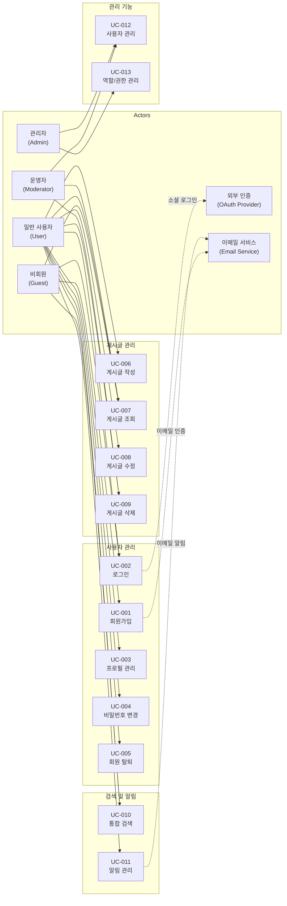
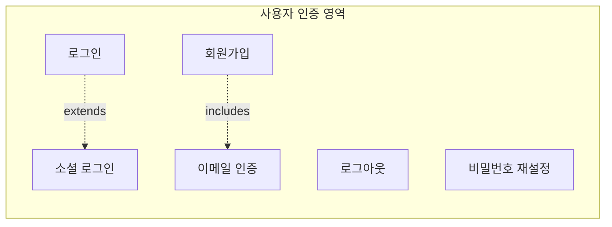
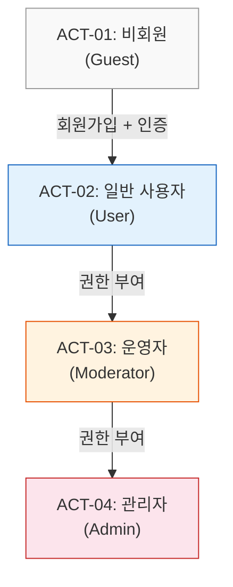

# 유스케이스 명세서

> Use Case Specification

---

## 문서 정보

| 항목 | 내용 |
|------|------|
| 프로젝트명 | [placeholder: 프로젝트명] |
| 문서 번호 | UCS-[placeholder: 문서번호] |
| 버전 | [placeholder: 버전 (예: 1.0.0)] |
| 작성일 | [placeholder: YYYY-MM-DD] |
| 작성자 | [placeholder: 작성자명 / 소속] |

---

## 변경 이력

| 버전 | 날짜 | 변경 내용 | 작성자 | 승인자 |
|------|------|-----------|--------|--------|
| 0.1 | [placeholder] | 초안 작성 | [placeholder] | - |
| 0.2 | [placeholder] | [placeholder: 변경 내용 요약] | [placeholder] | - |
| 1.0 | [placeholder] | 최종 승인 | [placeholder] | [placeholder] |

---

## 목차

1. [유스케이스 다이어그램](#1-유스케이스-다이어그램)
2. [액터 정의](#2-액터-정의)
3. [유스케이스 목록](#3-유스케이스-목록)
4. [유스케이스 상세 명세](#4-유스케이스-상세-명세)

---

## 1. 유스케이스 다이어그램

### 1.1 전체 시스템 유스케이스 다이어그램

### 1.2 기능 영역별 유스케이스 다이어그램

> [placeholder: 프로젝트 규모에 따라 기능 영역별로 세분화된 다이어그램을 추가한다.]

---

## 2. 액터 정의

### 2.1 주요 액터 (Primary Actors)

| Actor ID | 이름 | 설명 | 권한 수준 | 인증 여부 |
|----------|------|------|-----------|-----------|
| ACT-01 | 비회원 (Guest) | 시스템에 가입하지 않았거나 로그인하지 않은 사용자. 공개 콘텐츠 조회 및 회원가입만 가능. | Level 0 (최소) | 미인증 |
| ACT-02 | 일반 사용자 (User) | 회원가입 후 이메일 인증을 완료한 사용자. 자신의 콘텐츠에 대한 CRUD 수행 가능. | Level 1 (기본) | 인증됨 |
| ACT-03 | 운영자 (Moderator) | 콘텐츠 관리 권한을 가진 사용자. 다른 사용자의 게시글 관리 및 사용자 제재 가능. | Level 2 (관리) | 인증됨 |
| ACT-04 | 관리자 (Admin) | 시스템 전반의 관리 권한을 가진 사용자. 역할 부여, 시스템 설정 변경 가능. | Level 3 (최고) | 인증됨 |
| [placeholder] | [placeholder] | [placeholder] | [placeholder] | [placeholder] |

### 2.2 보조 액터 (Secondary Actors)

| Actor ID | 이름 | 설명 | 연동 방식 |
|----------|------|------|-----------|
| ACT-S01 | OAuth Provider | 소셜 로그인 인증을 제공하는 외부 서비스 (Google, Kakao 등) | OAuth 2.0 |
| ACT-S02 | 이메일 서비스 | 인증 메일, 알림 메일을 발송하는 외부 서비스 | REST API |
| ACT-S03 | 파일 스토리지 | 첨부 파일을 저장/관리하는 외부 서비스 | SDK / API |
| [placeholder] | [placeholder] | [placeholder] | [placeholder] |

### 2.3 액터 계층 구조

> 상위 액터는 하위 액터의 모든 권한을 포함한다.

---

## 3. 유스케이스 목록

| UC-ID | 유스케이스명 | 주요 액터 | 우선순위 | 상태 | 관련 FR |
|-------|-------------|-----------|----------|------|---------|
| UC-001 | 회원가입 | 비회원 (Guest) | P1 필수 | 완료 | FR-001 |
| UC-002 | 로그인 | 비회원/사용자 | P1 필수 | 완료 | FR-002 |
| UC-003 | 프로필 관리 | 일반 사용자 | P2 권장 | 초안 | FR-003 |
| UC-004 | 비밀번호 변경 | 일반 사용자 | P2 권장 | 초안 | FR-003 |
| UC-005 | 회원 탈퇴 | 일반 사용자 | P2 권장 | 초안 | FR-003 |
| UC-006 | 게시글 작성 | 일반 사용자 | P1 필수 | 완료 | FR-005 |
| UC-007 | 게시글 조회 | 모든 사용자 | P1 필수 | 초안 | FR-005 |
| UC-008 | 게시글 수정 | 일반 사용자 | P1 필수 | 초안 | FR-005 |
| UC-009 | 게시글 삭제 | 일반 사용자/운영자 | P1 필수 | 초안 | FR-005 |
| UC-010 | 통합 검색 | 모든 사용자 | P2 권장 | 초안 | FR-006 |
| UC-011 | 알림 관리 | 일반 사용자 | P2 권장 | 초안 | FR-007 |
| UC-012 | 사용자 관리 | 운영자/관리자 | P1 필수 | 초안 | FR-004 |
| UC-013 | 역할/권한 관리 | 관리자 | P1 필수 | 초안 | FR-004 |
| [placeholder] | [placeholder] | [placeholder] | [placeholder] | [placeholder] | [placeholder] |

**상태 정의:**

| 상태 | 설명 |
|------|------|
| 초안 | 최초 작성, 검토 필요 |
| 검토중 | 이해관계자 검토 진행 중 |
| 완료 | 검토 완료 및 승인됨 |
| 변경중 | 승인 후 변경 사항 발생 |

---

## 4. 유스케이스 상세 명세

---

### 4.1 UC-001: 회원가입

| 항목 | 내용 |
|------|------|
| **UC-ID** | UC-001 |
| **유스케이스명** | 회원가입 |
| **액터** | 비회원 (Guest), 이메일 서비스 (Secondary) |
| **설명** | 비회원 사용자가 이메일 주소와 필수 정보를 입력하여 시스템에 회원으로 가입한다. 이메일 인증을 통해 본인 확인을 완료한 후 시스템을 이용할 수 있다. |
| **우선순위** | P1 필수 |
| **트리거** | 사용자가 회원가입 화면에 접근한다 |
| **관련 요구사항** | FR-001 |

#### 사전 조건 (Pre-conditions)

1. 사용자는 시스템에 로그인하지 않은 상태이다.
2. 사용자는 유효한 이메일 주소를 보유하고 있다.
3. 이메일 발송 서비스가 정상 동작 중이다.

#### 기본 흐름 (Main Flow)

| 단계 | 액터 | 시스템 |
|------|------|--------|
| 1 | 사용자가 회원가입 페이지에 접근한다. | 회원가입 폼을 표시한다. |
| 2 | 사용자가 이메일 주소를 입력한다. | - |
| 3 | 사용자가 비밀번호를 입력한다. | 비밀번호 강도 표시기를 실시간으로 업데이트한다. |
| 4 | 사용자가 비밀번호 확인을 입력한다. | 비밀번호 일치 여부를 실시간 검증한다. |
| 5 | 사용자가 이름을 입력한다. | - |
| 6 | 사용자가 서비스 이용약관과 개인정보 처리방침에 동의한다. | 약관 내용 조회 링크를 제공한다. |
| 7 | 사용자가 [가입하기] 버튼을 클릭한다. | - |
| 8 | - | 입력 데이터의 유효성을 검증한다. |
| 9 | - | 이메일 중복 여부를 확인한다. |
| 10 | - | 비밀번호를 해시 처리하여 사용자 레코드를 생성한다 (상태: PENDING_VERIFICATION). |
| 11 | - | 이메일 인증 토큰을 생성한다 (유효기간: 24시간). |
| 12 | - | 인증 링크가 포함된 이메일을 발송한다. |
| 13 | - | "인증 이메일이 발송되었습니다" 안내 화면을 표시한다. |
| 14 | 사용자가 이메일에서 인증 링크를 클릭한다. | - |
| 15 | - | 인증 토큰의 유효성을 검증한다. |
| 16 | - | 사용자 상태를 ACTIVE로 변경한다. |
| 17 | - | "이메일 인증이 완료되었습니다" 메시지와 로그인 페이지 링크를 표시한다. |

#### 대안 흐름 (Alternative Flow)

**AF-001-01: 마케팅 수신 동의**

- 분기 시점: 단계 6 이후
- 사용자가 마케팅 수신 동의 체크박스를 선택한다 (선택사항).
- 동의 여부를 사용자 레코드에 저장한다.
- 기본 흐름 단계 7로 복귀한다.

**AF-001-02: 인증 이메일 재발송**

- 분기 시점: 단계 13 이후
- 사용자가 인증 이메일을 수신하지 못한 경우, [인증 이메일 재발송] 버튼을 클릭한다.
- 시스템은 마지막 발송 시점으로부터 60초가 경과했는지 확인한다.
- 60초 경과: 새로운 인증 토큰을 생성하고 이메일을 재발송한다.
- 60초 미경과: "잠시 후 다시 시도해주세요" 안내를 표시한다.

#### 예외 흐름 (Exception Flow)

**EF-001-01: 이메일 중복**

- 분기 시점: 단계 9
- 조건: 입력한 이메일이 이미 등록되어 있다.
- 시스템은 "이미 등록된 이메일입니다" 오류 메시지를 표시한다.
- 사용자에게 로그인 페이지 이동 또는 비밀번호 찾기 링크를 제공한다.
- 유스케이스 종료.

**EF-001-02: 유효성 검증 실패**

- 분기 시점: 단계 8
- 조건: 입력 데이터가 유효성 검증 규칙을 통과하지 못한다.
- 시스템은 필드별 오류 메시지를 표시한다 (예: "비밀번호는 8자 이상이어야 합니다").
- 사용자는 오류를 수정하고 다시 제출한다.
- 기본 흐름 단계 7로 복귀한다.

**EF-001-03: 인증 토큰 만료**

- 분기 시점: 단계 15
- 조건: 인증 링크의 토큰이 만료되었다 (24시간 초과).
- 시스템은 "인증 링크가 만료되었습니다" 메시지를 표시한다.
- [인증 이메일 재발송] 버튼을 제공한다.
- 유스케이스 종료 (재발송 시 AF-001-02로 이동).

**EF-001-04: 이메일 발송 실패**

- 분기 시점: 단계 12
- 조건: 이메일 발송 서비스 장애로 인해 메일 발송에 실패한다.
- 시스템은 "이메일 발송 중 오류가 발생했습니다. 잠시 후 다시 시도해주세요" 메시지를 표시한다.
- 발송 실패 로그를 기록하고, 재발송 큐에 등록한다.
- 유스케이스 종료 (재시도 가능).

#### 사후 조건 (Post-conditions)

**성공 시:**

1. 새로운 사용자 레코드가 생성되어 있다 (상태: ACTIVE).
2. 비밀번호는 bcrypt 해시로 저장되어 있다.
3. 사용자에게 기본 역할(USER)이 부여되어 있다.
4. 회원가입 완료 감사 로그가 기록되어 있다.

**실패 시:**

1. 사용자 레코드가 생성되지 않았거나, PENDING_VERIFICATION 상태로 남아있다.
2. 오류 원인에 따른 안내 메시지가 사용자에게 표시되었다.

#### 비즈니스 규칙

| 규칙 ID | 내용 |
|---------|------|
| BR-001-01 | 이메일 주소는 시스템 내에서 고유해야 한다 |
| BR-001-02 | 비밀번호는 최소 8자 이상이며 대문자, 소문자, 숫자, 특수문자를 각 1개 이상 포함해야 한다 |
| BR-001-03 | 이메일 인증 토큰의 유효기간은 24시간이다 |
| BR-001-04 | 인증 이메일 재발송 간격은 최소 60초이다 |
| BR-001-05 | 서비스 이용약관과 개인정보 처리방침 동의는 필수이다 |
| BR-001-06 | 탈퇴 후 재가입 시 이전 데이터는 복구되지 않는다 |

#### UI 참조

| 화면 ID | 화면명 | 설명 |
|---------|--------|------|
| SCR-02 | 회원가입 폼 | 이메일, 비밀번호, 이름 입력 폼 |
| SCR-02-01 | 이메일 인증 안내 | 인증 이메일 발송 안내 화면 |
| SCR-02-02 | 이메일 인증 완료 | 인증 완료 및 로그인 안내 화면 |

#### 관련 요구사항 ID (RTM)

| 요구사항 ID | 설계 문서 | 테스트케이스 |
|------------|----------|-------------|
| FR-001 | [placeholder: 설계 문서 참조] | TC-001-01 ~ TC-001-06 |
| NFR-004 | [placeholder: 보안 설계 참조] | TC-SEC-001 |
| NFR-005 | [placeholder: 암호화 설계 참조] | TC-SEC-002 |

---

### 4.2 UC-002: 로그인

| 항목 | 내용 |
|------|------|
| **UC-ID** | UC-002 |
| **유스케이스명** | 로그인 |
| **액터** | 비회원/사용자, OAuth Provider (Secondary) |
| **설명** | 등록된 사용자가 이메일/비밀번호 또는 소셜 계정을 통해 시스템에 인증하여 자신의 계정에 접근한다. |
| **우선순위** | P1 필수 |
| **트리거** | 사용자가 로그인 화면에 접근한다 |
| **관련 요구사항** | FR-002 |

#### 사전 조건 (Pre-conditions)

1. 사용자는 시스템에 회원가입이 완료된 상태이다 (상태: ACTIVE).
2. 사용자는 현재 로그인하지 않은 상태이다.
3. (소셜 로그인의 경우) 해당 OAuth Provider 서비스가 정상 동작 중이다.

#### 기본 흐름 (Main Flow)

| 단계 | 액터 | 시스템 |
|------|------|--------|
| 1 | 사용자가 로그인 페이지에 접근한다. | 로그인 폼을 표시한다 (이메일/비밀번호 입력, 소셜 로그인 버튼 포함). |
| 2 | 사용자가 이메일 주소를 입력한다. | - |
| 3 | 사용자가 비밀번호를 입력한다. | - |
| 4 | 사용자가 [로그인] 버튼을 클릭한다. | - |
| 5 | - | 이메일로 사용자를 조회한다. |
| 6 | - | 사용자 계정 상태를 확인한다 (ACTIVE, 잠금 여부). |
| 7 | - | 입력된 비밀번호와 저장된 해시를 비교하여 검증한다. |
| 8 | - | 로그인 실패 횟수를 초기화한다. |
| 9 | - | Access Token (JWT)을 발급한다. |
| 10 | - | Refresh Token을 발급하고 저장한다. |
| 11 | - | 로그인 이력을 기록한다 (IP, User-Agent, 시간). |
| 12 | - | 메인 페이지로 리다이렉트한다. |

#### 대안 흐름 (Alternative Flow)

**AF-002-01: 소셜 로그인 (OAuth)**

- 분기 시점: 단계 1 이후 (소셜 로그인 버튼 클릭)
- 단계:

| 단계 | 액터 | 시스템 |
|------|------|--------|
| A1 | 사용자가 소셜 로그인 버튼([placeholder: Google / Kakao / Naver])을 클릭한다. | - |
| A2 | - | OAuth Provider의 인증 페이지로 리다이렉트한다. |
| A3 | 사용자가 OAuth Provider에서 인증 및 권한을 승인한다. | - |
| A4 | - | OAuth Provider로부터 Authorization Code를 수신한다. |
| A5 | - | Authorization Code를 사용하여 Access Token을 요청한다. |
| A6 | - | Token으로 사용자 프로필 정보(이메일, 이름)를 조회한다. |
| A7 | - | 이메일로 기존 사용자 매칭을 시도한다. |
| A8-a | (기존 사용자) | 소셜 계정을 기존 계정에 연동하고, 기본 흐름 단계 9로 이동한다. |
| A8-b | (신규 사용자) | 소셜 정보로 자동 회원가입을 수행한다 (이메일 인증 생략, 상태: ACTIVE). 기본 흐름 단계 9로 이동한다. |

**AF-002-02: 자동 로그인 (Remember Me)**

- 분기 시점: 단계 4 이전
- 사용자가 "자동 로그인" 체크박스를 선택한다.
- Refresh Token 유효기간을 연장한다 ([placeholder: e.g., 30일]).
- 기본 흐름 단계 4로 복귀한다.

**AF-002-03: 비밀번호 찾기**

- 분기 시점: 단계 1 이후 ([비밀번호 찾기] 링크 클릭)
- 단계:

| 단계 | 액터 | 시스템 |
|------|------|--------|
| A1 | 사용자가 [비밀번호 찾기] 링크를 클릭한다. | 비밀번호 재설정 화면을 표시한다. |
| A2 | 사용자가 가입 이메일을 입력하고 [발송] 버튼을 클릭한다. | - |
| A3 | - | 이메일로 사용자 존재 여부를 확인한다 (존재 여부와 관계없이 동일한 응답 표시 — 보안). |
| A4 | - | (사용자 존재 시) 비밀번호 재설정 링크가 포함된 이메일을 발송한다 (유효기간: 1시간). |
| A5 | - | "입력하신 이메일로 비밀번호 재설정 링크를 발송했습니다" 안내를 표시한다. |
| A6 | 사용자가 이메일의 재설정 링크를 클릭한다. | 비밀번호 재설정 폼을 표시한다. |
| A7 | 사용자가 새 비밀번호를 입력하고 확인한다. | 비밀번호 정책 검증 후 변경. 모든 기존 세션 무효화. |

#### 예외 흐름 (Exception Flow)

**EF-002-01: 인증 실패 (비밀번호 불일치)**

- 분기 시점: 단계 7
- 조건: 입력한 비밀번호가 저장된 해시와 일치하지 않는다.
- 시스템은 로그인 실패 횟수를 1 증가시킨다.
- "이메일 또는 비밀번호가 올바르지 않습니다" 오류를 표시한다 (보안: 어떤 필드가 잘못되었는지 특정하지 않음).
- 남은 시도 횟수를 안내한다 ([placeholder: 표시 / 미표시]).
- 유스케이스 종료 (재시도 가능).

**EF-002-02: 계정 잠금**

- 분기 시점: 단계 6 또는 EF-002-01 이후
- 조건: 로그인 실패 횟수가 5회 이상이다.
- 시스템은 계정을 잠금 처리한다 (잠금 기간: 30분).
- "계정이 잠겼습니다. 30분 후에 다시 시도하거나 비밀번호를 재설정하세요" 메시지를 표시한다.
- 보안 이벤트를 기록한다 (계정 잠금).
- 유스케이스 종료.

**EF-002-03: 이메일 미인증 계정**

- 분기 시점: 단계 6
- 조건: 사용자 계정 상태가 PENDING_VERIFICATION이다.
- "이메일 인증이 완료되지 않았습니다" 메시지를 표시한다.
- [인증 이메일 재발송] 버튼을 제공한다.
- 유스케이스 종료.

**EF-002-04: 사용자 미존재**

- 분기 시점: 단계 5
- 조건: 입력한 이메일로 등록된 사용자가 없다.
- "이메일 또는 비밀번호가 올바르지 않습니다" 동일한 오류를 표시한다 (보안: 이메일 존재 여부 노출 방지).
- 유스케이스 종료 (재시도 가능).

**EF-002-05: OAuth Provider 오류**

- 분기 시점: AF-002-01 단계 A4~A6
- 조건: OAuth Provider 서비스 장애 또는 사용자 권한 거부.
- "소셜 로그인 처리 중 오류가 발생했습니다. 다른 로그인 방법을 시도해주세요" 메시지를 표시한다.
- 기본 로그인 폼으로 복귀한다.

#### 사후 조건 (Post-conditions)

**성공 시:**

1. 사용자에게 유효한 Access Token과 Refresh Token이 발급되어 있다.
2. 로그인 이력이 기록되어 있다 (IP, User-Agent, 시간).
3. 로그인 실패 횟수가 0으로 초기화되어 있다.
4. 사용자가 인증된 상태로 메인 페이지에 접근한 상태이다.

**실패 시:**

1. Token이 발급되지 않았다.
2. 로그인 실패 이력이 기록되어 있다.
3. (잠금 시) 계정 잠금 이벤트가 기록되어 있다.

#### 비즈니스 규칙

| 규칙 ID | 내용 |
|---------|------|
| BR-002-01 | 로그인 5회 연속 실패 시 계정을 30분간 잠금 처리한다 |
| BR-002-02 | 인증 오류 메시지는 이메일/비밀번호를 구분하지 않는다 (보안) |
| BR-002-03 | Access Token 유효기간: [placeholder: e.g., 1시간] |
| BR-002-04 | Refresh Token 유효기간: [placeholder: e.g., 14일] (자동 로그인: [placeholder: e.g., 30일]) |
| BR-002-05 | Refresh Token rotation 정책을 적용한다 |
| BR-002-06 | 소셜 로그인 시 최초 연동이면 자동 회원가입 처리한다 |
| BR-002-07 | 동시 로그인 정책: [placeholder: 허용 / 최근 세션만 유지 / 기기별 허용] |

#### UI 참조

| 화면 ID | 화면명 | 설명 |
|---------|--------|------|
| SCR-01 | 로그인 폼 | 이메일/비밀번호 입력, 소셜 로그인 버튼, 자동 로그인 체크박스 |
| SCR-01-01 | 비밀번호 찾기 | 이메일 입력 및 재설정 안내 |
| SCR-01-02 | 비밀번호 재설정 | 새 비밀번호 입력 폼 |

#### 관련 요구사항 ID (RTM)

| 요구사항 ID | 설계 문서 | 테스트케이스 |
|------------|----------|-------------|
| FR-002 | [placeholder: 설계 문서 참조] | TC-002-01 ~ TC-002-10 |
| NFR-004 | [placeholder: 보안 설계 참조] | TC-SEC-003, TC-SEC-004 |
| NFR-006 | [placeholder: 감사 로깅 설계 참조] | TC-LOG-001 |

---

### 4.3 UC-006: 게시글 CRUD

| 항목 | 내용 |
|------|------|
| **UC-ID** | UC-006 / UC-007 / UC-008 / UC-009 |
| **유스케이스명** | 게시글 관리 (작성 / 조회 / 수정 / 삭제) |
| **액터** | 일반 사용자, 운영자, 파일 스토리지 (Secondary) |
| **설명** | 인증된 사용자가 게시글을 작성, 조회, 수정, 삭제할 수 있다. 작성 시 파일 첨부가 가능하며, 수정/삭제 시 작성자 본인 또는 운영자 이상의 권한이 필요하다. |
| **우선순위** | P1 필수 |
| **트리거** | 사용자가 게시글 관련 기능에 접근한다 |
| **관련 요구사항** | FR-005 |

#### 사전 조건 (Pre-conditions)

1. (작성/수정/삭제) 사용자는 로그인한 상태이다.
2. (수정/삭제) 대상 게시글이 존재한다.
3. (수정/삭제) 사용자는 해당 게시글의 작성자이거나 운영자(MODERATOR) 이상의 권한을 가지고 있다.
4. (조회) 게시글의 공개 설정에 따른 접근 권한을 가지고 있다.

#### 기본 흐름 — 게시글 작성 (Create)

| 단계 | 액터 | 시스템 |
|------|------|--------|
| 1 | 사용자가 [글 쓰기] 버튼을 클릭한다. | 게시글 작성 폼을 표시한다 (Rich Text 에디터 포함). |
| 2 | 사용자가 카테고리를 선택한다. | 사용 가능한 카테고리 목록을 표시한다. |
| 3 | 사용자가 제목을 입력한다. | - |
| 4 | 사용자가 본문을 작성한다 (Rich Text). | 에디터 도구 모음을 제공한다 (텍스트 서식, 이미지 삽입, 링크 등). |
| 5 | 사용자가 태그를 입력한다 (선택). | 태그 자동 완성을 제공한다. |
| 6 | 사용자가 공개 범위를 설정한다. | 공개(PUBLIC), 비공개(PRIVATE), 회원 전용(MEMBERS_ONLY) 옵션을 제공한다. |
| 7 | 사용자가 [게시] 버튼을 클릭한다. | - |
| 8 | - | 입력 데이터 유효성을 검증한다. |
| 9 | - | 본문에 대해 XSS 방지 HTML sanitize를 수행한다. |
| 10 | - | 게시글 레코드를 생성한다. |
| 11 | - | 관련 사용자에게 알림을 발송한다 (해당 카테고리 구독자 등). |
| 12 | - | 작성된 게시글 상세 페이지로 리다이렉트한다. |

#### 대안 흐름 (Alternative Flow)

**AF-006-01: 파일 첨부**

- 분기 시점: 단계 4~6 사이
- 단계:

| 단계 | 액터 | 시스템 |
|------|------|--------|
| A1 | 사용자가 [파일 첨부] 버튼을 클릭하거나 드래그 앤 드롭으로 파일을 추가한다. | 파일 선택 대화 상자를 표시한다. |
| A2 | - | 파일 형식 및 크기를 검증한다 (허용 형식: [placeholder], 최대 [placeholder: e.g., 10MB/파일], 총 [placeholder: e.g., 50MB]). |
| A3 | - | 파일을 임시 스토리지에 업로드한다. |
| A4 | - | 업로드 진행률을 표시한다. |
| A5 | - | 업로드 완료 후 미리보기를 표시한다 (이미지의 경우 썸네일). |
| A6 | - | 게시글 저장 시 파일을 영구 스토리지로 이동하고 게시글에 연결한다. |

- 기본 흐름으로 복귀한다.

**AF-006-02: 임시 저장**

- 분기 시점: 단계 7 대신
- 사용자가 [임시 저장] 버튼을 클릭한다.
- 시스템은 게시글을 DRAFT 상태로 저장한다.
- "임시 저장되었습니다" 안내를 표시한다.
- 유스케이스 종료 (나중에 재편집 가능).

**AF-006-03: 게시글 수정 (Update)**

- 트리거: 사용자가 자신의 게시글 상세 페이지에서 [수정] 버튼을 클릭한다.
- 단계:

| 단계 | 액터 | 시스템 |
|------|------|--------|
| A1 | 사용자가 게시글 상세에서 [수정] 버튼을 클릭한다. | 작성자 또는 운영자 이상인지 권한을 확인한다. |
| A2 | - | 기존 게시글 데이터가 채워진 수정 폼을 표시한다. |
| A3 | 사용자가 원하는 필드를 수정한다. | - |
| A4 | 사용자가 [수정 완료] 버튼을 클릭한다. | - |
| A5 | - | 수정 데이터의 유효성을 검증한다. |
| A6 | - | 수정 이력을 기록한다 (변경 전/후 데이터). |
| A7 | - | 게시글을 업데이트한다. |
| A8 | - | 수정된 게시글 상세 페이지를 표시한다. |

**AF-006-04: 게시글 삭제 (Delete)**

- 트리거: 사용자가 게시글 상세 페이지에서 [삭제] 버튼을 클릭한다.
- 단계:

| 단계 | 액터 | 시스템 |
|------|------|--------|
| A1 | 사용자가 [삭제] 버튼을 클릭한다. | 작성자 또는 운영자 이상인지 권한을 확인한다. |
| A2 | - | "정말 삭제하시겠습니까?" 확인 대화 상자를 표시한다. |
| A3 | 사용자가 [확인]을 클릭한다. | - |
| A4 | - | 게시글을 소프트 삭제 처리한다 (deleted_at 타임스탬프 설정). |
| A5 | - | 첨부 파일 삭제를 예약한다 (30일 후 물리 삭제). |
| A6 | - | 삭제 감사 로그를 기록한다. |
| A7 | - | 게시글 목록 페이지로 리다이렉트한다. |

#### 예외 흐름 (Exception Flow)

**EF-006-01: 권한 부족**

- 분기 시점: AF-006-03 A1 또는 AF-006-04 A1
- 조건: 사용자가 게시글의 작성자가 아니며 운영자 이상의 권한도 없다.
- "이 게시글을 수정/삭제할 권한이 없습니다" 오류를 표시한다.
- 유스케이스 종료.

**EF-006-02: 파일 업로드 실패**

- 분기 시점: AF-006-01 A3
- 조건: 파일 크기 초과, 허용되지 않는 형식, 스토리지 오류 등.
- 실패 원인에 따른 오류 메시지를 표시한다.
- 사용자는 파일을 제거하거나 다른 파일로 교체할 수 있다.
- 기본 흐름으로 복귀 가능.

**EF-006-03: 게시글 미존재**

- 분기 시점: 조회, 수정, 삭제 시도 시
- 조건: 요청한 게시글이 존재하지 않거나 이미 삭제되었다.
- "게시글을 찾을 수 없습니다" 메시지를 표시한다.
- 게시글 목록 페이지 링크를 제공한다.
- 유스케이스 종료.

**EF-006-04: 유효성 검증 실패**

- 분기 시점: 기본 흐름 단계 8 또는 AF-006-03 A5
- 조건: 제목 미입력, 본문 길이 초과 등.
- 필드별 오류 메시지를 표시한다.
- 사용자는 오류를 수정하고 다시 제출한다.

#### 사후 조건 (Post-conditions)

**작성 성공 시:**

1. 새로운 게시글 레코드가 생성되어 있다.
2. 첨부 파일이 영구 스토리지에 저장되어 있다 (있는 경우).
3. 게시글 생성 감사 로그가 기록되어 있다.
4. 구독자에게 알림이 발송되어 있다 (해당 시).

**수정 성공 시:**

1. 게시글 데이터가 업데이트되어 있다.
2. 수정 이력이 기록되어 있다 (변경 전/후).

**삭제 성공 시:**

1. 게시글에 deleted_at 타임스탬프가 설정되어 있다 (소프트 삭제).
2. 목록 조회 시 해당 게시글이 표시되지 않는다.
3. 첨부 파일 물리 삭제가 예약되어 있다.
4. 삭제 감사 로그가 기록되어 있다.

#### 비즈니스 규칙

| 규칙 ID | 내용 |
|---------|------|
| BR-006-01 | 게시글 작성자 본인 또는 MODERATOR 이상 권한자만 수정/삭제 가능 |
| BR-006-02 | 삭제는 소프트 삭제로 처리하며, 30일 후 물리 삭제 |
| BR-006-03 | 본문은 XSS 방지를 위한 HTML sanitize 적용 필수 |
| BR-006-04 | 첨부 파일은 바이러스 스캔 후 저장 |
| BR-006-05 | 게시글 목록은 페이지네이션 적용 (기본 20건/페이지) |
| BR-006-06 | 조회수 중복 방지 로직 적용 ([placeholder: IP 기반 / 사용자 기반 / 시간 기반]) |
| BR-006-07 | 운영자가 삭제한 경우, 게시글에 "관리자에 의해 삭제됨" 표시 |

#### UI 참조

| 화면 ID | 화면명 | 설명 |
|---------|--------|------|
| SCR-04 | 게시글 목록 | 게시글 목록, 필터, 정렬, 페이지네이션 |
| SCR-05 | 게시글 상세 | 게시글 조회, 첨부 파일, 수정/삭제 버튼 |
| SCR-06 | 게시글 작성/수정 | Rich Text 에디터, 파일 첨부, 카테고리/태그 선택 |

#### 관련 요구사항 ID (RTM)

| 요구사항 ID | 설계 문서 | 테스트케이스 |
|------------|----------|-------------|
| FR-005 | [placeholder: 설계 문서 참조] | TC-006-01 ~ TC-006-15 |
| FR-004 | [placeholder: 권한 설계 참조] | TC-AUTH-005 |
| NFR-001 | [placeholder: 성능 설계 참조] | TC-PERF-003 |
| NFR-005 | [placeholder: 보안 설계 참조] | TC-SEC-005 |

---

### 4.4 유스케이스 상세 명세 템플릿 (추가 작성용)

> [placeholder: 아래 템플릿을 복사하여 프로젝트 고유의 유스케이스를 추가한다.]

---

#### UC-[placeholder: ID]: [placeholder: 유스케이스명]

| 항목 | 내용 |
|------|------|
| **UC-ID** | UC-[placeholder] |
| **유스케이스명** | [placeholder] |
| **액터** | [placeholder: 주요 액터, 보조 액터] |
| **설명** | [placeholder: 유스케이스에 대한 간략한 설명] |
| **우선순위** | [placeholder: P1 필수 / P2 권장 / P3 선택] |
| **트리거** | [placeholder: 유스케이스를 시작하는 이벤트] |
| **관련 요구사항** | [placeholder: FR-ID] |

**사전 조건 (Pre-conditions):**

1. [placeholder: 유스케이스 시작 전 충족되어야 하는 조건]

**기본 흐름 (Main Flow):**

| 단계 | 액터 | 시스템 |
|------|------|--------|
| 1 | [placeholder] | [placeholder] |
| 2 | [placeholder] | [placeholder] |

**대안 흐름 (Alternative Flow):**

- **AF-[placeholder]-01: [placeholder: 대안 흐름 이름]**
  - 분기 시점: [placeholder]
  - [placeholder: 대안 흐름 설명]

**예외 흐름 (Exception Flow):**

- **EF-[placeholder]-01: [placeholder: 예외 흐름 이름]**
  - 분기 시점: [placeholder]
  - 조건: [placeholder]
  - [placeholder: 예외 처리 설명]

**사후 조건 (Post-conditions):**

- 성공 시: [placeholder]
- 실패 시: [placeholder]

**비즈니스 규칙:**

| 규칙 ID | 내용 |
|---------|------|
| BR-[placeholder]-01 | [placeholder] |

**UI 참조:**

| 화면 ID | 화면명 | 설명 |
|---------|--------|------|
| [placeholder] | [placeholder] | [placeholder] |

**관련 요구사항 ID (RTM):**

| 요구사항 ID | 설계 문서 | 테스트케이스 |
|------------|----------|-------------|
| [placeholder] | [placeholder] | [placeholder] |

---

## 부록

### 부록 A: 유스케이스 간 관계 요약

| 유스케이스 | 관계 유형 | 대상 유스케이스 | 설명 |
|-----------|-----------|---------------|------|
| UC-001 회원가입 | includes | 이메일 인증 | 회원가입 시 이메일 인증 필수 |
| UC-002 로그인 | extends | 소셜 로그인 | 소셜 로그인은 자체 로그인의 대안 |
| UC-002 로그인 | extends | 비밀번호 찾기 | 비밀번호 분실 시 재설정 |
| UC-006 게시글 작성 | extends | 파일 업로드 | 작성 시 파일 첨부 가능 |
| UC-006 게시글 작성 | extends | 임시 저장 | 작성 도중 임시 저장 가능 |
| UC-008 게시글 수정 | includes | 권한 검증 | 수정 전 권한 확인 필수 |
| UC-009 게시글 삭제 | includes | 권한 검증 | 삭제 전 권한 확인 필수 |
| [placeholder] | [placeholder] | [placeholder] | [placeholder] |

### 부록 B: 비즈니스 규칙 종합 목록

| 규칙 ID | 관련 UC | 내용 |
|---------|---------|------|
| BR-001-01 | UC-001 | 이메일 주소는 시스템 내에서 고유해야 한다 |
| BR-001-02 | UC-001 | 비밀번호는 최소 8자, 대/소문자, 숫자, 특수문자 포함 |
| BR-002-01 | UC-002 | 로그인 5회 연속 실패 시 30분 잠금 |
| BR-002-02 | UC-002 | 인증 오류 메시지는 이메일/비밀번호 구분 불가 |
| BR-006-01 | UC-006~009 | 작성자 본인 또는 MODERATOR 이상만 수정/삭제 가능 |
| BR-006-02 | UC-009 | 소프트 삭제 후 30일 경과 시 물리 삭제 |
| [placeholder] | [placeholder] | [placeholder] |

---

> **본 문서는 요구사항 명세서(SRS)와 함께 관리되며, 요구사항 변경 시 동시에 갱신한다.**
