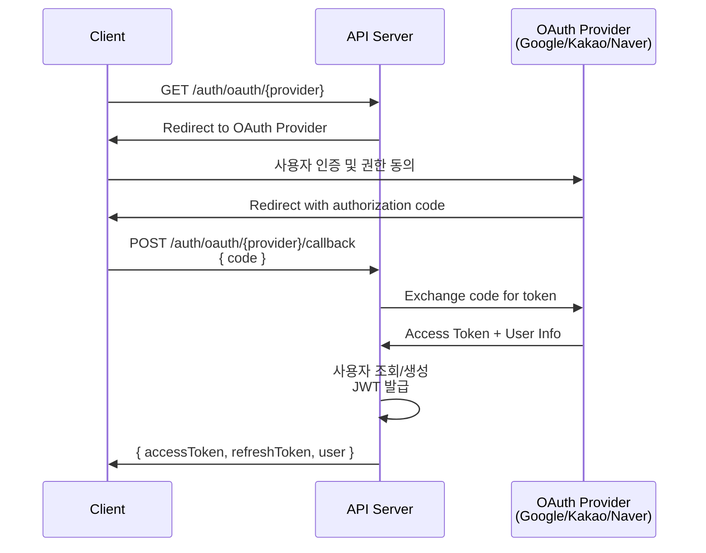

# API 설계서

| 항목 | 내용 |
|------|------|
| **프로젝트명** | [프로젝트명] |
| **문서 버전** | [v1.0] |
| **작성일** | [YYYY-MM-DD] |
| **작성자** | [작성자명 / 역할] |
| **승인자** | [승인자명 / 역할] |
| **문서 상태** | [초안 / 검토중 / 승인됨] |

---

## 1. API 설계 원칙

### 1.1 RESTful 설계 규칙

| 규칙 | 설명 | 예시 |
|------|------|------|
| 자원 중심 URL | URL은 자원(명사)을 표현, 행위(동사)는 HTTP Method로 표현 | `GET /users` (O), `GET /getUsers` (X) |
| 복수형 사용 | 컬렉션 자원은 복수형 | `/users`, `/posts`, `/comments` |
| 소문자 + 하이픈 | URL 경로는 소문자, 단어 구분은 하이픈(-) | `/user-profiles` (O), `/userProfiles` (X) |
| 계층 관계 표현 | 부모-자식 관계는 경로로 표현 | `/posts/{postId}/comments` |
| 필터/정렬/페이징 | Query Parameter 사용 | `?status=active&sort=created_at&order=desc` |
| 행위 자원 | 동사가 필요한 경우 명시적으로 사용 | `POST /auth/login`, `POST /auth/logout` |
| 슬래시 규칙 | 후행 슬래시 미사용 | `/users` (O), `/users/` (X) |

### 1.2 버저닝 전략

| 항목 | 내용 |
|------|------|
| 방식 | [URL Path 버저닝 / Header 버저닝 / Query Parameter] |
| 현재 버전 | `v1` |
| URL 패턴 | `/api/v1/[resource]` |
| 하위 호환성 | Minor 변경은 동일 버전 유지, Breaking Change 시 버전 업 |
| 지원 정책 | 이전 버전은 [N]개월간 유지 후 Deprecated |

### 1.3 네이밍 규칙

| 대상 | 규칙 | 예시 |
|------|------|------|
| URL 경로 | kebab-case, 복수형 명사 | `/user-profiles`, `/blog-posts` |
| Query Parameter | camelCase | `?pageSize=20&sortBy=createdAt` |
| Request/Response Body | camelCase | `{ "firstName": "...", "createdAt": "..." }` |
| Header | 표준 헤더 규칙 | `Authorization`, `Content-Type`, `X-Request-Id` |
| 에러 코드 | UPPER_SNAKE_CASE | `USER_NOT_FOUND`, `INVALID_TOKEN` |

### 1.4 변경 이력

| 버전 | 날짜 | 작성자 | 변경 내용 |
|------|------|--------|-----------|
| v0.1 | [YYYY-MM-DD] | [작성자] | 초안 작성 |
| v1.0 | [YYYY-MM-DD] | [작성자] | 최종 승인 |

---

## 2. 인증/인가

### 2.1 인증 방식

| 방식 | 용도 | 헤더 |
|------|------|------|
| Bearer Token (JWT) | 사용자 인증 (웹/모바일) | `Authorization: Bearer {access_token}` |
| API Key | 외부 시스템 연동 | `X-API-Key: {api_key}` |
| OAuth 2.0 | 소셜 로그인 | 표준 OAuth 2.0 플로우 |

### 2.2 JWT 토큰 구조

#### Access Token

| 항목 | 내용 |
|------|------|
| 알고리즘 | [HS256 / RS256] |
| 만료 시간 | [15분 / 30분 / 1시간] |
| Payload 필드 | `sub` (userId), `email`, `roles`, `iat`, `exp` |

#### Refresh Token

| 항목 | 내용 |
|------|------|
| 저장 방식 | [HttpOnly Cookie / Secure Storage] |
| 만료 시간 | [7일 / 14일 / 30일] |
| 로테이션 | [사용 시 새 Refresh Token 발급 / 고정] |
| 무효화 | 로그아웃 시 서버측 블랙리스트 등록 |

### 2.3 OAuth 2.0 소셜 로그인 플로우



### 2.4 인가 (Authorization)

| 역할 | 접근 가능 자원 | 설명 |
|------|---------------|------|
| `anonymous` | 공개 API만 | 인증 불필요 |
| `user` | 자신의 자원 + 공개 자원 | 일반 사용자 |
| `editor` | 콘텐츠 관리 | 콘텐츠 편집 권한 |
| `admin` | 모든 자원 | 시스템 관리자 |
| [추가 역할] | [접근 범위] | [설명] |

---

## 3. 공통 규격

### 3.1 요청 포맷

#### 공통 요청 헤더

| 헤더 | 필수 | 설명 | 예시 |
|------|------|------|------|
| `Content-Type` | 필수 (Body 있을 때) | 요청 본문 형식 | `application/json` |
| `Authorization` | 조건부 | 인증 토큰 | `Bearer eyJhbGci...` |
| `Accept` | 선택 | 응답 형식 | `application/json` |
| `Accept-Language` | 선택 | 응답 언어 | `ko-KR`, `en-US` |
| `X-Request-Id` | 선택 | 요청 추적 ID | `550e8400-e29b-41d4-...` |

### 3.2 응답 포맷

#### 단일 자원 응답

```json
{
  "data": {
    "id": "550e8400-e29b-41d4-a716-446655440000",
    "email": "user@example.com",
    "name": "[사용자명]",
    "status": "active",
    "createdAt": "2025-01-15T09:30:00Z",
    "updatedAt": "2025-01-15T09:30:00Z"
  }
}
```

#### 목록 응답 (페이지네이션)

```json
{
  "data": [
    { "id": "...", "title": "...", "createdAt": "..." },
    { "id": "...", "title": "...", "createdAt": "..." }
  ],
  "pagination": {
    "page": 1,
    "pageSize": 20,
    "totalItems": 150,
    "totalPages": 8,
    "hasNext": true,
    "hasPrevious": false
  }
}
```

#### 페이지네이션 요청 파라미터

| 파라미터 | 타입 | 기본값 | 설명 |
|----------|------|--------|------|
| `page` | integer | 1 | 현재 페이지 (1부터 시작) |
| `pageSize` | integer | 20 | 페이지당 항목 수 (최대 [100]) |
| `sort` | string | `createdAt` | 정렬 기준 필드 |
| `order` | string | `desc` | 정렬 방향 (`asc` / `desc`) |

#### 커서 기반 페이지네이션 (선택)

```json
{
  "data": [ ... ],
  "pagination": {
    "cursor": "eyJpZCI6MTAwfQ==",
    "pageSize": 20,
    "hasNext": true
  }
}
```

#### 정렬

| 파라미터 | 설명 | 예시 |
|----------|------|------|
| `sort` | 정렬 필드 | `?sort=createdAt` |
| `order` | 정렬 방향 | `?order=desc` |
| 복수 정렬 | 쉼표 구분 | `?sort=status,-createdAt` (- 접두사는 DESC) |

#### 필터링

| 파라미터 | 설명 | 예시 |
|----------|------|------|
| 일치 | 값 일치 | `?status=active` |
| 다중 값 | 쉼표 구분 (OR 조건) | `?status=active,inactive` |
| 검색 | 키워드 검색 | `?q=검색어` |
| 범위 | 시작/종료 | `?createdFrom=2025-01-01&createdTo=2025-12-31` |

### 3.3 에러 응답 포맷

```json
{
  "error": {
    "code": "VALIDATION_ERROR",
    "message": "[사용자에게 표시할 메시지]",
    "details": [
      {
        "field": "email",
        "message": "[필드별 오류 메시지]",
        "value": "[입력값 (민감정보 제외)]"
      }
    ],
    "timestamp": "2025-01-15T09:30:00Z",
    "path": "/api/v1/users",
    "requestId": "550e8400-e29b-41d4-a716-446655440000"
  }
}
```

### 3.4 HTTP 상태 코드 사용 규칙

| 상태 코드 | 의미 | 사용 상황 |
|-----------|------|-----------|
| `200 OK` | 성공 | GET 조회 성공, PUT/PATCH 수정 성공 |
| `201 Created` | 생성 성공 | POST로 자원 생성 성공 |
| `204 No Content` | 성공 (응답 본문 없음) | DELETE 삭제 성공 |
| `400 Bad Request` | 잘못된 요청 | 유효성 검증 실패, 잘못된 파라미터 |
| `401 Unauthorized` | 인증 필요 | 토큰 없음, 토큰 만료 |
| `403 Forbidden` | 권한 없음 | 인증은 되었으나 접근 권한 부족 |
| `404 Not Found` | 자원 없음 | 요청한 자원이 존재하지 않음 |
| `409 Conflict` | 충돌 | 중복 데이터, 상태 충돌 |
| `422 Unprocessable Entity` | 처리 불가 | 비즈니스 규칙 위반 |
| `429 Too Many Requests` | 요청 초과 | Rate Limit 초과 |
| `500 Internal Server Error` | 서버 오류 | 예상치 못한 서버 오류 |
| `502 Bad Gateway` | 게이트웨이 오류 | 업스트림 서버 응답 불가 |
| `503 Service Unavailable` | 서비스 불가 | 서버 점검, 과부하 |

---

## 4. API 엔드포인트 목록

### 4.1 인증 API (Auth)

| Method | URL | 설명 | 인증 | 요청 Body | 성공 코드 |
|--------|-----|------|------|-----------|-----------|
| POST | `/api/v1/auth/register` | 회원 가입 | 불필요 | email, password, name | 201 |
| POST | `/api/v1/auth/login` | 로그인 | 불필요 | email, password | 200 |
| POST | `/api/v1/auth/logout` | 로그아웃 | Bearer | - | 204 |
| POST | `/api/v1/auth/refresh` | 토큰 갱신 | Refresh Token | refreshToken | 200 |
| POST | `/api/v1/auth/forgot-password` | 비밀번호 재설정 요청 | 불필요 | email | 200 |
| POST | `/api/v1/auth/reset-password` | 비밀번호 재설정 | 불필요 | token, newPassword | 200 |
| GET | `/api/v1/auth/verify-email` | 이메일 인증 | 불필요 | ?token=... | 200 |

### 4.2 사용자 API (Users)

| Method | URL | 설명 | 인증 | 요청 Body | 성공 코드 |
|--------|-----|------|------|-----------|-----------|
| GET | `/api/v1/users` | 사용자 목록 조회 | Bearer (Admin) | - | 200 |
| GET | `/api/v1/users/{userId}` | 사용자 상세 조회 | Bearer | - | 200 |
| GET | `/api/v1/users/me` | 내 정보 조회 | Bearer | - | 200 |
| PUT | `/api/v1/users/me` | 내 정보 수정 | Bearer | name, profileImageUrl | 200 |
| PATCH | `/api/v1/users/me/password` | 비밀번호 변경 | Bearer | currentPassword, newPassword | 200 |
| DELETE | `/api/v1/users/me` | 회원 탈퇴 | Bearer | password | 204 |
| PATCH | `/api/v1/users/{userId}/status` | 사용자 상태 변경 | Bearer (Admin) | status | 200 |
| GET | `/api/v1/users/{userId}/posts` | 사용자 게시글 목록 | Bearer | - | 200 |

### 4.3 게시글 API (Posts)

| Method | URL | 설명 | 인증 | 요청 Body | 성공 코드 |
|--------|-----|------|------|-----------|-----------|
| GET | `/api/v1/posts` | 게시글 목록 조회 | 선택 | - | 200 |
| POST | `/api/v1/posts` | 게시글 작성 | Bearer | title, content, categoryId, tagIds, status | 201 |
| GET | `/api/v1/posts/{postId}` | 게시글 상세 조회 | 선택 | - | 200 |
| PUT | `/api/v1/posts/{postId}` | 게시글 수정 | Bearer (작성자/Admin) | title, content, categoryId, tagIds | 200 |
| DELETE | `/api/v1/posts/{postId}` | 게시글 삭제 | Bearer (작성자/Admin) | - | 204 |
| PATCH | `/api/v1/posts/{postId}/status` | 게시글 상태 변경 | Bearer (작성자/Admin) | status | 200 |

### 4.4 댓글 API (Comments)

| Method | URL | 설명 | 인증 | 요청 Body | 성공 코드 |
|--------|-----|------|------|-----------|-----------|
| GET | `/api/v1/posts/{postId}/comments` | 댓글 목록 조회 | 선택 | - | 200 |
| POST | `/api/v1/posts/{postId}/comments` | 댓글 작성 | Bearer | content, parentId | 201 |
| PUT | `/api/v1/comments/{commentId}` | 댓글 수정 | Bearer (작성자) | content | 200 |
| DELETE | `/api/v1/comments/{commentId}` | 댓글 삭제 | Bearer (작성자/Admin) | - | 204 |

### 4.5 파일 API (Files)

| Method | URL | 설명 | 인증 | 요청 Body | 성공 코드 |
|--------|-----|------|------|-----------|-----------|
| POST | `/api/v1/files/upload` | 파일 업로드 | Bearer | multipart/form-data | 201 |
| GET | `/api/v1/files/{fileId}` | 파일 메타데이터 조회 | Bearer | - | 200 |
| GET | `/api/v1/files/{fileId}/download` | 파일 다운로드 | Bearer | - | 200 |
| DELETE | `/api/v1/files/{fileId}` | 파일 삭제 | Bearer (업로더/Admin) | - | 204 |

### 4.6 카테고리/태그 API

| Method | URL | 설명 | 인증 | 요청 Body | 성공 코드 |
|--------|-----|------|------|-----------|-----------|
| GET | `/api/v1/categories` | 카테고리 목록 | 불필요 | - | 200 |
| POST | `/api/v1/categories` | 카테고리 생성 | Bearer (Admin) | name, parentId, description | 201 |
| GET | `/api/v1/tags` | 태그 목록 | 불필요 | - | 200 |
| POST | `/api/v1/tags` | 태그 생성 | Bearer | name | 201 |

### 4.7 알림 API (Notifications)

| Method | URL | 설명 | 인증 | 요청 Body | 성공 코드 |
|--------|-----|------|------|-----------|-----------|
| GET | `/api/v1/notifications` | 알림 목록 조회 | Bearer | - | 200 |
| PATCH | `/api/v1/notifications/{notificationId}/read` | 알림 읽음 처리 | Bearer | - | 200 |
| POST | `/api/v1/notifications/read-all` | 전체 읽음 처리 | Bearer | - | 200 |

---

## 5. API 상세 명세

### 5.1 POST /api/v1/auth/register - 회원 가입

| 항목 | 내용 |
|------|------|
| **URL** | `/api/v1/auth/register` |
| **Method** | POST |
| **인증** | 불필요 |
| **설명** | 새 사용자 계정을 생성한다. 인증 이메일이 발송된다. |

#### Path Parameters

없음.

#### Query Parameters

없음.

#### Request Headers

| 헤더 | 필수 | 값 |
|------|------|-----|
| `Content-Type` | 필수 | `application/json` |

#### Request Body

```json
{
  "email": "user@example.com",
  "password": "SecureP@ss1234",
  "name": "[사용자명]",
  "agreeToTerms": true
}
```

| 필드 | 타입 | 필수 | 검증 규칙 | 설명 |
|------|------|------|-----------|------|
| `email` | string | 필수 | 이메일 형식, 최대 255자 | 이메일 주소 |
| `password` | string | 필수 | 최소 8자, 대소문자+숫자+특수문자 포함 | 비밀번호 |
| `name` | string | 필수 | 2~100자 | 사용자 이름 |
| `agreeToTerms` | boolean | 필수 | `true`만 허용 | 이용약관 동의 |

#### Response Body - 성공 (201 Created)

```json
{
  "data": {
    "id": "550e8400-e29b-41d4-a716-446655440000",
    "email": "user@example.com",
    "name": "[사용자명]",
    "status": "inactive",
    "createdAt": "2025-01-15T09:30:00Z"
  }
}
```

#### Response Body - 실패 (409 Conflict)

```json
{
  "error": {
    "code": "EMAIL_ALREADY_EXISTS",
    "message": "[이미 등록된 이메일 주소입니다]",
    "timestamp": "2025-01-15T09:30:00Z",
    "path": "/api/v1/auth/register",
    "requestId": "req-uuid-here"
  }
}
```

#### Response Body - 실패 (400 Bad Request)

```json
{
  "error": {
    "code": "VALIDATION_ERROR",
    "message": "[입력값이 올바르지 않습니다]",
    "details": [
      {
        "field": "password",
        "message": "[비밀번호는 8자 이상이어야 합니다]"
      }
    ],
    "timestamp": "2025-01-15T09:30:00Z",
    "path": "/api/v1/auth/register",
    "requestId": "req-uuid-here"
  }
}
```

---

### 5.2 POST /api/v1/auth/login - 로그인

| 항목 | 내용 |
|------|------|
| **URL** | `/api/v1/auth/login` |
| **Method** | POST |
| **인증** | 불필요 |
| **설명** | 이메일/비밀번호로 로그인하여 JWT 토큰을 발급받는다. |

#### Request Body

```json
{
  "email": "user@example.com",
  "password": "SecureP@ss1234"
}
```

| 필드 | 타입 | 필수 | 검증 규칙 | 설명 |
|------|------|------|-----------|------|
| `email` | string | 필수 | 이메일 형식 | 이메일 주소 |
| `password` | string | 필수 | - | 비밀번호 |

#### Response Body - 성공 (200 OK)

```json
{
  "data": {
    "accessToken": "eyJhbGciOiJIUzI1NiIs...",
    "refreshToken": "eyJhbGciOiJIUzI1NiIs...",
    "tokenType": "Bearer",
    "expiresIn": 900,
    "user": {
      "id": "550e8400-e29b-41d4-a716-446655440000",
      "email": "user@example.com",
      "name": "[사용자명]",
      "roles": ["user"]
    }
  }
}
```

#### Response Body - 실패 (401 Unauthorized)

```json
{
  "error": {
    "code": "INVALID_CREDENTIALS",
    "message": "[이메일 또는 비밀번호가 올바르지 않습니다]",
    "timestamp": "2025-01-15T09:30:00Z",
    "path": "/api/v1/auth/login",
    "requestId": "req-uuid-here"
  }
}
```

---

### 5.3 GET /api/v1/posts - 게시글 목록 조회

| 항목 | 내용 |
|------|------|
| **URL** | `/api/v1/posts` |
| **Method** | GET |
| **인증** | 선택 (인증 시 추가 정보 포함) |
| **설명** | 발행된 게시글 목록을 페이지네이션으로 조회한다. |

#### Query Parameters

| 파라미터 | 타입 | 필수 | 기본값 | 설명 |
|----------|------|------|--------|------|
| `page` | integer | 선택 | 1 | 페이지 번호 |
| `pageSize` | integer | 선택 | 20 | 페이지당 항목 수 (최대 100) |
| `sort` | string | 선택 | `createdAt` | 정렬 기준 (createdAt, viewCount, title) |
| `order` | string | 선택 | `desc` | 정렬 방향 (asc, desc) |
| `q` | string | 선택 | - | 검색어 (제목, 본문) |
| `categoryId` | uuid | 선택 | - | 카테고리 필터 |
| `status` | string | 선택 | `published` | 상태 필터 (admin 전용: all) |
| `authorId` | uuid | 선택 | - | 작성자 필터 |
| `tag` | string | 선택 | - | 태그 필터 (쉼표 구분) |

#### Response Body - 성공 (200 OK)

```json
{
  "data": [
    {
      "id": "550e8400-e29b-41d4-a716-446655440000",
      "title": "[게시글 제목]",
      "content": "[본문 미리보기 200자...]",
      "status": "published",
      "viewCount": 42,
      "author": {
        "id": "author-uuid",
        "name": "[작성자명]",
        "profileImageUrl": "https://..."
      },
      "category": {
        "id": "category-uuid",
        "name": "[카테고리명]"
      },
      "tags": [
        { "id": "tag-uuid-1", "name": "[태그1]" },
        { "id": "tag-uuid-2", "name": "[태그2]" }
      ],
      "commentCount": 5,
      "publishedAt": "2025-01-15T09:30:00Z",
      "createdAt": "2025-01-15T09:00:00Z"
    }
  ],
  "pagination": {
    "page": 1,
    "pageSize": 20,
    "totalItems": 150,
    "totalPages": 8,
    "hasNext": true,
    "hasPrevious": false
  }
}
```

---

### 5.4 POST /api/v1/posts - 게시글 작성

| 항목 | 내용 |
|------|------|
| **URL** | `/api/v1/posts` |
| **Method** | POST |
| **인증** | Bearer Token (필수) |
| **설명** | 새 게시글을 작성한다. |

#### Request Headers

| 헤더 | 필수 | 값 |
|------|------|-----|
| `Content-Type` | 필수 | `application/json` |
| `Authorization` | 필수 | `Bearer {accessToken}` |

#### Request Body

```json
{
  "title": "[게시글 제목]",
  "content": "[게시글 본문 내용 (Markdown 지원)]",
  "categoryId": "category-uuid",
  "tagIds": ["tag-uuid-1", "tag-uuid-2"],
  "status": "draft",
  "fileIds": ["file-uuid-1"]
}
```

| 필드 | 타입 | 필수 | 검증 규칙 | 설명 |
|------|------|------|-----------|------|
| `title` | string | 필수 | 1~200자 | 게시글 제목 |
| `content` | string | 필수 | 1~[N]자 | 게시글 본문 |
| `categoryId` | uuid | 선택 | 유효한 카테고리 ID | 카테고리 |
| `tagIds` | uuid[] | 선택 | 최대 [10]개 | 태그 목록 |
| `status` | string | 선택 | `draft` / `published` | 게시글 상태 (기본: draft) |
| `fileIds` | uuid[] | 선택 | 최대 [20]개 | 첨부 파일 ID 목록 |

#### Response Body - 성공 (201 Created)

```json
{
  "data": {
    "id": "new-post-uuid",
    "title": "[게시글 제목]",
    "content": "[게시글 본문]",
    "status": "draft",
    "viewCount": 0,
    "author": {
      "id": "author-uuid",
      "name": "[작성자명]"
    },
    "category": {
      "id": "category-uuid",
      "name": "[카테고리명]"
    },
    "tags": [
      { "id": "tag-uuid-1", "name": "[태그1]" }
    ],
    "files": [
      { "id": "file-uuid-1", "originalName": "[파일명]", "url": "https://..." }
    ],
    "createdAt": "2025-01-15T09:30:00Z",
    "updatedAt": "2025-01-15T09:30:00Z"
  }
}
```

---

### 5.5 POST /api/v1/files/upload - 파일 업로드

| 항목 | 내용 |
|------|------|
| **URL** | `/api/v1/files/upload` |
| **Method** | POST |
| **인증** | Bearer Token (필수) |
| **설명** | 파일을 업로드한다. 이미지는 자동으로 리사이징/썸네일이 생성된다. |

#### Request Headers

| 헤더 | 필수 | 값 |
|------|------|-----|
| `Content-Type` | 필수 | `multipart/form-data` |
| `Authorization` | 필수 | `Bearer {accessToken}` |

#### Request Body (multipart/form-data)

| 필드 | 타입 | 필수 | 설명 |
|------|------|------|------|
| `file` | binary | 필수 | 업로드할 파일 |
| `entityType` | string | 선택 | 연관 엔티티 타입 (post, comment, profile) |
| `entityId` | string | 선택 | 연관 엔티티 ID |

#### 파일 제한

| 항목 | 제한 |
|------|------|
| 최대 파일 크기 | [10MB / 50MB / 100MB] |
| 허용 MIME 타입 | image/jpeg, image/png, image/gif, image/webp, application/pdf, [추가 타입] |
| 파일명 최대 길이 | 255자 |

#### Response Body - 성공 (201 Created)

```json
{
  "data": {
    "id": "file-uuid",
    "originalName": "[원본파일명.png]",
    "mimeType": "image/png",
    "sizeBytes": 1048576,
    "url": "https://cdn.example.com/files/stored-name.png",
    "thumbnailUrl": "https://cdn.example.com/files/stored-name-thumb.png",
    "createdAt": "2025-01-15T09:30:00Z"
  }
}
```

#### Response Body - 실패 (400 Bad Request)

```json
{
  "error": {
    "code": "FILE_TOO_LARGE",
    "message": "[파일 크기가 제한을 초과합니다. 최대 10MB까지 업로드 가능합니다]",
    "timestamp": "2025-01-15T09:30:00Z",
    "path": "/api/v1/files/upload",
    "requestId": "req-uuid-here"
  }
}
```

---

## 6. 에러 코드 테이블

### 6.1 인증/인가 에러

| 에러 코드 | HTTP 상태 | 메시지 | 설명 | 대응 방안 |
|-----------|-----------|--------|------|-----------|
| `INVALID_CREDENTIALS` | 401 | 이메일 또는 비밀번호가 올바르지 않습니다 | 로그인 실패 | 자격 증명 재확인 |
| `TOKEN_EXPIRED` | 401 | 인증 토큰이 만료되었습니다 | Access Token 만료 | Refresh Token으로 재발급 |
| `TOKEN_INVALID` | 401 | 유효하지 않은 인증 토큰입니다 | JWT 변조/형식 오류 | 재로그인 |
| `REFRESH_TOKEN_EXPIRED` | 401 | 갱신 토큰이 만료되었습니다 | Refresh Token 만료 | 재로그인 |
| `FORBIDDEN` | 403 | 접근 권한이 없습니다 | 권한 부족 | 관리자에게 권한 요청 |
| `ACCOUNT_SUSPENDED` | 403 | 정지된 계정입니다 | 관리자 조치 | 관리자 문의 |
| `EMAIL_NOT_VERIFIED` | 403 | 이메일 인증이 필요합니다 | 이메일 미인증 | 인증 메일 재발송 |

### 6.2 유효성 검증 에러

| 에러 코드 | HTTP 상태 | 메시지 | 설명 | 대응 방안 |
|-----------|-----------|--------|------|-----------|
| `VALIDATION_ERROR` | 400 | 입력값이 올바르지 않습니다 | 필드 검증 실패 | details 확인 후 재시도 |
| `MISSING_REQUIRED_FIELD` | 400 | 필수 필드가 누락되었습니다 | 필수 값 미입력 | 필수 필드 입력 |
| `INVALID_FORMAT` | 400 | 입력 형식이 올바르지 않습니다 | 형식 불일치 | 올바른 형식으로 재입력 |

### 6.3 비즈니스 로직 에러

| 에러 코드 | HTTP 상태 | 메시지 | 설명 | 대응 방안 |
|-----------|-----------|--------|------|-----------|
| `EMAIL_ALREADY_EXISTS` | 409 | 이미 등록된 이메일입니다 | 이메일 중복 | 다른 이메일 사용 |
| `RESOURCE_NOT_FOUND` | 404 | 요청한 자원을 찾을 수 없습니다 | 자원 미존재 | ID 확인 |
| `POST_NOT_EDITABLE` | 422 | 수정할 수 없는 상태의 게시글입니다 | 상태 제약 | 게시글 상태 확인 |
| `FILE_TOO_LARGE` | 400 | 파일 크기가 제한을 초과합니다 | 용량 초과 | 파일 크기 줄이기 |
| `UNSUPPORTED_FILE_TYPE` | 400 | 지원하지 않는 파일 형식입니다 | 타입 불일치 | 지원 형식 확인 |
| `COMMENT_DEPTH_EXCEEDED` | 422 | 대댓글 깊이 제한을 초과했습니다 | 대댓글 깊이 초과 | 상위 댓글에 작성 |

### 6.4 시스템 에러

| 에러 코드 | HTTP 상태 | 메시지 | 설명 | 대응 방안 |
|-----------|-----------|--------|------|-----------|
| `INTERNAL_SERVER_ERROR` | 500 | 서버 내부 오류가 발생했습니다 | 예상치 못한 오류 | 잠시 후 재시도 |
| `SERVICE_UNAVAILABLE` | 503 | 서비스를 일시적으로 사용할 수 없습니다 | 서버 점검/과부하 | 잠시 후 재시도 |
| `RATE_LIMIT_EXCEEDED` | 429 | 요청 횟수가 초과되었습니다 | Rate Limit 초과 | 잠시 후 재시도 |
| `EXTERNAL_SERVICE_ERROR` | 502 | 외부 서비스 연동 오류가 발생했습니다 | 외부 API 장애 | 잠시 후 재시도 |

---

## 7. Rate Limiting 정책

### 7.1 전체 정책

| 항목 | 내용 |
|------|------|
| 적용 위치 | API Gateway |
| 식별 기준 | [IP + User ID / API Key] |
| 응답 헤더 | `X-RateLimit-Limit`, `X-RateLimit-Remaining`, `X-RateLimit-Reset` |
| 초과 시 응답 | `429 Too Many Requests` |
| 알고리즘 | [Token Bucket / Sliding Window / Fixed Window] |

### 7.2 엔드포인트별 제한

| 대상 | 인증 사용자 | 비인증 사용자 | 비고 |
|------|------------|--------------|------|
| 전체 API (기본) | [1000 req/min] | [100 req/min] | IP 기준 |
| `POST /auth/login` | - | [10 req/min] | 무차별 대입 방지 |
| `POST /auth/register` | - | [5 req/min] | 스팸 계정 방지 |
| `POST /auth/forgot-password` | - | [3 req/min] | 남용 방지 |
| `POST /files/upload` | [30 req/min] | - | 서버 부하 방지 |
| 검색 (`q` 파라미터) | [60 req/min] | [20 req/min] | 검색 부하 방지 |
| [추가 엔드포인트] | [제한] | [제한] | [비고] |

### 7.3 Rate Limit 응답 헤더

| 헤더 | 설명 | 예시 |
|------|------|------|
| `X-RateLimit-Limit` | 허용된 최대 요청 수 | `1000` |
| `X-RateLimit-Remaining` | 남은 요청 수 | `999` |
| `X-RateLimit-Reset` | 제한 초기화 시각 (Unix timestamp) | `1705312200` |
| `Retry-After` | 재시도 가능 시각 (초, 429 응답 시만) | `60` |

---

## 8. API 변경 관리

### 8.1 버저닝 정책

| 항목 | 내용 |
|------|------|
| 현재 버전 | `v1` |
| 버전 변경 기준 | Breaking Change 발생 시 Major 버전 증가 |
| Deprecation 기간 | 새 버전 릴리스 후 [6개월] |
| Sunset 알림 | 헤더 `Sunset: [date]`, `Deprecation: true` |

### 8.2 Breaking Change 정의

아래 변경은 Breaking Change로 간주하며, 새 API 버전이 필요하다.

| 변경 유형 | 예시 |
|-----------|------|
| 필드 삭제 | 기존 응답에서 필드 제거 |
| 필드 타입 변경 | string -> integer |
| 필수 필드 추가 | 기존 선택 -> 필수 |
| URL 변경 | 엔드포인트 경로 변경 |
| 에러 코드 변경 | 기존 에러 코드 변경/삭제 |
| 동작 변경 | 기존 동작과 다른 결과 |

### 8.3 Non-Breaking Change (하위 호환)

아래 변경은 하위 호환이므로 동일 버전 내 적용 가능하다.

| 변경 유형 | 예시 |
|-----------|------|
| 선택 필드 추가 | 응답에 새 필드 추가 (기존 필드 유지) |
| 새 엔드포인트 추가 | 기존 엔드포인트 영향 없음 |
| 새 Query Parameter 추가 | 기존 파라미터 동작 유지 |
| 새 에러 코드 추가 | 기존 에러 코드 유지 |
| 설명/문서 변경 | 동작 변경 없음 |

### 8.4 API 변경 로그

| 날짜 | 버전 | 변경 유형 | 변경 내용 | 영향 범위 |
|------|------|-----------|-----------|-----------|
| [YYYY-MM-DD] | v1 | 추가 | [변경 내용] | [영향 범위] |
| [YYYY-MM-DD] | v1 | 수정 | [변경 내용] | [영향 범위] |

---

## 부록

### A. API 문서 자동화

| 항목 | 내용 |
|------|------|
| 도구 | [Swagger / OpenAPI 3.0] |
| 문서 URL | `[도메인]/api-docs` |
| 스키마 파일 | `[프로젝트 경로]/docs/openapi.yaml` |
| 자동 생성 | 코드 어노테이션 기반 자동 갱신 |

### B. Postman/Bruno 컬렉션

| 항목 | 내용 |
|------|------|
| 컬렉션 파일 | `[프로젝트 경로]/docs/api-collection.json` |
| 환경 변수 | DEV, STG, PROD 환경별 분리 |
| 테스트 스크립트 | 주요 API 시나리오 테스트 포함 |

### C. 참조 문서

| 문서 | 경로 |
|------|------|
| 시스템 아키텍처 설계서 | [경로] |
| 데이터베이스 설계서 | [경로] |
| 화면 설계서 | [경로] |
