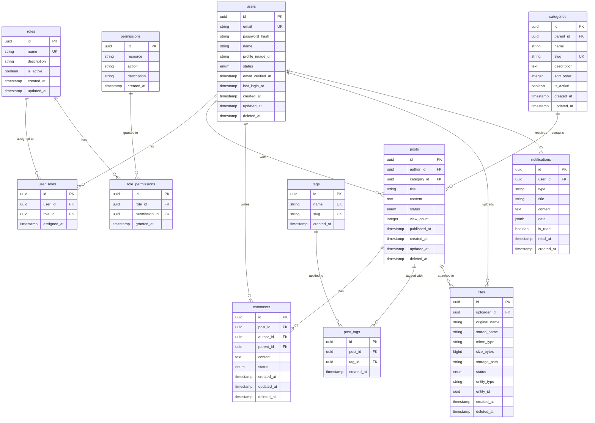

# 데이터베이스 설계서

| 항목 | 내용 |
|------|------|
| **프로젝트명** | [프로젝트명] |
| **문서 버전** | [v1.0] |
| **작성일** | [YYYY-MM-DD] |
| **작성자** | [작성자명 / 역할] |
| **승인자** | [승인자명 / 역할] |
| **문서 상태** | [초안 / 검토중 / 승인됨] |

---

## 1. 개요

### 1.1 목적

본 문서는 [프로젝트명]의 데이터베이스 논리적/물리적 설계를 정의한다. 엔티티 관계, 테이블 명세, 인덱스, 제약조건, 성능 전략 등을 포함하여 개발팀이 일관된 데이터 모델을 구현할 수 있도록 한다.

### 1.2 DBMS 선정

| 항목 | 내용 |
|------|------|
| DBMS | [PostgreSQL / MySQL / MariaDB] |
| 버전 | [버전] |
| 선정 근거 | [근거: 예) JSONB 지원, 확장성, 라이선스] |
| 인코딩 | UTF-8 (utf8mb4) |
| Collation | [utf8mb4_unicode_ci / en_US.UTF-8] |
| 타임존 | UTC |

### 1.3 설계 원칙

| 원칙 | 설명 |
|------|------|
| 정규화 | 기본적으로 3NF(제3정규형)까지 정규화. 성능을 위해 의도적 반정규화 시 사유 명기 |
| 명명 규칙 | snake_case 사용, 복수형 테이블명, 접두사 미사용 |
| 기본키 전략 | [UUID v4 / Auto Increment / ULID / Snowflake ID] |
| Soft Delete | [사용: `deleted_at` 컬럼 / 미사용: 물리 삭제] |
| 타임스탬프 | 모든 테이블에 `created_at`, `updated_at` 포함 |
| 외래키 제약 | [사용 / 미사용(애플리케이션 레벨에서 관리)] |
| 감사 로그 | [별도 audit 테이블 사용 / 이벤트 소싱 / 미사용] |

### 1.4 변경 이력

| 버전 | 날짜 | 작성자 | 변경 내용 |
|------|------|--------|-----------|
| v0.1 | [YYYY-MM-DD] | [작성자] | 초안 작성 |
| v1.0 | [YYYY-MM-DD] | [작성자] | 최종 승인 |

---

## 2. ER 다이어그램

### 2.1 전체 ER 다이어그램



### 2.2 도메인별 ER 다이어그램 (필요 시)

[대규모 시스템의 경우 도메인별로 분리된 ER 다이어그램을 추가한다.]

---

## 3. 테이블 명세서

### 3.1 users - 사용자

사용자 계정 정보를 저장하는 테이블.

#### 컬럼 정의

| 컬럼명 | 타입 | Nullable | 기본값 | 설명 |
|--------|------|----------|--------|------|
| `id` | UUID | NOT NULL | `gen_random_uuid()` | 사용자 고유 식별자 |
| `email` | VARCHAR(255) | NOT NULL | - | 이메일 주소 (로그인 ID) |
| `password_hash` | VARCHAR(255) | NOT NULL | - | bcrypt 해시된 비밀번호 |
| `name` | VARCHAR(100) | NOT NULL | - | 사용자 이름 |
| `profile_image_url` | VARCHAR(500) | NULL | NULL | 프로필 이미지 URL |
| `status` | VARCHAR(20) | NOT NULL | `'active'` | 계정 상태 (active, inactive, suspended, withdrawn) |
| `email_verified_at` | TIMESTAMP | NULL | NULL | 이메일 인증 완료 시각 |
| `last_login_at` | TIMESTAMP | NULL | NULL | 마지막 로그인 시각 |
| `created_at` | TIMESTAMP | NOT NULL | `CURRENT_TIMESTAMP` | 생성 시각 |
| `updated_at` | TIMESTAMP | NOT NULL | `CURRENT_TIMESTAMP` | 수정 시각 |
| `deleted_at` | TIMESTAMP | NULL | NULL | 삭제(soft delete) 시각 |

#### 제약조건

| 제약조건 유형 | 제약조건명 | 대상 컬럼 | 상세 |
|--------------|-----------|-----------|------|
| PK | `pk_users` | `id` | Primary Key |
| UK | `uk_users_email` | `email` | 이메일 고유 제약 |
| CK | `ck_users_status` | `status` | `IN ('active', 'inactive', 'suspended', 'withdrawn')` |
| CK | `ck_users_email_format` | `email` | 이메일 형식 검증 (LIKE '%@%.%') |

#### 인덱스

| 인덱스명 | 컬럼 | 타입 | 용도 |
|----------|------|------|------|
| `idx_users_email` | `email` | UNIQUE | 로그인 시 이메일 조회 |
| `idx_users_status` | `status` | B-tree | 상태별 필터링 |
| `idx_users_created_at` | `created_at` | B-tree | 가입일 기준 정렬 |
| `idx_users_deleted_at` | `deleted_at` | B-tree (Partial: WHERE deleted_at IS NULL) | Soft delete 필터링 |

---

### 3.2 roles - 역할

사용자에게 부여 가능한 역할(권한 그룹)을 정의하는 테이블.

#### 컬럼 정의

| 컬럼명 | 타입 | Nullable | 기본값 | 설명 |
|--------|------|----------|--------|------|
| `id` | UUID | NOT NULL | `gen_random_uuid()` | 역할 고유 식별자 |
| `name` | VARCHAR(50) | NOT NULL | - | 역할명 (admin, user, editor 등) |
| `description` | VARCHAR(255) | NULL | NULL | 역할 설명 |
| `is_active` | BOOLEAN | NOT NULL | `true` | 활성화 여부 |
| `created_at` | TIMESTAMP | NOT NULL | `CURRENT_TIMESTAMP` | 생성 시각 |
| `updated_at` | TIMESTAMP | NOT NULL | `CURRENT_TIMESTAMP` | 수정 시각 |

#### 제약조건

| 제약조건 유형 | 제약조건명 | 대상 컬럼 | 상세 |
|--------------|-----------|-----------|------|
| PK | `pk_roles` | `id` | Primary Key |
| UK | `uk_roles_name` | `name` | 역할명 고유 제약 |

#### 인덱스

| 인덱스명 | 컬럼 | 타입 | 용도 |
|----------|------|------|------|
| `idx_roles_name` | `name` | UNIQUE | 역할명 조회 |
| `idx_roles_is_active` | `is_active` | B-tree | 활성 역할 필터링 |

---

### 3.3 posts - 게시글

게시글 정보를 저장하는 테이블.

#### 컬럼 정의

| 컬럼명 | 타입 | Nullable | 기본값 | 설명 |
|--------|------|----------|--------|------|
| `id` | UUID | NOT NULL | `gen_random_uuid()` | 게시글 고유 식별자 |
| `author_id` | UUID | NOT NULL | - | 작성자 (FK: users.id) |
| `category_id` | UUID | NULL | NULL | 카테고리 (FK: categories.id) |
| `title` | VARCHAR(200) | NOT NULL | - | 제목 |
| `content` | TEXT | NOT NULL | - | 본문 내용 |
| `status` | VARCHAR(20) | NOT NULL | `'draft'` | 상태 (draft, published, archived, deleted) |
| `view_count` | INTEGER | NOT NULL | `0` | 조회수 |
| `published_at` | TIMESTAMP | NULL | NULL | 발행 시각 |
| `created_at` | TIMESTAMP | NOT NULL | `CURRENT_TIMESTAMP` | 생성 시각 |
| `updated_at` | TIMESTAMP | NOT NULL | `CURRENT_TIMESTAMP` | 수정 시각 |
| `deleted_at` | TIMESTAMP | NULL | NULL | 삭제(soft delete) 시각 |

#### 제약조건

| 제약조건 유형 | 제약조건명 | 대상 컬럼 | 상세 |
|--------------|-----------|-----------|------|
| PK | `pk_posts` | `id` | Primary Key |
| FK | `fk_posts_author` | `author_id` | REFERENCES users(id) ON DELETE RESTRICT |
| FK | `fk_posts_category` | `category_id` | REFERENCES categories(id) ON DELETE SET NULL |
| CK | `ck_posts_status` | `status` | `IN ('draft', 'published', 'archived', 'deleted')` |
| CK | `ck_posts_view_count` | `view_count` | `>= 0` |

#### 인덱스

| 인덱스명 | 컬럼 | 타입 | 용도 |
|----------|------|------|------|
| `idx_posts_author_id` | `author_id` | B-tree | 작성자별 게시글 조회 |
| `idx_posts_category_id` | `category_id` | B-tree | 카테고리별 게시글 조회 |
| `idx_posts_status_published_at` | `status, published_at DESC` | Composite B-tree | 발행된 게시글 최신순 조회 |
| `idx_posts_created_at` | `created_at DESC` | B-tree | 최신순 정렬 |
| `idx_posts_deleted_at` | `deleted_at` | B-tree (Partial: WHERE deleted_at IS NULL) | Soft delete 필터링 |
| `idx_posts_title_gin` | `title` | GIN (pg_trgm) | 제목 검색 (선택사항) |

---

### 3.4 comments - 댓글

게시글에 대한 댓글 (대댓글 지원)을 저장하는 테이블.

#### 컬럼 정의

| 컬럼명 | 타입 | Nullable | 기본값 | 설명 |
|--------|------|----------|--------|------|
| `id` | UUID | NOT NULL | `gen_random_uuid()` | 댓글 고유 식별자 |
| `post_id` | UUID | NOT NULL | - | 게시글 (FK: posts.id) |
| `author_id` | UUID | NOT NULL | - | 작성자 (FK: users.id) |
| `parent_id` | UUID | NULL | NULL | 부모 댓글 (FK: comments.id, 대댓글 시) |
| `content` | TEXT | NOT NULL | - | 댓글 내용 |
| `status` | VARCHAR(20) | NOT NULL | `'active'` | 상태 (active, hidden, deleted) |
| `created_at` | TIMESTAMP | NOT NULL | `CURRENT_TIMESTAMP` | 생성 시각 |
| `updated_at` | TIMESTAMP | NOT NULL | `CURRENT_TIMESTAMP` | 수정 시각 |
| `deleted_at` | TIMESTAMP | NULL | NULL | 삭제(soft delete) 시각 |

#### 제약조건

| 제약조건 유형 | 제약조건명 | 대상 컬럼 | 상세 |
|--------------|-----------|-----------|------|
| PK | `pk_comments` | `id` | Primary Key |
| FK | `fk_comments_post` | `post_id` | REFERENCES posts(id) ON DELETE CASCADE |
| FK | `fk_comments_author` | `author_id` | REFERENCES users(id) ON DELETE RESTRICT |
| FK | `fk_comments_parent` | `parent_id` | REFERENCES comments(id) ON DELETE CASCADE |
| CK | `ck_comments_status` | `status` | `IN ('active', 'hidden', 'deleted')` |

#### 인덱스

| 인덱스명 | 컬럼 | 타입 | 용도 |
|----------|------|------|------|
| `idx_comments_post_id` | `post_id` | B-tree | 게시글별 댓글 조회 |
| `idx_comments_author_id` | `author_id` | B-tree | 작성자별 댓글 조회 |
| `idx_comments_parent_id` | `parent_id` | B-tree | 대댓글 트리 조회 |
| `idx_comments_post_created` | `post_id, created_at` | Composite B-tree | 게시글 댓글 시간순 조회 |

---

### 3.5 files - 파일

업로드된 파일 메타데이터를 저장하는 테이블.

#### 컬럼 정의

| 컬럼명 | 타입 | Nullable | 기본값 | 설명 |
|--------|------|----------|--------|------|
| `id` | UUID | NOT NULL | `gen_random_uuid()` | 파일 고유 식별자 |
| `uploader_id` | UUID | NOT NULL | - | 업로더 (FK: users.id) |
| `original_name` | VARCHAR(255) | NOT NULL | - | 원본 파일명 |
| `stored_name` | VARCHAR(255) | NOT NULL | - | 저장 파일명 (UUID 기반) |
| `mime_type` | VARCHAR(100) | NOT NULL | - | MIME 타입 (image/png, application/pdf 등) |
| `size_bytes` | BIGINT | NOT NULL | - | 파일 크기 (바이트) |
| `storage_path` | VARCHAR(500) | NOT NULL | - | 저장 경로 (S3 key 등) |
| `status` | VARCHAR(20) | NOT NULL | `'active'` | 상태 (uploading, active, deleted) |
| `entity_type` | VARCHAR(50) | NULL | NULL | 연관 엔티티 타입 (post, comment, profile 등) |
| `entity_id` | UUID | NULL | NULL | 연관 엔티티 ID |
| `created_at` | TIMESTAMP | NOT NULL | `CURRENT_TIMESTAMP` | 생성 시각 |
| `deleted_at` | TIMESTAMP | NULL | NULL | 삭제(soft delete) 시각 |

#### 제약조건

| 제약조건 유형 | 제약조건명 | 대상 컬럼 | 상세 |
|--------------|-----------|-----------|------|
| PK | `pk_files` | `id` | Primary Key |
| FK | `fk_files_uploader` | `uploader_id` | REFERENCES users(id) ON DELETE RESTRICT |
| CK | `ck_files_status` | `status` | `IN ('uploading', 'active', 'deleted')` |
| CK | `ck_files_size` | `size_bytes` | `> 0` |

#### 인덱스

| 인덱스명 | 컬럼 | 타입 | 용도 |
|----------|------|------|------|
| `idx_files_uploader_id` | `uploader_id` | B-tree | 업로더별 파일 조회 |
| `idx_files_entity` | `entity_type, entity_id` | Composite B-tree | 연관 엔티티별 파일 조회 |
| `idx_files_status` | `status` | B-tree | 상태별 필터링 |
| `idx_files_mime_type` | `mime_type` | B-tree | 타입별 파일 조회 |

---

### 3.6 추가 테이블 목록

아래 테이블들은 ER 다이어그램에 정의된 나머지 테이블로, 위 형식과 동일하게 상세 명세를 작성한다.

| 테이블명 | 설명 | 주요 컬럼 |
|----------|------|-----------|
| `user_roles` | 사용자-역할 매핑 | user_id, role_id, assigned_at |
| `permissions` | 권한 정의 | resource, action, description |
| `role_permissions` | 역할-권한 매핑 | role_id, permission_id, granted_at |
| `categories` | 카테고리 (계층 구조) | parent_id, name, slug, sort_order |
| `tags` | 태그 | name, slug |
| `post_tags` | 게시글-태그 매핑 | post_id, tag_id |
| `notifications` | 알림 | user_id, type, title, content, is_read |
| [추가 테이블] | [설명] | [주요 컬럼] |

> 각 테이블의 상세 명세(컬럼 정의, 제약조건, 인덱스)는 위 형식을 따라 작성한다.

---

## 4. 데이터 사전 (Data Dictionary)

### 4.1 공통 도메인 정의

| 용어 | 정의 | 도메인 (타입) | 허용값 | 비고 |
|------|------|---------------|--------|------|
| 사용자 ID | 사용자 고유 식별자 | UUID | - | Gen4 UUID |
| 이메일 | 사용자 이메일 주소 | VARCHAR(255) | 이메일 형식 | RFC 5322 |
| 비밀번호 해시 | 해시 처리된 비밀번호 | VARCHAR(255) | - | bcrypt, cost 12 |
| 사용자 상태 | 사용자 계정 상태 | VARCHAR(20) | active, inactive, suspended, withdrawn | - |
| 게시글 상태 | 게시글 공개 상태 | VARCHAR(20) | draft, published, archived, deleted | - |
| 댓글 상태 | 댓글 표시 상태 | VARCHAR(20) | active, hidden, deleted | - |
| 파일 상태 | 파일 처리 상태 | VARCHAR(20) | uploading, active, deleted | - |
| 타임스탬프 | 시간 기록 | TIMESTAMP WITH TIME ZONE | - | UTC 기준 |
| 정렬 순서 | 표시 순서 | INTEGER | 0 이상 | 오름차순 정렬 |
| 조회수 | 게시글 조회 횟수 | INTEGER | 0 이상 | 음수 불가 |
| 파일 크기 | 파일 용량 (바이트) | BIGINT | 양의 정수 | 최대 [N]GB |
| MIME 타입 | 파일 미디어 타입 | VARCHAR(100) | IANA 등록 타입 | image/*, application/* 등 |
| Slug | URL 친화 문자열 | VARCHAR(255) | 영문 소문자, 숫자, 하이픈 | URL 경로에 사용 |
| [추가 용어] | [정의] | [타입] | [허용값] | [비고] |

### 4.2 열거형 (Enum) 값 정의

#### 사용자 상태 (User Status)

| 값 | 설명 | 전이 가능 상태 |
|----|------|---------------|
| `active` | 활성 계정 | inactive, suspended, withdrawn |
| `inactive` | 비활성 계정 (이메일 미인증 등) | active, withdrawn |
| `suspended` | 정지된 계정 (관리자 조치) | active |
| `withdrawn` | 탈퇴한 계정 | - (최종 상태) |

#### 게시글 상태 (Post Status)

| 값 | 설명 | 전이 가능 상태 |
|----|------|---------------|
| `draft` | 작성 중 (비공개) | published, deleted |
| `published` | 발행됨 (공개) | draft, archived, deleted |
| `archived` | 아카이브됨 | published, deleted |
| `deleted` | 삭제됨 (soft delete) | - (최종 상태) |

#### [추가 열거형]

| 값 | 설명 | 전이 가능 상태 |
|----|------|---------------|
| [값] | [설명] | [전이 가능 상태] |

---

## 5. 마이그레이션 전략

### 5.1 마이그레이션 도구

| 항목 | 내용 |
|------|------|
| 도구 | [Flyway / Liquibase / Prisma Migrate / TypeORM Migration / Alembic] |
| 버전 관리 방식 | [순차 번호(V1, V2, ...) / 타임스탬프 기반] |
| 마이그레이션 파일 위치 | `[프로젝트 경로]/migrations/` |
| 실행 환경 | CI/CD 파이프라인 내 자동 실행 |

### 5.2 버전 관리 규칙

| 규칙 | 설명 |
|------|------|
| 파일 명명 | `V[순번]__[설명].sql` 예) `V001__create_users_table.sql` |
| 한 파일 = 하나의 변경 | 하나의 마이그레이션 파일에 하나의 논리적 변경만 포함 |
| 되돌리기 불가 원칙 | 적용된 마이그레이션 파일은 수정하지 않음. 새 마이그레이션으로 변경 |
| 데이터 마이그레이션 분리 | 스키마 변경과 데이터 변경을 별도 파일로 관리 |
| 코드 리뷰 필수 | 모든 마이그레이션 파일은 리뷰 후 머지 |

### 5.3 롤백 계획

| 시나리오 | 롤백 방법 |
|----------|-----------|
| 컬럼 추가 실패 | Down 마이그레이션 실행 (DROP COLUMN) |
| 테이블 생성 실패 | Down 마이그레이션 실행 (DROP TABLE) |
| 데이터 마이그레이션 실패 | 백업으로부터 복원 |
| 인덱스 생성 실패 | Down 마이그레이션 실행 (DROP INDEX) |
| 운영 환경 롤백 | 이전 버전 스냅샷 복원 + 이후 마이그레이션 재실행 |

### 5.4 스키마 변경 프로세스

```
1. 개발자: 마이그레이션 파일 작성
2. 개발자: 로컬 환경에서 실행 및 테스트
3. 리뷰어: 코드 리뷰 (성능 영향, 데이터 정합성 확인)
4. CI: DEV 환경 자동 적용 및 테스트 실행
5. QA: STG 환경 적용 및 검증
6. DBA/관리자: PROD 환경 적용 승인
7. CI/CD: PROD 환경 자동 적용 (승인 후)
```

### 5.5 위험 변경 관리

대규모 테이블 변경, 컬럼 삭제/타입 변경 등 위험한 마이그레이션에 대한 가이드라인.

| 변경 유형 | 위험 수준 | 대응 방법 |
|-----------|-----------|-----------|
| 컬럼 추가 (NULL 허용) | 낮음 | 일반 프로세스 |
| 컬럼 추가 (NOT NULL + 기본값) | 중간 | 대규모 테이블 시 배치 처리 검토 |
| 컬럼 타입 변경 | 높음 | 새 컬럼 추가 -> 데이터 복사 -> 구 컬럼 삭제 (3단계) |
| 컬럼 삭제 | 높음 | 애플리케이션에서 참조 제거 확인 후 삭제 |
| 대량 데이터 변경 | 높음 | 배치 처리, 점검 시간 확보, 사전 백업 |
| 인덱스 생성 (대규모 테이블) | 중간 | `CREATE INDEX CONCURRENTLY` 사용 (PostgreSQL) |

---

## 6. 성능 설계

### 6.1 파티셔닝 전략

| 테이블 | 파티션 기준 | 파티션 유형 | 파티션 단위 | 적용 조건 |
|--------|-------------|-------------|-------------|-----------|
| [logs / audit_logs] | `created_at` | Range | 월별 | 데이터 [N]만건 이상 시 |
| [notifications] | `created_at` | Range | 월별 | 데이터 [N]만건 이상 시 |
| [추가 테이블] | [기준] | [유형] | [단위] | [조건] |

> **파티셔닝 미적용 시:** 현재 데이터 규모([N]건 이하 예상)에서는 파티셔닝을 적용하지 않으며, 데이터 증가 추이를 모니터링하여 필요 시 적용한다.

### 6.2 샤딩 전략

| 항목 | 내용 |
|------|------|
| 적용 여부 | [적용 / 미적용 (단일 DB로 충분)] |
| 샤딩 키 | [user_id / tenant_id / 기타] |
| 샤딩 방식 | [Hash 기반 / Range 기반 / Directory 기반] |
| 샤드 수 | [초기 N개, 최대 N개] |
| Cross-Shard 쿼리 | [처리 방법] |

> **샤딩 미적용 시:** 현재 규모에서는 단일 DB + Read Replica 구성으로 충분하며, 향후 트래픽/데이터 증가 시 샤딩 도입을 검토한다.

### 6.3 읽기 복제본 (Read Replica) 구성

| 항목 | 내용 |
|------|------|
| 복제본 수 | [N개] |
| 복제 방식 | [Streaming Replication / Logical Replication] |
| 복제 지연 허용 | [최대 N초] |
| 읽기 라우팅 | [목록 조회, 검색, 대시보드 통계 등 읽기 전용 쿼리] |
| 쓰기 라우팅 | Primary DB만 사용 |
| 페일오버 | [자동 / 수동, 소요시간 N초] |

### 6.4 인덱스 전략

#### 인덱스 설계 원칙

| 원칙 | 설명 |
|------|------|
| 선택도 기반 | Cardinality가 높은 컬럼에 인덱스 적용 |
| 복합 인덱스 순서 | WHERE 절 조건 빈도 > 정렬 > 범위 조건 순 |
| 커버링 인덱스 | 자주 사용하는 쿼리에 대해 INCLUDE 컬럼 활용 |
| 부분 인덱스 | Soft delete 패턴에서 `WHERE deleted_at IS NULL` 활용 |
| 함수 인덱스 | `LOWER(email)` 등 함수 기반 검색에 활용 |

#### 주요 쿼리별 인덱스 매핑

| 쿼리 용도 | 대상 테이블 | 사용 인덱스 | 예상 쿼리 패턴 |
|-----------|-------------|-------------|---------------|
| 로그인 | users | `idx_users_email` | `WHERE email = ? AND deleted_at IS NULL` |
| 게시글 목록 (최신순) | posts | `idx_posts_status_published_at` | `WHERE status = 'published' ORDER BY published_at DESC` |
| 특정 게시글 댓글 | comments | `idx_comments_post_created` | `WHERE post_id = ? ORDER BY created_at` |
| 파일 조회 (엔티티별) | files | `idx_files_entity` | `WHERE entity_type = ? AND entity_id = ?` |
| [추가 쿼리] | [테이블] | [인덱스] | [패턴] |

### 6.5 쿼리 최적화 가이드라인

| 항목 | 가이드라인 |
|------|-----------|
| SELECT 절 | `SELECT *` 지양, 필요한 컬럼만 명시 |
| N+1 방지 | JOIN 또는 서브쿼리 활용, ORM의 Eager Loading 설정 |
| 대량 조회 | Cursor 기반 페이지네이션 (Offset 방식 지양) |
| 집계 쿼리 | 별도 통계 테이블 또는 Materialized View 활용 |
| 잠금 최소화 | `SELECT ... FOR UPDATE` 범위 최소화, Optimistic Lock 우선 |
| Slow Query | [N]ms 이상 쿼리 모니터링 및 알림 설정 |

---

## 7. 백업/복구 정책

### 7.1 백업 스케줄

| 백업 유형 | 주기 | 시간대 | 보존 기간 | 저장 위치 |
|-----------|------|--------|-----------|-----------|
| Full Backup | [일 1회] | [새벽 3시 UTC] | [30일] | [S3 / 별도 스토리지] |
| Incremental Backup | [6시간마다] | - | [7일] | [S3 / 별도 스토리지] |
| WAL Archiving (PostgreSQL) | 연속 | - | [7일] | [S3 / 별도 스토리지] |
| 스냅샷 (RDS/Cloud) | [일 1회] | [자동] | [14일] | [클라우드 자동 관리] |

### 7.2 보존 기간 정책

| 기간 | 보존할 백업 |
|------|-------------|
| 최근 7일 | 모든 백업 (Full + Incremental) |
| 최근 30일 | Full 백업만 (일 1회) |
| 최근 12개월 | 월말 Full 백업만 (월 1회) |
| 12개월 이후 | 분기말 Full 백업만 또는 삭제 |

### 7.3 복구 절차

#### 복구 유형별 절차

| 복구 시나리오 | 절차 | 예상 소요 시간 |
|--------------|------|---------------|
| 전체 복구 (Full Restore) | 1. Full Backup 복원 -> 2. Incremental 적용 -> 3. WAL Replay -> 4. 무결성 검증 | [N시간] |
| 특정 시점 복구 (PITR) | 1. 가장 가까운 Full Backup 복원 -> 2. 목표 시점까지 WAL Replay -> 3. 검증 | [N시간] |
| 테이블 단위 복구 | 1. 백업에서 해당 테이블 추출 -> 2. 임시 DB 복원 -> 3. 데이터 이관 -> 4. 검증 | [N시간] |
| 실수로 인한 데이터 삭제 복구 | 1. PITR로 삭제 직전 시점 복원 -> 2. 삭제된 데이터만 추출 -> 3. 운영 DB에 반영 | [N시간] |

#### 복구 테스트

| 항목 | 내용 |
|------|------|
| 테스트 주기 | [분기 1회 / 반기 1회] |
| 테스트 환경 | [별도 복구 테스트 환경] |
| 테스트 항목 | Full Restore, PITR, 데이터 무결성 검증 |
| 결과 보고 | [복구 소요 시간, 데이터 정합성 확인, 개선 사항] |

### 7.4 재해 복구 (DR)

| 항목 | 내용 |
|------|------|
| RPO | [N시간] - 최대 허용 데이터 손실 시간 |
| RTO | [N시간] - 최대 허용 복구 시간 |
| DR 사이트 | [별도 리전 / 가용 영역] |
| Cross-Region 복제 | [사용 시 구성 설명] |
| DR 훈련 | [분기 1회 / 반기 1회] |

---

## 부록

### A. DDL 스크립트 위치

```
[프로젝트 경로]/database/
├── migrations/          # 마이그레이션 파일
│   ├── V001__create_users_table.sql
│   ├── V002__create_roles_table.sql
│   ├── V003__create_posts_table.sql
│   └── ...
├── seeds/               # 초기 데이터 (seed)
│   ├── 01_roles.sql
│   ├── 02_permissions.sql
│   └── ...
└── scripts/             # 유틸리티 스크립트
    ├── backup.sh
    ├── restore.sh
    └── health_check.sql
```

### B. 참조 문서

| 문서 | 경로 |
|------|------|
| 시스템 아키텍처 설계서 | [경로] |
| API 설계서 | [경로] |
| 성능 테스트 계획서 | [경로] |
