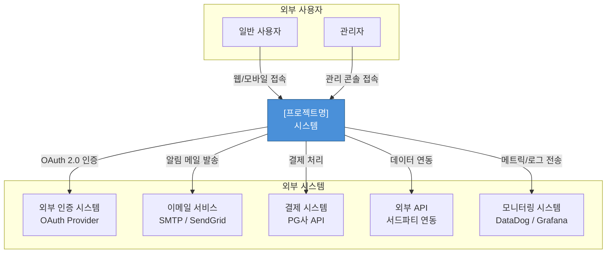
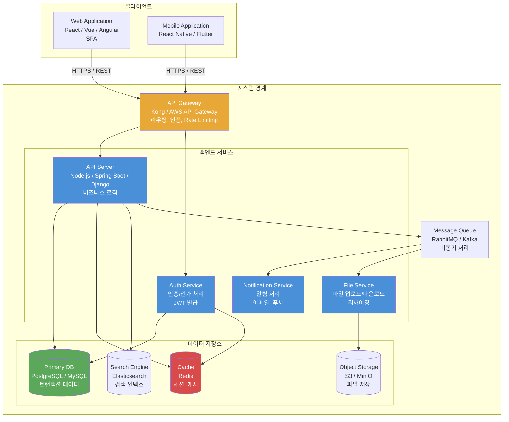
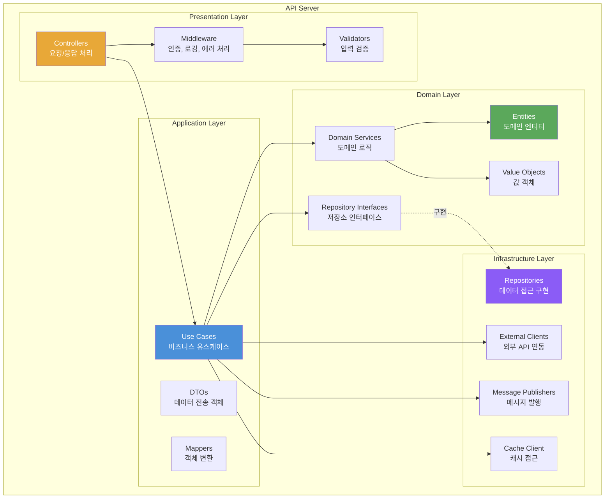
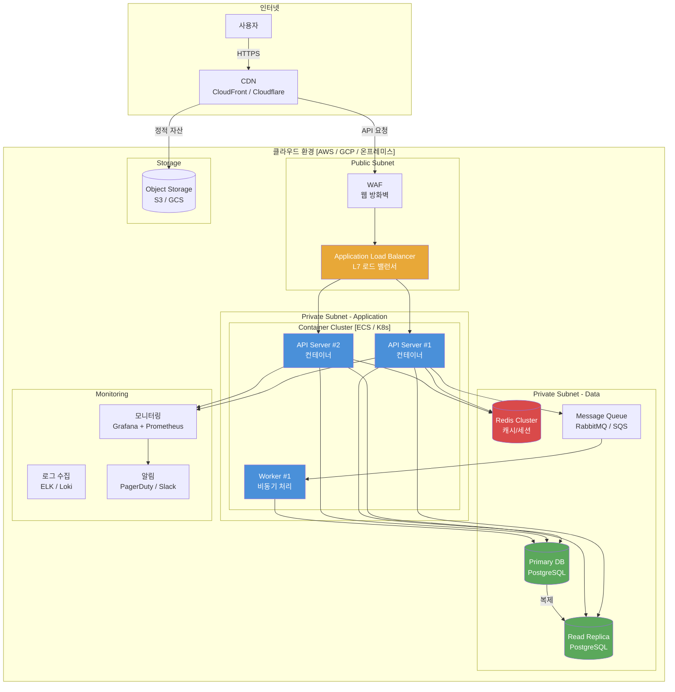
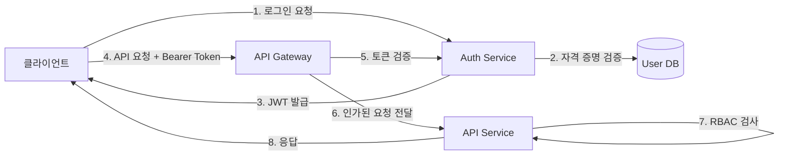

# 시스템 아키텍처 설계서 (SAD - System Architecture Document)

| 항목 | 내용 |
|------|------|
| **프로젝트명** | [프로젝트명] |
| **문서 버전** | [v1.0] |
| **작성일** | [YYYY-MM-DD] |
| **작성자** | [작성자명 / 역할] |
| **승인자** | [승인자명 / 역할] |
| **문서 상태** | [초안 / 검토중 / 승인됨] |

---

## 1. 문서 개요

### 1.1 목적

본 문서는 [프로젝트명]의 시스템 아키텍처를 정의하고, 주요 기술적 결정 사항과 설계 원칙을 기술한다. 개발팀, 인프라팀, QA팀 등 프로젝트 이해관계자가 시스템의 전체 구조를 이해하고 일관된 방향으로 개발을 수행할 수 있도록 한다.

### 1.2 범위

- 시스템 전체 아키텍처 구조 및 구성 요소
- 기술 스택 선정 및 근거
- 배포 아키텍처 및 인프라 구성
- 비기능 요구사항에 대한 아키텍처 대응 전략
- 시스템 간 통합 패턴

### 1.3 참조 문서

| 문서명 | 버전 | 비고 |
|--------|------|------|
| 요구사항 정의서 (SRS) | [v1.0] | 기능/비기능 요구사항 |
| 프로젝트 계획서 | [v1.0] | 일정 및 리소스 |
| [추가 참조 문서] | [버전] | [비고] |

### 1.4 변경 이력

| 버전 | 날짜 | 작성자 | 변경 내용 |
|------|------|--------|-----------|
| v0.1 | [YYYY-MM-DD] | [작성자] | 초안 작성 |
| v0.2 | [YYYY-MM-DD] | [작성자] | [변경 사항 요약] |
| v1.0 | [YYYY-MM-DD] | [작성자] | 최종 승인 |

### 1.5 용어 정의

| 용어 | 정의 |
|------|------|
| [용어1] | [정의] |
| [용어2] | [정의] |
| [용어3] | [정의] |

---

## 2. 아키텍처 개요

### 2.1 아키텍처 스타일 선택

#### 선택된 아키텍처 스타일

**[Layered Architecture / Microservices / Event-Driven / Hexagonal / 기타]**

#### 후보 아키텍처 스타일 비교

| 평가 항목 | Layered | Microservices | Event-Driven | Hexagonal |
|-----------|---------|---------------|--------------|-----------|
| 구현 복잡도 | 낮음 | 높음 | 중간 | 중간 |
| 확장성 | 중간 | 높음 | 높음 | 중간 |
| 유지보수성 | 중간 | 높음 | 중간 | 높음 |
| 팀 역량 적합성 | [평가] | [평가] | [평가] | [평가] |
| 배포 유연성 | 낮음 | 높음 | 높음 | 중간 |
| 운영 복잡도 | 낮음 | 높음 | 중간 | 낮음 |
| **종합 점수** | [점수] | [점수] | [점수] | [점수] |

#### 선택 근거

- [근거 1: 예) 팀 규모와 역량을 고려했을 때 적합]
- [근거 2: 예) 비기능 요구사항(확장성, 가용성)을 충족]
- [근거 3: 예) 프로젝트 일정 내 구현 가능]
- [근거 4: 예) 향후 확장 계획에 부합]

### 2.2 아키텍처 원칙

| 원칙 | 설명 | 적용 방법 |
|------|------|-----------|
| 관심사 분리 (Separation of Concerns) | 각 계층/모듈은 단일 책임을 가짐 | [구체적 적용 방법] |
| 느슨한 결합 (Loose Coupling) | 모듈 간 의존성 최소화 | [구체적 적용 방법] |
| 높은 응집도 (High Cohesion) | 관련 기능을 하나의 모듈로 그룹화 | [구체적 적용 방법] |
| DRY (Don't Repeat Yourself) | 코드 및 로직 중복 방지 | [구체적 적용 방법] |
| SOLID 원칙 | 객체지향 설계 5원칙 준수 | [구체적 적용 방법] |
| [추가 원칙] | [설명] | [적용 방법] |

### 2.3 시스템 컨텍스트 다이어그램

시스템과 외부 시스템/액터 간의 관계를 나타낸다.



### 2.4 컨테이너 다이어그램

시스템 내부의 주요 컨테이너(어플리케이션, 데이터 저장소 등)를 나타낸다.



### 2.5 컴포넌트 다이어그램

API Server 내부의 주요 모듈/컴포넌트 구성을 나타낸다.



---

## 3. 기술 스택 선정

### 3.1 선정 기준 매트릭스

각 기술은 아래 기준으로 평가한다 (1~5점 척도).

| 평가 항목 | 가중치 | 설명 |
|-----------|--------|------|
| 성능 (Performance) | [20%] | 처리 속도, 동시 접속 처리 능력 |
| 생태계 (Ecosystem) | [20%] | 라이브러리, 프레임워크, 도구 풍부도 |
| 학습 곡선 (Learning Curve) | [15%] | 팀원들의 습득 용이성 |
| 라이선스 (License) | [10%] | 상용 사용 가능 여부, 비용 |
| 커뮤니티 (Community) | [15%] | 활성도, 문서 품질, 지원 |
| 안정성 (Stability) | [10%] | 프로덕션 검증 수준, 버그 빈도 |
| 팀 역량 (Team Fit) | [10%] | 현재 팀의 경험 및 숙련도 |

### 3.2 프론트엔드 기술 선정

#### 선정 결과

| 영역 | 선정 기술 | 버전 | 선정 근거 |
|------|-----------|------|-----------|
| Framework | [React / Vue / Angular] | [버전] | [근거] |
| 상태 관리 | [Redux / Zustand / Pinia] | [버전] | [근거] |
| 스타일링 | [Tailwind CSS / styled-components / CSS Modules] | [버전] | [근거] |
| 빌드 도구 | [Vite / Webpack / Turbopack] | [버전] | [근거] |
| 테스트 | [Jest / Vitest / Cypress] | [버전] | [근거] |
| HTTP 클라이언트 | [Axios / fetch / ky] | [버전] | [근거] |
| 라우팅 | [React Router / Vue Router] | [버전] | [근거] |

#### 평가 상세

| 평가 항목 | [후보1] | [후보2] | [후보3] |
|-----------|---------|---------|---------|
| 성능 | [점수] | [점수] | [점수] |
| 생태계 | [점수] | [점수] | [점수] |
| 학습 곡선 | [점수] | [점수] | [점수] |
| 라이선스 | [점수] | [점수] | [점수] |
| 커뮤니티 | [점수] | [점수] | [점수] |
| 안정성 | [점수] | [점수] | [점수] |
| 팀 역량 | [점수] | [점수] | [점수] |
| **가중 합계** | **[총점]** | **[총점]** | **[총점]** |

### 3.3 백엔드 기술 선정

#### 선정 결과

| 영역 | 선정 기술 | 버전 | 선정 근거 |
|------|-----------|------|-----------|
| Language | [TypeScript / Java / Python / Go] | [버전] | [근거] |
| Framework | [NestJS / Spring Boot / Django / Gin] | [버전] | [근거] |
| ORM | [TypeORM / Prisma / JPA / SQLAlchemy] | [버전] | [근거] |
| 인증 | [Passport.js / Spring Security / 자체 구현] | [버전] | [근거] |
| 테스트 | [Jest / JUnit / pytest] | [버전] | [근거] |
| API 문서화 | [Swagger / OpenAPI / Redoc] | [버전] | [근거] |
| 로깅 | [Winston / Log4j / structlog] | [버전] | [근거] |

#### 평가 상세

| 평가 항목 | [후보1] | [후보2] | [후보3] |
|-----------|---------|---------|---------|
| 성능 | [점수] | [점수] | [점수] |
| 생태계 | [점수] | [점수] | [점수] |
| 학습 곡선 | [점수] | [점수] | [점수] |
| 라이선스 | [점수] | [점수] | [점수] |
| 커뮤니티 | [점수] | [점수] | [점수] |
| 안정성 | [점수] | [점수] | [점수] |
| 팀 역량 | [점수] | [점수] | [점수] |
| **가중 합계** | **[총점]** | **[총점]** | **[총점]** |

### 3.4 데이터베이스 기술 선정

| 영역 | 선정 기술 | 버전 | 선정 근거 |
|------|-----------|------|-----------|
| Primary DB | [PostgreSQL / MySQL / MariaDB] | [버전] | [근거] |
| Cache | [Redis / Memcached] | [버전] | [근거] |
| Search Engine | [Elasticsearch / OpenSearch / Meilisearch] | [버전] | [근거 또는 N/A] |
| Message Queue | [RabbitMQ / Apache Kafka / SQS] | [버전] | [근거 또는 N/A] |
| Object Storage | [AWS S3 / MinIO / GCS] | [버전] | [근거] |

### 3.5 인프라 기술 선정

| 영역 | 선정 기술 | 버전 | 선정 근거 |
|------|-----------|------|-----------|
| 클라우드 | [AWS / GCP / Azure / 온프레미스] | - | [근거] |
| 컨테이너 | [Docker / Podman] | [버전] | [근거] |
| 오케스트레이션 | [Kubernetes / ECS / Docker Compose] | [버전] | [근거] |
| CI/CD | [GitHub Actions / GitLab CI / Jenkins] | - | [근거] |
| IaC | [Terraform / Pulumi / CloudFormation] | [버전] | [근거] |
| 모니터링 | [Grafana + Prometheus / DataDog / CloudWatch] | - | [근거] |
| 로그 관리 | [ELK Stack / Loki / CloudWatch Logs] | - | [근거] |

### 3.6 대안 기술 및 불채택 사유

| 영역 | 불채택 기술 | 불채택 사유 |
|------|-------------|-------------|
| 프론트엔드 | [기술명] | [사유: 예) 팀 경험 부족, 생태계 미성숙] |
| 백엔드 | [기술명] | [사유] |
| DB | [기술명] | [사유] |
| 인프라 | [기술명] | [사유] |
| [추가] | [기술명] | [사유] |

---

## 4. 배포 아키텍처

### 4.1 배포 다이어그램



### 4.2 환경 구성

| 환경 | 용도 | URL 패턴 | 인프라 규모 | 데이터 |
|------|------|----------|-------------|--------|
| **Development (DEV)** | 개발/디버깅 | `dev.[도메인]` | 최소 (단일 인스턴스) | 테스트 데이터 |
| **Staging (STG)** | 통합 테스트, QA | `stg.[도메인]` | 운영의 축소 구성 | 익명화된 운영 데이터 복제 |
| **Production (PROD)** | 실서비스 운영 | `[도메인]` | 고가용성 구성 | 실 데이터 |

#### 환경별 상세 구성

| 구성 요소 | DEV | STG | PROD |
|-----------|-----|-----|------|
| API Server 인스턴스 | 1 | 2 | [N개, 오토스케일링] |
| DB 구성 | 단일 | Primary + Replica | Primary + Multi-Replica |
| Redis | 단일 | 단일 | Cluster (3노드 이상) |
| CDN | 미사용 | 사용 | 사용 |
| WAF | 미사용 | 사용 | 사용 |
| 모니터링 수준 | 기본 로깅 | 전체 | 전체 + 알림 |
| SSL/TLS | 자체 서명 | Let's Encrypt | 상용 인증서 |
| 백업 주기 | 미실시 | 일 1회 | [백업 정책에 따름] |

### 4.3 CI/CD 파이프라인

```mermaid
flowchart LR
    subgraph "소스 관리"
        GIT[Git Repository<br/>GitHub / GitLab]
    end

    subgraph "CI 파이프라인"
        LINT[Lint / Format<br/>ESLint, Prettier]
        TEST[Unit Test<br/>Jest / JUnit]
        BUILD[Build<br/>Docker Image]
        SCAN[보안 스캔<br/>SonarQube, Trivy]
        PUSH[이미지 Push<br/>ECR / GCR]
    end

    subgraph "CD 파이프라인"
        DEV_DEPLOY[DEV 배포<br/>자동]
        STG_DEPLOY[STG 배포<br/>자동]
        INT_TEST[통합 테스트<br/>E2E Test]
        APPROVAL[수동 승인<br/>배포 관리자]
        PROD_DEPLOY[PROD 배포<br/>Blue-Green / Rolling]
    end

    GIT -->|Push / PR| LINT
    LINT --> TEST
    TEST --> BUILD
    BUILD --> SCAN
    SCAN -->|통과| PUSH
    PUSH --> DEV_DEPLOY
    DEV_DEPLOY --> STG_DEPLOY
    STG_DEPLOY --> INT_TEST
    INT_TEST -->|통과| APPROVAL
    APPROVAL -->|승인| PROD_DEPLOY

    style LINT fill:#E8A838,color:#fff
    style TEST fill:#4A90D9,color:#fff
    style SCAN fill:#D94A4A,color:#fff
    style APPROVAL fill:#8B5CF6,color:#fff
    style PROD_DEPLOY fill:#5BA85B,color:#fff
```



#### CI 단계 상세

| 단계 | 도구 | 트리거 조건 | 실패 시 동작 |
|------|------|-------------|--------------|
| 코드 품질 검사 | [ESLint / SonarQube] | PR 생성, Push | PR 머지 차단 |
| 단위 테스트 | [Jest / JUnit] | PR 생성, Push | PR 머지 차단 |
| 커버리지 확인 | [Istanbul / JaCoCo] | PR 생성 | 기준 미달 시 경고 ([N]% 이상) |
| Docker 빌드 | [Docker / Buildah] | 머지 시 | 파이프라인 중단 |
| 보안 스캔 | [Trivy / Snyk] | 빌드 완료 후 | Critical 취약점 시 중단 |
| 이미지 Push | [ECR / GCR / Docker Hub] | 스캔 통과 후 | 파이프라인 중단 |

#### CD 단계 상세

| 환경 | 배포 전략 | 트리거 | 롤백 방법 |
|------|-----------|--------|-----------|
| DEV | 직접 배포 | main 머지 시 자동 | 이전 이미지 재배포 |
| STG | [Blue-Green / Rolling] | DEV 성공 후 자동 | 이전 버전 전환 |
| PROD | [Blue-Green / Canary / Rolling] | 수동 승인 후 | [롤백 전략 상세] |

### 4.4 인프라 코드(IaC) 전략

| 항목 | 내용 |
|------|------|
| IaC 도구 | [Terraform / Pulumi / CloudFormation] |
| 상태 관리 | [S3 + DynamoDB Lock / Terraform Cloud / 기타] |
| 모듈 구조 | 환경별(dev/stg/prod) 분리, 공통 모듈 재사용 |
| 버전 관리 | Git 기반, 코드 리뷰 필수 |
| 적용 프로세스 | Plan 검토 -> 승인 -> Apply |

#### IaC 디렉토리 구조

```
infra/
├── modules/
│   ├── networking/       # VPC, Subnet, Security Group
│   ├── compute/          # ECS / EKS / EC2
│   ├── database/         # RDS, ElastiCache
│   ├── storage/          # S3, EFS
│   └── monitoring/       # CloudWatch, Grafana
├── environments/
│   ├── dev/
│   │   ├── main.tf
│   │   ├── variables.tf
│   │   └── terraform.tfvars
│   ├── stg/
│   └── prod/
├── backend.tf
└── versions.tf
```

---

## 5. 아키텍처 결정 기록 (ADR)

### 5.1 ADR 템플릿

```
## ADR-[NNN]: [결정 제목]

| 항목 | 내용 |
|------|------|
| **ADR ID** | ADR-[NNN] |
| **상태** | [제안(Proposed) / 승인(Accepted) / 폐기(Deprecated) / 대체(Superseded by ADR-XXX)] |
| **날짜** | [YYYY-MM-DD] |
| **의사결정자** | [이름 / 역할] |

### 컨텍스트 (Context)
[결정이 필요한 배경과 상황을 기술한다.]

### 결정 (Decision)
[내린 결정을 명확하게 기술한다.]

### 근거 (Rationale)
[결정의 이유와 고려한 대안들을 기술한다.]
- 선택지 1: [설명] — [장점/단점]
- 선택지 2: [설명] — [장점/단점]
- 선택지 3: [설명] — [장점/단점]

### 결과 (Consequences)
- 긍정적: [기대되는 긍정적 결과]
- 부정적: [감수해야 할 부정적 결과 또는 트레이드오프]
- 중립적: [기타 영향]
```

### 5.2 ADR 목록

| ADR ID | 제목 | 상태 | 날짜 |
|--------|------|------|------|
| ADR-001 | [백엔드 프레임워크 선정] | [승인] | [YYYY-MM-DD] |
| ADR-002 | [인증 방식 결정] | [승인] | [YYYY-MM-DD] |
| [ADR-NNN] | [제목] | [상태] | [날짜] |

### 5.3 ADR 예시

#### ADR-001: 백엔드 프레임워크로 [NestJS / Spring Boot] 선정

| 항목 | 내용 |
|------|------|
| **ADR ID** | ADR-001 |
| **상태** | 승인 (Accepted) |
| **날짜** | [YYYY-MM-DD] |
| **의사결정자** | [기술 리드, 시니어 개발자] |

**컨텍스트**

[프로젝트명]의 백엔드 서비스를 구현할 프레임워크를 선정해야 한다. 팀은 [N]명의 개발자로 구성되어 있으며, [TypeScript / Java]에 대한 경험이 [상/중/하] 수준이다. 시스템은 [동시 접속자 수], [트랜잭션 처리량] 등의 요구사항을 충족해야 한다.

**결정**

백엔드 프레임워크로 **[NestJS / Spring Boot]**를 선정한다.

**근거**

- 선택지 1: NestJS — TypeScript 기반, 모듈 구조 체계적, 프론트엔드와 언어 통일 가능. 단, 대규모 엔터프라이즈 레퍼런스 상대적으로 적음.
- 선택지 2: Spring Boot — Java 기반, 엔터프라이즈 검증 완료, 풍부한 생태계. 단, 팀 Java 경험이 부족하면 학습 곡선 존재.
- 선택지 3: Django — Python 기반, 빠른 프로토타이핑 가능. 단, 대규모 비동기 처리 성능에 제약.

[선택한 프레임워크]를 선정한 주요 이유: [구체적 이유 2~3가지]

**결과**

- 긍정적: [예) 프론트엔드와 동일 언어 사용으로 코드 공유 및 팀 효율성 향상]
- 부정적: [예) 특정 엔터프라이즈 패턴 구현 시 추가 라이브러리 필요]
- 중립적: [예) 기존 레거시 시스템과의 통합을 위한 어댑터 패턴 적용 필요]

---

#### ADR-002: JWT 기반 인증과 세션 쿠키 방식 중 JWT 선정

| 항목 | 내용 |
|------|------|
| **ADR ID** | ADR-002 |
| **상태** | 승인 (Accepted) |
| **날짜** | [YYYY-MM-DD] |
| **의사결정자** | [기술 리드, 보안 담당자] |

**컨텍스트**

사용자 인증 및 인가 방식을 결정해야 한다. 시스템은 웹과 모바일 클라이언트를 모두 지원해야 하며, [마이크로서비스 / 모놀리식] 구조에서 서비스 간 인증 정보 전달이 필요하다.

**결정**

**JWT (JSON Web Token)** 기반 인증 방식을 채택한다. Access Token + Refresh Token 조합을 사용한다.

**근거**

- 선택지 1: JWT — Stateless, 서비스 간 전파 용이, 모바일 친화적. 단, 토큰 무효화 즉시 불가(만료까지 대기 또는 블랙리스트 관리 필요).
- 선택지 2: 세션 쿠키 — 서버측 세션 관리로 즉시 무효화 가능, 구현 단순. 단, 서비스 확장 시 세션 공유 문제, 모바일 앱에서 쿠키 관리 복잡.
- 선택지 3: OAuth 2.0 + OIDC — 표준 프로토콜, 소셜 로그인 지원 용이. 단, 자체 구현 복잡도 높음.

JWT를 선정한 주요 이유: 웹/모바일 통합 지원, Stateless 아키텍처에 적합, 서비스 간 인증 정보 전달 용이.

**결과**

- 긍정적: Stateless 구조로 수평 확장 용이, 클라이언트 플랫폼 독립적
- 부정적: 토큰 즉시 무효화를 위해 Redis 기반 블랙리스트 구현 필요
- 중립적: Refresh Token 로테이션 및 보안 저장 정책 별도 수립 필요

---

## 6. 비기능 요구사항 대응 설계

### 6.1 성능 (Performance)

#### 성능 목표

| 지표 | 목표 값 | 측정 방법 |
|------|---------|-----------|
| API 응답 시간 (P50) | [< 200ms] | [APM 도구] |
| API 응답 시간 (P95) | [< 500ms] | [APM 도구] |
| API 응답 시간 (P99) | [< 1000ms] | [APM 도구] |
| 동시 접속자 수 | [N명] | [부하 테스트] |
| 초당 요청 수 (RPS) | [N건/초] | [부하 테스트] |
| 페이지 로딩 시간 | [< 2초] | [Lighthouse] |

#### 캐싱 전략

| 캐시 대상 | 캐시 저장소 | TTL | 무효화 전략 |
|-----------|-------------|-----|-------------|
| API 응답 (목록 조회) | Redis | [N분] | 데이터 변경 시 삭제 |
| 사용자 세션 | Redis | [N시간] | 로그아웃 시 삭제 |
| 정적 자산 (JS/CSS/이미지) | CDN | [N일] | 배포 시 버전 갱신 |
| DB 쿼리 결과 | Redis | [N분] | Write-Through / Write-Behind |
| [추가 대상] | [저장소] | [TTL] | [전략] |

#### CDN 구성

| 항목 | 설정 |
|------|------|
| CDN 서비스 | [CloudFront / Cloudflare / Akamai] |
| 캐시 대상 | 정적 자산 (JS, CSS, 이미지, 폰트) |
| 오리진 | [S3 / API Server] |
| 캐시 정책 | [Cache-Control 헤더 기반] |
| 무효화 | [배포 시 자동 Invalidation / 파일 해시 기반] |

#### 데이터베이스 최적화

| 최적화 항목 | 적용 전략 | 상세 |
|-------------|-----------|------|
| 쿼리 최적화 | 인덱스, 쿼리 플랜 분석 | [상세 전략] |
| 커넥션 풀링 | [HikariCP / pg-pool] | 최소 [N], 최대 [N] 커넥션 |
| 읽기/쓰기 분리 | Read Replica 활용 | 읽기 전용 쿼리를 Replica로 라우팅 |
| N+1 문제 방지 | Eager Loading / DataLoader | [상세 전략] |
| [추가 항목] | [전략] | [상세] |

### 6.2 보안 (Security)

#### 인증/인가 아키텍처



#### 보안 계층별 대응

| 계층 | 위협 | 대응 방안 |
|------|------|-----------|
| 네트워크 | DDoS, 중간자 공격 | WAF, TLS 1.3, VPC 격리 |
| 인증 | 무차별 대입, 세션 탈취 | Rate Limiting, JWT 만료, Refresh Token 로테이션 |
| 인가 | 권한 상승, IDOR | RBAC/ABAC, 리소스 소유권 검증 |
| 입력 | SQL Injection, XSS, CSRF | 파라미터 바인딩, CSP, CSRF 토큰 |
| 데이터 | 정보 유출 | 암호화(at-rest, in-transit), 개인정보 마스킹 |
| 의존성 | 취약한 라이브러리 | 자동 스캔 (Snyk / Dependabot), 정기 업데이트 |
| [추가 계층] | [위협] | [대응] |

#### 데이터 암호화

| 대상 | 암호화 방식 | 알고리즘 / 키 관리 |
|------|-------------|-------------------|
| 전송 중 데이터 | TLS 1.3 | 인증서 자동 갱신 (ACM / Let's Encrypt) |
| 저장 데이터 | AES-256-GCM | [KMS / Vault] 키 관리 |
| 비밀번호 | 단방향 해시 | bcrypt (cost factor [12]) |
| 민감 정보 (PII) | 필드 레벨 암호화 | [KMS / 자체 키] |
| [추가 대상] | [방식] | [상세] |

### 6.3 확장성 (Scalability)

#### 수평 확장 전략

| 컴포넌트 | 확장 방식 | 상세 |
|----------|-----------|------|
| API Server | 수평 확장 (Scale-Out) | 오토스케일링, Stateless 설계 |
| Worker | 수평 확장 | 메시지 큐 기반 작업 분배 |
| Database | 읽기 확장 (Read Replica) | 쓰기: Primary, 읽기: Replica |
| Cache | 클러스터 확장 | Redis Cluster / Sentinel |
| [추가 컴포넌트] | [방식] | [상세] |

#### 오토스케일링 정책

| 지표 | 임계값 | Scale-Out | Scale-In | 쿨다운 |
|------|--------|-----------|----------|--------|
| CPU 사용률 | [70%] | +[N]대 | -[N]대 | [300초] |
| 메모리 사용률 | [80%] | +[N]대 | -[N]대 | [300초] |
| 요청 수 (RPS) | [N건/초] | +[N]대 | -[N]대 | [300초] |
| 최소 인스턴스 | [N]대 | - | - | - |
| 최대 인스턴스 | [N]대 | - | - | - |

### 6.4 가용성 (Availability)

#### 가용성 목표

| 항목 | 목표 | 허용 다운타임 (연간) |
|------|------|---------------------|
| 전체 시스템 | [99.9% / 99.95% / 99.99%] | [8.76시간 / 4.38시간 / 52.6분] |
| API 서비스 | [목표] | [다운타임] |
| 데이터베이스 | [목표] | [다운타임] |

#### 이중화 구성

| 컴포넌트 | 이중화 방식 | 페일오버 시간 |
|----------|-------------|---------------|
| API Server | Active-Active (다중 인스턴스) | 즉시 (로드 밸런서) |
| Database | Primary-Replica (Streaming Replication) | [< N초, 자동 페일오버] |
| Cache (Redis) | Sentinel / Cluster | [< N초] |
| Message Queue | Mirrored Queue / Replication | [< N초] |
| Load Balancer | [이중화 방식] | [페일오버 시간] |

#### 장애 복구 (DR - Disaster Recovery)

| 항목 | 내용 |
|------|------|
| RPO (Recovery Point Objective) | [N시간] - 최대 허용 데이터 손실 시간 |
| RTO (Recovery Time Objective) | [N시간] - 최대 허용 복구 시간 |
| DR 전략 | [Pilot Light / Warm Standby / Multi-Site Active-Active] |
| DR 사이트 | [리전 / 가용 영역] |
| 복구 절차 | [별도 DR 절차서 참조 또는 개요 기술] |
| DR 훈련 주기 | [분기 1회 / 반기 1회] |

#### 헬스체크 구성

| 대상 | 엔드포인트 | 주기 | 타임아웃 | 실패 기준 |
|------|-----------|------|----------|-----------|
| API Server | `/health` | [30초] | [5초] | [연속 3회 실패] |
| Database | TCP 연결 확인 | [30초] | [5초] | [연속 3회 실패] |
| Redis | `PING` 명령 | [15초] | [3초] | [연속 3회 실패] |
| 외부 서비스 | [엔드포인트] | [60초] | [10초] | [연속 N회 실패] |

---

## 7. 통합 패턴

### 7.1 API Gateway 패턴

| 항목 | 내용 |
|------|------|
| 도구 | [Kong / AWS API Gateway / Nginx / Traefik] |
| 라우팅 | URL 경로 기반 서비스 라우팅 |
| 인증 | JWT 검증, API Key 인증 |
| Rate Limiting | IP/사용자별 요청 제한 |
| CORS | [허용 Origin 정책] |
| 요청/응답 변환 | 헤더 추가, 바디 변환 |
| 로깅 | 요청/응답 로깅 (민감 정보 마스킹) |
| 서킷 브레이커 | [임계값 및 정책] |

#### API Gateway 라우팅 규칙

| 경로 패턴 | 대상 서비스 | 인증 | Rate Limit |
|-----------|-------------|------|------------|
| `/api/v1/auth/**` | Auth Service | 불필요 (일부) | [N req/min] |
| `/api/v1/users/**` | API Server | Bearer Token | [N req/min] |
| `/api/v1/posts/**` | API Server | Bearer Token | [N req/min] |
| `/api/v1/files/**` | File Service | Bearer Token | [N req/min] |
| `/api/v1/admin/**` | API Server | Bearer Token + Admin Role | [N req/min] |
| [추가 경로] | [서비스] | [인증] | [제한] |

### 7.2 메시지 큐 패턴

| 항목 | 내용 |
|------|------|
| 도구 | [RabbitMQ / Apache Kafka / AWS SQS] |
| 용도 | 비동기 작업 처리, 서비스 간 디커플링 |
| 메시지 포맷 | JSON (스키마 버전 포함) |
| 재시도 정책 | [최대 N회, 지수 백오프] |
| Dead Letter Queue | [DLQ 구성 및 모니터링] |

#### 큐/토픽 목록

| 큐/토픽 이름 | 용도 | Producer | Consumer | 메시지 예시 |
|-------------|------|----------|----------|-------------|
| `email.send` | 이메일 발송 | API Server | Notification Worker | `{ "to": "...", "template": "...", "data": {...} }` |
| `file.process` | 파일 처리 (리사이징 등) | API Server | File Worker | `{ "fileId": "...", "operations": [...] }` |
| `notification.push` | 푸시 알림 | API Server | Notification Worker | `{ "userId": "...", "title": "...", "body": "..." }` |
| `audit.log` | 감사 로그 기록 | All Services | Audit Worker | `{ "action": "...", "userId": "...", "resource": "..." }` |
| [추가 큐/토픽] | [용도] | [Producer] | [Consumer] | [메시지 구조] |

#### 메시지 포맷 표준

```json
{
  "id": "[UUID - 메시지 고유 ID]",
  "type": "[이벤트 타입, 예: email.send]",
  "version": "[메시지 스키마 버전, 예: 1.0]",
  "timestamp": "[ISO 8601 형식]",
  "source": "[발행 서비스명]",
  "data": {
    "[메시지 타입별 페이로드]": "..."
  },
  "metadata": {
    "correlationId": "[요청 추적 ID]",
    "userId": "[요청자 ID, 해당 시]"
  }
}
```

### 7.3 이벤트 버스 패턴

| 항목 | 내용 |
|------|------|
| 적용 여부 | [사용 / 미사용] |
| 도구 | [Kafka / EventBridge / NATS] |
| 이벤트 저장소 | [이벤트 소싱 적용 여부] |
| 이벤트 스키마 레지스트리 | [사용 시 도구명] |

#### 도메인 이벤트 목록

| 이벤트명 | 도메인 | 발행 조건 | 구독자 | 데이터 |
|----------|--------|-----------|--------|--------|
| `UserRegistered` | User | 회원 가입 완료 시 | Notification, Analytics | `{ userId, email, registeredAt }` |
| `OrderCreated` | Order | 주문 생성 시 | Payment, Inventory, Notification | `{ orderId, userId, items, totalAmount }` |
| `PaymentCompleted` | Payment | 결제 완료 시 | Order, Notification | `{ paymentId, orderId, amount, method }` |
| [추가 이벤트] | [도메인] | [조건] | [구독자] | [데이터] |

---

## 부록

### A. 다이어그램 목록

| 다이어그램 | 섹션 | 용도 |
|-----------|------|------|
| 시스템 컨텍스트 다이어그램 | 2.3 | 외부 시스템 연동 전체 뷰 |
| 컨테이너 다이어그램 | 2.4 | 시스템 내부 구성 요소 |
| 컴포넌트 다이어그램 | 2.5 | API Server 내부 모듈 |
| 배포 다이어그램 | 4.1 | 인프라 배포 구조 |
| CI/CD 파이프라인 | 4.3 | 빌드/배포 프로세스 |
| 인증 플로우 | 6.2 | 인증/인가 흐름 |

### B. 기술 스택 요약

| 계층 | 기술 |
|------|------|
| 프론트엔드 | [기술 목록] |
| 백엔드 | [기술 목록] |
| 데이터베이스 | [기술 목록] |
| 인프라 | [기술 목록] |
| 모니터링 | [기술 목록] |
| CI/CD | [기술 목록] |

### C. 관련 문서 링크

| 문서 | 경로 |
|------|------|
| 요구사항 정의서 | [경로] |
| 데이터베이스 설계서 | [경로] |
| API 설계서 | [경로] |
| 화면 설계서 | [경로] |
| 상세 설계서 | [경로] |
