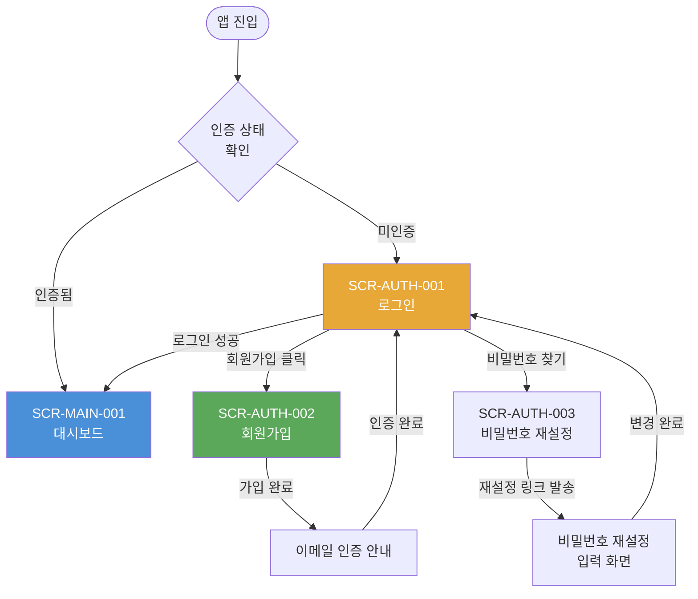
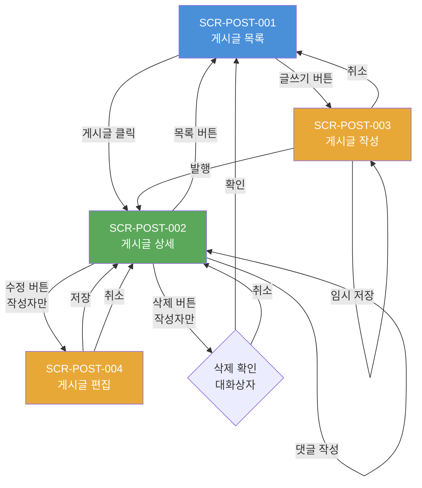
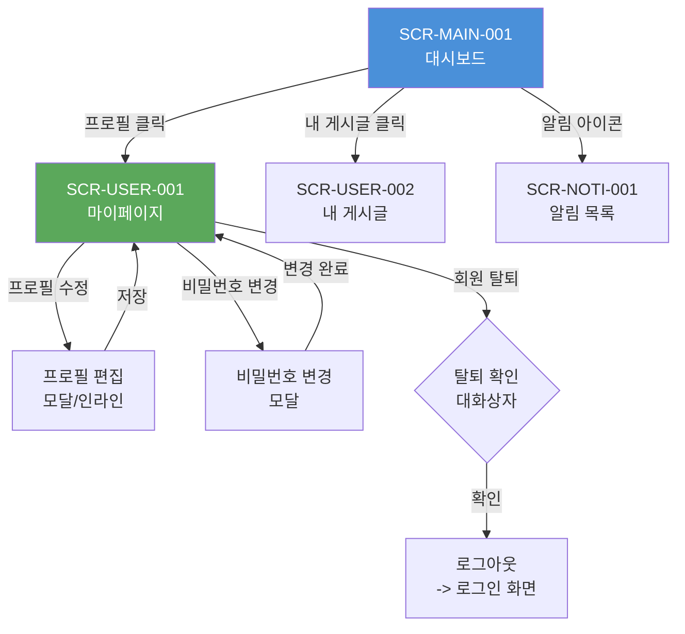

# 화면(UI/UX) 설계서

| 항목 | 내용 |
|------|------|
| **프로젝트명** | [프로젝트명] |
| **문서 버전** | [v1.0] |
| **작성일** | [YYYY-MM-DD] |
| **작성자** | [작성자명 / 역할] |
| **승인자** | [승인자명 / 역할] |
| **문서 상태** | [초안 / 검토중 / 승인됨] |

---

## 1. 설계 원칙

### 1.1 사용성 (Usability)

| 원칙 | 설명 | 적용 방법 |
|------|------|-----------|
| 직관성 | 사용자가 학습 없이 즉시 사용 가능 | 표준 UI 패턴 사용, 명확한 레이블 |
| 일관성 | 전체 화면에서 동일한 패턴과 규칙 적용 | 디자인 시스템 기반 컴포넌트 재사용 |
| 피드백 | 사용자 행동에 대한 즉각적 반응 | 로딩 표시, 성공/에러 메시지, 상태 변화 |
| 효율성 | 최소 단계로 목표 달성 가능 | 핵심 기능 접근 [N]클릭 이내 |
| 오류 방지 | 실수 가능성 사전 차단 | 유효성 검증, 확인 대화상자, 되돌리기 |

### 1.2 접근성 (Accessibility)

| 기준 | 수준 | 적용 항목 |
|------|------|-----------|
| WCAG | [2.1 AA] | 전체 화면 적용 |
| 키보드 접근성 | 필수 | 모든 인터랙티브 요소 Tab 이동 가능 |
| 스크린리더 | 필수 | ARIA 속성, 시멘틱 HTML |
| 색상 대비 | 최소 4.5:1 (일반 텍스트) | 전체 텍스트 및 아이콘 |
| 폰트 크기 | 최소 14px (본문) | 확대 200%까지 레이아웃 유지 |
| 대체 텍스트 | 필수 | 모든 이미지에 alt 텍스트 |
| 포커스 표시 | 필수 | 포커스 상태 시각적 표시 |

### 1.3 반응형 디자인 (Responsive)

| 브레이크포인트 | 범위 | 대상 기기 | 레이아웃 |
|--------------|------|-----------|----------|
| Mobile (sm) | < 640px | 스마트폰 | 단일 컬럼 |
| Tablet (md) | 640px ~ 1023px | 태블릿 | 2 컬럼 |
| Desktop (lg) | 1024px ~ 1279px | 노트북 | 사이드바 + 메인 |
| Wide (xl) | >= 1280px | 데스크톱 | 풀 레이아웃 |

### 1.4 변경 이력

| 버전 | 날짜 | 작성자 | 변경 내용 |
|------|------|--------|-----------|
| v0.1 | [YYYY-MM-DD] | [작성자] | 초안 작성 |
| v1.0 | [YYYY-MM-DD] | [작성자] | 최종 승인 |

---

## 2. 화면 목록

### 2.1 전체 화면 목록

| 화면 ID | 화면명 | URL | 접근 권한 | 상태 | 비고 |
|---------|--------|-----|-----------|------|------|
| SCR-AUTH-001 | 로그인 | `/login` | 비인증 | [설계완료/진행중/미착수] | - |
| SCR-AUTH-002 | 회원가입 | `/register` | 비인증 | [상태] | - |
| SCR-AUTH-003 | 비밀번호 재설정 | `/forgot-password` | 비인증 | [상태] | - |
| SCR-MAIN-001 | 대시보드 | `/dashboard` | 인증 | [상태] | 메인 화면 |
| SCR-POST-001 | 게시글 목록 | `/posts` | 전체 | [상태] | - |
| SCR-POST-002 | 게시글 상세 | `/posts/{id}` | 전체 | [상태] | - |
| SCR-POST-003 | 게시글 작성 | `/posts/new` | 인증 | [상태] | - |
| SCR-POST-004 | 게시글 편집 | `/posts/{id}/edit` | 작성자/관리자 | [상태] | - |
| SCR-USER-001 | 마이페이지 | `/my/profile` | 인증 | [상태] | - |
| SCR-USER-002 | 내 게시글 | `/my/posts` | 인증 | [상태] | - |
| SCR-ADMIN-001 | 관리자 대시보드 | `/admin` | 관리자 | [상태] | - |
| SCR-ADMIN-002 | 사용자 관리 | `/admin/users` | 관리자 | [상태] | - |
| SCR-NOTI-001 | 알림 목록 | `/notifications` | 인증 | [상태] | - |
| SCR-ERR-001 | 404 에러 | `/404` | 전체 | [상태] | - |
| SCR-ERR-002 | 500 에러 | `/500` | 전체 | [상태] | - |
| [SCR-XXX-NNN] | [화면명] | [URL] | [권한] | [상태] | [비고] |

---

## 3. 화면 흐름도

### 3.1 인증 플로우



### 3.2 게시글 플로우



### 3.3 사용자 설정 플로우



---

## 4. 화면 상세 명세 템플릿

아래 형식을 기반으로 각 화면의 상세 명세를 작성한다.

---

### 화면 명세 템플릿

#### 기본 정보

| 항목 | 내용 |
|------|------|
| **화면 ID** | [SCR-XXX-NNN] |
| **화면명** | [화면명] |
| **URL** | [URL 패턴] |
| **접근 권한** | [비인증 / 인증 / 관리자] |
| **관련 API** | [API 엔드포인트 목록] |
| **디자인 시안** | [Figma / Zeplin 링크] |

#### 레이아웃 설명

```
[화면 레이아웃을 텍스트로 기술하거나 ASCII art/와이어프레임 참조를 포함한다]

+------------------------------------------+
|              Header / GNB                |
+------------------------------------------+
|  Sidebar  |       Main Content           |
|  (선택)   |                              |
|           |  +------------------------+  |
|           |  |    Content Area        |  |
|           |  |                        |  |
|           |  +------------------------+  |
+------------------------------------------+
|              Footer                      |
+------------------------------------------+
```

#### 구성 요소

| 요소 ID | 유형 | 설명 | 동작 | 검증 규칙 |
|---------|------|------|------|-----------|
| [EL-001] | [Input / Button / Table / Modal / ...] | [요소 설명] | [클릭/입력 시 동작] | [검증 규칙 또는 N/A] |

#### 이벤트

| 이벤트 | 트리거 | 동작 | API 연동 |
|--------|--------|------|----------|
| [이벤트명] | [사용자 행동] | [수행할 동작] | [관련 API 또는 N/A] |

#### 상태별 화면

| 상태 | 조건 | 화면 구성 |
|------|------|-----------|
| 로딩 | API 호출 중 | [로딩 표시 방법: Skeleton / Spinner / Progress Bar] |
| 빈 상태 | 데이터 없음 | [빈 상태 메시지 및 액션 안내] |
| 에러 | API 실패 | [에러 메시지 표시 방법, 재시도 버튼] |
| 성공 | 처리 완료 | [성공 메시지 또는 화면 전환] |

---

## 5. 예시 화면 명세

### 5.1 SCR-AUTH-001: 로그인

#### 기본 정보

| 항목 | 내용 |
|------|------|
| **화면 ID** | SCR-AUTH-001 |
| **화면명** | 로그인 |
| **URL** | `/login` |
| **접근 권한** | 비인증 (인증 사용자 접근 시 대시보드로 리다이렉트) |
| **관련 API** | `POST /api/v1/auth/login`, `GET /api/v1/auth/oauth/{provider}` |
| **디자인 시안** | [Figma 링크] |

#### 레이아웃 설명

```
+------------------------------------------+
|               Logo / 브랜드              |
+------------------------------------------+
|                                          |
|        +----------------------+          |
|        |   이메일 입력         |          |
|        +----------------------+          |
|        +----------------------+          |
|        |   비밀번호 입력       |          |
|        +----------------------+          |
|        [  비밀번호 찾기 링크  ]          |
|        +----------------------+          |
|        |     로그인 버튼       |          |
|        +----------------------+          |
|                                          |
|        ──── 또는 ────                    |
|                                          |
|        +----------------------+          |
|        |  Google 로그인 버튼   |          |
|        +----------------------+          |
|        +----------------------+          |
|        |  Kakao 로그인 버튼    |          |
|        +----------------------+          |
|                                          |
|        회원이 아니신가요? [가입하기]      |
+------------------------------------------+
```

#### 구성 요소

| 요소 ID | 유형 | 설명 | 동작 | 검증 규칙 |
|---------|------|------|------|-----------|
| EL-001 | Image | 서비스 로고 | 클릭 시 랜딩 페이지 이동 | N/A |
| EL-002 | Input (email) | 이메일 입력 필드 | - | 이메일 형식 검증, 필수 |
| EL-003 | Input (password) | 비밀번호 입력 필드 | 비밀번호 표시/숨김 토글 | 필수 |
| EL-004 | Link | 비밀번호 찾기 | SCR-AUTH-003으로 이동 | N/A |
| EL-005 | Button (primary) | 로그인 버튼 | 로그인 API 호출 | 모든 필드 검증 통과 시 활성화 |
| EL-006 | Button (oauth) | Google 로그인 | OAuth 플로우 시작 | N/A |
| EL-007 | Button (oauth) | Kakao 로그인 | OAuth 플로우 시작 | N/A |
| EL-008 | Link | 회원가입 링크 | SCR-AUTH-002로 이동 | N/A |

#### 이벤트

| 이벤트 | 트리거 | 동작 | API 연동 |
|--------|--------|------|----------|
| 로그인 실행 | 로그인 버튼 클릭 또는 Enter 키 | 이메일/비밀번호 유효성 검증 후 API 호출 | `POST /api/v1/auth/login` |
| 로그인 성공 | API 200 응답 | 토큰 저장, 대시보드로 이동 | N/A |
| 로그인 실패 | API 401 응답 | 에러 메시지 표시 ("이메일 또는 비밀번호가 올바르지 않습니다") | N/A |
| 소셜 로그인 | OAuth 버튼 클릭 | OAuth Provider로 리다이렉트 | `GET /api/v1/auth/oauth/{provider}` |
| 비밀번호 표시 토글 | 눈 아이콘 클릭 | 비밀번호 마스킹/해제 전환 | N/A |

#### 상태별 화면

| 상태 | 조건 | 화면 구성 |
|------|------|-----------|
| 초기 | 화면 진입 | 빈 입력 필드, 로그인 버튼 비활성화 |
| 입력 중 | 필드 입력 | 실시간 유효성 검증, 버튼 활성화 조건 표시 |
| 로딩 | 로그인 API 호출 중 | 버튼에 Spinner 표시, 입력 필드 비활성화 |
| 에러 | 로그인 실패 | 입력 필드 상단에 에러 메시지 (빨간색) |
| 성공 | 로그인 완료 | 대시보드로 리다이렉트 |

---

### 5.2 SCR-AUTH-002: 회원가입

#### 기본 정보

| 항목 | 내용 |
|------|------|
| **화면 ID** | SCR-AUTH-002 |
| **화면명** | 회원가입 |
| **URL** | `/register` |
| **접근 권한** | 비인증 |
| **관련 API** | `POST /api/v1/auth/register` |
| **디자인 시안** | [Figma 링크] |

#### 레이아웃 설명

```
+------------------------------------------+
|               Logo / 브랜드              |
+------------------------------------------+
|                                          |
|        +----------------------+          |
|        |   이름 입력           |          |
|        +----------------------+          |
|        +----------------------+          |
|        |   이메일 입력         |          |
|        +----------------------+          |
|        +----------------------+          |
|        |   비밀번호 입력       |          |
|        +----------------------+          |
|        비밀번호 강도 표시기               |
|        +----------------------+          |
|        |   비밀번호 확인 입력   |          |
|        +----------------------+          |
|                                          |
|        [ ] 이용약관 동의 (필수) [보기]    |
|        [ ] 개인정보 처리방침 동의 [보기]  |
|                                          |
|        +----------------------+          |
|        |    가입하기 버튼       |          |
|        +----------------------+          |
|                                          |
|        이미 계정이 있으신가요? [로그인]   |
+------------------------------------------+
```

#### 구성 요소

| 요소 ID | 유형 | 설명 | 동작 | 검증 규칙 |
|---------|------|------|------|-----------|
| EL-001 | Input (text) | 이름 입력 | - | 2~100자, 필수 |
| EL-002 | Input (email) | 이메일 입력 | 실시간 형식 검증 | 이메일 형식, 필수 |
| EL-003 | Input (password) | 비밀번호 입력 | 비밀번호 강도 표시 | 8자 이상, 대소문자+숫자+특수문자, 필수 |
| EL-004 | PasswordStrength | 비밀번호 강도 표시기 | 약함/보통/강함 표시 | N/A |
| EL-005 | Input (password) | 비밀번호 확인 | 비밀번호 일치 여부 표시 | 비밀번호와 동일, 필수 |
| EL-006 | Checkbox | 이용약관 동의 | 약관 전문 보기 링크 | 필수 동의 |
| EL-007 | Checkbox | 개인정보 처리방침 동의 | 방침 전문 보기 링크 | 필수 동의 |
| EL-008 | Button (primary) | 가입하기 버튼 | 회원가입 API 호출 | 모든 검증 통과 시 활성화 |
| EL-009 | Link | 로그인 링크 | SCR-AUTH-001로 이동 | N/A |

#### 이벤트

| 이벤트 | 트리거 | 동작 | API 연동 |
|--------|--------|------|----------|
| 가입 실행 | 가입하기 버튼 클릭 | 전체 필드 유효성 검증 후 API 호출 | `POST /api/v1/auth/register` |
| 가입 성공 | API 201 응답 | 이메일 인증 안내 화면 표시 | N/A |
| 이메일 중복 | API 409 응답 | 이메일 필드에 에러 메시지 표시 | N/A |
| 유효성 실패 | API 400 응답 | 해당 필드에 에러 메시지 표시 | N/A |
| 비밀번호 강도 변경 | 비밀번호 입력 시 | 강도 표시기 업데이트 (색상 + 텍스트) | N/A |

#### 상태별 화면

| 상태 | 조건 | 화면 구성 |
|------|------|-----------|
| 초기 | 화면 진입 | 빈 입력 필드, 가입 버튼 비활성화 |
| 입력 중 | 필드 입력 | 실시간 유효성 검증, 비밀번호 강도 표시 |
| 로딩 | 가입 API 호출 중 | 버튼에 Spinner, 입력 비활성화 |
| 에러 | 가입 실패 | 해당 필드에 인라인 에러 메시지 |
| 성공 | 가입 완료 | 이메일 인증 안내 화면 전환 |

---

### 5.3 SCR-MAIN-001: 대시보드

#### 기본 정보

| 항목 | 내용 |
|------|------|
| **화면 ID** | SCR-MAIN-001 |
| **화면명** | 대시보드 |
| **URL** | `/dashboard` |
| **접근 권한** | 인증 필수 |
| **관련 API** | `GET /api/v1/users/me`, `GET /api/v1/posts?authorId=me`, `GET /api/v1/notifications` |
| **디자인 시안** | [Figma 링크] |

#### 레이아웃 설명

```
+------------------------------------------+
|  Logo    GNB 메뉴    알림 | 프로필      |
+----------+------------------------------|
|          |                               |
| 사이드   |  환영 메시지                  |
| 바       |                               |
|          |  +--------+ +--------+        |
| - 대시보드|  | 내 게시글 | 내 댓글  |        |
| - 게시글  |  |  [N]개   | [N]개   |        |
| - 마이페이지| +--------+ +--------+        |
| - 설정    |                               |
|          |  최근 활동                     |
| [관리자]  |  +-------------------------+ |
| - 회원관리|  | 활동 목록 (타임라인)     | |
| - 통계   |  |                         | |
|          |  +-------------------------+ |
|          |                               |
|          |  최근 알림                     |
|          |  +-------------------------+ |
|          |  | 알림 목록 (최근 5개)     | |
|          |  +-------------------------+ |
+----------+-------------------------------+
```

#### 구성 요소

| 요소 ID | 유형 | 설명 | 동작 | 검증 규칙 |
|---------|------|------|------|-----------|
| EL-001 | Text | 환영 메시지 | - | "안녕하세요, {name}님" |
| EL-002 | Card | 내 게시글 통계 | 클릭 시 내 게시글 목록 이동 | N/A |
| EL-003 | Card | 내 댓글 통계 | 클릭 시 내 댓글 목록 이동 | N/A |
| EL-004 | Timeline | 최근 활동 목록 | 항목 클릭 시 해당 자원 이동 | 최근 10건 표시 |
| EL-005 | List | 최근 알림 목록 | 항목 클릭 시 알림 상세/연결 자원 이동 | 최근 5건, "전체 보기" 링크 |
| EL-006 | Sidebar | 네비게이션 메뉴 | 각 메뉴 클릭 시 해당 화면 이동 | 역할별 메뉴 노출 |

#### 이벤트

| 이벤트 | 트리거 | 동작 | API 연동 |
|--------|--------|------|----------|
| 대시보드 로드 | 화면 진입 | 통계, 최근 활동, 알림 데이터 조회 | 복수 API 병렬 호출 |
| 알림 클릭 | 알림 항목 클릭 | 읽음 처리 + 연결 자원 이동 | `PATCH /api/v1/notifications/{id}/read` |
| 통계 카드 클릭 | 카드 클릭 | 해당 상세 목록 화면 이동 | N/A |

#### 상태별 화면

| 상태 | 조건 | 화면 구성 |
|------|------|-----------|
| 로딩 | API 호출 중 | 카드, 타임라인에 Skeleton UI 표시 |
| 정상 | 데이터 존재 | 통계, 활동, 알림 표시 |
| 빈 상태 | 활동/게시글 없음 | "아직 활동이 없습니다. 첫 게시글을 작성해보세요!" + CTA 버튼 |
| 에러 | API 실패 | 에러 메시지 + 새로고침 버튼 |

---

### 5.4 SCR-POST-001: 게시글 목록

#### 기본 정보

| 항목 | 내용 |
|------|------|
| **화면 ID** | SCR-POST-001 |
| **화면명** | 게시글 목록 |
| **URL** | `/posts` |
| **접근 권한** | 전체 (비인증 포함) |
| **관련 API** | `GET /api/v1/posts`, `GET /api/v1/categories`, `GET /api/v1/tags` |
| **디자인 시안** | [Figma 링크] |

#### 레이아웃 설명

```
+------------------------------------------+
|  Header / GNB                            |
+------------------------------------------+
|                                          |
|  게시글 목록          [글쓰기 버튼]      |
|                                          |
|  +----+ +----------+ +--------+         |
|  |전체 | |카테고리▼ | |태그 필터|         |
|  +----+ +----------+ +--------+         |
|                                          |
|  +--------------------------------------+|
|  | 검색 입력                     [검색] ||
|  +--------------------------------------+|
|                                          |
|  +--------------------------------------+|
|  | 게시글 카드 1                         ||
|  | 제목 / 작성자 / 날짜 / 조회수 / 댓글 ||
|  +--------------------------------------+|
|  | 게시글 카드 2                         ||
|  | ...                                  ||
|  +--------------------------------------+|
|  | ...                                  ||
|                                          |
|  << 1 2 3 4 5 ... >>  (페이지네이션)    |
|                                          |
+------------------------------------------+
|  Footer                                 |
+------------------------------------------+
```

#### 구성 요소

| 요소 ID | 유형 | 설명 | 동작 | 검증 규칙 |
|---------|------|------|------|-----------|
| EL-001 | Button (primary) | 글쓰기 버튼 | SCR-POST-003으로 이동 | 인증 사용자에게만 표시 |
| EL-002 | TabBar / Filter | 카테고리 필터 | 카테고리별 게시글 필터링 | N/A |
| EL-003 | TagSelector | 태그 필터 | 태그별 게시글 필터링 | 복수 선택 가능 |
| EL-004 | Input (search) | 검색 입력 | 제목/본문 검색 | 최소 2자 이상 |
| EL-005 | Button | 검색 버튼 | 검색 실행 | N/A |
| EL-006 | Card (반복) | 게시글 카드 | 클릭 시 SCR-POST-002 이동 | N/A |
| EL-007 | Select | 정렬 옵션 | 최신순/조회순/댓글순 정렬 | 기본: 최신순 |
| EL-008 | Pagination | 페이지네이션 | 페이지 이동 | N/A |

#### 이벤트

| 이벤트 | 트리거 | 동작 | API 연동 |
|--------|--------|------|----------|
| 목록 로드 | 화면 진입 | 게시글 목록 조회 | `GET /api/v1/posts` |
| 카테고리 변경 | 카테고리 탭 클릭 | 해당 카테고리 게시글 조회 | `GET /api/v1/posts?categoryId=...` |
| 검색 실행 | 검색 버튼 클릭 / Enter | 검색 결과 조회 | `GET /api/v1/posts?q=...` |
| 정렬 변경 | 정렬 옵션 변경 | 정렬 적용 후 재조회 | `GET /api/v1/posts?sort=...&order=...` |
| 페이지 이동 | 페이지 번호 클릭 | 해당 페이지 조회 | `GET /api/v1/posts?page=...` |
| 게시글 클릭 | 카드 클릭 | SCR-POST-002로 이동 | N/A |

#### 상태별 화면

| 상태 | 조건 | 화면 구성 |
|------|------|-----------|
| 로딩 | API 호출 중 | 카드 Skeleton UI (3~5개) |
| 정상 | 게시글 존재 | 카드 목록 + 페이지네이션 |
| 빈 상태 | 게시글 없음 | "등록된 게시글이 없습니다" + 글쓰기 CTA |
| 검색 결과 없음 | 검색 결과 0건 | "검색 결과가 없습니다. 다른 키워드로 검색해보세요." |
| 에러 | API 실패 | 에러 메시지 + 재시도 버튼 |

---

### 5.5 SCR-POST-002/004: 게시글 상세 / 편집

#### 기본 정보 (상세)

| 항목 | 내용 |
|------|------|
| **화면 ID** | SCR-POST-002 (상세) / SCR-POST-004 (편집) |
| **화면명** | 게시글 상세 / 게시글 편집 |
| **URL** | `/posts/{id}` (상세) / `/posts/{id}/edit` (편집) |
| **접근 권한** | 상세: 전체, 편집: 작성자/관리자 |
| **관련 API** | `GET /api/v1/posts/{id}`, `PUT /api/v1/posts/{id}`, `GET/POST /api/v1/posts/{id}/comments` |
| **디자인 시안** | [Figma 링크] |

#### 레이아웃 설명 (상세)

```
+------------------------------------------+
|  Header / GNB                            |
+------------------------------------------+
|                                          |
|  [< 목록으로]                            |
|                                          |
|  카테고리 > 태그1, 태그2                 |
|  제목                                    |
|  작성자 | 작성일 | 조회수 N              |
|  ──────────────────────────────          |
|                                          |
|  본문 내용                               |
|  (Markdown 렌더링)                       |
|                                          |
|  첨부 파일                               |
|  - 파일1.pdf (다운로드)                  |
|  - 이미지1.png (미리보기)                |
|                                          |
|  [수정] [삭제]  (작성자/관리자만)        |
|                                          |
|  ──────────────────────────────          |
|  댓글 (N개)                             |
|  +--------------------------------------+|
|  | 댓글 1 (작성자, 날짜)                ||
|  |   내용...                            ||
|  |   [답글] [수정] [삭제]               ||
|  |   +----------------------------------+|
|  |   | 대댓글 1.1                       ||
|  |   +----------------------------------+|
|  +--------------------------------------+|
|  | 댓글 입력                            ||
|  | [    댓글 내용 입력...    ] [등록]    ||
|  +--------------------------------------+|
|                                          |
+------------------------------------------+
|  Footer                                 |
+------------------------------------------+
```

#### 구성 요소 (상세)

| 요소 ID | 유형 | 설명 | 동작 | 검증 규칙 |
|---------|------|------|------|-----------|
| EL-001 | Link | 목록으로 돌아가기 | SCR-POST-001로 이동 | N/A |
| EL-002 | Text | 게시글 제목 | - | N/A |
| EL-003 | Badge | 카테고리/태그 표시 | 클릭 시 해당 카테고리/태그 필터링 | N/A |
| EL-004 | Text | 작성자, 날짜, 조회수 | 작성자 클릭 시 프로필 이동 | N/A |
| EL-005 | MarkdownRenderer | 본문 렌더링 | - | N/A |
| EL-006 | FileList | 첨부 파일 목록 | 다운로드, 이미지 미리보기 | N/A |
| EL-007 | Button | 수정 버튼 | SCR-POST-004로 이동 | 작성자/관리자만 표시 |
| EL-008 | Button (danger) | 삭제 버튼 | 삭제 확인 모달 표시 | 작성자/관리자만 표시 |
| EL-009 | CommentList | 댓글 목록 | 대댓글 트리 렌더링 | N/A |
| EL-010 | Textarea | 댓글 입력 | - | 1~[N]자, 인증 필수 |
| EL-011 | Button | 댓글 등록 버튼 | 댓글 작성 API 호출 | 내용 필수 |

#### 이벤트 (상세)

| 이벤트 | 트리거 | 동작 | API 연동 |
|--------|--------|------|----------|
| 상세 로드 | 화면 진입 | 게시글 상세 + 댓글 목록 조회 | `GET /api/v1/posts/{id}`, `GET /api/v1/posts/{id}/comments` |
| 댓글 작성 | 등록 버튼 클릭 | 댓글 작성 후 목록 갱신 | `POST /api/v1/posts/{id}/comments` |
| 댓글 삭제 | 삭제 클릭 -> 확인 | 댓글 삭제 후 목록 갱신 | `DELETE /api/v1/comments/{id}` |
| 게시글 삭제 | 삭제 버튼 -> 확인 대화상자 | 삭제 후 목록으로 이동 | `DELETE /api/v1/posts/{id}` |
| 수정 이동 | 수정 버튼 클릭 | 편집 화면으로 이동 | N/A |

#### 구성 요소 (편집)

| 요소 ID | 유형 | 설명 | 동작 | 검증 규칙 |
|---------|------|------|------|-----------|
| EL-020 | Input | 제목 입력 (기존값 채움) | - | 1~200자, 필수 |
| EL-021 | MarkdownEditor | 본문 에디터 (기존값 채움) | 미리보기 지원 | 필수 |
| EL-022 | Select | 카테고리 선택 | - | 선택 |
| EL-023 | TagInput | 태그 입력 | 자동완성 | 최대 10개 |
| EL-024 | FileUploader | 파일 첨부 | 드래그 & 드롭, 클릭 업로드 | 파일 제한 적용 |
| EL-025 | Button (primary) | 저장 버튼 | 수정 API 호출 | 필수 필드 검증 |
| EL-026 | Button | 취소 버튼 | 변경 사항 확인 후 상세로 이동 | N/A |

#### 상태별 화면

| 상태 | 조건 | 화면 구성 |
|------|------|-----------|
| 로딩 | API 호출 중 | 제목/본문 Skeleton, 댓글 Skeleton |
| 정상 | 데이터 존재 | 게시글 상세 + 댓글 목록 |
| 게시글 없음 | 404 응답 | "게시글을 찾을 수 없습니다" + 목록 이동 버튼 |
| 댓글 비어있음 | 댓글 0건 | "아직 댓글이 없습니다. 첫 댓글을 남겨보세요!" |
| 에러 | API 실패 | 에러 메시지 + 새로고침 버튼 |

---

## 6. UX 검토 체크리스트

### 6.1 사용성 (Usability)

| 검토 항목 | 확인 내용 | 결과 |
|-----------|-----------|------|
| 직관성 | 주요 기능을 3클릭 이내에 접근할 수 있는가? | [ ] 통과 / [ ] 미통과 |
| 직관성 | 버튼, 링크의 레이블이 동작을 명확히 설명하는가? | [ ] 통과 / [ ] 미통과 |
| 직관성 | 아이콘에 텍스트 레이블이 함께 제공되는가? (핵심 기능) | [ ] 통과 / [ ] 미통과 |
| 학습 용이성 | 처음 사용하는 사용자가 도움 없이 주요 작업을 완료할 수 있는가? | [ ] 통과 / [ ] 미통과 |
| 학습 용이성 | 일관된 네비게이션 패턴이 적용되어 있는가? | [ ] 통과 / [ ] 미통과 |
| 효율성 | 자주 사용하는 기능에 빠른 접근이 가능한가? | [ ] 통과 / [ ] 미통과 |
| 효율성 | 불필요한 단계나 화면 전환이 없는가? | [ ] 통과 / [ ] 미통과 |
| 피드백 | 모든 사용자 행동에 적절한 피드백이 있는가? | [ ] 통과 / [ ] 미통과 |
| 피드백 | 로딩 상태가 명확히 표시되는가? | [ ] 통과 / [ ] 미통과 |
| 오류 방지 | 되돌릴 수 없는 작업에 확인 대화상자가 있는가? | [ ] 통과 / [ ] 미통과 |
| 오류 방지 | 입력 유효성 검증이 실시간으로 제공되는가? | [ ] 통과 / [ ] 미통과 |

### 6.2 접근성 (Accessibility)

| 검토 항목 | 확인 내용 | 결과 |
|-----------|-----------|------|
| WCAG 2.1 AA | 색상 대비 비율 4.5:1 이상인가? | [ ] 통과 / [ ] 미통과 |
| WCAG 2.1 AA | 색상만으로 정보를 전달하지 않는가? | [ ] 통과 / [ ] 미통과 |
| 키보드 | 모든 인터랙티브 요소에 Tab으로 접근 가능한가? | [ ] 통과 / [ ] 미통과 |
| 키보드 | Tab 순서가 논리적인가? | [ ] 통과 / [ ] 미통과 |
| 키보드 | 포커스 상태가 시각적으로 명확한가? | [ ] 통과 / [ ] 미통과 |
| 스크린리더 | 모든 이미지에 대체 텍스트가 있는가? | [ ] 통과 / [ ] 미통과 |
| 스크린리더 | 폼 요소에 적절한 label이 연결되어 있는가? | [ ] 통과 / [ ] 미통과 |
| 스크린리더 | ARIA 속성이 올바르게 사용되었는가? | [ ] 통과 / [ ] 미통과 |
| 스크린리더 | 동적 콘텐츠 변경이 aria-live로 알려지는가? | [ ] 통과 / [ ] 미통과 |
| 마크업 | 시멘틱 HTML 요소를 사용하는가? (header, nav, main, footer) | [ ] 통과 / [ ] 미통과 |
| 마크업 | 제목 계층이 올바른가? (h1 > h2 > h3) | [ ] 통과 / [ ] 미통과 |

### 6.3 반응형 (Responsive)

| 검토 항목 | 확인 내용 | 결과 |
|-----------|-----------|------|
| 모바일 (< 640px) | 레이아웃이 단일 컬럼으로 전환되는가? | [ ] 통과 / [ ] 미통과 |
| 모바일 | 터치 타겟 크기가 44x44px 이상인가? | [ ] 통과 / [ ] 미통과 |
| 모바일 | 가로 스크롤이 발생하지 않는가? | [ ] 통과 / [ ] 미통과 |
| 모바일 | 모바일 네비게이션 (햄버거 메뉴 등)이 제공되는가? | [ ] 통과 / [ ] 미통과 |
| 태블릿 (640~1023px) | 레이아웃이 적절히 조정되는가? | [ ] 통과 / [ ] 미통과 |
| 데스크톱 (>= 1024px) | 풀 레이아웃이 정상 표시되는가? | [ ] 통과 / [ ] 미통과 |
| 데스크톱 | 최대 너비 제한이 적용되어 있는가? | [ ] 통과 / [ ] 미통과 |
| 이미지 | 반응형 이미지가 적용되어 있는가? (srcset 또는 object-fit) | [ ] 통과 / [ ] 미통과 |
| 폰트 | 텍스트가 200% 확대 시 읽을 수 있는가? | [ ] 통과 / [ ] 미통과 |

### 6.4 성능 (Performance)

| 검토 항목 | 확인 내용 | 결과 |
|-----------|-----------|------|
| 초기 로딩 | FCP (First Contentful Paint) < [1.5초] | [ ] 통과 / [ ] 미통과 |
| 초기 로딩 | LCP (Largest Contentful Paint) < [2.5초] | [ ] 통과 / [ ] 미통과 |
| 인터랙션 | FID (First Input Delay) < [100ms] | [ ] 통과 / [ ] 미통과 |
| 인터랙션 | CLS (Cumulative Layout Shift) < [0.1] | [ ] 통과 / [ ] 미통과 |
| 이미지 | 이미지 Lazy Loading이 적용되어 있는가? | [ ] 통과 / [ ] 미통과 |
| 이미지 | 적절한 이미지 포맷 (WebP 등)을 사용하는가? | [ ] 통과 / [ ] 미통과 |
| 코드 | 코드 분할 (Code Splitting)이 적용되어 있는가? | [ ] 통과 / [ ] 미통과 |
| 목록 | 대량 목록에 가상 스크롤이 적용되어 있는가? | [ ] 통과 / [ ] 미통과 |

### 6.5 에러 처리 (Error Handling)

| 검토 항목 | 확인 내용 | 결과 |
|-----------|-----------|------|
| 메시지 | 에러 메시지가 사용자 친화적인가? (기술 용어 X) | [ ] 통과 / [ ] 미통과 |
| 메시지 | 에러 메시지가 해결 방법을 안내하는가? | [ ] 통과 / [ ] 미통과 |
| 복구 | 에러 발생 시 재시도 방법이 제공되는가? | [ ] 통과 / [ ] 미통과 |
| 복구 | 입력 에러 시 이전 입력값이 유지되는가? | [ ] 통과 / [ ] 미통과 |
| 네트워크 | 오프라인 상태 감지 및 알림이 있는가? | [ ] 통과 / [ ] 미통과 |
| 네트워크 | 네트워크 복구 시 자동 재시도가 되는가? | [ ] 통과 / [ ] 미통과 |
| 폼 | 서버 에러 시 해당 필드에 에러가 표시되는가? | [ ] 통과 / [ ] 미통과 |
| 404/500 | 에러 페이지에 홈/이전 화면 이동이 제공되는가? | [ ] 통과 / [ ] 미통과 |

---

## 7. 디자인 시스템 참조

### 7.1 컬러 팔레트

| 용도 | 토큰명 | 라이트 모드 | 다크 모드 | 사용 위치 |
|------|--------|-------------|-----------|-----------|
| Primary | `--color-primary` | [#4A90D9] | [#6BA3E0] | CTA 버튼, 강조 링크 |
| Primary Hover | `--color-primary-hover` | [#3A7BC0] | [#7DB3EA] | 버튼 호버 상태 |
| Secondary | `--color-secondary` | [#6C757D] | [#8E969D] | 보조 버튼, 부가 정보 |
| Success | `--color-success` | [#28A745] | [#48C764] | 성공 메시지, 배지 |
| Warning | `--color-warning` | [#FFC107] | [#FFD147] | 경고 메시지, 배지 |
| Danger | `--color-danger` | [#DC3545] | [#E55565] | 에러 메시지, 삭제 버튼 |
| Background | `--color-bg` | [#FFFFFF] | [#1A1A2E] | 페이지 배경 |
| Surface | `--color-surface` | [#F8F9FA] | [#16213E] | 카드, 패널 배경 |
| Text Primary | `--color-text` | [#212529] | [#E5E5E5] | 본문 텍스트 |
| Text Secondary | `--color-text-secondary` | [#6C757D] | [#9E9E9E] | 부가 텍스트 |
| Border | `--color-border` | [#DEE2E6] | [#3A3A5C] | 구분선, 테두리 |

### 7.2 타이포그래피

| 용도 | 토큰명 | 폰트 | 크기 | 두께 | 행간 |
|------|--------|------|------|------|------|
| Heading 1 | `--text-h1` | [Pretendard / Noto Sans KR] | 32px / 2rem | Bold (700) | 1.3 |
| Heading 2 | `--text-h2` | [폰트] | 24px / 1.5rem | Bold (700) | 1.3 |
| Heading 3 | `--text-h3` | [폰트] | 20px / 1.25rem | SemiBold (600) | 1.4 |
| Heading 4 | `--text-h4` | [폰트] | 18px / 1.125rem | SemiBold (600) | 1.4 |
| Body (본문) | `--text-body` | [폰트] | 16px / 1rem | Regular (400) | 1.6 |
| Body Small | `--text-body-sm` | [폰트] | 14px / 0.875rem | Regular (400) | 1.5 |
| Caption | `--text-caption` | [폰트] | 12px / 0.75rem | Regular (400) | 1.4 |
| Button | `--text-button` | [폰트] | 14px / 0.875rem | Medium (500) | 1.0 |
| Code | `--text-code` | [JetBrains Mono / Fira Code] | 14px / 0.875rem | Regular (400) | 1.5 |

### 7.3 주요 컴포넌트

| 컴포넌트 | 변형 (Variants) | 크기 (Sizes) | 사용 위치 |
|----------|-----------------|--------------|-----------|
| Button | Primary, Secondary, Outline, Danger, Ghost | sm, md, lg | 전역 |
| Input | Text, Email, Password, Search, Textarea | sm, md, lg | 폼 |
| Select | Single, Multi, Searchable | sm, md, lg | 폼 |
| Checkbox | Default, Indeterminate | sm, md | 폼 |
| Radio | Default | sm, md | 폼 |
| Toggle | Default | sm, md | 설정 |
| Badge | Default, Outline | sm, md | 상태 표시 |
| Tag | Default, Removable | sm, md | 태그 표시 |
| Card | Default, Clickable, Elevated | - | 목록 |
| Modal | Default, Confirm, Full | sm, md, lg | 대화상자 |
| Toast | Success, Error, Warning, Info | - | 알림 |
| Tooltip | Default | - | 도움말 |
| Skeleton | Text, Card, Avatar, Table | - | 로딩 상태 |
| Avatar | Image, Initial, Icon | sm, md, lg | 사용자 표시 |
| Pagination | Default, Simple | - | 목록 |
| Breadcrumb | Default | - | 경로 표시 |
| Tabs | Default, Underline | - | 탭 |
| Dropdown | Default | - | 메뉴 |
| [추가 컴포넌트] | [변형] | [크기] | [사용 위치] |

### 7.4 스페이싱 (Spacing)

| 토큰 | 값 | 용도 |
|------|-----|------|
| `--space-1` | 4px | 인접 요소 간 최소 간격 |
| `--space-2` | 8px | 관련 요소 간 간격 |
| `--space-3` | 12px | 폼 요소 간 간격 |
| `--space-4` | 16px | 섹션 내 요소 간 간격 |
| `--space-6` | 24px | 카드 패딩, 컨테이너 내부 간격 |
| `--space-8` | 32px | 섹션 간 간격 |
| `--space-12` | 48px | 페이지 섹션 간 간격 |
| `--space-16` | 64px | 대형 섹션 간 간격 |

### 7.5 그림자 (Elevation)

| 토큰 | 값 | 용도 |
|------|-----|------|
| `--shadow-sm` | `0 1px 2px rgba(0,0,0,0.05)` | 인풋 필드, 경미한 강조 |
| `--shadow-md` | `0 4px 6px rgba(0,0,0,0.1)` | 카드, 드롭다운 |
| `--shadow-lg` | `0 10px 15px rgba(0,0,0,0.1)` | 모달, 팝오버 |
| `--shadow-xl` | `0 20px 25px rgba(0,0,0,0.15)` | 대화상자, 오버레이 |

### 7.6 라운드 (Border Radius)

| 토큰 | 값 | 용도 |
|------|-----|------|
| `--radius-sm` | 4px | 인풋, 작은 요소 |
| `--radius-md` | 8px | 카드, 버튼 |
| `--radius-lg` | 12px | 모달, 대형 카드 |
| `--radius-full` | 9999px | 아바타, 원형 버튼, 배지 |

---

## 부록

### A. 참조 문서

| 문서 | 경로 |
|------|------|
| 요구사항 정의서 | [경로] |
| API 설계서 | [경로] |
| 디자인 파일 (Figma) | [링크] |
| 디자인 시스템 Storybook | [링크] |
