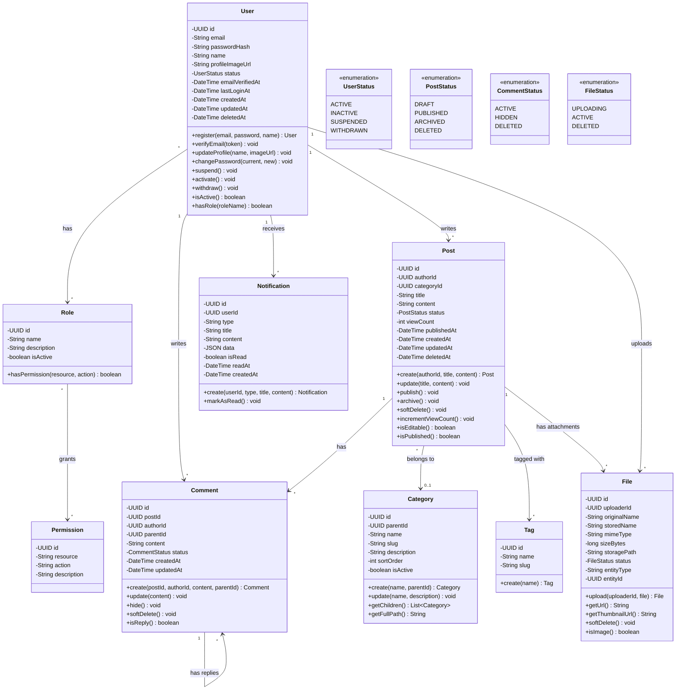
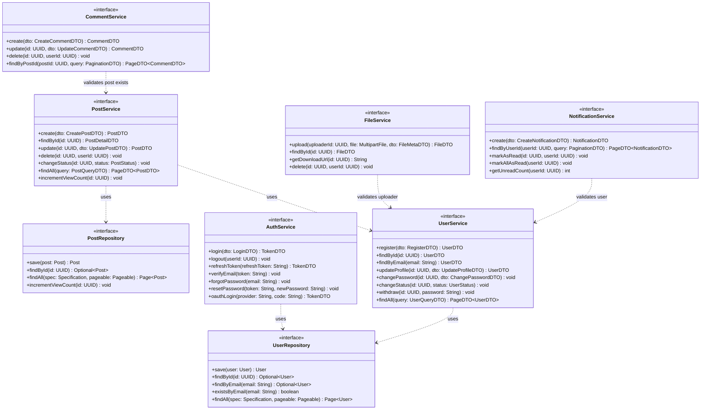
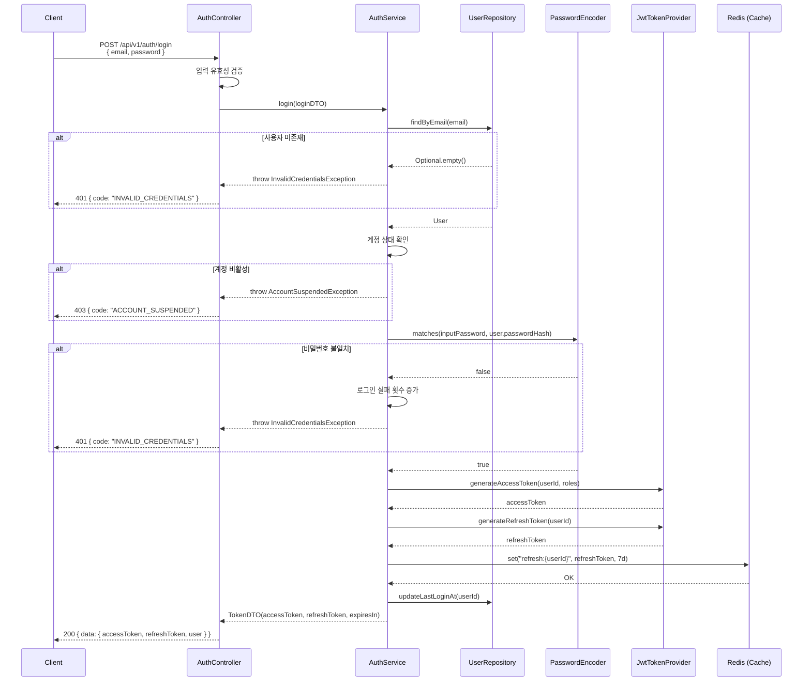
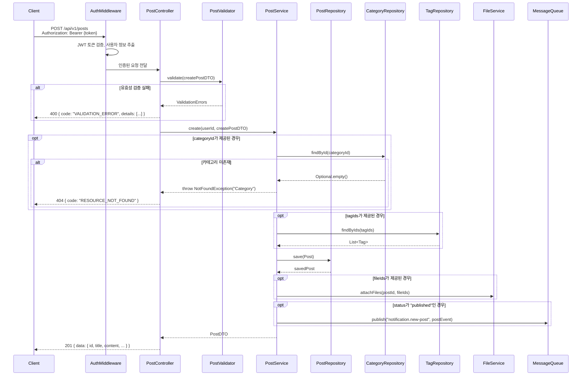
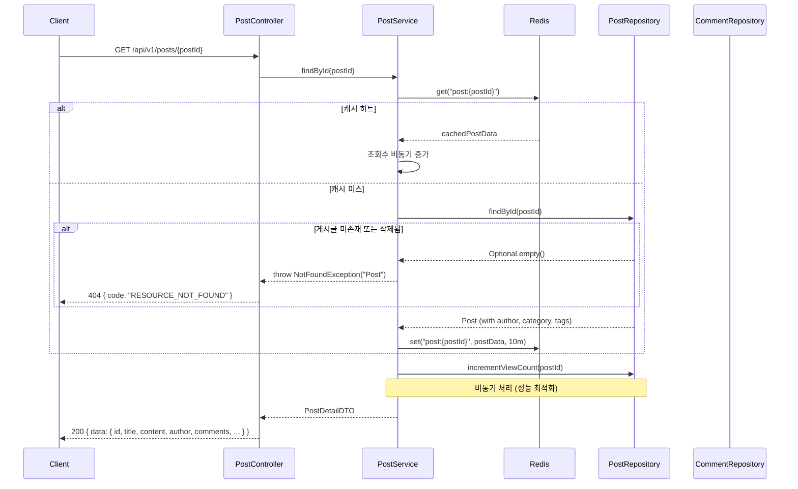
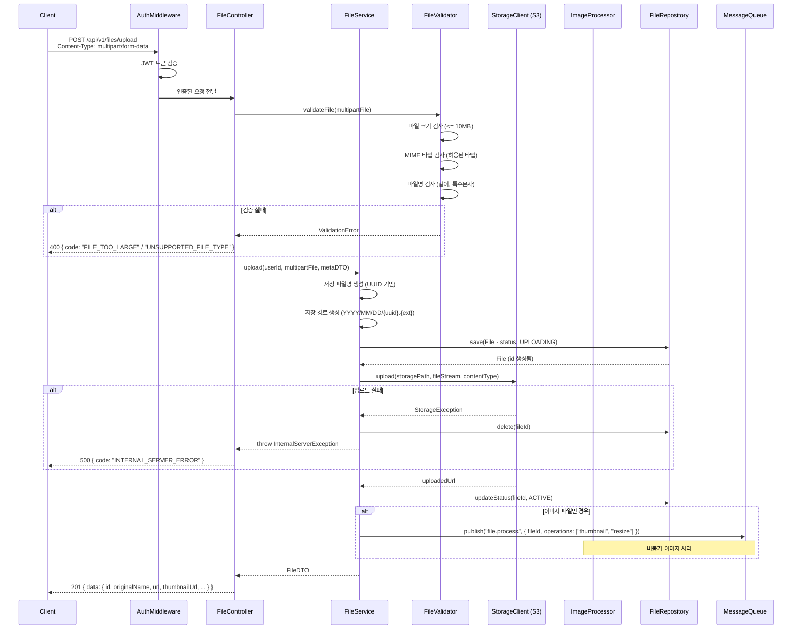
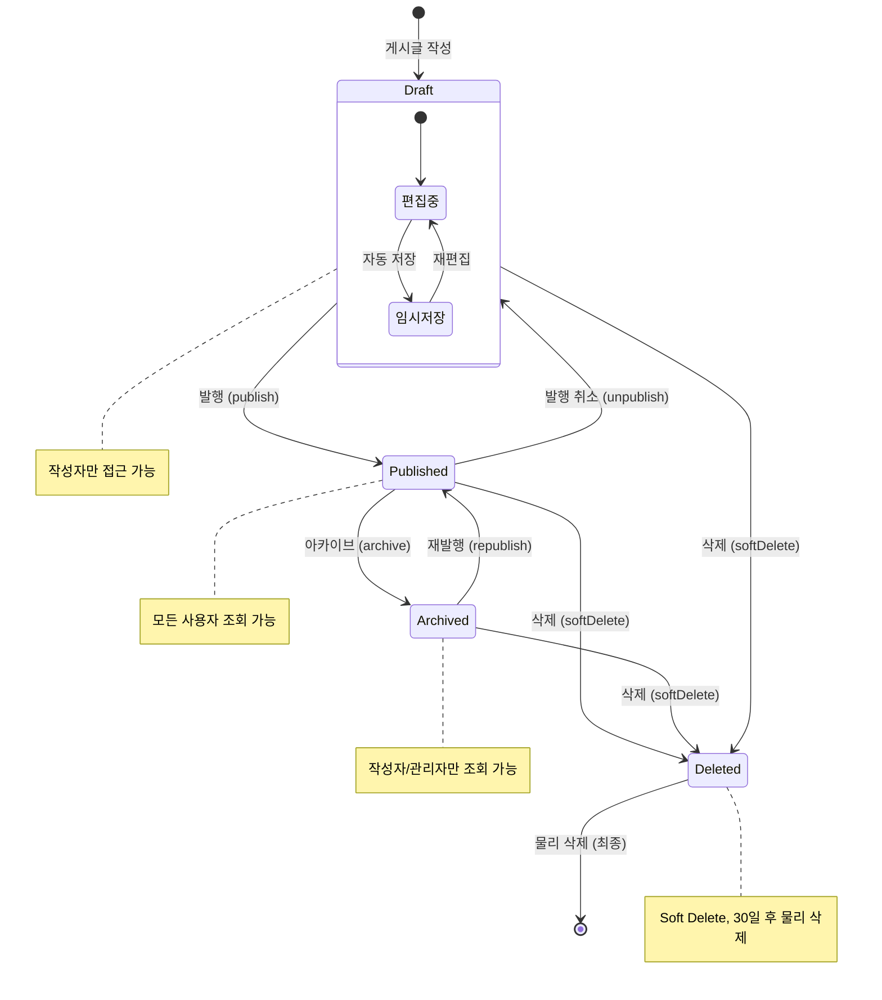
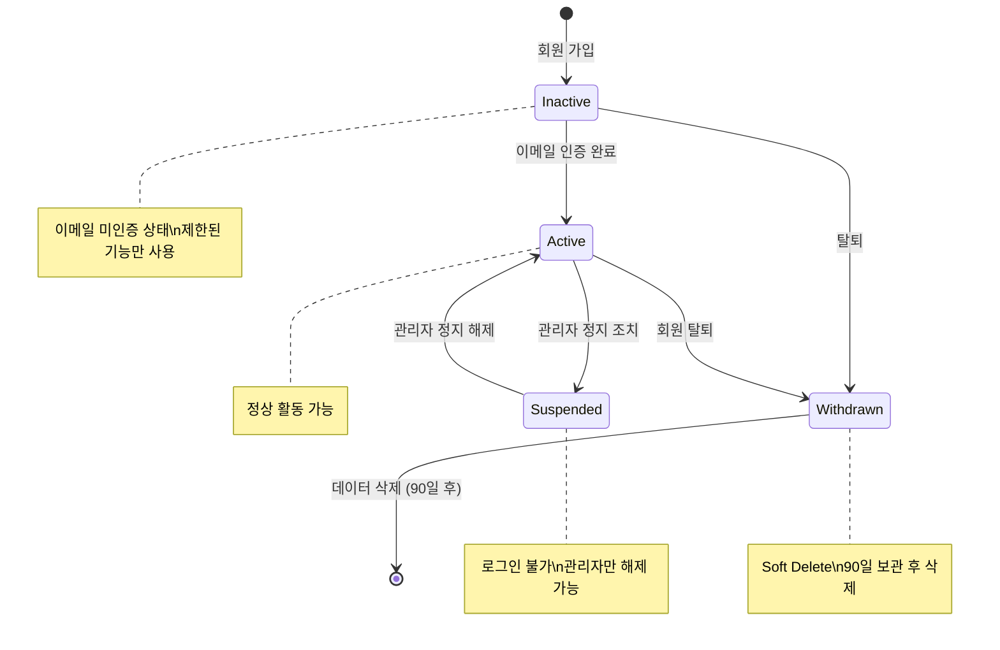
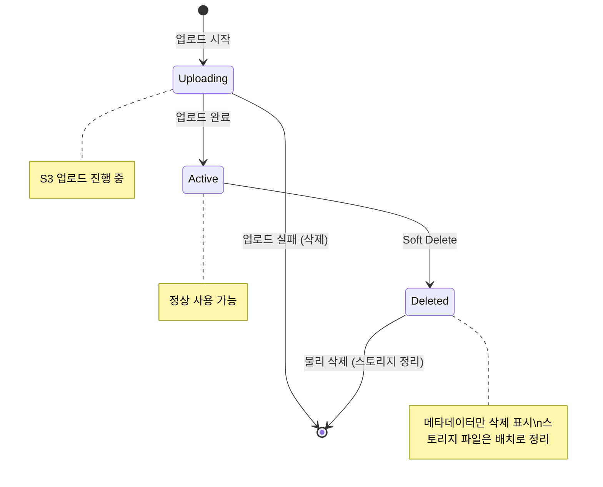

# 상세 설계서 (Detailed Design Document)

| 항목 | 내용 |
|------|------|
| **프로젝트명** | [프로젝트명] |
| **문서 버전** | [v1.0] |
| **작성일** | [YYYY-MM-DD] |
| **작성자** | [작성자명 / 역할] |
| **승인자** | [승인자명 / 역할] |
| **문서 상태** | [초안 / 검토중 / 승인됨] |

---

## 1. 문서 개요

### 1.1 목적

본 문서는 [프로젝트명]의 상세 설계를 정의한다. 시스템 아키텍처 설계서(SAD)에서 정의된 아키텍처를 기반으로, 각 모듈의 클래스 구조, 시퀀스 흐름, 상태 전이, 디자인 패턴 적용 등 구현 수준의 설계를 기술한다.

### 1.2 범위

- 도메인 모델 및 클래스 다이어그램
- 주요 비즈니스 로직의 시퀀스 다이어그램
- 엔티티 상태 전이 다이어그램
- 모듈별 상세 설계 (인터페이스, 의존성, 주요 로직)
- 디자인 패턴 적용 기록
- 코딩 표준 및 코드 리뷰 체크리스트

### 1.3 참조 문서

| 문서명 | 버전 | 비고 |
|--------|------|------|
| 시스템 아키텍처 설계서 (SAD) | [v1.0] | 아키텍처 및 기술 스택 |
| 데이터베이스 설계서 | [v1.0] | 테이블 명세 및 관계 |
| API 설계서 | [v1.0] | API 명세 |
| 화면 설계서 | [v1.0] | UI/UX 명세 |
| 요구사항 정의서 (SRS) | [v1.0] | 기능/비기능 요구사항 |

### 1.4 변경 이력

| 버전 | 날짜 | 작성자 | 변경 내용 |
|------|------|--------|-----------|
| v0.1 | [YYYY-MM-DD] | [작성자] | 초안 작성 |
| v0.2 | [YYYY-MM-DD] | [작성자] | [변경 사항 요약] |
| v1.0 | [YYYY-MM-DD] | [작성자] | 최종 승인 |

---

## 2. 클래스 다이어그램

### 2.1 도메인 모델 전체 뷰



### 2.2 서비스 계층 클래스 다이어그램



### 2.3 Infrastructure 계층 클래스 다이어그램

```mermaid
classDiagram
    class JwtTokenProvider {
        -String secretKey
        -long accessTokenExpiry
        -long refreshTokenExpiry
        +generateAccessToken(userId: UUID, roles: List) String
        +generateRefreshToken(userId: UUID) String
        +validateToken(token: String) boolean
        +extractUserId(token: String) UUID
        +extractRoles(token: String) List~String~
    }

    class PasswordEncoder {
        <<interface>>
        +encode(rawPassword: String) String
        +matches(rawPassword: String, encodedPassword: String) boolean
    }

    class BcryptPasswordEncoder {
        -int costFactor
        +encode(rawPassword: String) String
        +matches(rawPassword: String, encodedPassword: String) boolean
    }

    class StorageClient {
        <<interface>>
        +upload(key: String, file: InputStream, contentType: String) String
        +download(key: String) InputStream
        +delete(key: String) void
        +getPresignedUrl(key: String, expiry: Duration) String
    }

    class S3StorageClient {
        -S3Client s3Client
        -String bucketName
        +upload(key: String, file: InputStream, contentType: String) String
        +download(key: String) InputStream
        +delete(key: String) void
        +getPresignedUrl(key: String, expiry: Duration) String
    }

    class EmailClient {
        <<interface>>
        +send(to: String, subject: String, body: String) void
        +sendTemplate(to: String, template: String, data: Map) void
    }

    class MessagePublisher {
        <<interface>>
        +publish(queue: String, message: Object) void
        +publishWithDelay(queue: String, message: Object, delay: Duration) void
    }

    class CacheClient {
        <<interface>>
        +get(key: String) Optional~String~
        +set(key: String, value: String, ttl: Duration) void
        +delete(key: String) void
        +exists(key: String) boolean
    }

    PasswordEncoder <|.. BcryptPasswordEncoder
    StorageClient <|.. S3StorageClient
```



---

## 3. 시퀀스 다이어그램

### 3.1 로그인 플로우



### 3.2 게시글 CRUD 플로우

#### 게시글 생성



#### 게시글 조회 (상세)



### 3.3 파일 업로드 플로우



---

## 4. 상태 다이어그램

### 4.1 게시글 상태 (Post Status)



#### 상태 전이 규칙

| 현재 상태 | 이벤트 | 다음 상태 | 권한 | 부가 동작 |
|-----------|--------|-----------|------|-----------|
| - | 게시글 작성 | Draft | 인증 사용자 | - |
| Draft | 발행 | Published | 작성자 | `publishedAt` 설정, 알림 발송 |
| Draft | 삭제 | Deleted | 작성자, 관리자 | `deletedAt` 설정 |
| Published | 발행 취소 | Draft | 작성자, 관리자 | `publishedAt` 초기화 |
| Published | 아카이브 | Archived | 작성자, 관리자 | - |
| Published | 삭제 | Deleted | 작성자, 관리자 | `deletedAt` 설정, 검색 인덱스 삭제 |
| Archived | 재발행 | Published | 작성자, 관리자 | `publishedAt` 갱신 |
| Archived | 삭제 | Deleted | 작성자, 관리자 | `deletedAt` 설정 |
| Deleted | 물리 삭제 | (삭제 완료) | 시스템 (배치) | 30일 경과 후 자동 |

### 4.2 사용자 계정 상태 (User Status)



#### 상태 전이 규칙

| 현재 상태 | 이벤트 | 다음 상태 | 트리거 | 부가 동작 |
|-----------|--------|-----------|--------|-----------|
| - | 회원 가입 | Inactive | 사용자 | 인증 메일 발송 |
| Inactive | 이메일 인증 | Active | 사용자 | `emailVerifiedAt` 설정 |
| Inactive | 탈퇴 | Withdrawn | 사용자 | `deletedAt` 설정 |
| Active | 정지 | Suspended | 관리자 | 로그인 차단, 알림 발송 |
| Active | 탈퇴 | Withdrawn | 사용자 | 비밀번호 확인 후 처리 |
| Suspended | 해제 | Active | 관리자 | 알림 발송 |
| Withdrawn | 데이터 삭제 | (완전 삭제) | 시스템 (배치) | 90일 후 PII 삭제 |

### 4.3 파일 상태 (File Status)



---

## 5. 모듈 상세 설계

### 5.1 UserModule

| 항목 | 내용 |
|------|------|
| **모듈명** | UserModule |
| **책임** | 사용자 계정 관리 (CRUD, 상태 관리, 프로필) |
| **의존성** | Database (UserRepository), Cache (Redis), PasswordEncoder |

#### 인터페이스 정의

```
UserService
├── register(dto: RegisterDTO): UserDTO
│   - 이메일 중복 검사
│   - 비밀번호 해싱 (bcrypt)
│   - 사용자 생성 (status: INACTIVE)
│   - 이메일 인증 토큰 생성 & 메일 발송
│
├── findById(id: UUID): UserDTO
│   - 캐시 우선 조회 (Cache-Aside)
│   - Soft Delete 필터링
│
├── updateProfile(id: UUID, dto: UpdateProfileDTO): UserDTO
│   - 소유권 확인
│   - 프로필 정보 업데이트
│   - 캐시 무효화
│
├── changePassword(id: UUID, dto: ChangePasswordDTO): void
│   - 현재 비밀번호 검증
│   - 새 비밀번호 해싱 & 저장
│   - 모든 세션 무효화 (선택)
│
├── changeStatus(id: UUID, status: UserStatus): void
│   - 상태 전이 규칙 검증
│   - 상태 변경 & 이벤트 발행
│
├── withdraw(id: UUID, password: String): void
│   - 비밀번호 확인
│   - Soft Delete (deletedAt 설정)
│   - 세션 무효화
│   - 관련 데이터 익명화 예약
│
└── findAll(query: UserQueryDTO): PageDTO<UserDTO>
    - 필터링 (상태, 가입일, 검색어)
    - 정렬 & 페이지네이션
```

#### 주요 로직/알고리즘

**비밀번호 정책 검증:**
```
validatePassword(password):
  1. 최소 8자 이상
  2. 대문자 1자 이상 포함
  3. 소문자 1자 이상 포함
  4. 숫자 1자 이상 포함
  5. 특수문자 1자 이상 포함 (!@#$%^&*)
  6. 이전 비밀번호와 동일하지 않음 (변경 시)
  7. 이메일/이름 포함하지 않음
```

**이메일 인증 토큰:**
```
generateVerificationToken(userId):
  1. 32바이트 랜덤 토큰 생성 (crypto-safe)
  2. SHA-256 해시하여 DB 저장 (token, userId, expiresAt: 24h)
  3. 원본 토큰을 인증 URL에 포함하여 메일 발송
  4. 인증 시: URL 토큰을 해시하여 DB와 비교 & 만료 확인
```

---

### 5.2 AuthModule

| 항목 | 내용 |
|------|------|
| **모듈명** | AuthModule |
| **책임** | 인증(Authentication), 토큰 관리 |
| **의존성** | UserModule, JwtTokenProvider, PasswordEncoder, Cache (Redis) |

#### 인터페이스 정의

```
AuthService
├── login(dto: LoginDTO): TokenDTO
│   - 이메일로 사용자 조회
│   - 계정 상태 확인 (ACTIVE만 허용)
│   - 비밀번호 검증 (bcrypt matches)
│   - 로그인 실패 횟수 관리 (Redis)
│   - Access Token + Refresh Token 발급
│   - 마지막 로그인 시각 갱신
│
├── logout(userId: UUID): void
│   - Refresh Token 무효화 (Redis에서 삭제)
│   - Access Token 블랙리스트 등록 (남은 TTL 동안)
│
├── refreshToken(refreshToken: String): TokenDTO
│   - Refresh Token 유효성 검증
│   - Redis에 저장된 토큰과 비교
│   - 새 Access Token 발급
│   - Refresh Token 로테이션 (선택: 새 Refresh Token 발급)
│
├── verifyEmail(token: String): void
│   - 토큰 해시 검증 & 만료 확인
│   - 사용자 상태 INACTIVE -> ACTIVE 전이
│   - 토큰 사용 완료 처리
│
├── forgotPassword(email: String): void
│   - 이메일로 사용자 조회 (존재 여부 응답하지 않음 - 보안)
│   - 재설정 토큰 생성 (1시간 유효)
│   - 비밀번호 재설정 메일 발송
│
├── resetPassword(token: String, newPassword: String): void
│   - 토큰 검증 & 만료 확인
│   - 새 비밀번호 해싱 & 저장
│   - 모든 세션 무효화
│   - 토큰 사용 완료 처리
│
└── oauthLogin(provider: String, code: String): TokenDTO
    - Authorization Code를 Access Token으로 교환
    - OAuth Provider에서 사용자 정보 조회
    - 사용자 조회/생성 (소셜 연동)
    - JWT 토큰 발급
```

#### 주요 로직/알고리즘

**로그인 실패 제한 (Brute Force Protection):**
```
checkLoginAttempts(email):
  1. Redis key: "login_attempts:{email}"
  2. 현재 실패 횟수 조회
  3. 실패 횟수 >= 5:
     - 잠금 시간 확인 (key: "login_locked:{email}")
     - 잠금 중이면 "N분 후 재시도" 에러 반환
  4. 로그인 실패 시:
     - 실패 횟수 증가 (TTL: 30분)
     - 5회 도달 시 15분 잠금 설정
  5. 로그인 성공 시:
     - 실패 횟수 초기화 (key 삭제)
```

**JWT Token 구조:**
```
Access Token Payload:
  {
    "sub": "userId (UUID)",
    "email": "user@example.com",
    "roles": ["user", "editor"],
    "type": "access",
    "iat": 1705312200,
    "exp": 1705313100    // iat + 15분
  }

Refresh Token Payload:
  {
    "sub": "userId (UUID)",
    "type": "refresh",
    "jti": "unique-token-id (UUID)",
    "iat": 1705312200,
    "exp": 1705917000    // iat + 7일
  }
```

---

### 5.3 PostModule

| 항목 | 내용 |
|------|------|
| **모듈명** | PostModule |
| **책임** | 게시글 CRUD, 상태 관리, 검색 |
| **의존성** | UserModule, FileModule, Cache (Redis), SearchEngine (Elasticsearch), MessageQueue |

#### 인터페이스 정의

```
PostService
├── create(userId: UUID, dto: CreatePostDTO): PostDTO
│   - 사용자 존재 및 권한 확인
│   - 카테고리/태그 유효성 검증
│   - 게시글 생성 (status: dto.status || DRAFT)
│   - 첨부 파일 연결
│   - status=PUBLISHED 시: 검색 인덱스 추가, 알림 발송
│
├── findById(id: UUID): PostDetailDTO
│   - 캐시 우선 조회
│   - 작성자, 카테고리, 태그 정보 JOIN
│   - 조회수 비동기 증가
│   - 삭제된 게시글 접근 차단 (관리자 제외)
│
├── update(id: UUID, userId: UUID, dto: UpdatePostDTO): PostDTO
│   - 소유권/권한 확인
│   - 수정 가능 상태 확인 (isEditable)
│   - 게시글 업데이트
│   - 캐시 무효화
│   - 검색 인덱스 갱신 (발행 상태인 경우)
│
├── delete(id: UUID, userId: UUID): void
│   - 소유권/권한 확인
│   - Soft Delete (deletedAt 설정)
│   - 캐시 무효화
│   - 검색 인덱스 삭제
│
├── changeStatus(id: UUID, userId: UUID, status: PostStatus): void
│   - 소유권/권한 확인
│   - 상태 전이 규칙 검증
│   - 상태 변경 & 부가 동작 실행
│
└── findAll(query: PostQueryDTO): PageDTO<PostDTO>
    - 필터링: 카테고리, 태그, 상태, 작성자, 검색어
    - 정렬: 최신순, 조회순, 댓글순
    - 페이지네이션 (Offset 또는 Cursor)
    - 검색어 있을 경우 Elasticsearch 활용
```

#### 주요 로직/알고리즘

**조회수 증가 (중복 방지):**
```
incrementViewCount(postId, clientInfo):
  1. 식별 키 생성: "view:{postId}:{userId 또는 IP+UA hash}"
  2. Redis SETNX (키 존재하지 않으면 설정): TTL 1시간
  3. 설정 성공 시 (신규 조회):
     - DB 조회수 증가 (비동기, 배치 처리 가능)
     - Redis에 조회수 카운터 증가 (실시간 표시용)
  4. 설정 실패 시 (중복 조회):
     - 아무 동작 안 함
```

**게시글 검색 전략:**
```
search(query, filters):
  1. 검색어가 있을 경우:
     - Elasticsearch에 검색 요청
     - 필터 조건 적용 (status=PUBLISHED, categoryId, tagIds)
     - Relevance score 기반 정렬
     - 결과 ID 목록으로 DB에서 상세 데이터 조회
  2. 검색어가 없을 경우:
     - DB 직접 쿼리 (인덱스 활용)
     - 필터 및 정렬 조건 적용
```

---

### 5.4 NotificationModule

| 항목 | 내용 |
|------|------|
| **모듈명** | NotificationModule |
| **책임** | 알림 생성, 발송, 읽음 관리 |
| **의존성** | UserModule, EmailClient, MessageQueue, Cache (Redis) |

#### 인터페이스 정의

```
NotificationService
├── create(dto: CreateNotificationDTO): NotificationDTO
│   - 알림 DB 저장
│   - 미읽음 카운트 캐시 증가
│   - 알림 유형에 따라 채널별 발송 (in-app, email, push)
│
├── findByUserId(userId: UUID, query: PaginationDTO): PageDTO<NotificationDTO>
│   - 사용자별 알림 목록 조회
│   - 최신순 정렬
│   - 읽음/미읽음 필터 (선택)
│
├── markAsRead(id: UUID, userId: UUID): void
│   - 소유권 확인
│   - 읽음 처리 (isRead=true, readAt 설정)
│   - 미읽음 카운트 캐시 감소
│
├── markAllAsRead(userId: UUID): void
│   - 해당 사용자의 미읽음 알림 일괄 읽음 처리
│   - 미읽음 카운트 캐시 초기화
│
└── getUnreadCount(userId: UUID): int
    - Redis 캐시에서 미읽음 수 조회
    - 캐시 미스 시 DB 집계 후 캐시 설정
```

#### 알림 유형별 발송 전략

| 알림 유형 | In-App | Email | Push | 트리거 |
|-----------|--------|-------|------|--------|
| `COMMENT_ON_MY_POST` | O | O (설정 시) | O | 내 게시글에 댓글 |
| `REPLY_TO_MY_COMMENT` | O | X | O | 내 댓글에 답글 |
| `POST_PUBLISHED` | O | X | X | 팔로우 작성자 게시글 발행 |
| `ACCOUNT_SUSPENDED` | O | O | X | 관리자 계정 정지 |
| `PASSWORD_RESET` | X | O | X | 비밀번호 재설정 요청 |
| [추가 유형] | [여부] | [여부] | [여부] | [트리거] |

---

### 5.5 FileModule

| 항목 | 내용 |
|------|------|
| **모듈명** | FileModule |
| **책임** | 파일 업로드/다운로드, 이미지 처리, 스토리지 관리 |
| **의존성** | StorageClient (S3), ImageProcessor, MessageQueue, Database |

#### 인터페이스 정의

```
FileService
├── upload(uploaderId: UUID, file: MultipartFile, dto: FileMetaDTO): FileDTO
│   - 파일 유효성 검증 (크기, MIME 타입)
│   - 저장 경로 생성 (YYYY/MM/DD/{uuid}.{ext})
│   - 스토리지 업로드
│   - 메타데이터 DB 저장
│   - 이미지인 경우 썸네일 생성 요청 (비동기)
│
├── findById(id: UUID): FileDTO
│   - 파일 메타데이터 조회
│   - 접근 URL 생성 (CDN URL 또는 Pre-signed URL)
│
├── getDownloadUrl(id: UUID): String
│   - Pre-signed URL 생성 (유효 시간: 1시간)
│
├── delete(id: UUID, userId: UUID): void
│   - 소유권/권한 확인
│   - Soft Delete (메타데이터)
│   - 스토리지 파일 삭제는 배치로 처리
│
└── processImage(fileId: UUID, operations: List<String>): void
    - 메시지 큐로부터 수신 (Worker)
    - 썸네일 생성 (300x300, cover crop)
    - 리사이징 (최대 1920px)
    - 포맷 변환 (WebP)
    - 결과 파일 스토리지 업로드
    - 메타데이터 업데이트
```

#### 파일 저장 경로 규칙

```
저장 경로 생성:
  1. 기본 경로: {환경}/{연}/{월}/{일}/{uuid}.{ext}
     예) prod/2025/01/15/a1b2c3d4-e5f6-7890-abcd-ef1234567890.png
  2. 썸네일: {기본경로}_thumb.{ext}
  3. 리사이즈: {기본경로}_w1920.webp
  4. 환경 분리로 DEV/STG/PROD 파일 혼재 방지
  5. 날짜별 디렉토리로 파일 분산
```

---

## 6. 디자인 패턴 적용 기록

### 6.1 적용 패턴 목록

| 패턴명 | 적용 위치 | 목적 | 코드 구조 설명 |
|--------|-----------|------|---------------|
| **Repository** | 모든 데이터 접근 계층 | 데이터 접근 로직을 도메인으로부터 분리. DB 변경 시 영향 최소화 | `UserRepository` (인터페이스) -> `UserRepositoryImpl` (구현체). 도메인은 인터페이스에만 의존 |
| **Strategy** | 알림 발송, 파일 스토리지 | 런타임에 알림 채널(email/push/in-app)이나 스토리지 구현체를 교체 | `NotificationSender` 인터페이스 -> `EmailSender`, `PushSender`, `InAppSender` 구현 |
| **Factory** | 알림 생성, 이벤트 생성 | 알림/이벤트 유형에 따라 적절한 객체 생성 로직 캡슐화 | `NotificationFactory.create(type, data)` -> 유형별 Notification 인스턴스 반환 |
| **Observer (Event)** | 도메인 이벤트 처리 | 도메인 동작 후 부수 효과(알림, 검색 인덱싱, 감사 로그)를 디커플링 | 게시글 발행 시 `PostPublishedEvent` 발행 -> `NotificationHandler`, `SearchIndexHandler` 구독 |
| **Builder** | DTO 생성, 쿼리 빌더 | 복잡한 객체 생성을 단계별로 구성, 가독성 향상 | `PostQueryBuilder.status(PUBLISHED).category(id).sort(CREATED_AT).build()` |
| **Decorator** | 캐시 적용 | 기존 Repository에 캐싱 로직을 투명하게 추가 | `CachedUserRepository`가 `UserRepository`를 감싸서 캐시 우선 조회 로직 추가 |
| **Template Method** | 소셜 로그인 | OAuth 로그인의 공통 플로우 정의, Provider별 세부 구현은 하위 클래스에 위임 | `AbstractOAuthLoginHandler.login()` -> `GoogleOAuthHandler`, `KakaoOAuthHandler` |
| **Guard Clause** | 서비스 계층 전반 | 유효성 검사를 메서드 초반에 배치하여 가독성 향상 및 조기 반환 | 권한 확인, 상태 검증 등을 메서드 시작 부분에서 수행 |
| [추가 패턴] | [위치] | [목적] | [구조 설명] |

### 6.2 패턴 적용 상세 예시

#### Repository 패턴

```
// 인터페이스 (Domain 계층)
interface UserRepository {
  save(user: User): User
  findById(id: UUID): Optional<User>
  findByEmail(email: String): Optional<User>
  existsByEmail(email: String): boolean
}

// 구현체 (Infrastructure 계층)
class TypeOrmUserRepository implements UserRepository {
  // TypeORM/JPA 등 ORM을 사용한 구현
  // 도메인은 이 구현체를 직접 참조하지 않음 (DI 활용)
}
```

#### Strategy 패턴 (알림 발송)

```
// Strategy 인터페이스
interface NotificationSender {
  send(notification: Notification): void
  supports(channel: NotificationChannel): boolean
}

// 구체 Strategy
class EmailNotificationSender implements NotificationSender { ... }
class PushNotificationSender implements NotificationSender { ... }
class InAppNotificationSender implements NotificationSender { ... }

// Context
class NotificationDispatcher {
  senders: List<NotificationSender>

  dispatch(notification, channels):
    for channel in channels:
      sender = senders.find(s => s.supports(channel))
      sender.send(notification)  // 비동기 처리
}
```

#### Observer 패턴 (도메인 이벤트)

```
// 이벤트 정의
class PostPublishedEvent {
  postId: UUID
  authorId: UUID
  title: String
  publishedAt: DateTime
}

// 이벤트 핸들러들
class SendNotificationOnPostPublished {
  handle(event: PostPublishedEvent):
    // 팔로워들에게 알림 발송
}

class UpdateSearchIndexOnPostPublished {
  handle(event: PostPublishedEvent):
    // Elasticsearch 인덱스 업데이트
}

class RecordAnalyticsOnPostPublished {
  handle(event: PostPublishedEvent):
    // 분석 데이터 기록
}
```

---

## 7. 코딩 표준

### 7.1 네이밍 컨벤션

| 대상 | 규칙 | 예시 | 반례 |
|------|------|------|------|
| 파일명 (클래스) | PascalCase | `UserService.ts`, `PostController.java` | `userService.ts` |
| 파일명 (유틸) | PascalCase 또는 kebab-case | `DateUtils.ts`, `string-helpers.ts` | `dateutils.ts` |
| 클래스 | PascalCase | `UserService`, `PostRepository` | `userService` |
| 인터페이스 | PascalCase (접두사 `I` 미사용) | `UserRepository`, `StorageClient` | `IUserRepository` |
| 메서드/함수 | camelCase | `findById()`, `createPost()` | `FindById()`, `create_post()` |
| 변수 | camelCase | `userId`, `postTitle` | `user_id`, `PostTitle` |
| 상수 | UPPER_SNAKE_CASE | `MAX_FILE_SIZE`, `DEFAULT_PAGE_SIZE` | `maxFileSize` |
| Enum 값 | UPPER_SNAKE_CASE | `UserStatus.ACTIVE`, `PostStatus.DRAFT` | `UserStatus.active` |
| DB 컬럼 | snake_case | `created_at`, `user_id` | `createdAt` |
| URL 경로 | kebab-case | `/user-profiles`, `/blog-posts` | `/userProfiles` |
| 환경 변수 | UPPER_SNAKE_CASE | `DATABASE_URL`, `JWT_SECRET` | `databaseUrl` |

#### 네이밍 의미 규칙

| 접두사/접미사 | 용도 | 예시 |
|-------------|------|------|
| `is/has/can` | Boolean 반환 메서드/변수 | `isActive()`, `hasPermission()`, `canEdit` |
| `get` | 조회 (반환값 있음) | `getUser()`, `getPostCount()` |
| `find` | 검색 (없을 수 있음, Optional 반환) | `findByEmail()`, `findById()` |
| `create` | 새 객체 생성 | `createPost()`, `createUser()` |
| `update` | 기존 객체 수정 | `updateProfile()`, `updateStatus()` |
| `delete/remove` | 삭제 | `deletePost()`, `removeTag()` |
| `validate` | 유효성 검증 | `validateEmail()`, `validatePassword()` |
| `to/from` | 변환 | `toDTO()`, `fromEntity()` |
| `DTO` | 데이터 전송 객체 | `CreatePostDTO`, `UserResponseDTO` |
| `Exception` | 예외 클래스 | `NotFoundException`, `InvalidTokenException` |

### 7.2 코드 구조

#### 디렉토리 구조

```
src/
├── modules/                    # 기능 모듈 (도메인별 그룹화)
│   ├── user/
│   │   ├── controllers/        # Presentation Layer
│   │   │   └── UserController.ts
│   │   ├── services/           # Application Layer
│   │   │   └── UserService.ts
│   │   ├── entities/           # Domain Layer
│   │   │   ├── User.ts
│   │   │   └── UserStatus.ts
│   │   ├── repositories/       # Data Access Layer
│   │   │   └── UserRepository.ts
│   │   ├── dtos/               # DTOs
│   │   │   ├── CreateUserDTO.ts
│   │   │   └── UserResponseDTO.ts
│   │   ├── validators/         # 입력 검증
│   │   │   └── UserValidator.ts
│   │   └── __tests__/          # 단위 테스트
│   │       ├── UserService.test.ts
│   │       └── UserController.test.ts
│   ├── auth/
│   ├── post/
│   ├── comment/
│   ├── file/
│   └── notification/
├── common/                     # 공통 모듈
│   ├── exceptions/             # 커스텀 예외
│   ├── middleware/              # 미들웨어 (인증, 로깅 등)
│   ├── guards/                 # 인가 가드
│   ├── interceptors/           # 인터셉터
│   ├── filters/                # 예외 필터
│   ├── decorators/             # 커스텀 데코레이터
│   ├── pipes/                  # 유효성 검증 파이프
│   └── utils/                  # 유틸리티 함수
├── config/                     # 환경 설정
│   ├── database.config.ts
│   ├── cache.config.ts
│   ├── auth.config.ts
│   └── storage.config.ts
├── infrastructure/             # 인프라 구현체
│   ├── database/
│   ├── cache/
│   ├── storage/
│   ├── email/
│   └── queue/
└── main.ts                     # 진입점
```

#### 파일 내부 구조 규칙

```
// 1. 임포트 (외부 -> 내부 순서, 빈 줄로 그룹 구분)
import { External } from 'external-library';

import { Internal } from '@/common/...';

import { Local } from './local-file';

// 2. 상수 및 타입 정의

// 3. 클래스/함수 정의

// 4. 헬퍼 함수 (있을 경우)
```

### 7.3 주석/문서화 규칙

| 규칙 | 설명 |
|------|------|
| 자명한 코드 | 코드 자체로 의도가 명확하면 주석 불필요 |
| Why 주석 | 코드의 이유를 설명할 때 주석 사용 (What이 아닌 Why) |
| 공개 API | 모든 공개 메서드에 JSDoc/Javadoc 문서화 |
| TODO/FIXME | `// TODO: [설명] - [담당자] [날짜]` 형식 |
| 폐기 표시 | `@deprecated` 어노테이션 + 대안 안내 |
| 복잡한 로직 | 알고리즘, 비즈니스 규칙에 주석 첨부 |
| 매직 넘버 금지 | 상수로 추출하여 명명 |

#### 주석 예시

```
// 좋은 예 - Why를 설명
// 30일이 지난 Soft Deleted 데이터를 물리 삭제한다.
// 개인정보보호법에 따른 보존 기간 준수를 위함.
async purgeDeletedUsers() { ... }

// 나쁜 예 - What을 설명 (코드만 봐도 알 수 있음)
// 사용자를 삭제한다
async deleteUser(id) { ... }
```

### 7.4 에러 처리 규칙

| 규칙 | 설명 |
|------|------|
| 커스텀 예외 사용 | 비즈니스 로직 에러는 커스텀 예외 클래스 사용 |
| 예외 계층 구조 | `AppException` (base) -> `NotFoundException`, `ValidationException` 등 |
| 글로벌 예외 핸들러 | 모든 예외를 한 곳에서 처리하여 일관된 에러 응답 반환 |
| 로깅 | 500 에러는 ERROR 레벨, 4xx는 WARN 또는 INFO |
| 민감 정보 | 에러 응답에 스택 트레이스, DB 쿼리 등 노출 금지 |
| 재시도 | 외부 서비스 호출은 재시도 로직 포함 (지수 백오프) |

#### 예외 클래스 구조

```
AppException (base)
├── NotFoundException        // 404 - 자원 미존재
├── ValidationException      // 400 - 유효성 검증 실패
├── UnauthorizedException    // 401 - 인증 실패
├── ForbiddenException       // 403 - 권한 부족
├── ConflictException        // 409 - 자원 충돌
├── UnprocessableException   // 422 - 비즈니스 규칙 위반
├── RateLimitException       // 429 - 요청 제한 초과
└── ExternalServiceException // 502 - 외부 서비스 오류
```

### 7.5 코드 리뷰 체크리스트

#### 기능 (Functionality)

| 항목 | 확인 내용 |
|------|-----------|
| [ ] | 요구사항을 올바르게 구현했는가? |
| [ ] | 엣지 케이스를 고려했는가? (null, 빈 값, 경계값) |
| [ ] | 에러 처리가 적절한가? |
| [ ] | 트랜잭션 범위가 적절한가? |
| [ ] | 동시성 이슈가 없는가? (Race Condition) |

#### 보안 (Security)

| 항목 | 확인 내용 |
|------|-----------|
| [ ] | SQL Injection 방어 (파라미터 바인딩 사용) |
| [ ] | XSS 방어 (입력값 이스케이핑, CSP 설정) |
| [ ] | 인증/인가가 올바르게 적용되었는가? |
| [ ] | 민감 정보가 로그에 노출되지 않는가? |
| [ ] | 입력값 유효성 검증이 충분한가? |
| [ ] | IDOR (Insecure Direct Object Reference) 방지 |

#### 성능 (Performance)

| 항목 | 확인 내용 |
|------|-----------|
| [ ] | N+1 쿼리 문제가 없는가? |
| [ ] | 불필요한 DB 쿼리가 없는가? |
| [ ] | 적절한 인덱스를 사용하는가? |
| [ ] | 대용량 데이터 처리 시 페이지네이션/스트리밍 사용 |
| [ ] | 캐시가 필요한 곳에 적용되었는가? |
| [ ] | 메모리 누수 가능성이 없는가? |

#### 코드 품질 (Quality)

| 항목 | 확인 내용 |
|------|-----------|
| [ ] | 네이밍 컨벤션을 준수하는가? |
| [ ] | 코드 중복이 없는가? (DRY) |
| [ ] | 함수/메서드 크기가 적절한가? (단일 책임) |
| [ ] | 매직 넘버 없이 상수를 사용하는가? |
| [ ] | 타입이 올바르게 정의되었는가? (any 사용 지양) |
| [ ] | 불필요한 주석이 없는가? |

#### 테스트 (Testing)

| 항목 | 확인 내용 |
|------|-----------|
| [ ] | 단위 테스트가 작성되었는가? |
| [ ] | Happy Path와 Error Path 모두 테스트하는가? |
| [ ] | 외부 의존성이 모킹되었는가? |
| [ ] | 테스트 커버리지가 기준([N]% 이상)을 충족하는가? |
| [ ] | 테스트가 독립적으로 실행 가능한가? (순서 무관) |

#### 유지보수성 (Maintainability)

| 항목 | 확인 내용 |
|------|-----------|
| [ ] | 코드가 읽기 쉽고 이해하기 쉬운가? |
| [ ] | 적절한 추상화 수준인가? (과도한 추상화 지양) |
| [ ] | 변경 영향 범위가 최소화되어 있는가? |
| [ ] | 하드코딩된 값이 없는가? (환경 변수/설정 파일 사용) |
| [ ] | 의존성 방향이 올바른가? (상위 -> 하위 의존) |

---

## 부록

### A. DTO 목록

| DTO 명 | 용도 | 주요 필드 |
|--------|------|-----------|
| `RegisterDTO` | 회원 가입 요청 | email, password, name, agreeToTerms |
| `LoginDTO` | 로그인 요청 | email, password |
| `TokenDTO` | 토큰 응답 | accessToken, refreshToken, tokenType, expiresIn |
| `UpdateProfileDTO` | 프로필 수정 요청 | name, profileImageUrl |
| `ChangePasswordDTO` | 비밀번호 변경 요청 | currentPassword, newPassword |
| `CreatePostDTO` | 게시글 생성 요청 | title, content, categoryId, tagIds, status, fileIds |
| `UpdatePostDTO` | 게시글 수정 요청 | title, content, categoryId, tagIds |
| `PostQueryDTO` | 게시글 목록 조회 조건 | page, pageSize, sort, order, q, categoryId, status, authorId, tag |
| `CreateCommentDTO` | 댓글 생성 요청 | postId, content, parentId |
| `FileMetaDTO` | 파일 메타 정보 | entityType, entityId |
| `CreateNotificationDTO` | 알림 생성 | userId, type, title, content, data |
| `PaginationDTO` | 페이지네이션 공통 | page, pageSize, sort, order |
| `PageDTO<T>` | 페이지네이션 응답 | data[], pagination(page, pageSize, totalItems, totalPages, hasNext) |
| `UserDTO` | 사용자 응답 | id, email, name, profileImageUrl, status, createdAt |
| `PostDTO` | 게시글 목록 응답 | id, title, contentPreview, author, category, tags, viewCount, commentCount, createdAt |
| `PostDetailDTO` | 게시글 상세 응답 | id, title, content, author, category, tags, files, viewCount, createdAt, updatedAt |
| `CommentDTO` | 댓글 응답 | id, author, content, parentId, replies, createdAt |
| `FileDTO` | 파일 응답 | id, originalName, mimeType, sizeBytes, url, thumbnailUrl, createdAt |
| `NotificationDTO` | 알림 응답 | id, type, title, content, isRead, createdAt |
| [추가 DTO] | [용도] | [주요 필드] |

### B. 다이어그램 목록

| 다이어그램 | 섹션 | 유형 | 용도 |
|-----------|------|------|------|
| 도메인 모델 전체 뷰 | 2.1 | classDiagram | 도메인 엔티티 관계 |
| 서비스 계층 구조 | 2.2 | classDiagram | 서비스-리포지토리 의존성 |
| Infrastructure 계층 | 2.3 | classDiagram | 인프라 구현체 구조 |
| 로그인 플로우 | 3.1 | sequenceDiagram | 인증 프로세스 |
| 게시글 생성 플로우 | 3.2 | sequenceDiagram | 게시글 CRUD |
| 게시글 조회 플로우 | 3.2 | sequenceDiagram | 캐시 활용 조회 |
| 파일 업로드 플로우 | 3.3 | sequenceDiagram | 파일 처리 |
| 게시글 상태 전이 | 4.1 | stateDiagram | 게시글 라이프사이클 |
| 사용자 상태 전이 | 4.2 | stateDiagram | 사용자 계정 라이프사이클 |
| 파일 상태 전이 | 4.3 | stateDiagram | 파일 라이프사이클 |

### C. 참조 문서

| 문서 | 경로 |
|------|------|
| 시스템 아키텍처 설계서 | [경로] |
| 데이터베이스 설계서 | [경로] |
| API 설계서 | [경로] |
| 화면 설계서 | [경로] |
| 요구사항 정의서 | [경로] |
