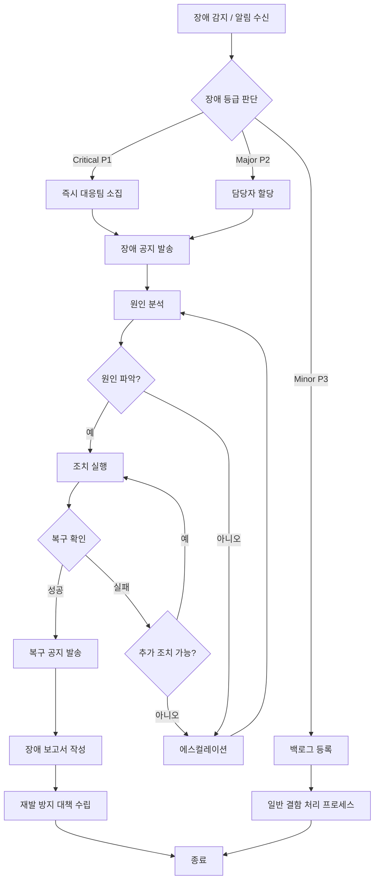

# 운영 가이드 (Operations Guide)

| 항목 | 내용 |
|------|------|
| **프로젝트명** | [프로젝트명] |
| **문서 버전** | [v1.0] |
| **작성일** | [YYYY-MM-DD] |
| **작성자** | [작성자명 / 역할] |
| **대상 독자** | 운영팀, 인프라팀, 온콜 담당자 |

---

## 1. 시스템 개요

### 1.1 시스템 구성도

```
[사용자] → [CDN / WAF] → [로드밸런서]
                              ├→ [웹 서버 / 프론트엔드]
                              └→ [API 서버 (N대)]
                                    ├→ [Primary DB] ↔ [Replica DB]
                                    ├→ [캐시 서버 (Redis)]
                                    ├→ [파일 스토리지 (S3)]
                                    ├→ [검색 엔진 (Elasticsearch)]
                                    └→ [외부 서비스 연동]

[모니터링 시스템] → 각 구성 요소 메트릭 수집
[로깅 시스템] → 각 구성 요소 로그 수집
```

> **참고**: 프로젝트 아키텍처에 맞게 구성도를 작성하세요. Mermaid, draw.io 등으로 시각화를 권장합니다.

### 1.2 주요 컴포넌트

| 컴포넌트 | 설명 | 기술 | 인스턴스 수 | 비고 |
|----------|------|------|------------|------|
| 프론트엔드 | 사용자 웹 인터페이스 | [React / Next.js / Vue.js / 기타] | [N]대 | CDN 배포 |
| API 서버 | 백엔드 비즈니스 로직 | [Node.js / Spring / Django / 기타] | [N]대 | 오토스케일링 |
| 데이터베이스 | 데이터 저장소 | [PostgreSQL / MySQL / MongoDB / 기타] | Primary [1] + Replica [N] | |
| 캐시 | 세션/데이터 캐시 | [Redis / Memcached / 기타] | [N]대 | 클러스터 모드 |
| 파일 스토리지 | 사용자 업로드 파일 | [AWS S3 / GCS / 기타] | - | |
| 검색 엔진 | 전문 검색 | [Elasticsearch / OpenSearch / 기타] | [N]대 | [해당 시] |
| 메시지 큐 | 비동기 작업 처리 | [RabbitMQ / SQS / Kafka / 기타] | [N]대 | [해당 시] |
| 배치/스케줄러 | 정기 배치 작업 | [cron / AWS Lambda / 기타] | [N]대 | [해당 시] |

### 1.3 기술 스택

| 계층 | 기술 | 버전 | 비고 |
|------|------|------|------|
| Frontend | [React / Next.js] | [v18.x / v14.x] | |
| Backend | [Node.js / Express] | [v20.x / v4.x] | |
| Database | [PostgreSQL] | [v15.x] | |
| Cache | [Redis] | [v7.x] | |
| Container | [Docker] | [v24.x] | |
| Orchestration | [Kubernetes / ECS / 기타] | [v1.28 / 기타] | |
| CI/CD | [GitHub Actions / Jenkins / 기타] | - | |
| IaC | [Terraform / CDK / 기타] | [버전] | [해당 시] |

---

## 2. 접속 정보

### 2.1 서버 목록

| 환경 | 역할 | 호스트 | IP | 포트 | 접속 방법 | 비고 |
|------|------|--------|-----|------|-----------|------|
| PROD | API 서버 1 | [api-1.example.com] | [10.0.1.x] | [3000] | [SSH / SSM] | |
| PROD | API 서버 2 | [api-2.example.com] | [10.0.1.x] | [3000] | [SSH / SSM] | |
| PROD | Worker 서버 | [worker.example.com] | [10.0.2.x] | - | [SSH / SSM] | 배치 처리 |
| PROD | Bastion | [bastion.example.com] | [Public IP] | [22] | SSH | 접근 게이트웨이 |
| STG | 전체 | [stg.example.com] | [10.0.10.x] | [3000] | [SSH / SSM] | |

### 2.2 데이터베이스 접속

| 환경 | 구분 | 호스트 | 포트 | DB명 | 사용자 | 비고 |
|------|------|--------|------|------|--------|------|
| PROD | Primary | [prod-db.example.com] | [5432] | [project_prod] | [db_user] | 읽기/쓰기 |
| PROD | Replica | [prod-db-ro.example.com] | [5432] | [project_prod] | [db_readonly] | 읽기 전용 |
| STG | Primary | [stg-db.example.com] | [5432] | [project_stg] | [db_user] | |

> **주의**: 실제 비밀번호는 [시크릿 매니저 서비스명]에서 관리합니다. 이 문서에 비밀번호를 기재하지 마세요.

### 2.3 관리 콘솔

| 서비스 | URL | 용도 | 접근 권한 |
|--------|-----|------|-----------|
| [AWS Console] | [https://console.aws.amazon.com] | 클라우드 인프라 관리 | 인프라팀 |
| [모니터링 대시보드] | [https://monitoring.example.com] | 시스템 모니터링 | 운영팀/개발팀 |
| [로그 대시보드] | [https://logs.example.com] | 로그 조회/분석 | 운영팀/개발팀 |
| [CI/CD 대시보드] | [https://ci.example.com] | 빌드/배포 관리 | 개발팀 |
| [관리자 페이지] | [https://admin.example.com] | 서비스 관리 | 운영팀 |
| [에러 트래킹] | [https://sentry.example.com] | 에러 수집/분석 | 개발팀 |

---

## 3. 모니터링

### 3.1 모니터링 대시보드 구성

| 대시보드 | URL | 주요 내용 | 갱신 주기 |
|----------|-----|-----------|-----------|
| 시스템 개요 | [URL] | 전체 시스템 상태 한눈에 보기 | 실시간 |
| 서버 리소스 | [URL] | CPU, Memory, Disk, Network | [10]초 |
| 애플리케이션 | [URL] | 요청 수, 응답 시간, 에러율 | [10]초 |
| 데이터베이스 | [URL] | 커넥션, 쿼리 성능, 복제 지연 | [30]초 |
| 비즈니스 메트릭 | [URL] | 가입자 수, DAU, 주요 기능 사용량 | [1]분 |

### 3.2 주요 메트릭 및 정상 범위

#### 서버 리소스 메트릭

| 메트릭 | 정상 범위 | 경고 임계값 | 위험 임계값 | 비고 |
|--------|-----------|------------|------------|------|
| CPU 사용률 | 0~60% | 70% | 85% | 5분 평균 |
| Memory 사용률 | 0~70% | 80% | 90% | |
| Disk 사용률 | 0~70% | 80% | 90% | |
| Disk I/O | [정상 범위] | [임계값] | [임계값] | |
| Network In/Out | [정상 범위] | [임계값] | [임계값] | |
| 오픈 파일 수 | [정상 범위] | [임계값] | [임계값] | ulimit 확인 |

#### 애플리케이션 메트릭

| 메트릭 | 정상 범위 | 경고 임계값 | 위험 임계값 | 비고 |
|--------|-----------|------------|------------|------|
| API 평균 응답 시간 | 0~200ms | 500ms | 1000ms | |
| API P99 응답 시간 | 0~500ms | 1000ms | 3000ms | |
| API 에러율 (5xx) | 0~0.1% | 0.5% | 1% | |
| API 에러율 (4xx) | 0~5% | 10% | 20% | 정상 범위 넓음 |
| 초당 요청 수 (RPS) | [정상 범위] | [N] | [N] | 급증 감지 |
| 활성 커넥션 수 | [정상 범위] | [N] | [N] | |

#### 데이터베이스 메트릭

| 메트릭 | 정상 범위 | 경고 임계값 | 위험 임계값 | 비고 |
|--------|-----------|------------|------------|------|
| DB 커넥션 사용률 | 0~60% | 80% | 90% | 풀 크기 대비 |
| 활성 쿼리 수 | 0~[N] | [N] | [N] | |
| 슬로우 쿼리 수 (/분) | 0 | 5 | 20 | [1]초 이상 |
| Replication Lag | 0~100ms | 500ms | 1000ms | |
| DB Disk 사용률 | 0~70% | 80% | 90% | |

### 3.3 알림 설정

| 알림명 | 조건 | 심각도 | 알림 채널 | 수신 대상 |
|--------|------|--------|-----------|-----------|
| CPU 경고 | CPU > 70% (5분 지속) | Warning | [Slack #ops-alerts] | 운영팀 |
| CPU 위험 | CPU > 85% (3분 지속) | Critical | [Slack + PagerDuty] | 운영팀 + 온콜 |
| Memory 경고 | Memory > 80% | Warning | [Slack #ops-alerts] | 운영팀 |
| Memory 위험 | Memory > 90% | Critical | [Slack + PagerDuty] | 운영팀 + 온콜 |
| Disk 경고 | Disk > 80% | Warning | [Slack #ops-alerts] | 운영팀 |
| Disk 위험 | Disk > 90% | Critical | [Slack + PagerDuty] | 운영팀 + 온콜 |
| API 에러율 경고 | 5xx > 0.5% (5분) | Warning | [Slack #ops-alerts] | 운영팀 |
| API 에러율 위험 | 5xx > 1% (3분) | Critical | [Slack + PagerDuty] | 운영팀 + 개발팀 |
| 응답시간 경고 | Avg > 500ms (5분) | Warning | [Slack #ops-alerts] | 운영팀 |
| 응답시간 위험 | Avg > 1000ms (3분) | Critical | [Slack + PagerDuty] | 운영팀 + 개발팀 |
| DB 커넥션 경고 | 사용률 > 80% | Warning | [Slack #ops-alerts] | 운영팀 |
| DB 커넥션 위험 | 사용률 > 90% | Critical | [Slack + PagerDuty] | 운영팀 + DBA |
| Replication Lag | Lag > 500ms | Warning | [Slack #ops-alerts] | DBA |
| 헬스체크 실패 | 헬스체크 3회 연속 실패 | Critical | [Slack + PagerDuty] | 운영팀 + 온콜 |
| SSL 인증서 만료 | 만료 [30]일 전 | Warning | [이메일 + Slack] | 인프라팀 |

---

## 4. 장애 대응 절차 (Runbook)

### 4.1 장애 등급 정의

| 등급 | 정의 | 영향 범위 | 대응 시간 목표 | 복구 시간 목표 | 예시 |
|------|------|-----------|---------------|---------------|------|
| **Critical (P1)** | 전체 서비스 중단 또는 핵심 기능 불가 | 전체 사용자 | [15]분 | [1]시간 | 서버 전체 다운, DB 장애, 인증 불가 |
| **Major (P2)** | 주요 기능 장애 또는 심각한 성능 저하 | 다수 사용자 | [30]분 | [4]시간 | 특정 기능 오류, 응답 지연 심각 |
| **Minor (P3)** | 부가 기능 장애 또는 경미한 성능 저하 | 일부 사용자 | [2]시간 | [1]영업일 | UI 깨짐, 알림 지연, 부가 기능 오류 |

### 4.2 장애 대응 프로세스



### 4.3 주요 장애 시나리오별 대응 방법

#### 시나리오 1: 서버 다운 (애플리케이션 응답 없음)

| 항목 | 내용 |
|------|------|
| **증상** | 헬스체크 실패, 502/503 에러, 모니터링 알림 |
| **장애 등급** | Critical (P1) |

**대응 절차**:

| 순서 | 조치 | 명령어/도구 | 담당 |
|------|------|------------|------|
| 1 | 서버 상태 확인 | `[서버 상태 확인 명령어]` | 인프라팀 |
| 2 | 프로세스 상태 확인 | `[프로세스 확인 명령어]` | 인프라팀 |
| 3 | 최근 로그 확인 | `[로그 확인 명령어]` | 개발팀 |
| 4 | 서비스 재시작 시도 | `[서비스 재시작 명령어]` | 인프라팀 |
| 5 | 재시작 후 헬스체크 확인 | `curl -s [health-check-url]` | 인프라팀 |
| 6 | (실패 시) 이전 버전 롤백 | `[롤백 명령어]` | 배포 담당 |
| 7 | (실패 시) 인스턴스 교체 | `[인스턴스 교체 절차]` | 인프라팀 |

#### 시나리오 2: DB 커넥션 풀 소진

| 항목 | 내용 |
|------|------|
| **증상** | "Connection pool exhausted" 에러, API 타임아웃 증가 |
| **장애 등급** | Critical (P1) ~ Major (P2) |

**대응 절차**:

| 순서 | 조치 | 명령어/도구 | 담당 |
|------|------|------------|------|
| 1 | 현재 DB 커넥션 수 확인 | `[커넥션 확인 쿼리]` | DBA |
| 2 | 장시간 유휴 커넥션 확인 | `[유휴 커넥션 조회 쿼리]` | DBA |
| 3 | 유휴/데드 커넥션 강제 종료 | `[커넥션 종료 쿼리]` | DBA |
| 4 | 슬로우 쿼리 확인 및 종료 | `[슬로우 쿼리 확인/종료]` | DBA |
| 5 | 커넥션 풀 설정 일시 확대 (필요 시) | `[설정 변경 방법]` | 인프라팀 |
| 6 | 애플리케이션 로그에서 커넥션 누수 확인 | `[로그 분석]` | 개발팀 |
| 7 | 근본 원인 수정 후 배포 | [코드 수정/배포] | 개발팀 |

#### 시나리오 3: 디스크 풀

| 항목 | 내용 |
|------|------|
| **증상** | "No space left on device" 에러, 디스크 사용률 알림 |
| **장애 등급** | Major (P2) ~ Critical (P1, DB 디스크인 경우) |

**대응 절차**:

| 순서 | 조치 | 명령어/도구 | 담당 |
|------|------|------------|------|
| 1 | 디스크 사용 현황 확인 | `df -h` | 인프라팀 |
| 2 | 대용량 파일/디렉토리 식별 | `du -sh /path/* \| sort -rh \| head -20` | 인프라팀 |
| 3 | 불필요한 로그 파일 정리 | `[로그 정리 명령어]` | 인프라팀 |
| 4 | 임시 파일 정리 | `[임시 파일 정리 명령어]` | 인프라팀 |
| 5 | (DB 디스크) 오래된 백업/WAL 파일 정리 | `[DB 정리 명령어]` | DBA |
| 6 | 디스크 확장 (영구 조치) | `[디스크 확장 절차]` | 인프라팀 |
| 7 | 로그 로테이션 설정 점검/강화 | [설정 파일 검토] | 인프라팀 |

#### 시나리오 4: 메모리 누수

| 항목 | 내용 |
|------|------|
| **증상** | 메모리 사용률 지속 증가, 점진적 성능 저하, OOM Kill |
| **장애 등급** | Major (P2) |

**대응 절차**:

| 순서 | 조치 | 명령어/도구 | 담당 |
|------|------|------------|------|
| 1 | 메모리 사용 현황 확인 | `free -h && top -o %MEM` | 인프라팀 |
| 2 | 프로세스별 메모리 사용량 확인 | `[프로세스 메모리 확인]` | 인프라팀 |
| 3 | 힙 덤프 수집 (분석용) | `[힙 덤프 명령어]` | 개발팀 |
| 4 | 해당 인스턴스 서비스 재시작 (롤링) | `[서비스 재시작 명령어]` | 인프라팀 |
| 5 | 메모리 프로파일링 실행 | `[프로파일링 도구]` | 개발팀 |
| 6 | 누수 원인 분석 및 코드 수정 | [코드 분석/수정] | 개발팀 |
| 7 | 수정 후 스테이징 환경 검증 | [부하 테스트 실행] | QA팀 |

#### 시나리오 5: SSL 인증서 만료

| 항목 | 내용 |
|------|------|
| **증상** | HTTPS 접속 불가, 브라우저 보안 경고, 인증서 만료 알림 |
| **장애 등급** | Critical (P1) |

**대응 절차**:

| 순서 | 조치 | 명령어/도구 | 담당 |
|------|------|------------|------|
| 1 | 인증서 만료 상태 확인 | `[인증서 확인 명령어]` | 인프라팀 |
| 2 | 인증서 갱신 | `[인증서 갱신 명령어]` | 인프라팀 |
| 3 | 웹서버/로드밸런서에 새 인증서 적용 | `[인증서 적용 절차]` | 인프라팀 |
| 4 | HTTPS 접속 확인 | `curl -I https://[도메인]` | 인프라팀 |
| 5 | 자동 갱신 설정 점검/추가 | `[자동 갱신 설정 확인]` | 인프라팀 |

### 4.4 에스컬레이션 매트릭스

| 경과 시간 | 에스컬레이션 대상 | 알림 방법 |
|-----------|-------------------|-----------|
| 즉시 | 온콜 담당자 | PagerDuty / 전화 |
| [15]분 | 팀 리드 (운영팀/개발팀) | Slack + 전화 |
| [30]분 | PM / Engineering Manager | Slack + 전화 |
| [1]시간 | CTO / VP of Engineering | 전화 |
| [2]시간+ | 경영진 | 전화 + 이메일 보고 |

**에스컬레이션 기준**:
- 장애 등급에 해당하는 대응 시간 목표 초과 시 자동 에스컬레이션
- 원인 파악 불가 또는 자체 해결 불가 판단 시 즉시 에스컬레이션
- 데이터 유실/유출 가능성 확인 시 즉시 경영진 보고

---

## 5. 백업/복구

### 5.1 백업 스케줄 및 보존 정책

| 대상 | 백업 유형 | 주기 | 보존 기간 | 저장 위치 | 비고 |
|------|----------|------|-----------|-----------|------|
| 데이터베이스 | 전체 백업 (Full) | 일 1회 ([03:00]) | [30]일 | [S3 / 백업 서버] | |
| 데이터베이스 | 증분 백업 (WAL) | 지속 (연속 아카이빙) | [7]일 | [S3 / 백업 서버] | Point-in-Time Recovery 가능 |
| 데이터베이스 | 스냅샷 | 주 1회 ([일요일 03:00]) | [90]일 | [S3 / 클라우드 스냅샷] | |
| 파일 스토리지 | 버전 관리 / 복제 | 실시간 | [90]일 | [S3 Cross-Region] | S3 Versioning |
| 설정 파일 | Git 기반 백업 | 변경 시 | 무제한 | [Git 저장소] | IaC |
| 인증서/시크릿 | 수동 / 시크릿 매니저 | 변경 시 | 무제한 | [시크릿 매니저] | |

### 5.2 복구 절차

| 항목 | 내용 |
|------|------|
| **RTO (Recovery Time Objective)** | [1]시간 |
| **RPO (Recovery Point Objective)** | [5]분 (WAL 기반) / [24]시간 (일일 백업 기반) |

#### DB 복구 절차

| 순서 | 작업 | 명령어/도구 | 예상 시간 | 담당 |
|------|------|------------|-----------|------|
| 1 | 복구 시점 결정 (언제 시점으로 복구할지) | - | [5]분 | DBA |
| 2 | 현재 DB 스냅샷 생성 (안전장치) | `[스냅샷 명령어]` | [N]분 | DBA |
| 3-A | **전체 복원**: 백업에서 새 인스턴스 복원 | `[복원 명령어]` | [N]분 | DBA |
| 3-B | **PITR**: WAL 기반 특정 시점 복구 | `[PITR 명령어]` | [N]분 | DBA |
| 4 | 데이터 정합성 검증 | `[검증 쿼리]` | [N]분 | DBA |
| 5 | 애플리케이션 연결 전환 | `[연결 설정 변경]` | [5]분 | 인프라팀 |
| 6 | 서비스 동작 확인 | [스모크 테스트] | [10]분 | QA팀 |

### 5.3 복구 테스트 주기

| 테스트 유형 | 주기 | 최근 실행일 | 다음 실행 예정일 | 결과 |
|------------|------|------------|----------------|------|
| DB 백업 복원 테스트 | 월 1회 | [YYYY-MM-DD] | [YYYY-MM-DD] | [성공/실패] |
| PITR 테스트 | 분기 1회 | [YYYY-MM-DD] | [YYYY-MM-DD] | [성공/실패] |
| 전체 DR 시뮬레이션 | 연 1회 | [YYYY-MM-DD] | [YYYY-MM-DD] | [성공/실패] |

---

## 6. 정기 작업

### 6.1 일일 점검 체크리스트

| # | 점검 항목 | 확인 방법 | 정상 기준 | 확인 |
|---|----------|-----------|-----------|------|
| 1 | 서비스 헬스체크 상태 | 모니터링 대시보드 | 전 인스턴스 Healthy | [ ] |
| 2 | 에러 로그 확인 | 로그 대시보드 ([URL]) | 비정상 에러 패턴 없음 | [ ] |
| 3 | 에러율 추이 확인 | 모니터링 대시보드 | 5xx 에러율 < [0.1]% | [ ] |
| 4 | 응답 시간 추이 확인 | 모니터링 대시보드 | 평균 < [200]ms | [ ] |
| 5 | DB 백업 성공 여부 확인 | 백업 로그 / 알림 | 최근 백업 [24]시간 이내 | [ ] |
| 6 | 디스크 사용률 확인 | 모니터링 대시보드 | < [80]% | [ ] |
| 7 | 보안 알림 확인 | 보안 모니터링 도구 | 이상 징후 없음 | [ ] |
| 8 | 배치 작업 실행 결과 확인 | 배치 로그 | 전 배치 정상 완료 | [ ] |

### 6.2 주간 점검 체크리스트

| # | 점검 항목 | 확인 방법 | 비고 |
|---|----------|-----------|------|
| 1 | 서버 리소스 사용 추이 분석 | 주간 메트릭 비교 | 이상 증가 여부 |
| 2 | 슬로우 쿼리 분석 | DB 슬로우 쿼리 로그 | 신규 슬로우 쿼리 확인 |
| 3 | 의존성 취약점 스캔 결과 확인 | 보안 스캔 리포트 | |
| 4 | 에러 패턴 분석 | 에러 트래킹 도구 | 반복 에러 식별 |
| 5 | 스케일링 이벤트 확인 | 오토스케일링 로그 | 예상 밖 스케일링 여부 |
| 6 | 트래픽 패턴 분석 | 트래픽 대시보드 | 이상 트래픽 여부 |

### 6.3 월간 점검 체크리스트

| # | 점검 항목 | 확인 방법 | 비고 |
|---|----------|-----------|------|
| 1 | SSL 인증서 만료일 확인 | 인증서 관리 도구 | 만료 [30]일 전 갱신 |
| 2 | 도메인 만료일 확인 | 도메인 등록 기관 | 만료 [60]일 전 갱신 |
| 3 | 백업 복원 테스트 | 테스트 환경에서 복원 | |
| 4 | 보안 패치 적용 현황 | OS/패키지 업데이트 확인 | |
| 5 | 비용 분석 | 클라우드 비용 대시보드 | 비정상 비용 증가 확인 |
| 6 | 용량 계획 검토 | 리소스 사용 추이 분석 | 증설 필요 여부 |
| 7 | SLA 달성 현황 검토 | SLA 리포트 | |

### 6.4 인증서/라이선스 갱신 일정

| 항목 | 발급일 | 만료일 | 자동 갱신 | 관리 담당 | 비고 |
|------|--------|--------|-----------|-----------|------|
| SSL 인증서 (도메인) | [YYYY-MM-DD] | [YYYY-MM-DD] | [ ] 예 / [ ] 아니오 | [담당자] | |
| SSL 인증서 (와일드카드) | [YYYY-MM-DD] | [YYYY-MM-DD] | [ ] 예 / [ ] 아니오 | [담당자] | |
| 도메인 등록 | [YYYY-MM-DD] | [YYYY-MM-DD] | [ ] 예 / [ ] 아니오 | [담당자] | |
| [소프트웨어 라이선스] | [YYYY-MM-DD] | [YYYY-MM-DD] | [ ] 예 / [ ] 아니오 | [담당자] | |
| [클라우드 예약 인스턴스] | [YYYY-MM-DD] | [YYYY-MM-DD] | [ ] 예 / [ ] 아니오 | [담당자] | |

### 6.5 로그 로테이션/정리

| 로그 유형 | 위치 | 로테이션 주기 | 보존 기간 | 압축 | 비고 |
|-----------|------|-------------|-----------|------|------|
| 애플리케이션 로그 | [/var/log/app/] | 일별 | [30]일 | gzip | |
| 액세스 로그 | [/var/log/nginx/] | 일별 | [90]일 | gzip | 분석용 |
| 에러 로그 | [/var/log/app/error/] | 일별 | [90]일 | gzip | |
| 감사 로그 | [/var/log/audit/] | 월별 | [1]년 | gzip | 규정 준수 |
| DB 로그 | [/var/log/postgresql/] | 주별 | [30]일 | gzip | |

---

## 7. 긴급 연락처

### 7.1 내부 연락처

| 역할 | 담당자 | 전화번호 | 이메일 | Slack | 비고 |
|------|--------|----------|--------|-------|------|
| 운영팀 리드 | [성명] | [010-xxxx-xxxx] | [email@example.com] | [@handle] | 1차 연락 |
| 온콜 당번 | [로테이션] | [010-xxxx-xxxx] | - | [@oncall] | PagerDuty 연동 |
| 백엔드 개발 리드 | [성명] | [010-xxxx-xxxx] | [email@example.com] | [@handle] | |
| 프론트엔드 개발 리드 | [성명] | [010-xxxx-xxxx] | [email@example.com] | [@handle] | |
| DBA | [성명] | [010-xxxx-xxxx] | [email@example.com] | [@handle] | |
| 인프라 엔지니어 | [성명] | [010-xxxx-xxxx] | [email@example.com] | [@handle] | |
| PM | [성명] | [010-xxxx-xxxx] | [email@example.com] | [@handle] | 에스컬레이션 |
| CTO | [성명] | [010-xxxx-xxxx] | [email@example.com] | [@handle] | 최종 의사결정 |

### 7.2 외부 연락처

| 서비스/업체 | 담당 | 연락처 | 지원 시간 | 비고 |
|------------|------|--------|-----------|------|
| [클라우드 제공사] | 기술 지원 | [지원 포털 URL / 전화] | [24/7] | 계정: [계정 ID] |
| [도메인/DNS 관리] | 기술 지원 | [지원 연락처] | [영업시간] | |
| [CDN 제공사] | 기술 지원 | [지원 연락처] | [24/7] | |
| [모니터링 도구] | 기술 지원 | [지원 연락처] | [영업시간] | |
| [보안 컨설팅] | 보안 담당 | [연락처] | [영업시간] | 보안 사고 대응 |
| [추가 업체] | [담당] | [연락처] | [지원 시간] | |

### 7.3 온콜 스케줄

| 기간 | 주 담당 | 백업 담당 | 비고 |
|------|---------|-----------|------|
| [MM/DD ~ MM/DD] | [담당자 A] | [담당자 B] | |
| [MM/DD ~ MM/DD] | [담당자 B] | [담당자 C] | |
| [MM/DD ~ MM/DD] | [담당자 C] | [담당자 A] | |

**온콜 규칙**:
- 온콜 교대: 매주 [월요일 09:00] 교대
- 응답 시간: Critical 알림 [15]분 이내 응답
- 연락 불가 시: 백업 담당자에게 자동 에스컬레이션
- 온콜 도구: [PagerDuty / OpsGenie / 기타]
