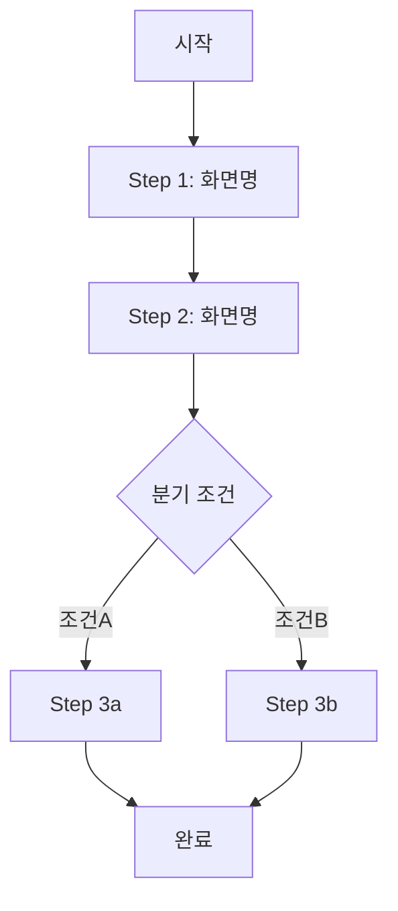

# UX 검토서 (UX Review Document)

> **프로젝트명:** [프로젝트명]
> **문서 버전:** v1.0
> **작성일:** YYYY-MM-DD
> **작성자:** [이름/역할]
> **검토 대상:** [시스템/화면 범위]

---

## 목차

1. [UX 검토 개요](#1-ux-검토-개요)
2. [닐슨의 10가지 휴리스틱 평가](#2-닐슨의-10가지-휴리스틱-평가)
3. [접근성(Accessibility) 검토](#3-접근성-검토)
4. [반응형 디자인 검토](#4-반응형-디자인-검토)
5. [사용자 플로우 검토](#5-사용자-플로우-검토)
6. [에러/예외 상황 검토](#6-에러예외-상황-검토)
7. [성능 UX 검토](#7-성능-ux-검토)
8. [UX 검토 결과 보고서](#8-ux-검토-결과-보고서)

---

## 1. UX 검토 개요

### 1.1 검토 목적

사용자 인터페이스(UI)와 사용자 경험(UX)이 프로젝트의 사용성, 접근성, 일관성, 효율성 기준을 충족하는지 체계적으로 검증한다.

### 1.2 검토 범위

**대상 화면 목록:**

| # | 화면 ID | 화면명 | 화면 유형 | 우선순위 | 검토 상태 |
|---|---------|--------|-----------|----------|-----------|
| 1 | SCR-001 | | 목록 / 상세 / 폼 / 대시보드 | High / Medium / Low | 미착수 / 진행 중 / 완료 |
| 2 | SCR-002 | | | | |
| 3 | SCR-003 | | | | |
| 4 | SCR-004 | | | | |
| 5 | SCR-005 | | | | |

### 1.3 검토 기준

| 기준 | 설명 | 가중치 |
|------|------|--------|
| 사용성 (Usability) | 사용자가 쉽고 효율적으로 목표를 달성할 수 있는가 | 30% |
| 접근성 (Accessibility) | 장애를 가진 사용자도 이용할 수 있는가 (WCAG 2.1 AA) | 25% |
| 일관성 (Consistency) | 디자인 시스템과 패턴이 일관적으로 적용되었는가 | 20% |
| 심미성 (Aesthetics) | 시각적으로 정돈되고 브랜드 가이드를 따르는가 | 10% |
| 효율성 (Efficiency) | 최소한의 단계로 태스크를 완료할 수 있는가 | 15% |

### 1.4 검토 방법

| 방법 | 설명 | 적용 시점 |
|------|------|-----------|
| 휴리스틱 평가 (Heuristic Evaluation) | 닐슨의 10가지 원칙에 따른 전문가 평가 | 설계 완료 후 |
| 인지 워크스루 (Cognitive Walkthrough) | 주요 태스크를 사용자 관점에서 단계별 수행 | 프로토타입 단계 |
| 체크리스트 (Checklist) | 접근성, 반응형 등 기준별 체크 항목 확인 | 구현 완료 후 |
| 사용성 테스트 (Usability Test) | 실제 사용자 대상 테스트 (해당 시) | 베타 단계 |

---

## 2. 닐슨의 10가지 휴리스틱 평가

### 평가 척도

| 점수 | 등급 | 설명 |
|------|------|------|
| 5 | 우수 | 원칙을 완벽히 준수하며 모범적 |
| 4 | 양호 | 원칙을 대부분 준수, 사소한 개선 가능 |
| 3 | 보통 | 일부 미흡한 점이 있으나 사용에 큰 지장 없음 |
| 2 | 미흡 | 원칙 위반이 있어 사용성에 영향을 줌 |
| 1 | 심각 | 원칙을 심각하게 위반하여 사용에 큰 지장 |

---

### H1. 시스템 상태의 가시성 (Visibility of System Status)

> 시스템은 합리적인 시간 내에 적절한 피드백을 통해 사용자에게 현재 무슨 일이 일어나고 있는지 알려야 한다.

**체크 항목:**

- [ ] 현재 페이지/섹션의 위치가 네비게이션에서 명확히 표시되는가?
- [ ] 데이터 로딩 중 로딩 표시(Spinner, Skeleton UI)가 제공되는가?
- [ ] 폼 제출 후 처리 상태(성공/실패)가 명확히 피드백되는가?
- [ ] 파일 업로드/다운로드 시 진행률(Progress)이 표시되는가?
- [ ] 비동기 작업(이메일 발송, 데이터 처리 등)의 완료 상태가 알림되는가?
- [ ] 버튼 클릭 시 즉각적인 시각적 피드백(hover, active, disabled 상태)이 있는가?
- [ ] 현재 선택된 항목이 시각적으로 구분되는가?

**평가:** [ ] 1 / [ ] 2 / [ ] 3 / [ ] 4 / [ ] 5

**발견사항:**

| # | 화면 | 설명 | 심각도 | 권장 개선안 |
|---|------|------|--------|------------|
| 1 | | | Critical / Major / Minor / Enhancement | |
| 2 | | | | |

---

### H2. 시스템과 현실 세계의 일치 (Match Between System and Real World)

> 시스템은 시스템 중심의 용어가 아닌, 사용자에게 친숙한 단어, 구문, 개념을 사용해야 한다.

**체크 항목:**

- [ ] 메뉴, 버튼, 레이블에 사용자가 이해하기 쉬운 용어가 사용되었는가?
- [ ] 아이콘이 직관적이며 일반적 관례를 따르는가?
- [ ] 날짜/시간/통화 형식이 대상 사용자의 로케일에 맞는가?
- [ ] 정보 구조(IA)가 사용자의 멘탈 모델과 일치하는가?
- [ ] 전문 용어 사용 시 도움말/툴팁이 제공되는가?
- [ ] 워크플로우가 현실 세계의 업무 프로세스를 반영하는가?

**평가:** [ ] 1 / [ ] 2 / [ ] 3 / [ ] 4 / [ ] 5

**발견사항:**

| # | 화면 | 설명 | 심각도 | 권장 개선안 |
|---|------|------|--------|------------|
| 1 | | | | |

---

### H3. 사용자 제어 및 자유 (User Control and Freedom)

> 사용자는 실수로 원하지 않는 기능을 선택하는 경우가 많으므로, 긴 과정을 거치지 않고 원하지 않는 상태에서 벗어날 수 있는 "비상구"가 필요하다.

**체크 항목:**

- [ ] 실행 취소(Undo) 기능이 제공되는가?
- [ ] 다단계 프로세스에서 이전 단계로 돌아갈 수 있는가?
- [ ] 모달/다이얼로그를 쉽게 닫을 수 있는가? (X 버튼, ESC 키, Backdrop 클릭)
- [ ] 삭제 등 위험한 작업 전 확인(Confirmation) 절차가 있는가?
- [ ] 긴 폼 작성 중 이탈 시 경고가 표시되는가?
- [ ] 검색/필터 조건을 쉽게 초기화할 수 있는가?

**평가:** [ ] 1 / [ ] 2 / [ ] 3 / [ ] 4 / [ ] 5

**발견사항:**

| # | 화면 | 설명 | 심각도 | 권장 개선안 |
|---|------|------|--------|------------|
| 1 | | | | |

---

### H4. 일관성 및 표준 (Consistency and Standards)

> 사용자가 서로 다른 단어, 상황, 행동이 같은 것을 의미하는지 궁금해할 필요가 없어야 한다.

**체크 항목:**

- [ ] 디자인 시스템/스타일 가이드가 일관적으로 적용되었는가?
- [ ] 동일한 기능이 모든 화면에서 동일한 위치와 형태로 제공되는가?
- [ ] 버튼 스타일(Primary, Secondary, Danger 등)이 일관적인가?
- [ ] 용어와 레이블이 전체 시스템에서 통일되었는가? (예: "저장"/"확인" 혼용 금지)
- [ ] 플랫폼 표준(OS, 브라우저)을 따르는가?
- [ ] 색상, 타이포그래피, 간격(Spacing)이 디자인 토큰에 맞는가?
- [ ] 동일한 인터랙션 패턴(정렬, 필터, 페이지네이션)이 통일되었는가?

**평가:** [ ] 1 / [ ] 2 / [ ] 3 / [ ] 4 / [ ] 5

**발견사항:**

| # | 화면 | 설명 | 심각도 | 권장 개선안 |
|---|------|------|--------|------------|
| 1 | | | | |

---

### H5. 오류 방지 (Error Prevention)

> 좋은 에러 메시지도 중요하지만, 처음부터 문제가 발생하지 않도록 설계하는 것이 더 좋다.

**체크 항목:**

- [ ] 입력 필드에 형식 힌트(Placeholder, Helper Text)가 제공되는가?
- [ ] 실시간 입력 검증(Inline Validation)이 적용되었는가?
- [ ] 비가역적 작업(삭제, 발송 등)에 확인 단계가 있는가?
- [ ] 드롭다운, 날짜 선택기 등으로 자유 입력을 최소화했는가?
- [ ] 비활성화(Disabled) 상태의 컨트롤에 사유가 표시되는가?
- [ ] 중복 제출(Double Submit)이 방지되는가?

**평가:** [ ] 1 / [ ] 2 / [ ] 3 / [ ] 4 / [ ] 5

**발견사항:**

| # | 화면 | 설명 | 심각도 | 권장 개선안 |
|---|------|------|--------|------------|
| 1 | | | | |

---

### H6. 인식 > 회상 (Recognition Rather Than Recall)

> 객체, 동작, 옵션을 보이게 만들어 사용자의 기억 부담을 최소화해야 한다.

**체크 항목:**

- [ ] 최근 사용 항목, 자주 사용하는 기능이 쉽게 접근 가능한가?
- [ ] 이전 입력 값이 자동 완성/제안되는가?
- [ ] 복잡한 코드/ID 대신 사람이 읽을 수 있는 레이블이 표시되는가?
- [ ] 아이콘에 레이블 또는 툴팁이 함께 제공되는가?
- [ ] 다단계 프로세스에서 이전 입력 내용을 확인할 수 있는가?
- [ ] Breadcrumb 네비게이션이 복잡한 구조에 제공되는가?

**평가:** [ ] 1 / [ ] 2 / [ ] 3 / [ ] 4 / [ ] 5

**발견사항:**

| # | 화면 | 설명 | 심각도 | 권장 개선안 |
|---|------|------|--------|------------|
| 1 | | | | |

---

### H7. 유연성 및 효율성 (Flexibility and Efficiency of Use)

> 초보 사용자에게는 보이지 않는 가속기(Accelerator)가 숙련된 사용자의 상호작용 속도를 높일 수 있어야 한다.

**체크 항목:**

- [ ] 키보드 단축키가 자주 사용하는 기능에 제공되는가?
- [ ] 대량 작업(Bulk Action)이 지원되는가? (다중 선택, 일괄 처리)
- [ ] 자주 사용하는 설정을 저장/즐겨찾기 할 수 있는가?
- [ ] 고급 사용자를 위한 필터/검색 기능이 충분한가?
- [ ] 개인화(Personalization) 옵션이 제공되는가?
- [ ] 반복적 태스크의 자동화(템플릿, 매크로 등)가 가능한가?

**평가:** [ ] 1 / [ ] 2 / [ ] 3 / [ ] 4 / [ ] 5

**발견사항:**

| # | 화면 | 설명 | 심각도 | 권장 개선안 |
|---|------|------|--------|------------|
| 1 | | | | |

---

### H8. 미니멀한 디자인 (Aesthetic and Minimalist Design)

> 화면에는 관련 없거나 거의 필요하지 않은 정보가 포함되어서는 안 된다.

**체크 항목:**

- [ ] 화면에 불필요한 요소가 없는가?
- [ ] 정보의 시각적 계층(Visual Hierarchy)이 명확한가?
- [ ] 핵심 콘텐츠와 보조 콘텐츠의 구분이 명확한가?
- [ ] 여백(White Space)이 적절히 사용되어 가독성이 좋은가?
- [ ] 색상 사용이 절제되고 목적에 맞는가?
- [ ] 데이터 밀도가 적절한가? (정보 과잉 vs 부족)

**평가:** [ ] 1 / [ ] 2 / [ ] 3 / [ ] 4 / [ ] 5

**발견사항:**

| # | 화면 | 설명 | 심각도 | 권장 개선안 |
|---|------|------|--------|------------|
| 1 | | | | |

---

### H9. 오류 인식/진단/복구 (Help Users Recognize, Diagnose, and Recover from Errors)

> 에러 메시지는 평범한 언어(코드 없이)로 표현되고, 문제를 정확히 지적하며, 해결 방법을 건설적으로 제안해야 한다.

**체크 항목:**

- [ ] 에러 메시지가 사용자가 이해할 수 있는 언어로 작성되었는가?
- [ ] 에러 메시지가 문제의 원인을 구체적으로 설명하는가?
- [ ] 에러 메시지가 해결 방법을 제안하는가?
- [ ] 폼 검증 에러가 해당 필드 근처에 표시되는가?
- [ ] 에러 발생 시 사용자가 입력한 데이터가 보존되는가?
- [ ] 시스템 에러(500 등)에 대한 사용자 친화적 화면이 있는가?

**평가:** [ ] 1 / [ ] 2 / [ ] 3 / [ ] 4 / [ ] 5

**발견사항:**

| # | 화면 | 설명 | 심각도 | 권장 개선안 |
|---|------|------|--------|------------|
| 1 | | | | |

---

### H10. 도움말 및 문서 (Help and Documentation)

> 시스템을 도움말 없이 사용할 수 있다면 가장 좋지만, 필요 시 도움말을 제공해야 한다.

**체크 항목:**

- [ ] 상황별 도움말(Contextual Help)이 제공되는가? (툴팁, 인라인 도움말)
- [ ] 온보딩 가이드/튜토리얼이 제공되는가? (첫 사용 시)
- [ ] FAQ 또는 도움말 센터에 쉽게 접근할 수 있는가?
- [ ] 검색 기능이 도움말/문서에서 제공되는가?
- [ ] 도움말 내용이 최신 상태로 유지되는가?

**평가:** [ ] 1 / [ ] 2 / [ ] 3 / [ ] 4 / [ ] 5

**발견사항:**

| # | 화면 | 설명 | 심각도 | 권장 개선안 |
|---|------|------|--------|------------|
| 1 | | | | |

---

### 휴리스틱 평가 종합

| # | 원칙 | 평가 | 발견 이슈 수 | Critical | Major | Minor |
|---|------|:----:|:------------:|:--------:|:-----:|:-----:|
| H1 | 시스템 상태의 가시성 | /5 | | | | |
| H2 | 시스템과 현실 세계의 일치 | /5 | | | | |
| H3 | 사용자 제어 및 자유 | /5 | | | | |
| H4 | 일관성 및 표준 | /5 | | | | |
| H5 | 오류 방지 | /5 | | | | |
| H6 | 인식 > 회상 | /5 | | | | |
| H7 | 유연성 및 효율성 | /5 | | | | |
| H8 | 미니멀한 디자인 | /5 | | | | |
| H9 | 오류 인식/진단/복구 | /5 | | | | |
| H10 | 도움말 및 문서 | /5 | | | | |
| | **평균** | **/5** | **합계** | | | |

---

## 3. 접근성 검토 (Accessibility Review)

### 3.1 검토 기준

WCAG 2.1 AA 수준을 기준으로 검토한다.

### 3.2 인지 가능 (Perceivable)

#### 3.2.1 텍스트 대안 (Text Alternatives)

- [ ] 모든 의미 있는 이미지에 적절한 alt 텍스트가 제공되었는가?
- [ ] 장식용 이미지에 빈 alt 속성(`alt=""`)이 사용되었는가?
- [ ] 복잡한 이미지(차트, 다이어그램)에 장문 설명이 제공되었는가?
- [ ] 아이콘 버튼에 접근 가능한 레이블이 제공되었는가? (aria-label)
- [ ] 비디오에 자막(Caption)이 제공되었는가?
- [ ] 오디오에 텍스트 대본(Transcript)이 제공되었는가?

#### 3.2.2 미디어 대안 (Time-based Media)

- [ ] 사전 녹화된 오디오/비디오에 대안이 제공되었는가?
- [ ] 실시간 미디어에 자막이 제공되었는가?
- [ ] 비디오에 오디오 설명(Audio Description)이 제공되었는가?

#### 3.2.3 적응 가능 (Adaptable)

- [ ] 콘텐츠가 시맨틱 HTML 구조(Heading, List, Table 등)로 마크업되었는가?
- [ ] 읽기 순서가 시각적 순서와 일치하는가?
- [ ] 감각적 특성(색상, 크기, 위치 등)에만 의존하지 않는가?
- [ ] 가로/세로 모드 전환이 콘텐츠를 손상시키지 않는가?
- [ ] 자동 완성(autocomplete) 속성이 폼 필드에 적절히 사용되었는가?

#### 3.2.4 구별 가능 (Distinguishable)

- [ ] 색상만으로 정보를 전달하지 않는가? (색상 + 패턴/텍스트 병행)
- [ ] 텍스트와 배경의 명도 대비가 4.5:1 이상인가? (일반 텍스트)
- [ ] 큰 텍스트(18pt 이상)의 명도 대비가 3:1 이상인가?
- [ ] UI 컴포넌트와 그래픽 요소의 명도 대비가 3:1 이상인가?
- [ ] 텍스트 크기를 200%까지 확대해도 콘텐츠가 손실되지 않는가?
- [ ] 오디오가 자동 재생되지 않는가? (또는 정지 가능한가?)
- [ ] 텍스트 간격(행간, 자간, 단어 간격) 조정 시 콘텐츠가 손실되지 않는가?

### 3.3 조작 가능 (Operable)

#### 3.3.1 키보드 접근성 (Keyboard Accessible)

- [ ] 모든 기능이 키보드만으로 접근 가능한가?
- [ ] 키보드 포커스가 논리적 순서로 이동하는가?
- [ ] 키보드 포커스 표시(Focus Indicator)가 명확히 보이는가?
- [ ] 키보드 트랩(Keyboard Trap)이 없는가? (모달 제외)
- [ ] 모달 내에서 포커스가 적절히 관리되는가? (Focus Trap)
- [ ] 드롭다운, 탭, 아코디언 등이 키보드로 조작 가능한가?
- [ ] 커스텀 컴포넌트의 키보드 인터랙션이 WAI-ARIA 패턴을 따르는가?

#### 3.3.2 충분한 시간 (Enough Time)

- [ ] 시간 제한이 있는 경우 연장/해제 옵션이 제공되는가?
- [ ] 자동 갱신 콘텐츠를 정지/일시정지할 수 있는가?
- [ ] 세션 만료 전 경고가 표시되고 연장할 수 있는가?
- [ ] 자동 슬라이드/캐러셀에 정지 기능이 있는가?

#### 3.3.3 발작 방지 (Seizures and Physical Reactions)

- [ ] 1초에 3회 이상 깜빡이는 콘텐츠가 없는가?
- [ ] 애니메이션을 비활성화할 수 있는가? (prefers-reduced-motion 지원)
- [ ] 모션 기반 인터랙션의 대안이 제공되는가?

#### 3.3.4 탐색 가능 (Navigable)

- [ ] "건너뛰기 링크(Skip Navigation)"가 제공되는가?
- [ ] 페이지 제목(`<title>`)이 페이지 내용을 정확히 설명하는가?
- [ ] 링크 텍스트가 목적지를 명확히 설명하는가? ("여기를 클릭" 금지)
- [ ] 헤딩(`<h1>`~`<h6>`)이 논리적 계층으로 사용되었는가?
- [ ] 2가지 이상의 탐색 방법(메뉴, 검색, 사이트맵)이 제공되는가?
- [ ] 포커스 순서가 콘텐츠의 의미와 조작 순서에 맞는가?

### 3.4 이해 가능 (Understandable)

#### 3.4.1 읽기 쉬운 (Readable)

- [ ] 페이지 언어가 `<html lang>` 속성으로 지정되었는가?
- [ ] 다른 언어 콘텐츠에 `lang` 속성이 지정되었는가?
- [ ] 약어/축약어에 대한 설명이 제공되는가?

#### 3.4.2 예측 가능한 (Predictable)

- [ ] 포커스만으로 예기치 않은 변화(페이지 이동, 팝업 등)가 발생하지 않는가?
- [ ] 입력값 변경만으로 예기치 않은 변화가 발생하지 않는가?
- [ ] 네비게이션이 모든 페이지에서 일관적인가?
- [ ] 동일 기능의 컴포넌트가 일관적으로 식별되는가?

#### 3.4.3 입력 지원 (Input Assistance)

- [ ] 입력 에러가 자동 감지되고 텍스트로 설명되는가?
- [ ] 폼 필드에 레이블(`<label>`)이 연결되었는가?
- [ ] 필수 필드가 명확히 표시되었는가?
- [ ] 에러 수정을 위한 제안이 제공되는가?
- [ ] 법적/재정적 영향이 있는 제출에 확인/취소가 가능한가?

### 3.5 견고한 (Robust)

#### 3.5.1 호환성 (Compatible)

- [ ] HTML 마크업이 유효한가? (W3C Validator)
- [ ] ARIA 역할(role)과 속성이 올바르게 사용되었는가?
- [ ] 상태 메시지가 보조 기술에 전달되는가? (aria-live, role="alert")
- [ ] 커스텀 컴포넌트가 이름, 역할, 값을 올바르게 노출하는가?

### 3.6 접근성 자동화 도구 활용

| 도구 | 용도 | 적용 단계 |
|------|------|-----------|
| axe-core | 자동화 접근성 검사 (CI/CD 통합 가능) | 개발/테스트 |
| Lighthouse | 접근성 점수 및 권장 사항 | 빌드/QA |
| WAVE | 웹 접근성 시각적 평가 | QA |
| Pa11y | CLI 기반 접근성 테스트 자동화 | CI/CD |
| Screen Reader (NVDA/VoiceOver) | 스크린 리더 수동 테스트 | QA |

### 3.7 수동 테스트 방법

**키보드 네비게이션 테스트:**

| # | 테스트 항목 | 조작 방법 | 예상 동작 | 결과 |
|---|------------|-----------|-----------|------|
| 1 | 전체 페이지 탐색 | Tab / Shift+Tab | 논리적 순서로 포커스 이동 | Pass / Fail |
| 2 | 드롭다운 메뉴 | Enter, Arrow Keys | 항목 선택 및 탐색 | |
| 3 | 모달 다이얼로그 | ESC, Tab | 포커스 트랩, 닫기 | |
| 4 | 폼 제출 | Enter | 폼 데이터 전송 | |
| 5 | 슬라이더/Range | Arrow Keys | 값 조정 | |

**스크린 리더 테스트:**

| # | 테스트 항목 | 리더 | 예상 읽기 내용 | 결과 |
|---|------------|------|---------------|------|
| 1 | 페이지 랜드마크 | VoiceOver / NVDA | 헤더, 메인, 풋터 인식 | |
| 2 | 이미지 대안 텍스트 | | alt 텍스트 읽기 | |
| 3 | 폼 레이블 | | 필드 용도 설명 | |
| 4 | 에러 메시지 | | 에러 내용 안내 | |
| 5 | 동적 콘텐츠 변경 | | aria-live 알림 | |

**색상 대비 테스트:**

| 요소 | 전경색 | 배경색 | 대비율 | 기준 | 충족 여부 |
|------|--------|--------|--------|------|-----------|
| 본문 텍스트 | | | | >= 4.5:1 | |
| 링크 텍스트 | | | | >= 4.5:1 | |
| 버튼 레이블 | | | | >= 4.5:1 | |
| 플레이스홀더 | | | | >= 4.5:1 | |
| 아이콘 | | | | >= 3:1 | |

---

## 4. 반응형 디자인 검토

### 4.1 브레이크포인트 정의

| 이름 | 범위 | 대표 기기 |
|------|------|-----------|
| 모바일 (Mobile) | 320px ~ 767px | iPhone SE, Galaxy S |
| 태블릿 (Tablet) | 768px ~ 1023px | iPad, Galaxy Tab |
| 데스크톱 (Desktop) | 1024px ~ 1439px | 노트북, 일반 모니터 |
| 와이드 (Wide) | 1440px+ | 대형 모니터 |

### 4.2 브레이크포인트별 검토 체크리스트

#### 공통 항목

- [ ] 콘텐츠가 가로 스크롤 없이 표시되는가?
- [ ] 텍스트가 읽기 쉬운 크기(최소 16px)인가?
- [ ] 이미지가 뷰포트에 맞게 조정되는가?
- [ ] 중요 콘텐츠가 fold 아래로 밀리지 않는가?

#### 모바일 (360px)

| # | 항목 | 결과 |
|---|------|------|
| 1 | 네비게이션이 햄버거 메뉴로 전환되는가? | Pass / Fail |
| 2 | 테이블이 가로 스크롤 또는 카드형으로 전환되는가? | |
| 3 | 터치 타겟 크기가 최소 44x44px인가? | |
| 4 | 폼 필드가 적절한 키보드 타입(email, tel, number)을 호출하는가? | |
| 5 | 고정 요소(Fixed Header/Footer)가 콘텐츠를 가리지 않는가? | |
| 6 | 긴 텍스트가 적절히 줄바꿈 또는 말줄임 처리되는가? | |

#### 태블릿 (768px)

| # | 항목 | 결과 |
|---|------|------|
| 1 | 레이아웃이 2~3 컬럼으로 적절히 재배치되는가? | |
| 2 | 사이드바가 표시/숨김 토글이 가능한가? | |
| 3 | 모달/팝업 크기가 적절한가? | |
| 4 | 가로/세로 모드 전환 시 레이아웃이 깨지지 않는가? | |

#### 데스크톱 (1024px)

| # | 항목 | 결과 |
|---|------|------|
| 1 | 네비게이션이 전체 메뉴로 표시되는가? | |
| 2 | 콘텐츠 영역의 최대 너비가 설정되어 있는가? | |
| 3 | 호버(hover) 상태가 적절히 표시되는가? | |
| 4 | 툴팁이 올바른 위치에 표시되는가? | |

#### 와이드 (1440px)

| # | 항목 | 결과 |
|---|------|------|
| 1 | 콘텐츠가 과도하게 늘어나지 않는가? (max-width 적용) | |
| 2 | 여백이 적절히 분배되는가? | |
| 3 | 대시보드/그리드 레이아웃이 최적화되었는가? | |

### 4.3 터치 인터랙션 검토

| # | 항목 | 결과 |
|---|------|------|
| 1 | 터치 타겟(버튼, 링크) 크기가 최소 44x44px인가? | |
| 2 | 인접한 터치 타겟 사이에 충분한 간격(8px 이상)이 있는가? | |
| 3 | 스와이프, 핀치 줌 등 제스처가 직관적인가? | |
| 4 | 제스처에 대한 대안(버튼 등)이 제공되는가? | |
| 5 | 길게 누르기(Long Press) 동작이 필요 시 안내되는가? | |
| 6 | 터치 피드백(시각적/촉각적)이 제공되는가? | |

---

## 5. 사용자 플로우 검토

### 5.1 주요 사용자 태스크 목록

| # | 태스크명 | 대상 사용자 | 빈도 | 중요도 |
|---|---------|------------|------|--------|
| 1 | | | 높음/중간/낮음 | Critical / High / Medium / Low |
| 2 | | | | |
| 3 | | | | |
| 4 | | | | |
| 5 | | | | |

### 5.2 태스크별 플로우 분석

#### 태스크: [태스크명]

**플로우 다이어그램:**



**플로우 분석:**

| 항목 | 내용 |
|------|------|
| 태스크 완수율 기대치 | % |
| 현재 단계 수 | 단계 |
| 최적 단계 수 (Optimal Path) | 단계 |
| 예상 소요 시간 | 분 |

**에러 복구 경로:**

| 에러 발생 지점 | 에러 유형 | 복구 방법 | 사용자 데이터 보존 |
|---------------|-----------|-----------|-------------------|
| Step N | 입력 검증 실패 | 인라인 에러 표시, 재입력 | 기존 입력 유지 |
| | | | |

**사용자 이탈 가능 지점:**

| 지점 | 이탈 사유 | 방지 대책 |
|------|----------|-----------|
| Step N | 복잡한 입력 | 자동 완성, 기본값 제공 |
| | | |

### 5.3 사용자 플로우 검토 양식

| # | 태스크명 | 현재 단계 수 | 최적 단계 수 | 문제점 | 개선안 | 우선순위 |
|---|---------|:----------:|:----------:|--------|--------|:--------:|
| 1 | | | | | | |
| 2 | | | | | | |
| 3 | | | | | | |

---

## 6. 에러/예외 상황 검토

### 6.1 폼 검증 에러 검토

| # | 항목 | 결과 |
|---|------|------|
| 1 | 에러 메시지가 해당 필드 바로 아래 또는 옆에 표시되는가? | Pass / Fail |
| 2 | 에러 필드가 시각적으로 강조되는가? (빨간 테두리 등) | |
| 3 | 에러 메시지가 구체적인 수정 방법을 안내하는가? | |
| 4 | 여러 에러 발생 시 모든 에러가 동시에 표시되는가? | |
| 5 | 에러 수정 시 에러 메시지가 즉시 사라지는가? | |
| 6 | 폼 최상단에 에러 요약이 제공되는가? (긴 폼의 경우) | |
| 7 | 에러 메시지의 색상 외에 아이콘 등 추가 시각적 단서가 있는가? | |

### 6.2 네트워크 에러 처리 검토

| # | 시나리오 | 사용자에게 표시되는 내용 | 자동 재시도 | 수동 재시도 버튼 | 결과 |
|---|---------|----------------------|:-----------:|:---------------:|------|
| 1 | 인터넷 연결 끊김 | | | | |
| 2 | API 서버 응답 지연 (Timeout) | | | | |
| 3 | 서버 에러 (5xx) | | | | |
| 4 | 인증 만료 (401) | | | | |
| 5 | 권한 부족 (403) | | | | |
| 6 | 리소스 미발견 (404) | | | | |

### 6.3 빈 상태 (Empty State) 디자인 검토

| # | 화면/컴포넌트 | 빈 상태 메시지 | 행동 유도(CTA) | 일러스트 | 결과 |
|---|--------------|---------------|:-------------:|:--------:|------|
| 1 | 목록 화면 (검색 결과 없음) | | | | |
| 2 | 목록 화면 (데이터 없음) | | | | |
| 3 | 대시보드 (초기 상태) | | | | |
| 4 | 알림 목록 (알림 없음) | | | | |
| 5 | 즐겨찾기 (빈 목록) | | | | |

### 6.4 로딩 상태 디자인 검토

| # | 항목 | 결과 |
|---|------|------|
| 1 | 전체 페이지 로딩에 적절한 로딩 표시가 있는가? | |
| 2 | 부분 영역 로딩에 해당 영역만 로딩 표시가 되는가? | |
| 3 | Skeleton UI가 실제 콘텐츠 레이아웃과 일치하는가? | |
| 4 | 로딩이 3초 이상 소요 시 진행 상태 또는 메시지가 제공되는가? | |
| 5 | 버튼 클릭 후 로딩 중 중복 클릭이 방지되는가? | |
| 6 | Infinite Scroll 로딩이 자연스럽게 처리되는가? | |

### 6.5 타임아웃 처리 검토

| # | 항목 | 결과 |
|---|------|------|
| 1 | 세션 만료 전 경고 모달이 표시되는가? | |
| 2 | 세션 연장 옵션이 제공되는가? | |
| 3 | 세션 만료 시 작성 중인 데이터가 자동 저장되는가? | |
| 4 | 세션 만료 후 로그인 페이지로 적절히 이동하는가? | |
| 5 | 로그인 후 이전 페이지로 복원되는가? | |

### 6.6 권한 부족 안내 검토

| # | 항목 | 결과 |
|---|------|------|
| 1 | 접근 불가 사유가 명확히 안내되는가? | |
| 2 | 권한 요청 방법이 안내되는가? | |
| 3 | 접근 불가 페이지에서 다른 기능으로의 이동 수단이 있는가? | |
| 4 | 부분 권한 시 접근 가능한 영역과 불가 영역이 구분되는가? | |

---

## 7. 성능 UX 검토

### 7.1 인지 성능 (Perceived Performance) 검토

| # | 항목 | 적용 여부 | 결과 |
|---|------|:---------:|------|
| 1 | Skeleton UI가 데이터 로딩 영역에 적용되었는가? | | |
| 2 | Progressive Loading이 적용되었는가? (이미지 Lazy Loading 등) | | |
| 3 | Optimistic UI가 적절한 곳에 적용되었는가? (좋아요, 북마크 등) | | |
| 4 | 이미지 Placeholder(LQIP, BlurHash 등)가 사용되었는가? | | |
| 5 | 중요 콘텐츠가 먼저 렌더링되는가? (Above the Fold 우선) | | |
| 6 | 애니메이션/트랜지션이 적절한 시간(200~500ms)인가? | | |
| 7 | 로딩 시 레이아웃 시프트(Layout Shift)가 최소화되었는가? | | |
| 8 | 긴 작업에 진행률 표시(Progress Bar/%)가 제공되는가? | | |
| 9 | 스크롤 성능이 부드러운가? (60fps 유지) | | |
| 10 | 입력 응답이 즉각적인가? (100ms 이내) | | |

### 7.2 Core Web Vitals 목표

| 메트릭 | 설명 | 목표 | 측정값 | 충족 |
|--------|------|------|--------|------|
| LCP (Largest Contentful Paint) | 가장 큰 콘텐츠 렌더링 시간 | <= 2.5초 | | |
| FID (First Input Delay) | 첫 입력 응답 지연 | <= 100ms | | |
| INP (Interaction to Next Paint) | 인터랙션 응답 시간 | <= 200ms | | |
| CLS (Cumulative Layout Shift) | 누적 레이아웃 시프트 | <= 0.1 | | |
| TTFB (Time to First Byte) | 첫 바이트 수신 시간 | <= 800ms | | |
| FCP (First Contentful Paint) | 첫 콘텐츠 렌더링 시간 | <= 1.8초 | | |

### 7.3 리소스 최적화 검토

| # | 항목 | 결과 |
|---|------|------|
| 1 | 이미지가 적절한 포맷(WebP, AVIF)과 크기로 제공되는가? | |
| 2 | `` 태그에 width, height 속성이 지정되었는가? (CLS 방지) | |
| 3 | Critical CSS가 인라인으로 포함되었는가? | |
| 4 | JavaScript 번들 크기가 적절한가? (Code Splitting 적용) | |
| 5 | 웹 폰트 로딩 전략(font-display: swap 등)이 적용되었는가? | |
| 6 | Service Worker 또는 캐싱 전략이 적용되었는가? | |

---

## 8. UX 검토 결과 보고서

### 8.1 검토 요약

| 항목 | 수치 |
|------|------|
| 검토 화면 수 | 개 |
| 발견 이슈 수 (총) | 건 |
| Critical | 건 |
| Major | 건 |
| Minor | 건 |
| Enhancement | 건 |

**심각도별 분포:**

```
Critical  : ████░░░░░░  XX%
Major     : ██████░░░░  XX%
Minor     : ████████░░  XX%
Enhancement: ██░░░░░░░░  XX%
```

### 8.2 심각도 기준

| 등급 | 명칭 | 설명 | 대응 기한 |
|------|------|------|-----------|
| S1 | Critical | 사용 불가 - 사용자가 핵심 태스크를 수행할 수 없음 | 릴리스 전 필수 수정 |
| S2 | Major | 기능 저하 - 사용자가 우회하여 태스크를 수행할 수 있으나 상당한 불편 | 릴리스 전 수정 권장 |
| S3 | Minor | 불편 - 사용성에 사소한 영향, 우회 방법이 명확함 | 차기 릴리스 |
| S4 | Enhancement | 개선 권장 - 현재도 사용 가능하나 개선 시 사용 경험 향상 | 로드맵 반영 |

### 8.3 이슈 목록

| 이슈 ID | 화면 | 카테고리 | 심각도 | 설명 | 권장 개선안 | 담당자 | 상태 |
|---------|------|----------|--------|------|------------|--------|------|
| UX-001 | | 사용성 / 접근성 / 일관성 / 반응형 / 성능 / 에러처리 | Critical / Major / Minor / Enhancement | | | | Open / In Progress / Resolved / Deferred |
| UX-002 | | | | | | | |
| UX-003 | | | | | | | |
| UX-004 | | | | | | | |
| UX-005 | | | | | | | |
| UX-006 | | | | | | | |
| UX-007 | | | | | | | |
| UX-008 | | | | | | | |
| UX-009 | | | | | | | |
| UX-010 | | | | | | | |

### 8.4 우선 개선 항목 (Top 10)

아래 항목은 심각도, 영향 범위, 사용 빈도를 종합적으로 고려하여 우선순위를 부여한 것이다.

| 순위 | 이슈 ID | 화면 | 요약 | 심각도 | 예상 공수 | 기대 효과 |
|:----:|---------|------|------|--------|-----------|-----------|
| 1 | | | | | | |
| 2 | | | | | | |
| 3 | | | | | | |
| 4 | | | | | | |
| 5 | | | | | | |
| 6 | | | | | | |
| 7 | | | | | | |
| 8 | | | | | | |
| 9 | | | | | | |
| 10 | | | | | | |

### 8.5 장기 개선 로드맵 권고

#### 단기 (현재 릴리스)

| 항목 | 설명 | 관련 이슈 |
|------|------|-----------|
| 접근성 Critical 이슈 해결 | WCAG 2.1 AA 필수 준수 | |
| 에러 처리 개선 | 사용자 친화적 에러 메시지 | |
| 모바일 반응형 이슈 수정 | 터치 타겟 크기, 레이아웃 | |

#### 중기 (차기 릴리스)

| 항목 | 설명 | 관련 이슈 |
|------|------|-----------|
| 디자인 시스템 일관성 강화 | 컴포넌트 통합, 토큰 정리 | |
| 성능 UX 개선 | Skeleton UI, Optimistic UI | |
| 사용자 플로우 최적화 | 불필요한 단계 제거 | |

#### 장기 (로드맵)

| 항목 | 설명 | 관련 이슈 |
|------|------|-----------|
| 고급 접근성 (AAA) 목표 | 향상된 접근성 지원 | |
| 다국어/국제화(i18n) UX | RTL 지원, 문화적 차이 | |
| AI 기반 개인화 UX | 사용자 행동 기반 UI 최적화 | |

### 8.6 검토 서명

| 역할 | 이름 | 서명 | 일자 |
|------|------|------|------|
| UX 디자이너 | | | |
| UI 개발자 | | | |
| QA 엔지니어 | | | |
| PM | | | |
| PO / 이해관계자 | | | |

---

*본 문서는 프로젝트 특성과 디자인 가이드라인에 따라 체크리스트 항목을 조정하여 사용하십시오.*
