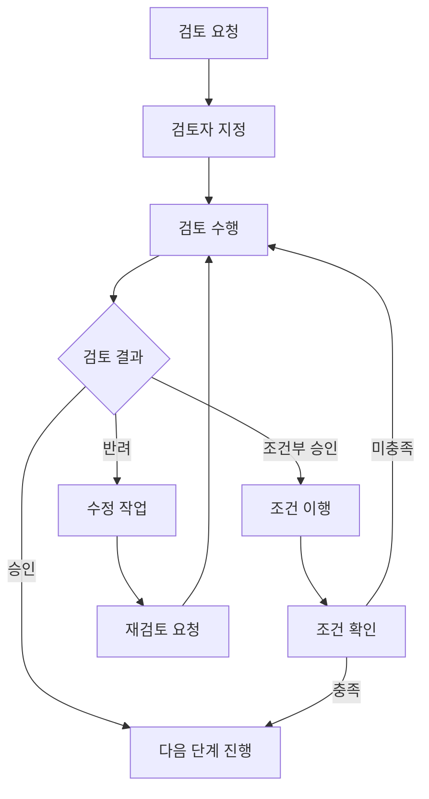

# 단계별 검토 체크리스트 (Phase Review Checklist)

> **프로젝트명:** [프로젝트명]
> **문서 버전:** v1.0
> **작성일:** YYYY-MM-DD
> **작성자:** [이름/역할]

---

## 목차

1. [Phase 1: 요구사항 검토 (Requirements Review)](#phase-1-요구사항-검토)
2. [Phase 2: 설계 검토 (Design Review)](#phase-2-설계-검토)
3. [Phase 3: 코드 검토 (Code Review)](#phase-3-코드-검토)
4. [Phase 4: 테스트 검토 (Test Review)](#phase-4-테스트-검토)
5. [Phase 5: 배포 검토 (Deployment Review)](#phase-5-배포-검토)

---

## Phase 1: 요구사항 검토 (Requirements Review)

### 1.1 검토 목적

요구사항 명세서(SRS)의 **완전성(Completeness)**, **일관성(Consistency)**, **추적 가능성(Traceability)**, **테스트 가능성(Testability)** 을 확인하여, 후속 단계에서 발생할 수 있는 재작업과 비용을 최소화한다.

### 1.2 검토 범위

| 항목 | 대상 문서 | 버전 |
|------|-----------|------|
| 기능 요구사항 | SRS 섹션 3 | |
| 비기능 요구사항 | SRS 섹션 4 | |
| 유스케이스 명세 | UC-001 ~ UC-XXX | |
| 인터페이스 요구사항 | SRS 섹션 5 | |
| 데이터 요구사항 | SRS 섹션 6 | |

### 1.3 요구사항 검토 체크리스트

#### A. 완전성 (Completeness)

- [ ] 모든 기능 요구사항에 고유 ID(예: FR-001)가 부여되었는가?
- [ ] 모든 비기능 요구사항에 고유 ID(예: NFR-001)가 부여되었는가?
- [ ] 각 요구사항에 출처(이해관계자, 비즈니스 규칙 등)가 명시되었는가?
- [ ] 시스템 경계(Scope)가 명확히 정의되었는가?
- [ ] 제외 범위(Out of Scope)가 명시되었는가?
- [ ] 모든 사용자 역할(Actor)이 식별되고 정의되었는가?
- [ ] 각 유스케이스의 기본 흐름(Main Flow)과 대안 흐름(Alternative Flow)이 기술되었는가?
- [ ] 예외 흐름(Exception Flow)이 모든 유스케이스에 포함되었는가?
- [ ] 외부 시스템 인터페이스가 모두 식별되었는가?
- [ ] 데이터 입출력 형식이 정의되었는가?

#### B. 일관성 (Consistency)

- [ ] 용어 정의(Glossary)가 작성되고 문서 전체에서 일관적으로 사용되는가?
- [ ] 요구사항 간 충돌(Conflict)이 없는가?
- [ ] 동일 기능에 대한 중복 기술이 없는가?
- [ ] 유스케이스 간 데이터 흐름이 일관적인가?
- [ ] 비기능 요구사항이 기능 요구사항과 상충하지 않는가?

#### C. 추적 가능성 (Traceability)

- [ ] 요구사항 추적 매트릭스(RTM)가 작성되었는가?
- [ ] 비즈니스 요구사항 → 기능 요구사항 추적이 가능한가?
- [ ] 기능 요구사항 → 테스트 케이스 매핑이 준비되었는가?
- [ ] 모든 요구사항이 최소 하나의 비즈니스 목표와 연결되는가?

#### D. 테스트 가능성 (Testability)

- [ ] 각 요구사항이 검증 가능한(Verifiable) 형태로 기술되었는가?
- [ ] 비기능 요구사항에 측정 가능한 수치 기준이 명시되었는가? (예: 응답시간 < 2초)
- [ ] 수용 기준(Acceptance Criteria)이 각 요구사항에 정의되었는가?
- [ ] 모호한 표현("빠르게", "적절히", "대부분" 등)이 제거되었는가?

#### E. 우선순위 및 승인

- [ ] 모든 요구사항에 우선순위(Must/Should/Could/Won't)가 부여되었는가?
- [ ] 우선순위 결정 근거가 기록되었는가?
- [ ] 핵심 이해관계자의 검토가 완료되었는가?
- [ ] 이해관계자 서명/승인이 확보되었는가?
- [ ] 변경 이력(Change Log)이 관리되고 있는가?

### 1.4 요구사항 검토 피드백 양식

**검토 정보**

| 항목 | 내용 |
|------|------|
| 검토자 | |
| 검토일 | YYYY-MM-DD |
| 검토 대상 문서 | |
| 문서 버전 | |
| 검토 결과 | [ ] 승인 / [ ] 조건부 승인 / [ ] 반려 |
| 조건부 승인 조건 | |

**피드백 상세**

| # | 항목 | 위치(섹션/페이지) | 심각도 | 피드백 내용 | 조치사항 | 담당자 | 상태 |
|---|------|-------------------|--------|-------------|----------|--------|------|
| 1 | | | Critical / Major / Minor / Info | | | | Open / In Progress / Resolved / Deferred |
| 2 | | | | | | | |
| 3 | | | | | | | |

> **심각도 기준:**
> - **Critical:** 프로젝트 진행 불가, 즉시 해결 필요
> - **Major:** 기능 또는 품질에 중대한 영향, 다음 단계 전 해결 필요
> - **Minor:** 품질 개선 필요, 일정 내 해결 권장
> - **Info:** 참고 사항, 향후 고려

### 1.5 요구사항 검토 회의록

| 항목 | 내용 |
|------|------|
| 회의명 | 요구사항 검토 회의 |
| 일시 | YYYY-MM-DD HH:MM ~ HH:MM |
| 장소/채널 | |
| 참석자 | |
| 서기 | |

**안건:**

1. 요구사항 명세서 전체 검토
2. 미결 사항 논의
3. 결정 사항 확인

**논의 내용:**

| # | 논의 항목 | 의견 | 결정사항 | 담당자 | 기한 |
|---|-----------|------|----------|--------|------|
| 1 | | | | | |
| 2 | | | | | |

**액션 아이템:**

| # | 내용 | 담당자 | 기한 | 상태 |
|---|------|--------|------|------|
| 1 | | | | |
| 2 | | | | |

---

## Phase 2: 설계 검토 (Design Review)

### 2.1 검토 목적

시스템 아키텍처 설계, 데이터베이스 설계, API 설계가 요구사항을 올바르게 반영하고, 품질 속성(성능, 보안, 확장성, 유지보수성)을 충족하는지 검증한다.

### 2.2 아키텍처 검토 체크리스트

#### A. 요구사항 충족성

- [ ] 모든 기능 요구사항이 아키텍처 컴포넌트에 매핑되었는가?
- [ ] 비기능 요구사항(성능, 보안, 확장성)이 아키텍처 결정에 반영되었는가?
- [ ] 요구사항 추적 매트릭스(RTM)가 설계 항목으로 확장되었는가?

#### B. 기술 스택 및 구조

- [ ] 기술 스택 선정에 대한 합리적 근거(ADR)가 문서화되었는가?
- [ ] 기술 스택의 성숙도, 커뮤니티 지원, 라이선스가 확인되었는가?
- [ ] 아키텍처 다이어그램(C4 Model 등)이 제공되었는가?
- [ ] 컴포넌트 간 의존성이 명확하고 순환 의존이 없는가?
- [ ] 계층(Layer) 분리가 적절한가? (Presentation, Business, Data)
- [ ] 모듈 간 결합도(Coupling)가 낮고 응집도(Cohesion)가 높은가?

#### C. 확장성 및 가용성

- [ ] 수평 확장(Scale-out) 전략이 정의되었는가?
- [ ] 장애 지점(Single Point of Failure)이 식별되고 대비책이 있는가?
- [ ] 로드밸런싱 전략이 정의되었는가?
- [ ] 캐싱 전략이 적절한가? (Cache invalidation 포함)
- [ ] 비동기 처리가 필요한 영역이 식별되었는가?

#### D. 보안 아키텍처

- [ ] 인증(Authentication) 메커니즘이 정의되었는가?
- [ ] 인가(Authorization) 모델이 설계되었는가? (RBAC, ABAC 등)
- [ ] 데이터 암호화 전략(전송 중/저장 시)이 정의되었는가?
- [ ] 시크릿 관리 방안이 있는가? (Vault, KMS 등)
- [ ] OWASP Top 10 위협에 대한 대응이 설계에 반영되었는가?

#### E. 운영 및 관측성

- [ ] 로깅 전략(로그 수준, 저장, 보관 기간)이 정의되었는가?
- [ ] 모니터링 및 알림(Alert) 전략이 정의되었는가?
- [ ] 장애 복구(Disaster Recovery) 계획이 있는가?
- [ ] CI/CD 파이프라인 아키텍처가 설계되었는가?
- [ ] 환경(Dev/Staging/Prod) 구성이 정의되었는가?

### 2.3 데이터베이스 설계 검토 체크리스트

#### A. 데이터 모델링

- [ ] ERD(Entity-Relationship Diagram)가 제공되었는가?
- [ ] 정규화(Normalization)가 적절히 수행되었는가? (의도적 비정규화의 경우 근거 기록)
- [ ] 엔티티/테이블 명명 규칙이 일관적인가?
- [ ] 컬럼 명명 규칙이 일관적인가?
- [ ] 데이터 타입 선택이 적절한가?
- [ ] NULL 허용 정책이 적절한가?

#### B. 무결성 및 관계

- [ ] 기본키(PK) 전략이 적절한가? (자연키 vs 대리키)
- [ ] 외래키(FK) 관계가 올바르게 설정되었는가?
- [ ] CASCADE, SET NULL 등 참조 무결성 규칙이 적절한가?
- [ ] 유니크 제약조건이 필요한 곳에 설정되었는가?
- [ ] CHECK 제약조건이 필요한 곳에 설정되었는가?

#### C. 성능 및 운영

- [ ] 인덱스 전략이 주요 쿼리 패턴을 고려하여 설계되었는가?
- [ ] 대용량 테이블에 대한 파티셔닝 전략이 있는가?
- [ ] 데이터 마이그레이션 전략이 수립되었는가?
- [ ] 백업 및 복구 전략이 정의되었는가?
- [ ] 감사(Audit) 로그 테이블이 설계되었는가?
- [ ] Soft Delete vs Hard Delete 정책이 정의되었는가?

### 2.4 API 설계 검토 체크리스트

#### A. 설계 규약

- [ ] RESTful 규약(리소스 명명, HTTP 메서드 사용)을 따르는가?
- [ ] API 버전 관리 전략(URL path, Header 등)이 정의되었는가?
- [ ] URI 네이밍이 일관적이고 직관적인가? (복수형, kebab-case 등)
- [ ] HTTP 상태 코드 사용이 표준적인가?
- [ ] Content-Type 및 Accept 헤더 처리가 적절한가?

#### B. 인증 및 보안

- [ ] 인증(Authentication) 방식이 정의되었는가? (JWT, OAuth2 등)
- [ ] 인가(Authorization) 검증이 모든 엔드포인트에 적용되는가?
- [ ] Rate Limiting 정책이 정의되었는가?
- [ ] CORS 정책이 적절히 설정되었는가?
- [ ] 민감 데이터가 요청/응답에서 마스킹 처리되는가?

#### C. 요청/응답 설계

- [ ] 요청/응답 본문 형식(JSON Schema 등)이 정의되었는가?
- [ ] 에러 응답 형식이 일관적인가? (error code, message, details)
- [ ] 페이지네이션(Pagination) 방식이 표준적인가? (cursor-based, offset-based)
- [ ] 필터링/정렬 파라미터가 일관적인가?
- [ ] 대용량 응답에 대한 처리 전략이 있는가? (페이징, 스트리밍)
- [ ] API 문서(OpenAPI/Swagger)가 작성되었는가?
- [ ] Idempotency가 필요한 엔드포인트에 적용되었는가?

### 2.5 설계 검토 피드백 양식

**검토 정보**

| 항목 | 내용 |
|------|------|
| 검토자 | |
| 검토일 | YYYY-MM-DD |
| 검토 대상 | [ ] 아키텍처 / [ ] DB 설계 / [ ] API 설계 |
| 문서 버전 | |
| 검토 결과 | [ ] 승인 / [ ] 조건부 승인 / [ ] 반려 |

**피드백 상세**

| # | 영역 | 항목 | 위치 | 심각도 | 피드백 내용 | 조치사항 | 담당자 | 상태 |
|---|------|------|------|--------|-------------|----------|--------|------|
| 1 | Arch / DB / API | | | Critical / Major / Minor / Info | | | | Open |
| 2 | | | | | | | | |
| 3 | | | | | | | | |

---

## Phase 3: 코드 검토 (Code Review)

### 3.1 검토 목적

구현된 코드가 설계 명세와 코딩 표준을 준수하고, 보안 취약점 및 성능 이슈가 없는지 검증한다. 코드의 가독성, 유지보수성, 테스트 가능성을 확인한다.

### 3.2 코드 검토 체크리스트

#### A. 기능 정확성

- [ ] 기능 요구사항이 올바르게 구현되었는가?
- [ ] 비즈니스 로직이 설계 명세와 일치하는가?
- [ ] Edge Case(경계값)가 처리되었는가?
- [ ] 입력 값 검증(Validation)이 적절히 수행되는가?
- [ ] 반환 값/출력이 명세와 일치하는가?

#### B. 코드 품질

- [ ] 코딩 표준(Coding Convention)을 준수하는가?
- [ ] 린터(Linter) 및 포맷터(Formatter) 경고가 없는가?
- [ ] 함수/메서드 길이가 적절한가? (SRP 준수)
- [ ] 클래스/모듈의 책임이 명확하고 단일한가?
- [ ] 변수/함수/클래스 명명이 의미를 잘 전달하는가?
- [ ] 불필요한 코드(Dead Code)가 없는가?
- [ ] 주석이 꼭 필요한 곳에만 적절히 사용되었는가?
- [ ] 매직 넘버(Magic Number)나 하드코딩된 값이 상수로 추출되었는가?
- [ ] DRY(Don't Repeat Yourself) 원칙을 따르는가?
- [ ] 복잡도(Cyclomatic Complexity)가 적절한 수준인가?

#### C. 보안

- [ ] SQL Injection 취약점이 없는가? (Parameterized Query 사용)
- [ ] XSS(Cross-Site Scripting) 취약점이 없는가? (Output Encoding)
- [ ] CSRF(Cross-Site Request Forgery) 방어가 적용되었는가?
- [ ] 인증/인가 검증이 누락된 엔드포인트가 없는가?
- [ ] 민감 정보(비밀번호, 토큰 등)가 로그에 출력되지 않는가?
- [ ] 파일 업로드 검증(확장자, 크기, MIME 타입)이 적절한가?
- [ ] 사용자 입력이 sanitize 되었는가?
- [ ] 의존성(Dependencies)에 알려진 취약점이 없는가?

#### D. 에러 처리

- [ ] 예외 처리(try-catch)가 적절히 사용되었는가?
- [ ] 에러 메시지가 사용자에게 내부 정보를 노출하지 않는가?
- [ ] 예외 발생 시 리소스 정리(cleanup)가 보장되는가?
- [ ] 에러가 적절한 수준에서 처리되고 전파되는가?
- [ ] 전역 에러 핸들러가 구현되었는가?

#### E. 성능

- [ ] N+1 쿼리 문제가 없는가?
- [ ] 불필요한 데이터 로딩(Over-fetching)이 없는가?
- [ ] 메모리 누수(Memory Leak) 가능성이 없는가?
- [ ] 대량 데이터 처리 시 배치(Batch) 또는 스트림(Stream) 방식이 적용되었는가?
- [ ] 적절한 캐싱이 적용되었는가?
- [ ] 데이터베이스 쿼리가 최적화되었는가? (인덱스 활용 등)

#### F. 테스트

- [ ] 단위 테스트(Unit Test)가 작성되었는가?
- [ ] 테스트 커버리지가 기준(예: 80%)을 충족하는가?
- [ ] 통합 테스트(Integration Test)가 필요한 경우 작성되었는가?
- [ ] 테스트가 독립적으로 실행 가능한가? (외부 의존성 Mock 처리)
- [ ] 경계값, 비정상 입력에 대한 테스트가 포함되었는가?

#### G. 로깅 및 관측성

- [ ] 로깅이 적절한 수준(Level)으로 구현되었는가? (DEBUG, INFO, WARN, ERROR)
- [ ] 로그 메시지가 디버깅에 충분한 컨텍스트를 포함하는가?
- [ ] 분산 추적(Distributed Tracing)을 위한 Correlation ID가 전파되는가?
- [ ] 메트릭(Metrics) 수집 포인트가 적절히 설정되었는가?

#### H. 접근성 (Frontend)

- [ ] 시맨틱 HTML이 적절히 사용되었는가?
- [ ] ARIA 속성이 필요한 곳에 사용되었는가?
- [ ] 키보드 네비게이션이 가능한가?
- [ ] 색상 대비가 WCAG AA 기준을 충족하는가?
- [ ] alt 텍스트가 모든 이미지에 제공되는가?

### 3.3 PR/MR 리뷰 템플릿

```markdown
## PR 정보

- **제목:** [PR 제목]
- **작성자:** @username
- **리뷰어:** @reviewer1, @reviewer2
- **관련 이슈:** #123, #456
- **변경 유형:** [ ] 기능 추가 / [ ] 버그 수정 / [ ] 리팩토링 / [ ] 설정 변경 / [ ] 문서

## 변경 사항 요약

[변경 내용을 간결하게 설명]

## 변경 이유

[왜 이 변경이 필요한지 설명]

## 테스트 결과

- [ ] 단위 테스트 통과
- [ ] 통합 테스트 통과
- [ ] 수동 테스트 완료
- **테스트 커버리지:** XX%

## 체크리스트

- [ ] 코딩 표준 준수
- [ ] 보안 검토 완료
- [ ] 성능 영향 확인
- [ ] 문서 업데이트 (해당 시)
- [ ] DB 마이그레이션 (해당 시)
- [ ] 환경 변수 변경 (해당 시)

## 스크린샷 / 실행 결과

[해당 시 첨부]

## 리뷰 요청 사항

[특별히 중점적으로 봐주길 원하는 부분]
```

### 3.4 코드 리뷰 피드백 분류

| 접두어 | 의미 | 설명 |
|--------|------|------|
| `[MUST]` | 필수 수정 | 반드시 수정 후 재리뷰 필요 |
| `[SHOULD]` | 권장 수정 | 강력히 권장하지만, 합리적 사유 시 유지 가능 |
| `[COULD]` | 선택적 개선 | 개선하면 좋지만 현재로도 수용 가능 |
| `[QUESTION]` | 질문 | 코드 의도 또는 설계 결정에 대한 질문 |
| `[PRAISE]` | 칭찬 | 좋은 코드/접근 방식에 대한 인정 |
| `[NIT]` | 사소한 지적 | 스타일, 네이밍 등 사소한 사항 |

---

## Phase 4: 테스트 검토 (Test Review)

### 4.1 검토 목적

테스트 계획의 완전성과 테스트 결과의 신뢰성을 검증하여, 릴리스 품질 기준 충족 여부를 판단한다.

### 4.2 테스트 계획 검토 체크리스트

#### A. 테스트 범위 및 전략

- [ ] 테스트 범위가 요구사항 추적 매트릭스(RTM)의 모든 항목을 커버하는가?
- [ ] 테스트 유형(단위, 통합, 시스템, 인수)별 범위가 정의되었는가?
- [ ] 테스트 제외 항목과 그 사유가 기록되었는가?
- [ ] 위험 기반 테스트(Risk-based Testing) 접근이 적용되었는가?
- [ ] 회귀 테스트(Regression Test) 전략이 수립되었는가?

#### B. 테스트 환경 및 데이터

- [ ] 테스트 환경이 운영 환경과 유사하게 구성되었는가?
- [ ] 테스트 데이터 준비 전략이 정의되었는가?
- [ ] 테스트 데이터에 개인정보가 포함되지 않았는가? (마스킹/익명화)
- [ ] 외부 시스템 연동 테스트를 위한 Mock/Stub 전략이 있는가?
- [ ] 테스트 환경 초기화/정리 절차가 정의되었는가?

#### C. 진입/종료 기준

- [ ] 테스트 진입 기준(Entry Criteria)이 명확히 정의되었는가?
- [ ] 테스트 종료 기준(Exit Criteria)이 명확히 정의되었는가?
- [ ] 중단 기준(Suspension Criteria)이 정의되었는가?
- [ ] 재개 기준(Resumption Criteria)이 정의되었는가?

#### D. 비기능 테스트

- [ ] 성능 테스트(Performance Test)가 계획에 포함되었는가?
- [ ] 부하 테스트(Load Test) 시나리오가 현실적인가?
- [ ] 보안 테스트(Security Test)가 포함되었는가? (OWASP 기반)
- [ ] 접근성 테스트(Accessibility Test)가 포함되었는가? (WCAG 2.1 AA)
- [ ] 호환성 테스트(Compatibility Test) 대상 브라우저/OS가 정의되었는가?

#### E. 결함 관리

- [ ] 결함 보고 절차가 정의되었는가?
- [ ] 결함 심각도(Severity) 및 우선순위(Priority) 기준이 정의되었는가?
- [ ] 결함 생명주기(Lifecycle)가 정의되었는가?
- [ ] 결함 에스컬레이션 절차가 있는가?

### 4.3 테스트 결과 검토 체크리스트

#### A. 테스트 실행 결과

- [ ] 계획된 테스트 케이스가 모두 실행되었는가?
- [ ] 테스트 종료 기준(Exit Criteria)이 충족되었는가?
- [ ] 미실행 테스트 케이스에 대한 사유가 기록되었는가?
- [ ] 테스트 케이스 통과율(Pass Rate)이 기준을 충족하는가?

#### B. 결함 현황

- [ ] 모든 Critical/Major 결함이 해결되었는가?
- [ ] 미해결 결함(Open Defects)의 위험이 수용 가능한 수준인가?
- [ ] 미해결 결함에 대한 우회 방안(Workaround)이 문서화되었는가?
- [ ] 결함 밀도(Defect Density)가 허용 범위 내인가?
- [ ] 결함 추세(Trend)가 안정화(수렴) 추세인가?

#### C. 비기능 테스트 결과

- [ ] 성능 테스트 결과가 요구 기준을 충족하는가?
- [ ] 부하 테스트에서 병목 지점이 식별되고 해결되었는가?
- [ ] 보안 취약점 스캔 결과가 수용 가능한가?
- [ ] 접근성 검사 결과가 WCAG 2.1 AA를 충족하는가?
- [ ] Core Web Vitals(LCP, FID, CLS) 목표가 달성되었는가?

#### D. 코드 품질 메트릭

- [ ] 코드 커버리지(Code Coverage)가 기준을 충족하는가?
- [ ] 정적 분석(Static Analysis) 이슈가 해결되었는가?
- [ ] 기술 부채(Technical Debt) 수준이 수용 가능한가?

### 4.4 테스트 검토 피드백 양식

**검토 정보**

| 항목 | 내용 |
|------|------|
| 검토자 | |
| 검토일 | YYYY-MM-DD |
| 검토 대상 | [ ] 테스트 계획 / [ ] 테스트 결과 |
| 검토 결과 | [ ] 승인 (릴리스 가능) / [ ] 조건부 승인 / [ ] 반려 (추가 테스트 필요) |

**테스트 요약 메트릭**

| 메트릭 | 기준 | 실적 | 충족 여부 |
|--------|------|------|-----------|
| 테스트 케이스 실행율 | 100% | | |
| 테스트 통과율 | >= 95% | | |
| Critical 결함 미해결 | 0건 | | |
| Major 결함 미해결 | <= 3건 | | |
| 코드 커버리지 | >= 80% | | |
| 성능 목표 달성 | 100% | | |

---

## Phase 5: 배포 검토 (Deployment Review)

### 5.1 검토 목적

안정적인 운영 환경 배포를 위해 기술적 준비 상태, 운영 준비 상태, 롤백 계획을 검증한다.

### 5.2 배포 전 검토 체크리스트 (Pre-Deployment)

#### A. 테스트 완료 확인

- [ ] 모든 계획된 테스트가 실행되고 종료 기준이 충족되었는가?
- [ ] UAT(User Acceptance Test) 합격 승인이 확보되었는가?
- [ ] 미해결 결함에 대한 위험 수용이 결정/승인되었는가?
- [ ] 회귀 테스트(Regression Test)가 완료되었는가?

#### B. 배포 아티팩트 준비

- [ ] 배포 대상 빌드 아티팩트가 확정되었는가? (버전, 해시)
- [ ] 릴리스 노트(Release Notes)가 작성되었는가?
- [ ] 변경 이력(Changelog)이 업데이트되었는가?
- [ ] 배포 스크립트/파이프라인이 검증되었는가?
- [ ] 환경 변수 및 설정 파일이 운영 환경에 맞게 준비되었는가?

#### C. 데이터베이스 변경

- [ ] DB 마이그레이션 스크립트가 준비되고 Staging에서 검증되었는가?
- [ ] 마이그레이션 롤백 스크립트가 준비되었는가?
- [ ] 대용량 테이블 변경 시 성능 영향이 분석되었는가?
- [ ] 데이터 백업이 완료되었는가?

#### D. 인프라 및 운영 준비

- [ ] 인프라 변경(서버, 네트워크, 스토리지)이 완료되었는가?
- [ ] SSL 인증서가 유효한가?
- [ ] DNS 변경이 필요한 경우 계획되었는가?
- [ ] 모니터링 대시보드가 설정되었는가?
- [ ] 알림(Alert) 규칙이 설정되었는가?
- [ ] 로그 수집 파이프라인이 정상 작동하는가?

#### E. 롤백 계획

- [ ] 롤백 기준(Rollback Criteria)이 정의되었는가?
- [ ] 롤백 절차가 문서화되었는가?
- [ ] 롤백 소요 시간이 추정되었는가?
- [ ] 롤백 담당자가 지정되었는가?
- [ ] 롤백 시 데이터 정합성 보장 방안이 있는가?

#### F. 커뮤니케이션

- [ ] 배포 일정이 관련 부서(운영, CS, 영업 등)에 공유되었는가?
- [ ] 사용자 공지(점검 안내 등)가 준비되었는가?
- [ ] 비상 연락망이 최신화되었는가?
- [ ] 배포 당일 핵심 담당자 가용성이 확인되었는가?
- [ ] 장애 발생 시 에스컬레이션 경로가 확인되었는가?

#### G. 보안 및 컴플라이언스

- [ ] 보안 취약점 스캔 결과가 기준을 충족하는가?
- [ ] 개인정보 처리 관련 법적 검토가 완료되었는가?
- [ ] 접근 권한(IAM)이 최소 권한 원칙에 따라 설정되었는가?
- [ ] 감사 로그(Audit Log)가 활성화되어 있는가?

### 5.3 배포 후 검토 체크리스트 (Post-Deployment)

#### A. 즉시 확인 (배포 후 30분 이내)

- [ ] 배포된 버전이 정확한가? (Health Check Endpoint)
- [ ] 핵심 기능(Critical Path)이 정상 동작하는가?
- [ ] 에러 로그에 비정상 패턴이 없는가?
- [ ] 응답 시간이 정상 범위인가?
- [ ] CPU/메모리 사용량이 정상 범위인가?
- [ ] 외부 연동 시스템이 정상 통신하는가?

#### B. 안정화 모니터링 (배포 후 24~72시간)

- [ ] 에러율(Error Rate)이 기준 이내인가?
- [ ] 사용자 보고 이슈가 수집/대응되고 있는가?
- [ ] 성능 지표(Latency, Throughput)가 안정적인가?
- [ ] DB 쿼리 성능이 정상인가? (Slow Query 모니터링)
- [ ] 캐시 히트율이 정상인가?

#### C. 배포 완료 확인

- [ ] 배포 결과 보고서가 작성되었는가?
- [ ] 롤백 기준 시한이 경과하여 배포가 확정되었는가?
- [ ] 임시 배포용 권한이 회수되었는가?
- [ ] 배포 관련 문서(운영 매뉴얼 등)가 업데이트되었는가?
- [ ] Lessons Learned가 기록되었는가?

### 5.4 배포 검토 피드백 양식

**배포 정보**

| 항목 | 내용 |
|------|------|
| 릴리스 버전 | |
| 배포 일시 | YYYY-MM-DD HH:MM |
| 배포 환경 | Production / Staging |
| 배포 담당자 | |
| 배포 방식 | Blue-Green / Canary / Rolling / Big Bang |
| 배포 소요 시간 | |

**배포 전 검토 결과**

| 항목 | 담당자 | 확인일 | 상태 |
|------|--------|--------|------|
| 테스트 완료 | | | Approved / Pending |
| 아티팩트 준비 | | | |
| DB 마이그레이션 | | | |
| 인프라 준비 | | | |
| 롤백 계획 | | | |
| 커뮤니케이션 | | | |
| 보안 검토 | | | |

**최종 Go/No-Go 결정**

| 항목 | 내용 |
|------|------|
| 결정 | [ ] Go / [ ] No-Go |
| 결정 사유 | |
| 결정권자 | |
| 결정 일시 | |

---

## 부록

### A. 심각도(Severity) 기준 정의

| 등급 | 명칭 | 설명 | 대응 기한 |
|------|------|------|-----------|
| S1 | Critical | 시스템 전체 장애, 데이터 손실 위험 | 즉시 |
| S2 | Major | 주요 기능 불가, 우회 방법 없음 | 24시간 |
| S3 | Minor | 기능 불편, 우회 방법 존재 | 1주일 |
| S4 | Info | 사소한 개선 사항, 화면 오류 | 다음 릴리스 |

### B. 검토 결과 구분

| 결과 | 설명 | 후속 조치 |
|------|------|-----------|
| 승인 (Approved) | 모든 기준 충족, 다음 단계 진행 가능 | 없음 |
| 조건부 승인 (Conditionally Approved) | 경미한 이슈 존재, 조건 충족 시 진행 가능 | 조건 이행 후 재확인 |
| 반려 (Rejected) | 중대한 이슈 존재, 수정 후 재검토 필요 | 수정 후 재검토 요청 |

### C. 검토 프로세스 흐름



### D. 단계별 필수 검토자 매트릭스

| 검토 단계 | PM | 아키텍트 | 개발 리드 | QA 리드 | 보안 담당 | UX 담당 | DBA |
|-----------|:--:|:--------:|:---------:|:-------:|:---------:|:-------:|:---:|
| 요구사항 검토 | O | O | O | O | | O | |
| 아키텍처 검토 | O | O | O | | O | | O |
| DB 설계 검토 | | O | O | | | | O |
| API 설계 검토 | | O | O | O | O | | |
| 코드 검토 | | | O | O | O | | |
| 테스트 검토 | O | | O | O | O | O | |
| 배포 검토 | O | O | O | O | O | | O |

> `O` = 필수 참여

---

*본 문서는 프로젝트 특성에 따라 체크리스트 항목을 추가/수정하여 사용하십시오.*
