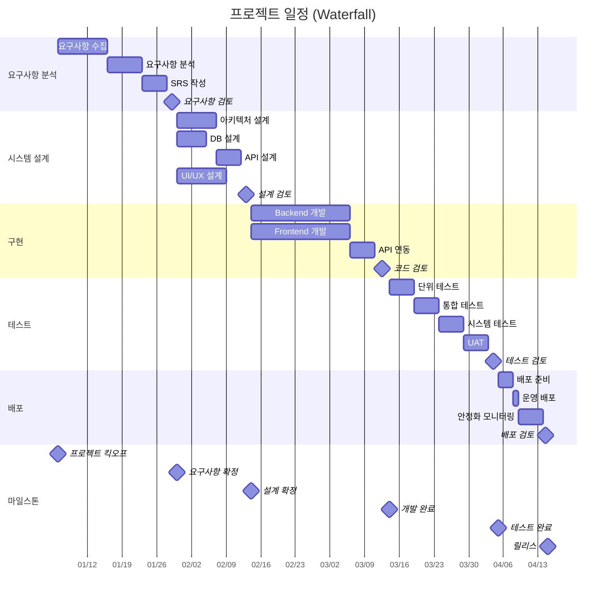
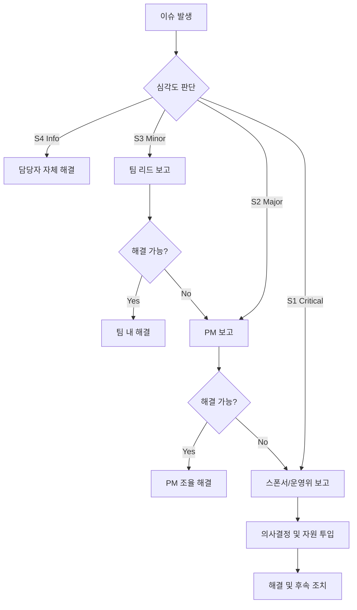
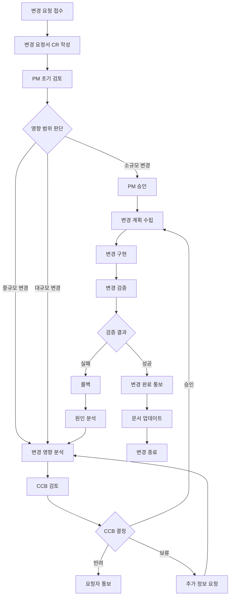

# 프로젝트 관리 산출물 (Project Management Artifacts)

> **프로젝트명:** [프로젝트명]
> **문서 버전:** v1.0
> **작성일:** YYYY-MM-DD
> **작성자:** [이름/역할]

---

## 목차

1. [WBS (Work Breakdown Structure)](#1-wbs-work-breakdown-structure)
2. [위험 관리 대장 (Risk Register)](#2-위험-관리-대장-risk-register)
3. [커뮤니케이션 계획](#3-커뮤니케이션-계획)
4. [변경 관리 계획](#4-변경-관리-계획)
5. [프로젝트 완료 보고서](#5-프로젝트-완료-보고서)

---

## 1. WBS (Work Breakdown Structure)

### 1.1 WBS 작성 원칙

| 원칙 | 설명 |
|------|------|
| 100% Rule | WBS는 프로젝트 범위의 100%를 포함해야 한다 |
| 상호 배타성 | 각 작업 패키지(Work Package)는 중복되지 않아야 한다 |
| 결과물 기반 | 활동이 아닌 결과물(Deliverable) 중심으로 분해한다 |
| 8/80 Rule | 각 작업 패키지는 8시간 이상, 80시간 이하로 추정 가능해야 한다 |
| 3단계 이상 분해 | 최소 3 Level 이상으로 분해하여 관리 가능한 크기를 확보한다 |

### 1.2 워터폴 프로젝트 일정 (Gantt Chart)



### 1.3 WBS 상세 테이블

| WBS-ID | 작업명 | 시작일 | 종료일 | 기간(일) | 담당자 | 상태 | 산출물 |
|--------|--------|--------|--------|:--------:|--------|------|--------|
| **1** | **요구사항 분석** | | | | | | |
| 1.1 | 이해관계자 인터뷰 | | | 5 | | Not Started | 인터뷰 기록 |
| 1.2 | 비즈니스 요구사항 정의 | | | 3 | | Not Started | BRD |
| 1.3 | 기능 요구사항 도출 | | | 5 | | Not Started | FR 목록 |
| 1.4 | 비기능 요구사항 정의 | | | 3 | | Not Started | NFR 목록 |
| 1.5 | 유스케이스 명세 | | | 5 | | Not Started | UC 문서 |
| 1.6 | SRS 작성 | | | 5 | | Not Started | SRS |
| 1.7 | 요구사항 검토 | | | 2 | | Not Started | 검토 결과 |
| **2** | **시스템 설계** | | | | | | |
| 2.1 | 아키텍처 설계 | | | 8 | | Not Started | 아키텍처 문서 |
| 2.2 | DB 설계 | | | 6 | | Not Started | ERD, DDL |
| 2.3 | API 설계 | | | 5 | | Not Started | OpenAPI Spec |
| 2.4 | UI/UX 설계 | | | 10 | | Not Started | 와이어프레임, 프로토타입 |
| 2.5 | 설계 검토 | | | 2 | | Not Started | 검토 결과 |
| **3** | **구현** | | | | | | |
| 3.1 | 개발 환경 구축 | | | 2 | | Not Started | 환경 구성 문서 |
| 3.2 | Backend 개발 | | | 20 | | Not Started | 소스 코드 |
| 3.3 | Frontend 개발 | | | 20 | | Not Started | 소스 코드 |
| 3.4 | API 연동 | | | 5 | | Not Started | 연동 테스트 결과 |
| 3.5 | 코드 검토 | | | 3 | | Not Started | 리뷰 결과 |
| **4** | **테스트** | | | | | | |
| 4.1 | 테스트 계획 수립 | | | 3 | | Not Started | 테스트 계획서 |
| 4.2 | 단위 테스트 | | | 5 | | Not Started | 테스트 결과 |
| 4.3 | 통합 테스트 | | | 5 | | Not Started | 테스트 결과 |
| 4.4 | 시스템 테스트 | | | 5 | | Not Started | 테스트 결과 |
| 4.5 | 성능 테스트 | | | 3 | | Not Started | 성능 보고서 |
| 4.6 | 보안 테스트 | | | 3 | | Not Started | 보안 보고서 |
| 4.7 | UAT | | | 5 | | Not Started | UAT 결과 |
| 4.8 | 테스트 검토 | | | 2 | | Not Started | 검토 결과 |
| **5** | **배포** | | | | | | |
| 5.1 | 배포 계획 수립 | | | 2 | | Not Started | 배포 계획서 |
| 5.2 | 운영 환경 구성 | | | 2 | | Not Started | 인프라 문서 |
| 5.3 | 데이터 마이그레이션 | | | 2 | | Not Started | 마이그레이션 결과 |
| 5.4 | 운영 배포 | | | 1 | | Not Started | 릴리스 노트 |
| 5.5 | 안정화 모니터링 | | | 5 | | Not Started | 모니터링 보고서 |
| 5.6 | 배포 검토 | | | 1 | | Not Started | 검토 결과 |
| **6** | **프로젝트 관리** | | | | | | |
| 6.1 | 킥오프 미팅 | | | 1 | | Not Started | 킥오프 자료 |
| 6.2 | 주간 보고 | | | 전체 | | Not Started | 주간 보고서 |
| 6.3 | 위험 관리 | | | 전체 | | Not Started | 위험 관리 대장 |
| 6.4 | 변경 관리 | | | 전체 | | Not Started | 변경 요청서 |
| 6.5 | 프로젝트 종료 | | | 2 | | Not Started | 완료 보고서 |

> **상태 값:** Not Started / In Progress / Completed / On Hold / Cancelled

---

## 2. 위험 관리 대장 (Risk Register)

### 2.1 위험 식별 카테고리

| 카테고리 | 설명 | 예시 |
|----------|------|------|
| 기술 (Technical) | 기술 스택, 아키텍처, 성능 관련 위험 | 신기술 도입 실패, 성능 미달 |
| 일정 (Schedule) | 마감일, 마일스톤 지연 관련 위험 | 요구사항 변경에 의한 일정 지연 |
| 리소스 (Resource) | 인력, 예산, 장비 관련 위험 | 핵심 인력 이탈, 예산 초과 |
| 외부 (External) | 외부 의존성, 규제, 시장 관련 위험 | 3rd Party API 변경, 법규 변경 |
| 비즈니스 (Business) | 비즈니스 요구사항, 이해관계자 관련 위험 | 요구사항 불명확, 우선순위 충돌 |

### 2.2 위험 평가 매트릭스

**확률 (Probability)**

| 등급 | 수치 | 설명 |
|------|:----:|------|
| 매우 낮음 | 1 | 발생 가능성 10% 미만 |
| 낮음 | 2 | 발생 가능성 10~30% |
| 보통 | 3 | 발생 가능성 30~50% |
| 높음 | 4 | 발생 가능성 50~70% |
| 매우 높음 | 5 | 발생 가능성 70% 초과 |

**영향 (Impact)**

| 등급 | 수치 | 설명 |
|------|:----:|------|
| 매우 낮음 | 1 | 프로젝트에 미미한 영향 |
| 낮음 | 2 | 일부 작업에 경미한 지연 |
| 보통 | 3 | 마일스톤 지연 또는 예산 초과 |
| 높음 | 4 | 주요 목표 달성 위험 |
| 매우 높음 | 5 | 프로젝트 실패 가능성 |

**위험도 = 확률 x 영향**

|  | 영향 1 | 영향 2 | 영향 3 | 영향 4 | 영향 5 |
|:-:|:------:|:------:|:------:|:------:|:------:|
| **확률 5** | 5 | 10 | 15 | 20 | **25** |
| **확률 4** | 4 | 8 | 12 | 16 | **20** |
| **확률 3** | 3 | 6 | 9 | 12 | 15 |
| **확률 2** | 2 | 4 | 6 | 8 | 10 |
| **확률 1** | 1 | 2 | 3 | 4 | 5 |

> **위험도 등급:** 낮음(1~4) / 보통(5~9) / 높음(10~15) / 매우 높음(16~25)

### 2.3 위험 대응 전략

| 전략 | 설명 | 적용 시점 |
|------|------|-----------|
| 회피 (Avoid) | 위험 원인을 제거하여 발생 자체를 방지 | 위험도가 매우 높고 대응 가능 시 |
| 완화 (Mitigate) | 위험 발생 확률 또는 영향을 줄이는 조치 | 대부분의 위험에 적용 |
| 전가 (Transfer) | 위험을 제3자(보험, 외주 등)에게 이전 | 전문성 부족, 재무적 위험 |
| 수용 (Accept) | 위험을 인지하되 별도 조치 없이 감수 | 위험도가 낮거나 대응 비용이 과도 |

### 2.4 위험 관리 테이블

| RISK-ID | 카테고리 | 위험 설명 | 확률 | 영향 | 위험도 | 대응 전략 | 대응 계획 | 담당자 | 상태 |
|---------|----------|-----------|:----:|:----:|:------:|-----------|-----------|--------|------|
| RSK-001 | 기술 | 신규 프레임워크 도입으로 학습 곡선에 의한 생산성 저하 | 4 | 3 | 12 | 완화 | 사전 교육 2주 실시, PoC 진행 | | Open |
| RSK-002 | 리소스 | 핵심 개발자 퇴사 위험 | 2 | 5 | 10 | 완화 | 크로스 트레이닝, 문서화 강화 | | Open |
| RSK-003 | 일정 | 요구사항 추가/변경으로 인한 일정 지연 | 4 | 4 | 16 | 완화 | 변경 관리 프로세스 엄격 적용, 버퍼 일정 10% 확보 | | Open |
| RSK-004 | 기술 | 성능 요구사항 미달 (응답시간 초과) | 3 | 4 | 12 | 완화 | 초기 성능 테스트, 아키텍처 검증 | | Open |
| RSK-005 | 외부 | 3rd Party API 변경 또는 서비스 중단 | 2 | 4 | 8 | 완화 | Adapter 패턴 적용, 대체 API 조사 | | Open |
| RSK-006 | 보안 | 보안 취약점 발견으로 인한 일정 지연 | 3 | 4 | 12 | 완화 | 개발 단계부터 보안 검토, SAST/DAST 도구 적용 | | Open |
| RSK-007 | 리소스 | 테스트 환경 구축 지연 | 3 | 3 | 9 | 완화 | 클라우드 기반 환경 사전 구축 | | Open |
| RSK-008 | 비즈니스 | 이해관계자 간 우선순위 충돌 | 3 | 3 | 9 | 완화 | 정기 스티어링 커미티 운영, 결정 기록 | | Open |
| RSK-009 | 일정 | 데이터 마이그레이션 복잡도 과소 추정 | 3 | 4 | 12 | 완화 | 사전 마이그레이션 시뮬레이션, 롤백 계획 수립 | | Open |
| RSK-010 | 외부 | 관련 법규/규정 변경 | 2 | 3 | 6 | 수용 | 법무팀 주기적 모니터링, 영향 발생 시 대응 | | Open |

> **상태:** Open / In Progress / Mitigated / Closed / Occurred

---

## 3. 커뮤니케이션 계획

### 3.1 이해관계자 분석 매트릭스

이해관계자를 **관심도(Interest)** 와 **영향력(Influence)** 에 따라 분류한다.

```
                높은 영향력
                    |
    B: 만족 유지     |     A: 핵심 관리
    (Keep Satisfied) |     (Manage Closely)
                    |
  ──────────────────┼──────────────────
                    |
    D: 모니터링      |     C: 정보 제공
    (Monitor)       |     (Keep Informed)
                    |
                낮은 영향력

    낮은 관심도 ←─────────────→ 높은 관심도
```

| 이해관계자 | 역할 | 관심도 | 영향력 | 분류 | 커뮤니케이션 전략 |
|-----------|------|:------:|:------:|------|------------------|
| 경영진 / 스폰서 | 예산 승인, 방향 결정 | 보통 | 높음 | B | 월간 요약 보고, 주요 의사결정 시 보고 |
| PO (Product Owner) | 요구사항 정의, 우선순위 | 높음 | 높음 | A | 주간 미팅, 일일 채널 소통 |
| PM | 프로젝트 관리 | 높음 | 높음 | A | 일일 스탠드업, 주간 보고 |
| 개발 리드 | 기술 방향, 아키텍처 | 높음 | 높음 | A | 일일 스탠드업, 기술 미팅 |
| 개발팀 | 구현 | 높음 | 보통 | C | 일일 스탠드업, 업무 채널 |
| QA팀 | 테스트 | 높음 | 보통 | C | 주간 미팅, 결함 채널 |
| UX 디자이너 | UI/UX 설계 | 높음 | 보통 | C | 주간 미팅, 디자인 리뷰 |
| DBA | DB 관리 | 보통 | 보통 | D | 필요 시 미팅 |
| 인프라 / DevOps | 배포, 운영 환경 | 보통 | 보통 | D | 배포 전 미팅, 장애 시 소통 |
| CS / 운영팀 | 최종 사용자 지원 | 보통 | 낮음 | C | 릴리스 전 교육, 릴리스 노트 |

### 3.2 커뮤니케이션 매트릭스

| 대상 | 빈도 | 방법 | 주요 내용 | 담당자 |
|------|------|------|-----------|--------|
| 경영진 / 스폰서 | 월 1회 | 보고 문서 + 미팅 | 프로젝트 현황 요약, 위험, 이슈, 의사결정 요청 | PM |
| PO | 주 1~2회 | 미팅 | 요구사항 확인, 우선순위 조정, 진척 공유 | PM |
| 전체 프로젝트팀 | 일 1회 | 스탠드업 (15분) | 어제 한 일, 오늘 할 일, 블로커 | PM |
| 개발팀 | 주 1회 | 기술 미팅 | 기술 이슈, 아키텍처 논의, 코드 리뷰 | 개발 리드 |
| QA팀 | 주 1회 | 미팅 | 테스트 진행 현황, 결함 현황, 이슈 | QA 리드 |
| 운영팀 | 배포 전후 | 미팅 + 메일 | 배포 계획, 영향 범위, 롤백 계획 | PM |
| 전체 이해관계자 | 주 1회 | 이메일 / 게시 | 주간 보고서 (진척률, 위험, 이슈) | PM |

### 3.3 회의 체계

#### 일일 스탠드업 (Daily Standup)

| 항목 | 내용 |
|------|------|
| 참석자 | PM, 개발팀, QA팀 |
| 시간 | 매일 09:30 (15분) |
| 형식 | 각자 3가지: 어제 완료, 오늘 예정, 블로커 |
| 기록 | Slack/Teams 채널에 요약 공유 |

#### 주간 진척 보고 (Weekly Status Meeting)

| 항목 | 내용 |
|------|------|
| 참석자 | PM, PO, 개발 리드, QA 리드, UX |
| 시간 | 매주 금요일 14:00 (1시간) |
| 안건 | 주간 진척, 위험/이슈, 다음 주 계획 |
| 산출물 | 주간 보고서 |

#### 월간 운영위 (Monthly Steering Committee)

| 항목 | 내용 |
|------|------|
| 참석자 | 스폰서, PM, PO, 주요 이해관계자 |
| 시간 | 매월 마지막 주 수요일 10:00 (1시간) |
| 안건 | 프로젝트 상태 요약, 주요 의사결정, 위험, 예산 |
| 산출물 | 월간 보고서, 의사결정 기록 |

### 3.4 에스컬레이션 경로



**에스컬레이션 기한:**

| 심각도 | 최초 보고 | 에스컬레이션 기한 | 대상 |
|--------|-----------|------------------|------|
| S1 Critical | 즉시 | 발생 즉시 | PM → 스폰서 |
| S2 Major | 4시간 이내 | 24시간 미해결 시 | 팀 리드 → PM |
| S3 Minor | 당일 | 3일 미해결 시 | 담당자 → 팀 리드 |
| S4 Info | 주간 보고 시 | - | - |

---

## 4. 변경 관리 계획

### 4.1 변경 요청 프로세스



### 4.2 변경 요청서 (CR: Change Request) 템플릿

| 항목 | 내용 |
|------|------|
| **CR-ID** | CR-XXXX |
| **요청일** | YYYY-MM-DD |
| **요청자** | |
| **변경 유형** | [ ] 요구사항 변경 / [ ] 설계 변경 / [ ] 범위 변경 / [ ] 일정 변경 / [ ] 기타 |
| **우선순위** | [ ] 긴급 / [ ] 높음 / [ ] 보통 / [ ] 낮음 |

**변경 내용:**

| 항목 | 상세 |
|------|------|
| 변경 제목 | |
| 현재 상태 (As-Is) | |
| 요청 사항 (To-Be) | |
| 변경 사유 | |
| 영향 받는 산출물 | |
| 관련 요구사항 ID | |

**승인 정보:**

| 단계 | 승인자 | 승인일 | 결과 | 비고 |
|------|--------|--------|------|------|
| PM 검토 | | | 승인 / 반려 / CCB 회부 | |
| CCB 결정 | | | 승인 / 반려 / 보류 | |

### 4.3 변경 영향 분석 템플릿

| 분석 항목 | 내용 |
|-----------|------|
| **CR-ID** | CR-XXXX |
| **분석 담당자** | |
| **분석 완료일** | YYYY-MM-DD |

**영향 범위 분석:**

| 영역 | 영향 유무 | 영향 상세 | 예상 공수 |
|------|:---------:|-----------|-----------|
| 요구사항 명세 | Yes / No | | 인일 |
| 아키텍처 설계 | | | |
| DB 설계 | | | |
| API 설계 | | | |
| UI/UX 설계 | | | |
| Backend 코드 | | | |
| Frontend 코드 | | | |
| 테스트 케이스 | | | |
| 문서 | | | |
| 인프라 | | | |

**일정 영향:**

| 항목 | 기존 | 변경 후 | 차이 |
|------|------|---------|------|
| 개발 완료일 | | | +N일 |
| 테스트 완료일 | | | |
| 릴리스일 | | | |

**비용 영향:**

| 항목 | 추가 비용 | 비고 |
|------|-----------|------|
| 인건비 | | |
| 인프라 비용 | | |
| 라이선스 비용 | | |
| **합계** | | |

**위험 평가:**

| 위험 | 확률 | 영향 | 위험도 | 대응 방안 |
|------|:----:|:----:|:------:|-----------|
| | | | | |

### 4.4 CCB (변경통제위원회) 구성 및 역할

**CCB 구성:**

| 역할 | 담당자 | 책임 |
|------|--------|------|
| CCB 의장 | PM | 회의 주관, 최종 결정 조율 |
| 기술 대표 | 아키텍트 / 개발 리드 | 기술 영향 평가, 타당성 판단 |
| 품질 대표 | QA 리드 | 테스트 영향 평가, 품질 위험 판단 |
| 비즈니스 대표 | PO | 비즈니스 가치, 우선순위 판단 |
| 인프라 대표 | DevOps / 인프라 담당 | 인프라 영향 평가 (해당 시 참여) |

**CCB 운영 규칙:**

| 항목 | 규칙 |
|------|------|
| 소집 기준 | 중규모 이상 변경 요청 발생 시 |
| 정기 회의 | 주 1회 (변경 요청 있을 때만) |
| 긴급 회의 | Critical 변경 시 24시간 내 소집 |
| 의결 기준 | 참석 위원 과반수 동의 |
| 기록 | 모든 결정 사항을 변경 이력에 기록 |

---

## 5. 프로젝트 완료 보고서

### 5.1 프로젝트 개요

| 항목 | 내용 |
|------|------|
| 프로젝트명 | |
| 프로젝트 기간 | YYYY-MM-DD ~ YYYY-MM-DD |
| 프로젝트 목표 | |
| 총 투입 인원 | 명 |
| 총 투입 공수 | 인월 (Man-Month) |
| 총 예산 | 원 |

### 5.2 주요 성과 (계획 vs 실적)

**일정 현황:**

| 마일스톤 | 계획일 | 실적일 | 차이 | 사유 |
|----------|--------|--------|------|------|
| 요구사항 확정 | | | | |
| 설계 완료 | | | | |
| 개발 완료 | | | | |
| 테스트 완료 | | | | |
| 릴리스 | | | | |

**일정 준수율:** `(기한 내 완료 마일스톤 수 / 전체 마일스톤 수) x 100 = ___%`

**예산 현황:**

| 항목 | 계획 (원) | 실적 (원) | 차이 (원) | 비율 |
|------|-----------|-----------|-----------|------|
| 인건비 | | | | % |
| 인프라 | | | | |
| 라이선스 | | | | |
| 교육/컨설팅 | | | | |
| 기타 | | | | |
| **합계** | | | | **%** |

**예산 준수율:** `(실적 / 계획) x 100 = ___%`

### 5.3 품질 지표

| 지표 | 목표 | 실적 | 충족 여부 |
|------|------|------|-----------|
| 결함 밀도 (결함 수 / KLOC) | | | |
| Critical/Major 미해결 결함 | 0건 | | |
| 테스트 커버리지 | >= 80% | | |
| 테스트 통과율 | >= 95% | | |
| 성능 목표 달성률 | 100% | | |
| 접근성(WCAG AA) 적합률 | 100% | | |
| 보안 취약점 (High 이상) | 0건 | | |

### 5.4 범위 달성 현황

| 요구사항 분류 | 계획 수 | 완료 수 | 이월 수 | 취소 수 | 달성률 |
|--------------|:-------:|:-------:|:-------:|:-------:|:------:|
| 기능 요구사항 | | | | | % |
| 비기능 요구사항 | | | | | % |
| **합계** | | | | | **%** |

### 5.5 교훈 (Lessons Learned)

| # | 분류 | 내용 | 원인 | 개선방안 |
|---|------|------|------|----------|
| 1 | 요구사항 | | | |
| 2 | 설계 | | | |
| 3 | 개발 | | | |
| 4 | 테스트 | | | |
| 5 | 배포 | | | |
| 6 | 커뮤니케이션 | | | |
| 7 | 위험 관리 | | | |
| 8 | 도구/프로세스 | | | |

### 5.6 잔여 위험 및 권고사항

**잔여 위험:**

| # | 위험 설명 | 위험도 | 대응 권고 | 담당 |
|---|----------|:------:|-----------|------|
| 1 | | 높음/보통/낮음 | | |
| 2 | | | | |
| 3 | | | | |

**권고사항:**

| # | 분류 | 권고 내용 | 우선순위 | 대상 |
|---|------|-----------|:--------:|------|
| 1 | 기술 부채 | | High / Medium / Low | |
| 2 | 성능 개선 | | | |
| 3 | 운영 | | | |
| 4 | 보안 | | | |
| 5 | 프로세스 | | | |

### 5.7 프로젝트 종료 승인

| 역할 | 이름 | 서명 | 일자 |
|------|------|------|------|
| PM | | | |
| PO / 스폰서 | | | |
| 개발 리드 | | | |
| QA 리드 | | | |
| 운영 담당 | | | |

---

*프로젝트 완료 보고서는 프로젝트 종료 후 2주 이내에 작성하여 주요 이해관계자에게 배포한다.*
