# Waterfall Methodology - Claude Code 산출물 생성 가이드

> 이 문서는 Claude Code가 워터폴(Waterfall) 방법론에 따라 소프트웨어 개발 프로젝트의 각 단계별 산출물을 자동으로 생성하기 위한 종합 가이드입니다.
> 사용자가 "SRS 작성해줘", "API 설계서 만들어줘" 등의 요청을 하면, 이 문서의 해당 템플릿을 기반으로 산출물을 생성하세요.

---

## 1. 워터폴 방법론 개요

### 1.1 워터폴 모델 정의

워터폴(Waterfall) 모델은 소프트웨어 개발을 순차적이고 선형적인 단계로 나누어 진행하는 전통적인 개발 방법론이다. 각 단계는 이전 단계가 완료된 후에야 시작되며, 한 번 완료된 단계로 되돌아가는 것을 최소화한다.

**적합한 프로젝트 유형:**
- 요구사항이 명확하고 변경 가능성이 낮은 프로젝트
- 규제 준수가 필요한 프로젝트 (의료, 금융, 국방, 공공)
- 대규모 시스템 통합 프로젝트
- 외주/계약 기반 프로젝트 (범위와 비용이 사전 확정)
- 하드웨어-소프트웨어 통합 프로젝트
- 안전 필수(Safety-Critical) 시스템

### 1.2 단계별 흐름도

```
기획 ──▶ 요구사항 분석 ──▶ 시스템 설계 ──▶ 상세 설계 ──▶ 구현 ──▶ 테스트 ──▶ 배포 ──▶ 유지보수
(Phase 0) (Phase 1)       (Phase 2)      (Phase 3)    (Phase 4) (Phase 5) (Phase 6) (Phase 7)
    │         │               │              │            │         │         │         │
    ▼         ▼               ▼              ▼            ▼         ▼         ▼         ▼
 서비스      SRS            SAD           상세설계서    소스코드   테스트    릴리스    유지보수
 기획서      유스케이스      DB설계서      코딩표준     빌드설정   계획서    노트     계획서
 비즈니스    RTM            API설계서                  진행보고   결과보고  운영가이드 인수인계
 정책서                     UI/UX설계서                          성능보고
```

### 1.3 단계 간 게이트(Gate) - 승인 기준

| Gate | 이전 단계 | 다음 단계 | 승인 기준 |
|------|-----------|-----------|-----------|
| G0 | 기획 | 요구사항 분석 | 서비스 기획서 승인, 비즈니스 정책서 리뷰 완료, MVP 스코프 확정 |
| G1 | 요구사항 분석 | 시스템 설계 | SRS 승인, RTM 초안 완료, 이해관계자 서명 |
| G2 | 시스템 설계 | 상세 설계 | SAD 승인, DB/API/UI 설계서 리뷰 완료 |
| G3 | 상세 설계 | 구현 | 상세설계서 승인, 코딩 표준 확정, 개발 환경 준비 완료 |
| G4 | 구현 | 테스트 | 코드 완료, 단위 테스트 통과, 코드 리뷰 완료 |
| G5 | 테스트 | 배포 | 모든 테스트 통과, 결함 해결, UAT 승인 |
| G6 | 배포 | 유지보수 | 프로덕션 배포 완료, 운영 가이드 인수, 모니터링 확인 |

### 1.4 워터폴 vs 애자일 비교

| 기준 | 워터폴 | 애자일 |
|------|--------|--------|
| 요구사항 변경 | 어려움 (초기 확정) | 유연함 (반복적 변경) |
| 고객 참여 | 초기/최종 단계 | 지속적 참여 |
| 산출물 | 각 단계별 공식 문서 | 작동하는 소프트웨어 중심 |
| 위험 관리 | 초기 단계에서 식별 | 스프린트마다 재평가 |
| 테스트 시점 | 구현 완료 후 | 개발과 병행 |
| 팀 구조 | 역할 기반 분리 | 교차 기능 팀 |
| 적합 상황 | 명확한 요구사항, 규제 환경 | 불확실성 높음, 빠른 변화 |

### 1.5 산출물 전체 목록

| Phase | 산출물 | 파일명 규칙 | 필수 여부 |
|-------|--------|-------------|-----------|
| Phase 0 | 서비스 기획서 | `SPD-[프로젝트코드]-v[버전].md` | 권장 |
| Phase 0 | 비즈니스 정책서 | `BPD-[프로젝트코드]-v[버전].md` | 권장 |
| Phase 1 | 요구사항 명세서 (SRS) | `SRS-[프로젝트코드]-v[버전].md` | 필수 |
| Phase 1 | 유스케이스 문서 | `UC-[프로젝트코드]-v[버전].md` | 필수 |
| Phase 1 | 요구사항 추적 매트릭스 | `RTM-[프로젝트코드]-v[버전].md` | 필수 |
| Phase 2 | 시스템 아키텍처 설계서 | `SAD-[프로젝트코드]-v[버전].md` | 필수 |
| Phase 2 | 데이터베이스 설계서 | `DBS-[프로젝트코드]-v[버전].md` | 필수 |
| Phase 2 | API 설계서 | `API-[프로젝트코드]-v[버전].md` | 필수 |
| Phase 2 | UI/UX 설계서 | `UIX-[프로젝트코드]-v[버전].md` | 선택 |
| Phase 3 | 상세 설계서 | `DDS-[프로젝트코드]-v[버전].md` | 필수 |
| Phase 3 | 코딩 표준 문서 | `CDS-[프로젝트코드]-v[버전].md` | 권장 |
| Phase 4 | 소스 코드 관리 계획 | `SCM-[프로젝트코드]-v[버전].md` | 권장 |
| Phase 4 | 빌드/배포 설정 문서 | `BLD-[프로젝트코드]-v[버전].md` | 권장 |
| Phase 4 | 개발 진행 보고서 | `DPR-[프로젝트코드]-W[주차].md` | 권장 |
| Phase 5 | 테스트 계획서 | `TPL-[프로젝트코드]-v[버전].md` | 필수 |
| Phase 5 | 테스트 케이스 문서 | `TCS-[프로젝트코드]-v[버전].md` | 필수 |
| Phase 5 | 테스트 결과 보고서 | `TRP-[프로젝트코드]-v[버전].md` | 필수 |
| Phase 5 | 성능 테스트 보고서 | `PTR-[프로젝트코드]-v[버전].md` | 선택 |
| Phase 6 | 배포 계획서 | `DPP-[프로젝트코드]-v[버전].md` | 필수 |
| Phase 6 | 릴리스 노트 | `RN-[프로젝트코드]-v[버전].md` | 필수 |
| Phase 6 | 운영 가이드 | `OPG-[프로젝트코드]-v[버전].md` | 필수 |
| Phase 7 | 유지보수 계획서 | `MTP-[프로젝트코드]-v[버전].md` | 필수 |
| Phase 7 | 인수인계 문서 | `HDO-[프로젝트코드]-v[버전].md` | 필수 |
| 공통 | WBS | `WBS-[프로젝트코드]-v[버전].md` | 필수 |
| 공통 | 위험 관리 대장 | `RSK-[프로젝트코드]-v[버전].md` | 필수 |
| 공통 | 프로젝트 완료 보고서 | `PCR-[프로젝트코드]-v[버전].md` | 필수 |

---

## 2. Phase 1: 요구사항 분석 (Requirements Analysis)

이 단계에서는 프로젝트의 목표, 범위, 기능/비기능 요구사항을 정의하고 문서화한다. 모든 이해관계자의 요구를 수집하고 분석하여 시스템이 "무엇을" 해야 하는지를 명확히 한다.

**이 단계의 핵심 활동:**
- 이해관계자 인터뷰 및 요구사항 수집
- 요구사항 분석 및 우선순위 결정
- SRS(Software Requirements Specification) 작성
- 유스케이스 모델링
- 요구사항 추적 매트릭스 초안 작성
- 이해관계자 검토 및 승인

### 2.1 산출물: 요구사항 명세서 (SRS - Software Requirements Specification)

> 아래 템플릿을 복사하여 프로젝트에 맞게 `[대괄호]` 내용을 수정하세요.

```markdown
# 소프트웨어 요구사항 명세서 (SRS)

| 항목 | 내용 |
|------|------|
| 문서 ID | SRS-[프로젝트코드]-v1.0 |
| 프로젝트명 | [프로젝트명] |
| 작성자 | [작성자명] |
| 작성일 | [YYYY-MM-DD] |
| 버전 | 1.0 |
| 승인자 | [승인자명] |
| 상태 | 초안 / 검토중 / 승인됨 |

## 변경 이력

| 버전 | 날짜 | 작성자 | 변경 내용 |
|------|------|--------|-----------|
| 0.1 | [YYYY-MM-DD] | [이름] | 초안 작성 |
| 1.0 | [YYYY-MM-DD] | [이름] | 최초 승인 |

---

## 1. 개요

### 1.1 목적
본 문서는 [시스템명]의 소프트웨어 요구사항을 정의한다.
이 문서의 대상 독자는 [개발팀, PM, QA팀, 고객사 담당자] 등이다.

### 1.2 범위
- **시스템명:** [시스템명]
- **시스템 설명:** [시스템이 수행하는 핵심 기능 요약 - 2~3문장]
- **포함 범위:**
  - [기능 영역 1]
  - [기능 영역 2]
  - [기능 영역 3]
- **제외 범위:**
  - [제외 항목 1]
  - [제외 항목 2]

### 1.3 용어 정의

| 용어 | 정의 |
|------|------|
| [용어1] | [정의] |
| [용어2] | [정의] |
| [용어3] | [정의] |

### 1.4 참고 문서

| 문서명 | 버전 | 설명 |
|--------|------|------|
| [문서명1] | [버전] | [설명] |
| [문서명2] | [버전] | [설명] |

---

## 2. 전체 시스템 설명

### 2.1 시스템 관점 (System Perspective)
[시스템이 전체 비즈니스 환경에서 어떤 위치를 차지하는지, 기존 시스템과의 관계를 설명]

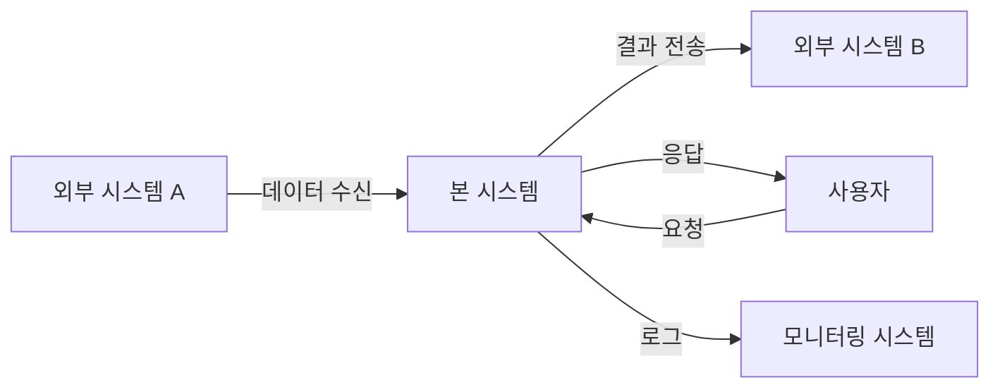

### 2.2 사용자 특성

| 사용자 유형 | 설명 | 기술 수준 | 사용 빈도 |
|-------------|------|-----------|-----------|
| [관리자] | [시스템 전체 관리] | [상] | [일일] |
| [일반 사용자] | [핵심 기능 사용] | [중] | [일일] |
| [외부 연동 시스템] | [API를 통한 데이터 교환] | [상] | [실시간] |

### 2.3 제약 사항
- **기술적 제약:** [사용해야 하는 기술 스택, 플랫폼 등]
- **비즈니스 제약:** [예산, 일정, 인력 제한]
- **규제 제약:** [관련 법규, 표준, 인증 요구사항]
- **운영 제약:** [가용 인프라, 네트워크 환경]

### 2.4 가정 사항
- [가정 1: 예) 사용자는 최신 웹 브라우저를 사용한다]
- [가정 2: 예) 외부 시스템 API는 안정적으로 제공된다]
- [가정 3: 예) 동시 접속 사용자는 최대 1,000명을 넘지 않는다]

---

## 3. 기능 요구사항

### 3.1 기능 요구사항 목록

| ID | 기능명 | 설명 | 우선순위 | 상태 |
|----|--------|------|----------|------|
| FR-001 | [기능명] | [기능 설명] | 상/중/하 | 신규 |
| FR-002 | [기능명] | [기능 설명] | 상/중/하 | 신규 |
| FR-003 | [기능명] | [기능 설명] | 상/중/하 | 신규 |

### 3.2 기능 요구사항 상세

#### FR-001: [기능명]

| 항목 | 내용 |
|------|------|
| ID | FR-001 |
| 이름 | [기능명] |
| 설명 | [이 기능이 수행하는 것에 대한 상세 설명] |
| 우선순위 | 상 |
| 관련 유스케이스 | UC-001 |

**입력:**

| 입력 항목 | 타입 | 필수 여부 | 유효성 규칙 |
|-----------|------|-----------|-------------|
| [입력1] | [String/Number/Date] | Y/N | [규칙 설명] |
| [입력2] | [String/Number/Date] | Y/N | [규칙 설명] |

**출력:**

| 출력 항목 | 타입 | 설명 |
|-----------|------|------|
| [출력1] | [타입] | [설명] |
| [출력2] | [타입] | [설명] |

**처리 로직:**
1. [단계 1: 입력 데이터 유효성 검증]
2. [단계 2: 비즈니스 로직 수행]
3. [단계 3: 결과 데이터 생성]
4. [단계 4: 응답 반환]

**비즈니스 규칙:**
- BR-001: [비즈니스 규칙 설명]
- BR-002: [비즈니스 규칙 설명]

**예외 처리:**
- [입력 데이터가 유효하지 않은 경우: 에러 메시지 반환]
- [권한이 없는 경우: 403 응답]

---

#### FR-002: [기능명]

| 항목 | 내용 |
|------|------|
| ID | FR-002 |
| 이름 | [기능명] |
| 설명 | [상세 설명] |
| 우선순위 | 중 |
| 관련 유스케이스 | UC-002 |

**입력:**

| 입력 항목 | 타입 | 필수 여부 | 유효성 규칙 |
|-----------|------|-----------|-------------|
| [입력1] | [타입] | Y/N | [규칙] |

**출력:**

| 출력 항목 | 타입 | 설명 |
|-----------|------|------|
| [출력1] | [타입] | [설명] |

**처리 로직:**
1. [단계 설명]

---

## 4. 비기능 요구사항

### 4.1 성능 요구사항

| ID | 요구사항 | 측정 기준 | 목표값 |
|----|----------|-----------|--------|
| NFR-P01 | API 응답 시간 | 95th percentile | [200ms 이하] |
| NFR-P02 | 페이지 로딩 시간 | 초기 로드 기준 | [3초 이하] |
| NFR-P03 | 동시 접속자 처리 | 동시 사용자 수 | [1,000명] |
| NFR-P04 | 처리량 (Throughput) | TPS (초당 트랜잭션) | [500 TPS] |

### 4.2 보안 요구사항

| ID | 요구사항 | 설명 |
|----|----------|------|
| NFR-S01 | 인증 | [JWT 기반 토큰 인증 적용] |
| NFR-S02 | 인가 | [역할 기반 접근 제어(RBAC) 적용] |
| NFR-S03 | 데이터 암호화 | [전송 중 TLS 1.3, 저장 시 AES-256] |
| NFR-S04 | 감사 로그 | [모든 데이터 변경 작업에 대한 감사 로그 기록] |
| NFR-S05 | 취약점 관리 | [OWASP Top 10 대응] |

### 4.3 가용성 요구사항

| ID | 요구사항 | 목표값 |
|----|----------|--------|
| NFR-A01 | 시스템 가용성 | [99.9% (연간 다운타임 8.76시간 이내)] |
| NFR-A02 | 장애 복구 시간 (RTO) | [1시간 이내] |
| NFR-A03 | 데이터 복구 시점 (RPO) | [최대 15분 전 시점] |
| NFR-A04 | 계획된 유지보수 | [월 1회, 최대 2시간] |

### 4.4 확장성 요구사항

| ID | 요구사항 | 설명 |
|----|----------|------|
| NFR-SC01 | 수평 확장 | [로드밸런서를 통한 수평 확장 지원] |
| NFR-SC02 | 데이터 증가 | [연간 데이터 증가량 [N]TB 수용] |
| NFR-SC03 | 사용자 증가 | [향후 3년 내 사용자 10배 증가 대응] |

### 4.5 호환성 요구사항

| ID | 요구사항 | 상세 |
|----|----------|------|
| NFR-C01 | 브라우저 호환성 | [Chrome, Firefox, Safari, Edge 최신 2개 버전] |
| NFR-C02 | 모바일 호환성 | [반응형 디자인, iOS 15+, Android 12+] |
| NFR-C03 | 외부 시스템 연동 | [시스템 A API v2.0, 시스템 B SDK v3.x] |

---

## 5. 외부 인터페이스 요구사항

### 5.1 사용자 인터페이스 (UI)
- **반응형 디자인:** [지원 해상도 범위: 360px ~ 2560px]
- **접근성:** [WCAG 2.1 AA 수준 준수]
- **다국어 지원:** [한국어(기본), 영어]
- **디자인 시스템:** [Material Design / 자체 디자인 시스템]

### 5.2 외부 API 인터페이스

| 연동 시스템 | 프로토콜 | 인증 방식 | 데이터 형식 | 설명 |
|-------------|----------|-----------|-------------|------|
| [시스템A] | REST HTTPS | API Key | JSON | [데이터 수신] |
| [시스템B] | gRPC | mTLS | Protobuf | [이벤트 발행] |
| [시스템C] | AMQP | 인증서 | JSON | [메시지 큐] |

### 5.3 하드웨어 인터페이스
- [해당 없음 / 하드웨어 연동 요구사항 기술]

### 5.4 소프트웨어 인터페이스

| 소프트웨어 | 버전 | 용도 |
|------------|------|------|
| [DBMS명] | [버전] | [데이터 저장] |
| [메시지 브로커] | [버전] | [비동기 메시징] |
| [캐시 시스템] | [버전] | [데이터 캐싱] |

---

## 6. 데이터 요구사항

### 6.1 데이터 모델 개요
[주요 데이터 엔티티 간의 관계를 고수준으로 설명]

### 6.2 핵심 데이터 엔티티

| 엔티티명 | 설명 | 예상 레코드 수 | 증가율 |
|----------|------|----------------|--------|
| [엔티티1] | [설명] | [초기 N건] | [월 N건] |
| [엔티티2] | [설명] | [초기 N건] | [월 N건] |

### 6.3 데이터 흐름


### 6.4 데이터 보존 정책

| 데이터 유형 | 보존 기간 | 보존 후 처리 | 근거 |
|-------------|-----------|-------------|------|
| [트랜잭션 데이터] | [5년] | [아카이브] | [관련 법규] |
| [로그 데이터] | [1년] | [삭제] | [내부 정책] |
| [개인정보] | [탈퇴 후 30일] | [완전 삭제] | [개인정보보호법] |

---

## 7. 제약 조건 및 가정

### 7.1 제약 조건
1. [기술 제약: 예) 기존 레거시 시스템과 호환 필요]
2. [환경 제약: 예) 온프레미스 환경에서만 운영]
3. [일정 제약: 예) 법적 시행일까지 개발 완료 필요]

### 7.2 가정
1. [가정 1]
2. [가정 2]
3. [가정 3]

### 7.3 의존성
1. [외부 시스템 A의 API가 [날짜]까지 제공됨]
2. [인프라 구축이 [날짜]까지 완료됨]

---

## 8. 부록

### 8.1 승인

| 역할 | 이름 | 서명 | 날짜 |
|------|------|------|------|
| PM | [이름] | | [날짜] |
| 고객 대표 | [이름] | | [날짜] |
| 기술 책임자 | [이름] | | [날짜] |

### 8.2 참고 자료
- [참고 자료 1]
- [참고 자료 2]
```

---

### 2.2 산출물: 유스케이스 문서

> 유스케이스는 시스템과 사용자(액터) 간의 상호작용을 체계적으로 기술한다.

#### 유스케이스 다이어그램 (Mermaid 예시)

시스템의 전체 유스케이스를 파악하기 위해 아래 형식의 다이어그램을 작성한다.

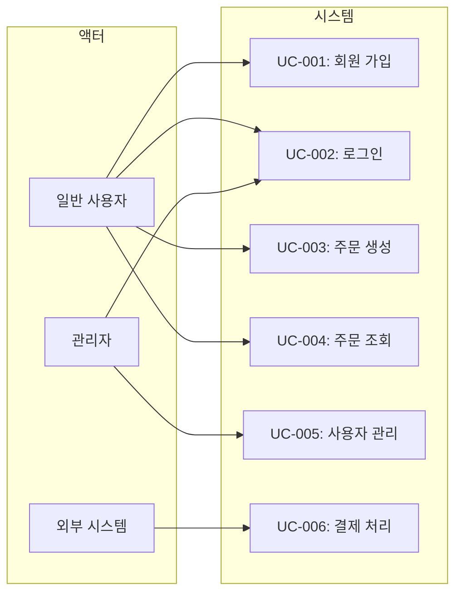

#### 유스케이스 명세서 템플릿

```markdown
# 유스케이스 문서

| 항목 | 내용 |
|------|------|
| 문서 ID | UC-[프로젝트코드]-v1.0 |
| 프로젝트명 | [프로젝트명] |
| 작성일 | [YYYY-MM-DD] |
| 버전 | 1.0 |

---

## UC-001: [유스케이스명]

| 항목 | 내용 |
|------|------|
| UC ID | UC-001 |
| 이름 | [유스케이스명] |
| 액터 | [주 액터], [보조 액터(선택)] |
| 설명 | [유스케이스의 목적을 1~2문장으로 설명] |
| 우선순위 | 상 / 중 / 하 |
| 관련 요구사항 | FR-001, FR-002 |

### 사전 조건 (Preconditions)
1. [사전 조건 1: 예) 사용자가 시스템에 로그인되어 있다]
2. [사전 조건 2]

### 기본 흐름 (Basic Flow)
1. [사용자]가 [행위]를 수행한다.
2. 시스템이 [처리]를 수행한다.
3. 시스템이 [결과]를 [사용자]에게 표시한다.
4. [사용자]가 [확인/입력]한다.
5. 시스템이 [최종 처리]를 수행하고 결과를 저장한다.
6. 시스템이 [완료 메시지]를 표시한다.

### 대안 흐름 (Alternative Flow)
- **AF-1: [대안 흐름명]**
  - 분기 시점: 기본 흐름 [N]단계에서
  - 조건: [분기 조건]
  - 1. [대안 단계 1]
  - 2. [대안 단계 2]
  - 기본 흐름 [N]단계로 복귀

### 예외 흐름 (Exception Flow)
- **EF-1: [예외 흐름명]**
  - 발생 시점: 기본 흐름 [N]단계에서
  - 조건: [예외 조건]
  - 1. 시스템이 에러 메시지 "[메시지]"를 표시한다.
  - 2. 시스템이 [이전 단계 / 초기 화면]으로 돌아간다.

### 사후 조건 (Postconditions)
1. [사후 조건 1: 예) 새로운 데이터가 데이터베이스에 저장됨]
2. [사후 조건 2: 예) 관련 알림이 발송됨]

### 비즈니스 규칙
- [BR-001: 규칙 설명]
- [BR-002: 규칙 설명]

---

## UC-002: [유스케이스명 - 로그인 예시]

| 항목 | 내용 |
|------|------|
| UC ID | UC-002 |
| 이름 | 사용자 로그인 |
| 액터 | 일반 사용자, 관리자 |
| 설명 | 사용자가 이메일과 비밀번호를 입력하여 시스템에 인증한다 |
| 우선순위 | 상 |
| 관련 요구사항 | FR-002 |

### 사전 조건
1. 사용자가 회원 가입이 완료된 상태이다.
2. 사용자가 로그인 페이지에 접근한 상태이다.

### 기본 흐름
1. 사용자가 로그인 페이지에서 이메일과 비밀번호를 입력한다.
2. 사용자가 "로그인" 버튼을 클릭한다.
3. 시스템이 이메일 형식을 검증한다.
4. 시스템이 이메일과 비밀번호를 데이터베이스에서 확인한다.
5. 시스템이 인증 토큰을 생성한다.
6. 시스템이 사용자를 대시보드 페이지로 이동시킨다.

### 대안 흐름
- **AF-1: 소셜 로그인**
  - 분기 시점: 기본 흐름 1단계에서
  - 조건: 사용자가 소셜 로그인 버튼을 클릭한 경우
  - 1. 시스템이 선택된 소셜 서비스의 인증 페이지로 리다이렉트한다.
  - 2. 사용자가 소셜 서비스에서 인증을 완료한다.
  - 3. 시스템이 콜백 URL로 인증 코드를 수신한다.
  - 기본 흐름 5단계로 복귀

### 예외 흐름
- **EF-1: 인증 실패**
  - 발생 시점: 기본 흐름 4단계에서
  - 조건: 이메일 또는 비밀번호가 일치하지 않는 경우
  - 1. 시스템이 "이메일 또는 비밀번호가 올바르지 않습니다" 메시지를 표시한다.
  - 2. 시스템이 로그인 실패 횟수를 증가시킨다.
  - 3. 시스템이 로그인 페이지를 다시 표시한다.

- **EF-2: 계정 잠김**
  - 발생 시점: 기본 흐름 4단계에서
  - 조건: 로그인 실패 횟수가 5회를 초과한 경우
  - 1. 시스템이 계정을 잠금 처리한다.
  - 2. 시스템이 "계정이 잠겼습니다. 비밀번호 재설정을 진행해주세요." 메시지를 표시한다.

### 사후 조건
1. 사용자 세션이 생성되고 인증 토큰이 발급됨
2. 마지막 로그인 시간이 업데이트됨

---

## UC-003: [유스케이스명 - 주문 생성 예시]

| 항목 | 내용 |
|------|------|
| UC ID | UC-003 |
| 이름 | 주문 생성 |
| 액터 | 일반 사용자 |
| 설명 | 사용자가 장바구니의 상품을 주문하고 결제를 완료한다 |
| 우선순위 | 상 |
| 관련 요구사항 | FR-003, FR-004 |

### 사전 조건
1. 사용자가 로그인된 상태이다.
2. 장바구니에 1개 이상의 상품이 담겨 있다.

### 기본 흐름
1. 사용자가 장바구니에서 "주문하기" 버튼을 클릭한다.
2. 시스템이 주문 확인 페이지를 표시한다(상품 목록, 수량, 가격).
3. 사용자가 배송지 정보를 입력/선택한다.
4. 사용자가 결제 수단을 선택한다.
5. 사용자가 "결제하기" 버튼을 클릭한다.
6. 시스템이 재고를 확인하고 임시로 예약한다.
7. 시스템이 결제 시스템에 결제를 요청한다.
8. 결제가 완료되면 시스템이 주문을 확정하고 주문번호를 발급한다.
9. 시스템이 주문 완료 페이지를 표시한다.
10. 시스템이 주문 확인 이메일을 발송한다.

### 대안 흐름
- **AF-1: 배송지 변경**
  - 분기 시점: 기본 흐름 3단계에서
  - 조건: 사용자가 새 배송지를 추가하려는 경우
  - 1. 사용자가 "새 배송지 추가" 버튼을 클릭한다.
  - 2. 사용자가 새 배송지 정보를 입력한다.
  - 3. 시스템이 주소를 검증하고 저장한다.
  - 기본 흐름 4단계로 복귀

### 예외 흐름
- **EF-1: 재고 부족**
  - 발생 시점: 기본 흐름 6단계에서
  - 조건: 요청 수량보다 재고가 부족한 경우
  - 1. 시스템이 재고 부족 상품과 가용 수량을 표시한다.
  - 2. 사용자가 수량을 조정하거나 해당 상품을 제거한다.
  - 기본 흐름 2단계로 복귀

- **EF-2: 결제 실패**
  - 발생 시점: 기본 흐름 7단계에서
  - 조건: 결제 시스템에서 결제 거부 또는 오류가 발생한 경우
  - 1. 시스템이 재고 예약을 해제한다.
  - 2. 시스템이 결제 실패 메시지를 표시한다.
  - 3. 사용자에게 다른 결제 수단 선택을 안내한다.

### 사후 조건
1. 주문 레코드가 생성되고 상태가 "결제완료"로 설정됨
2. 재고가 차감됨
3. 결제 트랜잭션이 기록됨
4. 주문 확인 이메일이 발송됨
```

---

### 2.3 산출물: 요구사항 추적 매트릭스 (RTM)

> RTM은 각 요구사항이 설계, 구현, 테스트에 어떻게 반영되었는지 추적하는 문서이다.

```markdown
# 요구사항 추적 매트릭스 (RTM)

| 항목 | 내용 |
|------|------|
| 문서 ID | RTM-[프로젝트코드]-v1.0 |
| 프로젝트명 | [프로젝트명] |
| 작성일 | [YYYY-MM-DD] |
| 버전 | 1.0 |

## 추적 매트릭스

| 요구사항 ID | 요구사항 설명 | 유스케이스 | 설계 문서 참조 | 구현 모듈 | 테스트 케이스 | 상태 |
|-------------|---------------|-----------|----------------|-----------|---------------|------|
| FR-001 | [기능 설명] | UC-001 | SAD 3.2절 | [모듈/클래스명] | TC-001, TC-002 | 구현완료 |
| FR-002 | [기능 설명] | UC-002 | SAD 3.3절 | [모듈/클래스명] | TC-003 | 테스트중 |
| FR-003 | [기능 설명] | UC-003 | SAD 3.4절 | [모듈/클래스명] | TC-004, TC-005 | 설계중 |
| NFR-P01 | [성능 요구사항] | - | SAD 5.1절 | [인프라 구성] | PT-001 | 미시작 |
| NFR-S01 | [보안 요구사항] | - | SAD 5.2절 | [보안 모듈] | ST-001 | 미시작 |

## 추적 상태 요약

| 상태 | 건수 | 비율 |
|------|------|------|
| 미시작 | [N] | [N%] |
| 설계중 | [N] | [N%] |
| 구현중 | [N] | [N%] |
| 구현완료 | [N] | [N%] |
| 테스트중 | [N] | [N%] |
| 완료 | [N] | [N%] |
| **합계** | **[N]** | **100%** |

## 커버리지 분석

| 항목 | 전체 | 매핑됨 | 미매핑 | 커버리지 |
|------|------|--------|--------|----------|
| 요구사항 → 유스케이스 | [N] | [N] | [N] | [N%] |
| 요구사항 → 설계 | [N] | [N] | [N] | [N%] |
| 요구사항 → 구현 | [N] | [N] | [N] | [N%] |
| 요구사항 → 테스트 | [N] | [N] | [N] | [N%] |
```

---

## 3. Phase 2: 시스템 설계 (System Design)

이 단계에서는 Phase 1에서 정의된 요구사항을 "어떻게" 구현할 것인지를 설계한다. 시스템 아키텍처, 데이터베이스, API, UI/UX 설계를 포함한다.

**이 단계의 핵심 활동:**
- 아키텍처 스타일 선정 및 설계
- 기술 스택 선정
- 데이터베이스 스키마 설계
- API 인터페이스 설계
- UI/UX 와이어프레임 및 화면 흐름 설계
- 설계 리뷰 및 승인

### 3.1 산출물: 시스템 아키텍처 설계서 (SAD)

```markdown
# 시스템 아키텍처 설계서 (SAD)

| 항목 | 내용 |
|------|------|
| 문서 ID | SAD-[프로젝트코드]-v1.0 |
| 프로젝트명 | [프로젝트명] |
| 작성자 | [작성자명] |
| 작성일 | [YYYY-MM-DD] |
| 버전 | 1.0 |
| 승인자 | [승인자명] |

## 변경 이력

| 버전 | 날짜 | 작성자 | 변경 내용 |
|------|------|--------|-----------|
| 0.1 | [YYYY-MM-DD] | [이름] | 초안 작성 |
| 1.0 | [YYYY-MM-DD] | [이름] | 최초 승인 |

---

## 1. 아키텍처 개요

### 1.1 아키텍처 스타일

| 항목 | 선정 | 근거 |
|------|------|------|
| 아키텍처 패턴 | [레이어드 / 마이크로서비스 / 이벤트 드리븐 / 모놀리식] | [선정 근거] |
| 통신 방식 | [동기(REST) / 비동기(메시지 큐) / 혼합] | [선정 근거] |
| 배포 방식 | [온프레미스 / 클라우드 / 하이브리드] | [선정 근거] |

### 1.2 아키텍처 원칙
1. **관심사 분리 (Separation of Concerns):** 각 레이어/서비스는 단일 책임을 가진다.
2. **느슨한 결합 (Loose Coupling):** 서비스 간 의존성을 최소화한다.
3. **높은 응집도 (High Cohesion):** 관련 기능은 하나의 모듈에 집중한다.
4. **확장 가능성 (Scalability):** 수평/수직 확장이 용이한 구조를 설계한다.
5. [추가 원칙]

---

## 2. 시스템 컨텍스트 다이어그램

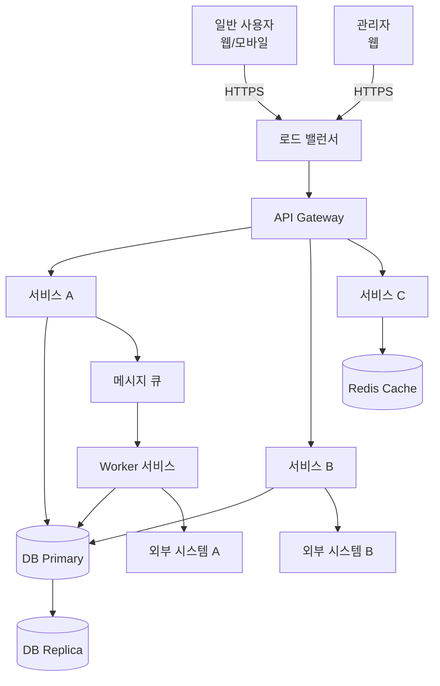

---

## 3. 컴포넌트 다이어그램

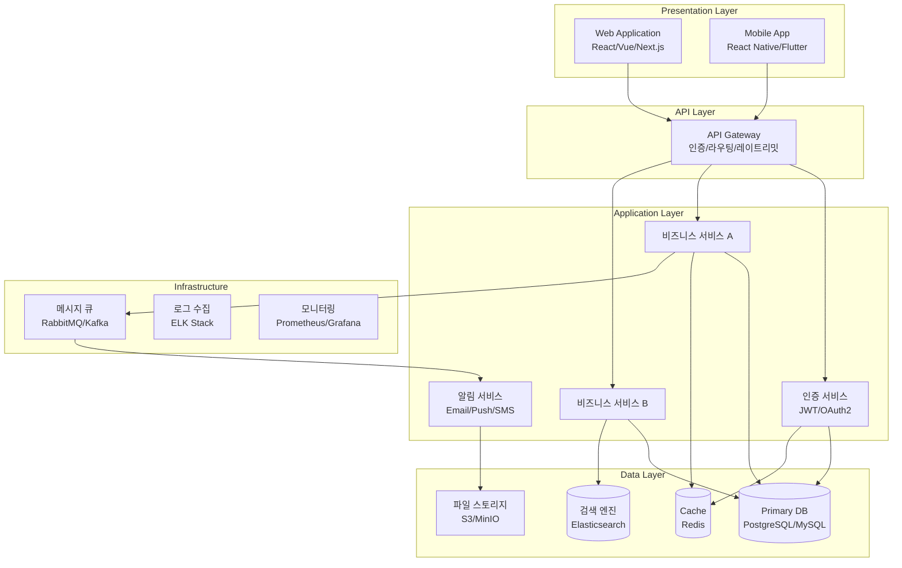

### 3.1 컴포넌트 상세

| 컴포넌트 | 책임 | 기술 스택 | 통신 방식 |
|----------|------|-----------|-----------|
| Web Application | 사용자 웹 UI | [React/Vue/Next.js] | HTTPS |
| API Gateway | 인증, 라우팅, Rate Limiting | [Kong/Nginx/AWS ALB] | HTTPS |
| 인증 서비스 | 사용자 인증/인가 | [Spring Security/Passport.js] | REST |
| 비즈니스 서비스 A | [핵심 비즈니스 로직] | [Spring Boot/Express/FastAPI] | REST |
| 비즈니스 서비스 B | [보조 비즈니스 로직] | [Spring Boot/Express/FastAPI] | REST |
| 알림 서비스 | Email, Push, SMS 발송 | [Node.js/Go] | 비동기(MQ) |
| Primary DB | 영속 데이터 저장 | [PostgreSQL/MySQL] | TCP |
| Cache | 세션/자주 조회 데이터 캐싱 | [Redis] | TCP |

---

## 4. 배포 다이어그램

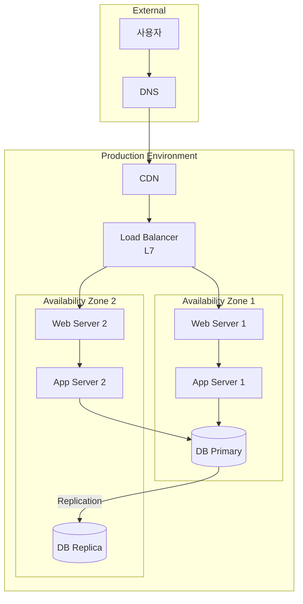

### 4.1 환경 구성

| 환경 | 용도 | 인프라 | URL |
|------|------|--------|-----|
| Local | 개발자 로컬 개발 | Docker Compose | localhost |
| Development | 개발 통합 테스트 | [클라우드/온프레미스] | dev.[도메인] |
| Staging | QA 및 UAT | [클라우드/온프레미스] | staging.[도메인] |
| Production | 운영 | [클라우드/온프레미스] | [도메인] |

---

## 5. 기술 스택 선정 및 근거

| 영역 | 기술 | 버전 | 선정 근거 |
|------|------|------|-----------|
| Frontend | [React/Vue/Next.js] | [버전] | [선정 근거] |
| Backend | [Spring Boot/Express/FastAPI] | [버전] | [선정 근거] |
| Database | [PostgreSQL/MySQL] | [버전] | [선정 근거] |
| Cache | [Redis] | [버전] | [선정 근거] |
| Message Queue | [RabbitMQ/Kafka] | [버전] | [선정 근거] |
| Search Engine | [Elasticsearch] | [버전] | [선정 근거] |
| Container | [Docker] | [버전] | [선정 근거] |
| Orchestration | [Kubernetes/ECS] | [버전] | [선정 근거] |
| CI/CD | [GitHub Actions/Jenkins] | - | [선정 근거] |
| Monitoring | [Prometheus + Grafana] | [버전] | [선정 근거] |
| Logging | [ELK Stack/CloudWatch] | [버전] | [선정 근거] |

---

## 6. 아키텍처 결정 기록 (ADR)

### ADR-001: [결정 제목]

| 항목 | 내용 |
|------|------|
| ID | ADR-001 |
| 날짜 | [YYYY-MM-DD] |
| 상태 | 제안됨 / 승인됨 / 폐기됨 / 대체됨 |
| 결정자 | [이름] |

**컨텍스트:**
[이 결정이 필요한 배경 및 상황 설명]

**결정:**
[내린 결정의 내용]

**대안:**
1. [대안 1] - [장점] / [단점]
2. [대안 2] - [장점] / [단점]
3. [대안 3] - [장점] / [단점]

**결과:**
[이 결정으로 인한 영향, 트레이드오프, 후속 조치]

---

### ADR-002: [결정 제목]

| 항목 | 내용 |
|------|------|
| ID | ADR-002 |
| 날짜 | [YYYY-MM-DD] |
| 상태 | 승인됨 |
| 결정자 | [이름] |

**컨텍스트:**
[배경 설명]

**결정:**
[결정 내용]

**대안:**
1. [대안 1] - [장단점]
2. [대안 2] - [장단점]

**결과:**
[영향 및 트레이드오프]

---

## 7. 비기능 요구사항 대응 설계

### 7.1 성능 대응 설계
- **캐싱 전략:** [조회 빈도 높은 데이터 Redis 캐싱, TTL: N분]
- **DB 최적화:** [읽기 전용 Replica 분리, 인덱스 전략]
- **비동기 처리:** [무거운 작업은 메시지 큐를 통한 비동기 처리]
- **CDN:** [정적 자산 CDN 제공]
- **Connection Pool:** [DB 커넥션 풀 최대 N개]

### 7.2 보안 대응 설계
- **인증:** [JWT 토큰 기반 인증, Access Token TTL: 15분, Refresh Token TTL: 7일]
- **인가:** [RBAC 모델, API Gateway 레벨 권한 검증]
- **암호화:** [전송 중 TLS 1.3, 저장 시 AES-256, 비밀번호 bcrypt]
- **API 보안:** [Rate Limiting, CORS 정책, Input Validation]
- **감사 로그:** [모든 CUD 작업 감사 로그 기록]

### 7.3 확장성 대응 설계
- **수평 확장:** [Stateless 서비스 설계, 로드 밸런서 통한 수평 스케일링]
- **데이터베이스:** [Read Replica, 필요 시 샤딩]
- **비동기 처리:** [Worker 인스턴스 독립 스케일링]
```

---

### 3.2 산출물: 데이터베이스 설계서

```markdown
# 데이터베이스 설계서

| 항목 | 내용 |
|------|------|
| 문서 ID | DBS-[프로젝트코드]-v1.0 |
| 프로젝트명 | [프로젝트명] |
| 작성일 | [YYYY-MM-DD] |
| DBMS | [PostgreSQL 15 / MySQL 8.x] |
| 버전 | 1.0 |

---

## 1. ER 다이어그램

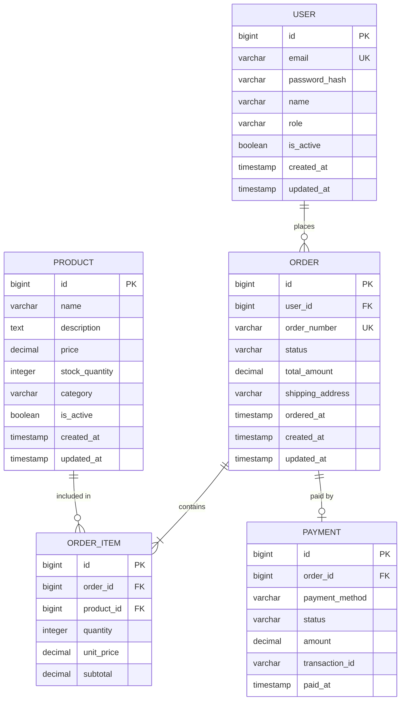

---

## 2. 테이블 명세서

### 2.1 USER 테이블

| 컬럼명 | 데이터 타입 | Nullable | 기본값 | 제약조건 | 설명 |
|--------|------------|----------|--------|----------|------|
| id | BIGINT | NO | AUTO_INCREMENT | PK | 사용자 고유 ID |
| email | VARCHAR(255) | NO | - | UNIQUE | 이메일 주소 |
| password_hash | VARCHAR(255) | NO | - | - | bcrypt 해시 비밀번호 |
| name | VARCHAR(100) | NO | - | - | 사용자 이름 |
| role | VARCHAR(20) | NO | 'USER' | CHECK (role IN ('USER','ADMIN')) | 사용자 역할 |
| is_active | BOOLEAN | NO | true | - | 활성 상태 |
| created_at | TIMESTAMP | NO | CURRENT_TIMESTAMP | - | 생성 일시 |
| updated_at | TIMESTAMP | NO | CURRENT_TIMESTAMP | ON UPDATE | 수정 일시 |

**인덱스:**

| 인덱스명 | 컬럼 | 유형 | 설명 |
|----------|------|------|------|
| PK_user | id | PRIMARY | 기본키 |
| UK_user_email | email | UNIQUE | 이메일 유일성 |
| IX_user_role | role | INDEX | 역할별 조회 |
| IX_user_created | created_at | INDEX | 생성일 기준 정렬 |

### 2.2 ORDER 테이블

| 컬럼명 | 데이터 타입 | Nullable | 기본값 | 제약조건 | 설명 |
|--------|------------|----------|--------|----------|------|
| id | BIGINT | NO | AUTO_INCREMENT | PK | 주문 고유 ID |
| user_id | BIGINT | NO | - | FK → USER(id) | 주문자 ID |
| order_number | VARCHAR(20) | NO | - | UNIQUE | 주문번호 |
| status | VARCHAR(20) | NO | 'PENDING' | CHECK | 주문 상태 |
| total_amount | DECIMAL(12,2) | NO | 0 | - | 총 금액 |
| shipping_address | TEXT | YES | - | - | 배송지 주소 |
| ordered_at | TIMESTAMP | YES | - | - | 주문 확정 일시 |
| created_at | TIMESTAMP | NO | CURRENT_TIMESTAMP | - | 생성 일시 |
| updated_at | TIMESTAMP | NO | CURRENT_TIMESTAMP | ON UPDATE | 수정 일시 |

**인덱스:**

| 인덱스명 | 컬럼 | 유형 | 설명 |
|----------|------|------|------|
| PK_order | id | PRIMARY | 기본키 |
| UK_order_number | order_number | UNIQUE | 주문번호 유일성 |
| FK_order_user | user_id | INDEX | 사용자별 주문 조회 |
| IX_order_status | status | INDEX | 상태별 조회 |
| IX_order_date | ordered_at | INDEX | 날짜별 조회 |

### 2.3 [추가 테이블 - 동일 형식으로 작성]

---

## 3. 데이터 사전 (Data Dictionary)

| 필드명 | 논리명 | 물리명 | 데이터 타입 | 도메인/허용값 | 설명 |
|--------|--------|--------|------------|---------------|------|
| 사용자 ID | 사용자 고유 식별자 | user.id | BIGINT | 양의 정수 | 자동 증가 |
| 이메일 | 사용자 이메일 주소 | user.email | VARCHAR(255) | 이메일 형식 | 로그인 ID로 사용 |
| 주문 상태 | 주문 처리 상태 | order.status | VARCHAR(20) | PENDING, CONFIRMED, SHIPPED, DELIVERED, CANCELLED | 주문 생명주기 상태 |
| 결제 상태 | 결제 처리 상태 | payment.status | VARCHAR(20) | PENDING, COMPLETED, FAILED, REFUNDED | 결제 트랜잭션 상태 |

---

## 4. 마이그레이션 전략

### 4.1 마이그레이션 도구
- 사용 도구: [Flyway / Liquibase / Alembic / Prisma Migrate]
- 명명 규칙: `V[버전]__[설명].sql` (예: `V1.0__create_user_table.sql`)

### 4.2 마이그레이션 정책
1. 모든 스키마 변경은 마이그레이션 스크립트를 통해 관리한다.
2. 롤백 스크립트를 반드시 함께 작성한다.
3. 데이터 마이그레이션과 스키마 마이그레이션을 분리한다.
4. 프로덕션 적용 전 Staging 환경에서 검증한다.

### 4.3 초기 마이그레이션 스크립트 예시

```sql
-- V1.0__create_initial_tables.sql
CREATE TABLE users (
    id BIGINT AUTO_INCREMENT PRIMARY KEY,
    email VARCHAR(255) NOT NULL UNIQUE,
    password_hash VARCHAR(255) NOT NULL,
    name VARCHAR(100) NOT NULL,
    role VARCHAR(20) NOT NULL DEFAULT 'USER',
    is_active BOOLEAN NOT NULL DEFAULT true,
    created_at TIMESTAMP NOT NULL DEFAULT CURRENT_TIMESTAMP,
    updated_at TIMESTAMP NOT NULL DEFAULT CURRENT_TIMESTAMP ON UPDATE CURRENT_TIMESTAMP,
    INDEX IX_user_role (role),
    INDEX IX_user_created (created_at)
);
```
```

---

### 3.3 산출물: API 설계서

```markdown
# API 설계서

| 항목 | 내용 |
|------|------|
| 문서 ID | API-[프로젝트코드]-v1.0 |
| 프로젝트명 | [프로젝트명] |
| Base URL | https://api.[도메인]/v1 |
| 인증 방식 | Bearer Token (JWT) |
| 작성일 | [YYYY-MM-DD] |
| 버전 | 1.0 |

---

## 1. API 공통 규격

### 1.1 인증 헤더
```
Authorization: Bearer {access_token}
Content-Type: application/json
Accept: application/json
```

### 1.2 공통 응답 형식

**성공 응답:**
```json
{
  "success": true,
  "data": { },
  "meta": {
    "page": 1,
    "size": 20,
    "totalCount": 100,
    "totalPages": 5
  }
}
```

**에러 응답:**
```json
{
  "success": false,
  "error": {
    "code": "VALIDATION_ERROR",
    "message": "입력값이 유효하지 않습니다.",
    "details": [
      {
        "field": "email",
        "message": "올바른 이메일 형식이 아닙니다."
      }
    ]
  }
}
```

### 1.3 공통 에러 코드

| HTTP 상태 | 에러 코드 | 설명 |
|-----------|-----------|------|
| 400 | VALIDATION_ERROR | 입력값 유효성 검증 실패 |
| 400 | BAD_REQUEST | 잘못된 요청 |
| 401 | UNAUTHORIZED | 인증 실패 또는 토큰 만료 |
| 403 | FORBIDDEN | 접근 권한 없음 |
| 404 | NOT_FOUND | 리소스를 찾을 수 없음 |
| 409 | CONFLICT | 리소스 충돌 (중복 등) |
| 429 | RATE_LIMIT_EXCEEDED | 요청 한도 초과 |
| 500 | INTERNAL_ERROR | 서버 내부 오류 |
| 503 | SERVICE_UNAVAILABLE | 서비스 일시 중단 |

### 1.4 페이지네이션

쿼리 파라미터: `?page=1&size=20&sort=createdAt,desc`

### 1.5 API 버저닝 전략
- URL Path 방식: `/v1/`, `/v2/`
- 하위 호환성이 깨지는 변경 시 메이저 버전 업
- 최소 2개 버전 동시 지원 (Deprecation 공지 후 6개월 유예)

---

## 2. 엔드포인트 목록

### 2.1 인증 (Auth)

| 메서드 | URL | 설명 | 인증 필요 |
|--------|-----|------|-----------|
| POST | /v1/auth/signup | 회원 가입 | N |
| POST | /v1/auth/login | 로그인 | N |
| POST | /v1/auth/refresh | 토큰 갱신 | Y (Refresh Token) |
| POST | /v1/auth/logout | 로그아웃 | Y |
| POST | /v1/auth/password/reset | 비밀번호 재설정 요청 | N |

### 2.2 사용자 (Users)

| 메서드 | URL | 설명 | 인증 필요 | 권한 |
|--------|-----|------|-----------|------|
| GET | /v1/users/me | 내 정보 조회 | Y | USER |
| PUT | /v1/users/me | 내 정보 수정 | Y | USER |
| GET | /v1/users | 사용자 목록 조회 | Y | ADMIN |
| GET | /v1/users/{id} | 사용자 상세 조회 | Y | ADMIN |
| PUT | /v1/users/{id} | 사용자 정보 수정 | Y | ADMIN |
| DELETE | /v1/users/{id} | 사용자 삭제 (비활성화) | Y | ADMIN |

### 2.3 주문 (Orders)

| 메서드 | URL | 설명 | 인증 필요 | 권한 |
|--------|-----|------|-----------|------|
| POST | /v1/orders | 주문 생성 | Y | USER |
| GET | /v1/orders | 주문 목록 조회 | Y | USER |
| GET | /v1/orders/{id} | 주문 상세 조회 | Y | USER |
| PUT | /v1/orders/{id}/cancel | 주문 취소 | Y | USER |
| GET | /v1/admin/orders | 전체 주문 관리 | Y | ADMIN |
| PUT | /v1/admin/orders/{id}/status | 주문 상태 변경 | Y | ADMIN |

### 2.4 상품 (Products)

| 메서드 | URL | 설명 | 인증 필요 | 권한 |
|--------|-----|------|-----------|------|
| GET | /v1/products | 상품 목록 조회 | N | - |
| GET | /v1/products/{id} | 상품 상세 조회 | N | - |
| POST | /v1/admin/products | 상품 등록 | Y | ADMIN |
| PUT | /v1/admin/products/{id} | 상품 수정 | Y | ADMIN |
| DELETE | /v1/admin/products/{id} | 상품 삭제 | Y | ADMIN |

---

## 3. API 상세 명세

### 3.1 POST /v1/auth/signup - 회원 가입

**요청:**
```json
{
  "email": "user@example.com",
  "password": "SecureP@ss123",
  "name": "홍길동"
}
```

| 필드 | 타입 | 필수 | 유효성 규칙 |
|------|------|------|-------------|
| email | string | Y | 이메일 형식, 최대 255자 |
| password | string | Y | 최소 8자, 대소문자+숫자+특수문자 포함 |
| name | string | Y | 최소 2자, 최대 100자 |

**응답 (201 Created):**
```json
{
  "success": true,
  "data": {
    "id": 1,
    "email": "user@example.com",
    "name": "홍길동",
    "role": "USER",
    "createdAt": "2025-01-15T09:00:00Z"
  }
}
```

**에러 응답:**
- 409 CONFLICT: 이미 등록된 이메일
- 400 VALIDATION_ERROR: 입력값 유효성 실패

### 3.2 POST /v1/auth/login - 로그인

**요청:**
```json
{
  "email": "user@example.com",
  "password": "SecureP@ss123"
}
```

**응답 (200 OK):**
```json
{
  "success": true,
  "data": {
    "accessToken": "eyJhbGciOi...",
    "refreshToken": "eyJhbGciOi...",
    "tokenType": "Bearer",
    "expiresIn": 900,
    "user": {
      "id": 1,
      "email": "user@example.com",
      "name": "홍길동",
      "role": "USER"
    }
  }
}
```

### 3.3 POST /v1/orders - 주문 생성

**요청:**
```json
{
  "items": [
    {
      "productId": 101,
      "quantity": 2
    },
    {
      "productId": 205,
      "quantity": 1
    }
  ],
  "shippingAddress": {
    "zipCode": "06236",
    "address1": "서울특별시 강남구 테헤란로 123",
    "address2": "4층 401호",
    "recipientName": "홍길동",
    "phone": "010-1234-5678"
  },
  "paymentMethod": "CARD"
}
```

**응답 (201 Created):**
```json
{
  "success": true,
  "data": {
    "id": 1001,
    "orderNumber": "ORD-20250115-0001",
    "status": "PENDING",
    "items": [
      {
        "productId": 101,
        "productName": "상품 A",
        "quantity": 2,
        "unitPrice": 15000,
        "subtotal": 30000
      }
    ],
    "totalAmount": 45000,
    "orderedAt": "2025-01-15T09:30:00Z"
  }
}
```

---

## 4. OpenAPI(Swagger) 스펙 예시

```yaml
openapi: 3.0.3
info:
  title: "[프로젝트명] API"
  version: "1.0.0"
  description: "[프로젝트] REST API 명세"
servers:
  - url: https://api.[도메인]/v1
    description: Production
  - url: https://api.staging.[도메인]/v1
    description: Staging

paths:
  /auth/login:
    post:
      tags: [Auth]
      summary: 로그인
      requestBody:
        required: true
        content:
          application/json:
            schema:
              type: object
              required: [email, password]
              properties:
                email:
                  type: string
                  format: email
                password:
                  type: string
                  minLength: 8
      responses:
        '200':
          description: 로그인 성공
        '401':
          description: 인증 실패

  /users/me:
    get:
      tags: [Users]
      summary: 내 정보 조회
      security:
        - bearerAuth: []
      responses:
        '200':
          description: 성공

components:
  securitySchemes:
    bearerAuth:
      type: http
      scheme: bearer
      bearerFormat: JWT
```
```

---

### 3.4 산출물: UI/UX 설계서

```markdown
# UI/UX 설계서

| 항목 | 내용 |
|------|------|
| 문서 ID | UIX-[프로젝트코드]-v1.0 |
| 프로젝트명 | [프로젝트명] |
| 작성일 | [YYYY-MM-DD] |
| 디자인 시스템 | [Material Design / 자체 디자인 시스템] |
| 버전 | 1.0 |

---

## 1. 디자인 원칙
1. **일관성:** 동일한 UI 패턴과 컴포넌트를 일관되게 사용한다.
2. **접근성:** WCAG 2.1 AA 기준을 준수한다.
3. **반응형:** 모바일, 태블릿, 데스크톱 환경을 모두 지원한다.
4. **사용자 중심:** 최소한의 클릭으로 작업을 완료할 수 있도록 설계한다.

---

## 2. 화면 흐름도

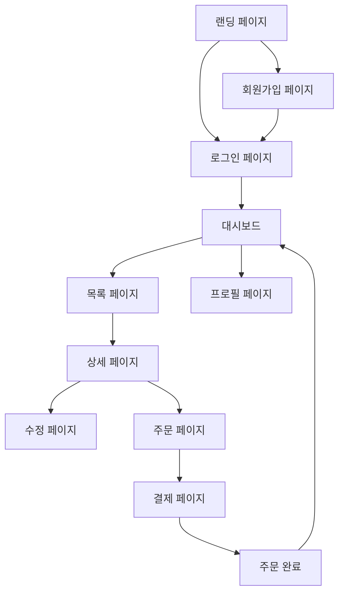

---

## 3. 화면 명세서

### SCR-001: [화면명]

| 항목 | 내용 |
|------|------|
| 화면 ID | SCR-001 |
| 화면명 | [화면명] |
| URL | /[경로] |
| 접근 권한 | [비인증 / USER / ADMIN] |
| 관련 유스케이스 | UC-001 |

**화면 레이아웃 설명:**
[화면의 구성 요소와 배치를 텍스트로 설명]

```
+---------------------------------------------------+
|  [Header: 로고 | 네비게이션 | 사용자 메뉴]         |
+---------------------------------------------------+
|  [Sidebar]  |  [Main Content Area]                 |
|             |                                       |
|  - 메뉴1    |  [제목]                               |
|  - 메뉴2    |  [검색/필터 영역]                      |
|  - 메뉴3    |  [데이터 테이블 / 카드 리스트]          |
|             |  [페이지네이션]                        |
+---------------------------------------------------+
|  [Footer: 저작권 | 링크]                            |
+---------------------------------------------------+
```

**컴포넌트 목록:**

| 컴포넌트 | 타입 | 설명 | 이벤트 |
|----------|------|------|--------|
| 검색 입력 | TextInput | 키워드 검색 | onChange → 디바운스 검색 |
| 필터 드롭다운 | Select | 카테고리 필터 | onChange → 목록 필터링 |
| 데이터 테이블 | Table | 결과 목록 표시 | 행 클릭 → 상세 페이지 이동 |
| 생성 버튼 | Button (Primary) | 새 항목 생성 | onClick → 생성 모달/페이지 |
| 페이지네이션 | Pagination | 페이지 이동 | onClick → 해당 페이지 데이터 로드 |

**API 연동:**

| 동작 | API | 시점 |
|------|-----|------|
| 목록 조회 | GET /v1/[리소스] | 페이지 로드 시 |
| 검색 | GET /v1/[리소스]?keyword= | 검색 입력 시 (디바운스 300ms) |
| 삭제 | DELETE /v1/[리소스]/{id} | 삭제 버튼 클릭 후 확인 |

**상태 관리:**

| 상태 | 타입 | 초기값 | 설명 |
|------|------|--------|------|
| items | Array | [] | 목록 데이터 |
| loading | Boolean | false | 로딩 상태 |
| error | String | null | 에러 메시지 |
| pagination | Object | {page:1, size:20} | 페이지네이션 상태 |
| filters | Object | {} | 필터 조건 |

### SCR-002: [추가 화면 - 동일 형식으로 작성]
```

---

## 4. Phase 3: 상세 설계 (Detailed Design)

이 단계에서는 시스템 설계를 구현 가능한 수준까지 구체화한다. 클래스 설계, 시퀀스 다이어그램, 상태 다이어그램, 모듈별 상세 설계를 수행한다.

**이 단계의 핵심 활동:**
- 클래스 다이어그램 작성
- 시퀀스 다이어그램 작성 (주요 유스케이스별)
- 상태 다이어그램 작성 (주요 엔티티별)
- 모듈별 상세 설계
- 코딩 표준 수립
- 상세 설계 리뷰

### 4.1 산출물: 상세 설계서

```markdown
# 상세 설계서

| 항목 | 내용 |
|------|------|
| 문서 ID | DDS-[프로젝트코드]-v1.0 |
| 프로젝트명 | [프로젝트명] |
| 작성일 | [YYYY-MM-DD] |
| 버전 | 1.0 |

---

## 1. 클래스 다이어그램

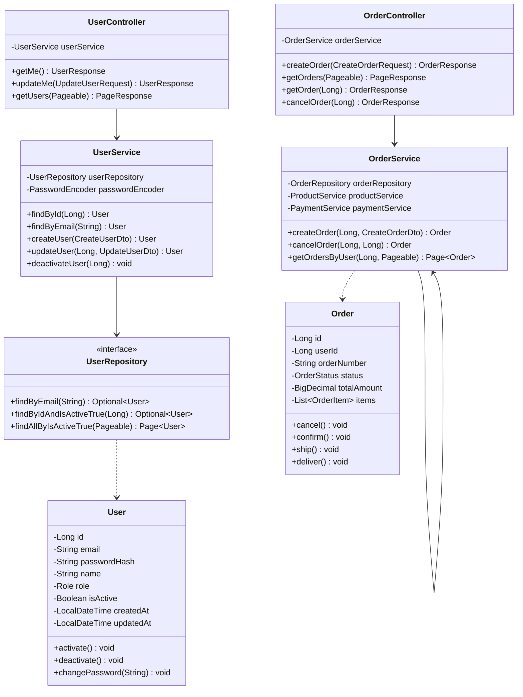

---

## 2. 시퀀스 다이어그램

### 2.1 UC-002: 로그인 시퀀스

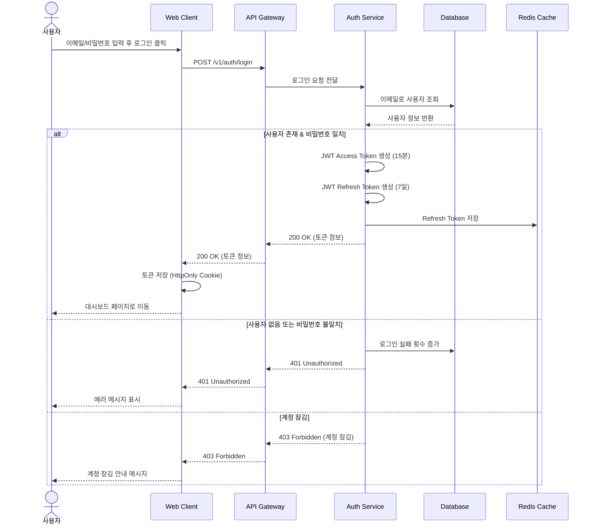

### 2.2 UC-003: 주문 생성 시퀀스

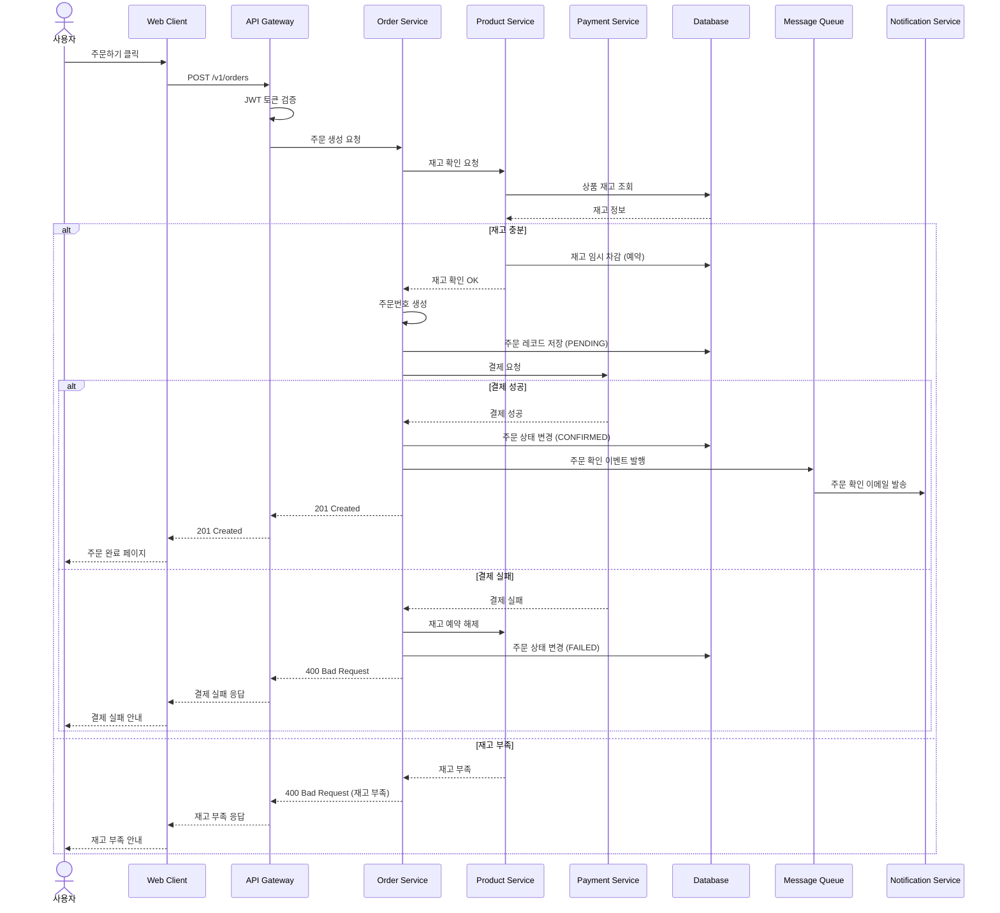

---

## 3. 상태 다이어그램

### 3.1 주문(Order) 상태 다이어그램

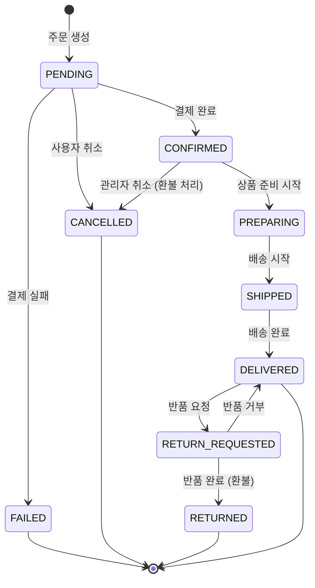

### 3.2 사용자(User) 상태 다이어그램

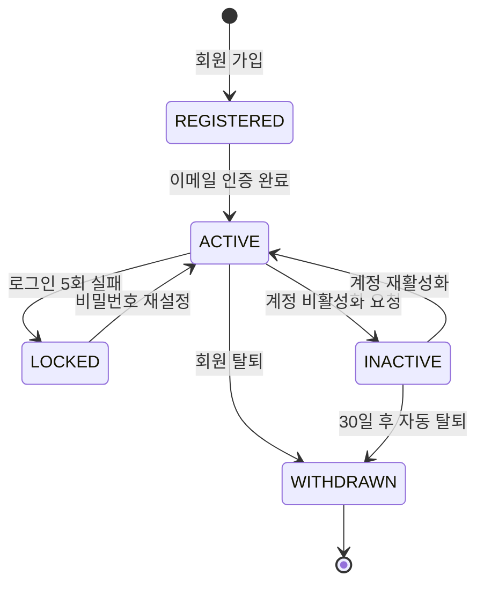

---

## 4. 모듈 상세 설계

### MOD-001: [모듈명]

| 항목 | 내용 |
|------|------|
| 모듈 ID | MOD-001 |
| 모듈명 | [모듈명 (예: 인증 모듈)] |
| 책임 | [이 모듈이 담당하는 기능 설명] |
| 패키지/디렉토리 | [src/modules/auth] |

**인터페이스:**

| 메서드 | 입력 | 출력 | 설명 |
|--------|------|------|------|
| login(email, password) | LoginDto | TokenResponse | 사용자 인증 및 토큰 발급 |
| signup(userData) | SignupDto | UserResponse | 회원 가입 처리 |
| refreshToken(token) | String | TokenResponse | 토큰 갱신 |
| logout(userId) | Long | void | 세션 무효화 |

**의존성:**

| 의존 대상 | 유형 | 설명 |
|-----------|------|------|
| UserRepository | 직접 | 사용자 데이터 조회/저장 |
| PasswordEncoder | 직접 | 비밀번호 해싱/검증 |
| JwtProvider | 직접 | JWT 토큰 생성/검증 |
| RedisTemplate | 직접 | Refresh Token 저장 |
| EventPublisher | 간접 | 회원 가입 이벤트 발행 |

**주요 알고리즘/로직:**

1. **로그인 처리:**
   - 이메일로 사용자 조회 (없으면 401)
   - 계정 잠김 여부 확인 (잠김이면 403)
   - 비밀번호 검증 (불일치 시 실패 횟수 증가, 5회 초과 시 계정 잠금)
   - Access Token (15분) + Refresh Token (7일) 생성
   - Refresh Token을 Redis에 저장
   - 마지막 로그인 시간 업데이트

2. **토큰 갱신:**
   - Refresh Token 유효성 검증
   - Redis에 저장된 토큰과 비교
   - 새 Access Token 발급
   - Refresh Token Rotation (선택적)

### MOD-002: [추가 모듈 - 동일 형식]

---

## 5. 디자인 패턴 적용 기록

| 패턴 | 적용 위치 | 목적 | 설명 |
|------|-----------|------|------|
| Repository Pattern | Data Layer | 데이터 접근 추상화 | DB 접근 로직을 Repository 인터페이스로 추상화 |
| Strategy Pattern | 결제 모듈 | 결제 수단 다형성 | 카드/계좌이체/간편결제를 Strategy로 구현 |
| Observer Pattern | 이벤트 처리 | 느슨한 결합 | 주문/결제 이벤트를 Observer 패턴으로 전파 |
| Factory Pattern | DTO 변환 | 객체 생성 분리 | Entity ↔ DTO 변환을 Factory에 위임 |
| Builder Pattern | 복잡한 객체 | 가독성 향상 | 검색 쿼리, 알림 메시지 등 복잡한 객체 생성 |
| Circuit Breaker | 외부 연동 | 장애 격리 | 외부 API 호출 시 Circuit Breaker 적용 |
```

---

### 4.2 산출물: 코딩 표준 문서

```markdown
# 코딩 표준 문서

| 항목 | 내용 |
|------|------|
| 문서 ID | CDS-[프로젝트코드]-v1.0 |
| 프로젝트명 | [프로젝트명] |
| 주 언어 | [Java/TypeScript/Python/Go] |
| 작성일 | [YYYY-MM-DD] |

---

## 1. 네이밍 컨벤션

### 1.1 공통 규칙

| 대상 | 규칙 | 예시 |
|------|------|------|
| 패키지/디렉토리 | kebab-case 또는 lowercase | `user-service`, `auth` |
| 클래스/인터페이스 | PascalCase | `UserService`, `OrderRepository` |
| 메서드/함수 | camelCase | `getUserById`, `createOrder` |
| 변수 | camelCase | `userName`, `orderCount` |
| 상수 | UPPER_SNAKE_CASE | `MAX_RETRY_COUNT`, `DEFAULT_PAGE_SIZE` |
| 데이터베이스 테이블 | snake_case (복수형) | `users`, `order_items` |
| 데이터베이스 컬럼 | snake_case | `created_at`, `user_id` |
| API URL | kebab-case (복수형) | `/api/v1/order-items` |
| 환경변수 | UPPER_SNAKE_CASE | `DATABASE_URL`, `JWT_SECRET` |

### 1.2 의미있는 네이밍
- Boolean 변수: `is`, `has`, `can`, `should` 접두사 사용 (`isActive`, `hasPermission`)
- 컬렉션 변수: 복수형 사용 (`users`, `orderItems`)
- 약어 사용 금지 (예외: `id`, `url`, `api` 등 널리 통용되는 약어)

---

## 2. 코드 구조 패턴

### 2.1 디렉토리 구조 (레이어드 아키텍처)
```
src/
  controller/          # API 엔드포인트 (요청/응답 처리)
  service/             # 비즈니스 로직
  repository/          # 데이터 접근
  domain/              # 도메인 모델 (Entity)
  dto/                 # Data Transfer Objects
    request/           # 요청 DTO
    response/          # 응답 DTO
  config/              # 설정 파일
  exception/           # 커스텀 예외
  util/                # 유틸리티 클래스
  middleware/          # 미들웨어 (인증, 로깅 등)
```

### 2.2 파일 하나당 하나의 클래스/컴포넌트
### 2.3 함수 길이 제한: 한 함수는 최대 30줄 이내 권장
### 2.4 파일 길이 제한: 한 파일은 최대 300줄 이내 권장

---

## 3. 에러 핸들링 표준

### 3.1 예외 계층 구조
```
ApplicationException (base)
  ├── BusinessException (비즈니스 로직 오류)
  │   ├── EntityNotFoundException (리소스 미발견)
  │   ├── DuplicateEntityException (중복 리소스)
  │   └── InvalidStateException (잘못된 상태 전이)
  ├── AuthenticationException (인증 오류)
  ├── AuthorizationException (인가 오류)
  └── ExternalServiceException (외부 서비스 오류)
```

### 3.2 에러 핸들링 규칙
1. 예외는 발생 즉시 적절한 레이어에서 처리한다.
2. 전역 예외 핸들러(GlobalExceptionHandler)에서 표준 에러 응답으로 변환한다.
3. 외부 라이브러리 예외는 커스텀 예외로 래핑한다.
4. 예외 메시지는 사용자 친화적 메시지와 기술적 메시지를 분리한다.
5. 500 에러는 반드시 로그에 스택 트레이스를 기록한다.

---

## 4. 로깅 표준

### 4.1 로그 레벨 사용 기준

| 레벨 | 용도 | 예시 |
|------|------|------|
| ERROR | 즉각적인 조치가 필요한 오류 | DB 연결 실패, 외부 API 장애 |
| WARN | 잠재적 문제, 비정상 상황 | 재시도 발생, 느린 쿼리 감지 |
| INFO | 주요 비즈니스 이벤트 | 주문 생성, 결제 완료, 사용자 가입 |
| DEBUG | 개발/디버깅용 상세 정보 | 메서드 파라미터, 중간 계산 결과 |

### 4.2 로그 포맷
```
[timestamp] [level] [traceId] [spanId] [service] [class.method] - message
```

### 4.3 로깅 규칙
1. 개인정보(PII)는 마스킹 처리한다. (이메일: `u***@example.com`)
2. 비밀번호, 토큰 등 민감 정보는 로그에 절대 기록하지 않는다.
3. 모든 API 요청/응답은 INFO 레벨로 기록한다.
4. 외부 시스템 호출은 요청/응답/소요시간을 기록한다.

---

## 5. 코드 리뷰 체크리스트

- [ ] 네이밍 컨벤션을 준수했는가?
- [ ] 비즈니스 로직이 Service 레이어에 위치하는가?
- [ ] 입력값 유효성 검증이 되어 있는가?
- [ ] 적절한 예외 처리가 되어 있는가?
- [ ] 민감 정보가 로그에 기록되지 않는가?
- [ ] SQL Injection, XSS 등 보안 취약점이 없는가?
- [ ] 단위 테스트가 작성되었는가?
- [ ] 불필요한 코드/주석이 없는가?
- [ ] 성능에 문제가 될 수 있는 코드가 없는가? (N+1 쿼리 등)
- [ ] API 응답 형식이 공통 규격을 따르는가?
```

---

## 5. Phase 4: 구현 (Implementation)

이 단계에서는 설계 문서를 기반으로 실제 소스 코드를 작성한다. 소스 코드 관리, 빌드/배포 설정, 개발 진행 보고를 포함한다.

**이 단계의 핵심 활동:**
- 소스 코드 작성
- 단위 테스트 작성
- 코드 리뷰
- CI/CD 파이프라인 구성
- 개발 진행 관리

### 5.1 산출물: 소스 코드 관리 계획

```markdown
# 소스 코드 관리 계획

| 항목 | 내용 |
|------|------|
| 문서 ID | SCM-[프로젝트코드]-v1.0 |
| 프로젝트명 | [프로젝트명] |
| VCS | Git |
| 저장소 | [GitHub/GitLab/Bitbucket URL] |
| 작성일 | [YYYY-MM-DD] |

---

## 1. Git 브랜칭 전략 (Git Flow)

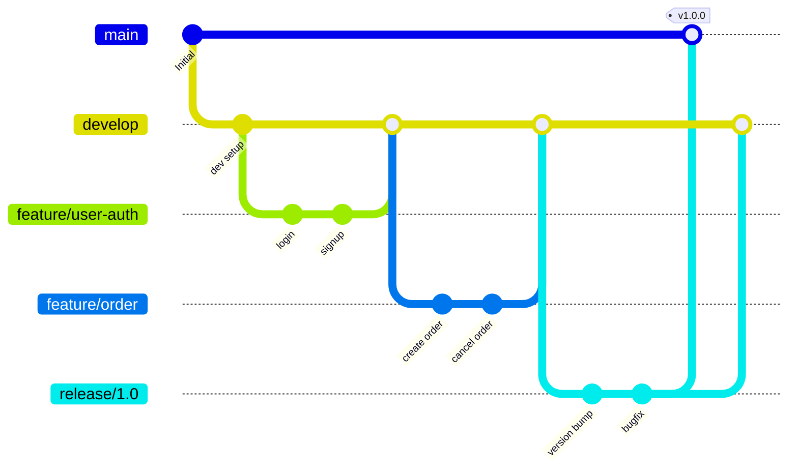

### 브랜치 규칙

| 브랜치 | 용도 | 네이밍 규칙 | 생성 기반 | 병합 대상 |
|--------|------|-------------|-----------|-----------|
| main | 프로덕션 릴리스 | `main` | - | - |
| develop | 개발 통합 | `develop` | main | - |
| feature | 기능 개발 | `feature/[기능명]` | develop | develop |
| release | 릴리스 준비 | `release/[버전]` | develop | main, develop |
| hotfix | 긴급 수정 | `hotfix/[이슈번호]` | main | main, develop |
| bugfix | 버그 수정 | `bugfix/[이슈번호]` | develop | develop |

---

## 2. 커밋 메시지 컨벤션 (Conventional Commits)

### 형식:
```
<type>(<scope>): <subject>

<body>

<footer>
```

### Type:

| Type | 설명 | 예시 |
|------|------|------|
| feat | 새로운 기능 | `feat(auth): 소셜 로그인 기능 추가` |
| fix | 버그 수정 | `fix(order): 주문 금액 계산 오류 수정` |
| docs | 문서 변경 | `docs(readme): 설치 가이드 업데이트` |
| style | 코드 포맷팅 (기능 변경 없음) | `style: 코드 포맷팅 적용` |
| refactor | 리팩토링 | `refactor(user): 인증 로직 분리` |
| test | 테스트 추가/수정 | `test(order): 주문 생성 단위 테스트 추가` |
| chore | 빌드, 설정 변경 | `chore: ESLint 규칙 업데이트` |
| perf | 성능 개선 | `perf(query): 주문 목록 조회 쿼리 최적화` |

---

## 3. PR/MR 템플릿

```markdown
## 변경 사항
- [변경 내용 1]
- [변경 내용 2]

## 변경 유형
- [ ] 새 기능 (feat)
- [ ] 버그 수정 (fix)
- [ ] 리팩토링 (refactor)
- [ ] 문서 변경 (docs)
- [ ] 기타

## 관련 이슈
- Closes #[이슈번호]

## 테스트
- [ ] 단위 테스트 추가/수정
- [ ] 통합 테스트 추가/수정
- [ ] 수동 테스트 완료

## 체크리스트
- [ ] 코딩 표준 준수
- [ ] 셀프 리뷰 완료
- [ ] 민감 정보 포함 없음
- [ ] 문서 업데이트 (필요시)
```

---

## 4. 코드 리뷰 프로세스
1. 개발자가 feature 브랜치에서 PR 생성
2. 최소 1명의 리뷰어 지정 (핵심 모듈은 2명)
3. CI 파이프라인 통과 확인
4. 리뷰어가 코드 리뷰 수행 (코드 리뷰 체크리스트 기반)
5. 리뷰 의견 반영 후 재요청
6. Approve 후 Squash Merge

---

## 5. CI 파이프라인 구성

| 단계 | 작업 | 도구 | 실패 시 |
|------|------|------|---------|
| Lint | 코드 스타일 검사 | ESLint/Checkstyle | PR 차단 |
| Build | 빌드 | Gradle/npm | PR 차단 |
| Unit Test | 단위 테스트 실행 | JUnit/Jest | PR 차단 |
| Integration Test | 통합 테스트 실행 | TestContainers | PR 차단 |
| Security Scan | 보안 취약점 스캔 | Snyk/OWASP | 경고 |
| Coverage | 코드 커버리지 측정 | JaCoCo/Istanbul | 80% 미만 시 차단 |
| Build Image | Docker 이미지 빌드 | Docker | 배포 차단 |
| Deploy | 환경별 배포 | ArgoCD/GitHub Actions | 롤백 |
```

---

### 5.2 산출물: 빌드/배포 설정 문서

```markdown
# 빌드/배포 설정 문서

| 항목 | 내용 |
|------|------|
| 문서 ID | BLD-[프로젝트코드]-v1.0 |
| 프로젝트명 | [프로젝트명] |
| 작성일 | [YYYY-MM-DD] |

---

## 1. 빌드 스크립트 구성

| 명령어 | 용도 | 설명 |
|--------|------|------|
| `[npm run build / ./gradlew build]` | 프로덕션 빌드 | 최적화된 빌드 산출물 생성 |
| `[npm run dev / ./gradlew bootRun]` | 개발 서버 실행 | 핫 리로드 활성화 |
| `[npm test / ./gradlew test]` | 테스트 실행 | 전체 테스트 스위트 실행 |
| `[npm run lint / ./gradlew check]` | 린트 검사 | 코드 스타일 검사 |

## 2. 환경별 설정 관리

| 환경 | 설정 파일 | DB | 로그 레벨 |
|------|-----------|-----|-----------|
| local | `.env.local` | H2/SQLite | DEBUG |
| development | `.env.dev` | [Dev DB] | DEBUG |
| staging | `.env.staging` | [Staging DB] | INFO |
| production | `.env.prod` | [Prod DB] | WARN |

**환경변수 관리 원칙:**
- 민감 정보는 환경변수 또는 Secret Manager로 관리
- `.env` 파일은 `.gitignore`에 등록
- `.env.example` 파일로 필요한 환경변수 목록 공유

## 3. Docker 설정

```dockerfile
# Dockerfile 예시
FROM [base-image]:[version] AS builder
WORKDIR /app
COPY . .
RUN [build-command]

FROM [runtime-image]:[version]
WORKDIR /app
COPY --from=builder /app/[build-output] .
EXPOSE [port]
CMD ["[start-command]"]
```

```yaml
# docker-compose.yml 예시 (로컬 개발용)
version: '3.8'
services:
  app:
    build: .
    ports:
      - "[호스트포트]:[컨테이너포트]"
    environment:
      - DATABASE_URL=[DB URL]
    depends_on:
      - db
      - redis

  db:
    image: [db-image]:[version]
    ports:
      - "5432:5432"
    volumes:
      - db-data:/var/lib/postgresql/data

  redis:
    image: redis:7-alpine
    ports:
      - "6379:6379"

volumes:
  db-data:
```

## 4. 인프라 코드 (IaC) 가이드
- **도구:** [Terraform / AWS CDK / Pulumi]
- **코드 위치:** `infrastructure/` 디렉토리
- **환경 분리:** 환경별 tfvars/스택 분리
- **상태 관리:** Remote State (S3 + DynamoDB 등)
```

---

### 5.3 산출물: 개발 진행 보고서 템플릿

```markdown
# 개발 진행 보고서

| 항목 | 내용 |
|------|------|
| 보고 기간 | [YYYY-MM-DD] ~ [YYYY-MM-DD] |
| 작성자 | [이름] |
| 작성일 | [YYYY-MM-DD] |

## 1. 진행 상황 요약

| 구분 | 계획 | 완료 | 진행률 |
|------|------|------|--------|
| 전체 기능 | [N]건 | [N]건 | [N%] |
| 이번 주 목표 | [N]건 | [N]건 | [N%] |

## 2. 완료 항목

| 항목 | 담당자 | 완료일 | 비고 |
|------|--------|--------|------|
| [완료 항목 1] | [이름] | [날짜] | |
| [완료 항목 2] | [이름] | [날짜] | |

## 3. 진행 중 항목

| 항목 | 담당자 | 예상 완료일 | 진행률 | 이슈 |
|------|--------|------------|--------|------|
| [진행 항목 1] | [이름] | [날짜] | [N%] | [이슈 있으면 기술] |

## 4. 이슈 및 위험

| ID | 이슈/위험 | 영향도 | 대응 방안 | 상태 |
|----|-----------|--------|-----------|------|
| ISS-001 | [이슈 설명] | 상/중/하 | [대응 방안] | 진행중/해결 |

## 5. 다음 주 계획

| 항목 | 담당자 | 목표 |
|------|--------|------|
| [계획 항목 1] | [이름] | [목표] |
| [계획 항목 2] | [이름] | [목표] |
```

---

## 6. Phase 5: 테스트 (Testing)

이 단계에서는 구현된 소프트웨어가 요구사항을 충족하는지 체계적으로 검증한다. 테스트 계획 수립부터 테스트 실행, 결과 보고까지 포함한다.

**이 단계의 핵심 활동:**
- 테스트 계획 수립
- 테스트 케이스 작성
- 테스트 환경 구축
- 테스트 실행 (단위/통합/시스템/UAT)
- 결함 보고 및 추적
- 테스트 결과 보고

### 6.1 산출물: 테스트 계획서 (Test Plan)

```markdown
# 테스트 계획서

| 항목 | 내용 |
|------|------|
| 문서 ID | TPL-[프로젝트코드]-v1.0 |
| 프로젝트명 | [프로젝트명] |
| 작성자 | [작성자명] |
| 작성일 | [YYYY-MM-DD] |
| 승인자 | [승인자명] |
| 버전 | 1.0 |

---

## 1. 테스트 범위

### 1.1 In-Scope (테스트 범위 내)

| 영역 | 설명 | 테스트 유형 |
|------|------|-------------|
| 사용자 인증 | 회원가입, 로그인, 로그아웃, 토큰 갱신 | 단위, 통합, E2E |
| 주문 관리 | 주문 생성, 조회, 취소 | 단위, 통합, E2E |
| 결제 처리 | 결제 요청, 결과 처리, 환불 | 통합, E2E |
| 관리자 기능 | 사용자 관리, 주문 관리, 통계 | 단위, 통합 |
| API 성능 | 응답 시간, 동시 처리 | 성능 |
| 보안 | 인증/인가, 입력 검증, 암호화 | 보안 |

### 1.2 Out-of-Scope (테스트 범위 외)

| 영역 | 제외 사유 |
|------|-----------|
| [영역 1] | [사유] |
| [영역 2] | [사유] |

---

## 2. 테스트 전략

### 2.1 테스트 유형별 전략

| 테스트 유형 | 목적 | 도구 | 담당 | 커버리지 목표 |
|-------------|------|------|------|---------------|
| 단위 테스트 (Unit) | 개별 함수/메서드 검증 | [JUnit/Jest/pytest] | 개발팀 | 80% 이상 |
| 통합 테스트 (Integration) | 모듈 간 연동 검증 | [TestContainers/Supertest] | 개발팀 | 주요 흐름 100% |
| 시스템 테스트 (System) | 전체 시스템 기능 검증 | [Selenium/Cypress/Playwright] | QA팀 | 전체 기능 |
| UAT (User Acceptance) | 사용자 관점 검증 | 수동 테스트 | 고객/PO | 핵심 시나리오 |
| 성능 테스트 (Performance) | 성능 요구사항 검증 | [JMeter/k6/Locust] | QA팀 | NFR-P 항목 |
| 보안 테스트 (Security) | 보안 취약점 검증 | [OWASP ZAP/Burp Suite] | 보안팀 | OWASP Top 10 |

### 2.2 테스트 피라미드

```
         /\
        /  \        E2E 테스트 (소수, 핵심 시나리오)
       /    \
      /------\
     /        \     통합 테스트 (중간)
    /          \
   /------------\
  /              \   단위 테스트 (다수, 빠른 피드백)
 /________________\
```

---

## 3. 테스트 환경 구성

| 환경 | 용도 | 인프라 | 데이터 |
|------|------|--------|--------|
| 로컬 테스트 | 단위/통합 테스트 | Docker Compose | 테스트 픽스처 |
| QA 환경 | 시스템 테스트 | [환경 상세] | 테스트 데이터셋 |
| Staging | UAT, 성능 테스트 | 프로덕션 미러링 | 익명화된 실제 데이터 |

---

## 4. 테스트 데이터 준비

### 4.1 데이터 준비 전략
- **단위 테스트:** 테스트 코드 내 목(Mock) 데이터 사용
- **통합 테스트:** 테스트 픽스처(seed 데이터) 사용, 테스트 후 롤백
- **시스템 테스트:** 별도 테스트 데이터셋 준비
- **성능 테스트:** 실제 규모의 데이터 생성 (데이터 생성기 활용)

### 4.2 테스트 계정

| 역할 | 이메일 | 비밀번호 | 용도 |
|------|--------|----------|------|
| 일반 사용자 | test.user@test.com | [테스트용] | 기본 기능 테스트 |
| 관리자 | test.admin@test.com | [테스트용] | 관리자 기능 테스트 |

---

## 5. 진입/종료 기준

### 5.1 진입 기준 (Entry Criteria)
- [ ] 코드 프리즈 완료
- [ ] 단위 테스트 통과율 100%
- [ ] 코드 리뷰 완료
- [ ] 테스트 환경 구축 완료
- [ ] 테스트 데이터 준비 완료
- [ ] 테스트 케이스 리뷰 완료

### 5.2 종료 기준 (Exit Criteria)
- [ ] 전체 테스트 케이스 실행률 100%
- [ ] 테스트 케이스 통과율 95% 이상
- [ ] 심각도 Critical/High 결함 0건
- [ ] 심각도 Medium 결함 해결률 90% 이상
- [ ] 성능 테스트 목표 달성
- [ ] 보안 테스트 취약점 0건 (Critical/High)
- [ ] UAT 승인 완료

---

## 6. 일정 및 리소스

| 단계 | 시작일 | 종료일 | 담당자 | 산출물 |
|------|--------|--------|--------|--------|
| 테스트 계획 | [날짜] | [날짜] | [이름] | 테스트 계획서 |
| 테스트 케이스 작성 | [날짜] | [날짜] | [이름] | 테스트 케이스 문서 |
| 단위/통합 테스트 | [날짜] | [날짜] | [이름] | 테스트 결과 |
| 시스템 테스트 | [날짜] | [날짜] | [이름] | 테스트 결과 보고서 |
| 성능 테스트 | [날짜] | [날짜] | [이름] | 성능 테스트 보고서 |
| UAT | [날짜] | [날짜] | [이름] | UAT 승인서 |
| 결함 수정 및 회귀 | [날짜] | [날짜] | [이름] | 최종 보고서 |

---

## 7. 위험 및 대응

| 위험 | 발생 확률 | 영향도 | 대응 방안 |
|------|-----------|--------|-----------|
| 테스트 환경 구축 지연 | 중 | 상 | Docker 기반 로컬 테스트 환경 대체 |
| 결함 수정 지연 | 상 | 상 | 우선순위 기반 결함 처리, 일일 트리아지 |
| 성능 목표 미달 | 중 | 상 | 조기 성능 테스트, 최적화 버퍼 기간 |
| UAT 피드백 대량 발생 | 중 | 중 | 사전 데모를 통한 기대치 조율 |
```

---

### 6.2 산출물: 테스트 케이스 문서

```markdown
# 테스트 케이스 문서

| 항목 | 내용 |
|------|------|
| 문서 ID | TCS-[프로젝트코드]-v1.0 |
| 프로젝트명 | [프로젝트명] |
| 작성일 | [YYYY-MM-DD] |
| 버전 | 1.0 |

---

## 테스트 시나리오 vs 테스트 케이스

| 구분 | 테스트 시나리오 | 테스트 케이스 |
|------|----------------|---------------|
| 수준 | 고수준 (What to test) | 상세 수준 (How to test) |
| 내용 | 테스트 목적과 범위 | 구체적 단계, 데이터, 기대 결과 |
| 예시 | "로그인 기능 검증" | "유효한 이메일/비밀번호로 로그인 시 토큰 반환 확인" |

---

## 기능 테스트 케이스

### TS-001: 사용자 인증 테스트 시나리오

#### TC-001: 정상 로그인

| 항목 | 내용 |
|------|------|
| TC ID | TC-001 |
| 테스트 항목 | 유효한 자격 증명으로 로그인 |
| 관련 요구사항 | FR-002 |
| 우선순위 | 상 |
| 테스트 유형 | 기능 |

**사전 조건:**
1. 테스트 계정이 등록되어 있다 (email: test@example.com)
2. 로그인 페이지에 접근 가능하다

**테스트 단계:**

| 단계 | 행위 | 입력 데이터 | 기대 결과 |
|------|------|-------------|-----------|
| 1 | 로그인 페이지 접근 | URL: /login | 로그인 폼이 표시됨 |
| 2 | 이메일 입력 | test@example.com | 이메일 필드에 값 입력됨 |
| 3 | 비밀번호 입력 | ValidP@ss123 | 비밀번호 필드에 마스킹되어 입력됨 |
| 4 | 로그인 버튼 클릭 | - | 대시보드 페이지로 이동됨 |

**기대 결과:**
- HTTP 응답 코드: 200
- Access Token이 발급됨
- 대시보드 페이지로 리다이렉트됨
- 사용자 이름이 헤더에 표시됨

| 실제 결과 | 상태 | 실행일 | 실행자 |
|-----------|------|--------|--------|
| [실행 후 기록] | Pass/Fail/Blocked | [날짜] | [이름] |

---

#### TC-002: 잘못된 비밀번호로 로그인 시도

| 항목 | 내용 |
|------|------|
| TC ID | TC-002 |
| 테스트 항목 | 잘못된 비밀번호로 로그인 시 에러 처리 |
| 관련 요구사항 | FR-002 |
| 우선순위 | 상 |
| 테스트 유형 | 부정(Negative) |

**사전 조건:**
1. 유효한 테스트 계정이 존재한다

**테스트 단계:**

| 단계 | 행위 | 입력 데이터 | 기대 결과 |
|------|------|-------------|-----------|
| 1 | 이메일 입력 | test@example.com | 입력됨 |
| 2 | 잘못된 비밀번호 입력 | wrongpassword | 입력됨 |
| 3 | 로그인 버튼 클릭 | - | 에러 메시지 표시 |

**기대 결과:**
- HTTP 응답 코드: 401
- 에러 메시지: "이메일 또는 비밀번호가 올바르지 않습니다"
- 로그인 페이지에 머무름

| 실제 결과 | 상태 | 실행일 | 실행자 |
|-----------|------|--------|--------|
| [실행 후 기록] | Pass/Fail/Blocked | [날짜] | [이름] |

---

#### TC-003: 계정 잠금 (5회 실패)

| 항목 | 내용 |
|------|------|
| TC ID | TC-003 |
| 테스트 항목 | 로그인 5회 실패 시 계정 잠금 |
| 관련 요구사항 | FR-002, NFR-S01 |
| 우선순위 | 상 |
| 테스트 유형 | 보안 |

**사전 조건:**
1. 유효한 테스트 계정이 존재하고 잠금 상태가 아니다
2. 로그인 실패 횟수가 0이다

**테스트 단계:**

| 단계 | 행위 | 입력 데이터 | 기대 결과 |
|------|------|-------------|-----------|
| 1~5 | 잘못된 비밀번호로 5회 로그인 시도 | wrong1~wrong5 | 각각 에러 메시지 표시 |
| 6 | 올바른 비밀번호로 로그인 시도 | ValidP@ss123 | 계정 잠김 메시지 표시 |

**기대 결과:**
- 5회 실패 후 계정이 잠금 상태로 전환됨
- 올바른 비밀번호로도 로그인 불가
- "계정이 잠겼습니다" 메시지 표시

| 실제 결과 | 상태 | 실행일 | 실행자 |
|-----------|------|--------|--------|
| [실행 후 기록] | Pass/Fail/Blocked | [날짜] | [이름] |

---

## 비기능 테스트 케이스

#### TC-NFR-001: API 응답 시간 테스트

| 항목 | 내용 |
|------|------|
| TC ID | TC-NFR-001 |
| 테스트 항목 | 주요 API 응답 시간 측정 |
| 관련 요구사항 | NFR-P01 |
| 우선순위 | 상 |
| 테스트 유형 | 성능 |

**테스트 단계:**

| 단계 | 행위 | 조건 | 기대 결과 |
|------|------|------|-----------|
| 1 | 로그인 API 호출 | 동시 사용자 100명 | 95th percentile < 200ms |
| 2 | 목록 조회 API 호출 | 동시 사용자 100명 | 95th percentile < 200ms |
| 3 | 주문 생성 API 호출 | 동시 사용자 50명 | 95th percentile < 500ms |

| 실제 결과 | 상태 | 실행일 | 실행자 |
|-----------|------|--------|--------|
| [측정값 기록] | Pass/Fail | [날짜] | [이름] |
```

---

### 6.3 산출물: 테스트 결과 보고서

```markdown
# 테스트 결과 보고서

| 항목 | 내용 |
|------|------|
| 문서 ID | TRP-[프로젝트코드]-v1.0 |
| 프로젝트명 | [프로젝트명] |
| 테스트 기간 | [시작일] ~ [종료일] |
| 작성일 | [YYYY-MM-DD] |
| 버전 | 1.0 |

---

## 1. 테스트 실행 요약

| 구분 | 전체 | 실행 | 통과 | 실패 | 보류 | 통과율 |
|------|------|------|------|------|------|--------|
| 기능 테스트 | [N] | [N] | [N] | [N] | [N] | [N%] |
| 통합 테스트 | [N] | [N] | [N] | [N] | [N] | [N%] |
| 시스템 테스트 | [N] | [N] | [N] | [N] | [N] | [N%] |
| 성능 테스트 | [N] | [N] | [N] | [N] | [N] | [N%] |
| 보안 테스트 | [N] | [N] | [N] | [N] | [N] | [N%] |
| **합계** | **[N]** | **[N]** | **[N]** | **[N]** | **[N]** | **[N%]** |

---

## 2. 결함 분석

### 2.1 심각도별 결함 현황

| 심각도 | 발견 | 해결 | 미해결 | 해결률 |
|--------|------|------|--------|--------|
| Critical | [N] | [N] | [N] | [N%] |
| High | [N] | [N] | [N] | [N%] |
| Medium | [N] | [N] | [N] | [N%] |
| Low | [N] | [N] | [N] | [N%] |
| **합계** | **[N]** | **[N]** | **[N]** | **[N%]** |

### 2.2 모듈별 결함 현황

| 모듈 | Critical | High | Medium | Low | 합계 |
|------|----------|------|--------|-----|------|
| 인증 | [N] | [N] | [N] | [N] | [N] |
| 주문 | [N] | [N] | [N] | [N] | [N] |
| 결제 | [N] | [N] | [N] | [N] | [N] |
| 관리자 | [N] | [N] | [N] | [N] | [N] |

---

## 3. 결함 보고서 (Bug Report) 템플릿

### BUG-001: [결함 제목]

| 항목 | 내용 |
|------|------|
| Bug ID | BUG-001 |
| 제목 | [결함에 대한 간결한 설명] |
| 심각도 | Critical / High / Medium / Low |
| 우선순위 | P1 / P2 / P3 / P4 |
| 상태 | New / Open / In Progress / Resolved / Closed / Reopened |
| 발견자 | [이름] |
| 발견일 | [YYYY-MM-DD] |
| 담당자 | [이름] |
| 관련 TC | TC-[번호] |
| 관련 요구사항 | FR-[번호] |
| 환경 | [OS, 브라우저, 서버 환경 등] |

**재현 단계:**
1. [정확한 재현 단계 1]
2. [정확한 재현 단계 2]
3. [정확한 재현 단계 3]

**기대 결과:**
[정상적으로 작동해야 하는 결과]

**실제 결과:**
[실제로 발생한 결과]

**스크린샷/로그:**
[스크린샷 첨부 또는 관련 로그]

**비고:**
[추가 정보, 워크어라운드 등]

---

## 4. 커버리지 보고서

| 항목 | 전체 | 커버 | 커버리지 | 목표 | 달성 |
|------|------|------|----------|------|------|
| 코드 라인 커버리지 | [N] | [N] | [N%] | 80% | Y/N |
| 분기 커버리지 | [N] | [N] | [N%] | 70% | Y/N |
| 함수 커버리지 | [N] | [N] | [N%] | 90% | Y/N |
| 요구사항 커버리지 | [N] | [N] | [N%] | 100% | Y/N |

---

## 5. 테스트 종료 판정

| 종료 기준 | 목표 | 실제 | 충족 |
|-----------|------|------|------|
| 테스트 실행률 | 100% | [N%] | Y/N |
| 전체 통과율 | 95% | [N%] | Y/N |
| Critical 결함 | 0건 | [N]건 | Y/N |
| High 결함 | 0건 | [N]건 | Y/N |
| 코드 커버리지 | 80% | [N%] | Y/N |

**최종 판정:** 테스트 [통과 / 조건부 통과 / 미통과]

**판정 사유:**
[판정에 대한 근거 설명]
```

---

### 6.4 산출물: 성능 테스트 보고서

```markdown
# 성능 테스트 보고서

| 항목 | 내용 |
|------|------|
| 문서 ID | PTR-[프로젝트코드]-v1.0 |
| 프로젝트명 | [프로젝트명] |
| 테스트 기간 | [시작일] ~ [종료일] |
| 도구 | [JMeter / k6 / Locust] |
| 버전 | 1.0 |

---

## 1. 성능 테스트 시나리오

| 시나리오 | 동시 사용자 | 지속 시간 | Ramp-up | 설명 |
|----------|------------|-----------|---------|------|
| 기본 부하 | [100명] | [10분] | [2분] | 정상 운영 시뮬레이션 |
| 피크 부하 | [500명] | [5분] | [1분] | 최대 부하 시뮬레이션 |
| 스트레스 | [1000명] | [3분] | [30초] | 시스템 한계 확인 |
| 내구성 | [200명] | [1시간] | [5분] | 장시간 안정성 확인 |

---

## 2. 부하 테스트 결과

### 2.1 API별 응답 시간

| API | 동시 사용자 | Avg (ms) | P50 (ms) | P95 (ms) | P99 (ms) | 목표 P95 | 충족 |
|-----|------------|----------|----------|----------|----------|----------|------|
| POST /auth/login | [100] | [N] | [N] | [N] | [N] | 200ms | Y/N |
| GET /products | [100] | [N] | [N] | [N] | [N] | 200ms | Y/N |
| POST /orders | [100] | [N] | [N] | [N] | [N] | 500ms | Y/N |
| GET /orders | [100] | [N] | [N] | [N] | [N] | 200ms | Y/N |

### 2.2 처리량 (Throughput)

| 시나리오 | TPS (평균) | TPS (최대) | 목표 TPS | 충족 |
|----------|-----------|-----------|----------|------|
| 기본 부하 | [N] | [N] | [500] | Y/N |
| 피크 부하 | [N] | [N] | [500] | Y/N |

### 2.3 에러율

| 시나리오 | 전체 요청 | 성공 | 실패 | 에러율 | 목표 | 충족 |
|----------|----------|------|------|--------|------|------|
| 기본 부하 | [N] | [N] | [N] | [N%] | <1% | Y/N |
| 피크 부하 | [N] | [N] | [N] | [N%] | <2% | Y/N |

### 2.4 리소스 사용량

| 리소스 | 기본 부하 (평균) | 피크 부하 (최대) | 임계값 |
|--------|-----------------|-----------------|--------|
| CPU 사용률 | [N%] | [N%] | 80% |
| 메모리 사용률 | [N%] | [N%] | 85% |
| DB 커넥션 | [N개] | [N개] | [최대 풀 크기] |
| 네트워크 I/O | [N Mbps] | [N Mbps] | [대역폭] |

---

## 3. 성능 기준 충족 여부 판정

| NFR ID | 요구사항 | 측정 결과 | 판정 |
|--------|----------|-----------|------|
| NFR-P01 | API 응답 시간 P95 < 200ms | [N]ms | PASS/FAIL |
| NFR-P02 | 페이지 로딩 시간 < 3초 | [N]초 | PASS/FAIL |
| NFR-P03 | 동시 접속자 1,000명 처리 | [N]명 | PASS/FAIL |
| NFR-P04 | 처리량 500 TPS | [N] TPS | PASS/FAIL |

**종합 판정:** [통과 / 조건부 통과 / 미통과]

**개선 권고사항:**
1. [권고사항 1]
2. [권고사항 2]
```

---

## 7. Phase 6: 배포 (Deployment)

이 단계에서는 테스트를 통과한 소프트웨어를 프로덕션 환경에 배포하고, 안정적인 운영을 위한 준비를 완료한다.

**이 단계의 핵심 활동:**
- 배포 계획 수립 및 리허설
- 데이터 마이그레이션
- 프로덕션 배포
- 배포 후 검증 (Smoke Test)
- 릴리스 노트 작성
- 운영 가이드 인수

### 7.1 산출물: 배포 계획서

```markdown
# 배포 계획서

| 항목 | 내용 |
|------|------|
| 문서 ID | DPP-[프로젝트코드]-v1.0 |
| 프로젝트명 | [프로젝트명] |
| 배포 버전 | v[버전] |
| 배포 예정일 | [YYYY-MM-DD HH:MM] |
| 배포 담당자 | [이름] |
| 승인자 | [이름] |

---

## 1. 배포 일정

| 시간 | 작업 | 담당자 | 예상 소요 |
|------|------|--------|-----------|
| [HH:MM] | 배포 시작 알림 발송 | [이름] | 5분 |
| [HH:MM] | 서비스 점검 모드 전환 | [이름] | 5분 |
| [HH:MM] | 데이터베이스 백업 | [이름] | 30분 |
| [HH:MM] | 데이터베이스 마이그레이션 | [이름] | 15분 |
| [HH:MM] | 애플리케이션 배포 | [이름] | 20분 |
| [HH:MM] | 헬스 체크 및 Smoke Test | [이름] | 15분 |
| [HH:MM] | 서비스 정상 모드 전환 | [이름] | 5분 |
| [HH:MM] | 배포 완료 알림 발송 | [이름] | 5분 |
| [HH:MM] | 모니터링 관찰 (1시간) | [이름] | 60분 |

---

## 2. 배포 체크리스트

### 2.1 배포 전
- [ ] 모든 테스트 통과 확인
- [ ] 코드 프리즈 완료
- [ ] 릴리스 태그 생성
- [ ] 배포 아티팩트 빌드 및 검증
- [ ] 데이터베이스 마이그레이션 스크립트 검증 (Staging)
- [ ] 롤백 계획 확인
- [ ] 관련 부서 알림 완료
- [ ] 배포 승인 획득

### 2.2 배포 중
- [ ] 트래픽 전환 (Blue-Green / Canary)
- [ ] 데이터베이스 마이그레이션 실행
- [ ] 애플리케이션 배포 실행
- [ ] 헬스 체크 통과 확인
- [ ] Smoke Test 통과 확인

### 2.3 배포 후
- [ ] 핵심 기능 수동 검증
- [ ] 에러 로그 모니터링 (이상 없음 확인)
- [ ] 성능 지표 모니터링 (정상 범위 확인)
- [ ] 외부 연동 시스템 정상 동작 확인
- [ ] 배포 완료 알림 발송

---

## 3. 롤백 계획

### 3.1 롤백 판단 기준
- API 에러율이 [5%] 이상 지속
- 핵심 기능 장애 발생
- 데이터 정합성 문제 발견
- 심각한 보안 취약점 발견

### 3.2 롤백 절차
1. 롤백 결정 및 관련자 알림
2. 서비스 점검 모드 전환
3. 애플리케이션 이전 버전으로 롤백
4. 데이터베이스 롤백 스크립트 실행 (필요 시)
5. 헬스 체크 및 검증
6. 서비스 정상 모드 전환
7. 롤백 완료 알림 및 원인 분석

### 3.3 롤백 소요 시간: 최대 [30분]

---

## 4. 데이터 마이그레이션 계획

| 순서 | 마이그레이션 | 영향 범위 | 예상 소요 | 롤백 가능 |
|------|------------|-----------|-----------|-----------|
| 1 | [스키마 변경 내용] | [테이블명] | [N분] | Y/N |
| 2 | [데이터 변환 내용] | [테이블명] | [N분] | Y/N |

---

## 5. 서비스 중단 시간 계획
- **계획된 중단 시간:** [N분 / 무중단]
- **중단 시간대:** [새벽 2시 ~ 4시 (트래픽 최저 시간)]
- **점검 페이지:** [점검 안내 페이지 URL]
- **무중단 배포 전략:** [Blue-Green / Rolling / Canary]

---

## 6. 관련 부서 알림 계획

| 대상 | 알림 시점 | 채널 | 내용 |
|------|-----------|------|------|
| 전 직원 | 배포 3일 전 | 이메일 | 배포 일정 안내 |
| 고객 지원팀 | 배포 1일 전 | Slack | 변경 사항 브리핑 |
| 고객 | 배포 당일 | 공지사항 | 서비스 점검 안내 (중단 시) |
| 전 직원 | 배포 완료 후 | 이메일/Slack | 배포 완료 및 변경 사항 |
```

---

### 7.2 산출물: 릴리스 노트

```markdown
# 릴리스 노트

| 항목 | 내용 |
|------|------|
| 문서 ID | RN-[프로젝트코드]-v[버전] |
| 버전 | v[X.Y.Z] |
| 릴리스 날짜 | [YYYY-MM-DD] |
| 이전 버전 | v[X.Y.Z] |

---

## 주요 변경 사항

### 새로운 기능
- **[기능명 1]:** [기능에 대한 간결한 설명]
- **[기능명 2]:** [기능에 대한 간결한 설명]

### 개선 사항
- **[개선 항목 1]:** [개선 내용 설명]
- **[개선 항목 2]:** [개선 내용 설명]

### 버그 수정
- **BUG-[번호]:** [수정된 버그 설명]
- **BUG-[번호]:** [수정된 버그 설명]

### API 변경 사항
- [추가된 API 목록]
- [변경된 API 목록 및 변경 내용]
- [Deprecated API 목록 및 대체 API]

### Breaking Changes
- [하위 호환성이 깨지는 변경 사항 - 해당 없으면 "없음"]

---

## 알려진 이슈

| 이슈 ID | 설명 | 영향 | 워크어라운드 | 수정 예정 버전 |
|---------|------|------|-------------|----------------|
| [ID] | [설명] | [영향 범위] | [임시 해결책] | v[버전] |

---

## 업그레이드 가이드

### 1. 사전 준비
- [필요한 사전 작업]

### 2. 업그레이드 절차
1. [절차 1]
2. [절차 2]
3. [절차 3]

### 3. 설정 변경
- [추가/변경된 환경변수]
- [변경된 설정 파일]

### 4. 데이터베이스 마이그레이션
- [마이그레이션 스크립트 실행 방법]
```

---

### 7.3 산출물: 운영 가이드

```markdown
# 운영 가이드

| 항목 | 내용 |
|------|------|
| 문서 ID | OPG-[프로젝트코드]-v1.0 |
| 프로젝트명 | [프로젝트명] |
| 작성일 | [YYYY-MM-DD] |
| 버전 | 1.0 |

---

## 1. 시스템 운영 매뉴얼

### 1.1 시스템 구성 개요
[배포된 시스템의 전체 구성을 설명]

### 1.2 서비스 시작/중지

| 서비스 | 시작 명령 | 중지 명령 | 상태 확인 |
|--------|-----------|-----------|-----------|
| [서비스A] | `[시작 명령]` | `[중지 명령]` | `[상태 확인 명령]` |
| [서비스B] | `[시작 명령]` | `[중지 명령]` | `[상태 확인 명령]` |

### 1.3 헬스 체크 엔드포인트

| 서비스 | URL | 정상 응답 | 확인 주기 |
|--------|-----|-----------|-----------|
| API 서버 | /health | 200 OK | 30초 |
| DB | /health/db | 200 OK | 60초 |

### 1.4 정기 작업

| 작업 | 주기 | 시간 | 방법 | 담당 |
|------|------|------|------|------|
| DB 백업 | 매일 | 03:00 | [자동/수동] | [담당자] |
| 로그 정리 | 매주 | 일요일 04:00 | [자동] | [담당자] |
| SSL 인증서 갱신 | 3개월 | - | [자동/수동] | [담당자] |
| 보안 패치 | 매월 | - | [수동] | [담당자] |

---

## 2. 모니터링 설정 가이드

### 2.1 핵심 모니터링 지표 (Golden Signals)

| 지표 | 측정 방법 | 정상 범위 | 경고 임계값 | 위험 임계값 |
|------|-----------|-----------|-------------|-------------|
| 응답 시간 (Latency) | P95 응답 시간 | < 200ms | > 500ms | > 1000ms |
| 트래픽 (Traffic) | RPS (초당 요청) | [N] ~ [N] | > [N] | > [N] |
| 에러율 (Errors) | 5xx 비율 | < 0.1% | > 1% | > 5% |
| 포화도 (Saturation) | CPU/메모리 | < 60% | > 80% | > 90% |

### 2.2 알림 설정

| 알림 | 조건 | 채널 | 수신자 |
|------|------|------|--------|
| API 에러율 증가 | 5xx > 1% (5분간) | Slack/PagerDuty | 운영팀 |
| 응답 시간 지연 | P95 > 1s (5분간) | Slack | 개발팀 |
| 서버 다운 | 헬스체크 실패 3회 연속 | PagerDuty/전화 | 온콜 담당 |
| 디스크 부족 | 사용률 > 85% | Slack | 인프라팀 |
| DB 커넥션 풀 | 사용률 > 80% | Slack | DBA |

---

## 3. 장애 대응 절차 (Runbook)

### 3.1 장애 등급 정의

| 등급 | 정의 | 대응 시간 | 에스컬레이션 |
|------|------|-----------|-------------|
| P1 (Critical) | 전체 서비스 중단 | 15분 이내 | CTO, PM 즉시 보고 |
| P2 (High) | 핵심 기능 장애 | 30분 이내 | PM 보고 |
| P3 (Medium) | 부분 기능 장애 | 2시간 이내 | 팀 리드 보고 |
| P4 (Low) | 경미한 이슈 | 다음 영업일 | 이슈 트래킹 등록 |

### 3.2 장애 대응 프로세스
1. **감지:** 모니터링 알림 또는 사용자 신고
2. **확인:** 장애 범위 및 영향도 파악
3. **알림:** 관련 팀 알림 (장애 등급에 따라)
4. **대응:** 원인 분석 및 조치
5. **복구:** 서비스 정상화 확인
6. **보고:** 장애 보고서 작성
7. **개선:** RCA(Root Cause Analysis) 및 재발 방지

### 3.3 주요 장애 시나리오별 Runbook

#### 시나리오 1: API 서버 응답 없음
```
1. 헬스 체크 엔드포인트 확인: curl [URL]/health
2. 서버 프로세스 상태 확인: [확인 명령]
3. 로그 확인: [로그 확인 명령]
4. 프로세스 재시작: [재시작 명령]
5. 정상화 확인: [확인 방법]
6. 원인이 해결되지 않으면 롤백 진행
```

#### 시나리오 2: 데이터베이스 연결 실패
```
1. DB 서버 상태 확인: [확인 명령]
2. 커넥션 풀 상태 확인: [확인 명령]
3. DB 프로세스 상태 확인: [확인 명령]
4. 필요 시 DB 재시작: [재시작 명령]
5. 애플리케이션 재시작: [재시작 명령]
```

#### 시나리오 3: 디스크 공간 부족
```
1. 디스크 사용량 확인: df -h
2. 대용량 파일 확인: du -sh /path/*
3. 불필요한 로그 정리: [정리 명령]
4. 임시 파일 정리: [정리 명령]
5. 필요 시 디스크 증설
```

---

## 4. 백업/복구 절차

### 4.1 백업 정책

| 대상 | 주기 | 보존 기간 | 방법 | 저장 위치 |
|------|------|-----------|------|-----------|
| 전체 DB | 매일 03:00 | 30일 | pg_dump / mysqldump | [S3/NAS] |
| 트랜잭션 로그 | 실시간 | 7일 | WAL/Binlog | [저장소] |
| 파일 스토리지 | 매일 04:00 | 30일 | rsync/S3 sync | [저장소] |
| 설정 파일 | 변경 시 | 영구 | Git | [저장소] |

### 4.2 복구 절차
1. 복구 대상 및 시점 결정
2. 백업 데이터 무결성 확인
3. 임시 환경에서 복구 테스트
4. 프로덕션 복구 실행
5. 데이터 정합성 검증
6. 서비스 정상화 확인

### 4.3 복구 테스트
- **주기:** 분기별 1회
- **범위:** 전체 DB 복구 테스트
- **목표 RTO:** [1시간]
- **결과 기록:** 복구 테스트 보고서 작성
```

---

## 8. Phase 7: 유지보수 (Maintenance)

이 단계에서는 배포된 시스템을 지속적으로 운영하고, 변경 요청을 관리하며, 시스템의 안정성을 유지한다.

**이 단계의 핵심 활동:**
- 운영 모니터링 및 장애 대응
- 변경 요청(CR) 관리
- 버그 수정 및 패치 배포
- 성능 최적화
- 기술 부채 관리
- 주기적 보안 점검

### 8.1 산출물: 유지보수 계획서

```markdown
# 유지보수 계획서

| 항목 | 내용 |
|------|------|
| 문서 ID | MTP-[프로젝트코드]-v1.0 |
| 프로젝트명 | [프로젝트명] |
| 유지보수 기간 | [시작일] ~ [종료일] |
| 작성일 | [YYYY-MM-DD] |
| 버전 | 1.0 |

---

## 1. 유지보수 유형

| 유형 | 정의 | 예시 | 우선순위 |
|------|------|------|----------|
| 수정(Corrective) | 운영 중 발견된 결함 수정 | 버그 수정, 데이터 오류 수정 | P1~P2 |
| 적응(Adaptive) | 환경 변화에 대한 대응 | OS 업그레이드, 라이브러리 업데이트, 규제 대응 | P2~P3 |
| 완전(Perfective) | 기능 개선 및 성능 최적화 | 새 기능 추가, UX 개선, 성능 튜닝 | P3~P4 |
| 예방(Preventive) | 잠재적 문제 사전 예방 | 코드 리팩토링, 보안 패치, 기술 부채 해소 | P3~P4 |

---

## 2. 변경 요청(CR) 프로세스

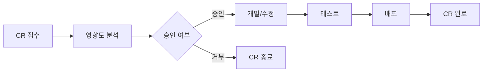

### 변경 요청서 (CR) 템플릿

| 항목 | 내용 |
|------|------|
| CR ID | CR-[번호] |
| 제목 | [변경 요청 제목] |
| 요청자 | [이름] |
| 요청일 | [YYYY-MM-DD] |
| 유형 | 수정/적응/완전/예방 |
| 우선순위 | P1/P2/P3/P4 |
| 상태 | 접수/분석중/승인/개발중/테스트중/배포완료/거부 |

**변경 내용:**
[요청하는 변경 사항 상세 설명]

**변경 사유:**
[변경이 필요한 이유]

**영향도 분석:**
- 영향 받는 모듈: [모듈 목록]
- 예상 공수: [N일/N시간]
- 위험도: [상/중/하]

**승인:**

| 역할 | 이름 | 승인 여부 | 날짜 |
|------|------|-----------|------|
| PM | [이름] | Y/N | [날짜] |
| 기술 리드 | [이름] | Y/N | [날짜] |

---

## 3. SLA (Service Level Agreement)

| 항목 | 목표 |
|------|------|
| 시스템 가용성 | 99.9% (월간) |
| P1 장애 대응 시간 | 15분 이내 |
| P1 장애 복구 시간 | 2시간 이내 |
| P2 장애 대응 시간 | 30분 이내 |
| P2 장애 복구 시간 | 4시간 이내 |
| P3 장애 대응 시간 | 2시간 이내 |
| P3 장애 복구 시간 | 다음 영업일 |
| 변경 요청 처리 시간 | P1: 1일 / P2: 3일 / P3: 1주 / P4: 2주 |

---

## 4. 기술 부채 관리 전략

### 4.1 기술 부채 식별

| ID | 항목 | 유형 | 영향 | 해결 비용 | 우선순위 |
|----|------|------|------|-----------|----------|
| TD-001 | [기술 부채 항목] | 코드/아키텍처/인프라 | [영향 설명] | [N 인일] | 상/중/하 |
| TD-002 | [기술 부채 항목] | 코드/아키텍처/인프라 | [영향 설명] | [N 인일] | 상/중/하 |

### 4.2 기술 부채 해소 원칙
1. 전체 개발 리소스의 20%를 기술 부채 해소에 할당
2. 분기별 기술 부채 리뷰 및 우선순위 재조정
3. 새 기능 개발 시 관련 기술 부채를 함께 해소
4. 기술 부채 증가를 방지하기 위한 코드 리뷰 강화
```

---

### 8.2 산출물: 인수인계 문서

```markdown
# 인수인계 문서

| 항목 | 내용 |
|------|------|
| 문서 ID | HDO-[프로젝트코드]-v1.0 |
| 프로젝트명 | [프로젝트명] |
| 인수인계 날짜 | [YYYY-MM-DD] |
| 인수자 | [이름/팀] |
| 인계자 | [이름/팀] |

---

## 1. 시스템 구성도

[시스템 전체 아키텍처 다이어그램 참조: SAD 문서]

### 1.1 서버 목록

| 서버명 | 용도 | IP/호스트 | OS | 사양 | 비고 |
|--------|------|-----------|-----|------|------|
| [서버1] | API 서버 | [IP] | [OS] | [CPU/MEM] | [비고] |
| [서버2] | DB 서버 | [IP] | [OS] | [CPU/MEM] | [비고] |
| [서버3] | 캐시 서버 | [IP] | [OS] | [CPU/MEM] | [비고] |

### 1.2 외부 연동 시스템

| 시스템명 | 연동 방식 | 담당자/연락처 | 계약 만료일 |
|----------|-----------|---------------|-------------|
| [시스템A] | REST API | [이름/연락처] | [날짜] |
| [시스템B] | 메시지 큐 | [이름/연락처] | [날짜] |

---

## 2. 계정/접근 권한 목록

| 시스템/서비스 | 용도 | 계정 관리 위치 | 관리자 |
|---------------|------|----------------|--------|
| Git 저장소 | 소스 코드 | [URL] | [이름] |
| CI/CD | 빌드/배포 | [URL] | [이름] |
| 클라우드 콘솔 | 인프라 관리 | [URL] | [이름] |
| 모니터링 | Grafana/Prometheus | [URL] | [이름] |
| 로그 관리 | Kibana/CloudWatch | [URL] | [이름] |
| DB 관리 도구 | DBeaver/pgAdmin | [접속 정보] | [이름] |

> 주의: 실제 비밀번호/키는 별도 보안 문서 또는 Secret Manager를 통해 전달

---

## 3. 정기 작업 일정

| 작업 | 주기 | 시간 | 방법 | 확인 사항 |
|------|------|------|------|-----------|
| DB 백업 확인 | 매일 | 09:00 | [확인 방법] | 백업 파일 생성 확인 |
| 디스크 사용량 점검 | 매주 월 | 10:00 | [확인 방법] | 80% 미만 확인 |
| 보안 패치 적용 | 매월 첫째 주 | - | [절차] | 테스트 후 적용 |
| SSL 인증서 갱신 | 만료 1개월 전 | - | [절차] | 갱신 및 검증 |
| 의존성 업데이트 | 분기별 | - | [절차] | 보안 취약점 패치 |

---

## 4. 긴급 연락처

| 역할 | 이름 | 연락처 | 이메일 | 비고 |
|------|------|--------|--------|------|
| 기술 총괄 | [이름] | [전화번호] | [이메일] | 에스컬레이션 대상 |
| 백엔드 리드 | [이름] | [전화번호] | [이메일] | 서버/API 관련 |
| 프론트엔드 리드 | [이름] | [전화번호] | [이메일] | UI 관련 |
| DBA | [이름] | [전화번호] | [이메일] | DB 관련 |
| 인프라 담당 | [이름] | [전화번호] | [이메일] | 서버/네트워크 |
| 보안 담당 | [이름] | [전화번호] | [이메일] | 보안 사고 |
| 클라우드 지원 | [벤더명] | [지원 전화] | [지원 이메일] | [SLA 등급] |
```

---

## 9. 프로젝트 관리 산출물

프로젝트 전체 기간에 걸쳐 관리되는 산출물이다.

### 9.1 WBS (Work Breakdown Structure) 템플릿

```markdown
# WBS (Work Breakdown Structure)

| WBS ID | 작업 항목 | 수준 | 담당자 | 시작일 | 종료일 | 산출물 | 상태 |
|--------|-----------|------|--------|--------|--------|--------|------|
| 1 | 프로젝트 관리 | 1 | PM | | | | |
| 1.1 | 프로젝트 계획 수립 | 2 | PM | [날짜] | [날짜] | WBS, 일정 | 완료 |
| 1.2 | 주간 회의/보고 | 2 | PM | [날짜] | [날짜] | 회의록 | 진행중 |
| 2 | 요구사항 분석 | 1 | BA | | | | |
| 2.1 | 이해관계자 인터뷰 | 2 | BA | [날짜] | [날짜] | 인터뷰 기록 | 완료 |
| 2.2 | SRS 작성 | 2 | BA | [날짜] | [날짜] | SRS 문서 | 완료 |
| 2.3 | 유스케이스 작성 | 2 | BA | [날짜] | [날짜] | UC 문서 | 완료 |
| 2.4 | RTM 초안 작성 | 2 | BA | [날짜] | [날짜] | RTM | 완료 |
| 3 | 시스템 설계 | 1 | SA | | | | |
| 3.1 | 아키텍처 설계 | 2 | SA | [날짜] | [날짜] | SAD | |
| 3.2 | DB 설계 | 2 | SA | [날짜] | [날짜] | DBS | |
| 3.3 | API 설계 | 2 | SA | [날짜] | [날짜] | API 설계서 | |
| 3.4 | UI/UX 설계 | 2 | Designer | [날짜] | [날짜] | UIX 설계서 | |
| 4 | 상세 설계 | 1 | SA | | | | |
| 4.1 | 클래스/시퀀스 설계 | 2 | SA | [날짜] | [날짜] | DDS | |
| 4.2 | 코딩 표준 수립 | 2 | 리드 개발자 | [날짜] | [날짜] | CDS | |
| 5 | 구현 | 1 | Dev | | | | |
| 5.1 | 모듈 A 개발 | 2 | [이름] | [날짜] | [날짜] | 소스 코드 | |
| 5.2 | 모듈 B 개발 | 2 | [이름] | [날짜] | [날짜] | 소스 코드 | |
| 5.3 | 단위 테스트 | 2 | Dev | [날짜] | [날짜] | 테스트 결과 | |
| 6 | 테스트 | 1 | QA | | | | |
| 6.1 | 테스트 계획 | 2 | QA | [날짜] | [날짜] | TPL | |
| 6.2 | 테스트 케이스 작성 | 2 | QA | [날짜] | [날짜] | TCS | |
| 6.3 | 시스템 테스트 | 2 | QA | [날짜] | [날짜] | TRP | |
| 6.4 | UAT | 2 | 고객 | [날짜] | [날짜] | UAT 승인서 | |
| 7 | 배포 | 1 | DevOps | | | | |
| 7.1 | 배포 계획 | 2 | DevOps | [날짜] | [날짜] | DPP | |
| 7.2 | 프로덕션 배포 | 2 | DevOps | [날짜] | [날짜] | 릴리스 노트 | |
| 8 | 프로젝트 종료 | 1 | PM | | | | |
| 8.1 | 인수인계 | 2 | PM | [날짜] | [날짜] | HDO | |
| 8.2 | 프로젝트 완료 보고 | 2 | PM | [날짜] | [날짜] | PCR | |
```

---

### 9.2 간트 차트 (Mermaid)

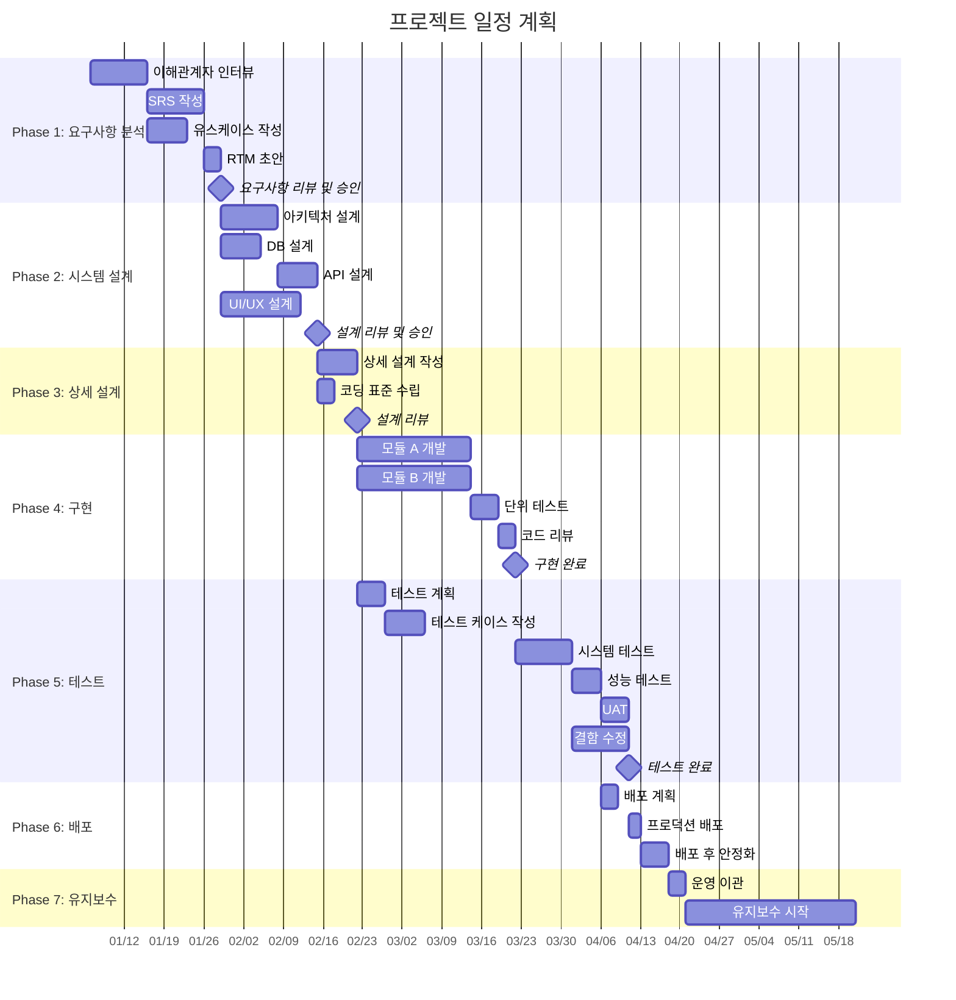

---

### 9.3 위험 관리 대장 (Risk Register)

```markdown
# 위험 관리 대장

| 항목 | 내용 |
|------|------|
| 문서 ID | RSK-[프로젝트코드]-v1.0 |
| 프로젝트명 | [프로젝트명] |
| 작성일 | [YYYY-MM-DD] |

## 위험 목록

| Risk ID | 위험 설명 | 카테고리 | 발생 확률 | 영향도 | 위험 등급 | 대응 전략 | 대응 계획 | 담당자 | 상태 |
|---------|-----------|----------|-----------|--------|-----------|-----------|-----------|--------|------|
| R-001 | 핵심 개발자 이탈 | 인력 | 중 | 상 | 높음 | 완화 | 지식 공유, 문서화 강화, 백업 인력 확보 | PM | 모니터링 |
| R-002 | 요구사항 변경 | 범위 | 상 | 상 | 높음 | 완화 | 변경 관리 프로세스 적용, 영향도 분석 필수 | BA | 모니터링 |
| R-003 | 외부 시스템 연동 지연 | 기술 | 중 | 중 | 중간 | 회피 | Mock 서비스 활용, 병렬 개발 | SA | 활성 |
| R-004 | 성능 목표 미달 | 기술 | 중 | 상 | 높음 | 완화 | 조기 성능 테스트, 최적화 버퍼 | 리드 개발자 | 모니터링 |
| R-005 | 일정 지연 | 일정 | 상 | 중 | 높음 | 완화 | 주간 진행 관리, 조기 경보 | PM | 모니터링 |

## 위험 등급 매트릭스

|  | 영향도 하 | 영향도 중 | 영향도 상 |
|--|----------|----------|----------|
| 확률 상 | 중간 | 높음 | 높음 |
| 확률 중 | 낮음 | 중간 | 높음 |
| 확률 하 | 낮음 | 낮음 | 중간 |

## 대응 전략 유형
- **회피(Avoid):** 위험 원인을 제거
- **전가(Transfer):** 제3자에게 위험 이전 (보험, 외주 등)
- **완화(Mitigate):** 발생 확률 또는 영향 감소
- **수용(Accept):** 위험을 인지하고 감수
```

---

### 9.4 이해관계자 관리 계획

```markdown
# 이해관계자 관리 계획

## 이해관계자 목록

| 이해관계자 | 역할 | 관심 영역 | 영향력 | 관여도 | 커뮤니케이션 방법 |
|------------|------|-----------|--------|--------|-------------------|
| [프로젝트 스폰서] | 예산 승인 | 비용, ROI | 상 | 자문 | 월간 보고 (이메일) |
| [제품 책임자] | 요구사항 결정 | 기능, UX | 상 | 주도적 | 주간 회의 |
| [개발팀 리드] | 기술 의사결정 | 아키텍처, 품질 | 상 | 주도적 | 일일 스탠드업 |
| [QA 리드] | 품질 관리 | 테스트, 결함 | 중 | 협력적 | 주간 회의 |
| [운영팀] | 시스템 운영 | 안정성, 모니터링 | 중 | 정보 공유 | 배포 시 알림 |
| [최종 사용자] | 시스템 사용 | 사용성, 성능 | 중 | 자문 | UAT, 설문 |
```

---

### 9.5 커뮤니케이션 계획

```markdown
# 커뮤니케이션 계획

| 회의/보고 | 주기 | 참석자 | 목적 | 산출물 |
|-----------|------|--------|------|--------|
| 킥오프 미팅 | 1회 | 전체 이해관계자 | 프로젝트 시작 공유 | 회의록 |
| 일일 스탠드업 | 매일 | 개발팀 | 진행 상황 공유, 이슈 식별 | - |
| 주간 프로젝트 회의 | 매주 | PM, 리드, PO | 진행 관리, 의사결정 | 주간 보고서 |
| 월간 경영 보고 | 매월 | PM, 스폰서 | 전체 현황 보고 | 월간 보고서 |
| 단계 리뷰 (Gate) | 단계 완료 시 | 주요 이해관계자 | 단계 산출물 리뷰/승인 | 리뷰 기록 |
| 프로젝트 종료 회의 | 1회 | 전체 이해관계자 | 프로젝트 종료, 교훈 공유 | 완료 보고서 |
```

---

### 9.6 프로젝트 완료 보고서 템플릿

```markdown
# 프로젝트 완료 보고서

| 항목 | 내용 |
|------|------|
| 문서 ID | PCR-[프로젝트코드]-v1.0 |
| 프로젝트명 | [프로젝트명] |
| 프로젝트 기간 | [시작일] ~ [종료일] |
| 작성일 | [YYYY-MM-DD] |
| 작성자 | [PM 이름] |

---

## 1. 프로젝트 개요
- **목적:** [프로젝트 목적]
- **범위:** [프로젝트 범위 요약]
- **핵심 산출물:** [주요 산출물 목록]

## 2. 목표 달성 현황

| 목표 | 계획 | 실적 | 달성률 | 비고 |
|------|------|------|--------|------|
| 일정 | [계획 종료일] | [실제 종료일] | [N%] | [지연/단축 사유] |
| 예산 | [계획 금액] | [실제 금액] | [N%] | [초과/절감 사유] |
| 범위 | [계획 기능 수] | [구현 기능 수] | [N%] | [변경 사항] |
| 품질 | [목표 결함률] | [실제 결함률] | [달성] | |

## 3. 주요 성과
1. [성과 1]
2. [성과 2]
3. [성과 3]

## 4. 주요 이슈 및 해결

| 이슈 | 발생 시기 | 영향 | 해결 방법 |
|------|-----------|------|-----------|
| [이슈 1] | [시기] | [영향] | [해결 방법] |
| [이슈 2] | [시기] | [영향] | [해결 방법] |

## 5. 교훈 (Lessons Learned)

### 5.1 잘된 점 (Keep)
- [잘된 점 1]
- [잘된 점 2]

### 5.2 개선이 필요한 점 (Problem)
- [개선점 1]
- [개선점 2]

### 5.3 다음 프로젝트에 시도할 점 (Try)
- [시도할 점 1]
- [시도할 점 2]

## 6. 산출물 목록

| 산출물 | 파일명 | 최종 버전 | 위치 |
|--------|--------|-----------|------|
| SRS | [파일명] | v[버전] | [위치] |
| SAD | [파일명] | v[버전] | [위치] |
| 소스 코드 | [저장소 URL] | v[버전] | [Git] |
| 테스트 결과 | [파일명] | v[버전] | [위치] |

## 7. 인수인계 현황

| 항목 | 인수자 | 완료일 | 상태 |
|------|--------|--------|------|
| 소스 코드 및 저장소 | [이름/팀] | [날짜] | 완료/진행중 |
| 운영 가이드 | [이름/팀] | [날짜] | 완료/진행중 |
| 시스템 접근 권한 | [이름/팀] | [날짜] | 완료/진행중 |
| 유지보수 계약 | [이름/팀] | [날짜] | 완료/진행중 |

---

## 승인

| 역할 | 이름 | 서명 | 날짜 |
|------|------|------|------|
| PM | [이름] | | [날짜] |
| 프로젝트 스폰서 | [이름] | | [날짜] |
| 고객 대표 | [이름] | | [날짜] |
```

---

## 부록: Claude Code 사용 안내

### 산출물 생성 요청 방법

사용자가 아래와 같이 요청하면 해당 섹션의 템플릿을 기반으로 산출물을 생성하세요.

| 사용자 요청 예시 | 생성할 산출물 | 참조 섹션 |
|------------------|-------------|-----------|
| "서비스 기획서 작성해줘" | 서비스 기획서 | `00-기획/서비스기획서.md` |
| "비즈니스 정책서 만들어줘" | 비즈니스 정책서 | `00-기획/비즈니스정책서.md` |
| "SRS 작성해줘" | 요구사항 명세서 | 2.1 |
| "유스케이스 문서 만들어줘" | 유스케이스 문서 | 2.2 |
| "RTM 만들어줘" | 요구사항 추적 매트릭스 | 2.3 |
| "아키텍처 설계서 작성해줘" | 시스템 아키텍처 설계서 | 3.1 |
| "DB 설계서 만들어줘" | 데이터베이스 설계서 | 3.2 |
| "API 설계서 작성해줘" | API 설계서 | 3.3 |
| "UI 설계서 만들어줘" | UI/UX 설계서 | 3.4 |
| "상세 설계서 작성해줘" | 상세 설계서 | 4.1 |
| "코딩 표준 만들어줘" | 코딩 표준 문서 | 4.2 |
| "Git 전략 만들어줘" | 소스 코드 관리 계획 | 5.1 |
| "테스트 계획서 작성해줘" | 테스트 계획서 | 6.1 |
| "테스트 케이스 만들어줘" | 테스트 케이스 문서 | 6.2 |
| "배포 계획서 작성해줘" | 배포 계획서 | 7.1 |
| "릴리스 노트 만들어줘" | 릴리스 노트 | 7.2 |
| "운영 가이드 작성해줘" | 운영 가이드 | 7.3 |
| "유지보수 계획서 만들어줘" | 유지보수 계획서 | 8.1 |
| "인수인계 문서 만들어줘" | 인수인계 문서 | 8.2 |
| "WBS 만들어줘" | WBS | 9.1 |
| "위험 관리 대장 만들어줘" | 위험 관리 대장 | 9.3 |
| "프로젝트 완료 보고서 작성해줘" | 프로젝트 완료 보고서 | 9.6 |

### 산출물 생성 시 주의사항
1. `[대괄호]` 안의 내용은 프로젝트 컨텍스트에 맞게 채워야 한다.
2. 사용자가 프로젝트 정보를 제공하지 않은 경우, 핵심 정보를 먼저 질문한다.
3. Mermaid 다이어그램은 프로젝트의 실제 구조에 맞게 수정한다.
4. 각 산출물의 파일명은 명명 규칙(1.5절)을 따른다.
5. 버전 관리: 초안은 v0.1, 리뷰 후 v1.0으로 관리한다.
6. 산출물 간 참조(예: SRS의 요구사항 ID가 RTM에서 참조)가 일관되게 유지되어야 한다.
