# Claude Code Skills 종합 가이드

> Claude Code의 Skills 시스템을 활용하여 반복 작업을 자동화하고, 팀 전체의 개발 워크플로우를 표준화하는 종합 가이드.
> SKILL.md 파일 작성법부터 고급 패턴, 배포 및 공유까지 다룬다.

---

## 목차

1. [Skills 개요](#1-skills-개요)
2. [SKILL.md 파일 구조](#2-skillmd-파일-구조)
3. [Frontmatter 레퍼런스](#3-frontmatter-레퍼런스)
4. [스킬 유형](#4-스킬-유형)
5. [Body 작성법](#5-body-작성법)
6. [컨텍스트 시스템 심층](#6-컨텍스트-시스템-심층)
7. [도구 권한 관리](#7-도구-권한-관리)
8. [실행 모드와 에이전트 설정](#8-실행-모드와-에이전트-설정)
9. [MCP 도구 통합](#9-mcp-도구-통합)
10. [배포 및 공유](#10-배포-및-공유)
11. [모범 사례 및 안티패턴](#11-모범-사례-및-안티패턴)
12. [관련 문서 링크](#12-관련-문서-링크)

---

## 1. Skills 개요

### Claude Code Skills란?

Claude Code Skills는 **재사용 가능한 지시사항 패키지**다. SKILL.md(또는 AGENT.md) 파일 하나에 Claude Code가 수행할 작업의 맥락, 도구 권한, 실행 방식을 정의하여 슬래시 커맨드(`/command`)로 즉시 호출하거나 에이전트가 자동으로 사용할 수 있다.

프로젝트 루트의 `.claude/skills/` 또는 `.claude/agents/` 디렉토리에 마크다운 파일을 두면 Claude Code가 자동으로 인식한다.

```
my-project/
├── .claude/
│   ├── skills/          # User-Invocable Skills
│   │   ├── review.md    # /review 로 호출
│   │   ├── deploy.md    # /deploy 로 호출
│   │   └── test.md      # /test 로 호출
│   ├── agents/          # Agent Skills (Custom Agents)
│   │   ├── researcher.md
│   │   └── tester.md
│   └── settings.json
├── src/
└── package.json
```

### Skills vs 일반 프롬프트의 차이

| 구분 | 일반 프롬프트 | Skills |
|------|---------------|--------|
| **재사용성** | 매번 수동 입력 | 파일로 저장, 즉시 호출 |
| **도구 권한** | 세션 전역 설정에 의존 | 스킬별 개별 도구 권한 지정 |
| **컨텍스트** | 수동으로 파일 참조 | 자동 컨텍스트 로딩 (정적/동적) |
| **실행 모드** | 세션 모드에 종속 | 스킬별 모드 설정 (plan, acceptEdits) |
| **모델 선택** | CLI 옵션으로 전역 설정 | 스킬별 최적 모델 지정 |
| **공유** | 텍스트 복사/붙여넣기 | Git으로 팀 전체 공유 |
| **버전 관리** | 불가 | Git 이력으로 변경 추적 |
| **표준화** | 개인별 편차 | 팀 공통 워크플로우 보장 |

### Skills 생태계 현황 (2025-2026)

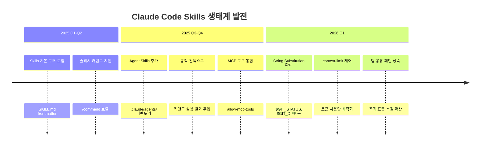

Claude Code Skills는 단순 프롬프트 저장에서 시작하여 현재는 **에이전트 정의, 도구 권한 제어, 동적 컨텍스트 로딩, MCP 통합**까지 아우르는 완전한 자동화 프레임워크로 발전했다.

> **380개+ 스킬 카탈로그**: Anthropic 공식, 기업 팀(Vercel, Cloudflare, Microsoft 등 15개 팀), 커뮤니티 스킬을 한국어로 정리한 종합 가이드는 [Awesome Claude Skills 한국어 가이드](../resources/Awesome-Claude-Skills-한국어-가이드.md)를 참고한다.

### Skills의 핵심 가치

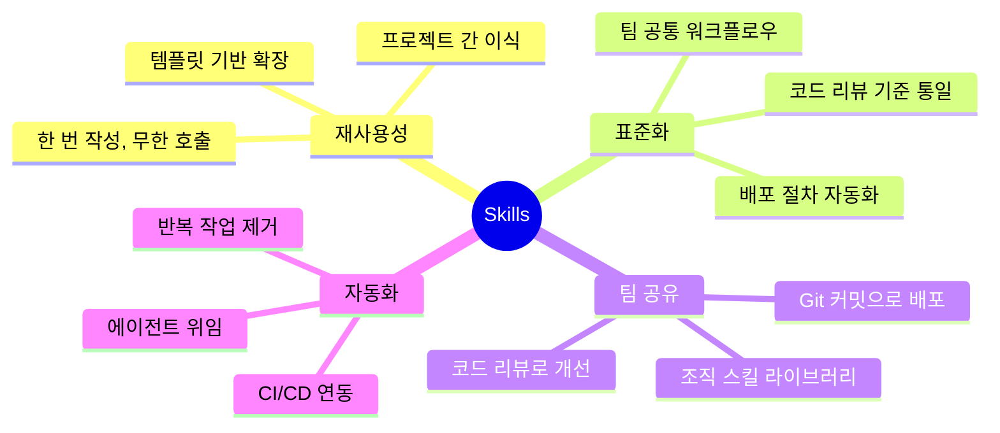

**재사용성**: 한 번 작성한 스킬을 `/command` 하나로 반복 호출한다. 프로젝트 간 복사도 가능하다.

**표준화**: 코드 리뷰 기준, 테스트 절차, 배포 체크리스트를 스킬로 정의하면 팀원 간 편차가 사라진다.

**팀 공유**: `.claude/` 디렉토리를 Git에 커밋하면 팀 전체가 동일한 스킬을 사용한다.

**자동화**: 복잡한 멀티스텝 작업을 에이전트 스킬로 정의하여 Task 도구에 위임한다.

> 실전 팁: Skills를 도입할 때는 팀에서 가장 자주 반복하는 작업 3가지를 먼저 스킬로 만들어라. 코드 리뷰(`/review`), 커밋 메시지 생성(`/commit`), 테스트 실행(`/test`)이 가장 효과적인 시작점이다.

---

## 2. SKILL.md 파일 구조

### 파일 위치

Skills 파일은 프로젝트 루트의 `.claude/` 하위 디렉토리에 위치한다:

| 디렉토리 | 용도 | 호출 방식 |
|-----------|------|-----------|
| `.claude/skills/` | User-Invocable Skills | `/filename`으로 슬래시 커맨드 호출 |
| `.claude/agents/` | Agent Skills (Custom Agents) | Task 도구의 `subagent_type`으로 호출 |

파일명이 곧 커맨드 이름이 된다:

```
.claude/skills/review.md  → /review
.claude/skills/deploy.md  → /deploy
.claude/skills/lint.md    → /lint
```

### YAML Frontmatter + Markdown Body 구조

모든 스킬 파일은 **YAML Frontmatter**와 **Markdown Body** 두 부분으로 구성된다:

```markdown
---
# ===== YAML Frontmatter (메타데이터) =====
name: 스킬 표시 이름
description: 스킬이 하는 일에 대한 설명
model: sonnet
allowed-tools:
  - Read
  - Glob
  - Grep
context:
  - src/config.ts
  - README.md
---

# ===== Markdown Body (지시사항) =====
# 여기에 Claude Code가 수행할 작업의 상세 지시사항을 작성한다.

## 작업 절차
1. 코드를 읽는다
2. 분석한다
3. 결과를 보고한다
```

Frontmatter는 YAML `---` 블록으로 감싸고, Body는 그 아래에 마크다운으로 작성한다.

### 최소 스킬 예시

가장 단순한 형태의 스킬. `name`만 있으면 동작한다:

```yaml
---
name: hello
---
사용자에게 "안녕하세요! Claude Code Skills가 정상 작동합니다."라고 인사해주세요.
```

이 파일을 `.claude/skills/hello.md`에 저장하면 `/hello`로 호출할 수 있다.

### 전체 스킬 예시 (모든 옵션 포함)

```yaml
---
name: comprehensive-review
description: >
  프로젝트 전체를 대상으로 코드 품질, 보안, 성능을 종합 검토하는 스킬.
  OWASP Top 10과 팀 컨벤션을 기준으로 평가한다.
model: opus
allowed-tools:
  - Read
  - Glob
  - Grep
  - Bash(command:npm run lint)
  - Bash(command:npm run test)
  - Task
context:
  - CLAUDE.md
  - src/**/*.ts
  - "!`git diff --cached --stat`"
  - "!`cat package.json | jq '.dependencies'`"
context-limit: 50000
allow-mcp-tools:
  - github
max-turns: 30
mode: plan
---

# 종합 코드 리뷰

## 개요
$ARGUMENTS 에 지정된 범위를 대상으로 종합 코드 리뷰를 수행한다.
인자가 없으면 staged 변경사항을 대상으로 한다.

## 현재 상태
- 브랜치: $GIT_BRANCH
- 날짜: $CURRENT_DATE
- 변경사항 요약:
$GIT_DIFF

## 검토 기준

### 1단계: 코드 품질
- 네이밍 컨벤션 준수 여부
- 함수 크기 및 복잡도 (단일 책임 원칙)
- 중복 코드 여부
- 에러 처리 적절성

### 2단계: 보안 검토
- SQL Injection 취약점
- XSS 취약점
- 인증/인가 누락
- 민감 정보 하드코딩

### 3단계: 성능 검토
- N+1 쿼리 문제
- 불필요한 리렌더링 (React/Vue)
- 메모리 누수 가능성
- 번들 사이즈 영향

### 4단계: 테스트 검토
- 테스트 커버리지 확인
- Edge case 테스트 존재 여부
- 테스트 격리성

## 출력 형식
각 이슈를 아래 형식으로 보고한다:

```
[심각도] 파일:라인 - 설명
  권장사항: 구체적인 수정 방안
```

심각도: CRITICAL > HIGH > MEDIUM > LOW > INFO
```

> 실전 팁: 처음 스킬을 만들 때는 최소 예시에서 시작하여 하나씩 옵션을 추가해라. 모든 옵션을 한꺼번에 넣으면 디버깅이 어렵다.

---

## 3. Frontmatter 레퍼런스

### 완전한 필드 목록

| 필드 | 타입 | 필수 | 기본값 | 설명 |
|------|------|------|--------|------|
| `name` | string | Yes | - | 스킬의 표시 이름 |
| `description` | string | No | - | 스킬의 목적과 기능 설명 |
| `model` | string | No | 세션 기본 모델 | 사용할 모델 (sonnet, opus, haiku) |
| `allowed-tools` | string[] | No | 모든 도구 | 허용할 도구 목록 |
| `context` | string[] | No | - | 컨텍스트로 로딩할 파일/패턴/명령 |
| `context-limit` | number | No | - | 컨텍스트 토큰 상한 |
| `allow-mcp-tools` | string[] | No | - | 허용할 MCP 서버 도구 |
| `max-turns` | number | No | 무제한 | 에이전트 최대 턴 수 |
| `mode` | string | No | - | 실행 모드 (plan, acceptEdits) |

### name (필수)

스킬의 표시 이름. 사용자에게 보이는 이름이며 슬래시 커맨드의 레이블로도 사용된다.

```yaml
---
name: code-review
---
```

**규칙**:
- 영어 소문자와 하이픈(`-`) 사용 권장
- 공백 대신 하이픈 사용
- 간결하면서 목적을 명확히 전달

```yaml
# Good
name: review-pr
name: deploy-staging
name: generate-tests

# Bad
name: My Awesome Review Skill v2.0  # 공백, 대문자, 버전 포함
name: r                              # 너무 짧아 목적 불명
```

### description

스킬의 목적과 기능을 설명한다. `description`은 스킬 목록에서 사용자가 적합한 스킬을 선택하는 데 도움을 주며, Agent Skills에서는 Task 도구가 적절한 에이전트를 선택하는 힌트로 활용된다.

```yaml
---
name: migration-check
description: >
  데이터베이스 마이그레이션 파일을 검토하여 호환성 문제,
  데이터 손실 위험, 롤백 가능성을 분석한다.
---
```

**여러 줄 작성**: YAML의 `>` (folded scalar) 또는 `|` (literal scalar)를 사용한다.

```yaml
# folded: 줄바꿈이 공백으로 변환
description: >
  첫째 줄과
  둘째 줄이 한 줄로 합쳐진다.

# literal: 줄바꿈 유지
description: |
  첫째 줄
  둘째 줄 (줄바꿈 유지)
```

### model

스킬 실행 시 사용할 Claude 모델을 지정한다. 지정하지 않으면 현재 세션의 기본 모델을 사용한다.

```yaml
---
name: quick-lint
model: haiku
---
```

**모델 선택 가이드**:

| 모델 | 특성 | 권장 용도 |
|------|------|-----------|
| `opus` | 최고 추론 능력, 높은 비용 | 복잡한 아키텍처 리뷰, 보안 감사, 리팩토링 설계 |
| `sonnet` | 균형 잡힌 성능/비용 | 일반 코드 리뷰, 기능 구현, 테스트 작성 |
| `haiku` | 빠른 속도, 낮은 비용 | 린팅, 포맷팅, 단순 변환, 빠른 검색 |

```yaml
# 복잡한 작업은 opus
---
name: architecture-review
model: opus
---

# 빠른 작업은 haiku
---
name: format-imports
model: haiku
---

# 일반 작업은 sonnet (또는 생략)
---
name: add-tests
model: sonnet
---
```

### allowed-tools

스킬이 사용할 수 있는 도구 목록을 제한한다. 지정하지 않으면 모든 도구를 사용할 수 있다.

```yaml
---
name: read-only-analysis
allowed-tools:
  - Read
  - Glob
  - Grep
---
```

**사용 가능한 기본 도구**:

| 도구 | 설명 |
|------|------|
| `Read` | 파일 읽기 |
| `Write` | 파일 생성/덮어쓰기 |
| `Edit` | 파일 부분 편집 |
| `Glob` | 파일 패턴 검색 |
| `Grep` | 파일 내용 검색 |
| `Bash` | 쉘 명령 실행 |
| `Task` | 서브에이전트에게 작업 위임 |
| `WebFetch` | URL에서 콘텐츠 가져오기 |
| `WebSearch` | 웹 검색 |
| `NotebookEdit` | Jupyter 노트북 편집 |

**Bash 명령 패턴 매칭**: 특정 명령만 허용할 수 있다.

```yaml
allowed-tools:
  - Read
  - Glob
  - Grep
  - Bash(command:npm run lint)        # 정확한 명령만 허용
  - Bash(command:npm run test*)       # 와일드카드 패턴
  - Bash(command:git log*)            # git log 계열 명령 허용
  - Bash(command:cat package.json)    # 특정 파일 읽기
```

### context

스킬 실행 시 자동으로 로딩할 컨텍스트를 정의한다. 세 가지 형태를 지원한다:

```yaml
context:
  # 1. 정적 파일 경로
  - CLAUDE.md
  - src/config.ts
  - docs/api-spec.yaml

  # 2. Glob 패턴
  - src/**/*.ts
  - tests/**/*.test.ts

  # 3. 동적 명령 실행 (backtick 안에 명령)
  - "!`git log --oneline -10`"
  - "!`cat package.json`"
  - "!`find src -name '*.ts' | head -20`"
```

자세한 내용은 [6. 컨텍스트 시스템 심층](#6-컨텍스트-시스템-심층) 섹션을 참고한다.

### context-limit

컨텍스트로 로딩할 최대 토큰 수를 제한한다. 대규모 프로젝트에서 컨텍스트 오버플로우를 방지한다.

```yaml
---
name: focused-review
context:
  - src/**/*.ts
context-limit: 30000
---
```

**설정 가이드**:

| 프로젝트 규모 | 권장 context-limit | 설명 |
|---------------|-------------------|------|
| 소규모 (< 50 파일) | 생략 (무제한) | 전체 로딩 가능 |
| 중규모 (50-200 파일) | 30000-50000 | 핵심 파일 우선 로딩 |
| 대규모 (200+ 파일) | 10000-30000 | 엄격한 제한 필요 |

### allow-mcp-tools

MCP(Model Context Protocol) 서버의 도구를 스킬에서 사용할 수 있도록 허용한다.

```yaml
---
name: pr-review
allow-mcp-tools:
  - github           # GitHub MCP 서버의 도구 사용
  - linear           # Linear MCP 서버의 도구 사용
---
```

자세한 내용은 [9. MCP 도구 통합](#9-mcp-도구-통합) 섹션을 참고한다.

### max-turns

에이전트가 수행할 최대 턴(도구 호출 사이클) 수를 제한한다. 무한 루프를 방지하고 비용을 제어한다.

```yaml
---
name: quick-check
max-turns: 5
---
```

**설정 가이드**:

| 작업 복잡도 | 권장 max-turns | 예시 |
|-------------|---------------|------|
| 단순 조회 | 3-5 | 린트 결과 확인, 파일 검색 |
| 일반 작업 | 10-20 | 코드 리뷰, 테스트 작성 |
| 복잡한 작업 | 20-50 | 리팩토링, 아키텍처 분석 |
| 자율 에이전트 | 50-100 | 대규모 마이그레이션, 멀티파일 수정 |

```yaml
# 비용 제어가 중요한 경우
---
name: expensive-analysis
model: opus
max-turns: 10
---

# 자율 작업이 필요한 경우
---
name: full-migration
max-turns: 80
---
```

### mode

스킬의 실행 모드를 지정한다.

```yaml
---
name: safe-deploy
mode: plan
---
```

| 모드 | 설명 |
|------|------|
| `plan` | 실행 계획을 먼저 제시하고 사용자 승인 후 실행 |
| `acceptEdits` | 파일 편집을 사용자 승인 없이 자동으로 적용 |
| (생략) | 세션의 기본 권한 모드를 따름 |

자세한 내용은 [8. 실행 모드와 에이전트 설정](#8-실행-모드와-에이전트-설정) 섹션을 참고한다.

> 실전 팁: `model: opus`와 `max-turns: 10`을 함께 쓰면 비용이 빠르게 증가한다. opus가 필요한 작업이라도 먼저 sonnet으로 테스트하고, 품질이 부족할 때만 opus로 전환해라.

---

## 4. 스킬 유형

### User-Invocable Skills

사용자가 `/command`로 직접 호출하는 스킬. `.claude/skills/` 디렉토리에 위치한다.

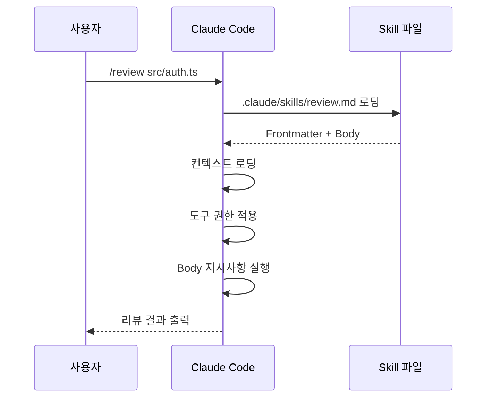

#### 디렉토리 구조

```
.claude/skills/
├── review.md          # /review
├── deploy.md          # /deploy
├── test.md            # /test
├── commit.md          # /commit
├── lint.md            # /lint
├── doc.md             # /doc
└── migrate.md         # /migrate
```

파일명에서 `.md` 확장자를 제거한 것이 커맨드 이름이 된다.

#### 슬래시 커맨드 호출

```bash
# 기본 호출
/review

# 인자 전달 (Body에서 $ARGUMENTS로 참조)
/review src/auth/login.ts

# 여러 인자
/deploy staging --skip-tests

# 긴 인자
/commit "feat: 사용자 인증 모듈 추가"
```

#### 실전 예시: 코드 리뷰 스킬

```yaml
---
name: review
description: 코드 변경사항을 리뷰하고 개선점을 제안한다.
model: sonnet
allowed-tools:
  - Read
  - Glob
  - Grep
  - Bash(command:npm run lint*)
  - Bash(command:npm run test*)
context:
  - CLAUDE.md
  - "!`git diff --cached --stat`"
---

# 코드 리뷰

## 대상
$ARGUMENTS 로 지정된 파일 또는 경로를 리뷰한다.
인자가 없으면 `git diff --cached`의 staged 변경사항을 리뷰한다.

## 현재 상태
- 브랜치: $GIT_BRANCH
- 변경사항:
$GIT_DIFF

## 리뷰 기준
1. CLAUDE.md에 정의된 프로젝트 컨벤션 준수
2. 타입 안전성 (TypeScript strict 모드 기준)
3. 에러 처리 적절성
4. 테스트 커버리지
5. 보안 취약점 (OWASP Top 10)

## 출력 형식
이슈를 심각도별로 분류하여 보고한다:
- CRITICAL: 즉시 수정 필요 (보안, 데이터 손실)
- WARNING: 수정 권장 (코드 품질, 유지보수성)
- INFO: 참고 사항 (스타일, 최적화)

각 이슈는 `파일:라인` 형식으로 위치를 명시한다.
```

#### 실전 예시: 커밋 메시지 생성 스킬

```yaml
---
name: commit
description: Conventional Commits 형식의 커밋 메시지를 생성하고 커밋한다.
allowed-tools:
  - Read
  - Bash(command:git *)
context:
  - "!`git diff --cached`"
  - "!`git log --oneline -5`"
---

# 커밋 메시지 생성

staged 변경사항을 분석하여 Conventional Commits 형식의 커밋 메시지를 생성한다.

## Conventional Commits 형식
```
<type>(<scope>): <description>

[optional body]

[optional footer(s)]
```

## type 목록
- feat: 새 기능
- fix: 버그 수정
- docs: 문서 변경
- style: 코드 포맷팅 (기능 변경 없음)
- refactor: 리팩토링
- perf: 성능 개선
- test: 테스트 추가/수정
- chore: 빌드, 도구 설정 등

## 작업 절차
1. `git diff --cached`로 staged 변경사항 분석
2. 변경 내용에 맞는 type과 scope 결정
3. 한국어로 description 작성 (50자 이내)
4. 필요하면 body에 상세 설명 추가
5. `git log --oneline -5`에서 기존 커밋 스타일 참고
6. 사용자에게 메시지를 보여주고 확인 요청
7. 확인 후 `git commit -m "..."` 실행

## 규칙
- description은 한국어로 작성
- type과 scope는 영어 소문자
- $ARGUMENTS 가 있으면 해당 내용을 description에 반영
```

#### 실전 예시: 테스트 생성 스킬

```yaml
---
name: test
description: 지정된 파일에 대한 단위 테스트를 생성한다.
model: sonnet
allowed-tools:
  - Read
  - Write
  - Glob
  - Grep
  - Bash(command:npm run test*)
context:
  - "!`cat package.json | grep -A 5 'devDependencies'`"
  - "!`cat tsconfig.json`"
---

# 테스트 생성

## 대상
$ARGUMENTS 로 지정된 파일의 단위 테스트를 생성한다.

## 절차
1. 대상 파일을 읽고 export된 함수/클래스 파악
2. 기존 테스트 파일이 있는지 확인 (*.test.ts, *.spec.ts)
3. 프로젝트의 테스트 프레임워크 파악 (Jest, Vitest 등)
4. 각 함수/메서드에 대해:
   - 정상 케이스 테스트
   - Edge case 테스트
   - 에러 케이스 테스트
5. 테스트 파일을 같은 디렉토리에 `*.test.ts`로 생성
6. `npm run test -- <파일>` 으로 테스트 실행 확인

## 테스트 작성 규칙
- describe/it 블록으로 구조화
- Given-When-Then 패턴 사용
- mock은 최소한으로 사용
- 테스트명은 한국어로 작성
```

### Agent Skills (Custom Agents)

에이전트가 Task 도구를 통해 호출하는 스킬. `.claude/agents/` 디렉토리에 위치한다.

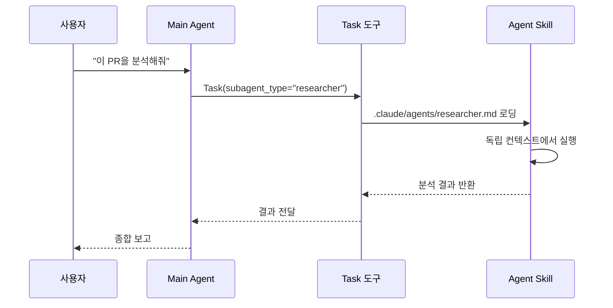

#### 디렉토리 구조

```
.claude/agents/
├── researcher.md      # 코드 조사 에이전트
├── tester.md          # 테스트 전문 에이전트
├── reviewer.md        # 리뷰 전문 에이전트
├── documenter.md      # 문서 작성 에이전트
└── migrator.md        # 마이그레이션 에이전트
```

#### Task 도구로 호출

Agent Skills는 Main Agent가 Task 도구의 `subagent_type` 파라미터로 호출한다:

```
Task 도구 호출 시:
- subagent_type: "researcher"  → .claude/agents/researcher.md 사용
- subagent_type: "tester"      → .claude/agents/tester.md 사용
```

#### 실전 예시: 코드 리서치 에이전트

```yaml
---
name: researcher
description: >
  코드베이스를 조사하여 특정 패턴, 의존성, 사용처를 파악하는 리서치 에이전트.
  메인 에이전트에게 조사 결과를 구조화하여 보고한다.
model: haiku
allowed-tools:
  - Read
  - Glob
  - Grep
max-turns: 20
---

# 코드베이스 리서치 에이전트

## 역할
요청받은 주제에 대해 코드베이스를 철저히 조사하고 결과를 구조화하여 보고한다.

## 조사 절차
1. 요청된 키워드/패턴으로 Grep 검색
2. 관련 파일을 Glob으로 탐색
3. 핵심 파일을 Read로 상세 분석
4. 의존성 그래프 파악
5. 사용처와 호출 패턴 정리

## 보고 형식
```markdown
### 조사 결과: [주제]

**관련 파일** (중요도순):
- `path/file.ts:42` - 설명

**핵심 발견**:
1. 발견 사항 1
2. 발견 사항 2

**의존성**:
- A → B → C

**권장사항**:
- 구체적 제안
```

## 규칙
- 파일 경로는 항상 프로젝트 루트 기준 상대 경로
- 코드 인용 시 라인 번호 포함
- 추측이 아닌 코드 기반 사실만 보고
```

#### 실전 예시: 테스트 에이전트

```yaml
---
name: tester
description: >
  코드 변경사항에 대한 테스트를 작성하고 실행하는 테스트 전문 에이전트.
  기존 테스트 패턴을 분석하여 프로젝트 컨벤션에 맞는 테스트를 생성한다.
model: sonnet
allowed-tools:
  - Read
  - Write
  - Edit
  - Glob
  - Grep
  - Bash(command:npm run test*)
  - Bash(command:npx jest*)
  - Bash(command:npx vitest*)
max-turns: 30
context:
  - "!`cat package.json | grep -E '(jest|vitest|mocha|testing)'`"
---

# 테스트 전문 에이전트

## 역할
지정된 코드에 대한 단위 테스트 및 통합 테스트를 작성하고 실행한다.

## 작업 절차
1. 대상 코드 분석 (export된 함수/클래스 파악)
2. 기존 테스트 파일 및 패턴 조사
3. 테스트 프레임워크 확인 (Jest/Vitest/Mocha)
4. 테스트 코드 작성
5. 테스트 실행 및 결과 확인
6. 실패 시 수정 후 재실행 (최대 3회)

## 테스트 설계 원칙
- AAA 패턴: Arrange, Act, Assert
- 한 테스트에 하나의 assertion 원칙
- Mock은 외부 의존성에만 사용
- Edge case와 에러 케이스 필수 포함
- 테스트명은 행위를 설명하는 한국어 문장
```

### User-Invocable vs Agent Skills 비교

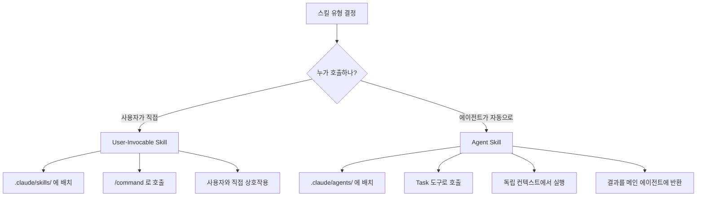

| 구분 | User-Invocable | Agent Skills |
|------|----------------|--------------|
| 위치 | `.claude/skills/` | `.claude/agents/` |
| 호출 | `/command` | Task(subagent_type=...) |
| 실행 주체 | 사용자가 직접 트리거 | 메인 에이전트가 위임 |
| 컨텍스트 | 메인 대화 컨텍스트 공유 | 독립 컨텍스트 (격리) |
| 결과 전달 | 사용자에게 직접 출력 | 메인 에이전트에게 반환 |
| 상호작용 | 사용자와 대화 가능 | 비대화형 (자율 실행) |
| 주 용도 | 반복 작업 자동화 | 병렬 작업, 전문 분석 |

> 실전 팁: 동일한 기능이라도 사용자가 직접 결과를 보고 싶으면 User-Invocable Skill로, 더 큰 작업의 일부로 자동 실행되어야 하면 Agent Skill로 만들어라. 필요하면 둘 다 만들 수도 있다 (skills/review.md + agents/reviewer.md).

---

## 5. Body 작성법

### 마크다운 형식의 상세 지시사항

Body는 YAML Frontmatter 아래에 마크다운으로 작성하는 **실제 지시사항**이다. Claude Code는 Body를 시스템 프롬프트처럼 해석하여 작업을 수행한다.

```markdown
---
name: example
---

# 주요 제목 (작업의 이름)

## 개요
이 스킬이 무엇을 하는지 한두 문장으로 설명.

## 작업 절차
1. 첫 번째 단계
2. 두 번째 단계
3. 세 번째 단계

## 규칙
- 반드시 지켜야 할 규칙 1
- 반드시 지켜야 할 규칙 2

## 출력 형식
결과를 어떤 형식으로 보여줄지 정의.
```

**Body 구조화 원칙**:

| 섹션 | 역할 | 필수 |
|------|------|------|
| 제목 (`#`) | 스킬의 목적을 한눈에 전달 | Yes |
| 개요 | 무엇을 하는지 설명 | Yes |
| 작업 절차 | 단계별 수행 순서 | Yes |
| 규칙/제약 | 반드시 지켜야 할 사항 | 권장 |
| 출력 형식 | 결과 포맷 정의 | 권장 |
| 예시 | 입력/출력 예시 | 선택 |

### String Substitution 활용

Body에서 특수 변수를 사용하면 실행 시점의 동적 값으로 자동 치환된다:

| 변수 | 설명 | 예시 값 |
|------|------|---------|
| `$ARGUMENTS` | 사용자가 `/command` 뒤에 입력한 인자 | `src/auth.ts` |
| `$SKILL_NAME` | 현재 스킬의 name 필드 값 | `review` |
| `$CWD` | 현재 작업 디렉토리 | `/home/user/project` |
| `$GIT_STATUS` | `git status --short` 결과 | `M src/app.ts` |
| `$GIT_BRANCH` | 현재 Git 브랜치 이름 | `feature/auth` |
| `$GIT_DIFF` | `git diff --cached` (staged 변경사항) | `diff --git a/...` |
| `$GIT_LOG` | 최근 커밋 로그 | `abc1234 feat: ...` |
| `$CURRENT_DATE` | 현재 날짜 | `2026-02-24` |

#### $ARGUMENTS 활용

사용자 입력 인자를 받아 동적으로 작업 대상을 결정한다:

```markdown
---
name: explain
---

# 코드 설명

$ARGUMENTS 로 지정된 파일 또는 함수를 분석하여 초보 개발자도 이해할 수 있도록 설명한다.

## 인자 처리
- 파일 경로가 주어지면: 해당 파일 전체를 설명
- 함수명이 주어지면: 코드베이스에서 함수를 찾아 설명
- 인자가 없으면: 현재 디렉토리의 주요 파일을 설명

## 설명 형식
1. 한 줄 요약
2. 입력과 출력
3. 내부 로직 단계별 설명
4. 사용 예시
```

호출 예시:

```bash
/explain src/auth/jwt.ts          # 파일 설명
/explain handleLogin              # 함수 설명
/explain                          # 전체 개요
```

#### $GIT_DIFF와 $GIT_BRANCH 활용

Git 상태에 따라 동적으로 동작을 변경한다:

```markdown
---
name: pre-push-check
---

# Pre-push 체크

## 현재 상태
- 브랜치: $GIT_BRANCH
- 날짜: $CURRENT_DATE

## staged 변경사항
$GIT_DIFF

## 체크 항목
1. $GIT_BRANCH 가 `main` 또는 `master`면 경고 출력
2. $GIT_DIFF 에서 `console.log`, `debugger`, `TODO` 검색
3. $GIT_DIFF 에서 `.env`, `secret`, `password` 등 민감 정보 검색
4. 변경된 파일에 대한 테스트 존재 여부 확인

## 결과
- PASS: 모든 체크 통과
- WARN: 경고 사항 존재 (push 가능하나 확인 필요)
- FAIL: 반드시 수정 후 push
```

#### $GIT_LOG 활용

최근 커밋 이력을 참고하여 일관된 작업을 수행한다:

```markdown
---
name: changelog
---

# Changelog 생성

## 최근 커밋
$GIT_LOG

## 작업
$GIT_LOG 의 커밋 메시지를 분석하여 사용자 친화적인 Changelog를 생성한다.

## 분류
- Features: feat 타입 커밋
- Bug Fixes: fix 타입 커밋
- Performance: perf 타입 커밋
- Breaking Changes: BREAKING CHANGE 푸터가 있는 커밋

## 형식
```markdown
## [버전] - $CURRENT_DATE

### Features
- 설명 (#PR번호)

### Bug Fixes
- 설명 (#PR번호)
```
```

### 조건부 로직 작성 팁

Body에서 조건문을 직접 쓸 수는 없지만, Claude Code가 자연어 조건을 이해하므로 다음과 같이 작성한다:

```markdown
## 조건부 동작

### 인자에 따른 분기
- $ARGUMENTS 가 파일 경로이면: 해당 파일만 분석
- $ARGUMENTS 가 "all"이면: 전체 프로젝트 분석
- $ARGUMENTS 가 비어있으면: staged 변경사항만 분석

### 브랜치에 따른 분기
- $GIT_BRANCH 가 main/master이면:
  - 보수적으로 검토 (CRITICAL, HIGH만 보고)
  - 직접 수정하지 않고 제안만 함
- $GIT_BRANCH 가 feature/*이면:
  - 적극적으로 검토 (모든 레벨 보고)
  - 가능하면 직접 수정

### 파일 유형에 따른 분기
- .ts/.tsx 파일: TypeScript strict 모드 기준 검토
- .test.ts 파일: 테스트 품질 기준 검토
- .md 파일: 문서 스타일 기준 검토
```

### 체계적인 지시사항 구조화

복잡한 스킬은 페르소나, 규칙, 절차를 명확히 분리한다:

```markdown
---
name: architect
model: opus
---

# 아키텍처 리뷰 에이전트

## 페르소나
당신은 10년 이상 경력의 소프트웨어 아키텍트다.
SOLID 원칙, 클린 아키텍처, DDD에 정통하며
실용주의적 관점에서 트레이드오프를 평가한다.

## 불변 규칙
1. 추측하지 않는다. 코드에서 확인된 사실만 보고한다.
2. "좋다/나쁘다"가 아닌 "왜"를 설명한다.
3. 개선안은 항상 코드 예시와 함께 제시한다.
4. 현재 프로젝트 규모에 맞는 솔루션을 제안한다.

## 평가 프레임워크

### 1. 의존성 분석
- 순환 의존성 존재 여부
- 레이어 간 의존 방향 (상위 → 하위만 허용)
- 외부 라이브러리 의존도

### 2. 모듈 응집도
- 각 모듈이 단일 책임을 가지는지
- 모듈 간 결합도는 낮은지
- Public API 표면적은 적절한지

### 3. 확장성
- 새 기능 추가 시 수정 범위
- 설정 변경 용이성
- 플러그인/미들웨어 패턴 활용 여부

## 출력 형식
- 아키텍처 다이어그램 (Mermaid)
- 컴포넌트별 평가표
- 우선순위화된 개선 제안 (최대 5개)
```

> 실전 팁: Body에서 가장 중요한 지시사항은 "## 불변 규칙" 섹션에 넣어라. Claude Code는 "불변", "반드시", "절대" 같은 강조 표현을 더 높은 우선순위로 처리한다.

---

## 6. 컨텍스트 시스템 심층

Skills의 `context` 필드는 스킬 실행 시 자동으로 로딩할 정보를 정의한다. 적절한 컨텍스트 설정은 스킬 품질에 직접적인 영향을 미친다.

### 컨텍스트 유형 개요

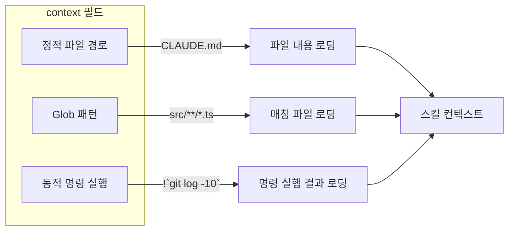

### 정적 컨텍스트: 파일 경로 직접 지정

가장 간단한 형태. 프로젝트 루트 기준 상대 경로로 파일을 지정한다.

```yaml
context:
  - CLAUDE.md                    # 프로젝트 루트의 파일
  - src/config.ts                # 소스 코드
  - docs/api-spec.yaml           # API 명세
  - .eslintrc.json               # 린트 설정
  - tsconfig.json                # TypeScript 설정
```

**사용 시기**:
- 항상 참조해야 하는 설정 파일 (CLAUDE.md, tsconfig.json)
- 스킬 작업에 필수적인 특정 파일
- 변하지 않는 참조 문서

**주의사항**:
- 파일이 존재하지 않으면 해당 항목은 무시된다 (에러 아님)
- 대용량 파일은 `context-limit`으로 제어

```yaml
# 설정 파일 + 핵심 소스를 컨텍스트로
---
name: config-check
context:
  - package.json
  - tsconfig.json
  - .eslintrc.json
  - src/config/index.ts
  - src/config/env.ts
---
```

### Glob 패턴 컨텍스트

파일 패턴을 지정하여 매칭되는 모든 파일을 로딩한다.

```yaml
context:
  - src/**/*.ts              # src 하위 모든 TypeScript 파일
  - tests/**/*.test.ts       # 테스트 파일
  - src/components/*.vue     # Vue 컴포넌트
  - "!src/**/*.test.ts"      # 테스트 파일 제외 (negation)
```

**Glob 패턴 문법**:

| 패턴 | 의미 | 예시 매칭 |
|------|------|-----------|
| `*` | 단일 디렉토리 내 모든 파일 | `src/*.ts` → `src/app.ts` |
| `**` | 재귀적 모든 하위 디렉토리 | `src/**/*.ts` → `src/a/b/c.ts` |
| `?` | 단일 문자 | `file?.ts` → `file1.ts` |
| `{a,b}` | OR 매칭 | `*.{ts,tsx}` → `app.ts`, `app.tsx` |
| `!pattern` | 제외 패턴 | `!**/*.test.ts` |

```yaml
# TypeScript 소스만 (테스트 제외)
context:
  - src/**/*.{ts,tsx}
  - "!src/**/*.test.{ts,tsx}"
  - "!src/**/*.spec.{ts,tsx}"
  - "!src/**/__mocks__/**"
```

**주의사항**:
- Glob 패턴은 많은 파일을 매칭할 수 있으므로 `context-limit`과 함께 사용
- 너무 넓은 패턴 (`**/*`)은 불필요한 토큰 소비

### 동적 컨텍스트: 명령 실행 결과 주입

`!`command`` 문법으로 쉘 명령의 실행 결과를 컨텍스트에 주입한다. 스킬 실행 시점에 매번 새로 실행된다.

```yaml
context:
  - "!`git log --oneline -20`"
  - "!`cat package.json`"
  - "!`find . -name '*.test.ts' | head -20`"
  - "!`git diff --cached --stat`"
  - "!`npm ls --depth=0 2>/dev/null`"
```

**문법**: 반드시 `"!`command`"` 형식으로 작성한다. 외부 따옴표는 YAML 파싱을 위해 필요하고, `!` 접두사는 동적 실행을 의미하며, 백틱은 명령 경계를 표시한다.

#### 자주 사용하는 동적 컨텍스트

```yaml
# Git 정보
- "!`git log --oneline -20`"              # 최근 20개 커밋
- "!`git diff --cached --stat`"           # staged 파일 목록
- "!`git diff --cached`"                  # staged 전체 diff
- "!`git branch -a`"                      # 모든 브랜치
- "!`git stash list`"                     # stash 목록
- "!`git tag --sort=-version:refname | head -5`"  # 최근 태그

# 프로젝트 정보
- "!`cat package.json`"                   # Node.js 설정
- "!`cat pom.xml`"                        # Maven 설정
- "!`cat Cargo.toml`"                     # Rust 설정
- "!`cat requirements.txt`"              # Python 의존성

# 파일 구조
- "!`find src -type f -name '*.ts' | head -30`"  # TypeScript 파일 목록
- "!`tree src -L 2 --dirsfirst`"         # 디렉토리 트리
- "!`wc -l src/**/*.ts 2>/dev/null | sort -rn | head -10`"  # 큰 파일

# 런타임 정보
- "!`node --version`"                     # Node.js 버전
- "!`npm ls --depth=0 2>/dev/null`"      # 설치된 패키지
- "!`docker ps --format 'table {{.Names}}\t{{.Status}}'`"  # Docker 상태
```

#### 동적 컨텍스트 조합 예시

```yaml
---
name: deploy-check
context:
  # 프로젝트 설정
  - package.json
  - Dockerfile

  # Git 상태
  - "!`git log --oneline -5`"
  - "!`git diff --stat HEAD~1`"

  # 환경 정보
  - "!`node --version`"
  - "!`docker --version 2>/dev/null || echo 'Docker not found'`"

  # 빌드 상태
  - "!`npm run build 2>&1 | tail -20`"
---
```

### context:fork - 독립 컨텍스트에서 실행

Agent Skills는 기본적으로 메인 에이전트와 별도의 독립 컨텍스트에서 실행된다. 이는 Task 도구의 특성으로, Agent Skill이 메인 대화의 컨텍스트를 오염시키지 않는다.

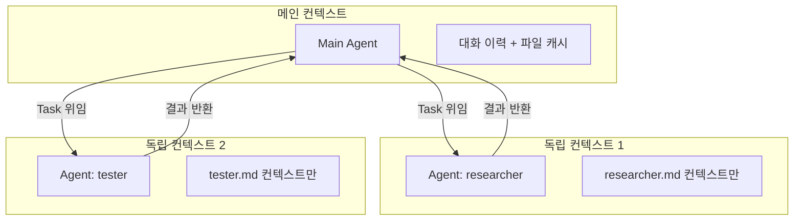

**독립 컨텍스트의 장점**:
- 메인 대화 컨텍스트를 소비하지 않음
- 여러 에이전트를 병렬로 실행 가능
- 각 에이전트가 필요한 컨텍스트만 로딩

**User-Invocable Skills**는 메인 대화 컨텍스트에서 실행되므로, 스킬의 컨텍스트가 메인 대화에 추가된다.

### 컨텍스트 우선순위와 충돌 해결

여러 컨텍스트가 함께 로딩될 때의 우선순위:

```
1. Body 본문의 지시사항 (최고 우선순위)
2. Frontmatter의 context에 명시된 파일
3. 동적 컨텍스트 (!`command` 결과)
4. 프로젝트의 CLAUDE.md (항상 로딩)
5. Glob 패턴으로 매칭된 파일
```

**context-limit 적용 시**: 우선순위가 높은 컨텍스트가 먼저 할당되고, 남은 토큰에 우선순위가 낮은 컨텍스트가 채워진다.

```yaml
# 핵심 파일을 먼저 나열 (우선순위 높음)
context:
  - CLAUDE.md                          # 1순위: 프로젝트 규칙
  - src/core/auth.ts                   # 2순위: 핵심 파일
  - "!`git diff --cached`"             # 3순위: 변경사항
  - src/**/*.ts                        # 4순위: 전체 소스 (남는 토큰으로)
context-limit: 30000
```

> 실전 팁: `context-limit`을 사용할 때는 가장 중요한 파일을 `context` 배열의 앞쪽에 배치하라. 토큰 한도에 도달하면 뒤쪽 항목이 잘릴 수 있다.

---

## 7. 도구 권한 관리

### 최소 권한 원칙

스킬에 필요한 최소한의 도구만 허용하는 것이 보안과 안정성의 기본이다.

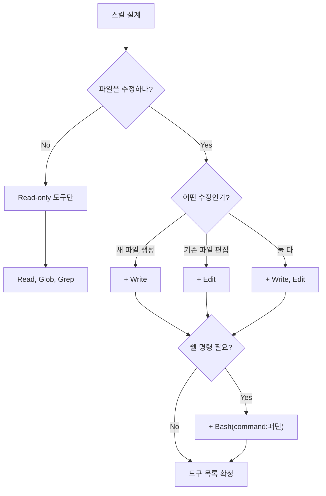

**권한 레벨별 도구 조합**:

```yaml
# Level 1: Read-only (가장 안전)
allowed-tools:
  - Read
  - Glob
  - Grep

# Level 2: Read + 분석
allowed-tools:
  - Read
  - Glob
  - Grep
  - Bash(command:npm run lint*)
  - Bash(command:npm run test*)

# Level 3: Read + Write
allowed-tools:
  - Read
  - Write
  - Edit
  - Glob
  - Grep

# Level 4: Full (Agent 작업)
allowed-tools:
  - Read
  - Write
  - Edit
  - Glob
  - Grep
  - Bash
  - Task

# Level 5: 제한 없음 (allowed-tools 생략)
# → 모든 도구 사용 가능
```

### allowed-tools 상세

#### 개별 도구 지정

각 도구를 명시적으로 나열한다:

```yaml
allowed-tools:
  - Read           # 파일 읽기만
  - Glob           # 파일 검색만
  - Grep           # 내용 검색만
```

지정하지 않은 도구는 사용 불가:

```yaml
# Write, Edit, Bash 등은 사용 불가
allowed-tools:
  - Read
  - Glob
```

#### Bash(command:pattern) 패턴 매칭

`Bash` 도구를 허용할 때 실행 가능한 명령을 패턴으로 제한한다:

```yaml
allowed-tools:
  - Bash(command:npm run *)           # npm run 하위 모든 스크립트
  - Bash(command:git log*)            # git log 계열
  - Bash(command:git diff*)           # git diff 계열
  - Bash(command:git status)          # 정확히 git status만
  - Bash(command:cat package.json)    # 특정 파일 읽기만
  - Bash(command:ls *)               # ls 명령
  - Bash(command:npx jest*)           # Jest 실행
  - Bash(command:npx vitest*)         # Vitest 실행
  - Bash(command:docker ps*)          # Docker 상태 확인
  - Bash(command:curl *)             # HTTP 요청
```

**와일드카드 규칙**:
- `*` : 임의의 문자열 매칭
- 패턴은 명령의 시작부터 매칭
- 정확한 명령만 허용하려면 와일드카드 없이 작성

```yaml
# 안전한 패턴 예시
allowed-tools:
  - Bash(command:npm run test)          # 정확히 "npm run test"만
  - Bash(command:npm run test*)         # "npm run test", "npm run test:unit" 등
  - Bash(command:git log --oneline*)    # git log --oneline 계열만
```

```yaml
# 위험한 패턴 (피해야 할 예시)
allowed-tools:
  - Bash                                # 모든 명령 허용 (위험)
  - Bash(command:*)                     # 위와 동일 (위험)
  - Bash(command:rm *)                  # 삭제 명령 허용 (위험)
  - Bash(command:git push*)             # 원격 push 허용 (주의 필요)
```

### allow-mcp-tools로 MCP 도구 통합

MCP 서버의 도구를 허용한다:

```yaml
allow-mcp-tools:
  - github          # GitHub MCP 서버의 모든 도구
  - linear          # Linear MCP 서버의 모든 도구
  - slack           # Slack MCP 서버의 모든 도구
```

MCP 서버 이름은 `.claude/settings.json`의 `mcpServers` 설정에 정의된 이름을 사용한다.

### 보안 고려사항

```yaml
# GOOD: 최소 권한 원칙 적용
---
name: safe-review
allowed-tools:
  - Read
  - Glob
  - Grep
  - Bash(command:npm run lint)
---

# BAD: 과도한 권한
---
name: unsafe-review
allowed-tools:
  - Read
  - Write
  - Edit
  - Bash              # 모든 명령 실행 가능!
---
```

**도구 권한 체크리스트**:

| 체크 항목 | 설명 |
|-----------|------|
| Read-only 가능한가? | 분석/검토 스킬은 Write/Edit 불필요 |
| Bash가 필요한가? | Read/Glob/Grep으로 대체 가능한지 확인 |
| Bash 패턴이 좁은가? | `Bash` 대신 `Bash(command:특정명령)` 사용 |
| Task가 필요한가? | 서브에이전트 위임이 정말 필요한지 확인 |
| MCP가 필요한가? | 외부 서비스 접근이 정말 필요한지 확인 |

> 실전 팁: 스킬을 처음 만들 때는 `allowed-tools`를 가장 제한적으로 시작하고, 실행하면서 필요한 도구만 하나씩 추가해라. "모든 도구 허용 후 필요 없는 것 제거"보다 "최소 도구에서 시작하여 추가"가 안전하다.

---

## 8. 실행 모드와 에이전트 설정

### mode: plan

스킬 실행 시 먼저 계획을 제시하고, 사용자 승인 후에 실제 작업을 수행한다.

```yaml
---
name: refactor
mode: plan
allowed-tools:
  - Read
  - Write
  - Edit
  - Glob
  - Grep
---

# 리팩토링

$ARGUMENTS 대상을 리팩토링한다.

## 계획 단계 (plan)
먼저 아래 내용을 분석하여 리팩토링 계획을 제시한다:
1. 현재 코드 구조 분석
2. 문제점 식별
3. 리팩토링 전략 제안
4. 예상 영향 범위
5. 위험 요소

## 실행 단계 (승인 후)
사용자가 계획을 승인하면:
1. 계획에 따라 코드 수정
2. 관련 테스트 업데이트
3. 변경 사항 요약 보고
```

**plan 모드의 흐름**:

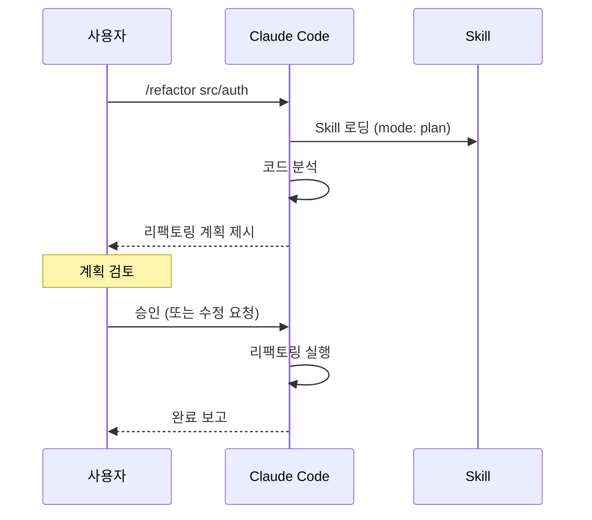

**적합한 상황**:
- 대규모 코드 수정
- 되돌리기 어려운 변경
- 팀 합의가 필요한 작업
- 아키텍처 변경

### mode: acceptEdits

파일 편집을 사용자 승인 없이 자동으로 적용한다. 빠른 작업에 적합하다.

```yaml
---
name: format
mode: acceptEdits
allowed-tools:
  - Read
  - Edit
  - Glob
---

# 코드 포맷팅

$ARGUMENTS 로 지정된 파일의 코드 스타일을 정리한다.

## 규칙
- import 정렬 (외부 라이브러리 → 내부 모듈 → 상대 경로)
- 사용하지 않는 import 제거
- trailing comma 추가
- 세미콜론 일관성 확인
```

**적합한 상황**:
- 포맷팅, 린팅 자동 수정
- 간단한 일괄 변환
- 위험도가 낮은 편집

### 모드 미지정 (기본 동작)

`mode`를 생략하면 현재 세션의 기본 권한 모드를 따른다:

```yaml
---
name: analyze
# mode 생략 → 세션 기본 모드
---
```

### max-turns 설정과 무한 루프 방지

`max-turns`는 에이전트가 수행할 최대 도구 호출 사이클을 제한한다. 무한 루프나 과도한 비용을 방지하는 안전장치다.

```yaml
---
name: auto-fix
max-turns: 15
allowed-tools:
  - Read
  - Edit
  - Bash(command:npm run test*)
---

# 자동 수정

테스트 실패를 자동으로 수정한다.

## 절차
1. 테스트 실행
2. 실패한 테스트 분석
3. 코드 수정
4. 테스트 재실행
5. 성공할 때까지 2-4 반복

## 제한
- 최대 3회 수정 시도
- 3회 시도 후에도 실패하면 분석 결과만 보고
```

**max-turns 동작**:

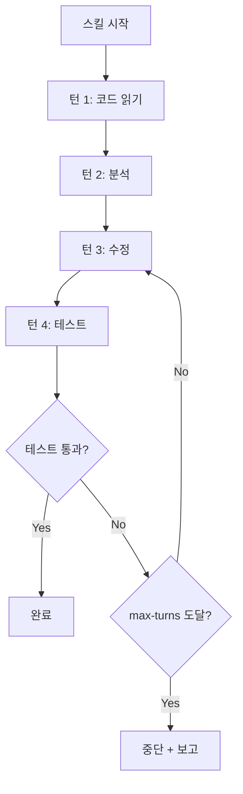

**설정 팁**:
- 단순 작업: `max-turns: 5` (읽기-분석-보고)
- 수정 + 검증: `max-turns: 15` (읽기-수정-테스트-반복)
- 자율 에이전트: `max-turns: 50` (복잡한 멀티스텝)
- opus + 높은 max-turns는 비용 폭증 주의

### model 선택 가이드 (비용 vs 성능)

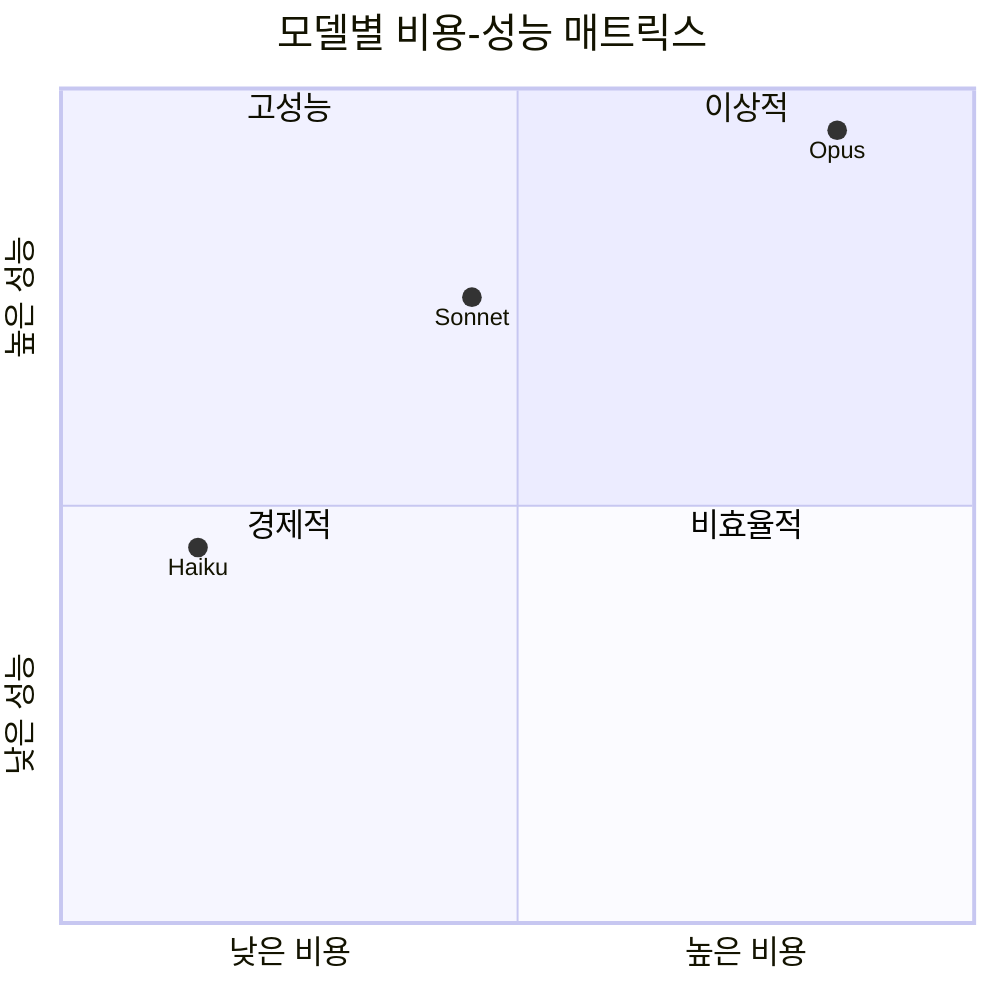

**모델 선택 의사결정 트리**:

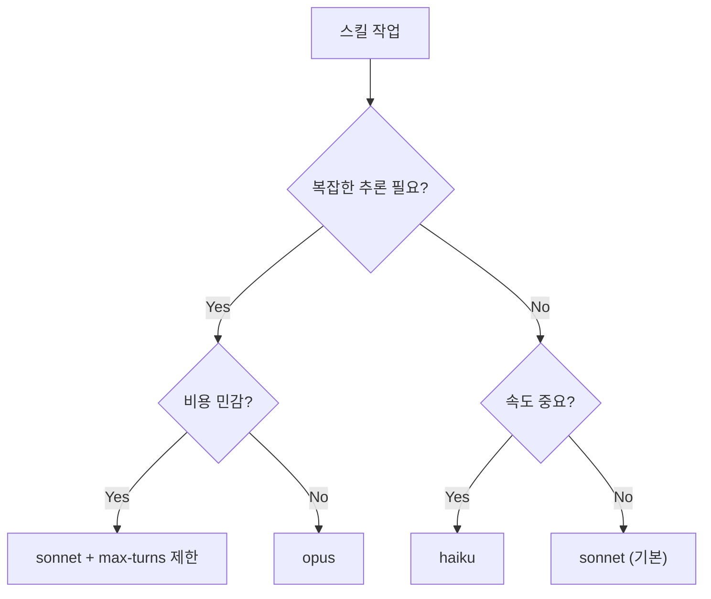

| 작업 유형 | 권장 모델 | max-turns | 예상 비용 |
|-----------|-----------|-----------|-----------|
| 코드 포맷팅 | haiku | 5 | 매우 낮음 |
| 코드 리뷰 | sonnet | 10-15 | 보통 |
| 테스트 생성 | sonnet | 15-20 | 보통 |
| 아키텍처 분석 | opus | 10-20 | 높음 |
| 보안 감사 | opus | 15-25 | 높음 |
| 파일 검색 | haiku | 3-5 | 매우 낮음 |
| 리팩토링 | sonnet/opus | 20-40 | 높음 |

> 실전 팁: `mode: plan`과 `model: opus`를 함께 사용하면 계획 단계에서 opus의 높은 추론 능력을 활용하되, 사용자가 계획을 확인한 후에만 비용이 큰 실행이 진행되므로 비용 낭비를 줄일 수 있다.

---

## 9. MCP 도구 통합

### Skills에서 MCP 서버 도구 활용

MCP(Model Context Protocol) 서버는 Claude Code의 기능을 외부 서비스로 확장한다. Skills에서 MCP 도구를 활용하면 GitHub PR 생성, Slack 알림, Linear 이슈 관리 등을 스킬 내에서 자동화할 수 있다.

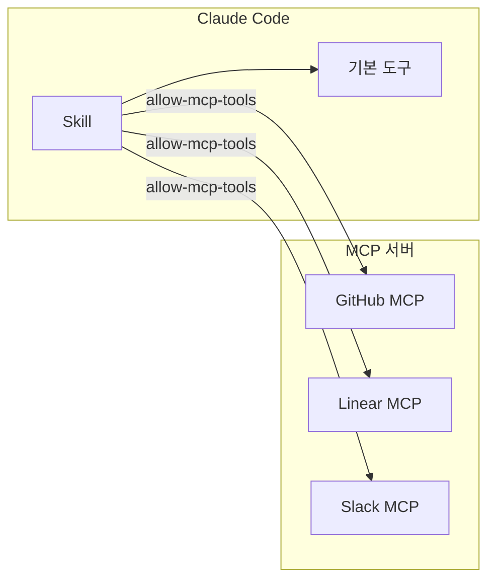

### allow-mcp-tools 설정

`.claude/settings.json`에 MCP 서버가 등록되어 있어야 한다:

```json
{
  "mcpServers": {
    "github": {
      "command": "npx",
      "args": ["-y", "@modelcontextprotocol/server-github"],
      "env": {
        "GITHUB_PERSONAL_ACCESS_TOKEN": "${GITHUB_TOKEN}"
      }
    },
    "linear": {
      "command": "npx",
      "args": ["-y", "@modelcontextprotocol/server-linear"],
      "env": {
        "LINEAR_API_KEY": "${LINEAR_API_KEY}"
      }
    }
  }
}
```

스킬에서 MCP 도구 허용:

```yaml
---
name: pr-create
allow-mcp-tools:
  - github           # GitHub MCP 서버의 도구 허용
allowed-tools:
  - Read
  - Glob
  - Grep
  - Bash(command:git *)
---
```

### MCP 도구와 기본 도구 조합

MCP 도구와 기본 도구를 함께 사용하여 강력한 워크플로우를 구성한다:

```yaml
---
name: pr-review-and-comment
description: PR 변경사항을 리뷰하고 GitHub에 리뷰 코멘트를 작성한다.
model: sonnet
allowed-tools:
  - Read
  - Glob
  - Grep
  - Bash(command:git *)
  - Bash(command:npm run lint*)
  - Bash(command:npm run test*)
allow-mcp-tools:
  - github
---

# PR 리뷰 및 코멘트

## 대상
$ARGUMENTS 로 지정된 PR 번호를 리뷰한다.

## 절차
1. GitHub MCP로 PR 정보 가져오기 (제목, 설명, 변경 파일)
2. 변경된 파일을 로컬에서 Read로 분석
3. 린트 및 테스트 실행
4. 리뷰 코멘트 작성
5. GitHub MCP로 PR에 리뷰 제출

## 리뷰 기준
- 코드 품질 (네이밍, 구조, 복잡도)
- 보안 (OWASP Top 10)
- 성능 (N+1, 메모리 누수)
- 테스트 커버리지
```

### 실전 예시: GitHub MCP + Skills

#### PR 자동 생성 스킬

```yaml
---
name: pr
description: 현재 브랜치의 변경사항으로 GitHub PR을 생성한다.
allowed-tools:
  - Read
  - Glob
  - Grep
  - Bash(command:git *)
allow-mcp-tools:
  - github
context:
  - "!`git log --oneline main..HEAD`"
  - "!`git diff --stat main..HEAD`"
---

# PR 생성

## 현재 상태
- 브랜치: $GIT_BRANCH
- base: main

## 절차
1. `main..HEAD` 커밋 분석
2. 변경 파일 목록 확인
3. PR 제목 생성 (Conventional Commits 기반)
4. PR 본문 작성:
   - 변경 사항 요약
   - 테스트 방법
   - 관련 이슈 링크
5. GitHub MCP로 PR 생성
6. PR URL을 사용자에게 보고

## PR 제목 규칙
- 50자 이내
- `feat:`, `fix:`, `refactor:` 등 Conventional Commits prefix
- 한국어 설명
```

#### 이슈 기반 작업 스킬

```yaml
---
name: issue-work
description: GitHub Issue를 가져와서 작업 계획을 수립하고 브랜치를 생성한다.
mode: plan
allowed-tools:
  - Read
  - Glob
  - Grep
  - Bash(command:git *)
allow-mcp-tools:
  - github
---

# Issue 기반 작업

## 절차
1. GitHub MCP로 $ARGUMENTS 이슈 가져오기
2. 이슈 내용 분석 (요구사항, 수용 기준)
3. 관련 코드 조사
4. 작업 계획 수립
5. 브랜치 생성: `feature/issue-{번호}-{요약}`
6. 계획을 사용자에게 제시 (plan 모드)
7. 승인 후 작업 시작
```

> 실전 팁: MCP 도구는 외부 서비스와 통신하므로 네트워크 에러 처리를 Body에 명시해라. "GitHub API 호출 실패 시 로컬 git log로 대체한다" 같은 폴백 지시를 추가하면 스킬의 안정성이 높아진다.

---

## 10. 배포 및 공유

### 프로젝트 레벨 공유 (Git 커밋)

가장 기본적인 공유 방법. `.claude/` 디렉토리를 Git에 커밋하면 팀 전체가 동일한 스킬을 사용한다.

```bash
# 스킬 파일 추가
git add .claude/skills/ .claude/agents/

# 커밋
git commit -m "feat: 코드 리뷰 및 테스트 생성 스킬 추가"

# 푸시
git push origin main
```

**디렉토리 구조 권장**:

```
.claude/
├── skills/
│   ├── review.md        # 코드 리뷰
│   ├── test.md          # 테스트 생성
│   ├── commit.md        # 커밋 메시지
│   ├── deploy.md        # 배포
│   └── lint.md          # 린팅
├── agents/
│   ├── researcher.md    # 리서치 에이전트
│   └── tester.md        # 테스트 에이전트
├── settings.json        # Claude Code 설정
└── CLAUDE.md            # 프로젝트 가이드
```

**.gitignore 설정**: 민감 정보가 포함될 수 있는 파일을 제외한다.

```gitignore
# .claude/ 중 공유하지 않을 것
.claude/settings.local.json
.claude/credentials
.claude/cache/
```

### 조직 레벨 공유

여러 프로젝트에서 공통으로 사용하는 스킬은 별도 저장소로 관리한다:

```
org-claude-skills/
├── skills/
│   ├── org-review.md        # 조직 코드 리뷰 표준
│   ├── org-security.md      # 조직 보안 검사 표준
│   └── org-deploy.md        # 조직 배포 절차
├── agents/
│   ├── org-compliance.md    # 컴플라이언스 검사
│   └── org-architecture.md  # 아키텍처 검토
└── README.md
```

각 프로젝트에서 서브모듈이나 복사를 통해 가져온다:

```bash
# Git 서브모듈로 추가
git submodule add https://github.com/org/claude-skills.git .claude/org-skills

# 또는 심볼릭 링크
ln -s ../org-claude-skills/skills/org-review.md .claude/skills/org-review.md
```

### 스킬 버전 관리

Git 이력으로 스킬 변경을 추적한다:

```bash
# 스킬 변경 이력 확인
git log --oneline .claude/skills/

# 특정 스킬의 diff
git diff HEAD~1 .claude/skills/review.md

# 이전 버전으로 복원
git checkout HEAD~3 -- .claude/skills/review.md
```

**버전 태깅**:

```bash
# 스킬 세트 버전 태깅
git tag -a skills-v1.0 -m "초기 스킬 세트: review, test, commit"
git tag -a skills-v1.1 -m "deploy 스킬 추가, review 스킬 개선"
```

### 스킬 테스트 방법

스킬을 배포하기 전에 테스트하는 방법:

#### 1. 직접 호출 테스트

```bash
# 스킬 호출
/review src/app.ts

# 인자 없이 호출
/review

# 다양한 인자로 테스트
/review src/auth/
/review "모든 컨트롤러"
```

#### 2. 시나리오 테스트

스킬의 주요 사용 시나리오를 체크리스트로 만든다:

```markdown
## review.md 테스트 체크리스트

- [ ] 단일 파일 리뷰: `/review src/app.ts`
- [ ] 디렉토리 리뷰: `/review src/auth/`
- [ ] staged 변경 리뷰: `/review` (인자 없음)
- [ ] 존재하지 않는 파일: `/review nonexistent.ts`
- [ ] 빈 diff: (변경사항 없을 때)
- [ ] 대용량 파일: (1000줄 이상)
- [ ] 바이너리 파일: (이미지 등)
```

#### 3. 에이전트 스킬 테스트

```bash
# Task 도구로 에이전트 호출 테스트
# Claude Code에서 직접:
"researcher 에이전트를 사용해서 auth 모듈의 의존성을 조사해줘"
```

### 스킬 디버깅 팁

스킬이 예상대로 동작하지 않을 때:

#### 문법 확인

```yaml
# YAML Frontmatter 유효성 검사
# 온라인 YAML 검증기 또는:
# python -c "import yaml; yaml.safe_load(open('.claude/skills/review.md').read().split('---')[1])"
```

자주 발생하는 YAML 에러:

```yaml
# BAD: 콜론 뒤 공백 없음
name:review

# GOOD: 콜론 뒤 공백
name: review

# BAD: 들여쓰기 불일치
allowed-tools:
  - Read
 - Glob           # 들여쓰기 1칸 (다른 항목은 2칸)

# GOOD: 들여쓰기 일관
allowed-tools:
  - Read
  - Glob

# BAD: 특수문자 이스케이프 누락
context:
  - !`git log`     # YAML이 !를 태그로 해석

# GOOD: 따옴표로 감싸기
context:
  - "!`git log`"
```

#### 컨텍스트 확인

```yaml
# 디버깅용: 로딩된 컨텍스트 확인 지시사항 추가
---
name: debug-context
context:
  - "!`echo '=== 명령 실행 성공 ==='`"
  - "!`ls -la src/ | head -5`"
---

# 디버그

아래 내용을 그대로 출력해줘:
1. $ARGUMENTS 값
2. $GIT_BRANCH 값
3. $CWD 값
4. 로딩된 컨텍스트 파일 목록
```

#### 권한 에러 확인

스킬 실행 중 도구 사용이 거부되면:

```
# 에러 메시지 예시:
# "Tool 'Write' is not allowed for this skill"

# 원인: allowed-tools에 Write가 없음
# 해결: allowed-tools에 Write 추가
allowed-tools:
  - Read
  - Write    # 추가
  - Glob
```

> 실전 팁: 새 스킬을 만들 때 Body 첫 줄에 "먼저 사용 가능한 도구 목록과 로딩된 컨텍스트를 보고하라"는 임시 지시를 추가하면 디버깅이 쉽다. 정상 작동 확인 후 제거한다.

---

## 11. 모범 사례 및 안티패턴

### DO: 권장 사항

#### 명확한 이름과 설명

```yaml
# GOOD: 목적이 분명한 이름과 설명
---
name: security-audit
description: >
  OWASP Top 10 기준으로 코드의 보안 취약점을 검사한다.
  SQL Injection, XSS, CSRF, 인증 누락을 중점 검토한다.
---
```

```yaml
# BAD: 모호한 이름, 설명 없음
---
name: check
---
```

#### 최소 권한

```yaml
# GOOD: 리뷰에 필요한 최소 도구만
---
name: review
allowed-tools:
  - Read
  - Glob
  - Grep
---
```

```yaml
# BAD: 리뷰인데 모든 도구 허용
---
name: review
# allowed-tools 생략 = 모든 도구 허용
---
```

#### 컨텍스트 최적화

```yaml
# GOOD: 필요한 파일만 정확히 지정
context:
  - CLAUDE.md
  - src/config.ts
  - "!`git diff --cached --stat`"
context-limit: 30000
```

```yaml
# BAD: 모든 파일 로딩
context:
  - "**/*"
```

#### 구조화된 Body

```markdown
# GOOD: 역할, 절차, 규칙, 출력이 명확

## 역할
보안 전문가로서 코드를 검토한다.

## 절차
1. 입력 검증 확인
2. 인증/인가 확인
3. 데이터 암호화 확인

## 규칙
- 추측하지 않는다
- 코드 근거를 제시한다

## 출력 형식
[심각도] 파일:라인 - 설명
```

```markdown
# BAD: 비구조화된 자유 형식

코드를 리뷰해줘. 보안이랑 성능도 보고.
문제 있으면 알려줘.
```

#### 에러 처리 지시

```markdown
## 예외 상황
- 파일을 찾을 수 없으면: "지정된 파일이 존재하지 않습니다" 보고
- 테스트가 없으면: 테스트 작성을 권장하는 메시지 출력
- Git 정보를 가져올 수 없으면: 파일 시스템 기반으로 분석
```

### DON'T: 안티패턴

#### 과도한 권한

```yaml
# ANTI-PATTERN: 분석 스킬에 Write/Bash 허용
---
name: analyze
allowed-tools:
  - Read
  - Write        # 분석에 쓰기가 필요한가?
  - Edit         # 분석에 편집이 필요한가?
  - Bash         # 모든 명령 실행 가능 (위험)
  - Task
---
```

#### 불명확한 지시

```markdown
# ANTI-PATTERN: 모호한 지시사항

적절히 처리해주세요.
좋은 코드로 만들어주세요.
문제가 있으면 고쳐주세요.
```

#### 하드코딩된 경로

```yaml
# ANTI-PATTERN: 절대 경로 하드코딩
context:
  - /Users/john/project/src/config.ts         # 다른 환경에서 작동 안 함
  - /home/ubuntu/app/package.json             # 다른 사용자 환경 안 됨
```

```yaml
# GOOD: 프로젝트 루트 기준 상대 경로
context:
  - src/config.ts
  - package.json
```

#### 과도한 컨텍스트

```yaml
# ANTI-PATTERN: 불필요하게 넓은 컨텍스트
context:
  - "**/*"                                     # 모든 파일
  - "!`find . -type f`"                       # 모든 파일 목록
  - "!`cat node_modules/.package-lock.json`"  # 불필요한 대용량 파일
```

#### max-turns 미설정 + opus

```yaml
# ANTI-PATTERN: 비용 폭증 위험
---
name: auto-everything
model: opus
# max-turns 미설정 = 무제한
---

모든 파일을 검토하고 모든 문제를 수정해줘.
```

```yaml
# GOOD: 비용 제어
---
name: focused-review
model: opus
max-turns: 15
---
```

### 스킬 설계 체크리스트

새 스킬을 만들 때 아래 체크리스트를 확인한다:

```markdown
## 스킬 설계 체크리스트

### 기본
- [ ] name이 목적을 명확히 전달하는가?
- [ ] description이 충분히 구체적인가?
- [ ] Body에 역할/절차/규칙/출력이 정의되어 있는가?

### 권한
- [ ] allowed-tools가 최소 권한 원칙을 따르는가?
- [ ] Bash 도구에 패턴 제한이 있는가?
- [ ] MCP 도구가 정말 필요한가?

### 컨텍스트
- [ ] 필요한 파일만 context에 포함되는가?
- [ ] 대규모 프로젝트에서 context-limit이 설정되어 있는가?
- [ ] 동적 컨텍스트 명령이 빠르게 실행되는가?

### 비용
- [ ] model이 작업 복잡도에 맞는가?
- [ ] max-turns가 적절히 설정되어 있는가?
- [ ] opus + 높은 max-turns 조합을 피했는가?

### 이식성
- [ ] 절대 경로가 사용되지 않았는가?
- [ ] 특정 OS에 의존하는 명령이 없는가?
- [ ] 팀원의 환경에서도 작동하는가?

### 사용성
- [ ] $ARGUMENTS가 없을 때의 기본 동작이 정의되어 있는가?
- [ ] 에러 상황의 처리가 명시되어 있는가?
- [ ] 출력 형식이 일관적인가?
```

> 실전 팁: 팀에서 새 스킬을 PR로 제출할 때 이 체크리스트를 PR 템플릿에 포함시켜라. 코드 리뷰처럼 스킬 리뷰도 품질을 높이는 효과적인 방법이다.

---

## 12. 관련 문서 링크

### 이 지식 센터의 다른 문서

Skills 종합 가이드와 함께 아래 문서를 참고하면 더 깊이 있는 활용이 가능하다:

| 문서 | 설명 | 경로 |
|------|------|------|
| Skills 생성 실전 가이드 | 스텝바이스텝 스킬 생성 워크스루 | `01-Skills-생성-실전-가이드.md` |
| Skills 고급 패턴 | 멀티에이전트 조합, 체이닝, 조건부 실행 패턴 | `02-Skills-고급-패턴.md` |
| Skills 실전 예시 모음 | 카테고리별 실전 스킬 50+ 예시 | `03-Skills-실전-예시-모음.md` |

### MCP 지식 센터 교차 참조

Skills에서 MCP 도구를 활용할 때 참고:

| 문서 | 설명 | 경로 |
|------|------|------|
| MCP 종합 가이드 | MCP 프로토콜 개요, 서버 설정 | `../mcp/README.md` |

### 바이브코딩 도구 가이드

| 문서 | 설명 | 경로 |
|------|------|------|
| Claude Code 바이브코딩 가이드 | Claude Code 전반적 사용법 | `../tools/Claude-Code-바이브코딩-가이드.md` |
| AI 코딩 도구 실전 사용법 | Claude Code, Kimi, Codex 비교 | `../tools/AI-코딩-도구-실전-사용법.md` |

### 외부 참조

- Anthropic 공식 문서 - Claude Code Skills
- Claude Code GitHub 저장소
- Model Context Protocol (MCP) 공식 사이트

---

## 부록 A: 빠른 시작 가이드

### 5분 만에 첫 스킬 만들기

#### Step 1: 디렉토리 생성

```bash
mkdir -p .claude/skills
```

#### Step 2: 스킬 파일 작성

```bash
cat > .claude/skills/hello.md << 'EOF'
---
name: hello
description: 프로젝트 상태를 빠르게 확인한다.
allowed-tools:
  - Read
  - Glob
  - Bash(command:git status)
  - Bash(command:git log --oneline -5)
context:
  - package.json
---

# 프로젝트 상태 확인

아래 항목을 확인하고 간결하게 보고한다:

1. 프로젝트 이름과 버전 (package.json)
2. Git 상태 (변경된 파일)
3. 최근 5개 커밋
4. 파일 수 (src/ 디렉토리)

## 출력 형식
```
프로젝트: {이름} v{버전}
Git 상태: {변경 파일 수}개 파일 변경
최근 커밋: {최신 커밋 메시지}
소스 파일: {파일 수}개
```
EOF
```

#### Step 3: 호출

```bash
claude
# Claude Code 내에서:
/hello
```

#### Step 4: 개선

실행 결과를 보고 Body를 수정하거나 도구를 추가한다.

### 자주 쓰는 스킬 템플릿

#### 코드 분석 템플릿

```yaml
---
name: [분석 이름]
description: [분석 설명]
model: sonnet
allowed-tools:
  - Read
  - Glob
  - Grep
context:
  - CLAUDE.md
  - [관련 설정 파일]
---

# [분석 제목]

## 대상
$ARGUMENTS 로 지정된 코드를 분석한다.

## 분석 기준
1. [기준 1]
2. [기준 2]
3. [기준 3]

## 출력 형식
[형식 정의]
```

#### 코드 생성 템플릿

```yaml
---
name: [생성 이름]
description: [생성 설명]
model: sonnet
allowed-tools:
  - Read
  - Write
  - Glob
  - Grep
context:
  - CLAUDE.md
  - [기존 코드 패턴 파일]
---

# [생성 제목]

## 대상
$ARGUMENTS 를 기반으로 코드를 생성한다.

## 생성 규칙
1. 프로젝트 컨벤션 준수 (CLAUDE.md 참조)
2. [규칙 2]
3. [규칙 3]

## 파일 위치
[경로 규칙]

## 생성 절차
1. [단계 1]
2. [단계 2]
3. [단계 3]
```

#### 자동화 워크플로우 템플릿

```yaml
---
name: [워크플로우 이름]
description: [워크플로우 설명]
model: sonnet
mode: plan
allowed-tools:
  - Read
  - Write
  - Edit
  - Glob
  - Grep
  - Bash(command:[허용 명령])
max-turns: [적절한 턴 수]
context:
  - CLAUDE.md
  - "!`[동적 컨텍스트 명령]`"
---

# [워크플로우 제목]

## 현재 상태
- 브랜치: $GIT_BRANCH
- 날짜: $CURRENT_DATE

## 계획 (plan 모드)
먼저 아래를 분석하여 실행 계획을 제시한다:
1. [분석 항목 1]
2. [분석 항목 2]

## 실행 (승인 후)
1. [실행 단계 1]
2. [실행 단계 2]
3. [검증 단계]

## 성공 기준
- [기준 1]
- [기준 2]

## 롤백 방법
- [롤백 절차]
```

---

## 부록 B: Frontmatter 필드 빠른 참조표

```
┌─────────────────────────────────────────────────────────────────────┐
│                    SKILL.md Frontmatter 빠른 참조                    │
├──────────────────┬──────────┬─────────┬──────────────────────────────┤
│ 필드             │ 타입     │ 필수    │ 설명                         │
├──────────────────┼──────────┼─────────┼──────────────────────────────┤
│ name             │ string   │ Yes     │ 스킬 표시 이름               │
│ description      │ string   │ No      │ 스킬 설명                    │
│ model            │ string   │ No      │ opus / sonnet / haiku        │
│ allowed-tools    │ string[] │ No      │ 허용 도구 목록               │
│ context          │ string[] │ No      │ 컨텍스트 파일/패턴/명령      │
│ context-limit    │ number   │ No      │ 컨텍스트 토큰 상한           │
│ allow-mcp-tools  │ string[] │ No      │ MCP 서버 도구 허용           │
│ max-turns        │ number   │ No      │ 최대 에이전트 턴 수          │
│ mode             │ string   │ No      │ plan / acceptEdits           │
└──────────────────┴──────────┴─────────┴──────────────────────────────┘
```

## 부록 C: String Substitution 빠른 참조표

```
┌─────────────────────────────────────────────────────────────────────┐
│                   String Substitution 빠른 참조                     │
├──────────────────┬──────────────────────────────────────────────────┤
│ 변수             │ 치환 내용                                        │
├──────────────────┼──────────────────────────────────────────────────┤
│ $ARGUMENTS       │ /command 뒤의 사용자 입력 인자                   │
│ $SKILL_NAME      │ Frontmatter의 name 값                           │
│ $CWD             │ 현재 작업 디렉토리 절대 경로                     │
│ $GIT_STATUS      │ git status --short 결과                         │
│ $GIT_BRANCH      │ 현재 Git 브랜치 이름                            │
│ $GIT_DIFF        │ git diff --cached (staged 변경)                 │
│ $GIT_LOG         │ 최근 커밋 로그                                   │
│ $CURRENT_DATE    │ 현재 날짜 (YYYY-MM-DD)                          │
└──────────────────┴──────────────────────────────────────────────────┘
```

## 부록 D: 도구 권한 빠른 참조표

```
┌─────────────────────────────────────────────────────────────────────┐
│                     도구 권한 레벨 참조                              │
├───────────┬─────────────────────────────────────────────────────────┤
│ 레벨      │ allowed-tools                                          │
├───────────┼─────────────────────────────────────────────────────────┤
│ Read-only │ Read, Glob, Grep                                       │
│ +분석     │ + Bash(command:npm run lint*), Bash(command:npm test*)  │
│ +쓰기     │ + Write, Edit                                          │
│ +자동화   │ + Bash, Task                                           │
│ +외부     │ + allow-mcp-tools: [서버명]                             │
│ 전체      │ (생략 = 모든 도구 허용)                                 │
└───────────┴─────────────────────────────────────────────────────────┘
```

---

## 부록 E: 스킬 카테고리별 모범 예시

### 개발 워크플로우

| 스킬 | 설명 | 핵심 도구 | 권장 모델 |
|------|------|-----------|-----------|
| `/review` | 코드 리뷰 | Read, Glob, Grep | sonnet |
| `/commit` | 커밋 메시지 생성 | Read, Bash(git) | sonnet |
| `/test` | 테스트 생성 | Read, Write, Bash(npm) | sonnet |
| `/lint` | 린트 수정 | Read, Edit, Bash(npm) | haiku |
| `/doc` | 문서 생성 | Read, Write, Glob | sonnet |

### 프로젝트 관리

| 스킬 | 설명 | 핵심 도구 | 권장 모델 |
|------|------|-----------|-----------|
| `/pr` | PR 생성 | Read, Bash(git), MCP(github) | sonnet |
| `/changelog` | Changelog 생성 | Read, Bash(git) | sonnet |
| `/release` | 릴리스 노트 | Read, Bash(git), MCP(github) | sonnet |
| `/status` | 프로젝트 상태 | Read, Glob, Bash(git) | haiku |

### 코드 품질

| 스킬 | 설명 | 핵심 도구 | 권장 모델 |
|------|------|-----------|-----------|
| `/security` | 보안 검사 | Read, Glob, Grep | opus |
| `/perf` | 성능 분석 | Read, Glob, Grep | sonnet |
| `/deps` | 의존성 검사 | Read, Bash(npm) | haiku |
| `/complexity` | 복잡도 분석 | Read, Glob, Grep | sonnet |

### 유지보수

| 스킬 | 설명 | 핵심 도구 | 권장 모델 |
|------|------|-----------|-----------|
| `/migrate` | 마이그레이션 | Read, Write, Edit, Bash | opus |
| `/refactor` | 리팩토링 | Read, Write, Edit, Glob | opus |
| `/cleanup` | 코드 정리 | Read, Edit, Glob, Grep | sonnet |
| `/upgrade` | 의존성 업그레이드 | Read, Edit, Bash(npm) | sonnet |

---

## 부록 F: 트러블슈팅 FAQ

### Q: 스킬이 인식되지 않는다

**A**: 확인 사항:
1. 파일이 `.claude/skills/` 또는 `.claude/agents/`에 있는지
2. 파일 확장자가 `.md`인지
3. YAML Frontmatter가 `---`로 올바르게 감싸져 있는지
4. `name` 필드가 존재하는지

```bash
# 파일 위치 확인
ls -la .claude/skills/

# Frontmatter 문법 확인 (첫 번째 --- ~ 두 번째 ---)
head -20 .claude/skills/review.md
```

### Q: 컨텍스트가 로딩되지 않는다

**A**: 확인 사항:
1. 파일 경로가 프로젝트 루트 기준 상대 경로인지
2. 동적 컨텍스트 명령이 `"!`command`"` 형식인지
3. 동적 명령이 실행 가능한지 (직접 터미널에서 테스트)

```bash
# 동적 컨텍스트 명령 테스트
git diff --cached --stat
cat package.json
```

### Q: 도구 사용이 거부된다

**A**: `allowed-tools`에 해당 도구가 포함되어 있는지 확인:
1. Bash 명령이면 패턴이 일치하는지
2. MCP 도구이면 `allow-mcp-tools`에 서버가 포함되어 있는지
3. `allowed-tools`를 생략했다면 모든 도구가 허용됨

### Q: $ARGUMENTS가 빈 문자열이다

**A**: `/command` 뒤에 인자를 전달하지 않으면 `$ARGUMENTS`는 빈 문자열이다. Body에서 빈 경우의 기본 동작을 정의해야 한다:

```markdown
## 대상
$ARGUMENTS 가 지정되면 해당 경로를 대상으로 한다.
인자가 없으면 전체 프로젝트를 대상으로 한다.
```

### Q: 스킬 실행이 너무 오래 걸린다

**A**: 확인 사항:
1. `model`이 작업에 비해 과도하지 않은지 (haiku로 충분한 작업에 opus 사용)
2. `context`가 너무 넓지 않은지 (`**/*` 대신 구체적 패턴)
3. `context-limit`이 설정되어 있는지
4. `max-turns`가 너무 높지 않은지
5. 동적 컨텍스트 명령이 빠르게 실행되는지

### Q: 같은 이름의 스킬이 충돌한다

**A**: `.claude/skills/`와 `.claude/agents/`는 별도 네임스페이스이므로 같은 이름이 가능하다. 하지만 혼란을 피하기 위해 다른 이름을 사용하는 것을 권장한다:

```
.claude/skills/review.md     → /review (사용자 호출)
.claude/agents/reviewer.md   → subagent_type="reviewer" (에이전트 호출)
```

---

> 이 문서는 Claude Code Skills 시스템의 종합 참조 가이드이다. 최신 정보는 Anthropic 공식 문서를 함께 참고하라. 스킬 작성에 대한 상세 워크스루는 `01-Skills-생성-실전-가이드.md`를, 고급 패턴은 `02-Skills-고급-패턴.md`를, 카테고리별 실전 예시는 `03-Skills-실전-예시-모음.md`를 참고한다.
