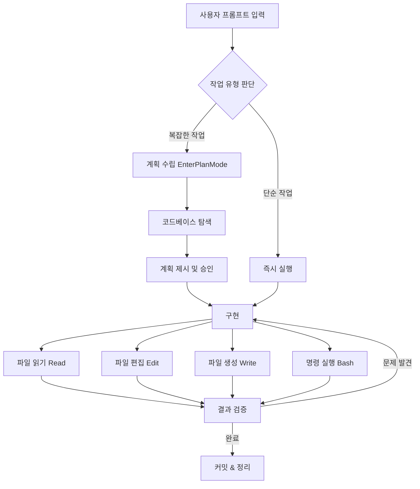
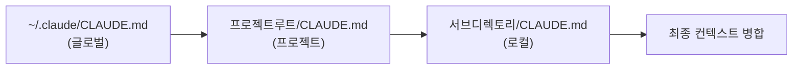
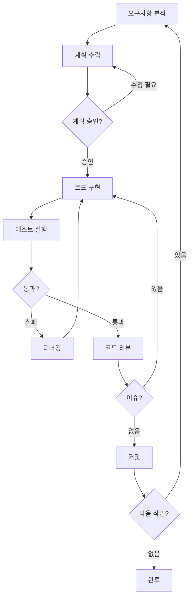
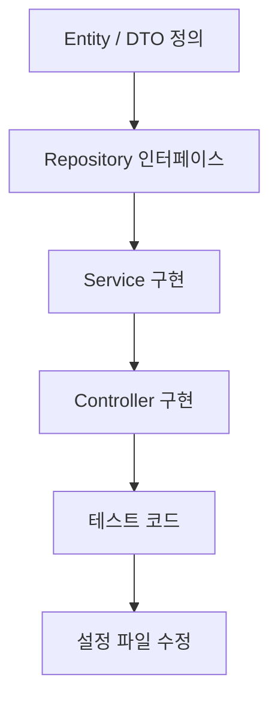
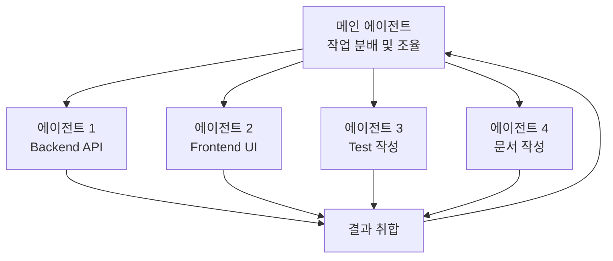
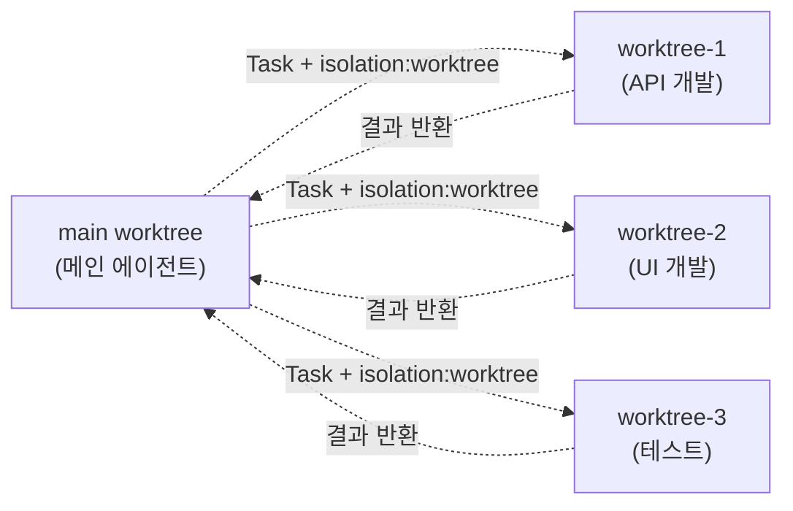
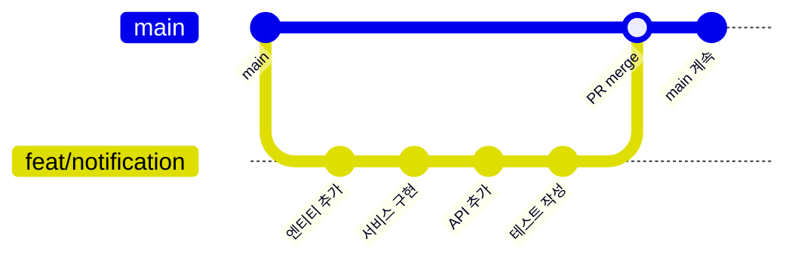
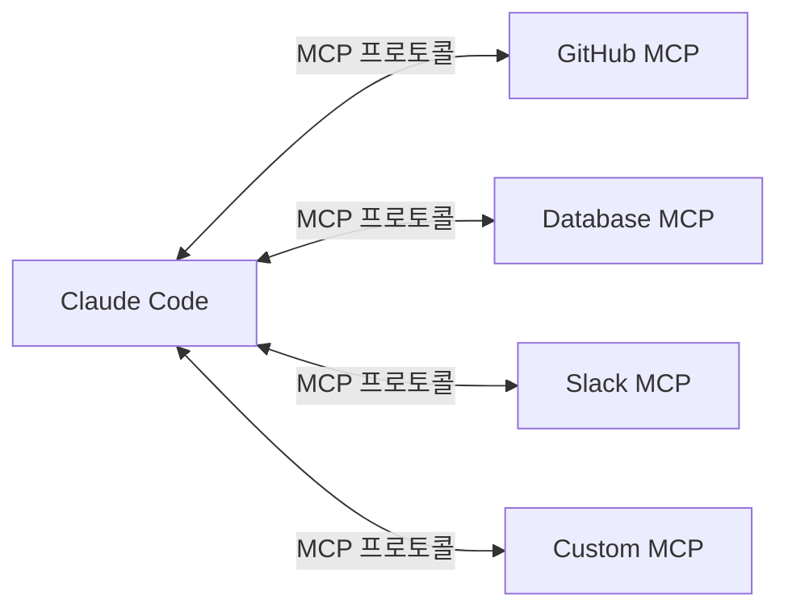

# Claude Code 바이브코딩 가이드

> Anthropic의 공식 CLI 도구 Claude Code를 활용한 바이브코딩 실전 가이드.
> 설치부터 멀티에이전트 오케스트레이션까지, 생산성 극대화를 위한 포괄적 가이드.

---

## 목차

1. [Claude Code 개요](#1-claude-code-개요)
2. [CLAUDE.md 작성법](#2-claudemd-작성법)
3. [바이브코딩 워크플로우](#3-바이브코딩-워크플로우)
4. [프롬프트 엔지니어링](#4-프롬프트-엔지니어링)
5. [멀티파일 작업](#5-멀티파일-작업)6. [멀티에이전트 오케스트레이션](#6-멀티에이전트-오케스트레이션)
7. [Git 워크플로우](#7-git-워크플로우)
8. [MCP 서버 연동](#8-mcp-서버-연동)
9. [디버깅 & 트러블슈팅](#9-디버깅--트러블슈팅)
10. [실전 예시 프롬프트 모음](#10-실전-예시-프롬프트-모음)
11. [모범 사례 & 안티패턴](#11-모범-사례--안티패턴)
12. [참고 자료](#12-참고-자료)

---

## 1. Claude Code 개요

### Claude Code란?

Claude Code는 Anthropic이 개발한 **에이전틱 코딩 도구**다. 터미널에서 직접 실행되며 코드베이스를 이해하고, 파일을 편집하고, 명령어를 실행하는 자율적 에이전트로 작동한다. IDE 플러그인과 달리 CLI 기반이므로 어떤 개발 환경에서도 사용 가능하다.

**핵심 특징**:
- 코드베이스 전체를 컨텍스트로 이해
- 파일 읽기/편집/생성 도구 내장
- Git 작업 자동화 (커밋, PR, 브랜치)
- 테스트 실행 및 디버깅
- 멀티에이전트 병렬 작업 지원
- MCP 프로토콜로 외부 도구 확장

### 설치

```bash
# npm으로 전역 설치
npm install -g @anthropic-ai/claude-code

# 설치 확인
claude --version

# 초기 인증 설정
claude
# → Anthropic API 키 또는 OAuth 로그인 진행
```

### 기본 명령어

```bash
# 대화형 모드 시작
claude

# 한 줄 명령으로 바로 실행
claude "이 프로젝트의 구조를 분석해줘"

# 파이프 입력
cat error.log | claude "이 에러를 분석하고 수정 방안을 제시해줘"

# 특정 모델 지정
claude --model claude-sonnet-4-6

# 이전 대화 이어하기
claude --continue

# 마지막 대화 재개
claude --resume
```

### 슬래시 명령어

대화 중 사용하는 내부 명령어:

| 명령어 | 설명 |
|--------|------|
| `/help` | 도움말 표시 |
| `/clear` | 컨텍스트 초기화 |
| `/compact` | 대화 내용 압축 (토큰 절약) |
| `/cost` | 현재 세션 비용 확인 |
| `/model` | 모델 변경 |
| `/permissions` | 권한 설정 확인/변경 |
| `/memory` | CLAUDE.md 편집 |
| `/review` | 코드 리뷰 요청 |
| `/pr-comments` | PR 코멘트 확인 |

### 권한 모드

Claude Code는 도구 호출 시 권한을 확인한다:

```
┌─────────────────────────────────────────────┐
│           Permission Modes                   │
├─────────────────────────────────────────────┤
│  default      사용자 승인 필요 (기본값)       │
│  acceptEdits  파일 편집 자동 승인             │
│  plan         계획 수립 후 승인 요청          │
│  bypassPermissions  모든 도구 자동 승인       │
│  dontAsk      묻지 않고 실행                 │
└─────────────────────────────────────────────┘
```

```bash
# 권한 모드를 지정하여 실행
claude --dangerously-skip-permissions  # 모든 권한 스킵 (주의)
```

### Claude Code 워크플로우 전체 흐름



---

## 2. CLAUDE.md 작성법

### CLAUDE.md란?

CLAUDE.md는 Claude Code에게 프로젝트의 컨텍스트, 규칙, 코딩 컨벤션을 전달하는 설정 파일이다. 프로젝트 루트에 위치하며, Claude Code가 세션을 시작할 때 자동으로 읽는다.

**CLAUDE.md 탐색 우선순위**:



1. **글로벌**: `~/.claude/CLAUDE.md` — 모든 프로젝트에 적용되는 규칙
2. **프로젝트**: 프로젝트 루트 `CLAUDE.md` — 해당 프로젝트 전용 규칙
3. **로컬**: 서브디렉토리 `CLAUDE.md` — 특정 모듈/패키지 전용 규칙

### 효과적인 CLAUDE.md 구조

```markdown
# CLAUDE.md - [프로젝트명] 개발 가이드

## 1. 프로젝트 개요
- 프로젝트 목적과 도메인 설명
- 기술 스택 테이블 (프레임워크, 버전, 용도)
- 디렉토리 구조 트리

## 2. 코딩 컨벤션
- 네이밍 규칙 (파일, 변수, 함수, 컴포넌트)
- import 순서
- 코드 포맷팅 규칙

## 3. 보안 필수사항
- 인증/인가 패턴
- 입력 검증 규칙
- 환경 변수 관리

## 4. 아키텍처 규칙
- 레이어 구조 (Controller → Service → Repository)
- 모듈 간 의존성 방향
- 상태 관리 패턴

## 5. 테스트 규칙
- 테스트 파일 위치 및 네이밍
- 필수 테스트 커버리지
- 모킹 패턴

## 6. Gotchas (주의사항)
- 프로젝트 고유 함정/제약
- 알려진 이슈와 우회법
```

### CLAUDE.md 실전 예시

```markdown
# CLAUDE.md - 이커머스 백엔드

## 프로젝트 개요

| 구분 | 기술 | 버전 |
|------|------|------|
| Framework | Spring Boot | 3.3.x |
| Language | Java | 21 |
| Database | PostgreSQL | 16 |
| Cache | Redis | 7.x |
| Message Queue | Kafka | 3.x |

## 코딩 컨벤션

### 네이밍
- Entity: `Order`, `OrderItem` (단수형 PascalCase)
- DTO: `OrderCreateRequest`, `OrderResponse` (접미사로 용도 표시)
- Repository: `OrderRepository` (Entity명 + Repository)
- Service: `OrderService` (도메인명 + Service)

### API 응답 형식
모든 API 응답은 `ApiResponse<T>`로 래핑:
```java
public record ApiResponse<T>(
    boolean success,
    String message,
    T data,
    LocalDateTime timestamp
) {}
```

### 예외 처리
- 비즈니스 예외: `BusinessException` 상속
- 에러 코드: `ErrorCode` enum으로 관리
- GlobalExceptionHandler에서 일괄 처리

## 보안 필수사항
- 모든 사용자 입력에 `@Valid` 적용
- SQL 쿼리 파라미터 바인딩 필수 (문자열 연결 금지)
- 비밀번호: BCrypt 해싱
- JWT 토큰: Access(15분) + Refresh(7일)

## Gotchas
- ⚠️ `OrderStatus` 변경 시 반드시 `OrderStatusHistory`도 함께 저장
- ⚠️ Redis 캐시 키: `order:{orderId}` 형식 준수
- ⚠️ Kafka 메시지 발행 후 트랜잭션 커밋 순서 주의 (Transactional Outbox 패턴 사용)
```

### 글로벌 CLAUDE.md 활용

모든 프로젝트에 공통 적용할 규칙:

```markdown
# ~/.claude/CLAUDE.md

## 공통 규칙
- 한국어로 커밋 메시지 작성
- 모든 커밋에 Co-Authored-By 태그 포함
- 파일 끝에 빈 줄 추가
- console.log / System.out.println 커밋 금지
- TODO 주석에는 반드시 이슈 번호 포함: `// TODO(#123): 설명`
- 환경 변수는 .env.example에 키만 기록
```

---

## 3. 바이브코딩 워크플로우

### 계획 → 구현 → 검증 사이클

바이브코딩의 핵심은 **작업을 작은 단계로 분해**하고 각 단계마다 검증하는 것이다.



### Phase 1: 요구사항 분석

프롬프트로 요구사항을 명확히 전달:

```
이 프로젝트에 사용자 알림 기능을 추가하려고 해.
요구사항:
1. 실시간 알림 (WebSocket)
2. 알림 유형: 주문 상태 변경, 프로모션, 시스템 공지
3. 알림 읽음/안읽음 상태 관리
4. 알림 목록 조회 API (페이지네이션)

먼저 기존 코드를 분석하고, 구현 계획을 세워줘.
코드를 바로 작성하지 말고 계획만 먼저 보여줘.
```

### Phase 2: 계획 수립 (Plan Mode)

Claude Code의 `EnterPlanMode`를 활용:

```
위 계획을 검토했어. 다음 수정사항을 반영해줘:
1. WebSocket 대신 SSE(Server-Sent Events)로 변경
2. 알림 저장은 MongoDB 대신 PostgreSQL + JSONB 사용
3. 배치 알림 발송 기능 추가

수정된 계획을 보여줘.
```

### Phase 3: 단계별 구현

한 번에 전체를 구현하지 않고 단계별로 진행:

```
# 1단계: 알림 엔티티와 Repository
알림 엔티티(Notification)와 Repository를 먼저 만들어줘.
기존 프로젝트의 엔티티 패턴을 따라줘.

# 2단계: 알림 서비스
NotificationService를 구현해줘.
생성, 읽음 처리, 목록 조회 기능을 포함해줘.

# 3단계: API 엔드포인트
알림 관련 REST API를 만들어줘.
기존 컨트롤러 패턴과 응답 형식을 따라줘.

# 4단계: SSE 실시간 알림
SSE 엔드포인트를 추가해줘.
SseEmitter를 사용하고 타임아웃 처리를 포함해줘.
```

### Phase 4: 검증

각 단계 완료 후 검증:

```
지금까지 작성한 코드를 검증해줘:
1. 컴파일 확인 (./gradlew compileJava)
2. 테스트 작성 및 실행
3. 기존 테스트가 깨지지 않는지 확인
4. 코드 리뷰 (보안, 성능 관점)
```

### 워크플로우 관리 패턴

#### 컨텍스트 보존 기법

```bash
# 긴 작업 중 컨텍스트 윈도우가 부족해질 때
/compact  # 대화 압축

# 새 세션에서 이전 작업 이어하기
claude --resume

# 특정 대화 이어하기
claude --continue
```

#### 체크포인트 활용

```
# 중간 저장 요청
지금까지 작업한 내용을 커밋해줘.
커밋 메시지: "feat: 알림 엔티티 및 Repository 구현 (WIP)"

# 이후 이어서 작업
이전 커밋에서 이어서 NotificationService를 구현해줘.
```

---

## 4. 프롬프트 엔지니어링

### Claude Code 전용 프롬프트 패턴

#### 패턴 1: 분석 먼저, 코드 나중에

```
먼저 기존 인증 시스템의 코드를 분석해줘.
관련 파일들을 모두 읽고 현재 구조를 설명해줘.
코드를 수정하기 전에 분석 결과를 보여줘.
```

#### 패턴 2: 기존 패턴 따르기

```
기존 UserService의 패턴을 분석하고,
같은 패턴으로 ProductService를 만들어줘.
네이밍, 에러 처리, 응답 형식을 모두 통일해줘.
```

#### 패턴 3: 단계별 구현 지시

```
다음 순서로 구현해줘:
1단계: 데이터 모델 정의 (먼저 보여주고 승인 받기)
2단계: Repository 레이어
3단계: Service 레이어
4단계: Controller 레이어
5단계: 테스트

각 단계를 완료할 때마다 결과를 보여줘.
```

#### 패턴 4: 제약조건 명시

```
다음 제약조건을 지키면서 리팩토링해줘:
- 기존 API 인터페이스는 변경하지 않을 것
- 테스트 코드는 수정하지 않을 것
- 성능이 저하되지 않을 것
- 새로운 의존성을 추가하지 않을 것
```

#### 패턴 5: 비교 분석 요청

```
현재 캐싱 구현을 분석하고 다음 3가지 개선 방안을 비교해줘:
1. Spring Cache + Caffeine (로컬 캐시)
2. Spring Cache + Redis (분산 캐시)
3. 직접 구현한 캐시 레이어

각 방안의 장단점, 구현 복잡도, 성능 영향을 정리해줘.
코드는 쓰지 말고 분석만 해줘.
```

### Extended Thinking 활용

복잡한 문제에 Claude의 심층 사고 기능을 활용:

```
이 코드에 동시성 이슈가 있는 것 같아.
충분히 시간을 갖고 분석해줘:

1. 현재 코드의 동시성 문제점을 모두 찾아줘
2. 각 문제점의 발생 시나리오를 설명해줘
3. 해결 방안을 제시해줘
4. 데드락 가능성도 검토해줘
```

### /commands 커스텀 명령어

프로젝트별 반복 작업을 자동화:

```bash
# .claude/commands/review.md
프로젝트의 코딩 컨벤션을 기준으로 변경된 파일을 리뷰해줘.
다음을 확인해줘:
1. 네이밍 컨벤션 준수
2. 에러 처리 패턴
3. 보안 취약점
4. 테스트 커버리지
```

```bash
# .claude/commands/test-coverage.md
현재 변경된 파일에 대한 테스트를 확인해줘.
1. 테스트가 없는 변경 사항을 식별
2. 필요한 테스트 코드를 작성
3. 모든 테스트 실행 및 결과 보고
```

```bash
# .claude/commands/api-doc.md
변경된 API 엔드포인트의 문서를 업데이트해줘.
1. 요청/응답 스키마
2. 에러 코드
3. 사용 예시
OpenAPI 형식으로 작성해줘.
```

**커스텀 명령어 사용**:

```bash
# Claude Code 대화 중
/review          # 코드 리뷰 실행
/test-coverage   # 테스트 커버리지 확인
/api-doc         # API 문서 생성
```

### 프롬프트 구조화 기법

#### 마크다운 기반 프롬프트

```markdown
## 작업: 주문 취소 API 구현

### 요구사항
- 주문 상태가 "결제 완료" 또는 "준비 중"일 때만 취소 가능
- 취소 시 결제 환불 프로세스 시작
- 재고 원복 처리

### 기술 제약
- 기존 `OrderService`에 메서드 추가
- `PaymentService.refund()` 호출 필요
- 트랜잭션 내에서 원자적으로 처리

### 참고 코드
`OrderService.updateOrderStatus()` 패턴을 따를 것

### 검증 기준
- 단위 테스트 3개 이상
- 취소 불가능 상태에서의 예외 처리 확인
```

---

## 5. 멀티파일 작업

### Read, Edit, Write 도구 활용 패턴

Claude Code의 핵심 도구 3가지와 활용법:

#### Read: 파일 읽기

```
# 단일 파일 읽기
src/main/java/com/example/OrderService.java를 읽어줘

# 특정 범위 읽기 (큰 파일)
OrderService.java의 100~150번째 줄만 읽어줘

# 여러 파일 동시 읽기
다음 파일들을 읽어줘:
- OrderService.java
- OrderRepository.java
- OrderController.java
```

#### Edit: 정밀한 수정

```
# 특정 메서드 수정
OrderService.java의 createOrder 메서드에서
유효성 검증 로직을 추가해줘.
기존 코드를 최대한 유지하면서 수정해줘.

# 여러 위치 수정
OrderService.java에서:
1. import 영역에 새 import 추가
2. createOrder 메서드에 캐시 무효화 로직 추가
3. 클래스 끝에 새 private 메서드 추가
```

#### Write: 새 파일 생성

```
다음 경로에 새 파일을 만들어줘:
src/main/java/com/example/domain/notification/NotificationService.java

기존 OrderService의 패턴(어노테이션, 생성자 주입, 에러 처리)을 따라줘.
```

### 멀티파일 작업 전략

#### 의존성 순서에 따른 구현



```
다음 순서로 파일을 생성/수정해줘:

1. NotificationEntity.java — 엔티티 정의
2. NotificationRepository.java — JPA Repository
3. NotificationService.java — 비즈니스 로직
4. NotificationController.java — REST API
5. NotificationServiceTest.java — 단위 테스트

의존 관계가 있으니 순서대로 진행하고,
각 파일이 이전 파일을 정확히 참조하는지 확인해줘.
```

#### 대규모 리팩토링 패턴

```
UserService를 리팩토링하려고 해.
현재 600줄인데 역할별로 분리하고 싶어.

계획:
1. 먼저 UserService.java를 전부 읽어줘
2. 메서드를 역할별로 그룹핑해줘
3. 분리 계획을 보여줘 (파일명, 각 파일에 들어갈 메서드)
4. 승인하면 분리 진행
5. 기존 UserService를 호출하던 곳도 모두 수정
6. 테스트가 깨지지 않는지 확인
```

### Glob과 Grep 활용

프로젝트 탐색과 코드 검색:

```
# 파일 패턴으로 검색
src/main/java/**/*Service.java 파일들을 찾아줘

# 코드 내용으로 검색
프로젝트에서 @Transactional을 사용하는 모든 곳을 찾아줘

# 사용처 추적
OrderStatus.CANCELLED를 참조하는 모든 파일을 찾아줘
```

---

## 6. 멀티에이전트 오케스트레이션

### 개요

Claude Code의 Task 도구를 활용하면 여러 에이전트가 **병렬로** 작업할 수 있다. 복잡한 작업을 독립적인 하위 작업으로 분해하여 동시에 처리함으로써 생산성을 극대화한다.



### Task 도구 사용법

#### 기본 사용

```
다음 작업들을 병렬로 처리해줘:

1. src/components/ 디렉토리의 모든 컴포넌트에서
   deprecated API를 사용하는 곳을 찾아줘
2. package.json의 의존성 중 보안 취약점이
   있는 패키지를 확인해줘
3. 현재 테스트 커버리지를 분석해줘
```

#### 에이전트 유형별 활용

| 에이전트 유형 | 용도 | 도구 접근 |
|--------------|------|----------|
| `Explore` | 코드베이스 탐색, 구조 분석 | 읽기 전용 |
| `Plan` | 구현 계획 수립 | 읽기 전용 |
| `general-purpose` | 코드 구현, 파일 편집 | 모든 도구 |
| `Bash` | 명령어 실행, 빌드, 테스트 | Bash 전용 |

### Worktree 기반 병렬 작업

Git worktree를 활용하면 에이전트별 **격리된 작업 환경**을 제공할 수 있다:



**장점**:
- 각 에이전트가 독립된 파일 시스템에서 작업하므로 충돌 없음
- 병렬 수정이 가능하여 처리 속도 향상
- 실패한 작업의 변경사항을 깔끔하게 폐기 가능

### 팀 기반 오케스트레이션

대규모 작업에는 TeamCreate를 활용:

```
# 팀 생성 및 작업 분배 흐름
1. TeamCreate — 팀 생성
2. TaskCreate — 할 일 목록 생성
3. Task (team_name) — 팀원 에이전트 실행
4. TaskUpdate — 작업 상태 업데이트
5. SendMessage — 팀원 간 소통
```

**팀 작업 시나리오 예시**:

```
풀스택 기능을 팀으로 개발할 거야:

팀원 역할:
- backend-dev: REST API + 비즈니스 로직
- frontend-dev: React 컴포넌트 + 상태 관리
- test-writer: E2E 테스트 + 단위 테스트
- doc-writer: API 문서 + README 업데이트

각 팀원이 독립적으로 작업하고,
의존성 있는 부분은 순서를 조율해줘.
```

### 멀티에이전트 작업 분해 전략

#### 독립 작업 식별

병렬 처리가 가능한 작업 유형:

```
✅ 병렬 가능:
- 서로 다른 모듈의 기능 개발
- 독립적인 파일의 리팩토링
- 프론트엔드와 백엔드 동시 개발
- 테스트 작성과 문서 작성
- 여러 마이크로서비스의 독립적 수정

❌ 순차 필요:
- Entity → Repository → Service → Controller
- 스키마 변경 → 마이그레이션 → 코드 수정
- 인터페이스 정의 → 구현체 작성
```

---

## 7. Git 워크플로우

### 커밋 자동화

Claude Code에게 커밋을 요청하는 패턴:

```
# 기본 커밋
지금까지 작업한 내용을 커밋해줘.

# 상세 커밋 메시지 지정
다음 형식으로 커밋해줘:
- 타입: feat
- 범위: notification
- 설명: 실시간 알림 기능 추가

# 분할 커밋
변경 사항을 논리적 단위로 나누어 커밋해줘:
1. 엔티티 + Repository → "feat(notification): 알림 데이터 모델 추가"
2. Service → "feat(notification): 알림 서비스 구현"
3. Controller → "feat(notification): 알림 API 엔드포인트 추가"
4. 테스트 → "test(notification): 알림 기능 테스트 추가"
```

### PR 생성

```
이 브랜치의 변경 사항으로 PR을 만들어줘.
- base: main
- 제목은 70자 이내
- 본문에 변경 사항 요약, 테스트 계획 포함
```

Claude Code가 생성하는 PR 형식:

```markdown
## Summary
- 실시간 알림 기능 추가 (SSE 기반)
- 알림 CRUD API 구현
- 알림 읽음 처리 및 일괄 삭제

## Test plan
- [ ] 알림 생성 API 테스트
- [ ] SSE 연결 및 실시간 수신 확인
- [ ] 알림 목록 페이지네이션 검증
- [ ] 읽음 처리 및 삭제 동작 확인
```

### 브랜치 전략



```
# 브랜치 생성 및 작업
새 브랜치 feat/notification을 만들고 거기서 작업해줘.
작업 완료 후 PR을 생성해줘.
```

### Git 안전 규칙

Claude Code가 준수하는 Git 안전 프로토콜:

| 규칙 | 설명 |
|------|------|
| 새 커밋 생성 | amend 대신 항상 새 커밋 생성 |
| 선택적 스테이징 | `git add -A` 대신 파일 지정 |
| 민감 파일 제외 | `.env`, credentials 파일은 커밋하지 않음 |
| force push 금지 | `--force` 사용 전 사용자 확인 |
| hook 유지 | `--no-verify` 스킵하지 않음 |

---

## 8. MCP 서버 연동

### MCP (Model Context Protocol)란?

MCP는 Claude Code의 기능을 확장하는 프로토콜이다. 외부 도구, 데이터 소스, 서비스를 Claude Code에 연결할 수 있다.



### MCP 서버 설정

프로젝트 루트의 `.claude/settings.json`:

```json
{
  "mcpServers": {
    "github": {
      "command": "npx",
      "args": ["-y", "@modelcontextprotocol/server-github"],
      "env": {
        "GITHUB_TOKEN": "${GITHUB_TOKEN}"
      }
    },
    "postgres": {
      "command": "npx",
      "args": ["-y", "@modelcontextprotocol/server-postgres"],
      "env": {
        "DATABASE_URL": "${DATABASE_URL}"
      }
    },
    "filesystem": {
      "command": "npx",
      "args": [
        "-y", "@modelcontextprotocol/server-filesystem",
        "/path/to/allowed/directory"
      ]
    }
  }
}
```

### 유용한 MCP 서버 목록

| MCP 서버 | 용도 | 설치 |
|----------|------|------|
| `server-github` | GitHub Issues, PR 관리 | `@modelcontextprotocol/server-github` |
| `server-postgres` | PostgreSQL 직접 쿼리 | `@modelcontextprotocol/server-postgres` |
| `server-filesystem` | 특정 디렉토리 접근 | `@modelcontextprotocol/server-filesystem` |
| `server-slack` | Slack 메시지 관리 | `@modelcontextprotocol/server-slack` |
| `server-memory` | 세션 간 메모리 유지 | `@modelcontextprotocol/server-memory` |
| `server-fetch` | 웹 페이지 콘텐츠 가져오기 | `@modelcontextprotocol/server-fetch` |
| `server-puppeteer` | 브라우저 자동화 | `@modelcontextprotocol/server-puppeteer` |

### MCP 활용 예시

#### GitHub MCP로 이슈 기반 개발

```
GitHub 이슈 #42의 내용을 확인하고,
해당 이슈에서 요구하는 기능을 구현해줘.
구현 완료 후 PR을 만들고 이슈를 링크해줘.
```

#### Database MCP로 스키마 기반 개발

```
현재 데이터베이스의 orders 테이블 스키마를 확인하고,
여기에 맞는 Entity 클래스와 Repository를 만들어줘.
```

---

## 9. 디버깅 & 트러블슈팅

### 컨텍스트 윈도우 관리

Claude Code의 컨텍스트 윈도우는 유한하다. 효율적으로 관리하는 방법:

```mermaid
flowchart TD
    A[세션 시작] --> B[CLAUDE.md 로드]
    B --> C[작업 수행]
    C --> D{컨텍스트 부족?}
    D -->|아니오| C
    D -->|예| E{/compact 가능?}
    E -->|예| F[/compact 실행]
    F --> C
    E -->|아니오| G[새 세션 시작]
    G -->|--continue| C
```

#### 토큰 절약 기법

```
# 1. 필요한 파일만 읽기
OrderService.java의 createOrder 메서드만 읽어줘 (100~150줄)

# 2. 탐색은 에이전트에게 위임
Task 도구로 Explore 에이전트에게 코드 검색을 맡기면
메인 컨텍스트를 절약할 수 있음

# 3. 대화 압축
/compact  # 불필요한 대화 이력 압축

# 4. 독립 작업은 서브에이전트 활용
"이 리팩토링을 서브에이전트로 처리해줘"
→ 서브에이전트 컨텍스트에서 처리되어 메인 컨텍스트 보존
```

### 흔한 문제와 해결법

#### 문제 1: Claude Code가 파일을 찾지 못할 때

```
# 정확한 경로 지정
src/main/java/com/example/service/OrderService.java를 읽어줘

# 패턴으로 검색
**/*OrderService* 패턴으로 파일을 찾아줘

# 프로젝트 구조 먼저 확인
src/ 디렉토리의 구조를 보여줘
```

#### 문제 2: 편집이 실패할 때

```
# 고유한 문자열로 편집 위치 특정
Edit 실패 시 old_string을 더 넓은 범위로 지정.
주변 코드를 더 많이 포함하여 고유성 확보.

# 파일을 먼저 읽고 편집
"먼저 이 파일을 읽고 나서 수정해줘"
```

#### 문제 3: 빌드/테스트 실패 반복

```
# 에러 전체를 복사하여 전달
다음 빌드 에러가 발생했어. 원인을 분석하고 수정해줘:
[에러 메시지 전체 붙여넣기]

# 3회 이상 실패 시 전략 변경
"다른 접근 방식으로 해결해줘.
현재 방식이 반복적으로 실패하고 있어."
```

#### 문제 4: 컨텍스트 초과

```
# 새 세션 시작 + 이전 작업 참조
"이전 세션에서 알림 기능을 구현 중이었어.
src/main/java/com/example/notification/ 디렉토리를 확인하고
남은 작업을 이어서 해줘."

# 작업을 더 작은 단위로 분할
"이번 세션에서는 NotificationService만 완성하자.
Controller는 다음 세션에서 할게."
```

### 디버깅 프롬프트 패턴

```
# 에러 분석
이 에러 메시지를 분석해줘:
[에러 로그]

관련 코드를 찾아서 원인을 파악하고 수정해줘.

# 성능 문제
이 API가 느려. 관련 코드를 분석하고:
1. N+1 쿼리 문제 확인
2. 불필요한 데이터 로딩 확인
3. 인덱스 누락 확인
4. 개선 방안 제시

# 동시성 이슈
이 코드에서 동시성 문제가 의심돼:
1. race condition 가능성 분석
2. 공유 자원 접근 패턴 확인
3. 락 사용 여부 확인
4. 수정 방안 제시
```

---

## 10. 실전 예시 프롬프트 모음

### 기능 개발

#### 신규 기능 추가

```
사용자 프로필 이미지 업로드 기능을 추가해줘.

요구사항:
- 이미지 형식: JPG, PNG, WebP (최대 5MB)
- S3에 업로드, 썸네일 자동 생성 (200x200)
- 기존 프로필 이미지 있으면 교체
- 업로드 실패 시 기존 이미지 유지

기존 파일 업로드 코드가 있다면 그 패턴을 따라줘.
없으면 FileUploadService부터 만들어줘.
```

#### CRUD API 생성

```
Product 도메인의 CRUD API를 만들어줘.

Entity 정의:
- id (Long, auto)
- name (String, 필수, 100자 제한)
- price (BigDecimal, 필수, 0 이상)
- description (String, 선택, 1000자 제한)
- category (enum: ELECTRONICS, CLOTHING, FOOD)
- createdAt, updatedAt (자동)

API 목록:
- POST /api/products — 생성
- GET /api/products/{id} — 단건 조회
- GET /api/products — 목록 조회 (페이지네이션, 카테고리 필터)
- PUT /api/products/{id} — 수정
- DELETE /api/products/{id} — 삭제 (soft delete)

기존 프로젝트의 패턴을 따라줘.
```

### 버그 수정

```
# 버그 리포트 기반 수정
다음 버그를 수정해줘:

현상: 주문 목록 API에서 페이지네이션이 작동하지 않음
재현 단계: GET /api/orders?page=1&size=10 요청 시 전체 목록 반환
기대 결과: 10개씩 페이지네이션
실제 결과: 전체 데이터 반환

OrderController와 OrderService의 관련 코드를 확인하고 수정해줘.
```

### 리팩토링

```
# 코드 중복 제거
src/services/ 디렉토리의 모든 Service 파일에서
중복 코드를 찾아줘.
공통 로직은 BaseService로 추출하고,
각 Service는 BaseService를 상속하도록 리팩토링해줘.

# 타입 안전성 강화
src/utils/api.ts 파일의 any 타입을 모두 제거하고
적절한 TypeScript 타입으로 교체해줘.
API 응답 타입은 src/types/ 디렉토리에 정의해줘.
```

### 테스트 작성

```
OrderService의 테스트를 작성해줘.

테스트 대상:
1. createOrder — 정상 생성, 재고 부족 시 예외, 잘못된 입력
2. cancelOrder — 정상 취소, 취소 불가 상태, 환불 처리
3. getOrderList — 페이지네이션, 상태 필터, 날짜 범위

규칙:
- JUnit 5 + Mockito 사용
- given-when-then 패턴
- 각 테스트 메서드명은 한국어 설명 포함
- Repository는 mock, 외부 서비스도 mock
```

### 문서 생성

```
현재 프로젝트의 API 문서를 생성해줘.

형식: OpenAPI 3.0 (YAML)
포함 내용:
1. 모든 REST API 엔드포인트
2. 요청/응답 스키마
3. 인증 방식
4. 에러 응답 코드
5. 사용 예시

Controller 파일들을 분석해서 자동으로 생성해줘.
```

### 성능 최적화

```
이 프로젝트의 성능을 분석하고 최적화해줘.

확인 대상:
1. N+1 쿼리 문제
2. 불필요한 데이터 로딩 (Eager → Lazy)
3. 인덱스 누락
4. 캐시 적용 가능한 곳
5. 비동기 처리 가능한 곳

각 항목별로 문제점과 해결 방안을 보여주고,
승인하면 수정해줘.
```

---

## 11. 모범 사례 & 안티패턴

### 모범 사례 (Do's)

#### 1. 항상 분석 먼저

```
✅ 좋은 예:
"먼저 기존 인증 구조를 분석해줘. 코드는 아직 쓰지 마."

❌ 나쁜 예:
"JWT 인증을 추가해줘." (기존 구조 파악 없이 바로 구현)
```

#### 2. 작은 단위로 작업

```
✅ 좋은 예:
"1단계로 엔티티만 먼저 만들어줘."

❌ 나쁜 예:
"전체 CRUD를 한 번에 만들어줘." (한꺼번에 많은 파일 변경)
```

#### 3. 기존 패턴 명시

```
✅ 좋은 예:
"UserService의 CRUD 패턴을 따라서 ProductService를 만들어줘."

❌ 나쁜 예:
"ProductService를 만들어줘." (어떤 패턴을 따를지 불명확)
```

#### 4. 제약조건 제시

```
✅ 좋은 예:
"새 의존성을 추가하지 말고, 기존 라이브러리만 사용해줘."

❌ 나쁜 예:
(제약 없이 요청하면 불필요한 라이브러리 추가 가능)
```

#### 5. 검증 요청

```
✅ 좋은 예:
"코드 작성 후 컴파일하고 테스트도 돌려줘."

❌ 나쁜 예:
"만들어줘." (검증 없이 코드만 생성)
```

#### 6. CLAUDE.md 활용

```
✅ 좋은 예:
프로젝트 컨벤션, 디렉토리 구조, 보안 규칙을 CLAUDE.md에 상세 기록

❌ 나쁜 예:
CLAUDE.md 없이 매번 프롬프트에서 규칙을 반복 설명
```

#### 7. 멀티에이전트 활용

```
✅ 좋은 예:
독립적인 작업을 Task 도구로 병렬 처리

❌ 나쁜 예:
모든 작업을 순차적으로 하나의 세션에서 처리
```

#### 8. 커밋 단위 관리

```
✅ 좋은 예:
"엔티티 추가한 것만 먼저 커밋하고, 서비스는 다음 커밋에."

❌ 나쁜 예:
전체 기능이 완성된 후 한 번에 커밋 (변경 사항 추적 어려움)
```

#### 9. 에러 전문 공유

```
✅ 좋은 예:
"다음 에러가 발생했어:\n[전체 에러 메시지와 스택 트레이스]"

❌ 나쁜 예:
"에러가 나." (어떤 에러인지 불명확)
```

#### 10. 되돌리기를 두려워하지 않기

```
✅ 좋은 예:
"이 접근 방식이 복잡해지고 있어.
마지막 커밋으로 되돌리고 다른 방식으로 시도해줘."

❌ 나쁜 예:
실패한 접근 위에 계속 패치를 쌓아감
```

### 안티패턴 (Don'ts)

| # | 안티패턴 | 문제점 | 대안 |
|---|---------|--------|------|
| 1 | 한 프롬프트에 모든 것 요청 | 컨텍스트 혼잡, 실수 증가 | 단계별로 나누어 요청 |
| 2 | CLAUDE.md 없이 반복 설명 | 매 세션마다 동일한 규칙 설명 | CLAUDE.md에 규칙 문서화 |
| 3 | 분석 없이 바로 구현 | 기존 코드와 불일치 | 먼저 코드 분석 요청 |
| 4 | 에러 발생 시 같은 방법 반복 | 시간 낭비, 문제 확대 | 3회 실패 후 전략 변경 |
| 5 | 테스트 없이 커밋 | 숨겨진 버그, 회귀 | 커밋 전 테스트 실행 |
| 6 | 전체 파일 덮어쓰기 | 다른 사람의 변경 손실 | 정밀한 Edit 사용 |
| 7 | 컨텍스트 윈도우 무시 | 세션 중단, 품질 저하 | /compact 활용, 작업 분할 |
| 8 | 보안 규칙 생략 | 취약점 발생 | CLAUDE.md에 보안 규칙 명시 |
| 9 | 한 세션에서 너무 많은 작업 | 품질 저하, 혼동 | 기능별로 세션 분리 |
| 10 | 결과 검토 없이 수용 | 잘못된 코드 배포 | 항상 생성된 코드 리뷰 |

### 프롬프트 품질 비교

#### 기능 개발 프롬프트

```
❌ 낮은 품질:
"검색 기능 만들어줘"

✅ 높은 품질:
"상품 검색 기능을 추가해줘.

요구사항:
- 상품명, 설명에서 키워드 검색 (LIKE 쿼리)
- 카테고리 필터링 (복수 선택 가능)
- 가격 범위 필터
- 정렬: 가격순, 최신순, 인기순
- 페이지네이션 (기본 20개)

기술 제약:
- 기존 ProductRepository에 메서드 추가
- Specification 패턴 사용
- QueryDSL 사용하지 않을 것

기존 OrderService의 목록 조회 패턴을 참고해줘."
```

#### 버그 수정 프롬프트

```
❌ 낮은 품질:
"로그인이 안 돼"

✅ 높은 품질:
"로그인 시 다음 에러가 발생해:

에러: 401 Unauthorized
응답: { 'error': 'Invalid token format' }
발생 조건: 소셜 로그인(Google OAuth) 후 토큰 교환 시
정상 동작: 일반 이메일 로그인은 정상

AuthService.java와 OAuth2LoginSuccessHandler.java를
확인하고 원인을 분석해줘."
```

---

## 12. 참고 자료

### 공식 문서
- [Claude Code 공식 문서](https://docs.anthropic.com/en/docs/claude-code)
- [Model Context Protocol (MCP)](https://modelcontextprotocol.io/)
- [Anthropic API 레퍼런스](https://docs.anthropic.com/en/api)
- [Claude Code GitHub](https://github.com/anthropics/claude-code)

### CLAUDE.md 관련
- [CLAUDE.md 가이드](https://docs.anthropic.com/en/docs/claude-code/memory)
- [프로젝트 컨텍스트 관리](https://docs.anthropic.com/en/docs/claude-code/memory#claudemd-files)

### MCP 서버
- [MCP 서버 목록](https://github.com/modelcontextprotocol/servers)
- [MCP TypeScript SDK](https://github.com/modelcontextprotocol/typescript-sdk)

### 바이브코딩 참고
- [12 Rules to Vibe Code Without Frustration (Peter Yang)](https://creatoreconomy.so/p/12-rules-to-vibe-code-without-frustration)
- [Anthropic: Claude Code Best Practices](https://docs.anthropic.com/en/docs/claude-code/best-practices)

---

> 이 가이드는 Claude Code를 활용한 바이브코딩의 핵심을 다룬다.
> 실제 프로젝트에서는 CLAUDE.md를 프로젝트 맥락에 맞게 작성하고,
> 단계별 워크플로우를 지키는 것이 생산성의 핵심이다.
