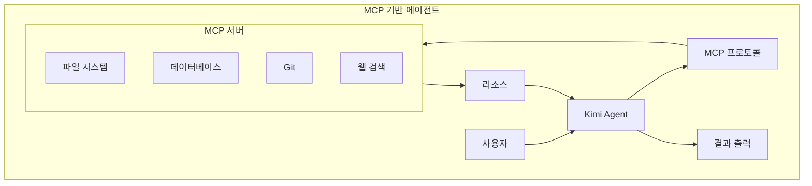

# Kimi 바이브코딩 가이드

> Moonshot AI의 Kimi(K2 모델 기반)를 활용한 바이브코딩 전문 가이드
> 장문 컨텍스트 처리, 멀티모달 기능, 코딩 특화 기능을 활용한 실전 개발 방법론

---

## 목차

1. [Kimi 개요](#1-kimi-개요)
2. [핵심 특징](#2-핵심-특징)
3. [설치 및 설정](#3-설치-및-설정)
4. [바이브코딩 워크플로우](#4-바이브코딩-워크플로우)
5. [장문 컨텍스트 활용법](#5-장문-컨텍스트-활용법)
6. [코딩 특화 기능](#6-코딩-특화-기능)
7. [멀티모달 활용](#7-멀티모달-활용)
8. [프롬프트 엔지니어링](#8-프롬프트-엔지니어링)
9. [MCP 서버 연동 및 에이전트 기능](#9-mcp-서버-연동-및-에이전트-기능)
10. [디버깅 & 트러블슈팅](#10-디버깅--트러블슈팅)
11. [실전 예시 프롬프트 모음](#11-실전-예시-프롬프트-모음)
12. [모범 사례 & 안티패턴](#12-모범-사례--안티패턴)
13. [Claude Code vs Codex vs Kimi 비교](#13-claude-code-vs-codex-vs-kimi-비교)
14. [참고 자료](#14-참고-자료)

---

## 1. Kimi 개요

### 1.1 Moonshot AI 소개

**Moonshot AI**는 2023년 중국에서 설립된 AI 스타트업으로, 장문 컨텍스트 처리(Long Context)에 특화된 대규모 언어 모델을 개발합니다. "Kimi"는 Moonshot AI의 플래그십 AI 어시스턴트 브랜드입니다.

**주요 특징:**
- **K2 모델**: 최신 Kimi 모델 시리즈 (K2.5 등)
- **오픈소스 MoE 아키텍처**: Mixture of Experts (MoE) 기반 효율적 추론
- **초장문 컨텍스트**: 128K~200K+ 토큰 처리 능력 (표준), 최대 2M 토큰 지원
- **강력한 중국어/영어 이해**: 양방향 번역 및 코드 생성에 탁월

### 1.2 K2 모델 아키텍처


**MoE (Mixture of Experts) 장점:**
- **효율성**: 각 입력에 대해 일부 Expert만 활성화되어 계산 효율 향상
- **확장성**: Expert 수를 늘려 모델 용량 확장 가능
- **전문화**: 각 Expert가 특정 도메인(코딩, 수학, 창작 등)에 최적화

### 1.3 Kimi 제품 라인업

| 제품 | 설명 | 접근 방식 |
|------|------|-----------|
| **Kimi Chat** | 웹/모바일 기반 채팅 인터페이스 | 브라우저, iOS/Android 앱 |
| **Kimi API** | 프로그래매틱 API 접근 | REST API, SDK |
| **Kimi Code** | IDE 통합 개발 환경 | VS Code 확장, CLI |
| **Kimi Browser** | 웹 브라우저 내장 AI | Chrome 확장 |

---

## 2. 핵심 특징

### 2.1 장문 컨텍스트 (Long Context Window)

Kimi의 가장 강력한 차별화 기능은 **초장문 컨텍스트 처리** 능력입니다.

| 모델 | 컨텍스트 윈도우 | 실제 활용 예시 |
|------|-----------------|----------------|
| Kimi K2.5 | 128K tokens | 대형 코드베이스 분석, 문서 요약 |
| Kimi K2.5 Extended | 256K tokens | 전체 프로젝트 컨텍스트 유지 |
| Kimi Research | 2M tokens | 대용량 논문, 전체 리포지토리 분석 |

**실전 활용 시나리오:**


### 2.2 멀티모달 기능

Kimi는 텍스트 외에도 다양한 미디어 형식을 처리합니다.

**지원 형식:**
- **이미지**: PNG, JPG, WebP, GIF (스크린샷, 다이어그램, UI 디자인)
- **문서**: PDF, DOCX, TXT, Markdown (기술 문서, 논문, 스펙)
- **코드 파일**: 직접 업로드하여 분석 및 수정

**코딩 활용 예시:**


### 2.3 에이전트 기능 (Agentic AI)

Kimi는 도구 사용(Tool Use)과 자율적 태스크 수행 능력을 갖추고 있습니다.

**에이전드 기능:**
- **웹 검색**: 실시간 정보 검색 및 인용
- **코드 실행**: Python 코드 실행 및 결과 분석
- **파일 처리**: 업로드된 파일 분석 및 변환
- **API 호출**: 외부 서비스와 연동


### 2.4 다국어 지원

Kimi는 중국어, 영어, 한국어를 포함한 다국어에 강합니다.

| 언어 | 코드 생성 | 문서 이해 | 주석 작성 |
|------|-----------|-----------|-----------|
| 중국어 | ★★★★★ | ★★★★★ | ★★★★★ |
| 영어 | ★★★★★ | ★★★★★ | ★★★★★ |
| 한국어 | ★★★★☆ | ★★★★☆ | ★★★★☆ |

**활용 팁:**
- 중국어 기술 문서/논문 분석에 탁월
- 한국어 프롬프트도 충분히 효과적
- 영어-중국어-한국어 간 코드 주석 변환 가능

---

## 3. 설치 및 설정

### 3.1 Kimi Chat 웹/앱 접근

**웹 브라우저:**
```
https://kimi.moonshot.cn
```

**모바일 앱:**
- iOS: App Store에서 "Kimi AI" 검색
- Android: Google Play 또는 공식 웹사이트 APK

**기본 설정:**
1. 계정 생성 (이메일/전화번호)
2. API 키 발급 (개발자 설정 메뉴)
3. 테마/언어 설정

### 3.2 API 접근 설정

**Python SDK 설치:**

```bash
pip install openai  # Kimi는 OpenAI 호환 API 제공
```

**API 클라이언트 설정:**

```python
from openai import OpenAI

client = OpenAI(
    api_key="your-kimi-api-key",
    base_url="https://api.moonshot.cn/v1"
)

# 기본 채팅 완료
response = client.chat.completions.create(
    model="kimi-k2.5",
    messages=[
        {"role": "system", "content": "You are a helpful coding assistant."},
        {"role": "user", "content": "Python으로 quick sort를 구현해줘"}
    ],
    temperature=0.3
)

print(response.choices[0].message.content)
```

**환경 변수 설정:**

```bash
# .bashrc 또는 .zshrc
export KIMI_API_KEY="your-kimi-api-key"
```

### 3.3 VS Code 확장 (비공식)

Kimi 공식 VS Code 확장은 아직 제공되지 않지만, OpenAI 호환 API를 활용한 확장 사용 가능:

```json
// settings.json
{
  "openai.apiKey": "your-kimi-api-key",
  "openai.baseUrl": "https://api.moonshot.cn/v1",
  "openai.model": "kimi-k2.5"
}
```

### 3.4 CLI 도구 설정

**커스텀 CLI 스크립트:**

```python
#!/usr/bin/env python3
# kimi-cli.py

import os
import sys
from openai import OpenAI

def kimi_chat(prompt, model="kimi-k2.5"):
    client = OpenAI(
        api_key=os.getenv("KIMI_API_KEY"),
        base_url="https://api.moonshot.cn/v1"
    )
    
    response = client.chat.completions.create(
        model=model,
        messages=[
            {"role": "system", "content": "You are an expert programmer."},
            {"role": "user", "content": prompt}
        ],
        temperature=0.3,
        max_tokens=4000
    )
    
    return response.choices[0].message.content

if __name__ == "__main__":
    prompt = sys.argv[1] if len(sys.argv) > 1 else input("Prompt: ")
    print(kimi_chat(prompt))
```

```bash
# 사용 예시
chmod +x kimi-cli.py
./kimi-cli.py "Python decorator 패턴 예시 코드"
```

---

## 4. 바이브코딩 워크플로우

### 4.1 Kimi 기반 바이브코딩 사이클


### 4.2 단계별 워크플로우

**Phase 1: 컨텍스트 준비**

```markdown
1. 프로젝트 문서 업로드 (README, API 문서 등)
2. 기존 코드베이스 압축 업로드 (zip)
3. 디자인 스크린샷/와이어프레임 업로드
4. 기술 스택 명시
```

**Phase 2: 요구사항 명시**

```markdown
[GOAL] 구현할 기능의 명확한 목표
[STACK] 사용 기술 (React, TypeScript, Node.js 등)
[CONSTRAINTS] 제약조건 (성능, 보안, 호환성)
[EXAMPLE] 참고 예시나 유사 구현
```

**Phase 3: 반복적 개발**

```markdown
1. 작은 단위로 기능 분해
2. 한 번에 하나의 컴포넌트/함수 구현
3. 각 단계별 테스트 및 검증
4. 피드백을 바탕으로 정제
```

### 4.3 파일 기반 워크플로우

대용량 컨텍스트를 효과적으로 활용하기 위한 파일 관리 방식:


**프로젝트 컨텍스트 템플릿:**

```markdown
# Project Context

## 개요
- 프로젝트명: [이름]
- 목적: [목적 설명]
- 타겟 사용자: [사용자 유형]

## 기술 스택
- Frontend: [기술 목록]
- Backend: [기술 목록]
- Database: [DB 종류]
- Infrastructure: [인프라]

## 아키텍처
- 패턴: [MVC, MVVM, Clean Architecture 등]
- 주요 모듈: [모듈 목록]

## 현재 상태
- 완료된 기능: [목록]
- 진행 중: [목록]
- 알려진 이슈: [목록]

## 코딩 규칙
- 스타일 가이드: [링크/설명]
- 네이밍 컨벤션: [규칙]
- 테스트 요구사항: [커버리지 등]
```

---

## 5. 장문 컨텍스트 활용법

### 5.1 전체 코드베이스 분석

Kimi의 128K+ 컨텍스트 윈도우를 활용한 코드베이스 분석:

**코드베이스 압축 및 업로드:**

```bash
# 프로젝트 압축 (불필요한 파일 제외)
zip -r codebase.zip . \
  -x "node_modules/*" \
  -x ".git/*" \
  -x "dist/*" \
  -x "build/*" \
  -x "*.log"
```

**분석 프롬프트:**

```markdown
이 코드베이스를 분석해줘:

1. 전체 아키텍처 파악
   - 사용된 디자인 패턴
   - 모듈/컴포넌트 구조
   - 데이터 흐름

2. 코드 품질 평가
   - 잠재적 버그나 이슈
   - 리팩토링 기회
   - 보안 취약점

3. 개선 제안
   - 성능 최적화 방안
   - 가독성 개선
   - 테스트 커버리지

결과를 마크다운 형식으로 정리해줘.
```

### 5.2 문서 일괄 처리

대량의 문서를 한 번에 처리하는 방법:


**일괄 처리 프롬프트:**

```markdown
업로드한 5개의 API 문서를 분석해줘:

1. 공통 패턴 추출
   - 인증 방식
   - 에러 응답 형식
   - 페이징 처리

2. 일관성 검토
   - 네이밍 규칙 차이
   - 누락된 필드
   - 버전 차이

3. 통합 API 문서 초안 작성
   - 표준화된 형식
   - 통합 예시 코드
```

### 5.3 장문 컨텍스트 최적화

**컨텍스트 윈도우 효율적 사용:**

```markdown
1. 관련 파일만 선택
   - 현재 작업과 직접 관련된 파일
   - 인터페이스/타입 정의
   - 유사 구현 예시

2. 요약 활용
   - 긴 파일은 핵심 부분만 추출
   - 이전 대화 요약 참조

3. 계층적 접근
   - 상위 레벨 아키텍처 먼저
   - 세부 구현은 단계적으로
```

**컨텍스트 관리 전략:**

```python
# context_manager.py - 컨텍스트 압축 예시

import tiktoken

def estimate_tokens(text, model="gpt-4"):
    """텍스트의 토큰 수 추정"""
    encoding = tiktoken.encoding_for_model(model)
    return len(encoding.encode(text))

def truncate_context(text, max_tokens=100000, model="gpt-4"):
    """컨텍스트를 최대 토큰 수로 제한"""
    encoding = tiktoken.encoding_for_model(model)
    tokens = encoding.encode(text)
    
    if len(tokens) <= max_tokens:
        return text
    
    # 중요 부분 보존 (처음과 끝)
    half_limit = max_tokens // 2
    truncated = tokens[:half_limit] + tokens[-half_limit:]
    return encoding.decode(truncated)

# 사용 예시
with open("large_codebase.txt", "r") as f:
    content = f.read()

print(f"원본 토큰 수: {estimate_tokens(content)}")
optimized = truncate_context(content, max_tokens=120000)
print(f"최적화 후 토큰 수: {estimate_tokens(optimized)}")
```

---

## 6. 코딩 특화 기능

### 6.1 코드 생성

Kimi의 코드 생성 능력을 최대화하는 프롬프트 패턴:

**구조화된 코드 생성:**

```markdown
[언어] TypeScript
[프레임워크] React 18 + hooks
[목적] 사용자 인증 폼 컴포넌트

요구사항:
1. 이메일/비밀번호 입력 필드
2. 실시간 유효성 검증
3. 로딩 상태 처리
4. 에러 메시지 표시
5. 접근성 지원 (ARIA)

출력 형식:
- 완전한 함수 컴포넌트
- TypeScript 타입 정의
- JSDoc 주석 포함
- 사용 예시 코드
```

**생성 예시:**

```typescript
import React, { useState, useCallback } from 'react';

interface AuthFormData {
  email: string;
  password: string;
}

interface AuthFormErrors {
  email?: string;
  password?: string;
}

interface LoginFormProps {
  onSubmit: (data: AuthFormData) => Promise<void>;
  isLoading?: boolean;
}

/**
 * 사용자 로그인 폼 컴포넌트
 * 
 * @example
 * ```tsx
 * <LoginForm 
 *   onSubmit={async (data) => await login(data)}
 *   isLoading={isLoggingIn}
 * />
 * ```
 */
export const LoginForm: React.FC<LoginFormProps> = ({ 
  onSubmit, 
  isLoading = false 
}) => {
  const [formData, setFormData] = useState<AuthFormData>({
    email: '',
    password: ''
  });
  const [errors, setErrors] = useState<AuthFormErrors>({});
  const [touched, setTouched] = useState<Record<string, boolean>>({});

  const validateField = useCallback((name: keyof AuthFormData, value: string): string | undefined => {
    switch (name) {
      case 'email':
        if (!value) return '이메일을 입력해주세요';
        if (!/^[^\s@]+@[^\s@]+\.[^\s@]+$/.test(value)) {
          return '올바른 이메일 형식이 아닙니다';
        }
        return undefined;
      case 'password':
        if (!value) return '비밀번호를 입력해주세요';
        if (value.length < 8) return '비밀번호는 8자 이상이어야 합니다';
        return undefined;
      default:
        return undefined;
    }
  }, []);

  const handleChange = useCallback((e: React.ChangeEvent<HTMLInputElement>) => {
    const { name, value } = e.target;
    setFormData(prev => ({ ...prev, [name]: value }));
    
    if (touched[name]) {
      const error = validateField(name as keyof AuthFormData, value);
      setErrors(prev => ({ ...prev, [name]: error }));
    }
  }, [touched, validateField]);

  const handleBlur = useCallback((e: React.FocusEvent<HTMLInputElement>) => {
    const { name, value } = e.target;
    setTouched(prev => ({ ...prev, [name]: true }));
    const error = validateField(name as keyof AuthFormData, value);
    setErrors(prev => ({ ...prev, [name]: error }));
  }, [validateField]);

  const handleSubmit = useCallback(async (e: React.FormEvent) => {
    e.preventDefault();
    
    // 전체 폼 유효성 검사
    const newErrors: AuthFormErrors = {};
    (Object.keys(formData) as Array<keyof AuthFormData>).forEach(key => {
      const error = validateField(key, formData[key]);
      if (error) newErrors[key] = error;
    });
    
    setErrors(newErrors);
    setTouched({ email: true, password: true });
    
    if (Object.keys(newErrors).length === 0) {
      await onSubmit(formData);
    }
  }, [formData, onSubmit, validateField]);

  return (
    <form onSubmit={handleSubmit} noValidate>
      <div className="form-group">
        <label htmlFor="email">이메일</label>
        <input
          id="email"
          name="email"
          type="email"
          value={formData.email}
          onChange={handleChange}
          onBlur={handleBlur}
          aria-invalid={!!errors.email}
          aria-describedby={errors.email ? 'email-error' : undefined}
          disabled={isLoading}
        />
        {errors.email && (
          <span id="email-error" className="error" role="alert">
            {errors.email}
          </span>
        )}
      </div>

      <div className="form-group">
        <label htmlFor="password">비밀번호</label>
        <input
          id="password"
          name="password"
          type="password"
          value={formData.password}
          onChange={handleChange}
          onBlur={handleBlur}
          aria-invalid={!!errors.password}
          aria-describedby={errors.password ? 'password-error' : undefined}
          disabled={isLoading}
        />
        {errors.password && (
          <span id="password-error" className="error" role="alert">
            {errors.password}
          </span>
        )}
      </div>

      <button type="submit" disabled={isLoading}>
        {isLoading ? '로그인 중...' : '로그인'}
      </button>
    </form>
  );
};
```

### 6.2 코드 리뷰

Kimi를 활용한 체계적인 코드 리뷰:

**리뷰 프롬프트:**

```markdown
다음 코드를 리뷰해줘:

```python
[코드 붙여넣기]
```

리뷰 관점:
1. 버그/오류 가능성
2. 성능 이슈
3. 보안 취약점
4. 가독성/유지보수성
5. Pythonic한 코드 여부
6. 테스트 용이성

각 항목별로:
- 심각도 (Critical/Major/Minor)
- 문제 설명
- 개선 제안 (코드 포함)
```

**리뷰 응답 예시 구조:**

```markdown
## 코드 리뷰 결과

### 1. 버그/오류
**심각도**: Critical
**위치**: 함수명, 라인 N
**문제**: [설명]
**제안**: ```개선 코드```

### 2. 성능
...

### 3. 보안
...
```

### 6.3 디버깅

Kimi를 활용한 효과적인 디버깅:

**디버깅 프롬프트 패턴:**

```markdown
[문제 상황]
- 오류 메시지: [전체 스택 트레이스]
- 예상 동작: [기대 결과]
- 실제 동작: [현재 결과]
- 환경: [OS, 언어 버전, 라이브러리 버전]

[관련 코드]
```
[최소 재현 가능한 코드]
```

분석 요청:
1. 오류 원인 진단
2. 해결 방안 (여러 옵션)
3. 재발 방지를 위한 제안
```

**디버깅 워크플로우:**


### 6.4 리팩토링

**리팩토링 요청 패턴:**

```markdown
[목표] 이 코드를 리팩토링해줘

[원칙]
- SOLID 원칙 준수
- DRY 원칙 적용
- 가독성 향상
- 성능 유지/개선

[제약]
- 외부 인터페이스 변경 금지
- 기존 테스트 통과 필요
- Python 3.9+ 호환

[코드]
```
[리팩토링 대상 코드]
```

출력:
1. 변경 사항 요약
2. 리팩토링된 코드
3. 변경 이유 설명
```

---

## 7. 멀티모달 활용

### 7.1 스크린샷 기반 UI 구현

Kimi의 이미지 이해 능력을 활용한 UI 개발:

**프롬프트 패턴:**

```markdown
이 스크린샷을 보고 동일한 UI를 구현해줘:

[스크린샷 업로드]

요구사항:
1. 정확한 레이아웃 복제
2. 색상/폰트/간격 일치
3. 반응형 고려
4. 접근성 속성 포함
5. [React/Vue/HTML]로 구현

출력:
- 구현 코드
- 사용된 색상 팔레트
- 폰트 스택
- 주의사항
```

**UI 분석 구조:**


### 7.2 다이어그램 해석

아키텍처 다이어그램을 코드로 변환:

**다이어그램 분석 프롬프트:**

```markdown
이 아키텍처 다이어그램을 분석해줘:

[다이어그램 이미지 업로드]

요청:
1. 다이어그램 요약 (텍스트로 설명)
2. 컴포넌트 식별 및 역할
3. 데이터 흐름 분석
4. 구현을 위한 제안
   - 사용할 기술 스택
   - 폴더 구조
   - 주요 인터페이스

출력 형식: 마크다운
```

### 7.3 문서 스캔 및 변환

스캔된 문서나 PDF에서 코드/스펙 추출:

```markdown
이 PDF 문서에서 다음을 추출해줘:

[PDF 업로드]

추출 항목:
1. API 엔드포인트 목록
2. 요청/응답 스키마
3. 에러 코드
4. 인증 방식

출력 형식:
- OpenAPI/Swagger 형식으로 변환
- 또는 구조화된 마크다운 테이블
```

---

## 8. 프롬프트 엔지니어링

### 8.1 Kimi 전용 프롬프트 패턴

Kimi의 특성을 고려한 프롬프트 설계:

**1. 명확한 구조화:**

```markdown
[역할]
당신은 시니어 [언어] 개발자입니다.

[컨텍스트]
- 프로젝트: [설명]
- 기술 스택: [목록]
- 관련 파일: [파일명]

[작업]
[구체적인 요청]

[제약조건]
- [제약 1]
- [제약 2]

[출력 형식]
[원하는 출력 구조]
```

**2. 단계적 사고 유도:**

```markdown
다음 단계로 생각해줘:
1. 먼저 문제를 분석하고
2. 가능한 접근법을 나열한 후
3. 최적의 해결책을 선택하고
4. 코드로 구현해줘

각 단계별로 생각 과정을 설명해줘.
```

**3. Few-shot 예시 제공:**

```markdown
다음 패턴을 따라 구현해줘:

예시 1:
입력: [예시 입력]
출력: [예시 출력]

예시 2:
입력: [예시 입력]
출력: [예시 출력]

이제 이 패턴으로 구현해줘:
[실제 요청]
```

### 8.2 다국어 활용 전략

Kimi의 다국어 능력을 활용한 프롬프트:

**중국어 기술 문서 활용:**

```markdown
이 중국어 기술 문서를 분석하고 핵심 내용을 한국어로 요약해줘:

[중국어 문서 업로드]

요약 항목:
1. 아키텍처 개요
2. 주요 기능
3. API 명세
4. 구현 예시
```

**영어-한국어 코드 주석 변환:**

```markdown
이 코드의 주석을 한국어로 번역해줘:

```python
[영어 주석이 포함된 코드]
```

요구사항:
- 기술 용어는 영어 유지
- 자연스러운 한국어 표현 사용
- Docstring 형식 유지
```

### 8.3 컨텍스트 관리 패턴

**대화 컨텍스트 유지:**

```markdown
이전 대화 요약:
- 작업 중인 기능: [요약]
- 결정된 사항: [목록]
- 다음 단계: [설명]

이제 다음을 구현해줘:
[새로운 요청]
```

**체인 오브 생각 (Chain of Thought):**

```markdown
복잡한 문제 해결을 위해 다음 방식으로 접근해줘:

1. 문제 분해
   - 하위 문제로 나누기
   - 의존성 파악

2. 각 하위 문제 해결
   - 접근법 설명
   - 코드 구현

3. 통합
   - 전체 솔루션 조립
   - 테스트 케이스

시작하자.
```

---

## 9. MCP 서버 연동 및 에이전트 기능

### 9.1 MCP (Model Context Protocol) 개요

MCP는 AI 모델이 외부 도구와 상호작용하기 위한 표준 프로토콜입니다.


### 9.2 Kimi와 MCP 연동

**MCP 서버 설정:**

```json
// mcp-config.json
{
  "mcpServers": {
    "filesystem": {
      "command": "npx",
      "args": ["-y", "@modelcontextprotocol/server-filesystem", "/path/to/project"]
    },
    "sqlite": {
      "command": "uvx",
      "args": ["mcp-server-sqlite", "--db-path", "/path/to/db.sqlite"]
    },
    "github": {
      "command": "npx",
      "args": ["-y", "@modelcontextprotocol/server-github"],
      "env": {
        "GITHUB_PERSONAL_ACCESS_TOKEN": "${GITHUB_TOKEN}"
      }
    }
  }
}
```

**Python MCP 클라이언트 예시:**

```python
# kimi_mcp_client.py

import asyncio
from mcp import ClientSession, StdioServerParameters
from mcp.client.stdio import stdio_client

class KimiMCPClient:
    def __init__(self, api_key: str):
        self.api_key = api_key
        self.session = None
    
    async def connect_to_server(self, server_params: StdioServerParameters):
        """MCP 서버에 연결"""
        self.stdio, self.write = await stdio_client(server_params)
        self.session = await ClientSession(self.stdio, self.write).__aenter__()
        await self.session.initialize()
    
    async def list_tools(self):
        """사용 가능한 도구 목록"""
        return await self.session.list_tools()
    
    async def call_tool(self, tool_name: str, arguments: dict):
        """도구 호출"""
        return await self.session.call_tool(tool_name, arguments)
    
    async def read_file(self, path: str):
        """파일 읽기 도구"""
        return await self.call_tool("read_file", {"path": path})
    
    async def write_file(self, path: str, content: str):
        """파일 쓰기 도구"""
        return await self.call_tool("write_file", {
            "path": path,
            "content": content
        })

# 사용 예시
async def main():
    server_params = StdioServerParameters(
        command="npx",
        args=["-y", "@modelcontextprotocol/server-filesystem", "."]
    )
    
    client = KimiMCPClient(api_key="your-api-key")
    await client.connect_to_server(server_params)
    
    # 도구 목록 확인
    tools = await client.list_tools()
    print("Available tools:", [t.name for t in tools.tools])
    
    # 파일 읽기
    result = await client.read_file("README.md")
    print(result)

if __name__ == "__main__":
    asyncio.run(main())
```

### 9.3 에이전트 워크플로우

**자율적 코딩 에이전트:**


---

## 10. 디버깅 & 트러블슈팅

### 10.1 환각 대응

Kimi의 환각(Hallucination)을 최소화하는 방법:

**1. 구체적 컨텍스트 제공:**

```markdown
❌ 나쁜 예:
"이 함수가 안 돼. 고쳐줘."

✅ 좋은 예:
"Python 3.11 환경에서 다음 함수 실행 시 
TypeError: 'NoneType' object is not iterable 오류 발생.

```python
def process_data(data):
    return [item.strip() for item in data.split(',')]
```

입력: None (데이터베이스에서 조회 결과)
예상: [] 또는 오류 메시지
실제: TypeError"
```

**2. 검증 요청:**

```markdown
코드를 생성한 후, 다음을 확인해줘:
1. 모든 변수가 정의되었는지
2. 임포트가 누락되지 않았는지  
3. 문법 오류는 없는지
4. 타입 일관성이 있는지
```

### 10.2 컨텍스트 관리

**컨텍스트 윈도우 한계 대응:**

```markdown
문제: 대화가 길어지면 이전 내용을 잊어버림

해결책:
1. 주요 결정사항을 요약하여 반복
2. 파일로 컨텍스트 관리
3. 새 대화로 전환 시 요약 제공
```

**컨텍스트 리셋 전략:**

```markdown
새 대화 시작 시:

"이전 대화에서 작업 중이던 내용:
- 프로젝트: [요약]
- 완료된 작업: [목록]
- 현재 작업: [설명]
- 관련 파일: [목록]

이어서 진행하자."
```

### 10.3 출력 일관성

**일관된 출력 확보:**

```markdown
출력 형식을 엄격히 지켜줘:

```json
{
  "analysis": "분석 내용",
  "solution": "해결책",
  "code": "코드 블록",
  "warnings": ["주의사항"]
}
```

형식을 벗어나는 설명은 금지.
```

**temperature 설정:**

```python
# 일관성이 중요할 때 (버그 수정, 리팩토링)
temperature=0.1

# 창의성이 필요할 때 (새 기능 설계)
temperature=0.7
```

---

## 11. 실전 예시 프롬프트 모음

### 11.1 기능 개발

**API 엔드포인트 생성:**

```markdown
[목표] REST API 엔드포인트 구현

[스펙]
- 메서드: POST
- 경로: /api/v1/orders
- 인증: JWT Bearer 토큰 필요
- 요청 본문:
  ```json
  {
    "userId": "string",
    "items": [{"productId": "string", "quantity": number}],
    "shippingAddress": "string"
  }
  ```

[기술 스택]
- Node.js + Express
- TypeScript
- Prisma ORM
- PostgreSQL

[요구사항]
1. 입력 유효성 검증 (Zod)
2. 트랜잭션 처리
3. 에러 핸들링
4. 단위 테스트 (Jest)

[출력]
- 컨트롤러 코드
- 서비스 로직
- Prisma 스키마 (필요시)
- 테스트 코드
```

**React 컴포넌트 개발:**

```markdown
[컴포넌트] DataTable

[기능]
- 정렬 (클릭 시 컬럼별)
- 페이징
- 검색/필터
- 행 선택 (체크박스)

[프롭스]
```typescript
interface DataTableProps<T> {
  data: T[];
  columns: ColumnDef<T>[];
  onRowSelect?: (selected: T[]) => void;
  loading?: boolean;
  pagination?: {
    page: number;
    pageSize: number;
    total: number;
    onChange: (page: number) => void;
  };
}
```

[요구사항]
- TypeScript 제네릭 사용
- React hooks만 사용
- CSS-in-JS (styled-components)
- 스토리북 스토리 포함
- 접근성 지원
```

### 11.2 코드 분석

**레거시 코드 분석:**

```markdown
이 레거시 코드를 분석해줘:

[코드 업로드]

분석 항목:
1. 현재 동작 설명
2. 기술 부채 식별
3. 리팩토링 우선순위
4. 점진적 개선 로드맵
5. 위험 요소
```

**성능 분석:**

```markdown
이 코드의 성능을 분석해줘:

[코드 업로드]

분석 관점:
1. 시간 복잡도
2. 공간 복잡도
3. 병목 지점
4. 최적화 기회
5. 빅오 표기법으로 개선 전/후 비교
```

### 11.3 문서화

**API 문서 생성:**

```markdown
이 코드를 기반으로 API 문서를 작성해줘:

[컨트롤러 코드 업로드]

출력 형식: OpenAPI 3.0
포함 항목:
- 엔드포인트 설명
- 요청/응답 스키마
- 에러 코드
- 예시
```

**README 생성:**

```markdown
이 프로젝트의 README를 작성해줘:

[코드베이스 업로드]

포함 항목:
1. 프로젝트 개요
2. 기술 스택
3. 설치 방법
4. 사용 방법
5. 프로젝트 구조
6. 환경 변수
7. 스크립트
8. 라이선스
```

---

## 12. 모범 사례 & 안티패턴

### 12.1 모범 사례 (10가지)

```markdown
1. 구체적인 컨텍스트 제공
   - 프로젝트 구조, 기술 스택, 관련 파일 명시

2. 작은 단위로 작업 분할
   - 한 번에 하나의 함수/컴포넌트 구현

3. 검증 단계 포함
   - 코드 생성 후 테스트 요청

4. 피드백 루프 활용
   - 결과 검토 후 정제 요청

5. 파일 기반 컨텍스트 관리
   - 긴 컨텍스트는 파일로 저장

6. 버전 명시
   - 언어/프레임워크 버전 명시

7. 예시 제공
   - 원하는 출력 형식의 예시 제공

8. 제약조건 명시
   - "하지 말아야 할 것" 명확히

9. 점진적 개발
   - PoC → 리뷰 → 완성

10. 문서화 병행
    - 코드와 함께 문서 생성
```

### 12.2 안티패턴 (10가지)

```markdown
1. ❌ 모호한 요청
   "이 코드 고쳐줘"

2. ❌ 과도한 한 번에 요청
   "전체 앱을 다시 만들어줘"

3. ❌ 컨텍스트 부재
   파일 없이 "이 프로젝트에서..."

4. ❌ 검증 생략
   생성된 코드를 바로 사용

5. ❌ 버전 미명시
   "Python으로..." (버전 불명)

6. ❌ 피드백 누락
   오류 발생 시 새로 시작

7. ❌ 과도한 의존
   AI 출력을 비판 없이 수용

8. ❌ 보안 무시
   민감한 코드를 그대로 사용

9. ❌ 테스트 부재
   테스트 없이 배포

10. ❌ 문서화 무시
    코드만 생성하고 문서는 나중
```

### 12.3 체크리스트

**코드 생성 전:**

```markdown
- [ ] 프로젝트 컨텍스트 준비
- [ ] 기술 스택 명시
- [ ] 요구사항 구체화
- [ ] 제약조건 정의
- [ ] 예시/참고 자료 준비
```

**코드 생성 후:**

```markdown
- [ ] 문법 오류 확인
- [ ] 임포트/의존성 확인
- [ ] 타입 일관성 확인
- [ ] 테스트 작성
- [ ] 문서 업데이트
- [ ] 보안 검토
```

---

## 13. Claude Code vs Codex vs Kimi 비교

### 13.1 기능 비교 테이블

| 기능 | Claude Code | Codex | Kimi |
|------|-------------|-------|------|
| **컨텍스트 윈도우** | 200K tokens | 128K tokens | 128K~2M tokens |
| **코딩 성능** | ★★★★★ | ★★★★★ | ★★★★☆ |
| **한국어 지원** | ★★★★☆ | ★★★☆☆ | ★★★★☆ |
| **중국어 지원** | ★★★☆☆ | ★★★☆☆ | ★★★★★ |
| **멀티모달** | 이미지 | 이미지 | 이미지, PDF, 문서 |
| **CLI 도구** | 공식 제공 | 공식 제공 | API/비공식 |
| **IDE 통합** | VS Code | VS Code, JetBrains | 제한적 |
| **가격** | $$ | $ | $ |
| **오픈소스** | x | x | MoE 아키텍처 공개 |

### 13.2 사용 시나리오별 추천

```markdown
Claude Code 선택 시:
- 복잡한 아키텍처 설계
- 대규모 코드베이스 리팩토링
- 보안/성능 중심 개발
- 영어 기반 프로젝트

Codex 선택 시:
- 빠른 프로토타이핑
- OpenAI 생태계 통합
- 비용 효율적 개발
- 다양한 언어 지원 필요

Kimi 선택 시:
- 초장문 컨텍스트 필요
- 중국어 문서/코드 작업
- 멀티모달 입력 활용
- 비용 효율적 장문 처리
```

### 13.3 워크플로우 통합


---

## 14. 참고 자료

### 14.1 공식 문서

- [Moonshot AI 공식 웹사이트](https://www.moonshot.cn)
- [Kimi API 문서](https://platform.moonshot.cn/docs)
- [K2 모델 기술 보고서](https://www.moonshot.cn/research)

### 14.2 커뮤니티 리소스

- [Kimi 개발자 커뮤니티](https://community.moonshot.cn)
- [GitHub - Kimi 관련 프로젝트](https://github.com/search?q=kimi+moonshot)
- [arXiv - Moonshot AI 논문](https://arxiv.org/search/?query=moonshot+ai)

### 14.3 바이브코딩 관련

- [바이브코딩 가이드 - 본 프로젝트](../vibe-coding-and-orchestration-guide.md)
- [12 Rules to Vibe Code Without Frustration](https://creatoreconomy.so/p/12-rules-to-vibe-code-without-frustration)
- [Awesome Vibe Coding Guide](https://github.com/analyticalrohit/awesome-vibe-coding-guide)

### 14.4 MCP 관련

- [Model Context Protocol 공식 문서](https://modelcontextprotocol.io)
- [MCP 서버 리스트](https://github.com/modelcontextprotocol/servers)
- [MCP Python SDK](https://github.com/modelcontextprotocol/python-sdk)

---

## 부록: Mermaid 다이어그램 모음

### A. Kimi 아키텍처 다이어그램


### B. 바이브코딩 워크플로우


### C. 장문 컨텍스트 활용


### D. 멀티모달 처리


### E. MCP 통합 아키텍처



---

*본 문서는 Kimi K2.5 기준으로 작성되었습니다. 최신 정보는 Moonshot AI 공식 문서를 참조하세요.*

*작성일: 2026-02-22*
*버전: 1.0*
